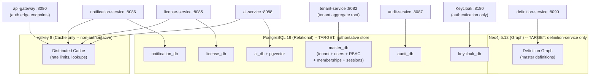
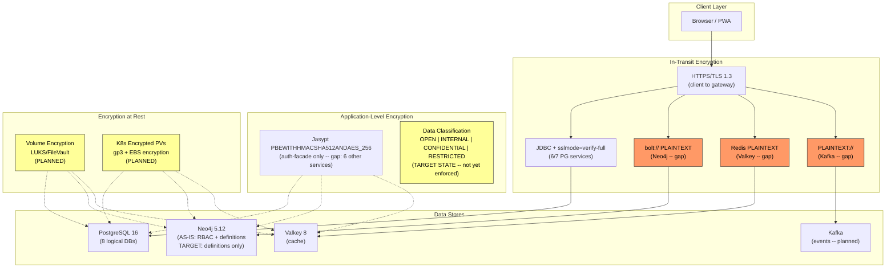
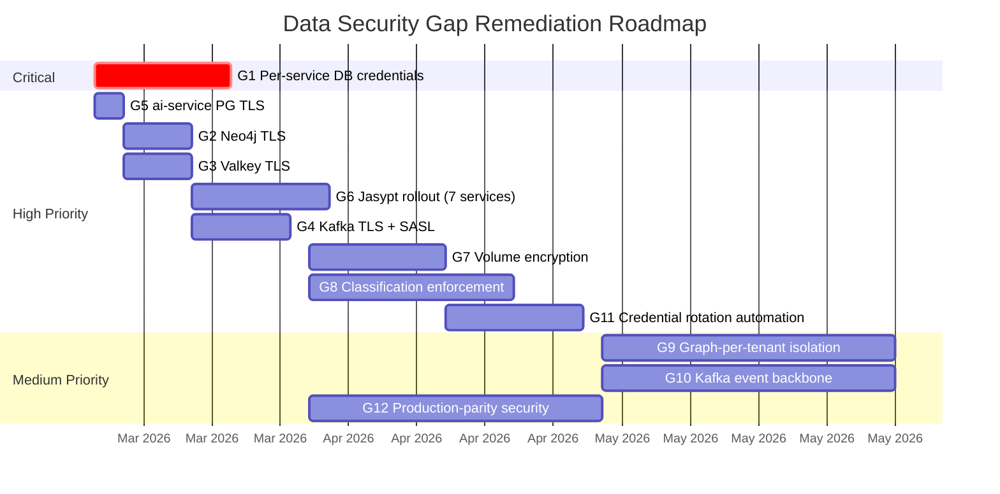

> **WP-ARCH-ALIGN (2026-03-24):** This document has been updated to reflect the frozen auth target model (Rev 2).
> See `Foundation/03-ownership-boundaries.md` FROZEN for the canonical decision.

# 03. Data Architecture (ADM Phase C - Data)

## 1. Document Control

| Field | Value |
|-------|-------|
| Status | Baselined |
| Owner | Architecture + Data |
| Last Updated | 2026-03-24 (WP-ARCH-ALIGN Rev 2) |
| Companion Documents | [ADR-001](../Architecture/09-architecture-decisions.md#911-polyglot-persistence-adr-001-adr-016), [ADR-017](../Architecture/09-architecture-decisions.md#914-data-classification-access-control-adr-017), [ADR-019](../Architecture/09-architecture-decisions.md#952-encryption-at-rest-strategy-adr-019), [ADR-020](../Architecture/09-architecture-decisions.md#953-service-credential-management-adr-020), [arc42/05 Building Blocks](../Architecture/05-building-blocks.md), [arc42/08 Crosscutting](../Architecture/08-crosscutting.md) |

## 2. Data Architecture Scope

This document defines the target and current-state data architecture for the EMSIST platform, covering:

- **Polyglot persistence strategy** -- which data stores serve which services and why.
- **Data ownership per service** -- each microservice owns its database; no shared schemas.
- **Data lifecycle and retention** -- how long data is kept and when it is archived or purged.
- **Data quality and governance** -- dimensions, metrics, and accountability.
- **Data security and privacy** -- classification, encryption (at rest and in transit), credential management, and compliance posture.
- **Gap analysis** -- verified delta between current state and target state.

Scope boundary: this document covers the data layer only. Application-layer security (RBAC, licensing, feature gates) is documented in [arc42/08 Crosscutting Concepts](../Architecture/08-crosscutting.md). Physical schema details are managed by the DBA agent and stored in service-specific migration directories.

## 3. Canonical Data Principles

Per [ADR-001](../Architecture/09-architecture-decisions.md#911-polyglot-persistence-adr-001-adr-016) (amended) and the polyglot persistence strategy:

- **Neo4j** [AS-IS] stores RBAC, identity graph, and provider configuration data (auth-facade only), plus master definition graph nodes (definition-service). [TARGET] Neo4j stores master definition graph nodes (definition-service) only. Auth-domain graph nodes (RBAC, identity, provider config) migrate to tenant-service on PostgreSQL. Auth-facade is removed after migration.
- **PostgreSQL** [AS-IS] stores relational domain data for 7 services (tenant, user, license, notification, audit, ai, process) and Keycloak internal persistence. [TARGET] PostgreSQL is the authoritative store for all domain data, including tenant users, RBAC, memberships, provider config, session control, and revocation (all under tenant-service). user-service entities migrate to tenant-service; user-service is removed.
- **Valkey 8** [TARGET] Cache only -- non-authoritative. Provides distributed caching for API gateway rate-limit/session edge state and service-level caching for license-service, notification-service, and ai-service.
- **Kafka** is planned for event-driven communication between services but is not yet wired (no `KafkaTemplate` usage exists in any service as of 2026-03-05).

Isolation rules:

- Tenant isolation is enforced in data access patterns: `tenant_id` column discrimination for PostgreSQL services; tenant-scoped Cypher predicates for Neo4j.
- Each service owns its logical database. Cross-service data access is via API calls only -- never direct database queries.
- Graph-per-tenant isolation (ADR-003) is accepted but **not yet implemented**; current state is simple column discrimination.

## 4. Entity and Ownership Catalog

### 4.1 Data Ownership Matrix

| Service | Primary Data | Database | Logical DB | Cache (Valkey) |
|---------|--------------|----------|------------|----------------|
| auth-facade | [AS-IS] Provider/realm config, RBAC graph (roles, groups, users), auth session metadata | [AS-IS] Neo4j | -- (graph) | Token blacklist, MFA pending tokens, session metadata | [TRANSITION] auth-facade is removed after migration; data migrates to tenant-service (PostgreSQL). |
| tenant-service | [AS-IS] Tenant, domain, branding, tenant security config, provisioning jobs. [TARGET] Tenant aggregate root + tenant users + RBAC + memberships + provider config + session control + revocation + session history. | PostgreSQL | `master_db` | -- |
| user-service | [AS-IS] User profile, session, device entities. [TRANSITION] Entities migrate to tenant-service; user-service is removed. | PostgreSQL | `user_db` | User profile cache |
| license-service | Tenant licenses, products/features, seat assignments | PostgreSQL | `license_db` | License/seat lookup cache |
| notification-service | Notification templates, delivery metadata | PostgreSQL | `notification_db` | Template cache |
| audit-service | Audit events, compliance metadata | PostgreSQL | `audit_db` | -- |
| ai-service | Agents, conversations, messages, knowledge embeddings (pgvector) | PostgreSQL | `ai_db` | Conversation context cache |
| definition-service | Master definition graph nodes and metadata | Neo4j | -- (graph) | -- |
| Keycloak | Realms, users, sessions, client configs (internal to Keycloak) | PostgreSQL | `keycloak_db` | -- |

Reference: [arc42/05 Section 5.3](../Architecture/05-building-blocks.md) for the authoritative data ownership table.

### 4.2 Data Ownership Diagram

**Target Data Ownership Diagram (Frozen Auth Target Model Rev 2):**

> **Note:** The as-is diagram differs: auth-facade (:8081) connects to a Neo4j RBAC graph and Valkey; user-service (:8083) connects to `user_db` (PostgreSQL). Both are [TRANSITION] services that will be removed. See the frozen auth target model for details.

### 4.3 Detailed Entity Catalog

Maintain and reference [artifacts/catalogs/data-entity-catalog.md](./artifacts/catalogs/data-entity-catalog.md) for the full entity-level breakdown per service.

## 5. Data Lifecycle and Retention

| Data Domain | System of Record | Retention Period | Archive/Deletion Rule |
|-------------|------------------|------------------|------------------------|
| Audit events | audit-service (`audit_db`) | 7 years (regulatory) | Archive to cold storage after 1 year; immutable -- no deletion permitted |
| User profiles | [AS-IS] user-service (`user_db`). [TARGET] tenant-service (`master_db`) — user-service is [TRANSITION], then removed. | Account lifetime + 30 days | Soft-delete on account deactivation; hard-delete after 30-day grace period |
| Auth sessions / tokens | [AS-IS] auth-facade (Valkey + Neo4j). [TARGET] tenant-service (PostgreSQL) for session history/revocation; Valkey for cache/TTL; Keycloak for token lifecycle. auth-facade is [TRANSITION], then removed. Neo4j removed from auth domain. | Session: 30 min idle / Token: 5 min access, 30 min refresh | Automatic TTL expiry in Valkey; Keycloak manages token lifecycle |
| Tenant configuration | tenant-service (`master_db`) | Indefinite (while tenant active) | Soft-delete on tenant deactivation; data retained for re-activation window (90 days) |
| License assignments | license-service (`license_db`) | License term + 1 year | Archive expired licenses; retain seat history for audit trail |
| Notifications | notification-service (`notification_db`) | 90 days (delivery metadata) | Purge delivery logs after 90 days; retain templates indefinitely |
| AI conversations | ai-service (`ai_db`) | 365 days | Purge conversations older than 1 year; embeddings retained while knowledge base is active |
| Keycloak internals | Keycloak (`keycloak_db`) | Managed by Keycloak | Keycloak handles its own session/token cleanup; realm data retained indefinitely |
| Definition graph | definition-service (Neo4j) | Indefinite | Versioned nodes; no hard deletion -- superseded nodes marked inactive |
| Cache entries | Valkey | TTL-governed (5 min - 30 min) | Automatic eviction by Valkey; no manual lifecycle management |

## 6. Data Quality and Governance

| Data Quality Dimension | Metric | Target | Owner | Validation Method |
|------------------------|--------|--------|-------|-------------------|
| Completeness | % of required fields populated per entity | >= 99% | Service owner (DEV) | Jakarta Bean Validation (`@NotBlank`, `@NotNull`) on DTOs; DB `NOT NULL` constraints |
| Accuracy | % of records matching source of truth | >= 99.5% | Service owner (DEV) + BA | Cross-service reconciliation checks (audit-service events vs source) |
| Consistency | Cross-service referential integrity score | >= 98% | SA + DBA | Eventual consistency via API contracts; tenant-ID correlation checks |
| Timeliness | Data propagation latency (source to consumer) | < 500ms (sync), < 5s (async) | DEV + DevOps | API response time SLOs; Kafka consumer lag monitoring [PLANNED] |
| Uniqueness | Duplicate record rate | < 0.01% | DBA | Unique constraints (DB-level); UUID primary keys prevent collision |
| Validity | % of records passing schema/format validation | >= 99.9% | DEV | Jakarta validation, Flyway migration constraints, OpenAPI schema validation |

### Governance Accountability

| Role | Responsibility |
|------|---------------|
| DBA Agent | Physical schema design, migration scripts, index optimization, query performance |
| SA Agent | Canonical data model, API contract data shapes, cross-service data flow design |
| BA Agent | Business domain model, data classification requirements, retention policy definition |
| DEV Agent | Entity implementation, validation annotations, repository patterns |
| SEC Agent | Encryption standards, credential management, data classification enforcement |

## 7. Data Security and Privacy

This is the critical section covering how data is protected at every layer of the stack. It references the detailed implementation evidence in [arc42/08 Crosscutting Concepts](../Architecture/08-crosscutting.md) (Sections 8.13-8.16).

### 7.1 Data Classification Model

Per [ADR-017](../Architecture/09-architecture-decisions.md#914-data-classification-access-control-adr-017), all data entities are assigned a classification level from a four-tier lattice. Classification drives access control, encryption requirements, and audit obligations.

| Level | Label | Description | Examples | Access Rule |
|-------|-------|-------------|----------|-------------|
| L0 | **OPEN** | Public or freely shareable data | Product catalog metadata, public tenant branding | No restriction beyond authentication |
| L1 | **INTERNAL** | Internal operational data, not for external disclosure | Tenant configuration, workflow definitions, notification templates | Authenticated user with valid tenant context |
| L2 | **CONFIDENTIAL** | Sensitive business or personal data | User profiles, license keys, seat assignments, AI conversation history | `user.clearanceLevel >= CONFIDENTIAL` + role + feature policy |
| L3 | **RESTRICTED** | Highly sensitive data subject to regulatory or contractual controls | Audit logs (immutable), credentials, encryption keys, national ID fields | `user.clearanceLevel >= RESTRICTED` + explicit role grant; field-level masking/redaction enforced |

Enforcement contract (from arc42/08 Section 8.3):

- A user may access resource data only when `user.clearanceLevel >= resource.classificationLevel` **and** role/feature policy also passes.
- If operation is allowed but data level exceeds field-level visibility policy, response uses masking/redaction instead of full value.
- **Backend is the authoritative enforcement plane.** [TARGET] tenant-service (PostgreSQL) is the authoritative RBAC and policy data store; Valkey is cache only. Frontend visibility rules are advisory only.
- Classification enforcement is `[TARGET STATE]` -- the policy filter/interceptor is not yet implemented.

### 7.2 Encryption at Rest

Reference: [ADR-019](../Architecture/09-architecture-decisions.md#952-encryption-at-rest-strategy-adr-019), [arc42/08 Section 8.13](../Architecture/08-crosscutting.md)

Data-at-rest encryption uses a two-layer strategy: volume-level encryption and application-level configuration encryption (Jasypt). No application query changes are required -- encryption is transparent to services.

#### 7.2.1 Volume-Level Encryption

| Data Store | Docker Compose (Dev/Staging) | Kubernetes (Production) | Status |
|------------|------------------------------|-------------------------|--------|
| PostgreSQL | LUKS/FileVault on host Docker data partition | Encrypted StorageClass PVs (e.g., `gp3` with EBS encryption) | `[PLANNED]` |
| Neo4j | LUKS/FileVault on host Docker data partition | Encrypted StorageClass PVs | `[PLANNED]` |
| Valkey | LUKS/FileVault on host Docker data partition | Encrypted StorageClass PVs | `[PLANNED]` |
| Kafka | LUKS/FileVault on host Docker data partition | Encrypted StorageClass PVs (Strimzi JBOD) | `[PLANNED]` |

#### 7.2.2 Configuration Encryption (Jasypt)

Application-level encryption of sensitive configuration values using Jasypt with `PBEWITHHMACSHA512ANDAES_256` algorithm.

| Service | Sensitive Config Values | Jasypt Status |
|---------|------------------------|---------------|
| auth-facade | Keycloak admin password, client secret, Neo4j password, Valkey password | `[IMPLEMENTED]` -- `JasyptConfig.java` with `PBEWITHHMACSHA512ANDAES_256` |
| ai-service | OpenAI/Anthropic API keys, DB password | `[PLANNED]` |
| tenant-service | DB password, Keycloak admin password | `[PLANNED]` |
| user-service | DB password | `[PLANNED]` |
| license-service | DB password, license signing key | `[PLANNED]` |
| notification-service | DB password, SMTP credentials | `[PLANNED]` |
| audit-service | DB password | `[PLANNED]` |

Evidence (auth-facade Jasypt -- the only service with Jasypt implemented):
- Config class: `backend/auth-facade/src/main/java/com/ems/auth/config/JasyptConfig.java`
- Algorithm: `PBEWITHHMACSHA512ANDAES_256`, 1000 iterations, `RandomSaltGenerator`, `RandomIvGenerator`
- Configuration: `backend/auth-facade/src/main/resources/application.yml` lines 48-56

### 7.3 In-Transit Encryption

Reference: [ADR-019](../Architecture/09-architecture-decisions.md#952-encryption-at-rest-strategy-adr-019), [arc42/08 Section 8.14](../Architecture/08-crosscutting.md)

All connections between application services and data stores should use TLS. Current coverage is inconsistent.

#### In-Transit Encryption Status Matrix

| Connection | Protocol | Status | Evidence / Gap |
|------------|----------|--------|----------------|
| tenant-service to PostgreSQL | JDBC + TLS | `[IMPLEMENTED]` | `sslmode=verify-full` in application.yml |
| user-service to PostgreSQL | JDBC + TLS | `[IMPLEMENTED]` | `sslmode=verify-full` in application.yml |
| license-service to PostgreSQL | JDBC + TLS | `[IMPLEMENTED]` | `sslmode=verify-full` in application.yml |
| notification-service to PostgreSQL | JDBC + TLS | `[IMPLEMENTED]` | `sslmode=verify-full` in application.yml |
| audit-service to PostgreSQL | JDBC + TLS | `[IMPLEMENTED]` | `sslmode=verify-full` in application.yml |
| process-service to PostgreSQL | JDBC + TLS | `[IMPLEMENTED]` | `sslmode=verify-full` in application.yml |
| Keycloak to PostgreSQL | JDBC + TLS | `[IMPLEMENTED]` | `sslmode=verify-full` |
| ai-service to PostgreSQL | JDBC | `[PLANNED]` | **No `sslmode` parameter in JDBC URL** -- must add `?sslmode=verify-full` |
| auth-facade to Neo4j | Bolt | `[PLANNED]` | **Plaintext `bolt://`** -- must migrate to `bolt+s://` with TLS policy |
| auth-facade to Valkey | Redis protocol | `[PLANNED]` | **No TLS config** -- must add `spring.data.redis.ssl.enabled=true` |
| ai-service to Valkey | Redis protocol | `[PLANNED]` | **No TLS config** -- must add `spring.data.redis.ssl.enabled=true` |
| All services to Kafka | Kafka protocol | `[PLANNED]` | **Plaintext `PLAINTEXT://`** listener -- must migrate to `SASL_SSL://` with JAAS config |

Summary: **7 of 12 connections are TLS-secured** (58%). All 6 active PostgreSQL services + Keycloak use `sslmode=verify-full`. The remaining 5 connections (ai-service to PG, Neo4j, Valkey x2, Kafka) are plaintext.

### 7.4 Credential Management

Reference: [ADR-020](../Architecture/09-architecture-decisions.md#953-service-credential-management-adr-020), [arc42/08 Section 8.16](../Architecture/08-crosscutting.md)

#### Current State (Verified)

All 7 PostgreSQL-backed services use the **shared `postgres` superuser** with the same hardcoded fallback password (`${DATABASE_PASSWORD:postgres}`). There is no rotation, no per-service isolation, and no fail-fast behavior on missing credentials.

| Service | Database User | Credential Source | Rotation | Status |
|---------|---------------|-------------------|----------|--------|
| tenant-service | `postgres` (shared superuser) | `${DATABASE_PASSWORD:postgres}` | None | `[PLANNED]` -- Target: `svc_tenant` |
| user-service | `postgres` (shared superuser) | `${DATABASE_PASSWORD:postgres}` | None | `[PLANNED]` -- Target: `svc_user` |
| license-service | `postgres` (shared superuser) | `${DATABASE_PASSWORD:postgres}` | None | `[PLANNED]` -- Target: `svc_license` |
| notification-service | `postgres` (shared superuser) | `${DATABASE_PASSWORD:postgres}` | None | `[PLANNED]` -- Target: `svc_notification` |
| audit-service | `postgres` (shared superuser) | `${DATABASE_PASSWORD:postgres}` | None | `[PLANNED]` -- Target: `svc_audit` |
| ai-service | `postgres` (shared superuser) | `${DATABASE_PASSWORD:postgres}` | None | `[PLANNED]` -- Target: `svc_ai` |
| process-service | `postgres` (shared superuser) | `${DATABASE_PASSWORD:postgres}` | None | `[PLANNED]` -- Target: `svc_process` |
| Keycloak | `keycloak` (dedicated user) | Dedicated credential | None | Only per-service user that exists |

#### Target State (Per ADR-020)

- Each service gets a dedicated PostgreSQL user with least-privilege grants (e.g., `svc_tenant` with `GRANT SELECT, INSERT, UPDATE, DELETE ON tenant_service_tables`).
- Authentication via SCRAM-SHA-256 (PostgreSQL 16 default).
- Credentials externalized to environment-specific `.env` files with **no hardcoded fallbacks** -- fail-fast on misconfiguration.
- Production: Kubernetes Secret rotation via External Secrets Operator with optional HashiCorp Vault lease TTL (90-day rotation).

### 7.5 Encryption and Security Layers Diagram

Legend: Orange = security gap (plaintext). Yellow = planned but not implemented.

### 7.6 Data Security Summary Scorecard

| Security Control | Target | Current State | Gap Severity |
|------------------|--------|---------------|-------------|
| Data classification enforcement | All resources classified and policy-enforced | Model defined (4 tiers); enforcement not implemented | **HIGH** |
| Encryption at rest (volume) | All data stores on encrypted volumes | No volume encryption configured | **HIGH** |
| Encryption at rest (config) | All services use Jasypt for secrets | Only auth-facade has Jasypt (1/8 services) | **HIGH** |
| In-transit TLS (PostgreSQL) | All 7 PG services use `sslmode=verify-full` | 6/7 implemented (ai-service missing) | **MEDIUM** |
| In-transit TLS (Neo4j) | `bolt+s://` with TLS policy | Plaintext `bolt://` | **HIGH** |
| In-transit TLS (Valkey) | `spring.data.redis.ssl.enabled=true` | No TLS on any Valkey connection | **HIGH** |
| In-transit TLS (Kafka) | `SASL_SSL://` with JAAS config | `PLAINTEXT://` listener | **HIGH** |
| Per-service DB credentials | Dedicated user per service with SCRAM-SHA-256 | Shared `postgres` superuser (7/7 services) | **CRITICAL** |
| Credential rotation | Automated rotation (90-day for prod) | No rotation mechanism exists | **HIGH** |
| Fail-fast on missing creds | No hardcoded fallback passwords | All services have `:postgres` fallback | **HIGH** |

## 8. Gap Analysis and Transition Notes

| # | Area | Baseline (Current State) | Target State | Work Package | Priority |
|---|------|--------------------------|--------------|--------------|----------|
| G1 | **Per-service DB credentials** | All 7 PG services share `postgres` superuser with hardcoded fallback | Dedicated users (`svc_tenant`, etc.) with SCRAM-SHA-256, no fallbacks | ADR-020 implementation: create PG users, update `.env` files, remove fallback defaults | **CRITICAL** |
| G2 | **Neo4j TLS** | auth-facade connects via plaintext `bolt://` | `bolt+s://` with TLS certificate verification | Configure Neo4j TLS, update auth-facade + definition-service connection strings | **HIGH** |
| G3 | **Valkey TLS** | No TLS on any Valkey connection (auth-facade, user-service, license-service, notification-service, ai-service, api-gateway) | `spring.data.redis.ssl.enabled=true` on all Valkey consumers | Configure Valkey TLS listener, update all consumer service configs | **HIGH** |
| G4 | **Kafka TLS** | Plaintext `PLAINTEXT://` listener in docker-compose | `SASL_SSL://` with JAAS config and per-service credentials | Configure Kafka TLS + SASL, update all producer/consumer configs | **HIGH** |
| G5 | **ai-service PostgreSQL TLS** | No `sslmode` parameter in JDBC URL | `sslmode=verify-full` matching other 6 services | Add `?sslmode=verify-full` to ai-service JDBC URL | **MEDIUM** |
| G6 | **Jasypt rollout** | Only auth-facade has Jasypt config encryption | All 7 remaining services encrypt sensitive config values | Add `JasyptConfig.java` + encrypted properties to each service | **HIGH** |
| G7 | **Volume encryption** | No volume-level encryption configured | LUKS/FileVault (dev/staging), encrypted StorageClass PVs (K8s prod) | Infrastructure work: configure host encryption, K8s storage classes | **HIGH** |
| G8 | **Data classification enforcement** | Classification model defined (4 tiers) but no runtime enforcement | Backend policy filter/interceptor enforces `clearanceLevel >= classificationLevel` | Implement classification interceptor, field-level masking/redaction | **HIGH** |
| G9 | **Graph-per-tenant isolation** | Simple `tenant_id` column discrimination (PG); tenant-scoped Cypher predicates (Neo4j) | True graph-per-tenant isolation per ADR-003 | Major architectural change -- requires Neo4j multi-database or separate instances | **MEDIUM** |
| G10 | **Kafka event backbone** | No `KafkaTemplate` usage in any service | Event-driven inter-service communication via Kafka topics | Implement producers/consumers per service, define topic schema | **MEDIUM** |
| G11 | **Credential rotation automation** | No rotation mechanism exists | Dev/Staging: quarterly manual; Production: 90-day automated via Vault + External Secrets Operator | Deploy Vault, configure ESO, create rotation scripts | **HIGH** |
| G12 | **Production-parity security** | Dev/Staging have weaker security posture than target production | Uniform security baseline across all environments per ADR-022 | Burn down `transport-security-allowlist.txt` entries; enforce via CI script | **MEDIUM** |

### Transition Roadmap (Recommended Order)

---

**Previous Section:** [02. Application Architecture](./02-application-architecture.md)
**Next Section:** [04. Technology Architecture](./04-technology-architecture.md)
