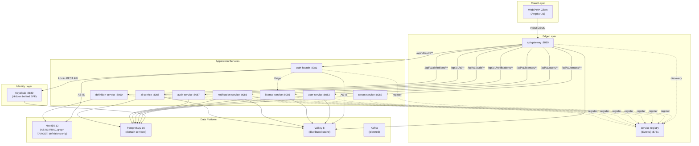
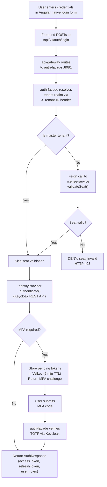
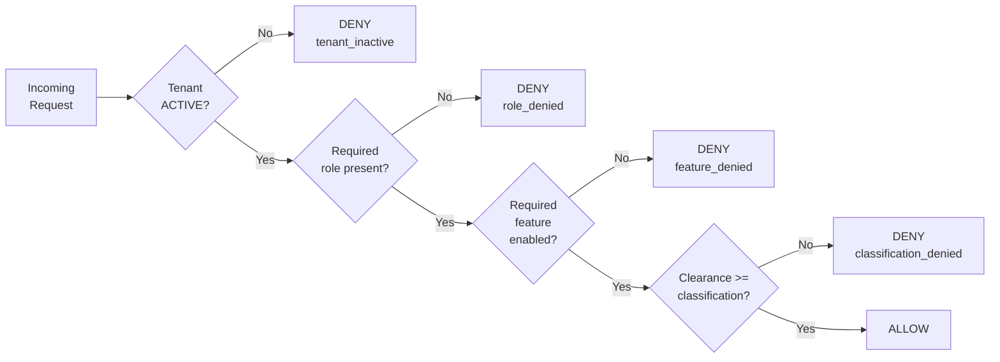

> **WP-ARCH-ALIGN (2026-03-24):** This document has been updated to reflect the frozen auth target model (Rev 2).
> See `Foundation/03-ownership-boundaries.md` FROZEN for the canonical decision.

# 04. Application Architecture (ADM Phase C - Application)

## 1. Document Control

| Field | Value |
|-------|-------|
| Status | Baselined |
| Owner | Architecture + Engineering |
| Last Updated | 2026-03-05 |
| Canonical Sources | [arc42/08-crosscutting.md](../Architecture/08-crosscutting.md), [ADR-004](../Architecture/09-architecture-decisions.md#931-keycloak-authentication-with-bff-pattern-adr-004), [ADR-007](../Architecture/09-architecture-decisions.md#932-provider-agnostic-auth-facade-adr-007), [ADR-014](../Architecture/09-architecture-decisions.md#936-rbac-and-licensing-integration-adr-014), [ADR-017](../Architecture/09-architecture-decisions.md#914-data-classification-access-control-adr-017) |
| Alignment | arc42 Sections 5, 6, 8; TOGAF ADM Phase C |

## 2. Application Portfolio Scope

The EMSIST application portfolio comprises 10 active runtime services plus supporting infrastructure components. The full catalog, including ownership, lifecycle status, and technology stack per application, is maintained in:

> [artifacts/catalogs/application-portfolio-catalog.md](./artifacts/catalogs/application-portfolio-catalog.md)

### Active Runtime Services (Sealed Baseline 2026-03-01)

| Service | Port | Type | Primary Responsibility |
|---------|------|------|------------------------|
| service-registry (Eureka) | 8761 | Infrastructure | Service registration and discovery |
| api-gateway | 8080 | Edge | External entry point, routing, tenant context extraction |
| auth-facade | 8081 | Security | [AS-IS] BFF authentication orchestration, provider abstraction, RBAC graph. [TRANSITION] Responsibilities migrate to api-gateway (edge auth endpoints) + tenant-service (RBAC, users, sessions). Service removed after migration. |
| tenant-service | 8082 | Domain | [AS-IS] Tenant lifecycle, domains, branding, security settings. [TARGET] Tenant aggregate root + tenant users + RBAC + memberships + provider config + session control + revocation + session history. PostgreSQL authoritative store. |
| user-service | 8083 | Domain | [AS-IS] User profile, device, session management. [TRANSITION] Entities migrate to tenant-service. Service removed after migration. |
| license-service | 8085 | Domain | License catalog, seat assignment, feature gates |
| notification-service | 8086 | Domain | Template and channel delivery orchestration |
| audit-service | 8087 | Domain | Immutable audit event ingestion and query |
| ai-service | 8088 | Domain | Agent/conversation orchestration, RAG workflows (pgvector) |
| definition-service | 8090 | Domain | Master definitions/catalog (Neo4j-backed) |

Dormant modules (build only, not routed or deployed): `product-service`, `process-service`, `persona-service`.

Reference: [arc42/05-building-blocks.md](../Architecture/05-building-blocks.md) Section 5.0 Sealed Runtime Baseline.

## 3. Application Interaction Model

The following diagram shows the primary service interaction topology at runtime. Solid arrows denote synchronous REST/JSON calls; dashed arrows denote discovery/registration; dotted arrows denote planned asynchronous Kafka integration.

### Key Interaction Patterns

| Pattern | Description | Reference |
|---------|-------------|-----------|
| BFF Authentication | Frontend sends credentials to auth-facade via gateway; auth-facade delegates to Keycloak server-to-server. Users never see Keycloak UI. | [ADR-004](../Architecture/09-architecture-decisions.md#931-keycloak-authentication-with-bff-pattern-adr-004) |
| Seat Validation at Login | auth-facade calls license-service via Feign during login to validate user seat (skipped for master tenant). | [ADR-014](../Architecture/09-architecture-decisions.md#936-rbac-and-licensing-integration-adr-014) |
| Service Discovery | All services register with Eureka; api-gateway uses discovery for dynamic routing. | [arc42/05](../Architecture/05-building-blocks.md) Section 5.2 |
| Async Events (Planned) | Domain services will publish events to Kafka for audit-service and notification-service consumption. No KafkaTemplate usage exists yet. | [arc42/08](../Architecture/08-crosscutting.md) Section 8.7 |

## 4. Interface and Integration Standards

| Interface Type | Standard | Protocol | Status |
|----------------|----------|----------|--------|
| Sync service APIs | REST/JSON, URI-versioned (`/api/v1/`) | HTTP/HTTPS | [IMPLEMENTED] |
| Service-to-service calls | Feign declarative clients via Eureka discovery | HTTP | [IN-PROGRESS] -- auth-facade to license-service Feign exists |
| Async integration | Kafka topics (domain events, audit events) | Kafka protocol | [PLANNED] -- no KafkaTemplate usage in codebase |
| Identity integration | OIDC/OAuth2 via auth-facade BFF (Keycloak hidden) | JWT RS256 | [IMPLEMENTED] |
| Error format | RFC 7807 Problem Details | JSON | [IMPLEMENTED] |
| API documentation | OpenAPI 3.x via Swagger annotations | — | [IMPLEMENTED] |
| Cache protocol | Spring Data Redis against Valkey 8 | Redis protocol | [IMPLEMENTED] |

### API Versioning Policy

- URI-based versioning: all endpoints under `/api/v1/`.
- No breaking changes within a published version.
- Breaking changes require a new version plus migration guidance.
- Reference: [arc42/08-crosscutting.md](../Architecture/08-crosscutting.md) Section 8.8.

## 5. Application-to-Data Mapping

The full application-to-data ownership matrix, including logical database names, data entities, and data classification levels, is maintained in:

> [artifacts/matrices/application-to-data-matrix.md](./artifacts/matrices/application-to-data-matrix.md)

### Summary: Polyglot Persistence Model

| Service | Primary Database | Logical DB | Cache |
|---------|-----------------|------------|-------|
| auth-facade | [AS-IS] Neo4j 5.12 (RBAC graph) | -- (graph) | Valkey (roles, blacklist, MFA) | [TRANSITION] Service removed; data migrates to tenant-service (PostgreSQL). |
| tenant-service | PostgreSQL 16 | `master_db` | -- | [TARGET] Authoritative store for tenant users, RBAC, memberships, provider config, session control. |
| user-service | [TRANSITION] PostgreSQL 16 | `user_db` | Valkey | [TRANSITION] Entities migrate to tenant-service; service removed. |
| license-service | PostgreSQL 16 | `license_db` | Valkey (seats, features) |
| notification-service | PostgreSQL 16 | `notification_db` | Valkey |
| audit-service | PostgreSQL 16 | `audit_db` | -- |
| ai-service | PostgreSQL 16 + pgvector | `ai_db` | Valkey |
| definition-service | Neo4j 5.12 | -- (graph) | -- |
| Keycloak | PostgreSQL 16 | `keycloak_db` | -- |

Authoritative rule per [ADR-001](../Architecture/09-architecture-decisions.md#911-polyglot-persistence-adr-001-adr-016) (amended): [AS-IS] Neo4j for RBAC/identity graph (auth-facade) and master definitions (definition-service); PostgreSQL for all relational domain services. [TARGET] Neo4j for master definitions (definition-service) only; PostgreSQL is the authoritative store for all domain services including tenant-service which absorbs RBAC, users, sessions from auth-facade and user-service. Auth-facade and user-service are removed after migration.

## 6. Application Security Controls

This section is the primary security architecture reference for the EMSIST application layer. It consolidates authentication, authorization, tenant isolation, and session security into a single traceable view.

Canonical sources: [arc42/08-crosscutting.md](../Architecture/08-crosscutting.md) Sections 8.1-8.3 and 8.15; [ADR-004](../Architecture/09-architecture-decisions.md#931-keycloak-authentication-with-bff-pattern-adr-004); [ADR-007](../Architecture/09-architecture-decisions.md#932-provider-agnostic-auth-facade-adr-007); [ADR-014](../Architecture/09-architecture-decisions.md#936-rbac-and-licensing-integration-adr-014); [ADR-017](../Architecture/09-architecture-decisions.md#914-data-classification-access-control-adr-017).

### 6.1 Authentication Architecture

EMSIST uses a Backend-for-Frontend (BFF) authentication model where the Angular frontend never communicates directly with the identity provider. All authentication traffic is mediated by `auth-facade`, which delegates to Keycloak via server-to-server REST API calls. Users never see a Keycloak login page or experience a redirect (zero-redirect pattern).

| Concept | Standard | Status |
|---------|----------|--------|
| Auth orchestrator | `auth-facade` BFF (Spring Boot, port 8081) | [IMPLEMENTED] |
| Provider model | `IdentityProvider` strategy interface with `@ConditionalOnProperty` bean activation | [IMPLEMENTED] |
| Default provider | Keycloak 24.x (only implemented provider) | [IMPLEMENTED] |
| Planned providers | Auth0, Okta, Azure AD, FusionAuth | [PLANNED] -- config placeholders only, no implementation code |
| Token model | JWT (RS256), issued by Keycloak | [IMPLEMENTED] |
| Token storage | In-memory in frontend (not localStorage) | [IMPLEMENTED] |
| Claim normalization | Externalized claim paths in `AuthProperties` (`@ConfigurationProperties`) | [IMPLEMENTED] |
| Seat validation | auth-facade calls license-service via Feign during login | [IMPLEMENTED] |

#### BFF Authentication Flow

#### Auth Facade Endpoints

| Endpoint | Method | Description | Status |
|----------|--------|-------------|--------|
| `/api/v1/auth/login` | POST | Email/password login | [IMPLEMENTED] |
| `/api/v1/auth/social/google` | POST | Google One Tap token exchange | [IMPLEMENTED] |
| `/api/v1/auth/social/microsoft` | POST | Azure AD MSAL token exchange | [IMPLEMENTED] |
| `/api/v1/auth/refresh` | POST | Refresh token rotation | [IMPLEMENTED] |
| `/api/v1/auth/logout` | POST | Token invalidation (via Keycloak) | [IMPLEMENTED] |
| `/api/v1/auth/mfa/setup` | POST | Initialize TOTP | [IMPLEMENTED] |
| `/api/v1/auth/mfa/verify` | POST | Verify TOTP code | [IMPLEMENTED] |

Reference: [ADR-004](../Architecture/09-architecture-decisions.md#931-keycloak-authentication-with-bff-pattern-adr-004), [ADR-007](../Architecture/09-architecture-decisions.md#932-provider-agnostic-auth-facade-adr-007).

### 6.2 Authorization Model

Authorization uses a composite model with three independent dimensions that are evaluated in a deterministic order. RBAC gates operations, licensing gates features, and data classification gates data visibility. The default posture is deny -- a request must pass all applicable gates to be allowed.

| Dimension | Source | Scope | Backend Enforcement | Frontend Enforcement | Status |
|-----------|--------|-------|---------------------|----------------------|--------|
| **Role (RBAC)** | [AS-IS] Neo4j graph via JWT claims. [TARGET] PostgreSQL (tenant-service) via JWT claims. | Per-user, per-tenant | `@PreAuthorize("hasRole('...')")` | `authGuard`, `roleGuard` | [IMPLEMENTED] |
| **Feature (License)** | PostgreSQL via license-service | Per-tenant + per-user overrides | `@FeatureGate("feature_key")` | `featureGuard` | [PLANNED] |
| **Data Classification** | Resource metadata + policy mapping | Per-resource, per-field | Policy filter/interceptor | Classification visibility rules | [PLANNED] |

**Non-negotiable rule:** The backend is the authoritative enforcement plane. Frontend feature toggles and guards are UX-only (hide/show modules, disable buttons). They do not provide security. Any API call that passes the frontend but fails the backend must return a clear 403 distinguishing "role denied" from "feature denied" from "classification denied". See [ADR-014](../Architecture/09-architecture-decisions.md#936-rbac-and-licensing-integration-adr-014) Section 2b.

#### Policy Evaluation Order

Every protected request follows the same deterministic evaluation order. A request is denied at the first gate that fails. The master tenant receives implicit unlimited features and bypasses the feature gate.

**Evaluation steps (reference: [arc42/08](../Architecture/08-crosscutting.md) Section 8.3):**

1. **Tenant activation gate** -- `tenant.status == ACTIVE` for non-master tenants. Non-active tenants cannot authenticate.
2. **Role resolution** -- `effectiveRoles = direct + inherited`. [AS-IS] Resolved from Neo4j graph (auth-facade), cached in Valkey (`userRoles::{email}`). [TARGET] Resolved from PostgreSQL (tenant-service); Valkey is cache only.
3. **Responsibility resolution** -- Policy keys mapped from roles to operations and UI capabilities (e.g., `tenant.users.manage`). [TARGET STATE]
4. **License feature resolution** -- Features from tenant license + seat + per-user overrides, cached in Valkey (`license:feature:{tenantId}:{userId}:{key}`, 5 min TTL). Master tenant short-circuits to "all features". [PLANNED]
5. **Data classification resolution** -- `user.clearanceLevel >= resource.classificationLevel`. Lattice: `OPEN < INTERNAL < CONFIDENTIAL < RESTRICTED`. [PLANNED]
6. **Policy decision** -- `ALLOW` only if all required dimensions pass.

Reference: [ADR-014](../Architecture/09-architecture-decisions.md#936-rbac-and-licensing-integration-adr-014), [ADR-017](../Architecture/09-architecture-decisions.md#914-data-classification-access-control-adr-017).

### 6.3 Tenant Isolation

Tenant isolation is enforced at every architectural layer through context propagation and predicate enforcement. Tenant identity uses UUID as the standard identifier in all runtime contracts (`X-Tenant-ID` header, path parameters, JWT claims).

| Layer | Isolation Mechanism | Enforcement Point | Status |
|-------|---------------------|-------------------|--------|
| **API / Gateway** | Tenant context extraction from JWT claims and `X-Tenant-ID` header | `TenantContextFilter` in api-gateway | [IMPLEMENTED] |
| **Service** | Tenant context propagated via interceptors/filters; all business logic operates within tenant scope | Tenant context filters in each service | [IMPLEMENTED] |
| **Repository (Neo4j)** | Tenant-scoped Cypher predicates (auth-facade only) | Query predicates on tenant relationship | [IMPLEMENTED] |
| **Repository (PostgreSQL)** | Tenant-scoped JPA queries with `tenant_id` column filtering | `WHERE tenant_id = :tenantId` clauses | [IMPLEMENTED] |
| **Data Model** | Tenant-aware entities: `TenantNode` in Neo4j, `tenant_id` FK column in PostgreSQL tables | Entity annotations / column definitions | [IMPLEMENTED] |

**UUID-first standard** (ref: [arc42/08](../Architecture/08-crosscutting.md) Section 8.1.1):

| Contract Surface | Standard |
|------------------|----------|
| HTTP header | `X-Tenant-ID` carries tenant UUID |
| Path parameter | `/api/.../tenants/{tenantId}` expects UUID |
| Query parameter | Any `tenantId` query param uses UUID |
| Token claim | `tenant_id` claim should be UUID |
| Persistence | Services may keep internal surrogate IDs; external contracts remain UUID-first |

**Cross-tenant query prohibition:** Services must never query across tenant boundaries. Each tenant's data is logically isolated within the same database instance via `tenant_id` column discrimination (PostgreSQL) or graph predicates (Neo4j). Graph-per-tenant physical isolation ([ADR-003](../Architecture/09-architecture-decisions.md#912-multi-tenancy-strategy-adr-003-adr-010)) is accepted but not yet implemented.

### 6.4 Session Security

Session and token lifetimes are governed by Keycloak realm settings and auth-facade Valkey state. The following table summarizes all session-related parameters.

| Parameter | Default Value | Source | Configurable | Current Status |
|-----------|--------------|--------|-------------|----------------|
| Access token lifetime | 5 min | Keycloak realm settings | Yes (Keycloak admin console) | [IMPLEMENTED] |
| Refresh token lifetime | 30 min | Keycloak realm settings | Yes (Keycloak admin console) | [IMPLEMENTED] |
| Token blacklist TTL | = access token remaining lifetime | auth-facade Valkey SET with TTL | Automatic | [IMPLEMENTED] -- mechanism exists (`TokenServiceImpl.blacklistToken()`) but not wired to logout |
| MFA pending TTL | 5 min | auth-facade config, stored in Valkey | Yes (application.yml) | [IN-PROGRESS] -- `AuthServiceImpl.storePendingTokens()` stores with 5 min TTL |
| Inactivity timeout | 30 min (target) | Frontend + Valkey | Planned | [PLANNED] -- no idle-session detection exists |
| Max concurrent sessions | Unlimited (target: configurable) | auth-facade + Valkey | Planned | [PLANNED] -- no session counting exists |

**Token refresh model:** The frontend performs silent token refresh before access token expiry. On refresh, auth-facade calls `IdentityProvider.refreshToken()` which rotates the refresh token in Keycloak and returns a new access/refresh token pair.

**Token blacklist model:** auth-facade maintains a Valkey-based token blacklist keyed by JWT ID (`jti`). The `isTokenBlacklisted()` and `blacklistToken()` methods exist in `TokenServiceImpl`. However, as documented in Section 6.5, the blacklist is not fully wired into the request lifecycle.

Reference: [arc42/08-crosscutting.md](../Architecture/08-crosscutting.md) Section 8.15.

### 6.5 Security Gaps

The following security gaps have been identified through architecture review and are tracked as required remediation items. Both relate to the token blacklist mechanism documented in [arc42/08](../Architecture/08-crosscutting.md) Section 8.15.

| ID | Gap | Impact | Severity | Current Behavior | Required Behavior |
|----|-----|--------|----------|------------------|-------------------|
| **SEC-GAP-001** | Logout does not blacklist the access token | A logged-out user's access token remains valid until it naturally expires (up to 5 minutes) | HIGH | `AuthServiceImpl.logout()` calls `identityProvider.logout()` (revoking the refresh token in Keycloak) but does NOT call `tokenService.blacklistToken()` | `logout()` must extract the access token's `jti` and call `tokenService.blacklistToken(jti, remainingTTL)` before revoking the refresh token |
| **SEC-GAP-002** | API gateway does not check the token blacklist | Even if auth-facade blacklists a token, the gateway forwards requests bearing that token | HIGH | `TenantContextFilter` in api-gateway extracts tenant context from the JWT but does not query Valkey for blacklist status | Gateway must check `auth:blacklist:{jti}` in Valkey for every authenticated request and reject blacklisted tokens with 401 |

**Combined effect:** If a user logs out, their access token continues to be accepted by the gateway for up to 5 minutes. This is a window of vulnerability for stolen tokens.

**Remediation plan:**
1. Wire `tokenService.blacklistToken()` into `AuthServiceImpl.logout()` (fixes SEC-GAP-001).
2. Add Valkey blacklist check to `TenantContextFilter` in api-gateway (fixes SEC-GAP-002).
3. Both changes are low-effort and high-priority.

Reference: [arc42/08-crosscutting.md](../Architecture/08-crosscutting.md) Section 8.15 Key Gap.

### 6.6 Caching for Security Contexts

Security-related data is cached in Valkey 8 (single-tier distributed cache) to reduce latency on hot authentication and authorization paths.

| Cache Key Pattern | Service | TTL | Purpose | Status |
|-------------------|---------|-----|---------|--------|
| `userRoles::{email}` | auth-facade | Configurable | Role resolution cache (Neo4j graph lookup) | [IMPLEMENTED] |
| `seat:validation:{tenantId}:{userId}` | license-service | 5 min | Seat validation result | [IMPLEMENTED] |
| `license:feature:{tenantId}:{userId}:{key}` | license-service | 5 min | Feature gate check result | [IMPLEMENTED] |
| `auth:blacklist:{jti}` | auth-facade | Token remaining lifetime | Token revocation blacklist | [IMPLEMENTED] (mechanism exists, not fully wired -- see Section 6.5) |
| `auth:mfa:pending:{hash}` | auth-facade | 5 min | MFA pending session state | [IN-PROGRESS] |

Cache invalidation is event-driven where possible, with TTL fallback. Reference: [arc42/08-crosscutting.md](../Architecture/08-crosscutting.md) Section 8.4.

## 7. Gap Analysis

| Application Area | Baseline (Current) | Target | Gap | Priority | Reference |
|------------------|--------------------|--------|-----|----------|-----------|
| Authentication providers | Keycloak only (25% of ADR-007 target) | Provider-agnostic with Auth0, Okta, Azure AD, FusionAuth | Auth0/Okta/Azure AD/FusionAuth adapters not implemented (config placeholders only) | MEDIUM | [ADR-007](../Architecture/09-architecture-decisions.md#932-provider-agnostic-auth-facade-adr-007) |
| Feature gating (backend) | No `@FeatureGate` annotation; no gateway route for `/api/v1/features/**` | AOP-based backend feature gate enforcement per endpoint | Backend annotation + gateway route needed | HIGH | [ADR-014](../Architecture/09-architecture-decisions.md#936-rbac-and-licensing-integration-adr-014) |
| Feature gating (frontend) | No `featureGuard` or feature directive | Frontend route guard + structural directive for feature-based UI control | `FeatureService`, `featureGuard`, `*emsFeature` directive needed | MEDIUM | [ADR-014](../Architecture/09-architecture-decisions.md#936-rbac-and-licensing-integration-adr-014) |
| Authorization context enrichment | Auth response returns tokens + user only | Auth response includes roles, responsibilities, features, clearanceLevel, policyVersion | Extend `AuthResponse` and login flow to fetch features from license-service | HIGH | [ADR-014](../Architecture/09-architecture-decisions.md#936-rbac-and-licensing-integration-adr-014) |
| Data classification enforcement | No classification model in code | Backend policy filter/interceptor + field-level masking/redaction | Full classification stack not implemented | LOW | [ADR-017](../Architecture/09-architecture-decisions.md#914-data-classification-access-control-adr-017) |
| Token blacklist at logout | Blacklist mechanism exists but not wired to logout | Logout blacklists access token; gateway checks blacklist | 2 code changes (SEC-GAP-001, SEC-GAP-002) | HIGH | [arc42/08](../Architecture/08-crosscutting.md) Section 8.15 |
| Inactivity timeout | No idle-session detection | Frontend detects inactivity; session terminated after 30 min | Frontend idle detector + Valkey session state needed | MEDIUM | [arc42/08](../Architecture/08-crosscutting.md) Section 8.15 |
| Async event integration | No Kafka producers or consumers | Domain services publish events; audit-service and notification-service consume | KafkaTemplate integration across all services | LOW | [arc42/08](../Architecture/08-crosscutting.md) Section 8.7 |
| Tenant isolation model | `tenant_id` column discrimination (PostgreSQL) | Graph-per-tenant physical isolation (Neo4j) | ADR-003 accepted but 0% implemented | LOW | [ADR-003](../Architecture/09-architecture-decisions.md#912-multi-tenancy-strategy-adr-003-adr-010) |
| In-transit encryption | 6/8 PostgreSQL services have `sslmode=verify-full`; Neo4j and Valkey are plaintext | All connections TLS-encrypted | ai-service PostgreSQL SSL, Neo4j `bolt+s://`, Valkey TLS, Kafka `SASL_SSL://` | MEDIUM | [arc42/08](../Architecture/08-crosscutting.md) Section 8.14 |

---

**Previous Section:** [Business Architecture (ADM Phase B)](./03-business-architecture.md)
**Next Section:** [Data Architecture (ADM Phase C - Data)](./05-data-architecture.md)
