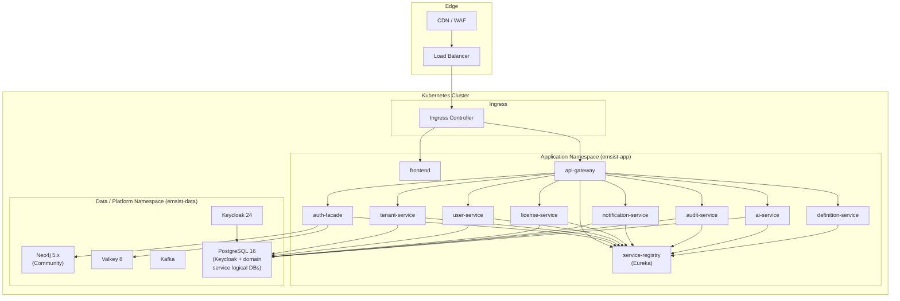
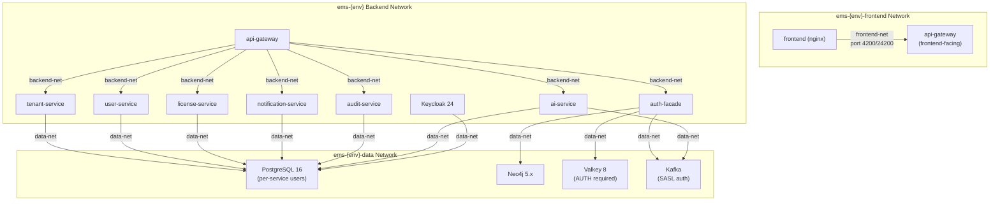
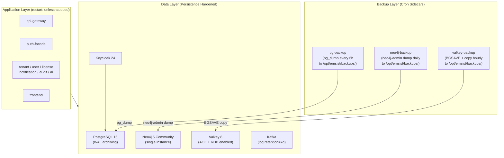
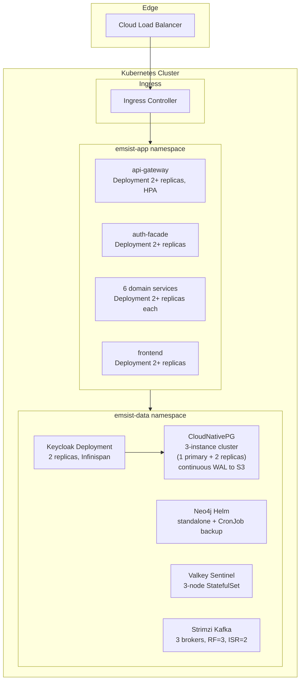
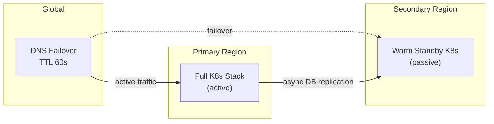
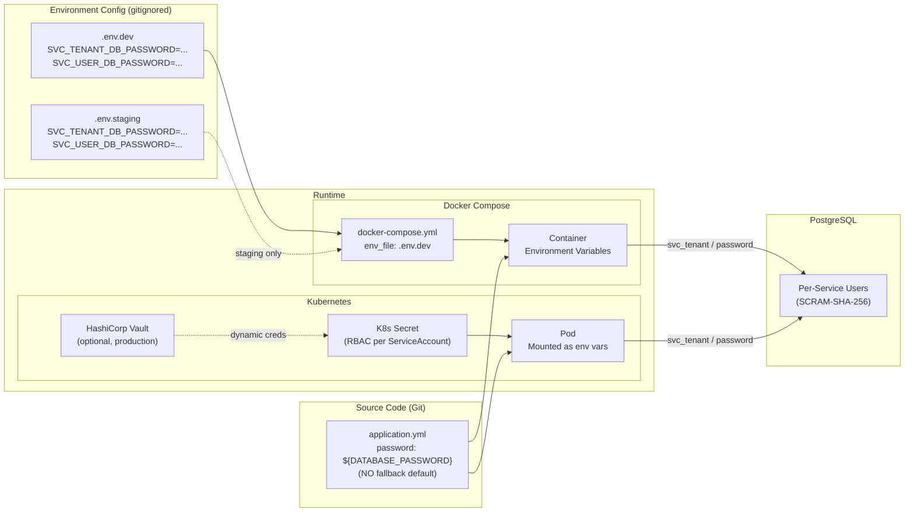

> **WP-ARCH-ALIGN (2026-03-24):** This document has been updated to reflect the frozen auth target model (Rev 2).
> See `Foundation/03-ownership-boundaries.md` FROZEN for the canonical decision.

# 05. Technology Architecture (ADM Phase D)

## 1. Document Control

| Field | Value |
|-------|-------|
| Status | Baselined |
| Owner | Architecture + DevOps |
| Last Updated | 2026-03-05 |
| Canonical Sources | [arc42/04-solution-strategy.md](../Architecture/04-solution-strategy.md), [arc42/07-deployment-view.md](../Architecture/07-deployment-view.md), [ADR-018](../Architecture/09-architecture-decisions.md#954-high-availability-and-multi-tier-architecture-adr-018), [ADR-019](../Architecture/09-architecture-decisions.md#952-encryption-at-rest-strategy-adr-019), [ADR-020](../Architecture/09-architecture-decisions.md#953-service-credential-management-adr-020) |

## 2. Technology Baseline

| Domain | Standard | Version / Detail | Evidence |
|--------|----------|------------------|----------|
| Language | Java | 23 (dev) / 21 LTS (prod) | `pom.xml` parent |
| Backend Framework | Spring Boot | 3.4.1 | `pom.xml` parent |
| Frontend Framework | Angular | 21+ | `package.json` |
| Application Database | Neo4j ([AS-IS] auth-facade RBAC graph; [TARGET] definition-service only -- RBAC migrates to tenant-service PostgreSQL) | 5.12.0 Community | `docker-compose.dev.yml` image tag |
| Domain Services Database | PostgreSQL | 16 (7 services + Keycloak) | `docker-compose.dev.yml` image `postgres:16-alpine` |
| Distributed Cache | Valkey | 8 (`valkey/valkey:8-alpine`) | `docker-compose.dev.yml` |
| Messaging | Kafka | Confluent 7.5.0 (`cp-kafka:7.5.0`) | `docker-compose.dev.yml` |
| Identity Platform | Keycloak | 24.x (default provider) | `docker-compose.dev.yml` |
| Service Discovery | Eureka | Spring Cloud | `backend/eureka-server/` |

## 3. Technology Standards Catalog

Maintain [artifacts/catalogs/technology-standard-catalog.md](./artifacts/catalogs/technology-standard-catalog.md).

## 4. Deployment Architecture [TARGET STATE]

The target production topology is a Kubernetes cluster with three logical tiers: Edge (CDN, WAF, load balancer), Application Namespace (10 services), and Data/Platform Namespace (Neo4j, Valkey, Kafka, Keycloak, PostgreSQL).

Reference: [arc42/07-deployment-view.md Section 7.2](../Architecture/07-deployment-view.md)

### Workload Types

| Workload | Kubernetes Resource |
|----------|---------------------|
| API and business services (stateless) | Deployment + HPA |
| Neo4j / Valkey / Kafka / PostgreSQL | StatefulSet (operator-managed) |
| Configuration and secrets | ConfigMap + Secret |
| Batch jobs (backups, provisioning) | CronJob / Job |

### Scaling Model

- Stateless services scale horizontally via HPA (CPU/memory thresholds).
- Readiness and liveness probes use Spring Boot Actuator health endpoints.
- Service-to-service traffic remains internal through `ClusterIP` services.
- Production rollout is gated by staging validation.

## 5. Environment Strategy

| Environment | Purpose | Runtime | Key Characteristics |
|-------------|---------|---------|---------------------|
| Development | Local build/test | Docker Compose | Single-instance defaults, debug ports exposed |
| Staging | Pre-production validation | Kubernetes | Production-like settings, restricted access |
| Production | Live runtime | Kubernetes | HA + autoscale, encrypted PVs |

Reference: [arc42/07-deployment-view.md Section 7.3](../Architecture/07-deployment-view.md)

### Component Baseline by Environment

| Component | Development | Staging | Production |
|-----------|-------------|---------|------------|
| Neo4j | Container (single instance) | Managed/self-hosted cluster | Managed/self-hosted cluster |
| Valkey | Container (single instance) | Cluster (Sentinel) | Cluster (Sentinel, 3 nodes) |
| Kafka | Container (single broker) | Cluster (Strimzi) | Cluster (Strimzi, 3 brokers, RF=3) |
| PostgreSQL | Container (single instance) | Managed (CloudNativePG) | Managed HA (CloudNativePG, 3 instances) |
| Service Registry (Eureka) | Container | Deployment | Deployment |
| Keycloak | Container (default provider) | Deployment (2+ replicas) | Deployment (2+ replicas, Infinispan) |
| Application services | Container (1 each) | Deployment (2+ replicas) | Deployment (2+ replicas, HPA) |

### Development Compose Inventory

| Service | Default Port |
|---------|--------------|
| frontend | 4200 |
| api-gateway | 8080 |
| auth-facade | 8081 |
| tenant-service | 8082 |
| user-service | 8083 |
| license-service | 8085 |
| notification-service | 8086 |
| audit-service | 8087 |
| ai-service | 8088 |
| definition-service | 8090 |
| service-registry (eureka) | 8761 |
| keycloak | 8180 |
| neo4j | 7687 / 7474 |
| valkey | 6379 |
| kafka | 9092 |
| postgres | 5432 |

Runtime scope seal (2026-03-01): `product-service`, `process-service`, and `persona-service` are not part of the active deployment inventory. They remain build modules only and are intentionally excluded from Compose/Kubernetes topology.

## 6. NFR Support Mapping

| NFR | Technology Enabler | Mechanism | Current Status |
|-----|--------------------|-----------|----------------|
| **Availability** | Kubernetes operator-managed databases, PodDisruptionBudgets, liveness/readiness probes | CloudNativePG auto-failover, Valkey Sentinel, Strimzi ISR | [PLANNED] -- Single instances in Docker Compose today |
| **Performance** | Valkey distributed cache, connection pooling (HikariCP, Lettuce), HPA autoscaling | Cache-first reads for hot paths (role cache, seat validation, token blacklist); HPA scales stateless services on CPU/memory | [IN-PROGRESS] -- Valkey cache operational; HPA planned for K8s |
| **Security** | Three-tier encryption (ADR-019), per-service credentials (ADR-020), Keycloak identity | Volume encryption (LUKS/PV), in-transit TLS, Jasypt config encryption, SCRAM-SHA-256 per-service DB users | [IN-PROGRESS] -- Partial TLS; shared superuser; Jasypt in auth-facade only |
| **Observability** | Spring Boot Actuator, structured logging, Prometheus metrics, distributed tracing | `/actuator/health` for probes; JSON structured logs; Micrometer metrics; trace propagation | [IN-PROGRESS] -- Actuator health exists; full observability stack planned |
| **Scalability** | Stateless service design, Kafka async decoupling, HPA | Horizontal pod autoscaling for API services; Kafka event-driven integration for decoupled processing | [PLANNED] -- Kafka producers/consumers not yet implemented |
| **Recoverability** | Automated backups (ADR-018), WAL archiving, BGSAVE, operator snapshots | pg_dump (6h), neo4j-admin dump (daily), Valkey BGSAVE (hourly); GPG encryption for backup files | [PLANNED] -- No automated backups exist today |
| **Multi-tenancy** | Tenant-scoped queries, graph-per-tenant (ADR-003) | Tenant UUID in all scoped queries; target state is graph-per-tenant isolation in Neo4j | [IN-PROGRESS] -- Simple `tenant_id` column discrimination today; graph-per-tenant not implemented |

## 7. Network Architecture [PLANNED]

The target network topology separates containers into three isolated Docker networks (dev/staging) or Kubernetes NetworkPolicies (production), enforcing tier-based traffic control.

Reference: [arc42/07-deployment-view.md Section 7.9](../Architecture/07-deployment-view.md), [ADR-018](../Architecture/09-architecture-decisions.md#954-high-availability-and-multi-tier-architecture-adr-018)

### Three-Network Topology

| Network | Purpose | Members | Host Access |
|---------|---------|---------|-------------|
| `ems-{env}-data` | Data tier internal | PostgreSQL, Neo4j, Valkey, Kafka | No (internal only) |
| `ems-{env}` | Backend bridge | All backend services + Keycloak + data tier | Debug ports (dev only) |
| `ems-{env}-frontend` | Frontend isolated | frontend + api-gateway only | 4200/24200 |

### Current State

The current deployment (`docker-compose.dev.yml`, `docker-compose.staging.yml`) uses a single flat bridge network where all containers communicate freely. The frontend container can reach databases directly. No network-level isolation between tiers exists.

**Status:** [PLANNED] -- No network segmentation exists today. Implementation is part of the infrastructure hardening plan.

## 8. High Availability Architecture [PLANNED]

Reference: [ADR-018](../Architecture/09-architecture-decisions.md#954-high-availability-and-multi-tier-architecture-adr-018), [arc42/07-deployment-view.md Sections 7.8.1-7.8.5](../Architecture/07-deployment-view.md)

### HA Phase Roadmap

| Phase | Scope | Timeline | RPO | RTO | Status |
|-------|-------|----------|-----|-----|--------|
| **Phase 1** | Docker Compose backup + persistence hardening | Q1 2026 | PG: 6h, Neo4j: 24h, Valkey: 15min | PG: 30min, Neo4j: 15min, Valkey: 5min | [PLANNED] |
| **Phase 2** | Kubernetes migration with operator-managed HA | Q2-Q3 2026 | PG: ~0, Neo4j: 1h, Valkey: ~0, Kafka: 0 | PG: <30s, Neo4j: 15min, Valkey: <10s, Kafka: <1min | [PLANNED] |
| **Phase 3** | Multi-region active-passive DR | Q4 2026+ | <5 minutes (cross-region) | <10 minutes (DNS failover) | [PLANNED] |

### Current State Assessment

All stateful components run as single instances with no replication, no automated backups, and no failover mechanisms.

| Component | Instance Count | Replication | Automated Backup | Failover |
|-----------|---------------|-------------|-------------------|----------|
| PostgreSQL 16 (pgvector) | 1 | None | None | None |
| Neo4j 5 Community | 1 | None | None | None |
| Valkey 8 | 1 | None | None | None |
| Kafka (Confluent 7.6) | 1 broker | replication.factor=1 | None | None |
| Keycloak 24 | 1 | None | Data in PostgreSQL | None |
| Application services (8) | 1 each | N/A (stateless) | N/A | Container restart only |

**Risk:** A single container failure, `docker compose down -v`, or host failure results in permanent data loss.

### Phase 1: Docker Compose Backup + Persistence Hardening

### Phase 2: Kubernetes with Operator-Managed HA

**HA Guarantees (Phase 2):**

| Component | Instances | Failover | RPO | RTO |
|-----------|-----------|----------|-----|-----|
| PostgreSQL (CloudNativePG) | 1 primary + 2 replicas | Automatic (operator) | ~0 (streaming replication) | <30 seconds |
| Neo4j (Community standalone) | 1 + CronJob backup | Manual restore | 1 hour | 15 minutes |
| Valkey (Sentinel) | 3 nodes | Automatic (Sentinel) | ~0 (sync replication) | <10 seconds |
| Kafka (Strimzi) | 3 brokers | Automatic (ISR failover) | 0 (replicated topics) | <1 minute |
| Keycloak | 2+ replicas | Load-balanced, Infinispan | N/A (data in PG) | 0 (other replica) |
| Application services | 2+ replicas each | Load-balanced, PDB | N/A (stateless) | 0 (other replica) |

### Phase 3: Multi-Region Active-Passive DR

| Target | Value |
|--------|-------|
| Cross-region RPO | <5 minutes |
| Cross-region RTO | <10 minutes |
| DNS failover | Health-checked, TTL 60s |

## 9. Encryption and Security Infrastructure [PLANNED]

Reference: [ADR-019](../Architecture/09-architecture-decisions.md#952-encryption-at-rest-strategy-adr-019), [arc42/04-solution-strategy.md Section 4.7](../Architecture/04-solution-strategy.md)

### Three-Tier Encryption Strategy

| Tier | Scope | Mechanism | Current State |
|------|-------|-----------|---------------|
| **Tier 1: Volume encryption** | All data stores (PostgreSQL, Neo4j, Valkey, Kafka) | LUKS/FileVault for Docker Compose (dev/staging), encrypted StorageClass PVs for Kubernetes (production) | [PLANNED] -- No volume encryption in any environment |
| **Tier 2: In-transit TLS** | All service-to-datastore connections | PostgreSQL `sslmode=verify-full`, Neo4j `bolt+s://`, Valkey `--tls-port`, Kafka `SASL_SSL` | [IN-PROGRESS] -- See TLS status matrix below |
| **Tier 3: Config encryption** | Sensitive `application.yml` values (passwords, API keys, client secrets) | Jasypt `PBEWITHHMACSHA512ANDAES_256` with `ENC()` property values, decrypted at startup via `JASYPT_PASSWORD` env var | [IN-PROGRESS] -- auth-facade only |

### In-Transit TLS Status Matrix

| Connection | Protocol | Current State | Target State | Status |
|------------|----------|---------------|--------------|--------|
| tenant-service to PostgreSQL | JDBC | `sslmode=verify-full` | `sslmode=verify-full` | [IMPLEMENTED] |
| user-service to PostgreSQL | JDBC | `sslmode=verify-full` | `sslmode=verify-full` | [IMPLEMENTED] |
| license-service to PostgreSQL | JDBC | `sslmode=verify-full` | `sslmode=verify-full` | [IMPLEMENTED] |
| notification-service to PostgreSQL | JDBC | `sslmode=verify-full` | `sslmode=verify-full` | [IMPLEMENTED] |
| audit-service to PostgreSQL | JDBC | `sslmode=verify-full` | `sslmode=verify-full` | [IMPLEMENTED] |
| process-service to PostgreSQL | JDBC | `sslmode=verify-full` | `sslmode=verify-full` | [IMPLEMENTED] |
| ai-service to PostgreSQL | JDBC | **No `sslmode` parameter** (plaintext) | `sslmode=verify-full` | [PLANNED] |
| auth-facade to Neo4j | Bolt | **Plaintext `bolt://`** | `bolt+s://` | [PLANNED] |
| auth-facade to Valkey | Redis | **No TLS** (plaintext) | `ssl.enabled=true` | [PLANNED] |
| ai-service to Valkey | Redis | **No TLS** (plaintext) | `ssl.enabled=true` | [PLANNED] |
| All services to Kafka | Kafka | **Plaintext `PLAINTEXT://`** | `SASL_SSL://` | [PLANNED] |
| Keycloak to PostgreSQL | JDBC | `sslmode=verify-full` | `sslmode=verify-full` | [IMPLEMENTED] |
| PostgreSQL server TLS | Server | **No `ssl=on`** in config | `ssl=on` with cert/key | [PLANNED] |
| Neo4j server TLS | Server | **No SSL policy** | `dbms.ssl.policy.bolt.enabled=true` | [PLANNED] |
| Valkey server TLS | Server | **No TLS listener** | `--tls-port 6379 --tls-cert-file` | [PLANNED] |

### Jasypt Config Encryption Coverage

| Service | Sensitive Config Values | Jasypt Status |
|---------|------------------------|---------------|
| auth-facade | Keycloak admin password, client secret, Neo4j password, Valkey password | [IMPLEMENTED] |
| ai-service | OpenAI/Anthropic API keys, DB password | [PLANNED] |
| tenant-service | DB password, Keycloak admin password | [PLANNED] |
| user-service | DB password | [PLANNED] |
| license-service | DB password, license signing key | [PLANNED] |
| notification-service | DB password, SMTP credentials | [PLANNED] |
| audit-service | DB password | [PLANNED] |
| process-service | DB password | [PLANNED] |

### Credential Architecture Summary

Per-service database users with least-privilege access, replacing the shared `postgres` superuser.

Reference: [ADR-020](../Architecture/09-architecture-decisions.md#953-service-credential-management-adr-020), [arc42/04-solution-strategy.md Section 4.8](../Architecture/04-solution-strategy.md)

| Principle | Description |
|-----------|-------------|
| **Per-service isolation** | Each service authenticates to PostgreSQL with a dedicated user (e.g., `svc_tenant`, `svc_user`) |
| **SCRAM-SHA-256 authentication** | All PostgreSQL users use SCRAM-SHA-256, not MD5 |
| **No hardcoded defaults** | `application.yml` references `${DATABASE_USER}` without fallback -- missing credentials cause fail-fast |
| **Externalized credentials** | All credentials stored in `.env` files (dev/staging) or Kubernetes Secrets (production) |
| **Append-only audit** | `svc_audit` has `INSERT` and `SELECT` only -- no `UPDATE` or `DELETE` |

**Current state:** All 7 PostgreSQL services share the `postgres` superuser with hardcoded fallback defaults. Only `keycloak` has a dedicated database user.

## 10. Secrets Management [PLANNED]

Reference: [ADR-020](../Architecture/09-architecture-decisions.md#953-service-credential-management-adr-020), [ADR-019](../Architecture/09-architecture-decisions.md#952-encryption-at-rest-strategy-adr-019), [arc42/07-deployment-view.md Section 7.10](../Architecture/07-deployment-view.md)

### Current vs Target State

| Aspect | Current State | Target State |
|--------|---------------|--------------|
| PostgreSQL credentials | Shared `postgres` superuser; `${DATABASE_USER:postgres}` with hardcoded fallback | Per-service users (`svc_tenant`, `svc_user`, etc.) with no fallback defaults |
| Credential storage | `.env.dev` / `.env.staging` (gitignored, plaintext) | `.env` files (dev/staging) or K8s Secrets + optional Vault (production) |
| Credential rotation | None (manual only) | Manual (dev/staging quarterly); automated via Vault lease TTL (production) |
| Config encryption | Jasypt in auth-facade only | Jasypt `ENC()` in all services with `JASYPT_PASSWORD` env var |
| Access control | Shared credentials, no service isolation | K8s RBAC per ServiceAccount; Vault policies per service |

### Credential Source by Environment

| Environment | Credential Source | Rotation | Encryption |
|-------------|-------------------|----------|------------|
| Development | `.env.dev` (gitignored, `chmod 600`) | Manual | Host filesystem encryption (FileVault/LUKS) |
| Staging | `.env.staging` (gitignored, `chmod 600`, server filesystem) | Manual (quarterly) | Host filesystem encryption + restricted SSH access |
| Production | K8s Secrets (RBAC per ServiceAccount) + optional HashiCorp Vault | Automated (Vault lease TTL) | K8s etcd encryption at rest + Vault seal |

### Credential Flow

**Status:** [PLANNED] -- Currently all services use the shared `postgres` superuser with hardcoded defaults.

## 11. Backup and Recovery [PLANNED]

Reference: [ADR-018](../Architecture/09-architecture-decisions.md#954-high-availability-and-multi-tier-architecture-adr-018), [ADR-019](../Architecture/09-architecture-decisions.md#952-encryption-at-rest-strategy-adr-019), [arc42/07-deployment-view.md Section 7.11](../Architecture/07-deployment-view.md)

### Backup Method per Data Store

| Data Store | Backup Method | Frequency | Encryption | Target Storage |
|------------|---------------|-----------|------------|----------------|
| PostgreSQL | `pg_dump` (cron sidecar) | Every 6 hours | `gpg --encrypt` with backup-specific GPG key | `/opt/emsist/backups/postgresql/` (host bind-mount) |
| Neo4j | `neo4j-admin database dump` (cron sidecar) | Daily | `gpg --encrypt` with backup-specific GPG key | `/opt/emsist/backups/neo4j/` (host bind-mount) |
| Valkey | `BGSAVE` + copy (cron sidecar) | Hourly | Host filesystem encryption (volume on LUKS/FileVault) | `/opt/emsist/backups/valkey/` (host bind-mount) |
| Kafka | Log retention (7 days) | Continuous | N/A (messaging, not primary storage) | Kafka log segments on volume |
| Offsite (optional) | `rclone sync` daily from host backup dir | Daily | Object storage SSE (S3 server-side encryption) or client-side GPG | S3 / MinIO bucket with encryption enabled |

### Recovery Targets (Phase 1)

| Component | RPO | RTO | Recovery Procedure |
|-----------|-----|-----|-------------------|
| PostgreSQL | 6 hours | 30 minutes | Restore from latest `pg_dump` archive |
| Neo4j | 24 hours | 15 minutes | Restore via `neo4j-admin database load` |
| Valkey | ~15 minutes (AOF) | 5 minutes | Restart with AOF replay or restore RDB snapshot |
| Kafka | N/A (messaging) | Broker restart | Restart broker; consumers replay from offsets |

### Current State

No automated backups exist in any Docker Compose file. All data resides solely in Docker named volumes with no offsite copies. A `docker compose down -v` or host failure results in total data loss.

**Status:** [PLANNED] -- No backup automation or encryption exists today.

## 12. Installation and Startup Gating [IMPLEMENTED]

Operational runbook: [CUSTOMER-INSTALL-RUNBOOK.md](../dev/CUSTOMER-INSTALL-RUNBOOK.md)

Runtime startup policy:

- `service-registry (eureka)` has an explicit healthcheck in app-tier Compose. `[IMPLEMENTED]`
- Backend services and API gateway depend on Eureka with `condition: service_healthy`. `[IMPLEMENTED]`
- This enforces registry readiness before service registration/discovery traffic begins.

**Evidence (verified 2026-03-06):** `docker-compose.dev-app.yml` and `docker-compose.staging-app.yml` define the eureka service with `wget -q --spider http://127.0.0.1:8761/actuator/health` healthcheck. All active backend services declare `depends_on: eureka: condition: service_healthy`. Server source: `backend/eureka-server/src/main/java/com/ems/registry/EurekaServerApplication.java` (`@EnableEurekaServer`).

## 13. Gap Analysis

| # | Technology Area | Baseline (Current) | Target | Gap | Priority | Reference |
|---|-----------------|---------------------|--------|-----|----------|-----------|
| GAP-01 | **Network segmentation** | Single flat Docker bridge network; all containers can reach all others | Three-tier network isolation (data, backend, frontend) | No network isolation exists | HIGH | ADR-018, arc42/07 S7.9 |
| GAP-02 | **Database credentials** | All 7 PG services share `postgres` superuser with hardcoded fallback `${DATABASE_USER:postgres}` | Per-service users (`svc_tenant`, `svc_user`, etc.) with SCRAM-SHA-256, no hardcoded defaults | Shared superuser, hardcoded defaults, no least-privilege isolation | CRITICAL | ADR-020 |
| GAP-03 | **In-transit TLS** | 6/7 PG services have `sslmode=verify-full`; ai-service, Neo4j, Valkey, Kafka are plaintext | TLS on all connections (PostgreSQL, Neo4j bolt+s, Valkey TLS, Kafka SASL_SSL) | ai-service PG SSL missing; Neo4j/Valkey/Kafka entirely plaintext | HIGH | ADR-019 |
| GAP-04 | **Config encryption** | Jasypt configured in auth-facade only; 7 other services store secrets as plaintext env-var references | Jasypt `PBEWITHHMACSHA512ANDAES_256` for all services with `ENC()` values | 7 services lack Jasypt; sensitive values unencrypted in config | HIGH | ADR-019 |
| GAP-05 | **Volume encryption** | No volume encryption in any environment; Docker named volumes on plaintext filesystem | LUKS/FileVault (dev/staging), encrypted StorageClass PVs (production) | All data at rest is unencrypted | MEDIUM | ADR-019 |
| GAP-06 | **Automated backups** | No backup automation; data solely in Docker named volumes | Cron sidecar backups (pg_dump 6h, neo4j-admin daily, BGSAVE hourly) with GPG encryption | Zero backup capability; total data loss on volume destruction | CRITICAL | ADR-018 |
| GAP-07 | **High availability** | All stateful components are single-instance; no replication, no failover | Phase 2 K8s: CloudNativePG (3 instances), Valkey Sentinel (3 nodes), Strimzi Kafka (3 brokers) | Single points of failure everywhere | HIGH | ADR-018 |
| GAP-08 | **Kubernetes migration** | Docker Compose only (dev + staging) | Kubernetes for staging and production with operators | No Kubernetes manifests, Helm charts, or operator configs exist | HIGH | ADR-018 |
| GAP-09 | **Multi-region DR** | Single host, single region | Active-passive multi-region with async DB replication and DNS failover | No DR strategy implemented | LOW (Phase 3) | ADR-018 |
| GAP-10 | **Kafka event integration** | No KafkaTemplate or Kafka consumer in any service; Kafka broker exists but is unused | Event-driven async integration (audit events, notifications, provisioning) | Kafka infrastructure present but zero application integration | MEDIUM | arc42/04 S4.3 |

---

**Previous Section:** [Application Architecture](./04-application-architecture.md)
**Next Section:** [Opportunities and Solutions](./06-opportunities-solutions.md)
