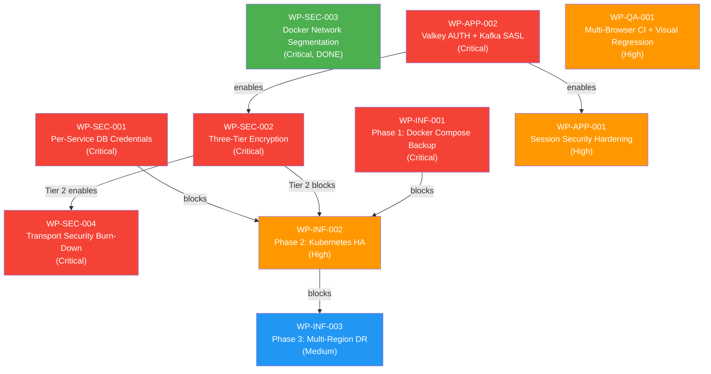
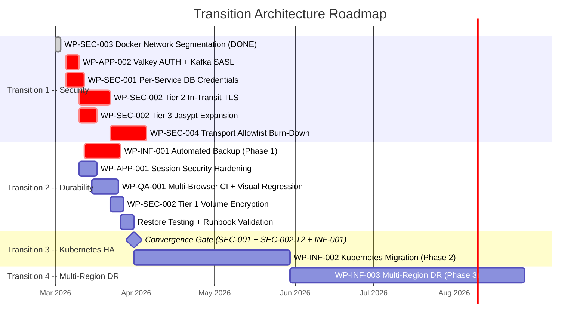

# 06. Opportunities and Solutions (ADM Phase E)

## 1. Document Control

| Field | Value |
|-------|-------|
| Status | Baselined |
| Owner | Architecture Team |
| Last Updated | 2026-03-05 |
| Arc42 Alignment | [11-risks-technical-debt.md](../Architecture/11-risks-technical-debt.md) sections 11.2 (debt register) and 11.4 (reduction roadmap) |
| Related ADRs | [ADR-018](../Architecture/09-architecture-decisions.md#954-high-availability-and-multi-tier-architecture-adr-018), [ADR-019](../Architecture/09-architecture-decisions.md#952-encryption-at-rest-strategy-adr-019), [ADR-020](../Architecture/09-architecture-decisions.md#953-service-credential-management-adr-020), [ADR-022](../Architecture/09-architecture-decisions.md#951-production-parity-security-baseline-adr-022) |

## 2. Candidate Solution Building Blocks

Maintain ABB/SBB entries in [artifacts/repository/abb-sbb-register.md](./artifacts/repository/abb-sbb-register.md).

The following solution building blocks (SBBs) are identified from the risk and technical debt analysis in [arc42/11-risks-technical-debt.md](../Architecture/11-risks-technical-debt.md):

| SBB ID | Building Block | ABB Category | Addresses Risks / Debt |
|--------|----------------|-------------|------------------------|
| SBB-SEC-01 | Per-service PostgreSQL users (SCRAM-SHA-256) | Security | R-13, R-14, TD-13 |
| SBB-SEC-02 | Three-tier encryption (volume + TLS + Jasypt) | Security | R-12, R-19, TD-21 |
| SBB-SEC-03 | Docker three-tier network segmentation | Security | TD-15 |
| SBB-SEC-04 | Transport security CI gate + allowlist burn-down | Security | R-19, TD-21 |
| SBB-INF-01 | Automated backup sidecar containers (pg_dump, neo4j-admin dump, BGSAVE) | Infrastructure | R-08, R-10, R-11, TD-07 |
| SBB-INF-02 | Kubernetes with database operators (CloudNativePG, Strimzi, Valkey Sentinel) | Infrastructure | R-08, R-09, TD-09 |
| SBB-INF-03 | Multi-region active-passive DR | Infrastructure | R-08 |
| SBB-APP-01 | Session lifecycle governance (logout blacklist, gateway token check) | Application | TD-11 |
| SBB-APP-02 | Valkey AUTH + Kafka SASL authentication | Application | TD-13, TD-14 |
| SBB-QA-01 | Multi-browser CI matrix + visual regression baselines | Quality | R-15, R-16, TD-16, TD-17 |

## 3. Work Package Candidates

Work packages are derived from the technical debt register (arc42 11.2) and risk reduction roadmap (arc42 11.4). Each work package traces to one or more canonical source entries.

| Work Package ID | Description | Target ADM Area | Priority | Canonical Source | Risks Mitigated | Debt Items Resolved |
|-----------------|-------------|------------------|----------|------------------|-----------------|---------------------|
| WP-SEC-001 | Per-service database credential isolation -- create dedicated PostgreSQL users with SCRAM-SHA-256, remove hardcoded fallback defaults, update init-db.sql | D (Technology) | Critical | [ADR-020](../Architecture/09-architecture-decisions.md#953-service-credential-management-adr-020) | R-13, R-14 | TD-13 (partial) |
| WP-SEC-002 | Three-tier encryption implementation -- Tier 1: volume-level (LUKS/FileVault), Tier 2: in-transit TLS for all data connections, Tier 3: Jasypt config encryption for all services | D (Technology) | Critical | [ADR-019](../Architecture/09-architecture-decisions.md#952-encryption-at-rest-strategy-adr-019) | R-12, R-19 | TD-21 (partial) |
| WP-SEC-003 | Docker network tier segmentation -- split single flat network into data, backend, and frontend tiers | D (Technology) | Critical | [ISSUE-INF-001](../issues/open/ISSUE-INF-001.md) | TD-15 | TD-15 |
| WP-SEC-004 | Production-parity transport security burn-down -- eliminate all legacy HTTP/HTTPS-bypass entries from CI allowlist until baseline reaches zero | D (Technology) | Critical | [ADR-022](../Architecture/09-architecture-decisions.md#951-production-parity-security-baseline-adr-022) | R-19 | TD-21 |
| WP-INF-001 | Phase 1: Docker Compose automated backup -- pg_dump (6h), neo4j-admin dump (daily), Valkey BGSAVE (hourly), host bind-mount to /opt/emsist/backups/, restore testing | D (Technology) | Critical | [ADR-018](../Architecture/09-architecture-decisions.md#954-high-availability-and-multi-tier-architecture-adr-018) Phase 1 | R-08, R-10, R-11 | TD-07, TD-08, TD-10 |
| WP-INF-002 | Phase 2: Kubernetes HA migration -- CloudNativePG (3 instances), Strimzi (3 brokers), Valkey Sentinel (3 nodes), HPA, PDB, rolling updates | D (Technology) | High | [ADR-018](../Architecture/09-architecture-decisions.md#954-high-availability-and-multi-tier-architecture-adr-018) Phase 2 | R-08, R-09 | TD-09, TD-12 |
| WP-INF-003 | Phase 3: Multi-region DR -- cross-region PostgreSQL replication, Neo4j backup shipping, DNS failover, warm standby K8s cluster | D (Technology) | Medium | [ADR-018](../Architecture/09-architecture-decisions.md#954-high-availability-and-multi-tier-architecture-adr-018) Phase 3 | R-08 | -- |
| WP-APP-001 | Session security hardening -- implement logout token blacklist in Valkey, add gateway-level token revocation check on every request, enforce session TTL and concurrency limits | C (Application) | High | [arc42 11.2 TD-11](../Architecture/11-risks-technical-debt.md) | R-06 | TD-11 |
| WP-APP-002 | Valkey AUTH + Kafka SASL authentication -- require password for Valkey connections, enable SASL/SCRAM-SHA-512 for Kafka producer/consumer authentication | D (Technology) | Critical | [arc42 11.2 TD-13, TD-14](../Architecture/11-risks-technical-debt.md) | R-13 (Valkey) | TD-13, TD-14 |
| WP-QA-001 | Multi-browser CI matrix + visual regression -- expand Playwright to Chromium/Firefox/WebKit, establish visual regression baselines for critical user journeys | E (Opportunities) | High | [arc42 11.2 TD-16, TD-17](../Architecture/11-risks-technical-debt.md) | R-15, R-16 | TD-16, TD-17 |

### Implementation Status

| Work Package | ADR Status | Implementation Status | Evidence |
|--------------|------------|----------------------|----------|
| WP-SEC-001 | ADR-020 Proposed | [PLANNED] -- No per-service users exist yet (except `keycloak`) | `/infrastructure/docker/init-db.sql` still uses shared superuser |
| WP-SEC-002 | ADR-019 Proposed | [PLANNED] -- Jasypt exists only in auth-facade; TLS missing for Neo4j, Valkey, Kafka, and ai-service PostgreSQL | `/backend/auth-facade/src/main/java/com/ems/auth/config/JasyptConfig.java` |
| WP-SEC-003 | ISSUE-INF-001 Resolved | [IMPLEMENTED] -- Three-tier network topology deployed | `docker-compose.dev.yml`, `docker-compose.staging.yml` |
| WP-SEC-004 | ADR-022 Accepted | [IN-PROGRESS] -- CI gate blocks net-new insecure entries; legacy allowlist burn-down remains | `scripts/check-transport-security-baseline.sh`, `scripts/transport-security-allowlist.txt` |
| WP-INF-001 | ADR-018 Proposed | [PLANNED] -- No backup containers in any Compose file | All Compose files verified |
| WP-INF-002 | ADR-018 Proposed | [PLANNED] -- No Kubernetes manifests exist | -- |
| WP-INF-003 | ADR-018 Proposed | [PLANNED] -- No multi-region configuration exists | -- |
| WP-APP-001 | -- | [PLANNED] -- No logout blacklist or gateway revocation check exists | -- |
| WP-APP-002 | -- | [PLANNED] -- Valkey has no AUTH; Kafka has no SASL | Compose files confirm no auth configured |
| WP-QA-001 | -- | [PLANNED] -- Playwright config is single-browser (`chromium`); no visual baselines | -- |

## 4. Dependencies and Constraints

### Dependency Table

| Work Package | Depends On | Blocking Constraint | Rationale |
|--------------|------------|---------------------|-----------|
| WP-INF-002 | WP-SEC-001 | Per-service credentials must exist before Kubernetes migration | K8s Secrets are per-ServiceAccount; migrating with shared superuser would perpetuate the security gap into production infrastructure |
| WP-INF-002 | WP-SEC-002 (Tier 2) | In-transit TLS must be operational before Kubernetes migration | K8s network policies assume encrypted inter-pod traffic; migrating without TLS creates a false sense of security from NetworkPolicy isolation |
| WP-INF-002 | WP-INF-001 | Backup strategy must be tested in Docker Compose before K8s migration | Phase 1 backup scripts validate RPO/RTO targets; Phase 2 translates proven patterns to CronJobs and operator-managed backups |
| WP-INF-003 | WP-INF-002 | Kubernetes HA must be stable before multi-region DR | Multi-region replication builds on single-region HA operators (CloudNativePG WAL archiving, Strimzi MirrorMaker) |
| WP-SEC-002 | WP-APP-002 | Valkey AUTH + Kafka SASL must be in place before full TLS roll-out is meaningful | Encrypting an unauthenticated channel (TLS without AUTH) protects confidentiality but not access control; both must be addressed together |
| WP-SEC-004 | WP-SEC-002 (Tier 2) | Transport security allowlist cannot reach zero until all in-transit TLS connections are implemented | Allowlist entries represent known insecure connections; each Tier 2 fix removes one or more entries |
| WP-APP-001 | WP-APP-002 (Valkey AUTH) | Session blacklist stored in Valkey requires Valkey AUTH to prevent unauthorized flush | An unauthenticated Valkey allows any container to `FLUSHALL`, defeating the session blacklist |

### Dependency Diagram



Legend: Red = Critical priority, Orange = High priority, Blue = Medium priority, Green = Done.

### Critical Path

The longest dependency chain determines the minimum lead time before Kubernetes migration:

```
WP-APP-002 (Valkey AUTH + Kafka SASL)
  -> WP-SEC-002 Tier 2 (In-transit TLS)
    -> WP-INF-002 (Kubernetes HA)
      -> WP-INF-003 (Multi-region DR)
```

In parallel, WP-SEC-001 (per-service credentials) and WP-INF-001 (Docker Compose backups) must also complete before WP-INF-002 can begin. These three prerequisites (WP-SEC-001, WP-SEC-002 Tier 2, WP-INF-001) form a convergence gate for the Kubernetes migration.

## 5. Solution Option Comparison

### HA Strategy Options (from ADR-018)

| Option | Description | Benefits | Risks | Effort | Recommendation |
|--------|-------------|----------|-------|--------|----------------|
| **A** | Docker Compose only with backup scripts (Phase 1 only) | Minimal infrastructure change; fast to implement; immediate RPO improvement | Still single-instance with no failover; RPO > 0 (6h PG, 24h Neo4j); no horizontal scaling; remains unsuitable for production | Low | Not recommended -- insufficient for production SLAs |
| **B** | Direct Kubernetes migration (skip Docker Compose HA) | Production-grade from day one; operator ecosystem (CloudNativePG, Strimzi) | High upfront effort; steep learning curve; delays risk mitigation while K8s is being set up; not suitable for current team velocity | High | Not recommended -- delays immediate risk reduction |
| **C** | Phased approach: Docker Compose backup first, then Kubernetes HA, then multi-region DR | Incremental investment; each phase delivers measurable risk reduction; Kubernetes provides production-grade orchestration; can stop at any phase | Complexity increases at each phase; requires operational skill growth | Medium (phased) | **Recommended** -- balanced risk-vs-effort profile |

### Encryption Strategy Options (from ADR-019)

| Option | Description | Benefits | Risks | Recommendation |
|--------|-------------|----------|-------|----------------|
| pgcrypto column-level | Per-column encryption in PostgreSQL | Granular control | Breaks indexing; modifies all queries; does not protect Neo4j/Valkey/Kafka | Not recommended |
| Cloud KMS only | AWS KMS / managed encryption | Zero application changes; managed rotation | Vendor lock-in; incompatible with on-premise model (ADR-015) | Not recommended |
| Full-disk only | LUKS / FileVault on Docker host | Simple; no app changes | No in-transit protection; insufficient for compliance | Not recommended |
| **Three-tier** | Volume encryption + TLS + Jasypt | Defense in depth; on-premise compatible; no query changes; covers at-rest, in-transit, config secrets | TLS ~5% latency; cert management overhead; Jasypt master key is critical secret | **Selected** (ADR-019) |

### Credential Management Options (from ADR-020)

| Option | Description | Benefits | Risks | Recommendation |
|--------|-------------|----------|-------|----------------|
| Shared superuser (status quo) | All services use `postgres` superuser | Simple; no changes | Critical blast radius; compromised service reads all databases; fails SOC 2 audit | Not acceptable |
| **Per-service users (SCRAM-SHA-256)** | Dedicated PostgreSQL user per service with least privilege | Blast radius contained; audit-service append-only; fail-fast on misconfiguration | More credentials to manage; init-db.sql complexity | **Selected** (ADR-020) |
| Vault dynamic credentials | Short-lived credentials from HashiCorp Vault | Automatic rotation; audit trail | Adds critical dependency; overkill for Phase 1 | Deferred to production (Phase 2) |

## 6. Recommended Transition Architecture

### Transition 1: Security Hardening (Q1 2026)

**Target state:** All Critical-priority security work packages complete. This is the minimum viable security posture for staging environments.

**Work packages in scope:**
- WP-SEC-001: Per-service database credentials (ADR-020)
- WP-SEC-003: Docker network tier segmentation (ISSUE-INF-001) -- **DONE**
- WP-APP-002: Valkey AUTH + Kafka SASL authentication
- WP-SEC-002: Three-tier encryption (Tier 2 in-transit TLS first, Tier 3 Jasypt, Tier 1 volume)
- WP-SEC-004: Transport security allowlist burn-down (ongoing, gated by Tier 2 completions)

**Exit criteria:**
- All 7 PostgreSQL services connect with per-service SCRAM-SHA-256 users
- Valkey requires AUTH password for all connections
- Kafka requires SASL authentication for all producers/consumers
- All data connections use TLS (PostgreSQL sslmode=verify-full, Neo4j bolt+s://, Valkey TLS, Kafka SASL_SSL)
- All services use Jasypt for configuration encryption
- Docker networks are segmented into data/backend/frontend tiers
- Transport security allowlist reduced by at least 50%

### Transition 2: Durability and Backup (Q1-Q2 2026)

**Target state:** Automated backups for all stateful services with tested restore procedures.

**Work packages in scope:**
- WP-INF-001: Docker Compose automated backup (ADR-018 Phase 1)
- WP-APP-001: Session security hardening (depends on Valkey AUTH from Transition 1)
- WP-QA-001: Multi-browser CI matrix + visual regression baselines

**Exit criteria:**
- PostgreSQL pg_dump running every 6 hours to host bind-mount
- Neo4j neo4j-admin dump running daily
- Valkey AOF enabled with hourly BGSAVE export
- Restore tested for all databases with documented RPO/RTO targets met
- Upgrade runbook validated with pre-upgrade backup procedure
- Logout blacklist operational in Valkey; gateway validates token revocation
- Playwright running Chromium + Firefox + WebKit in CI
- Visual regression baselines established for critical user journeys

### Transition 3: Production-Grade Orchestration (Q2-Q3 2026)

**Target state:** Kubernetes cluster with operator-managed databases, automatic failover, and horizontal scaling.

**Work packages in scope:**
- WP-INF-002: Kubernetes HA migration (ADR-018 Phase 2)

**Entry criteria (convergence gate):**
- WP-SEC-001 complete (per-service credentials exist for K8s Secrets mapping)
- WP-SEC-002 Tier 2 complete (TLS operational for all data connections)
- WP-INF-001 complete (backup strategy proven in Docker Compose)

**Exit criteria:**
- All services running in Kubernetes with 2+ replicas
- CloudNativePG managing PostgreSQL (1 primary + 2 replicas)
- Strimzi managing Kafka (3 brokers, replication factor 3)
- Valkey Sentinel managing 3-node cluster
- HPA validated; PodDisruptionBudgets in place
- Failover tested for all stateful components
- Backup to S3 operational (continuous WAL archiving for PostgreSQL)

### Transition 4: Geographic Redundancy (Q4 2026+)

**Target state:** Multi-region active-passive with cross-region database replication.

**Work packages in scope:**
- WP-INF-003: Multi-region DR (ADR-018 Phase 3)

**Exit criteria:**
- Cross-region PostgreSQL replication verified (RPO < 1 min)
- DNS failover tested (RTO < 5 min)
- Warm standby Kubernetes cluster operational in secondary region
- DR drill completed and documented

### Transition Architecture Timeline



## 7. Output

### Prioritized Work Package List

Ordered by priority and dependency constraints:

| Rank | Work Package | Priority | Depends On | Estimated Effort |
|------|-------------|----------|------------|------------------|
| 1 | WP-SEC-003 (Docker network segmentation) | Critical | -- | **DONE** |
| 2 | WP-APP-002 (Valkey AUTH + Kafka SASL) | Critical | -- | 1 week |
| 3 | WP-SEC-001 (Per-service DB credentials) | Critical | -- | 1-2 weeks |
| 4 | WP-SEC-002 (Three-tier encryption) | Critical | WP-APP-002 | 3-4 weeks (Tier 2 first, then Tier 3, then Tier 1) |
| 5 | WP-SEC-004 (Transport security burn-down) | Critical | WP-SEC-002 Tier 2 | 2 weeks (ongoing) |
| 6 | WP-INF-001 (Docker Compose backup) | Critical | -- | 2-3 weeks |
| 7 | WP-APP-001 (Session security hardening) | High | WP-APP-002 | 1 week |
| 8 | WP-QA-001 (Multi-browser CI + visual regression) | High | -- | 2 weeks |
| 9 | WP-INF-002 (Kubernetes HA migration) | High | WP-SEC-001, WP-SEC-002 T2, WP-INF-001 | 8-12 weeks |
| 10 | WP-INF-003 (Multi-region DR) | Medium | WP-INF-002 | 12+ weeks |

### Recommended Solution Option Set

| Decision Area | Selected Option | ADR |
|---------------|-----------------|-----|
| HA strategy | **Option C: Phased approach** (Docker Compose backup -> Kubernetes HA -> Multi-region DR) | [ADR-018](../Architecture/09-architecture-decisions.md#954-high-availability-and-multi-tier-architecture-adr-018) |
| Encryption strategy | **Three-tier encryption** (volume + TLS + Jasypt) | [ADR-019](../Architecture/09-architecture-decisions.md#952-encryption-at-rest-strategy-adr-019) |
| Credential management | **Per-service PostgreSQL users** (SCRAM-SHA-256) with environment-externalized credentials | [ADR-020](../Architecture/09-architecture-decisions.md#953-service-credential-management-adr-020) |
| Transport security | **Production-parity baseline** with CI gate and allowlist burn-down | [ADR-022](../Architecture/09-architecture-decisions.md#951-production-parity-security-baseline-adr-022) |

### Transition Architecture Statement

The EMSIST platform transitions from its current single-instance Docker Compose deployment with shared credentials and no encryption to a production-grade Kubernetes-orchestrated topology through four incremental transitions. Each transition delivers independently valuable risk reduction, allowing the project to stop at any phase while still benefiting from completed work. The critical path runs through service authentication (WP-APP-002), in-transit TLS (WP-SEC-002 Tier 2), and per-service credential isolation (WP-SEC-001), which together form the convergence gate for Kubernetes migration. Security hardening (Transition 1) and data durability (Transition 2) are the immediate priorities; Kubernetes HA (Transition 3) and multi-region DR (Transition 4) follow once prerequisites are met and operational maturity supports the added complexity.

---

**Previous:** [05. Technology Architecture](./05-technology-architecture.md)
**Next:** [07. Migration Planning](./07-migration-planning.md)
