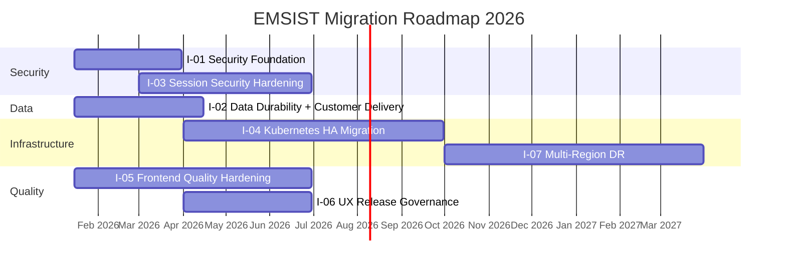
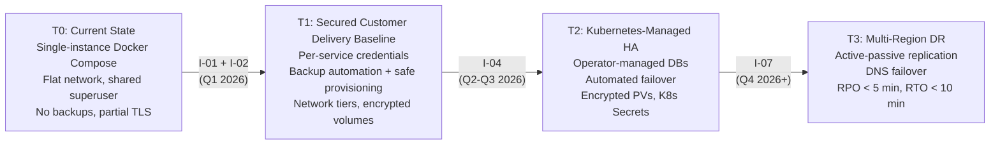
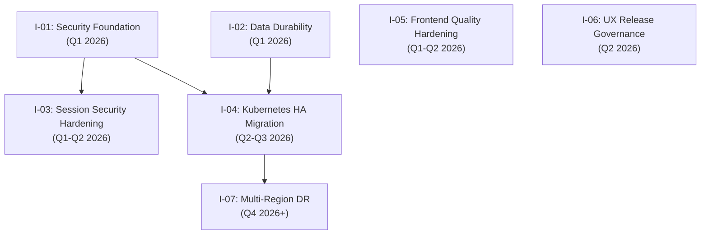

> **WP-ARCH-ALIGN (2026-03-24):** This document has been updated to reflect the frozen auth target model (Rev 2).
> See `Foundation/03-ownership-boundaries.md` FROZEN for the canonical decision.

# 07. Migration Planning (ADM Phase F)

## 1. Document Control

| Field | Value |
|-------|-------|
| Status | Baselined |
| Owner | Architecture + Delivery |
| Last Updated | 2026-03-13 |

## 2. Purpose

This document defines the phased migration roadmap from the current Docker-first baseline to a customer-safe operating model with governed packaging, provisioning, data durability, runtime-agnostic deployment adapters, and a later Kubernetes-managed HA platform with multi-region disaster recovery. Content is aligned with the canonical architecture deployment view, the R07 cross-cutting requirement set, and Section 11.4 (Risk and Debt Reduction Roadmap).

### Canonical Sources

| Source | Sections Used |
|--------|---------------|
| [Architecture/07-deployment-view.md](../Architecture/07-deployment-view.md) | 7.8.1 -- 7.8.5 (HA phases, current state assessment, phase roadmap) |
| [Architecture/11-risks-technical-debt.md](../Architecture/11-risks-technical-debt.md) | 11.1 (R-08 through R-14, R-19), 11.2 (TD-07 through TD-21), 11.4 (Reduction roadmap) |
| [ADR-018](../Architecture/09-architecture-decisions.md#954-high-availability-and-multi-tier-architecture-adr-018) | Multi-tier HA strategy |
| [ADR-019](../Architecture/09-architecture-decisions.md#952-encryption-at-rest-strategy-adr-019) | Encryption at rest -- volume and backup encryption |
| [ADR-020](../Architecture/09-architecture-decisions.md#953-service-credential-management-adr-020) | Per-service credential management |
| [ADR-022](../Architecture/09-architecture-decisions.md#951-production-parity-security-baseline-adr-022) | Production-parity security baseline, transport security |
| [ADR-032](../Architecture/09-architecture-decisions.md#944-runtime-agnostic-cots-deployment-contract-adr-032) | Runtime-agnostic COTS deployment contract |
| [R07 Cross-Cutting Platform Requirements](../.Requirements/R07.%20PLATFORM%20OPERATIONS%20AND%20CUSTOMER%20DELIVERY/Design/01-Cross-Cutting-Platform-Requirements.md) | Customer delivery, provisioning modes, authentication continuity, upgrade safety |

## 3. Migration Roadmap

### 3.1 Increment Register

| Increment | Scope | Planned Window | Owner | Status |
|-----------|-------|----------------|-------|--------|
| I-01 | Security Foundation | Q1 2026 | Architecture + DevOps | [PLANNED] |
| I-02 | Data Durability and Customer Delivery | Q1-Q2 2026 | DevOps + DBA + Architecture | [PLANNED] |
| I-03 | Session Security Hardening | Q1-Q2 2026 | Architecture + DevOps | [PLANNED] |
| I-04 | Kubernetes HA Migration | Q2-Q3 2026 | DevOps + Architecture | [PLANNED] |
| I-05 | Frontend Quality Hardening | Q1-Q2 2026 | QA + Dev (Frontend) | [PLANNED] |
| I-06 | UX Release Governance | Q2 2026 | UX + QA + PM | [PLANNED] |
| I-07 | Multi-Region DR | Q4 2026+ | Architecture + DevOps | [PLANNED] |

### 3.2 Increment Detail

#### I-01: Security Foundation (Q1 2026)

**Addresses:** R-12, R-13, R-14, R-19, TD-15, TD-21

| Deliverable | Description | ADR/Source |
|-------------|-------------|------------|
| Per-service DB credentials | Replace shared `postgres` superuser with SCRAM-SHA-256 per-service users; remove hardcoded fallback defaults from `application.yml`. [TARGET] Note: auth-facade DB credentials are [TRANSITION] -- auth-facade is removed after migration; its data (RBAC, provider config, session metadata) migrates to tenant-service (PostgreSQL). user-service DB credentials are also [TRANSITION] as user entities migrate to tenant-service. | [ADR-020](../Architecture/09-architecture-decisions.md#953-service-credential-management-adr-020) |
| Encryption at rest | Volume-level encryption (LUKS/FileVault) for PostgreSQL, Neo4j, and Valkey Docker volumes | [ADR-019](../Architecture/09-architecture-decisions.md#952-encryption-at-rest-strategy-adr-019) |
| Network segmentation | Three-tier Docker network topology (`ems-{env}-data`, `ems-{env}`, `ems-{env}-frontend`) replacing the current flat bridge | Architecture/07 Section 7.9 |
| Transport security burn-down | Eliminate legacy HTTP/HTTPS-bypass entries from the insecure transport allowlist; enforce TLS on all inter-service communication | [ADR-022](../Architecture/09-architecture-decisions.md#951-production-parity-security-baseline-adr-022) |

**Exit criteria:** All services authenticate with dedicated credentials; no container can reach databases outside its tier; zero insecure transport entries in allowlist; encrypted volumes verified.

#### I-02: Data Durability and Customer Delivery (Q1-Q2 2026)

**Addresses:** R-02, R-08, R-10, R-11, TD-02, TD-07, TD-08, TD-09, TD-10

| Deliverable | Description | ADR/Source |
|-------------|-------------|------------|
| Customer delivery contract | Artifact-only customer package with versioned runtime artifacts, manifests/templates, env templates, scripts, checksums, and runbooks; no source delivery required | R07 |
| Provisioning mode separation | Explicit `preflight`, `first_install`, `upgrade`, and `restore` entrypoints with guarded behavior | R07 |
| Runtime adapter contract | Docker, Kubernetes, and local/native adapters preserve the same lifecycle semantics and logical deployment roles | R07, ADR-032 |
| PostgreSQL automated backup | `pg_dump` every 6 hours to host bind-mount with GPG encryption | [ADR-018](../Architecture/09-architecture-decisions.md#954-high-availability-and-multi-tier-architecture-adr-018) Phase 1 |
| Neo4j automated backup | `neo4j-admin database dump` daily to host bind-mount with GPG encryption | [ADR-018](../Architecture/09-architecture-decisions.md#954-high-availability-and-multi-tier-architecture-adr-018) Phase 1 |
| Valkey persistence hardening | Enable AOF + RDB; `BGSAVE` + copy hourly to host bind-mount | [ADR-018](../Architecture/09-architecture-decisions.md#954-high-availability-and-multi-tier-architecture-adr-018) Phase 1 |
| Identity continuity validation | Persisted-user login verification after restart, upgrade, and restore; Keycloak data explicitly covered in backup/restore scope | R07 |
| Upgrade runbook | Documented and tested pre-upgrade backup, version bump, and restore validation procedure | TD-10 |
| Volume protection | Operational runbook prohibiting `docker compose down -v` in staging/production; backup directories outside Docker volume scope | R-10 |

**Exit criteria:** Automated backups running on schedule; restore procedure tested and documented; Valkey AOF enabled; artifact-only customer package validated with no source-code dependency; preflight rejects missing prerequisites; persisted-user login survives restart/upgrade/restore; upgrade runbook published.

#### I-03: Session Security Hardening (Q1-Q2 2026)

**Addresses:** TD-11, TD-13, TD-14

| Deliverable | Description | ADR/Source |
|-------------|-------------|------------|
| Logout token blacklisting | On logout, add token to Valkey blacklist with TTL matching token expiry | TD-11 |
| Gateway blacklist check | api-gateway validates every request token against the Valkey blacklist before forwarding | TD-11 |
| Valkey AUTH | Enable `requirepass` on Valkey; update all service connection strings | TD-13 |
| Kafka SASL | Enable SASL/PLAIN or SASL/SCRAM authentication on Kafka broker; update producer/consumer configs | TD-14 |

**Exit criteria:** Logged-out tokens are rejected by gateway; Valkey requires authentication; Kafka rejects unauthenticated clients.

#### I-04: Kubernetes HA Migration (Q2-Q3 2026)

**Addresses:** R-08, R-09, TD-09

| Deliverable | Description | ADR/Source |
|-------------|-------------|------------|
| CloudNativePG | 3-instance PostgreSQL cluster (1 primary + 2 replicas) with continuous WAL archival to S3 | [ADR-018](../Architecture/09-architecture-decisions.md#954-high-availability-and-multi-tier-architecture-adr-018) Phase 2 |
| Valkey Sentinel | 3-node Valkey StatefulSet with Sentinel-managed automatic failover | [ADR-018](../Architecture/09-architecture-decisions.md#954-high-availability-and-multi-tier-architecture-adr-018) Phase 2 |
| Strimzi Kafka | 3-broker Kafka cluster with replication factor 3, ISR 2 | [ADR-018](../Architecture/09-architecture-decisions.md#954-high-availability-and-multi-tier-architecture-adr-018) Phase 2 |
| Encrypted PVs | Kubernetes StorageClass with encryption enabled for all stateful workloads | [ADR-019](../Architecture/09-architecture-decisions.md#952-encryption-at-rest-strategy-adr-019) |
| K8s Secrets | Migrate credentials from `.env` files to Kubernetes Secrets with RBAC per ServiceAccount | [ADR-020](../Architecture/09-architecture-decisions.md#953-service-credential-management-adr-020) |

**Exit criteria:** All stateful components operator-managed with automated failover; RPO near-zero for PostgreSQL and Valkey; encrypted persistent volumes; credentials in K8s Secrets.

#### I-05: Frontend Quality Hardening (Q1-Q2 2026)

**Addresses:** R-15, R-16, TD-16, TD-17

| Deliverable | Description | Source |
|-------------|-------------|--------|
| Multi-browser CI matrix | Playwright config extended to Chromium + Firefox + WebKit for critical user journeys | TD-16 |
| Visual regression baselines | Approved baseline screenshots for administration and tenant critical pages; diff review workflow | TD-17 |

**Exit criteria:** CI runs all three browser engines on every push; visual regression diffs reviewed before merge.

#### I-06: UX Release Governance (Q2 2026)

**Addresses:** R-18, TD-19, TD-20

| Deliverable | Description | Source |
|-------------|-------------|--------|
| Design QA handshake | Formal checklist verifying implementation matches wireframes before feature sign-off | TD-20 |
| Alpha/beta UAT evidence | Staged UAT workflow (internal alpha + controlled beta) with sign-off as release gate | TD-19 |

**Exit criteria:** No UI feature ships without design QA checklist evidence; UAT sign-off recorded in release evidence.

#### I-07: Multi-Region DR (Q4 2026+)

**Addresses:** Architecture/07 Section 7.8.4

| Deliverable | Description | ADR/Source |
|-------------|-------------|------------|
| Active-passive replication | Async database replication from primary region to warm standby in secondary region | [ADR-018](../Architecture/09-architecture-decisions.md#954-high-availability-and-multi-tier-architecture-adr-018) Phase 3 |
| DNS failover | Health-checked DNS with 60-second TTL; automatic failover on primary region unavailability | [ADR-018](../Architecture/09-architecture-decisions.md#954-high-availability-and-multi-tier-architecture-adr-018) Phase 3 |

**Exit criteria:** Cross-region RPO < 5 minutes; cross-region RTO < 10 minutes; failover tested and documented.

### 3.3 Migration Timeline

## 4. Transition States

### 4.1 Transition State Register

| State | Name | Entry Condition | Characterization |
|-------|------|-----------------|------------------|
| T0 | Current State | -- | Single-instance Docker Compose; flat network; shared superuser; no automated backups; partial TLS |
| T1 | Secured Customer Delivery Baseline | I-01 + I-02 complete | Per-service credentials; backup automation; governed artifact-only delivery; safe provisioning modes; three-tier network segmentation; encrypted volumes; transport security enforced |
| T2 | Kubernetes-Managed HA | I-04 complete | Operator-managed databases with automated failover; encrypted PVs; K8s Secrets; near-zero RPO for PostgreSQL/Valkey |
| T3 | Multi-Region DR | I-07 complete | Active-passive replication across regions; DNS failover; cross-region RPO < 5 min, RTO < 10 min |

### 4.2 Transition State Progression

### 4.3 Transition State Exit Criteria

| Transition | Exit Criteria | Verification Method |
|------------|---------------|---------------------|
| T0 to T1 | All services use dedicated DB credentials; backup cron containers running; artifact-only package validated with no source-code dependency; preflight operational; persisted-user login survives restore; three-tier network enforced; zero insecure transport entries; encrypted volumes | Infrastructure audit + backup restore test + login continuity test |
| T1 to T2 | All stateful components managed by K8s operators; automated failover tested; encrypted StorageClass active; credentials in K8s Secrets | Failover drill + operator health checks |
| T2 to T3 | Cross-region replication active; DNS failover tested; RPO/RTO targets met in drill | DR drill with measured RPO/RTO |

## 5. Dependency Plan

### 5.1 Increment Dependencies

| Increment | Depends On | Dependency Reason | Risk if Delayed |
|-----------|------------|-------------------|-----------------|
| I-01 (Security Foundation) | -- | No dependencies; foundational increment | Blocks I-03 and I-04; credential and network debt persists |
| I-02 (Data Durability) | -- | No dependencies; foundational increment | Blocks I-04; data loss risk persists (R-08) |
| I-03 (Session Security Hardening) | I-01 | Valkey AUTH and Kafka SASL require per-service credential infrastructure from I-01 | Session hijack risk persists (TD-11, TD-13, TD-14) |
| I-04 (Kubernetes HA Migration) | I-01, I-02 | K8s migration assumes per-service credentials (I-01) and tested backup/restore procedures (I-02) | Cannot migrate to K8s safely without credential isolation and proven backup/restore |
| I-05 (Frontend Quality Hardening) | -- | Independent of infrastructure increments | Browser-specific regressions escape to production (R-15) |
| I-06 (UX Release Governance) | -- | Independent; process governance increment | UX defects reach users without UAT gate (R-18) |
| I-07 (Multi-Region DR) | I-04 | Multi-region requires Kubernetes-managed HA as foundation | Cannot replicate across regions without operator-managed databases |

### 5.2 Dependency Graph

## 6. Value and Risk Tracking

| Increment | Expected Value | Key Risks Mitigated | Residual Risk |
|-----------|----------------|---------------------|---------------|
| I-01 | Eliminate shared-superuser blast radius; enforce network isolation; complete TLS coverage | R-12, R-13, R-14, R-19 | Credential rotation still manual in Docker Compose |
| I-02 | Eliminate permanent data loss on container failure; formalize artifact-only customer delivery; proven restore and login continuity procedure | R-02, R-08, R-10, R-11 | Single-instance components still have downtime on failure (no HA) |
| I-03 | Prevent session reuse after logout; authenticate all middleware connections | TD-11, TD-13, TD-14 | Inter-service authentication (TD-12) deferred |
| I-04 | Automated failover for all stateful components; near-zero RPO | R-08, R-09, TD-09 | Single-region failure still causes full outage |
| I-05 | Catch browser-specific and visual regressions before release | R-15, R-16 | Visual baselines require ongoing maintenance |
| I-06 | Prevent UX defects from reaching production; formalized UAT sign-off | R-18, TD-19, TD-20 | UAT process adoption depends on team discipline |
| I-07 | Geographic redundancy; business continuity on regional failure | Full regional outage | Active-passive adds replication lag (< 5 min RPO) |

## 7. Governance Checkpoints

### 7.1 Per-Increment Governance

| Checkpoint | Trigger | Required Actions |
|------------|---------|------------------|
| Architecture compliance review | Before each increment starts | Verify increment scope aligns with ADR decisions and the canonical architecture target state |
| Exit criteria verification | Before declaring increment complete | All exit criteria met; evidence documented in `docs/sdlc-evidence/` |
| ADR and architecture update | On any accepted change during increment | Update affected ADRs and architecture sections; maintain status tags |
| Traceability matrix update | Before release approval | Update risk/debt register (Architecture/11) to reflect resolved items |

### 7.2 Transition State Governance

| Gate | Required Evidence |
|------|-------------------|
| T0 to T1 sign-off | Backup restore test report; login continuity report; credential audit report; artifact-only package checklist; no-source-code delivery confirmation; preflight execution output; network segmentation verification; TLS scan results |
| T1 to T2 sign-off | Kubernetes operator health reports; failover drill report; encrypted PV verification; Secrets RBAC audit |
| T2 to T3 sign-off | DR drill report with measured RPO/RTO; DNS failover test results; cross-region replication lag metrics |

### 7.3 Standing Rules

- Architecture compliance checkpoint per increment.
- ADR and architecture updates required on accepted changes.
- Traceability matrices updated before release approval.
- No increment may be marked complete without documented exit criteria evidence.
- Transition state progression requires formal sign-off from Architecture + Delivery owners.
