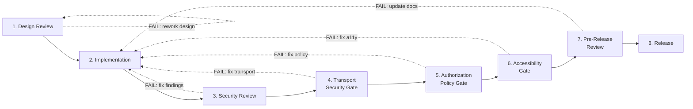

> **WP-ARCH-ALIGN (2026-03-24):** This document has been updated to reflect the frozen auth target model (Rev 2).
> See `Foundation/03-ownership-boundaries.md` FROZEN for the canonical decision.

# 08. Implementation Governance (ADM Phase G)

## 1. Document Control

| Field | Value |
|-------|-------|
| Status | Baselined |
| Owner | Architecture Board |
| Last Updated | 2026-03-05 |
| Architecture Alignment | [10-quality-requirements.md](../Architecture/10-quality-requirements.md), [08-crosscutting.md](../Architecture/08-crosscutting.md) Section 8.14.1 |
| Security Baseline | [SECURITY-TIER-BOUNDARY-AUDIT.md](../governance/SECURITY-TIER-BOUNDARY-AUDIT.md) (SEC-AUDIT-2026-003) |
| Documentation Standards | [DOCUMENTATION-GOVERNANCE.md](../DOCUMENTATION-GOVERNANCE.md) |

---

## 2. Architecture Contract Model

Use [templates/architecture-contract-template.md](./templates/architecture-contract-template.md) for each governed delivery stream.

Architecture contracts bind delivery teams to the following obligations:

| Obligation | Description | Enforcement |
|------------|-------------|-------------|
| ADR Conformance | Implementation must align with accepted ADRs or raise a deviation request | Design Review gate |
| Architecture Traceability | Every architectural change must update affected canonical architecture sections | Pre-Release Review gate |
| TOGAF Artifact Sync | Changes affecting catalogs, matrices, or diagrams must be reflected in TOGAF artifacts | Pre-Release Review gate |
| Security Baseline | 5 CRITICAL + 7 HIGH findings from SEC-AUDIT-2026-003 must not regress; new findings blocked by CI gates | Security Review gate |
| Documentation Single Source of Truth | Per [DOCUMENTATION-GOVERNANCE.md](../DOCUMENTATION-GOVERNANCE.md) Section 4, each topic has one canonical owner document; no duplication of rationale | Pre-Release Review gate |

---

## 3. Compliance Assessment

### 3.1 Governance Gate Flow

### 3.2 Checkpoint Detail

| # | Checkpoint | Scope | Owner | Pass Criteria | Canonical Reference |
|---|------------|-------|-------|---------------|---------------------|
| 1 | **Design Review** | Architecture alignment check before implementation starts | Architecture Board | Proposed implementation aligns with accepted ADRs, canonical building blocks, and TOGAF catalogs; no undeclared dependencies or cross-cutting changes | [review-checklist.md](./governance/review-checklist.md) |
| 2 | **Security Review** | SAST, DAST, SCA, and container scanning before release | SEC Agent / Security Team | Zero unresolved CRITICAL or HIGH findings; all 16 active findings from SEC-AUDIT-2026-003 tracked with remediation status; SAST (SonarQube/Semgrep), DAST (OWASP ZAP), SCA (OWASP dependency-check, `npm audit`), container scan (Trivy/Docker Scout) all pass | [SECURITY-TIER-BOUNDARY-AUDIT.md](../governance/SECURITY-TIER-BOUNDARY-AUDIT.md), Architecture [10-quality-requirements.md](../Architecture/10-quality-requirements.md) Section 10.4 |
| 3 | **Transport Security Gate** | CI check blocks net-new insecure transport entries | DevOps / SEC | `scripts/check-transport-security-baseline.sh` passes; zero net-new `http://` or HTTPS-strict bypass flags introduced vs approved allowlist (`scripts/transport-security-allowlist.txt`); existing debt tracked for burn-down | Architecture [08-crosscutting.md](../Architecture/08-crosscutting.md) Section 8.14.1, [Architecture section 9.5.1](../Architecture/09-architecture-decisions.md#951-production-parity-security-baseline-adr-022) |
| 4 | **Authorization Policy Gate** | All policy test gates pass | QA / DEV | All six authorization test gates pass in CI: (a) Contract tests -- login/refresh response schema validated; (b) Backend authorization tests -- `@PreAuthorize` / `@FeatureGate` positive and negative; (c) Data-classification tests -- all levels including masking; (d) Drift tests -- `policyVersion` mismatch handling; (e) E2E visibility tests -- route/menu allow + deny per policy key; (f) Tamper tests -- frontend state tampering blocked at backend | Architecture [10-quality-requirements.md](../Architecture/10-quality-requirements.md) Section 10.6 |
| 5 | **Accessibility Gate** | WCAG 2.2 AA mandatory + AAA target checks | QA / UX | Automated WCAG 2.2 AA checks pass (AAA target) on login + administration + one tenant-scoped business page; Playwright + `@axe-core/playwright` in CI; keyboard navigation verified for global shell, login form, administration dock; contrast conformance for AA/AAA; responsive conformance at mobile/tablet/desktop; visual regression baselines pass | Architecture [10-quality-requirements.md](../Architecture/10-quality-requirements.md) Section 10.7 |
| 6 | **Pre-Release Review** | Documentation completeness and evidence collection | Architecture Board | Canonical architecture sections updated for all affected areas; ADR status accurate per Rule 8 lifecycle; TOGAF matrices/catalogs updated for traceability; all evidence artifacts collected and filed | [DOCUMENTATION-GOVERNANCE.md](../DOCUMENTATION-GOVERNANCE.md) Sections 5-6 |

---

## 4. Evidence Requirements

Every governed change must produce the following evidence artifacts before release clearance is granted.

| # | Evidence Artifact | Description | Produced By | Filed In |
|---|-------------------|-------------|-------------|----------|
| 1 | ADR or decision impact statement | New section 09 decision entry created, or explicit statement that no architectural decision was affected | ARCH / SA | `Documentation/Architecture/09-architecture-decisions.md` |
| 2 | Updated architecture sections | All canonical architecture sections affected by the change reflect current implementation state with accurate status tags (`IMPLEMENTED`, `PARTIAL`, `DESIGN-ONLY`) where applicable | ARCH / SA / DOC | `Documentation/Architecture/` |
| 3 | Updated TOGAF matrices/catalogs | Capability-to-service, application-to-technology, application-to-data, and requirement-to-ADR matrices updated for traceability | ARCH | `Documentation/togaf/artifacts/` |
| 4 | Security scan results | SAST, DAST, SCA, and container scan reports with zero CRITICAL/HIGH unresolved findings | SEC | CI pipeline artifacts |
| 5 | Transport security allowlist delta check | Output of `scripts/check-transport-security-baseline.sh` confirming zero net-new insecure transport entries vs `scripts/transport-security-allowlist.txt` | DevOps / SEC | CI pipeline log |
| 6 | Authorization policy test gate pass evidence | CI execution report showing all six policy test gates pass (contract, backend authorization, data-classification, drift, E2E visibility, tamper) | QA | CI pipeline artifacts |
| 7 | Accessibility audit results | `@axe-core/playwright` scan report + keyboard navigation check + contrast conformance + responsive conformance evidence | QA / UX | CI pipeline artifacts |
| 8 | Implementation validation evidence | Unit test results (>=80% line coverage on changed modules), integration test results (Testcontainers), E2E test results (Playwright critical journeys) | DEV / QA | CI pipeline artifacts, `docs/sdlc-evidence/qa-report.md` |

---

## 5. Security Audit Baseline

The [Security Tier Boundary Audit](../governance/SECURITY-TIER-BOUNDARY-AUDIT.md) (SEC-AUDIT-2026-003, dated 2026-03-02) established the current security risk baseline. All governed releases must demonstrate non-regression against these findings.

### 5.1 Findings Summary

| Severity | Count | Key Areas |
|----------|-------|-----------|
| CRITICAL | 5 | Flat network topology (SEC-01), frontend-to-database reachability (SEC-02), shared `postgres` superuser (SEC-03), absence of network policies (SEC-04), unnecessary host port exposure (SEC-05) |
| HIGH | 7 | Hardcoded credential defaults (SEC-06), missing JWT validation in 7/8 services (SEC-07), missing JDBC SSL in ai-service (SEC-08), Neo4j Community lacking RBAC (SEC-09), unauthenticated Valkey (SEC-10), unauthenticated Kafka (SEC-11), missing token blacklist check at gateway (SEC-12) |
| MEDIUM | 4 | No encryption at rest (SEC-13), MailHog exposure (SEC-14), missing container resource limits (SEC-15), hardcoded Jasypt master key defaults (SEC-16) |
| ACCEPTABLE | 1 | Development host port mapping (SEC-17) |

### 5.2 Governance Rule

- No release may introduce a **new** CRITICAL or HIGH finding.
- Existing findings must have a tracked remediation plan with target dates.
- The Transport Security Gate (checkpoint 3) enforces the production-parity rule from ADR-022, blocking net-new insecure transport entries in CI.

---

## 6. Documentation Governance Integration

Per [DOCUMENTATION-GOVERNANCE.md](../DOCUMENTATION-GOVERNANCE.md), implementation governance enforces the following documentation standards.

### 6.1 Section Ownership (RACI)

| Doc Type | Accountable | Approval Authority |
|----------|-------------|-------------------|
| Architecture (01-12) | Architecture Team (ARCH) | Architecture Board |
| Strategic ADRs | Architecture Team (ARCH) | Architecture Board |
| Tactical ADRs | Solution Architect (SA) | SA Lead |
| LLDs | Solution Architect (SA) | SA Lead |
| TOGAF Artifacts | Architecture Team (ARCH) | Architecture Board |
| Service READMEs | Backend/Frontend Developers | Tech Lead / Self |

### 6.2 Approval Process

Per [DOCUMENTATION-GOVERNANCE.md](../DOCUMENTATION-GOVERNANCE.md) Section 5, the approval flow varies by document type:

- **Architecture 01-12 docs and Strategic ADRs**: Submitted to ARCH for review; Architecture Board approval required before merge.
- **Tactical ADRs, LLDs, Data Models**: Submitted to SA for review; SA approval required before merge.
- **Service READMEs**: Self-approved by the owning team.

### 6.3 Synchronization Rules

When an ADR is accepted, per [DOCUMENTATION-GOVERNANCE.md](../DOCUMENTATION-GOVERNANCE.md) Section 6:

1. Mapped canonical architecture sections must be updated to reflect the decision.
2. Cross-references from the architecture set to the ADR must be added.
3. If superseding, the old ADR must be marked "Superseded by ADR-NNN".
4. The ADR index in `Documentation/Architecture/09-architecture-decisions.md` must be refreshed.

### 6.4 Single Source of Truth Enforcement

| Topic | Canonical Source | Other Documents |
|-------|-----------------|-----------------|
| Platform constraints | `Documentation/Architecture/02-constraints.md` | Short summary + link only |
| Decision rationale | `Documentation/Architecture/09-architecture-decisions.md` | Reference only |
| Crosscutting policies | `Documentation/Architecture/08-crosscutting.md` | Policy reference only |
| Quality gates and SLOs | `Documentation/Architecture/10-quality-requirements.md` | Reference only |
| Security audit findings | `Documentation/governance/SECURITY-TIER-BOUNDARY-AUDIT.md` | Summary + link only |

---

## 7. Deviations and Waivers

| Deviation ID | Description | Impact | Approved By | Expiry |
|--------------|-------------|--------|-------------|--------|
| DV-001 | Development environment uses single flat Docker network (SEC-01 accepted risk for local debugging) | Low (dev only) | Architecture Board | Until staging/production deployment |

Any deviation from a governed checkpoint must be formally raised, impact-assessed, and approved by the Architecture Board. Approved deviations are time-bound and must include a remediation plan.

---

## 8. Sign-off

| Role | Name | Decision | Date |
|------|------|----------|------|
| Architecture Board | | Pending | |

---

## 9. Canonical Source References

| Source | Location | Content Used |
|--------|----------|--------------|
| Architecture Quality Requirements | [`Documentation/Architecture/10-quality-requirements.md`](../Architecture/10-quality-requirements.md) | Quality gates (Section 10.4), authorization policy test gates (Section 10.6), accessibility gates (Section 10.7), production-parity governance (Section 10.5) |
| Architecture Crosscutting Concepts | [`Documentation/Architecture/08-crosscutting.md`](../Architecture/08-crosscutting.md) | Production-parity rule (Section 8.14.1), ADR-022 enforcement posture |
| Security Tier Boundary Audit | [`Documentation/governance/SECURITY-TIER-BOUNDARY-AUDIT.md`](../governance/SECURITY-TIER-BOUNDARY-AUDIT.md) | 5 CRITICAL + 7 HIGH + 4 MEDIUM findings (SEC-AUDIT-2026-003) |
| Documentation Governance | [`Documentation/DOCUMENTATION-GOVERNANCE.md`](../DOCUMENTATION-GOVERNANCE.md) | Section ownership (Section 2), approval processes (Section 5), synchronization rules (Section 6), single source of truth matrix (Section 4) |
| ADR-022 | [`Documentation/Architecture/09-architecture-decisions.md#951-production-parity-security-baseline-adr-022`](../Architecture/09-architecture-decisions.md#951-production-parity-security-baseline-adr-022) | Production-parity security baseline, CI transport-security enforcement |
| Architecture Contract Template | [`Documentation/togaf/templates/architecture-contract-template.md`](./templates/architecture-contract-template.md) | Contract structure for governed delivery streams |

---

**Previous Section:** [Migration Planning](./07-migration-planning.md)
**Next Section:** [Architecture Change Management](./09-architecture-change-management.md)
