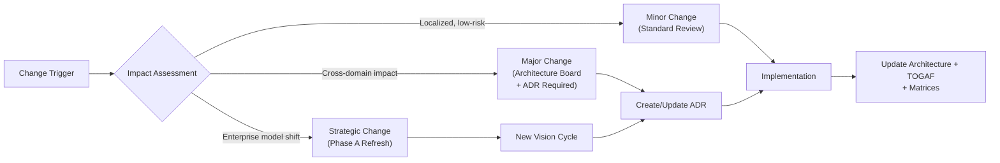

> **WP-ARCH-ALIGN (2026-03-24):** This document has been updated to reflect the frozen auth target model (Rev 2).
> See `Foundation/03-ownership-boundaries.md` FROZEN for the canonical decision.

# 09. Architecture Change Management (ADM Phase H)

## 1. Document Control

| Field | Value |
|-------|-------|
| Status | Baselined |
| Owner | Architecture Board |
| Last Updated | 2026-03-05 |
| Architecture Alignment | [09-Architecture Decisions](../Architecture/09-architecture-decisions.md), [11-Risks and Technical Debt](../Architecture/11-risks-technical-debt.md) |

## 2. Change Trigger Catalog

| Trigger | Example | Required Action |
|---------|---------|-----------------|
| Business strategy change | New product model, new tenant type | Reassess capability map and roadmap |
| Regulatory/security change | New compliance requirement, audit finding | Update security controls, ADR, and architecture artifacts |
| Technology risk signal | Critical dependency CVE, version EOL | Run architecture impact assessment |
| Delivery friction signal | Repeated boundary conflicts, cross-service coupling | Revisit service/domain boundaries |
| Security audit finding | CRITICAL/HIGH finding from tier boundary audit | Immediate triage, ADR if architectural change needed |
| Infrastructure risk signal | Data loss incident, HA gap identified | Trigger infrastructure hardening work package |
| Documentation drift | Runtime behavior diverges from documented architecture | Mandatory architecture + TOGAF + ADR synchronization |

## 3. Change Classification

| Type | Criteria | Governance Path | ADR Required |
|------|----------|-----------------|--------------|
| Minor | Localized, low-risk, single-service | Standard architecture review | No (impact statement only) |
| Major | Cross-domain impact, security boundary change | Architecture board + ADR required | Yes |
| Strategic | Enterprise model shift, new deployment mode | New vision cycle (Phase A refresh) | Yes |

## 4. Review Cadence

| Cadence | Scope | Participants |
|---------|-------|-------------|
| Sprint | Emerging deviations and tactical updates | Dev leads + Architecture |
| Release | Compliance, traceability, security gate checks | Architecture Board + QA + Security |
| Quarterly | Architecture health, roadmap alignment, risk review | Full Architecture Board |

## 5. Change Log

| Date | Change | Type | Decision | ADR |
|------|--------|------|----------|-----|
| 2026-03-04 | Production-parity security baseline adopted | Major | Accepted | [ADR-022](../Architecture/09-architecture-decisions.md#951-production-parity-security-baseline-adr-022) |
| 2026-03-02 | Service credential management strategy | Major | Accepted | [ADR-020](../Architecture/09-architecture-decisions.md#953-service-credential-management-adr-020) |
| 2026-03-02 | Encryption at rest strategy | Major | Accepted | [ADR-019](../Architecture/09-architecture-decisions.md#952-encryption-at-rest-strategy-adr-019) |
| 2026-03-02 | High availability multi-tier architecture | Strategic | Accepted | [ADR-018](../Architecture/09-architecture-decisions.md#954-high-availability-and-multi-tier-architecture-adr-018) |
| 2026-03-01 | Data classification and access control | Major | Accepted | [ADR-017](../Architecture/09-architecture-decisions.md#914-data-classification-access-control-adr-017) |
| 2026-02-25 | Polyglot persistence (Neo4j + PostgreSQL) | Strategic | Accepted | [ADR-001/016](../Architecture/09-architecture-decisions.md#911-polyglot-persistence-adr-001-adr-016) |
| 2026-03-24 | WP-ARCH-ALIGN: Frozen auth target model (Rev 2) alignment gate applied to all TOGAF documents. Neo4j removed from auth target domain; auth-facade and user-service marked [TRANSITION]; tenant-service becomes auth aggregate root; api-gateway becomes auth edge home. | Strategic | Accepted | Frozen Auth Target Model Rev 2 |
| 2026-02-25 | TOGAF + canonical architecture documentation framework established | Strategic | Accepted | N/A |

## 6. Change Impact Assessment Protocol

Every major or strategic change must include:

| Evidence | Description |
|----------|-------------|
| ADR or impact statement | Decision rationale and alternatives considered |
| architecture section updates | Affected sections identified and updated |
| TOGAF phase updates | Affected ADM phase artifacts, catalogs, and matrices updated |
| Security impact | Assessment of security boundary changes |
| Infrastructure impact | Assessment of deployment/infrastructure changes |
| Test impact | New or modified test gates identified |

Canonical operating rule: [arc42-to-TOGAF Mapping](./mapping/arc42-to-togaf-mapping.md).
