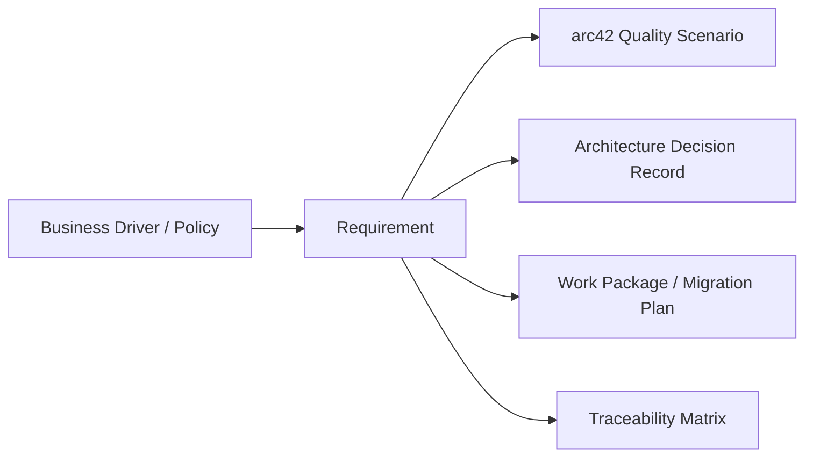

# 10. Requirements Management (Central ADM Function)

## 1. Document Control

| Field | Value |
|-------|-------|
| Status | Baselined |
| Owner | Architecture + Product |
| Last Updated | 2026-03-13 |

## 2. Purpose

This document is the TOGAF Requirements Management artifact for EMSIST. It maintains a governed backlog of architecture-significant requirements, traces each requirement to its source (arc42 quality scenarios, ADRs, business drivers), and records change control decisions that alter the requirement baseline.

Canonical quality scenarios are defined in [arc42/10-quality-requirements.md](../Architecture/10-quality-requirements.md). Canonical customer delivery and provisioning requirements are baselined in [R07 Cross-Cutting Platform Requirements](../.Requirements/R07.%20PLATFORM%20OPERATIONS%20AND%20CUSTOMER%20DELIVERY/Design/01-Cross-Cutting-Platform-Requirements.md). This document manages the lifecycle of requirements derived from those scenarios and from ADR-driven obligations.

## 3. Requirements Backlog

### 3.1 Security Requirements

| Req ID | Requirement | Source | Priority | Status |
|--------|-------------|--------|----------|--------|
| RQ-SEC-001 | 100% tenant isolation correctness -- every data-access path must be scoped to the authenticated tenant | arc42 SEC-01 | Critical | Active |
| RQ-SEC-002 | Account protection policy always enforced on invalid credential attempts | arc42 SEC-02 | Critical | Active |
| RQ-SEC-003 | 401 response always returned for expired access tokens | arc42 SEC-03 | Critical | Active |
| RQ-SEC-004 | 100% Cypher injection attempts blocked | arc42 SEC-04 | Critical | Active |
| RQ-SEC-005 | 100% XSS attack payloads sanitized or escaped | arc42 SEC-05 | Critical | Active |
| RQ-SEC-006 | Complete authorization context (roles, responsibilities, features, policyVersion) returned on login and refresh | arc42 SEC-06 | High | Active |
| RQ-SEC-007 | 100% backend enforcement (403) on frontend/UI bypass attempts | arc42 SEC-07 | Critical | Active |
| RQ-SEC-008 | Default deny always enforced for missing policy mappings | arc42 SEC-08 | Critical | Active |
| RQ-SEC-009 | Volume-level encryption at rest for all data stores (LUKS/FileVault for Docker, encrypted StorageClass for K8s) | ADR-019 | High | Active |
| RQ-SEC-010 | TLS in-transit for all service-to-datastore connections | ADR-019 | High | Active |
| RQ-SEC-011 | Per-service database credentials with least privilege (SCRAM-SHA-256, credential externalization) | ADR-020 | High | Active |
| RQ-SEC-012 | Production-parity transport security baseline -- zero net-new insecure transport entries vs approved allowlist | ADR-022 | High | Active |
| RQ-SEC-013 | Authentication continuity requires persistent Keycloak realm/user state plus license-seat, Valkey, and clock prerequisites during restart, upgrade, and restore | R07-AUTH-001, R07-AUTH-003 | Critical | Active |

### 3.2 Performance Requirements

| Req ID | Requirement | Source | Priority | Status |
|--------|-------------|--------|----------|--------|
| RQ-PERF-001 | Core GET endpoint p95 latency < 100 ms under normal load | arc42 PERF-01 | High | Active |
| RQ-PERF-002 | Complex query endpoint p95 latency < 500 ms | arc42 PERF-02 | High | Active |
| RQ-PERF-003 | Cached read path response < 5 ms typical | arc42 PERF-03 | Medium | Active |
| RQ-PERF-004 | Sustained throughput >= 1000 req/s on target profile | arc42 PERF-04 | High | Active |

### 3.3 Reliability Requirements

| Req ID | Requirement | Source | Priority | Status |
|--------|-------------|--------|----------|--------|
| RQ-REL-001 | >= 99.9% monthly uptime | arc42 REL-01 | Critical | Active |
| RQ-REL-002 | Service restart recovery < 30 s | arc42 REL-02 | High | Active |
| RQ-REL-003 | Automated database backups with validated restore procedures (Phase 1 of HA strategy) | ADR-018 | High | Active |
| RQ-REL-004 | App-tier rebuilds and upgrades preserve Postgres, Neo4j, Valkey, and Keycloak-backed identity data with no customer data loss | R07-DUR-001 | Critical | Active |

### 3.4 Infrastructure Requirements

| Req ID | Requirement | Source | Priority | Status |
|--------|-------------|--------|----------|--------|
| RQ-INF-001 | Three-network tier segmentation (public ingress, application tier, data tier) | ADR-018 | High | Active |
| RQ-INF-002 | Kubernetes HA deployment with operator-managed databases (Phase 2 of HA strategy) | ADR-018 | Medium | Active |
| RQ-INF-003 | Encrypted backup storage for all automated database backups | ADR-018, ADR-019 | High | Active |
| RQ-INF-004 | Customer production installation package is artifact-only and uses versioned runtime artifacts rather than source checkout, source code, or local builds | R07-PKG-001, R07-PKG-002 | High | Active |
| RQ-INF-005 | Provisioning must separate `preflight`, `first_install`, `upgrade`, and `restore` modes with idempotent bootstrap rules | R07-PROV-001 | High | Active |
| RQ-INF-006 | Customer release approval requires successful backup/restore proof and persisted-user login verification after app-tier rebuild or upgrade | R07-DUR-003, R07-AUTH-003 | Critical | Active |
| RQ-INF-007 | Customer deployment contract supports Docker, Kubernetes, and local/native runtime adapters without changing lifecycle semantics | R07-PKG-005 | High | Active |
| RQ-INF-008 | Deployment tooling preserves four logical deployment roles: `postgres`, `neo4j`, `keycloak`, and `services` | R07-PROV-006 | High | Active |

## 4. Traceability Rules

Each requirement must be traceable to:

1. **Business driver or policy** -- the organizational need or compliance obligation that motivates the requirement.
2. **Architecture artifact** -- the catalog, matrix, or diagram in arc42 or TOGAF that realises or constrains the requirement.
3. **ADR** -- if the requirement triggered or was triggered by an architecture decision.
4. **Work package** -- the migration plan item or sprint backlog entry that delivers the requirement.

## 5. Traceability Matrix

The full requirement-to-ADR-to-arc42 traceability matrix is maintained at:

[artifacts/matrices/requirement-to-adr-matrix.md](./artifacts/matrices/requirement-to-adr-matrix.md)

### 5.1 Summary Traceability (Security)

| Req ID | arc42 Scenario | ADR(s) | arc42 Section(s) |
|--------|----------------|--------|-------------------|
| RQ-SEC-001 | SEC-01 | ADR-003, ADR-010 | 06, 08 |
| RQ-SEC-002 | SEC-02 | ADR-004 | 08 |
| RQ-SEC-003 | SEC-03 | ADR-004, ADR-007 | 08 |
| RQ-SEC-004 | SEC-04 | ADR-001, ADR-009 | 08 |
| RQ-SEC-005 | SEC-05 | -- | 08 |
| RQ-SEC-006 | SEC-06 | ADR-014 | 08, 10 |
| RQ-SEC-007 | SEC-07 | ADR-014 | 08, 10 |
| RQ-SEC-008 | SEC-08 | ADR-014 | 08, 10 |
| RQ-SEC-009 | -- | ADR-019 | 04, 05 |
| RQ-SEC-010 | -- | ADR-019 | 04, 05 |
| RQ-SEC-011 | -- | ADR-020 | 04, 05 |
| RQ-SEC-012 | -- | ADR-022 | 08, 10, 11 |
| RQ-SEC-013 | SEC-13 | ADR-004, ADR-018 | 08, 10 |

### 5.2 Summary Traceability (Performance / Reliability / Infrastructure)

| Req ID | arc42 Scenario | ADR(s) | arc42 Section(s) |
|--------|----------------|--------|-------------------|
| RQ-PERF-001 | PERF-01 | -- | 10 |
| RQ-PERF-002 | PERF-02 | -- | 10 |
| RQ-PERF-003 | PERF-03 | ADR-005 | 06, 08, 10 |
| RQ-PERF-004 | PERF-04 | -- | 10 |
| RQ-REL-001 | REL-01 | ADR-018 | 07, 10 |
| RQ-REL-002 | REL-02 | -- | 07, 10 |
| RQ-REL-003 | -- | ADR-018 | 07 |
| RQ-REL-004 | REL-05 | ADR-018 | 07, 10 |
| RQ-INF-001 | -- | ADR-018 | 07 |
| RQ-INF-002 | -- | ADR-018 | 07 |
| RQ-INF-003 | -- | ADR-018, ADR-019 | 07 |
| RQ-INF-004 | OPS-05 | ADR-032 | 07, 08, 10 |
| RQ-INF-005 | OPS-03 | ADR-032 | 07, 08, 10 |
| RQ-INF-006 | OPS-04 | ADR-032 | 07, 10 |
| RQ-INF-007 | -- | ADR-032 | 07, 08, 10 |
| RQ-INF-008 | -- | ADR-032 | 07, 08 |

## 6. Change Control

| Change Request ID | Requirement Impact | Decision | Owner | Date |
|-------------------|--------------------|----------|-------|------|
| CR-001 | ADR-018 -- introduces RQ-REL-001, RQ-REL-003, RQ-INF-001, RQ-INF-002, RQ-INF-003 (HA Architecture phased strategy: backups, Kubernetes HA, multi-region DR) | Accepted | Architecture | 2026-03-02 |
| CR-002 | ADR-019 -- introduces RQ-SEC-009, RQ-SEC-010 (Encryption at Rest: volume-level encryption, in-transit TLS for all service-to-datastore connections) | Accepted | Architecture + Security | 2026-03-02 |
| CR-003 | ADR-020 -- introduces RQ-SEC-011 (Service Credentials: per-service database users with least privilege, SCRAM-SHA-256, externalization) | Accepted | Architecture + Security | 2026-03-02 |
| CR-004 | ADR-022 -- introduces RQ-SEC-012 (Production-Parity Security: zero net-new insecure transport configurations, CI governance gate) | Accepted | Architecture + Security | 2026-03-04 |
| CR-005 | R07 customer delivery stream -- introduces RQ-SEC-013, RQ-REL-004, and RQ-INF-004 through RQ-INF-008 (artifact-only delivery, provisioning modes, runtime adapters, logical roles, login continuity, upgrade safety) | Accepted | Architecture + Delivery | 2026-03-13 |

## 7. Reporting

Requirements reporting is maintained per release cycle against the following dimensions:

- **Open requirements by priority** -- count of Active requirements at Critical / High / Medium, broken down by category (Security, Performance, Reliability, Infrastructure).
- **Blocked requirements and dependencies** -- requirements that cannot progress until a prerequisite ADR, migration, or external dependency is resolved.
- **Requirements closed per release** -- requirements moved from Active to Verified (test evidence exists) or Deferred (postponed with rationale).

### 7.1 Current Baseline Summary

| Category | Critical | High | Medium | Total |
|----------|----------|------|--------|-------|
| Security (RQ-SEC) | 8 | 5 | 0 | 13 |
| Performance (RQ-PERF) | 0 | 3 | 1 | 4 |
| Reliability (RQ-REL) | 2 | 2 | 0 | 4 |
| Infrastructure (RQ-INF) | 1 | 6 | 1 | 8 |
| **Total** | **11** | **16** | **2** | **29** |

---

**Previous Section:** [09. Architecture Decisions](../Architecture/09-architecture-decisions.md)
**Traceability Matrix:** [requirement-to-adr-matrix.md](./artifacts/matrices/requirement-to-adr-matrix.md)
