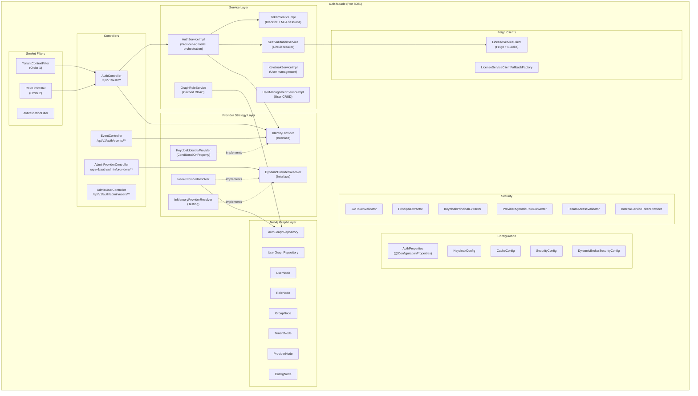
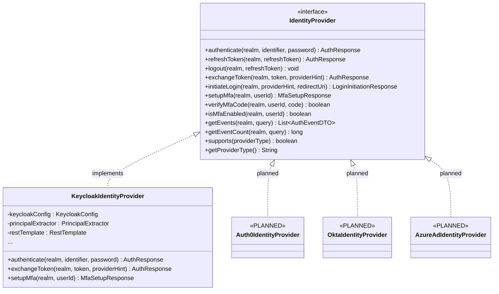
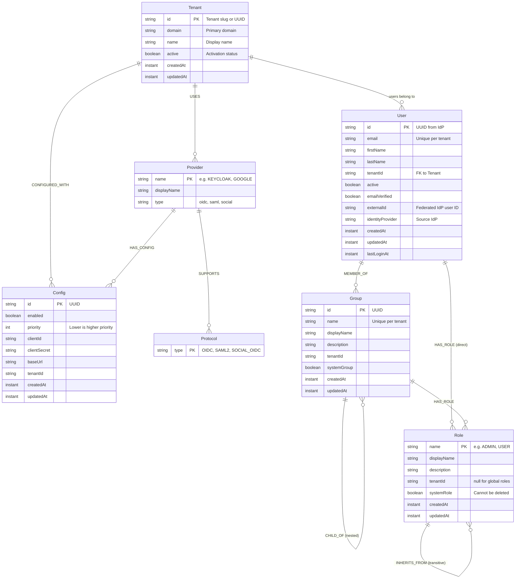
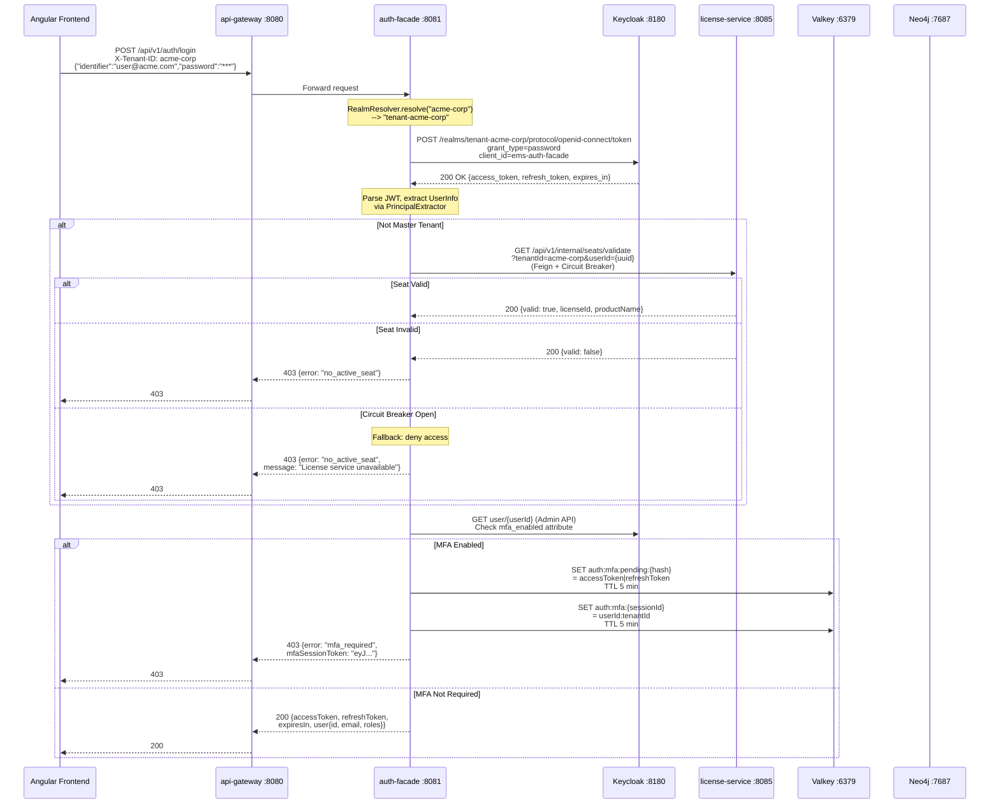
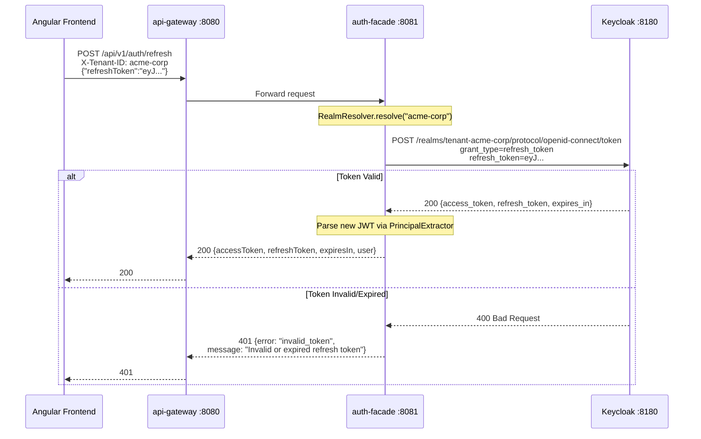
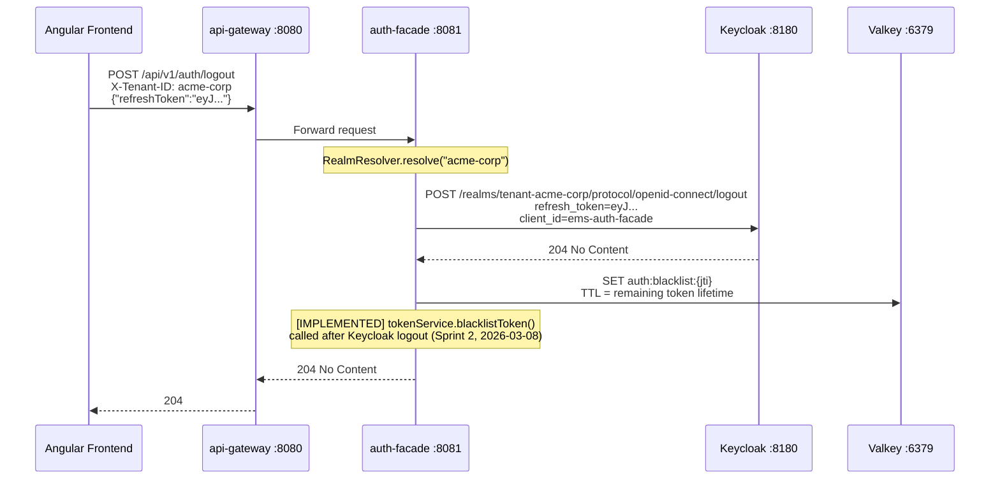
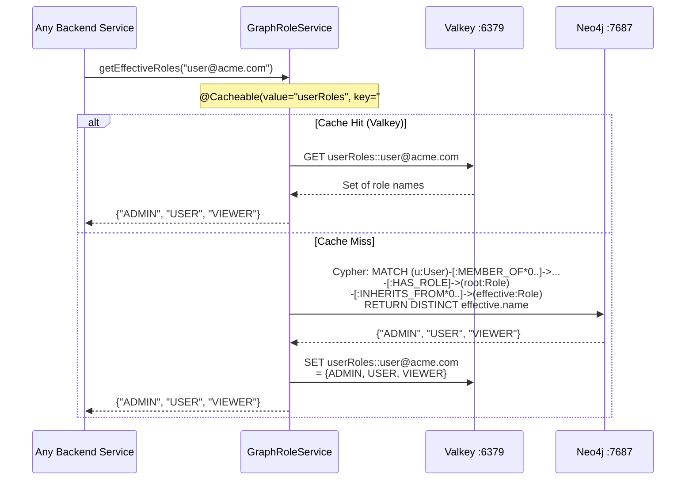
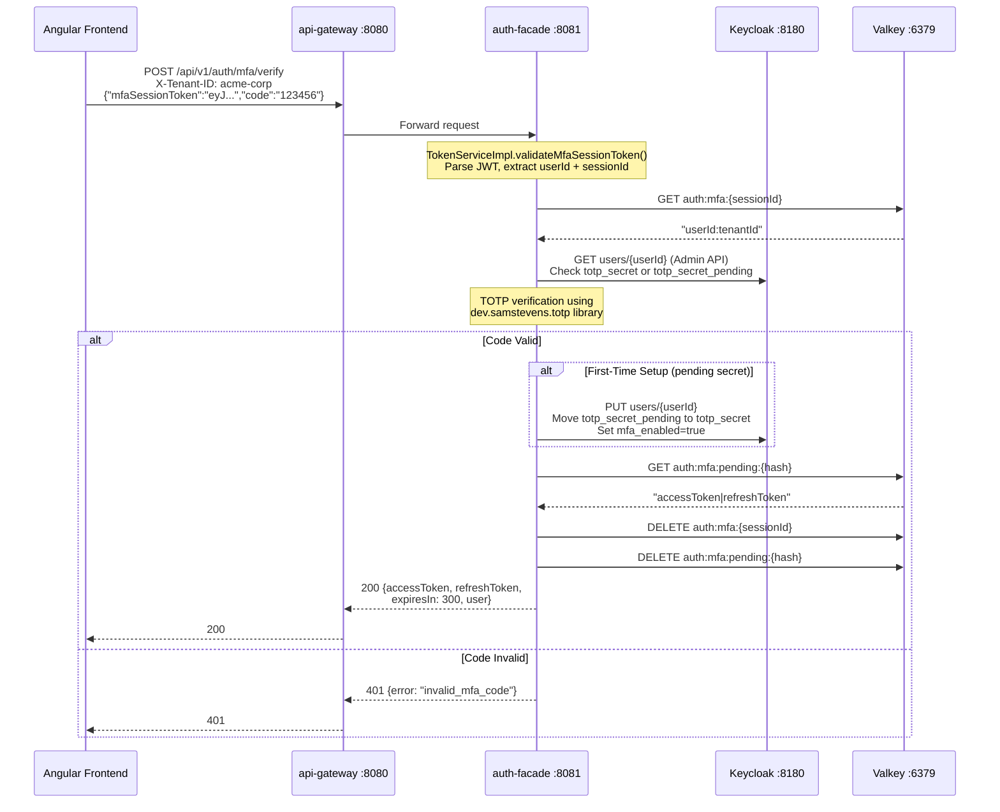

> **WP-ARCH-ALIGN (2026-03-24):** This document has been updated to reflect the frozen auth target model (Rev 2).
> See `Foundation/03-ownership-boundaries.md` FROZEN for the canonical decision.

# ABB-001: Identity Orchestration

## 1. Document Control

| Field | Value |
|-------|-------|
| ABB ID | ABB-001 |
| Name | Identity Orchestration |
| Domain | Application |
| Status | Baselined |
| Owner | Platform Team |
| Last Updated | 2026-03-08 |
| Realized By | SBB-001 (auth-facade + IdentityProvider strategy pattern) |
| Related ADRs | ADR-004 (Keycloak BFF), ADR-007 (Provider-Agnostic), ADR-008 (IDP Consolidation), ADR-014 (RBAC + Licensing) |
| Canonical Sources | [arc42/08-crosscutting.md](../../../Architecture/08-crosscutting.md) Sections 8.2-8.3, [TOGAF/04-application-architecture.md](../../04-application-architecture.md) Section 6 |

## 2. Purpose and Scope

### Purpose

The Identity Orchestration ABB provides **provider-agnostic authentication orchestration** for the EMSIST multi-tenant SaaS platform. It mediates all authentication traffic between the Angular frontend and the identity provider (currently Keycloak) using the Backend-for-Frontend (BFF) pattern, ensuring users never interact directly with the identity provider's UI.

### Problem Solved

1. **Zero-redirect authentication** -- Enterprise SaaS users expect native-feeling login forms, not identity provider redirect pages.
2. **Provider independence** -- Different tenants or deployments may require different identity providers (Keycloak, Auth0, Okta, Azure AD).
3. **Centralized session lifecycle** -- [AS-IS] Token issuance, refresh, blacklisting, MFA orchestration, and RBAC graph evaluation are consolidated in auth-facade. [TARGET] Auth endpoints migrate to api-gateway (edge); RBAC and session control migrate to tenant-service (PostgreSQL authoritative). Auth-facade is removed after migration.
4. **Seat validation at login** -- License compliance is enforced at the authentication boundary before granting access.

### Boundary of Responsibility

| This ABB Owns | This ABB Does NOT Own |
|---------------|----------------------|
| Authentication orchestration (login, refresh, logout) | User profile CRUD (owned by user-service) |
| Identity provider abstraction (strategy pattern) | Tenant lifecycle management (owned by tenant-service) |
| Token exchange for social providers (Google, Microsoft) | License catalog and seat assignment (owned by license-service) |
| MFA setup and verification (TOTP) | API gateway routing and CORS (owned by api-gateway / ABB-005) |
| [AS-IS] RBAC graph evaluation via Neo4j. [TARGET] RBAC owned by tenant-service (PostgreSQL). | Audit event persistence (owned by audit-service / ABB-004) |
| Token blacklisting (Valkey) | Feature gate enforcement annotations (planned, ABB-006) |
| Rate limiting on auth endpoints (Valkey) | Kafka event publishing (planned, ABB-004) |
| Seat validation delegation (Feign to license-service) | Tenant provisioning workflows |
| Dynamic provider configuration per tenant (Neo4j graph) | Frontend authentication state (owned by Angular AuthFacade) |

## 3. Functional Requirements

| Req ID | Description | Priority | Status |
|--------|-------------|----------|--------|
| FR-001 | Authenticate users via email/password (Direct Access Grant) | P0 | [IMPLEMENTED] -- `AuthController.login()` + `AuthServiceImpl.login()` |
| FR-002 | Exchange Google One Tap ID tokens for application tokens (RFC 8693) | P0 | [IMPLEMENTED] -- `AuthController.loginWithGoogle()` + `KeycloakIdentityProvider.exchangeToken()` |
| FR-003 | Exchange Microsoft MSAL access tokens for application tokens | P0 | [IMPLEMENTED] -- `AuthController.loginWithMicrosoft()` |
| FR-004 | Refresh access tokens via refresh token rotation | P0 | [IMPLEMENTED] -- `AuthController.refresh()` + `KeycloakIdentityProvider.refreshToken()` |
| FR-005 | Logout with refresh token revocation | P0 | [IMPLEMENTED] -- `AuthController.logout()` + `KeycloakIdentityProvider.logout()` |
| FR-006 | Setup TOTP MFA for a user | P1 | [IMPLEMENTED] -- `AuthController.setupMfa()` + `KeycloakIdentityProvider.setupMfa()` |
| FR-007 | Verify TOTP MFA code and release pending tokens | P1 | [IMPLEMENTED] -- `AuthController.verifyMfa()` + `AuthServiceImpl.verifyMfa()` |
| FR-008 | Validate user license seat during login | P0 | [IMPLEMENTED] -- `SeatValidationService.validateUserSeat()` via Feign to license-service |
| FR-009 | Deep RBAC role resolution from Neo4j graph (users, groups, inheritance) | P0 | [IMPLEMENTED] -- `GraphRoleService.getEffectiveRoles()` + `AuthGraphRepository.findEffectiveRoles()` |
| FR-010 | Rate limit authentication endpoints (100 req/min per IP+tenant) | P1 | [IMPLEMENTED] -- `RateLimitFilter` backed by Valkey |
| FR-011 | Normalize JWT claims across identity providers via externalized config | P1 | [IMPLEMENTED] -- `AuthProperties.roleClaimPaths` + `AuthProperties.userClaimMappings` |
| FR-012 | Support dynamic per-tenant identity provider configuration | P1 | [IMPLEMENTED] -- `DynamicProviderResolver` + `Neo4jProviderResolver` + `AdminProviderController` |
| FR-013 | Blacklist tokens on logout (Valkey-based JTI blacklist) | P0 | [IMPLEMENTED] -- `TokenServiceImpl.blacklistToken()` wired into `AuthServiceImpl.logout()` (Sprint 2, 2026-03-08) |
| FR-014 | Support Auth0, Okta, Azure AD, FusionAuth as alternative providers | P2 | [PLANNED] -- `IdentityProvider` interface defined; only `KeycloakIdentityProvider` implemented |
| FR-015 | Inactivity timeout with session termination after 30 min | P2 | [PLANNED] -- No idle-session detection exists |
| FR-016 | Max concurrent session enforcement | P2 | [PLANNED] -- No session counting exists |
| FR-017 | Authorization context enrichment (roles + features + clearance) in auth response | P1 | [IN-PROGRESS] -- Auth response now includes `authorization.features` from license-service (Sprint 3, 2026-03-08); clearance data still planned |

## 4. Interfaces

### 4.1 Provided Interfaces (APIs This ABB Exposes)

All endpoints are routed through api-gateway at `:8080` and forwarded to auth-facade at `:8081`.

**Evidence:** Verified against `AuthController.java` at `/Users/mksulty/Claude/Projects/EMSIST/backend/auth-facade/src/main/java/com/ems/auth/controller/AuthController.java`.

| Interface ID | Endpoint | Method | Description | Auth Required | Status |
|-------------|----------|--------|-------------|---------------|--------|
| IF-P-001 | `/api/v1/auth/login` | POST | Email/password login with seat validation and MFA check | No (public) | [IMPLEMENTED] |
| IF-P-002 | `/api/v1/auth/social/google` | POST | Google One Tap token exchange (RFC 8693) | No (public) | [IMPLEMENTED] |
| IF-P-003 | `/api/v1/auth/social/microsoft` | POST | Microsoft MSAL token exchange | No (public) | [IMPLEMENTED] |
| IF-P-004 | `/api/v1/auth/refresh` | POST | Refresh token rotation | No (refresh token in body) | [IMPLEMENTED] |
| IF-P-005 | `/api/v1/auth/logout` | POST | Logout with refresh token revocation | No (refresh token in body) | [IMPLEMENTED] |
| IF-P-006 | `/api/v1/auth/mfa/setup` | POST | Initialize TOTP MFA | Yes (Bearer JWT) | [IMPLEMENTED] |
| IF-P-007 | `/api/v1/auth/mfa/verify` | POST | Verify TOTP code and release pending tokens | No (MFA session token in body) | [IMPLEMENTED] |
| IF-P-008 | `/api/v1/auth/me` | GET | Get current user profile from JWT | Yes (Bearer JWT) | [IMPLEMENTED] |
| IF-P-009 | `/api/v1/auth/login/{provider}` | GET | Initiate login via specific IdP (kc_idp_hint) | No (public) | [IMPLEMENTED] |
| IF-P-010 | `/api/v1/auth/providers` | GET | List available identity providers for tenant | No (X-Tenant-ID optional) | [IMPLEMENTED] |
| IF-P-011 | `/api/v1/auth/events` | GET | Query authentication events from Keycloak | Yes (Bearer JWT) | [IMPLEMENTED] |
| IF-P-012 | `/api/v1/auth/admin/providers/**` | CRUD | Dynamic per-tenant provider management | Yes (ADMIN role) | [IMPLEMENTED] |

#### Request/Response Examples

**Login (IF-P-001):**

Request:
```json
{
  "identifier": "admin@example.com",
  "password": "password123"
}
```

Headers: `X-Tenant-ID: master` (required)

Response (200 OK):
```json
{
  "accessToken": "eyJhbGciOiJSUzI1NiIs...",
  "refreshToken": "eyJhbGciOiJSUzI1NiIs...",
  "expiresIn": 300,
  "user": {
    "id": "550e8400-e29b-41d4-a716-446655440000",
    "email": "admin@example.com",
    "firstName": "Admin",
    "lastName": "User",
    "tenantId": "master",
    "roles": ["SUPER_ADMIN", "ADMIN"]
  }
}
```

Response (403 -- MFA Required):
```json
{
  "error": "mfa_required",
  "mfaSessionToken": "eyJhbGciOiJIUzUxMiIs..."
}
```

Response (403 -- No Active Seat):
```json
{
  "error": "no_active_seat",
  "message": "User does not have an active license seat for tenant xyz"
}
```

### 4.2 Required Interfaces (Dependencies This ABB Consumes)

| Interface ID | Provider | Purpose | Protocol | Failure Mode | Status |
|-------------|----------|---------|----------|-------------|--------|
| IF-R-001 | Keycloak (`:8180`) | Token endpoint (Direct Access Grant, refresh, token exchange) | REST/HTTPS | `AuthenticationException("auth_provider_unavailable")` | [IMPLEMENTED] |
| IF-R-002 | Keycloak (`:8180`) | Admin REST API (MFA setup, user management, event query) | REST/HTTPS | `AuthenticationException("Failed to setup MFA")` | [IMPLEMENTED] |
| IF-R-003 | Keycloak (`:8180`) | Logout endpoint (refresh token revocation) | REST/HTTPS | Idempotent -- logs warning but does not throw | [IMPLEMENTED] |
| IF-R-004 | license-service (Eureka: `license-service`) | Seat validation (`/api/v1/internal/seats/validate`) | Feign/HTTP | Circuit breaker (`failureRateThreshold: 50`, `waitDuration: 30s`) --> fallback denies access | [IMPLEMENTED] |
| IF-R-005 | [AS-IS] Neo4j (`:7687`) | RBAC graph queries (role resolution, provider config) | Bolt (plaintext) | Empty role set returned | [IMPLEMENTED] -- `bolt://` plaintext, TLS planned. [TARGET] RBAC migrates to tenant-service (PostgreSQL); Neo4j removed from auth domain. |
| IF-R-006 | Valkey (`:6379`) | Rate limiting, token blacklist, MFA pending state | Redis protocol | Rate limiting skipped on Valkey failure; blacklist check skipped | [IMPLEMENTED] -- no TLS |
| IF-R-007 | Eureka (`:8761`) | Service discovery for Feign clients | HTTP | Feign falls back to static URL if configured | [IMPLEMENTED] |

## 5. Internal Component Design

### 5.1 Component Diagram



### 5.2 Strategy Pattern Detail

The core extensibility mechanism is the `IdentityProvider` strategy interface. The active provider is selected at Spring Boot startup via `@ConditionalOnProperty(name = "auth.facade.provider")`.

**Evidence:** `IdentityProvider.java` at `/Users/mksulty/Claude/Projects/EMSIST/backend/auth-facade/src/main/java/com/ems/auth/provider/IdentityProvider.java`.



**File evidence:**
- Interface: `/Users/mksulty/Claude/Projects/EMSIST/backend/auth-facade/src/main/java/com/ems/auth/provider/IdentityProvider.java`
- Keycloak implementation: `/Users/mksulty/Claude/Projects/EMSIST/backend/auth-facade/src/main/java/com/ems/auth/provider/KeycloakIdentityProvider.java` (line 56: `@ConditionalOnProperty(name = "auth.facade.provider", havingValue = "keycloak", matchIfMissing = true)`)
- Auth0/Okta/Azure AD: **DO NOT EXIST** -- config placeholders only (`application-auth0.yml`, etc.)

### 5.3 Dynamic Provider Resolver

[AS-IS] Per-tenant provider configuration is stored in the Neo4j identity graph and resolved at runtime. [TARGET] Provider configuration migrates to tenant-service (PostgreSQL); Neo4j is removed from the auth domain. This enables multi-provider deployments where different tenants use different identity providers.

**Evidence:** `DynamicProviderResolver.java` at `/Users/mksulty/Claude/Projects/EMSIST/backend/auth-facade/src/main/java/com/ems/auth/provider/DynamicProviderResolver.java`.

Key operations:
- `resolveProvider(tenantId, providerName)` -- Resolve specific provider config
- `listProviders(tenantId)` / `listEnabledProviders(tenantId)` -- List all/enabled providers
- `registerProvider(tenantId, request)` -- Register new provider for tenant
- `updateProvider()` / `deleteProvider()` -- CRUD on provider configs
- `invalidateCache(tenantId)` -- Cache invalidation after direct DB changes
- `getDefaultProvider(tenantId)` -- Highest-priority enabled provider

Two implementations exist:
- `Neo4jProviderResolver` -- Production, backed by `AuthGraphRepository` Cypher queries
- `InMemoryProviderResolver` -- Testing/fallback

## 6. Data Model

### 6.1 Neo4j Identity Graph (RBAC)

> [AS-IS] The RBAC data model is stored in Neo4j as a labeled property graph. This enables deep traversal queries for role inheritance and group membership resolution.
> [TARGET] The RBAC data model migrates to tenant-service (PostgreSQL). Neo4j is removed from the auth domain entirely.

**Evidence:** All graph entities verified in `/Users/mksulty/Claude/Projects/EMSIST/backend/auth-facade/src/main/java/com/ems/auth/graph/entity/`.



### 6.2 Graph Traversal for Role Resolution

The Cypher query for deep role resolution traverses three relationship types in a single query:

**Evidence:** `AuthGraphRepository.findEffectiveRoles()` at line 132 of `/Users/mksulty/Claude/Projects/EMSIST/backend/auth-facade/src/main/java/com/ems/auth/graph/repository/AuthGraphRepository.java`.

```cypher
MATCH (u:User {email: $email})-[:MEMBER_OF*0..]->(groupOrUser)
MATCH (groupOrUser)-[:HAS_ROLE]->(rootRole:Role)
MATCH (rootRole)-[:INHERITS_FROM*0..]->(effectiveRole:Role)
RETURN DISTINCT effectiveRole.name
```

This traverses:
1. **User --> Groups** (variable-length `MEMBER_OF*0..` for nested groups)
2. **User/Group --> Roles** (direct `HAS_ROLE` assignments)
3. **Role --> Parent Roles** (transitive `INHERITS_FROM*0..` inheritance)

### 6.3 Valkey Cache Data Structures

| Cache Key Pattern | Data Type | TTL | Contents | Status |
|-------------------|-----------|-----|----------|--------|
| `userRoles::{email}` | Spring Cache (`@Cacheable`) | Configurable (CacheConfig) | `Set<String>` of effective role names | [IMPLEMENTED] -- `GraphRoleService` line 47 |
| `auth:blacklist:{jti}` | Valkey String | Remaining token lifetime (min 60s) | `"1"` (presence indicates blacklisted) | [IMPLEMENTED] -- `TokenServiceImpl.blacklistToken()` line 91 |
| `auth:mfa:pending:{hashCode}` | Valkey String | 5 minutes | `"accessToken|refreshToken"` (pipe-delimited) | [IMPLEMENTED] -- `AuthServiceImpl.storePendingTokens()` line 176 |
| `auth:mfa:{sessionId}` | Valkey String | 5 minutes (configurable) | `"userId:tenantId"` | [IMPLEMENTED] -- `TokenServiceImpl.createMfaSessionToken()` line 120 |
| `auth:rate:{tenantId}:{ip}` | Valkey String (counter) | 60 seconds (fixed window) | Request count integer | [IMPLEMENTED] -- `RateLimitFilter` line 54 |

## 7. Integration Points

### 7.1 Login Flow (BFF Zero-Redirect)

This diagram shows the complete login flow including seat validation, MFA check, and RBAC graph evaluation.

**Evidence:** Verified against `AuthServiceImpl.login()` (lines 41-65) and `SeatValidationService.validateUserSeat()`.



### 7.2 Token Refresh Flow

**Evidence:** Verified against `AuthServiceImpl.refreshToken()` (line 114) and `KeycloakIdentityProvider.refreshToken()` (line 101).



### 7.3 Logout Flow

**Evidence:** Verified against `AuthServiceImpl.logout()` (line 122) and `KeycloakIdentityProvider.logout()` (line 126).

**NOTE:** SEC-GAP-001 has been resolved (Sprint 2, 2026-03-08) -- the logout flow now blacklists the access token via `tokenService.blacklistToken()`.



### 7.4 RBAC Evaluation Flow

**Evidence:** Verified against `GraphRoleService.getEffectiveRoles()` (line 48) and `AuthGraphRepository.findEffectiveRoles()` (line 132).



### 7.5 MFA Verification Flow

**Evidence:** Verified against `AuthServiceImpl.verifyMfa()` (line 138) and `KeycloakIdentityProvider.verifyMfaCode()` (line 230).



## 8. Security Considerations

### 8.1 Authentication Mechanisms

| Mechanism | Implementation | Evidence |
|-----------|---------------|----------|
| Direct Access Grant (ROPC) | `KeycloakIdentityProvider.authenticate()` -- client_id + client_secret + username + password | [IMPLEMENTED] line 74 |
| RFC 8693 Token Exchange | `KeycloakIdentityProvider.exchangeToken()` -- subject_token + subject_issuer | [IMPLEMENTED] line 147 |
| TOTP MFA | `dev.samstevens.totp` library with SHA1, 6 digits, 30s period | [IMPLEMENTED] line 196-227 |
| Recovery Codes | 8 recovery codes generated via `RecoveryCodeGenerator` | [IMPLEMENTED] line 215 |

### 8.2 Token Security

| Control | Current State | Status |
|---------|--------------|--------|
| JWT signing | RS256 (Keycloak-issued, JWKS validation) | [IMPLEMENTED] |
| Access token lifetime | 5 min (Keycloak realm setting) | [IMPLEMENTED] |
| Refresh token lifetime | 30 min (Keycloak realm setting) | [IMPLEMENTED] |
| Token storage (frontend) | In-memory (not localStorage) | [IMPLEMENTED] -- per ADR-004 |
| MFA session token | HMAC-SHA512 (internal), 5 min TTL, backed by Valkey | [IMPLEMENTED] |
| Token blacklist mechanism | Valkey SET with TTL by JTI | [IMPLEMENTED] -- mechanism only, NOT wired to logout |
| MFA signing key | `${token.mfa-signing-key}` env variable (default exists for dev) | [IMPLEMENTED] -- **WARNING: default key exists** |

### 8.3 Provider Isolation

- Each tenant maps to a Keycloak realm via `RealmResolver.resolve(tenantId)` -- `master` tenant maps to `master` realm; other tenants map to `tenant-{slug}`.
- Keycloak admin operations use per-realm scoping.
- Dynamic provider configs are stored per-tenant in Neo4j graph with `(Tenant)-[:CONFIGURED_WITH]->(Config)` edges.

### 8.4 Tenant Context Handling

- Tenant identity extracted from `X-Tenant-ID` request header by `TenantContextFilter`.
- Master tenant detection via `RealmResolver.isMasterTenant()` -- checks for `"master"`, `"tenant-master"`, or the well-known UUID `68cd2a56-98c9-4ed4-8534-c299566d5b27`.
- Master tenant skips seat validation during login.

### 8.5 Attack Vectors and Mitigations

| Attack Vector | Mitigation | Status |
|--------------|-----------|--------|
| Brute force login | Rate limiting: 100 req/min per tenant+IP (`RateLimitFilter`) | [IMPLEMENTED] |
| Token replay after logout | Token blacklist by JTI in Valkey | [IMPLEMENTED] -- `blacklistToken()` wired into logout (Sprint 2, 2026-03-08) |
| Credential stuffing | Keycloak account lockout (configurable per realm) | [IMPLEMENTED] -- Keycloak native |
| JWT forgery | RS256 signature validation via JWKS endpoint | [IMPLEMENTED] |
| Cross-tenant access | Realm-scoped Keycloak tokens + `TenantContextFilter` | [IMPLEMENTED] |
| MFA bypass | TOTP verified server-side with time-based validation | [IMPLEMENTED] |
| CORS | Strict origin validation via `SecurityConfig` | [IMPLEMENTED] |
| Social token injection | Provider-specific token type validation (`determineTokenType()`) | [IMPLEMENTED] |

### 8.6 Known Security Gaps

**SEC-GAP-001 (HIGH):** ~~Logout does not blacklist the access token.~~ **[RESOLVED -- Sprint 2, 2026-03-08]**
- **Resolution:** `tokenService.blacklistToken(jti, remainingTTL)` wired into `AuthServiceImpl.logout()`.
- **Evidence:** `AuthServiceImpl.logout()` now calls `tokenService.blacklistToken()` after `identityProvider.logout()`.

**SEC-GAP-002 (HIGH):** ~~API gateway does not check the token blacklist.~~ **[RESOLVED -- Sprint 2, 2026-03-08]**
- **Resolution:** `TokenBlacklistFilter` added to api-gateway; checks Valkey `auth:blacklist:{jti}` on every authenticated request.
- **Evidence:** `backend/api-gateway/src/main/java/com/ems/gateway/filter/TokenBlacklistFilter.java`.

**Reference:** [TOGAF/04-application-architecture.md](../../04-application-architecture.md) Section 6.5.

## 9. Configuration Model

All configuration is externalized via Spring Boot `application.yml` and environment variable overrides.

**Evidence:** `/Users/mksulty/Claude/Projects/EMSIST/backend/auth-facade/src/main/resources/application.yml`.

| Config Key | Description | Default | Required | Environment Override |
|-----------|-------------|---------|----------|---------------------|
| `server.port` | Service port | `8081` | No | `SERVER_PORT` |
| `auth.facade.provider` | Active identity provider | `keycloak` | No | `AUTH_PROVIDER` |
| `auth.facade.role-claim-paths` | JWT claim paths for role extraction | `[realm_access.roles, resource_access, roles, groups, permissions]` | No | -- |
| `auth.facade.user-claim-mappings.user-id` | JWT claim for user ID | `sub` | No | -- |
| `auth.facade.user-claim-mappings.email` | JWT claim for email | `email` | No | -- |
| `auth.facade.user-claim-mappings.tenant-id` | JWT claim for tenant ID | `tenant_id` | No | -- |
| `auth.facade.tenant-resolution` | Tenant resolution strategy | `header` | No | -- |
| `auth.facade.tenant-header` | Header name for tenant resolution | `X-Tenant-ID` | No | -- |
| `auth.facade.token.mfa-session-expiration-minutes` | MFA session TTL | `5` | No | -- |
| `auth.dynamic-broker.enabled` | Enable dynamic provider broker | `true` | No | -- |
| `auth.dynamic-broker.storage` | Broker storage backend | `neo4j` | No | `AUTH_BROKER_STORAGE` |
| `auth.dynamic-broker.cache-ttl-minutes` | Provider config cache TTL | `5` | No | -- |
| `keycloak.server-url` | Keycloak base URL | `http://localhost:8180` | Yes | `KEYCLOAK_URL` |
| `keycloak.admin.username` | Keycloak admin user | `admin` | Yes | `KEYCLOAK_ADMIN` |
| `keycloak.admin.password` | Keycloak admin password | (empty) | Yes | `KEYCLOAK_ADMIN_PASSWORD` |
| `keycloak.client.client-id` | OAuth2 client ID | `ems-auth-facade` | Yes | `KEYCLOAK_CLIENT_ID` |
| `keycloak.client.client-secret` | OAuth2 client secret | (empty) | Yes | `KEYCLOAK_CLIENT_SECRET` |
| `spring.neo4j.uri` | Neo4j Bolt URI | `bolt://localhost:7687` | Yes | `NEO4J_URI` |
| `spring.data.redis.host` | Valkey host | `localhost` | Yes | `VALKEY_HOST` |
| `spring.data.redis.port` | Valkey port | `6379` | No | `VALKEY_PORT` |
| `rate-limit.requests-per-minute` | Auth endpoint rate limit | `100` | No | -- |
| `token.blacklist.prefix` | Valkey key prefix for blacklist | `auth:blacklist:` | No | -- |
| `token.blacklist.ttl-hours` | Blacklist entry TTL fallback | `24` | No | -- |
| `resilience4j.circuitbreaker.instances.licenseService.failureRateThreshold` | Circuit breaker threshold | `50` (%) | No | -- |
| `resilience4j.circuitbreaker.instances.licenseService.waitDurationInOpenState` | Circuit breaker recovery wait | `30s` | No | -- |
| `resilience4j.timelimiter.instances.licenseService.timeoutDuration` | Feign call timeout | `3s` | No | -- |
| `spring.cloud.openfeign.client.config.license-service.connectTimeout` | Feign connect timeout | `3000` (ms) | No | -- |
| `spring.cloud.openfeign.client.config.license-service.readTimeout` | Feign read timeout | `3000` (ms) | No | -- |
| `jasypt.encryptor.password` | Jasypt master password | -- | Yes | `JASYPT_PASSWORD` |
| `social.google.client-id` | Google OAuth client ID | (empty) | No | `GOOGLE_CLIENT_ID` |
| `social.microsoft.tenant-id` | Microsoft tenant | `common` | No | `MICROSOFT_TENANT_ID` |

## 10. Performance and Scalability

### 10.1 Caching Strategy

| Cache | Technology | Pattern | TTL | Purpose |
|-------|-----------|---------|-----|---------|
| Role resolution | Valkey (via Spring Cache `@Cacheable`) | Cache-aside | Configurable (CacheConfig) | Avoid Neo4j graph traversal on every auth check |
| Token blacklist | Valkey (direct `StringRedisTemplate`) | Write-through | Token remaining lifetime | Revoked token detection |
| MFA pending tokens | Valkey (direct `StringRedisTemplate`) | Write-through | 5 minutes (fixed) | Temporary token storage during MFA flow |
| MFA session state | Valkey (direct `StringRedisTemplate`) | Write-through | 5 minutes (configurable) | Session validation during MFA |
| Rate limiting | Valkey (direct `StringRedisTemplate`) | Counter with TTL | 60 seconds (fixed window) | Per-client request throttling |

### 10.2 Connection Pooling

| Connection | Pool Configuration | Evidence |
|------------|-------------------|----------|
| Valkey (Lettuce) | max-active: 10, max-idle: 5, min-idle: 1 | `application.yml` lines 22-25 |
| Neo4j (Bolt) | Spring Data Neo4j defaults (connection pool) | `application.yml` lines 27-31 |
| Keycloak (RestTemplate) | Default JDK HTTP connection pool | `KeycloakIdentityProvider` -- no custom pool config |
| Feign (license-service) | Spring Cloud OpenFeign defaults | `application.yml` lines 172-184 |

### 10.3 Resilience

| Component | Pattern | Configuration |
|-----------|---------|---------------|
| license-service calls | Circuit Breaker (Resilience4j) | Window: 10 calls, failure threshold: 50%, wait: 30s, half-open: 3 calls |
| license-service calls | Time Limiter | 3s timeout |
| license-service calls | Fallback | `validateSeatFallback()` -- deny access when circuit open |
| Rate limiting | Graceful degradation | If Valkey unavailable, requests are allowed through |

### 10.4 Expected Throughput

| Operation | Expected Latency | Bottleneck |
|-----------|-----------------|-----------|
| Login (cache hit, no MFA) | ~100-200ms | Keycloak token endpoint |
| Login (cache miss, Neo4j role lookup) | ~200-400ms | Neo4j graph traversal |
| Login (with seat validation) | ~200-500ms | Feign call to license-service |
| Token refresh | ~50-100ms | Keycloak token endpoint |
| RBAC lookup (cache hit) | ~1-5ms | Valkey GET |
| Rate limit check | ~1-3ms | Valkey INCR |

## 11. Implementation Status

| Component | Designed | Implemented | File Path | Notes |
|-----------|---------|-------------|-----------|-------|
| `IdentityProvider` interface | Yes | Yes | `.../provider/IdentityProvider.java` | 12 methods defined |
| `KeycloakIdentityProvider` | Yes | Yes | `.../provider/KeycloakIdentityProvider.java` | Full implementation (454 lines) |
| `Auth0IdentityProvider` | Yes | **No** | -- | Config placeholder only (`application-auth0.yml`) |
| `OktaIdentityProvider` | Yes | **No** | -- | Config placeholder only (`application-okta.yml`) |
| `AzureAdIdentityProvider` | Yes | **No** | -- | Config placeholder only (`application-azure-ad.yml`) |
| `AuthService` / `AuthServiceImpl` | Yes | Yes | `.../service/AuthServiceImpl.java` | Login, social, MFA, refresh, logout |
| `TokenService` / `TokenServiceImpl` | Yes | Yes | `.../service/TokenServiceImpl.java` | Blacklist, MFA session management |
| `SeatValidationService` | Yes | Yes | `.../service/SeatValidationService.java` | Feign + circuit breaker |
| `GraphRoleService` | Yes | Yes | `.../service/GraphRoleService.java` | Deep RBAC via Neo4j + Valkey cache |
| `AuthController` | Yes | Yes | `.../controller/AuthController.java` | 10 endpoints |
| `AdminProviderController` | Yes | Yes | `.../controller/AdminProviderController.java` | Provider CRUD |
| `EventController` | Yes | Yes | `.../controller/EventController.java` | Auth event query |
| `RateLimitFilter` | Yes | Yes | `.../filter/RateLimitFilter.java` | 100 req/min fixed window |
| `TenantContextFilter` | Yes | Yes | `.../filter/TenantContextFilter.java` | X-Tenant-ID extraction |
| `JwtValidationFilter` | Yes | Yes | `.../filter/JwtValidationFilter.java` | JWT parse + user context |
| `AuthProperties` | Yes | Yes | `.../config/AuthProperties.java` | Externalized claim mappings |
| `DynamicProviderResolver` | Yes | Yes | `.../provider/DynamicProviderResolver.java` | Interface |
| `Neo4jProviderResolver` | Yes | Yes | `.../provider/Neo4jProviderResolver.java` | Production impl |
| `InMemoryProviderResolver` | Yes | Yes | `.../provider/InMemoryProviderResolver.java` | Test/fallback impl |
| `AuthGraphRepository` | Yes | Yes | `.../graph/repository/AuthGraphRepository.java` | Cypher queries for RBAC + provider config |
| Neo4j graph entities (7) | Yes | Yes | `.../graph/entity/` | UserNode, RoleNode, GroupNode, TenantNode, ProviderNode, ConfigNode, ProtocolNode |
| `LicenseServiceClient` (Feign) | Yes | Yes | `.../client/LicenseServiceClient.java` | Eureka-backed Feign |
| `RealmResolver` | Yes | Yes | `.../util/RealmResolver.java` | Tenant-to-realm mapping |
| `JasyptConfig` | Yes | Yes | `.../config/JasyptConfig.java` | PBEWITHHMACSHA512ANDAES_256 |
| `ProviderAgnosticRoleConverter` | Yes | Yes | `.../security/ProviderAgnosticRoleConverter.java` | Multi-path role extraction |
| `PrincipalExtractor` / `KeycloakPrincipalExtractor` | Yes | Yes | `.../security/PrincipalExtractor.java` | Claim-to-UserInfo mapping |
| Access token blacklist on logout | Yes | **Yes** | `AuthServiceImpl.logout()` | [IMPLEMENTED] Sprint 2, 2026-03-08 |
| Gateway blacklist check | Yes | **Yes** | `TokenBlacklistFilter.java` | [IMPLEMENTED] Sprint 2, 2026-03-08 |
| Inactivity timeout | Yes | **No** | -- | No idle-session detection |
| Max concurrent sessions | Yes | **No** | -- | No session counting |
| Authorization context enrichment | Yes | **No** | -- | Auth response missing features/clearance |

**Base path for all files:** `/Users/mksulty/Claude/Projects/EMSIST/backend/auth-facade/src/main/java/com/ems/auth/`

## 12. Gap Analysis

| Gap ID | Area | Designed State | Current State | Impact | Priority | Reference |
|--------|------|---------------|---------------|--------|----------|-----------|
| GAP-001 | Provider breadth | 5 providers (Keycloak, Auth0, Okta, Azure AD, FusionAuth) | 1 provider (Keycloak only) | Cannot support enterprise deployments requiring non-Keycloak IdPs | MEDIUM | ADR-007 (25% complete) |
| GAP-002 | Logout token blacklist | `logout()` calls `tokenService.blacklistToken(jti, ttl)` | [IMPLEMENTED] `logout()` now calls `tokenService.blacklistToken()` (Sprint 2, 2026-03-08) | Resolved | ~~HIGH~~ DONE | SEC-GAP-001 |
| GAP-003 | Gateway blacklist enforcement | Gateway checks `auth:blacklist:{jti}` on every request | [IMPLEMENTED] `TokenBlacklistFilter` checks Valkey blacklist (Sprint 2, 2026-03-08) | Resolved | ~~HIGH~~ DONE | SEC-GAP-002 |
| GAP-004 | Authorization context | Auth response includes roles, features, clearanceLevel, policyVersion | [IN-PROGRESS] Auth response now includes `authorization.features` (Sprint 3, 2026-03-08); clearanceLevel and policyVersion still planned | Frontend can render feature gates; data classification controls still missing | MEDIUM | ADR-014 |
| GAP-005 | Feature gate enforcement | `@FeatureGate("feature_key")` AOP annotation on backend endpoints | No feature gate annotation exists | License features not enforced at API level | HIGH | ADR-014 |
| GAP-006 | Inactivity timeout | Frontend detects idle; session terminated after 30 min | No idle detection exists | Sessions never auto-expire based on user inactivity | MEDIUM | arc42/08 Section 8.15 |
| GAP-007 | Concurrent sessions | Configurable max sessions per user, enforced via Valkey | No session counting | Unlimited concurrent sessions per user | MEDIUM | arc42/08 Section 8.15 |
| GAP-008 | Neo4j TLS | [AS-IS] `bolt+s://` with TLS policy | `bolt://localhost:7687` (plaintext) | RBAC graph data in transit is unencrypted | MEDIUM | arc42/08 Section 8.14. [TARGET] Neo4j removed from auth domain; gap becomes moot after RBAC migration to tenant-service (PostgreSQL). |
| GAP-009 | Valkey TLS | `spring.data.redis.ssl.enabled=true` | No TLS configuration | Cache data (tokens, roles, blacklist) in transit is unencrypted | MEDIUM | arc42/08 Section 8.14 |
| GAP-010 | Kafka event publishing | Auth events published to Kafka topic for audit-service | No KafkaTemplate usage | Auth events only queryable via Keycloak Admin API, not stored in audit-service | LOW | arc42/08 Section 8.7 |
| GAP-011 | Graph-per-tenant isolation | Physical Neo4j database separation per tenant (ADR-003) | Single Neo4j instance, tenant-scoped Cypher predicates | Logical isolation only; no physical separation | LOW | ADR-003 (0% implemented) |
| GAP-012 | MFA signing key | Production-grade key management (vault, rotation) | Default dev key exists in config defaults | Weak MFA session token signing in development | MEDIUM | `TokenServiceImpl` constructor line 39 |

## 13. Dependencies

| Dependency | Type | Risk | Mitigation |
|-----------|------|------|-----------|
| Keycloak 24.x | Runtime (identity provider) | **HIGH** -- Single implemented provider; outage blocks all authentication | Circuit breaker not implemented on Keycloak calls (only on license-service); add provider-level circuit breaker |
| Neo4j 5.12 Community | [AS-IS] Runtime (RBAC graph) | **MEDIUM** -- RBAC lookups fail if Neo4j is down | `GraphRoleService` returns empty role set; cached roles in Valkey serve during brief outages. [TARGET] Neo4j removed from auth domain; RBAC migrates to tenant-service (PostgreSQL). |
| Valkey 8 | Runtime (cache) | **LOW** -- Graceful degradation built in | Rate limiting skipped; blacklist check skipped; MFA sessions fail (user retries login) |
| license-service | Runtime (seat validation) | **LOW** -- Circuit breaker with fail-safe deny | `SeatValidationService` uses Resilience4j circuit breaker; fallback denies access (fail-safe) |
| Eureka (service-registry) | Runtime (service discovery) | **LOW** -- Feign falls back if discovery unavailable | Cached service instances; Feign configuration allows static URL fallback |
| Spring Boot 3.4.1 | Build-time (framework) | **LOW** -- Mature, well-supported | Aligned with ADR-002 |
| Spring Data Neo4j | Build-time (ORM) | **LOW** -- Part of Spring ecosystem | Standard Spring Data repository pattern |
| Spring Data Redis | Build-time (cache client) | **LOW** -- Standard Lettuce driver | Configurable connection pool |
| Spring Cloud OpenFeign | Build-time (service calls) | **LOW** -- Standard Spring Cloud component | Circuit breaker + fallback factory pattern |
| Keycloak Admin Client | Build-time (Keycloak SDK) | **MEDIUM** -- Version coupling to Keycloak | Used only in `KeycloakIdentityProvider`; isolated behind `IdentityProvider` interface |
| dev.samstevens.totp | Build-time (TOTP library) | **LOW** -- Small library, minimal attack surface | Used only for MFA verification |
| Jasypt | Build-time (config encryption) | **LOW** -- Mature encryption library | `PBEWITHHMACSHA512ANDAES_256` algorithm |

---

**Previous:** [ABB/SBB Register](../repository/abb-sbb-register.md)
**Related:** [ADR-004](../../../Architecture/09-architecture-decisions.md#931-keycloak-authentication-with-bff-pattern-adr-004) | [ADR-007](../../../Architecture/09-architecture-decisions.md#932-provider-agnostic-auth-facade-adr-007) | [arc42/08 Crosscutting](../../../Architecture/08-crosscutting.md) | [TOGAF/04 Application Architecture](../../04-application-architecture.md)
