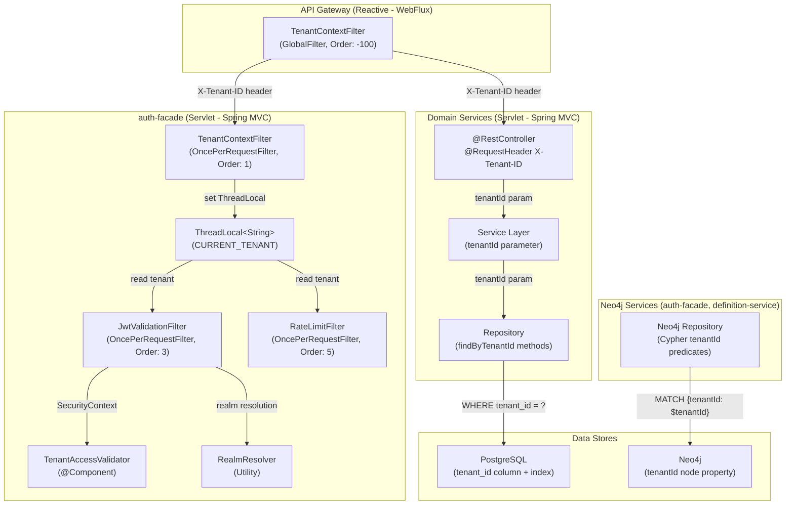
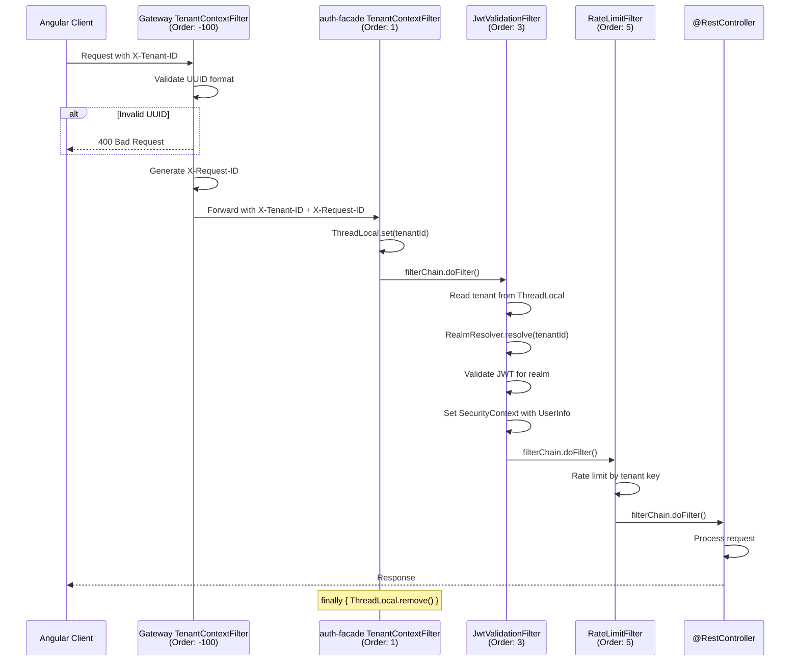
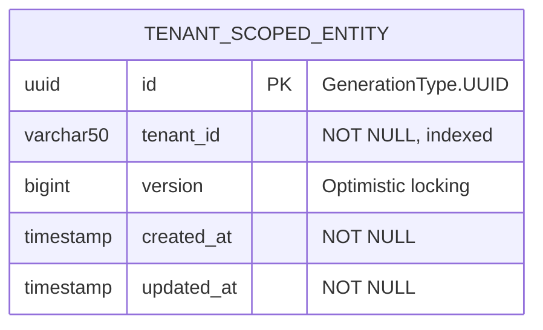
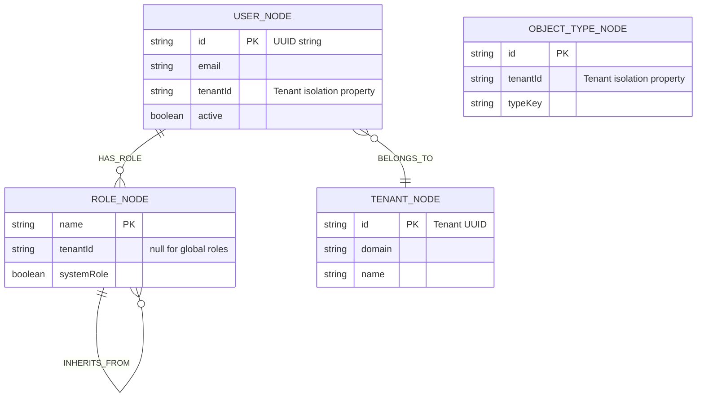
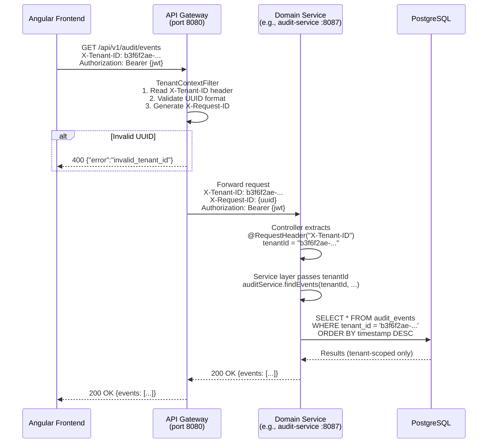
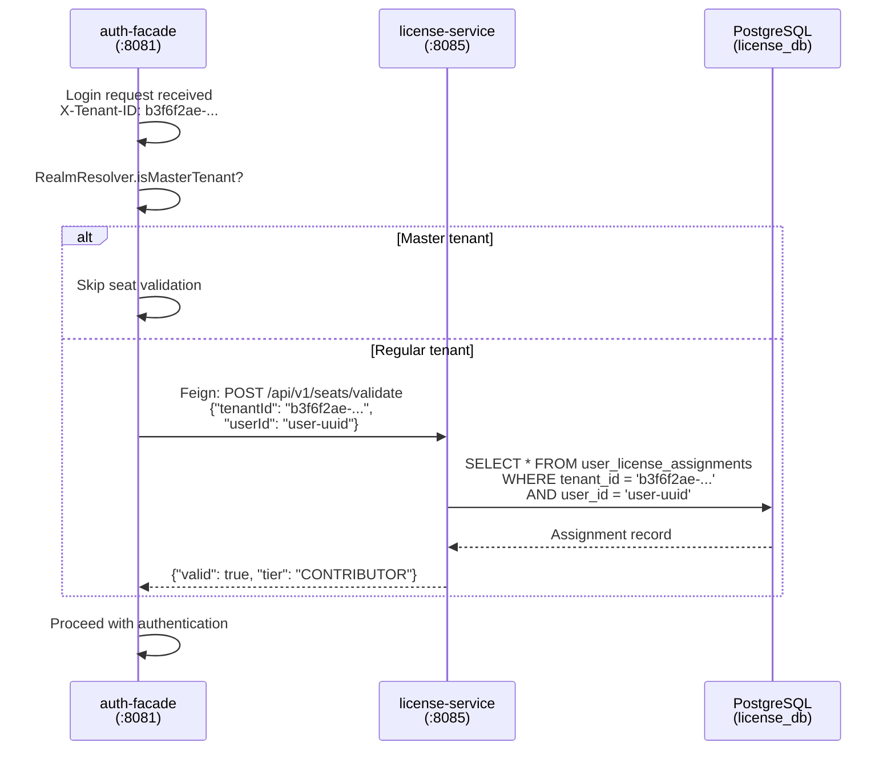
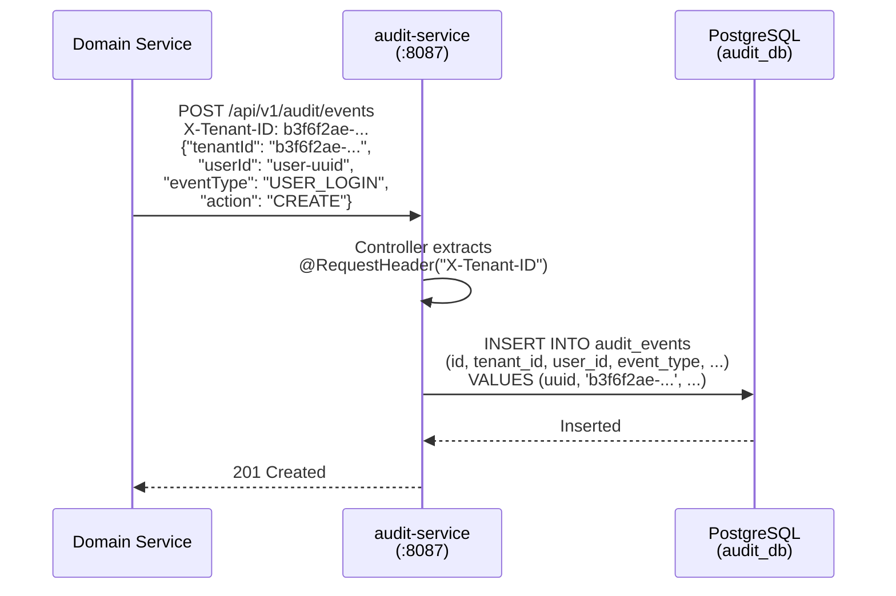
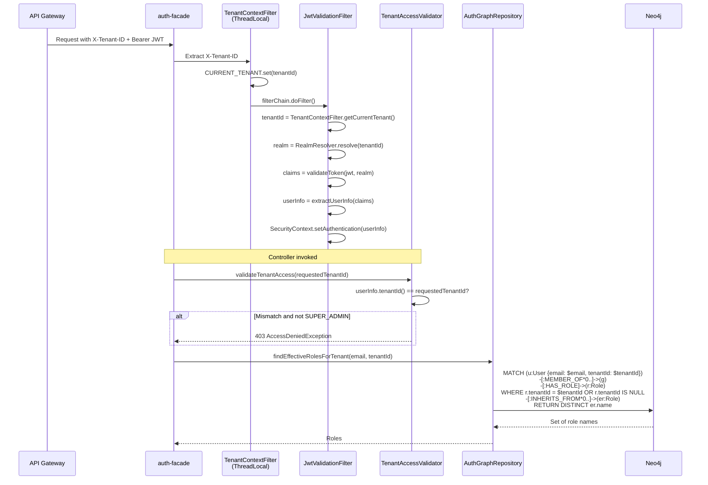
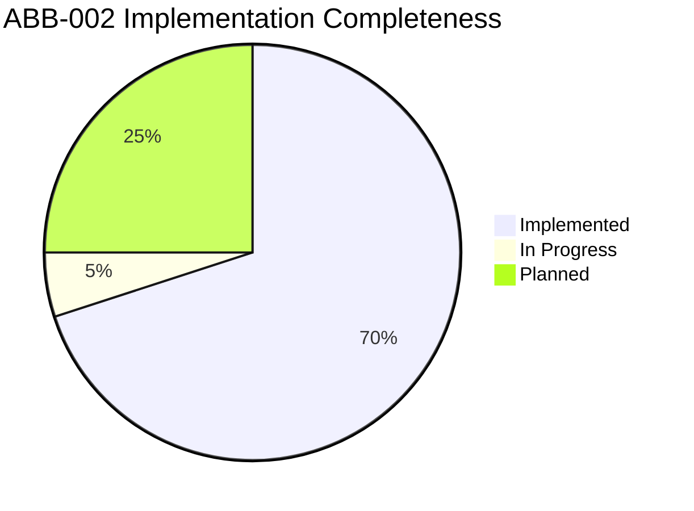
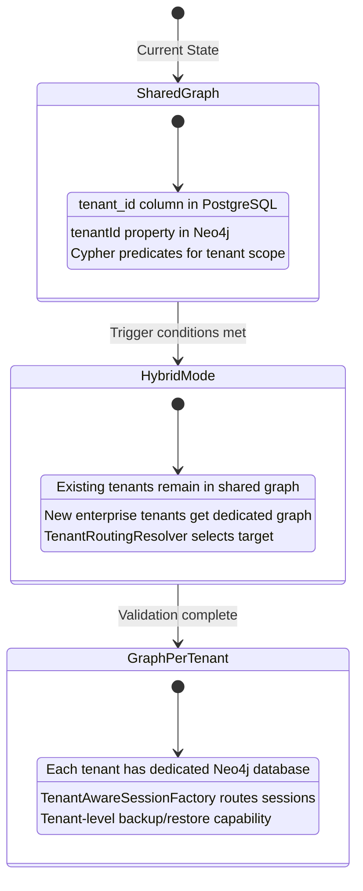

> **WP-ARCH-ALIGN (2026-03-24):** This document has been updated to reflect the frozen auth target model (Rev 2).
> See `Foundation/03-ownership-boundaries.md` FROZEN for the canonical decision.

# ABB-002: Tenant Context Enforcement

## 1. Document Control

| Field | Value |
|-------|-------|
Missing / under-specified

No executable benchmark protocol (golden datasets, test cases, scoring formula, pass/fail gates, statistical confidence), despite being a benchmarking study. See methodology and recommendations: 11-Super-Agent-Benchmarking-Study.md (line 49), 11-Super-Agent-Benchmarking-Study.md (line 1945).
No FinOps/control plane for cost governance (per-tenant budget, token/GPU quotas, cost SLOs, chargeback/showback).
Reliability runbook is partial: risks are listed, but no formal SLO/error-budget policy, DR test cadence, RTO/RPO gates. See 11-Super-Agent-Benchmarking-Study.md (line 1992).
Model/prompt/policy lifecycle governance is not fully operationalized (approval workflow, rollback criteria, signed artifacts, promotion gates).
Supply-chain security is missing (model provenance, SBOM, signed containers/models/prompts, dependency attestations).
Reference hygiene needs cleanup: duplicated/overlapping reference blocks and mixed numbering styles reduce auditability. See 11-Super-Agent-Benchmarking-Study.md (line 2053), 11-Super-Agent-Benchmarking-Study.md (line 2125).
If UAE is a target market, local regulatory mapping should be explicit (not only EU/US-centric mapping).
Additional resources to strengthen it

Standards: NIST AI RMF Playbook, NIST SP 800-53/800-61/800-218, ISO/IEC 23894, ISO 27001/27701.
Security frameworks: MITRE ATLAS, OWASP ASVS + OWASP API Top 10 + OWASP LLM Top 10.
Supply chain: SLSA + SPDX/CycloneDX SBOM guidance.
Observability: OpenTelemetry semantic conventions for agent/pipeline traces.
Evaluation: add an internal benchmark pack (domain tasks + adversarial tests + regression suite) as a mandatory release gate.| Name | Tenant Context Enforcement |
| Domain | Security / Data Isolation |
| Status | IN-PROGRESS |
| Version | 1.0.0 |
| Author | SA Agent |
| Date | 2026-03-08 |
| SBB Mapping | SBB-002: TenantContextFilter + tenant-scoped repositories |
| ADR References | [ADR-003](../../../Architecture/09-architecture-decisions.md#912-multi-tenancy-strategy-adr-003-adr-010) (Multi-Tenancy Strategy), [ADR-010](../../../Architecture/09-architecture-decisions.md#912-multi-tenancy-strategy-adr-003-adr-010) (Graph-per-Tenant Routing) |
| Arc42 References | [08-crosscutting.md](../../../Architecture/08-crosscutting.md) Sections 8.1, 8.1.1 |
| TOGAF References | [04-application-architecture.md](../../04-application-architecture.md) Section 6.3 |

---

## 2. Purpose and Scope

ABB-002 defines the architecture building block responsible for **tenant isolation enforcement** across all layers of the EMSIST multi-tenant SaaS platform. It guarantees that every data operation -- read or write -- is scoped to the correct tenant, preventing cross-tenant data leakage.

### Scope Boundaries

| In Scope | Out of Scope |
|----------|-------------|
| Tenant context injection at the API gateway | Tenant provisioning lifecycle (managed by tenant-service) |
| Tenant context propagation to downstream services | Keycloak realm-per-tenant configuration |
| Thread-local tenant context management in each service | Graph-per-tenant physical isolation (ADR-003 Phase 2) |
| Repository-level tenant predicate enforcement (PostgreSQL) | Database-level Row-Level Security (RLS) policies |
| Graph-level tenant predicate enforcement (Neo4j) | Kafka topic-per-tenant partitioning |
| Tenant ID spoofing prevention | Master tenant administrative bypass logic |
| UUID-first tenant identifier standardization | Tenant branding / domain resolution |

### Design Goals

1. **Zero cross-tenant data leakage** -- No API call, query, or background job may return data belonging to a different tenant.
2. **Defense in depth** -- Tenant isolation is enforced at multiple layers (gateway, service filter, repository predicate), not just one.
3. **UUID-first contracts** -- All external-facing tenant identifiers use UUID format.
4. **Fail-closed** -- Missing or invalid tenant context must result in request rejection, not fallback behavior.
5. **Auditability** -- Every request carries tenant context for correlation and audit trail purposes.

---

## 3. Functional Requirements

### 3.1 Tenant Context Injection (Gateway Layer)

| Requirement | Description | Status |
|-------------|-------------|--------|
| FR-TC-001 | API gateway extracts `X-Tenant-ID` header from incoming requests | [IMPLEMENTED] |
| FR-TC-002 | Gateway validates that `X-Tenant-ID` is a valid UUID (rejects non-UUID values with HTTP 400) | [IMPLEMENTED] |
| FR-TC-003 | Gateway forwards validated `X-Tenant-ID` header to all downstream services | [IMPLEMENTED] |
| FR-TC-004 | Gateway generates and injects `X-Request-ID` for correlation if not present | [IMPLEMENTED] |
| FR-TC-005 | Gateway allows requests without `X-Tenant-ID` for unauthenticated endpoints (login, health) | [IMPLEMENTED] |

**Evidence:** `backend/api-gateway/src/main/java/com/ems/gateway/filter/TenantContextFilter.java` -- `GlobalFilter` implementation with UUID validation (lines 39-44) and header mutation (lines 57-64).

### 3.2 Tenant Context Propagation (Service Layer)

| Requirement | Description | Status |
|-------------|-------------|--------|
| FR-TC-010 | Each service extracts `X-Tenant-ID` from the request header and stores it in a ThreadLocal | [IMPLEMENTED] -- auth-facade only |
| FR-TC-011 | ThreadLocal is cleared in a `finally` block to prevent tenant context leaking between requests | [IMPLEMENTED] -- auth-facade only |
| FR-TC-012 | Service controllers receive tenant ID via `@RequestHeader("X-Tenant-ID")` parameter binding | [IMPLEMENTED] -- all services |
| FR-TC-013 | JWT validation filter reads tenant context from ThreadLocal for realm resolution | [IMPLEMENTED] -- auth-facade |
| FR-TC-014 | Rate limiting filter uses tenant context for per-tenant rate limiting | [IMPLEMENTED] -- auth-facade |

**Evidence:**
- auth-facade ThreadLocal filter: `backend/auth-facade/src/main/java/com/ems/auth/filter/TenantContextFilter.java` (lines 20-50)
- Controller parameter binding (example): `backend/ai-service/src/main/java/com/ems/ai/controller/AgentController.java` (line 43: `@RequestHeader("X-Tenant-ID") String tenantId`)

### 3.3 Tenant Predicate Enforcement (Repository Layer)

| Requirement | Description | Status |
|-------------|-------------|--------|
| FR-TC-020 | All PostgreSQL repository queries include `tenant_id` in WHERE predicates | [IMPLEMENTED] -- explicit in all repositories |
| FR-TC-021 | Neo4j Cypher queries include tenant-scoped predicates (auth-facade, definition-service) | [IMPLEMENTED] |
| FR-TC-022 | JPA Specification-based queries include mandatory tenant predicate | [IMPLEMENTED] -- audit-service |
| FR-TC-023 | Cross-tenant queries are prevented by design (no repository method queries across tenants) | [IMPLEMENTED] |

**Evidence:**
- PostgreSQL tenant-scoped queries: `backend/audit-service/src/main/java/com/ems/audit/repository/AuditEventRepository.java` (all methods include `tenantId` parameter)
- Neo4j tenant-scoped Cypher: `backend/auth-facade/src/main/java/com/ems/auth/graph/repository/AuthGraphRepository.java` (line 162: `MATCH (u:User {email: $email, tenantId: $tenantId})`)
- JPA Specification: `backend/audit-service/src/main/java/com/ems/audit/repository/AuditEventSpecifications.java` (line 21: `cb.equal(root.get("tenantId"), request.tenantId())`)

### 3.4 Tenant Access Validation (Security Layer)

| Requirement | Description | Status |
|-------------|-------------|--------|
| FR-TC-030 | JWT `tenant_id` claim is compared against the requested tenant ID (IDOR prevention) | [IMPLEMENTED] -- auth-facade |
| FR-TC-031 | SUPER_ADMIN role bypasses tenant isolation for administrative operations | [IMPLEMENTED] |
| FR-TC-032 | Access denied response distinguishes between "not authenticated" and "wrong tenant" | [IMPLEMENTED] |

**Evidence:** `backend/auth-facade/src/main/java/com/ems/auth/security/TenantAccessValidator.java` (lines 48-73)

### 3.5 UUID-First Tenant Identifier Standard

| Requirement | Description | Status |
|-------------|-------------|--------|
| FR-TC-040 | `X-Tenant-ID` header carries tenant UUID in all external contracts | [IMPLEMENTED] |
| FR-TC-041 | Legacy identifiers (`master`, `tenant-master`, slug-style IDs) accepted only as backward-compatible aliases | [IMPLEMENTED] -- RealmResolver |
| FR-TC-042 | Gateway rejects non-UUID tenant IDs | [IMPLEMENTED] |
| FR-TC-043 | Internal persistence uses `String tenantId` (VARCHAR 50) to support both UUID and legacy formats | [IMPLEMENTED] |

**Evidence:** `backend/auth-facade/src/main/java/com/ems/auth/util/RealmResolver.java` -- handles `master`, `tenant-master`, UUID formats (lines 39-54)

---

## 4. Interfaces

### 4.1 Provided Interfaces

| Interface | Type | Consumer(s) | Description |
|-----------|------|-------------|-------------|
| `X-Tenant-ID` header injection | HTTP header | All downstream services | Gateway ensures validated UUID tenant header reaches every service |
| `TenantContextFilter.getCurrentTenant()` | Java ThreadLocal API | auth-facade internal filters | Static accessor for current request's tenant ID |
| `TenantContextFilter.setCurrentTenant(String)` | Java ThreadLocal API | Test code, internal callers | Programmatic tenant context override |
| `TenantAccessValidator.validateTenantAccess(String)` | Java component | auth-facade controllers | IDOR prevention: validates JWT tenant claim against requested tenant |
| `RealmResolver.resolve(String)` | Java utility | auth-facade auth flow | Maps tenant ID (UUID or legacy) to Keycloak realm name |
| `RealmResolver.isMasterTenant(String)` | Java utility | auth-facade auth flow | Identifies master/admin tenant for bypass logic |

### 4.2 Required Interfaces

| Interface | Provider | Purpose |
|-----------|----------|---------|
| JWT claims with `tenant_id` | Keycloak (via auth-facade) | Source of authenticated tenant identity |
| `X-Tenant-ID` request header | Frontend Angular client | Source of tenant context for unauthenticated flows |
| Spring Cloud Gateway reactive filter chain | Spring Cloud Gateway | Execution context for gateway `TenantContextFilter` |
| Spring Security `SecurityContextHolder` | Spring Security | Source of authenticated principal for `TenantAccessValidator` |
| `UserInfo` record (common module) | `backend/common` | Carrier of `tenantId` field extracted from JWT |

---

## 5. Internal Component Design

### 5.1 Component Overview



### 5.2 Component Catalog

| Component | Package | Type | Responsibility |
|-----------|---------|------|----------------|
| `TenantContextFilter` (gateway) | `com.ems.gateway.filter` | `GlobalFilter` (reactive) | Validate UUID format, forward `X-Tenant-ID` header, generate `X-Request-ID` |
| `TenantContextFilter` (auth-facade) | `com.ems.auth.filter` | `OncePerRequestFilter` (servlet) | Extract `X-Tenant-ID` into ThreadLocal for request scope |
| `JwtValidationFilter` | `com.ems.auth.filter` | `OncePerRequestFilter` | Read tenant from ThreadLocal, resolve Keycloak realm, validate JWT, set `SecurityContext` |
| `RateLimitFilter` | `com.ems.auth.filter` | `OncePerRequestFilter` | Read tenant for per-tenant rate limiting keys |
| `TenantAccessValidator` | `com.ems.auth.security` | `@Component` | Compare JWT `tenant_id` claim against requested tenant (IDOR prevention) |
| `RealmResolver` | `com.ems.auth.util` | Utility class | Map tenant ID to Keycloak realm; identify master tenant |
| `UserInfo` | `com.ems.common.dto.auth` | Record | Carries `tenantId` field across service boundaries via `SecurityContext` |

### 5.3 Filter Chain Execution Order



---

## 6. Data Model

### 6.1 Tenant Identifier Storage Across Databases

#### PostgreSQL Services (tenant_id column discrimination)

All tenant-scoped entities in PostgreSQL services store the tenant identifier as a `VARCHAR(50)` column named `tenant_id`. This column has a B-tree index on every table for query performance.



**Per-service tenant_id column evidence:**

| Service | Entity | Column Definition | Index | Evidence File |
|---------|--------|-------------------|-------|---------------|
| user-service | `UserProfileEntity` | `@Column(name = "tenant_id", nullable = false, length = 50)` | `idx_user_profiles_tenant` | `backend/user-service/src/main/java/com/ems/user/entity/UserProfileEntity.java` (line 37) |
| audit-service | `AuditEventEntity` | `@Column(name = "tenant_id", nullable = false, length = 50)` | `idx_audit_tenant` | `backend/audit-service/src/main/java/com/ems/audit/entity/AuditEventEntity.java` (line 34) |
| notification-service | `NotificationEntity` | `@Column(name = "tenant_id", nullable = false, length = 50)` | `idx_notification_tenant` | `backend/notification-service/src/main/java/com/ems/notification/entity/NotificationEntity.java` (line 33) |
| license-service | `TenantLicenseEntity` | `@Column(name = "tenant_id", nullable = false, length = 50)` | Unique constraint with `application_license_id` | `backend/license-service/src/main/java/com/ems/license/entity/TenantLicenseEntity.java` (line 49) |
| process-service | `BpmnElementTypeEntity` | `tenantId` field (nullable for system defaults) | `existsByCodeAndTenantId` | `backend/process-service/src/main/java/com/ems/process/entity/BpmnElementTypeEntity.java` |
| ai-service | `AgentEntity` | `tenant_id` column | -- | `backend/ai-service/src/main/java/com/ems/ai/entity/AgentEntity.java` |

**Data type note:** The `tenant_id` column is `String` (VARCHAR 50), not `UUID` in the database. This supports both UUID values and legacy string identifiers during the transition period. New integrations must use UUID format exclusively.

#### Neo4j Services (tenantId node property)

In Neo4j, tenant isolation is achieved via a `tenantId` property on graph nodes (not a column).



**Per-service Neo4j tenant property evidence:**

| Service | Node Type | Property | Cypher Predicate Pattern | Evidence |
|---------|-----------|----------|--------------------------|----------|
| auth-facade | `UserNode` | `tenantId` (String) | `{email: $email, tenantId: $tenantId}` | `backend/auth-facade/src/main/java/com/ems/auth/graph/entity/UserNode.java` (line 50) |
| auth-facade | `RoleNode` | `tenantId` (String, nullable for global roles) | `WHERE rootRole.tenantId = $tenantId OR rootRole.tenantId IS NULL` | `backend/auth-facade/src/main/java/com/ems/auth/graph/entity/RoleNode.java` (line 47) |
| auth-facade | `TenantNode` | `id` (acts as tenantId) | `MATCH (t:Tenant {id: $tenantId})` | `backend/auth-facade/src/main/java/com/ems/auth/graph/repository/AuthGraphRepository.java` (line 47) |
| definition-service | `ObjectTypeNode` | `tenantId` (String) | `findByIdAndTenantId`, `findByTenantId` | `backend/definition-service/src/main/java/com/ems/definition/node/ObjectTypeNode.java` (line 35) |
| definition-service | `AttributeTypeNode` | `tenantId` (String) | `findByTenantId`, `findByIdAndTenantId` | `backend/definition-service/src/main/java/com/ems/definition/node/AttributeTypeNode.java` |

### 6.2 Tenant Context Carrier: UserInfo Record

The `UserInfo` record in the common module carries tenant identity through the security context.

```java
// backend/common/src/main/java/com/ems/common/dto/auth/UserInfo.java
public record UserInfo(
    String id,
    String email,
    String firstName,
    String lastName,
    String tenantId,    // <-- Tenant identity from JWT
    List<String> roles
) {}
```

This record is set as the `Authentication.principal` in `SecurityContextHolder` by the `JwtValidationFilter`. The `TenantAccessValidator` reads `userInfo.tenantId()` from this context to enforce cross-tenant access checks.

---

## 7. Integration Points

### 7.1 Request Flow: Gateway to Repository



### 7.2 Cross-Service Call: Tenant Context Propagation via Feign

Currently, the only implemented cross-service Feign call is from auth-facade to license-service for seat validation at login. Tenant context is passed explicitly via the request DTO.



**Evidence:**
- Feign client: `backend/auth-facade/src/main/java/com/ems/auth/client/LicenseServiceClient.java`
- Seat validation request DTO: `backend/license-service/src/main/java/com/ems/license/dto/SeatValidationRequest.java` (contains `tenantId` field)

**Gap:** There is no automatic `X-Tenant-ID` header propagation in Feign interceptors. Tenant context is passed explicitly in the request body. A Feign `RequestInterceptor` that automatically forwards `X-Tenant-ID` from the incoming request to outgoing Feign calls does not exist. [PLANNED]

### 7.3 Tenant Context in Audit Events

When services emit audit events (currently via direct API call, Kafka planned), the tenant context is captured in the audit record.



**Evidence:** `backend/audit-service/src/main/java/com/ems/audit/controller/AuditController.java` (line 49: `@RequestHeader("X-Tenant-ID") String tenantId`)

### 7.4 Auth-Facade Tenant Flow with Neo4j



---

## 8. Security Considerations

### 8.1 Tenant Boundary Enforcement Layers

ABB-002 implements defense-in-depth with four layers of tenant isolation.

| Layer | Mechanism | What It Prevents | Status |
|-------|-----------|------------------|--------|
| **L1: Gateway** | UUID validation of `X-Tenant-ID` header | Malformed tenant identifiers entering the system | [IMPLEMENTED] |
| **L2: Service Filter** | ThreadLocal tenant context with `finally` cleanup | Tenant context leaking between requests in thread-pooled servers | [IMPLEMENTED] -- auth-facade only |
| **L3: JWT Validation** | `TenantAccessValidator` comparing JWT `tenant_id` claim against requested tenant | IDOR attacks (admin of Tenant A accessing Tenant B via URL manipulation) | [IMPLEMENTED] -- auth-facade only |
| **L4: Repository** | Explicit `tenantId` parameters in all repository methods | Cross-tenant data queries at the database level | [IMPLEMENTED] -- all services |

### 8.2 Tenant ID Spoofing Prevention

| Attack Vector | Mitigation | Status |
|---------------|------------|--------|
| Client sends forged `X-Tenant-ID` header | Gateway validates UUID format; JWT `tenant_id` claim is authoritative source of truth | [IMPLEMENTED] |
| Client manipulates tenant ID in URL path (`/tenants/{tenantId}`) | `TenantAccessValidator` compares JWT claim against path parameter | [IMPLEMENTED] -- auth-facade |
| Internal service-to-service calls with wrong tenant | Tenant ID is passed in request body/header; receiving service validates independently | [IN-PROGRESS] -- no automatic Feign header propagation |
| Thread pool reuse exposes previous tenant context | `finally { CURRENT_TENANT.remove() }` in TenantContextFilter | [IMPLEMENTED] -- auth-facade |

### 8.3 SUPER_ADMIN Cross-Tenant Access

The `SUPER_ADMIN` role (and its variant `super-admin`) is the only role that bypasses tenant isolation. This is necessary for platform administration (managing multiple tenants).

**Controls on SUPER_ADMIN:**
- Only assignable in the master tenant context
- `TenantAccessValidator` explicitly logs cross-tenant access by SUPER_ADMIN
- Master tenant UUID is hardcoded: `68cd2a56-98c9-4ed4-8534-c299566d5b27` (in `RealmResolver.java`)

**Evidence:** `backend/auth-facade/src/main/java/com/ems/auth/security/TenantAccessValidator.java` (lines 56-61, 81-88)

### 8.4 Security Gaps

| Gap ID | Description | Severity | Remediation |
|--------|-------------|----------|-------------|
| SEC-TC-001 | Only auth-facade has a servlet `TenantContextFilter` with ThreadLocal; other services rely solely on `@RequestHeader` parameter binding in controllers | MEDIUM | Extract common `TenantContextFilter` to `backend/common` module and apply to all services |
| SEC-TC-002 | No automatic `X-Tenant-ID` forwarding in Feign interceptors for cross-service calls | MEDIUM | Create a Feign `RequestInterceptor` in `backend/common` that forwards the header |
| SEC-TC-003 | No Hibernate `@FilterDef`/`@Filter` automatic tenant predicate injection; relies on explicit `findByTenantId` method convention | MEDIUM | Consider adding Hibernate `@Filter` or `@TenantId` annotation for automatic enforcement |
| SEC-TC-004 | `TenantAccessValidator` exists only in auth-facade; other services do not validate JWT tenant claim against request parameters | HIGH | Replicate `TenantAccessValidator` in all authenticated services or extract to common module |
| SEC-TC-005 | Some repository methods lack tenant scoping (e.g., `AuditEventRepository.findByUserId`, `findByCorrelationId`) | MEDIUM | Add tenant predicate to all repository methods, or implement Hibernate `@Filter` |

---

## 9. Configuration Model

### 9.1 Tenant Header Configuration

| Property | Value | Service | Source |
|----------|-------|---------|--------|
| Tenant header name | `X-Tenant-ID` | All services | Hardcoded constant (gateway: inline string, auth-facade: `TenantContextFilter.TENANT_HEADER`) |
| Request ID header | `X-Request-ID` | Gateway | Hardcoded in `TenantContextFilter` |
| Master tenant UUID | `68cd2a56-98c9-4ed4-8534-c299566d5b27` | auth-facade | `RealmResolver.MASTER_TENANT_UUID` |
| Keycloak realm prefix | `tenant-` | auth-facade | `RealmResolver.TENANT_PREFIX` |
| Gateway filter order | `-100` | Gateway | `TenantContextFilter.getOrder()` |
| Service filter order | `1` | auth-facade | `@Order(1)` on `TenantContextFilter` |

### 9.2 UUID Validation Rules

| Rule | Implementation | Evidence |
|------|----------------|----------|
| UUID format validation | `UUID.fromString(value)` in gateway filter | `backend/api-gateway/src/main/java/com/ems/gateway/filter/TenantContextFilter.java` (lines 74-80) |
| Trim whitespace | `tenantId.trim()` before validation | Gateway filter (line 40), auth-facade filter (line 29) |
| Empty string rejection | `tenantId.isEmpty()` check | Gateway filter (line 41) |
| Null tolerance | Requests without `X-Tenant-ID` are allowed (for public endpoints) | Gateway filter (lines 39-44) |

### 9.3 CORS Configuration

The `X-Tenant-ID` header is configured as an allowed request header in the gateway CORS configuration and as an exposed response header in the definition-service.

**Evidence:**
- Gateway: `backend/api-gateway/src/main/java/com/ems/gateway/config/CorsConfig.java` (line 49: `"X-Tenant-ID"` in allowed headers)
- definition-service: `backend/definition-service/src/main/java/com/ems/definition/config/SecurityConfig.java` (line 153: `"X-Tenant-ID"` in exposed headers)

---

## 10. Performance and Scalability

### 10.1 Index Strategy on Tenant Columns

All PostgreSQL entities with `tenant_id` columns have B-tree indexes to ensure efficient query performance.

| Service | Table | Index Name | Columns | Type |
|---------|-------|------------|---------|------|
| user-service | `user_profiles` | `idx_user_profiles_tenant` | `tenant_id` | B-tree |
| audit-service | `audit_events` | `idx_audit_tenant` | `tenant_id` | B-tree |
| notification-service | `notifications` | `idx_notification_tenant` | `tenant_id` | B-tree |
| license-service | `tenant_licenses` | `idx_tenant_licenses_app_tenant` (unique composite) | `application_license_id, tenant_id` | B-tree |

### 10.2 Query Performance Considerations

| Concern | Current Approach | Future Consideration |
|---------|-----------------|---------------------|
| Large tenant data volumes | B-tree index on `tenant_id` | Composite indexes with `tenant_id` as leading column for most-queried combinations |
| Tenant hotspot skew | Single PostgreSQL instance, shared tables | Table partitioning by `tenant_id` (range or list partitioning) when tenant count exceeds threshold |
| Neo4j graph traversal | `tenantId` property filter in Cypher MATCH | Neo4j index on `tenantId` property (to be verified) |
| ThreadLocal overhead | Minimal (single String per request) | No concern at current scale |
| Gateway filter overhead | UUID validation via `UUID.fromString()` | Consider regex pre-check for performance if gateway throughput exceeds 10K RPS |

### 10.3 Caching with Tenant Scope

Tenant-scoped cache keys incorporate the tenant identifier to prevent cross-tenant cache poisoning.

| Cache Key Pattern | Service | Tenant Scoped? | Evidence |
|-------------------|---------|----------------|----------|
| `userRoles::{email}` | auth-facade | Partially (email is unique per tenant in Keycloak) | arc42/08 Section 8.4 |
| `seat:validation:{tenantId}:{userId}` | license-service | Yes | arc42/08 Section 8.4 |
| `license:feature:{tenantId}:{userId}:{key}` | license-service | Yes | arc42/08 Section 8.4 |
| `auth:blacklist:{jti}` | auth-facade | No (JTI is globally unique) | arc42/08 Section 8.4 |

---

## 11. Implementation Status

### 11.1 Three-State Summary

| Component | Status | Evidence |
|-----------|--------|----------|
| Gateway `TenantContextFilter` (UUID validation + header forwarding) | [IMPLEMENTED] | `backend/api-gateway/src/main/java/com/ems/gateway/filter/TenantContextFilter.java` |
| Gateway `TenantContextFilter` unit tests | [IMPLEMENTED] | `backend/api-gateway/src/test/java/com/ems/gateway/filter/TenantContextFilterTest.java` |
| Gateway `TenantContextFilter` integration tests | [IMPLEMENTED] | `backend/api-gateway/src/test/java/com/ems/gateway/filter/TenantContextFilterIntegrationTest.java` |
| auth-facade `TenantContextFilter` (ThreadLocal) | [IMPLEMENTED] | `backend/auth-facade/src/main/java/com/ems/auth/filter/TenantContextFilter.java` |
| auth-facade `TenantAccessValidator` (IDOR prevention) | [IMPLEMENTED] | `backend/auth-facade/src/main/java/com/ems/auth/security/TenantAccessValidator.java` |
| auth-facade `TenantAccessValidator` unit tests | [IMPLEMENTED] | `backend/auth-facade/src/test/java/com/ems/auth/security/TenantAccessValidatorTest.java` |
| `RealmResolver` (tenant-to-realm mapping) | [IMPLEMENTED] | `backend/auth-facade/src/main/java/com/ems/auth/util/RealmResolver.java` |
| `RealmResolver` unit tests | [IMPLEMENTED] | `backend/auth-facade/src/test/java/com/ems/auth/util/RealmResolverTest.java` |
| `UserInfo` record with `tenantId` field | [IMPLEMENTED] | `backend/common/src/main/java/com/ems/common/dto/auth/UserInfo.java` |
| PostgreSQL `tenant_id` column on all domain entities | [IMPLEMENTED] | See Section 6.1 entity table |
| PostgreSQL `tenant_id` B-tree indexes | [IMPLEMENTED] | See Section 10.1 index table |
| Neo4j `tenantId` node property (auth-facade + definition-service) | [IMPLEMENTED] | See Section 6.1 Neo4j table |
| Tenant-scoped PostgreSQL repository methods | [IMPLEMENTED] | All repositories use explicit `findByTenantId` pattern |
| Tenant-scoped Neo4j Cypher queries | [IMPLEMENTED] | `AuthGraphRepository.findEffectiveRolesForTenant()`, `ObjectTypeRepository.findByIdAndTenantId()` |
| definition-service tenant isolation integration tests | [IMPLEMENTED] | `backend/definition-service/src/test/java/com/ems/definition/repository/ObjectTypeRepositoryIT.java` (line 107: "returns empty when tenantId does not match (tenant isolation)") |
| process-service multi-tenant isolation tests | [IMPLEMENTED] | `backend/process-service/src/test/java/com/ems/process/repository/BpmnElementTypeRepositoryTest.java` (line 885: `MultiTenantIsolationTests`) |
| Common `TenantContextFilter` in backend/common module | [PLANNED] | Does not exist; only auth-facade has a servlet TenantContextFilter |
| Feign `RequestInterceptor` for automatic `X-Tenant-ID` forwarding | [PLANNED] | No automatic header propagation exists |
| Hibernate `@FilterDef`/`@Filter` automatic tenant predicate | [PLANNED] | No Hibernate filter annotations found in codebase |
| `TenantAccessValidator` in domain services (not just auth-facade) | [PLANNED] | Only auth-facade has this component |
| Graph-per-tenant routing (ADR-003 Phase 2) | [PLANNED] | ADR-010 status: Proposed; 0% implemented |
| Neo4j multi-database tenant routing (`TenantAwareSessionFactory`) | [PLANNED] | No `TenantAwareSessionFactory` or `TenantRoutingResolver` exists |

### 11.2 Implementation Completeness Assessment



| Category | Percentage | Detail |
|----------|------------|--------|
| Gateway tenant context (L1) | 100% | UUID validation, header forwarding, request ID generation |
| Service tenant context (L2) | 40% | Only auth-facade has ThreadLocal filter; 7 other services use controller-level `@RequestHeader` only |
| JWT tenant validation (L3) | 30% | Only auth-facade has `TenantAccessValidator`; other services do not validate JWT tenant claim |
| Repository enforcement (L4) | 85% | Explicit `findByTenantId` pattern in all repositories; some methods lack tenant scope (Section 8.4, SEC-TC-005) |
| Cross-service propagation | 20% | Feign exists but no automatic header forwarding; tenant passed in DTO body |
| Physical isolation (graph-per-tenant) | 0% | ADR-003 Phase 2 / ADR-010 not implemented |

---

## 12. Gap Analysis

### 12.1 Current State vs Target State

| Area | Current (Column Discrimination) | Target (Full Enforcement) | Gap | Priority |
|------|-------------------------------|---------------------------|-----|----------|
| **Service-level TenantContextFilter** | Only auth-facade has ThreadLocal-based filter | All services have a common TenantContextFilter from `backend/common` | 7 services lack ThreadLocal tenant context | HIGH |
| **JWT Tenant Validation (IDOR)** | `TenantAccessValidator` only in auth-facade | All authenticated services validate JWT tenant claim against request | 7 services vulnerable to IDOR if tenant ID is manipulated | HIGH |
| **Hibernate Automatic Filtering** | Manual `findByTenantId` convention; no framework-level enforcement | `@FilterDef`/`@Filter` annotations on all tenant-scoped entities for automatic WHERE clause injection | Developer error can omit tenant predicate from new queries | MEDIUM |
| **Feign Tenant Propagation** | Tenant passed explicitly in DTO body for auth-facade->license-service call | Feign `RequestInterceptor` automatically forwards `X-Tenant-ID` header | Cross-service calls do not automatically carry tenant context | MEDIUM |
| **Repository Gap: Untenant-scoped Methods** | `AuditEventRepository.findByUserId()` and `findByCorrelationId()` lack tenant filter | All repository methods enforce tenant scope or are explicitly documented as cross-tenant admin operations | Risk of cross-tenant data exposure in audit queries | MEDIUM |
| **Physical Isolation (Neo4j)** | [AS-IS] Shared graph with Cypher-level `tenantId` predicates (auth-facade). [TARGET] Neo4j is removed from the auth domain per frozen auth target model Rev 2; auth-domain data migrates to tenant-service (PostgreSQL). Graph-per-tenant for definition-service remains as ADR-003/ADR-010. | Auth-facade graph isolation becomes moot after migration; definition-service graph isolation not yet triggered. | LOW |
| **Tenant ID Column Type** | `VARCHAR(50)` storing UUID as string | `UUID` native PostgreSQL type for `tenant_id` column | String type prevents database-level UUID validation | LOW |
| **Cache Key Tenant Safety** | `userRoles::{email}` key is email-based (tenant-implicit via Keycloak) | All cache keys include explicit `tenantId` segment | Potential cache collision if same email exists in multiple tenants | LOW |

### 12.2 Migration Path: Column Discrimination to Graph-per-Tenant

Per ADR-003 and ADR-010, the evolution from current state to physical isolation follows a phased approach. This migration is NOT currently scheduled -- it will be triggered by regulatory, performance, or contractual conditions.



### 12.3 UUID Migration Status

| Contract Surface | UUID Enforcement | Evidence |
|------------------|-----------------|----------|
| `X-Tenant-ID` header at gateway | **Enforced** -- non-UUID values rejected with 400 | Gateway `isValidUuid()` method |
| JWT `tenant_id` claim | **Not enforced** -- string comparison, accepts any format | `TenantAccessValidator` does string equality check |
| Database `tenant_id` column | **Not enforced** -- VARCHAR(50), accepts any string value | Entity column definitions use `length = 50` |
| Keycloak realm mapping | **Accepts both** -- UUID mapped via `RealmResolver`, legacy strings accepted | `RealmResolver.resolve()` handles UUID and string formats |
| Frontend API calls | **Partially enforced** -- new code uses UUID, legacy code may use slugs | Gateway validation blocks non-UUID at edge |

---

## 13. Dependencies

### 13.1 Upstream Dependencies (ABB-002 Depends On)

| Dependency | Type | Description |
|------------|------|-------------|
| Keycloak 24.x | Infrastructure | Issues JWTs containing `tenant_id` claim; provides per-tenant realm isolation |
| Spring Cloud Gateway 2024.x | Framework | Provides `GlobalFilter` API for gateway-level tenant context injection |
| Spring Security 6.x | Framework | Provides `SecurityContextHolder` for authenticated tenant identity |
| `backend/common` module | Shared library | `UserInfo` record carries `tenantId` across service boundaries |
| Neo4j Spring Data 7.x | Framework | Provides `@Query` annotation for Cypher-based tenant predicate queries |
| Spring Data JPA | Framework | Provides repository method naming conventions for `findByTenantId` pattern |

### 13.2 Downstream Dependencies (Depends on ABB-002)

| Dependent | Description |
|-----------|-------------|
| All domain services (8 services) | Require `X-Tenant-ID` header for tenant-scoped data access |
| ABB-001 (Authentication Orchestration) | Reads tenant context for realm resolution and seat validation |
| Audit trail | Captures `tenantId` in every audit event for compliance |
| License-service seat/feature validation | Uses `tenantId` to scope seat counts and feature gates |
| Frontend Angular application | Must send `X-Tenant-ID` header on every API call |

### 13.3 Related ABBs

| ABB | Relationship |
|-----|-------------|
| ABB-001 (Authentication Orchestration) | Produces JWT with `tenant_id` claim consumed by ABB-002 |
| ABB-003 (RBAC Authorization) | Consumes tenant context for tenant-scoped role resolution |
| ABB-004 (Caching) | Cache keys must incorporate tenant scope to prevent cross-tenant cache leakage |
| ABB-005 (Audit Logging) | Receives tenant context for immutable audit trail records |

---

## Appendix A: Test Coverage Summary

| Component | Test File | Test Count | Type |
|-----------|-----------|------------|------|
| Gateway TenantContextFilter | `TenantContextFilterTest.java` | Unit | UUID validation, header forwarding, missing header |
| Gateway TenantContextFilter | `TenantContextFilterIntegrationTest.java` | Integration | End-to-end header propagation, non-UUID rejection |
| TenantAccessValidator | `TenantAccessValidatorTest.java` | Unit | IDOR prevention, SUPER_ADMIN bypass, missing auth |
| RealmResolver | `RealmResolverTest.java` | Unit | UUID mapping, master tenant detection, legacy formats |
| ObjectType tenant isolation | `ObjectTypeRepositoryIT.java` | Integration | Returns empty when tenantId does not match |
| BpmnElementType multi-tenant | `BpmnElementTypeRepositoryTest.MultiTenantIsolationTests` | Unit | Tenant-scoped element type queries |

## Appendix B: Key File Paths

| Component | Absolute Path |
|-----------|---------------|
| Gateway TenantContextFilter | `/Users/mksulty/Claude/Projects/EMSIST/backend/api-gateway/src/main/java/com/ems/gateway/filter/TenantContextFilter.java` |
| auth-facade TenantContextFilter | `/Users/mksulty/Claude/Projects/EMSIST/backend/auth-facade/src/main/java/com/ems/auth/filter/TenantContextFilter.java` |
| TenantAccessValidator | `/Users/mksulty/Claude/Projects/EMSIST/backend/auth-facade/src/main/java/com/ems/auth/security/TenantAccessValidator.java` |
| RealmResolver | `/Users/mksulty/Claude/Projects/EMSIST/backend/auth-facade/src/main/java/com/ems/auth/util/RealmResolver.java` |
| UserInfo | `/Users/mksulty/Claude/Projects/EMSIST/backend/common/src/main/java/com/ems/common/dto/auth/UserInfo.java` |
| JwtValidationFilter | `/Users/mksulty/Claude/Projects/EMSIST/backend/auth-facade/src/main/java/com/ems/auth/filter/JwtValidationFilter.java` |
| AuthGraphRepository | `/Users/mksulty/Claude/Projects/EMSIST/backend/auth-facade/src/main/java/com/ems/auth/graph/repository/AuthGraphRepository.java` |
| AuditEventEntity | `/Users/mksulty/Claude/Projects/EMSIST/backend/audit-service/src/main/java/com/ems/audit/entity/AuditEventEntity.java` |
| UserProfileEntity | `/Users/mksulty/Claude/Projects/EMSIST/backend/user-service/src/main/java/com/ems/user/entity/UserProfileEntity.java` |
| CorsConfig (gateway) | `/Users/mksulty/Claude/Projects/EMSIST/backend/api-gateway/src/main/java/com/ems/gateway/config/CorsConfig.java` |
| RouteConfig (gateway) | `/Users/mksulty/Claude/Projects/EMSIST/backend/api-gateway/src/main/java/com/ems/gateway/config/RouteConfig.java` |

---

**Previous ABB:** ABB-001 (Authentication Orchestration)
**Next ABB:** ABB-003 (RBAC Authorization)
