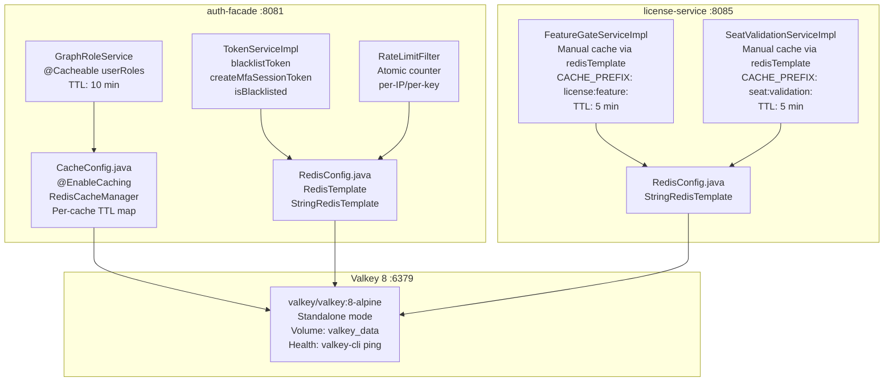
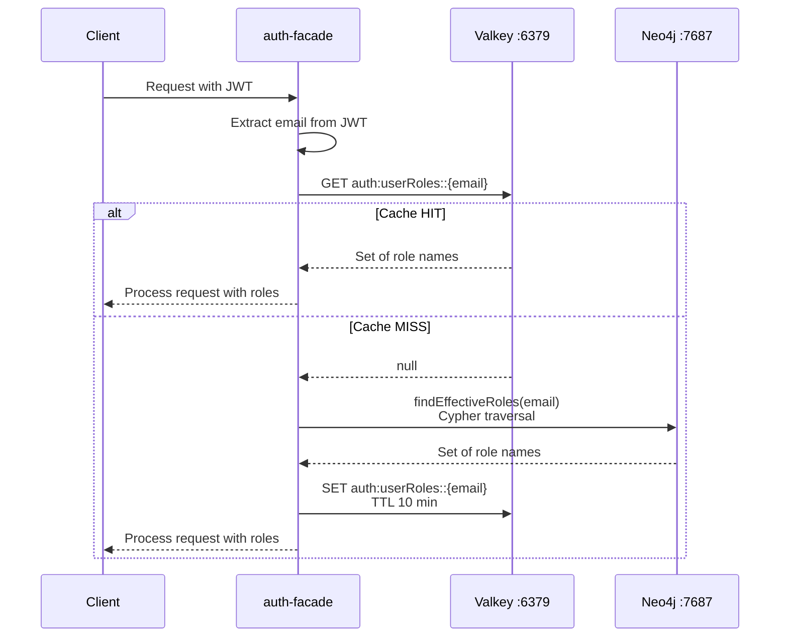
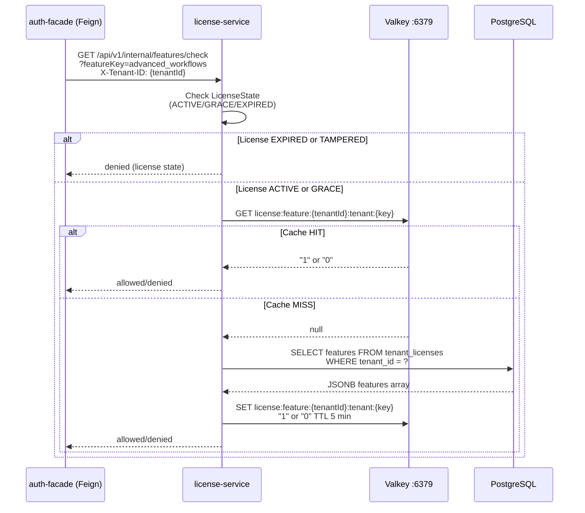
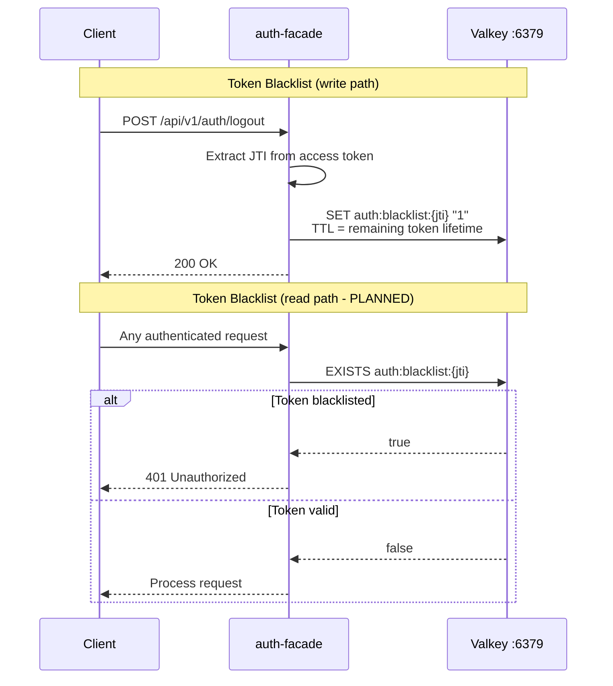

# ABB-003: Distributed Cache Layer

## 1. Document Control

| Field | Value |
|-------|-------|
| ABB ID | ABB-003 |
| Name | Distributed Cache Layer |
| Domain | Technology |
| Status | [IN-PROGRESS] |
| Owner | Platform Team |
| Last Updated | 2026-03-08 |
| Realized By | SBB-003: Valkey 8 (`valkey/valkey:8-alpine`) |
| Related ADRs | [ADR-005](../../../Architecture/09-architecture-decisions.md#922-valkey-distributed-caching-adr-005) (Valkey Caching) |
| Arc42 Section | [08-crosscutting.md](../../../Architecture/08-crosscutting.md) Section 8.4 |

## 2. Purpose and Scope

The Distributed Cache Layer provides a shared, low-latency data store for hot reads across all EMSIST services. It implements the cache-aside pattern with configurable TTL strategies per cache namespace.

**In scope:**
- Session-related data caching (token blacklists, MFA pending sessions)
- RBAC role resolution caching (Neo4j graph query results)
- License seat validation and feature gate caching
- Provider configuration caching
- Rate limiting counters

**Out of scope:**
- In-process (L1) caching with Caffeine -- ADR-005 describes a two-tier architecture, but Caffeine is not present in any service's dependency tree or configuration [PLANNED]
- Full-text search caching
- Binary/blob storage
- Pub/sub messaging (Kafka is the async event backbone)

## 3. Functional Requirements

| ID | Description | Priority | Status |
|----|-------------|----------|--------|
| FR-CACHE-001 | Cache-aside pattern: check cache before database, populate on miss | HIGH | [IMPLEMENTED] -- `@Cacheable` in `GraphRoleService`, direct `redisTemplate` in `FeatureGateServiceImpl`, `SeatValidationServiceImpl` |
| FR-CACHE-002 | Configurable per-cache TTL (different namespaces have different TTLs) | HIGH | [IMPLEMENTED] -- `CacheConfig.java` in auth-facade defines per-cache TTL map |
| FR-CACHE-003 | Token blacklist with automatic expiry matching token lifetime | HIGH | [IMPLEMENTED] -- `TokenServiceImpl.blacklistToken()` sets TTL equal to remaining token lifetime |
| FR-CACHE-004 | MFA session state with fixed 5-minute TTL | HIGH | [IMPLEMENTED] -- `TokenServiceImpl.createMfaSessionToken()` stores with `mfaSessionTtlMinutes` TTL |
| FR-CACHE-005 | Explicit cache invalidation on data mutation | MEDIUM | [IMPLEMENTED] -- `SeatValidationService.invalidateCache()`, `@CacheEvict` pattern available |
| FR-CACHE-006 | Graceful degradation on cache unavailability | MEDIUM | [IMPLEMENTED] -- `FeatureGateServiceImpl.getCached()` catches exceptions and falls through to DB |
| FR-CACHE-007 | L1 in-process cache (Caffeine) for sub-millisecond hot path access | LOW | [PLANNED] -- not in any pom.xml or CacheConfig |
| FR-CACHE-008 | Rate limiting counters with atomic increment | MEDIUM | [IMPLEMENTED] -- `RateLimitFilter.java` in auth-facade uses Valkey for rate limit counting |

## 4. Interfaces

### 4.1 Provided Interfaces

| Interface | Type | Consumers | Description |
|-----------|------|-----------|-------------|
| Spring Cache Abstraction (`@Cacheable`, `@CacheEvict`) | Library | auth-facade | Transparent caching via `RedisCacheManager` with per-cache TTL |
| `StringRedisTemplate` direct access | Library | auth-facade, license-service | Low-level key-value operations for token blacklist, feature gates, seat validation |
| `RedisTemplate<String, Object>` | Library | auth-facade | Typed operations for structured objects |

### 4.2 Required Interfaces

| Interface | Provider | Description | Status |
|-----------|----------|-------------|--------|
| Redis protocol (port 6379) | Valkey 8 runtime | RESP wire protocol for cache operations | [IMPLEMENTED] |
| `RedisConnectionFactory` (Lettuce driver) | Spring Data Redis | Connection pooling and lifecycle management | [IMPLEMENTED] |

## 5. Internal Component Design

### Key Design Decisions

| Decision | Choice | Rationale |
|----------|--------|-----------|
| Cache manager type | `RedisCacheManager` (Spring Cache) | Transparent annotation-based caching for RBAC lookups |
| Direct template access | `StringRedisTemplate` for token/feature/seat operations | Fine-grained TTL control and custom key patterns |
| Serialization | `GenericJackson2JsonRedisSerializer` for Spring Cache; raw strings for manual cache | JSON for structured data, compact "1"/"0" for boolean feature flags |
| Connection driver | Lettuce | Non-blocking, thread-safe, Spring Boot default |

## 6. Data Model

The cache layer does not persist entities in the traditional sense. The following table documents all cache key patterns, their owning services, serialization format, and TTL.

| Cache Key Pattern | Service | Value Format | TTL | Purpose | Evidence |
|-------------------|---------|-------------|-----|---------|----------|
| `auth:userRoles::{email}` | auth-facade | JSON `Set<String>` | 10 min | Neo4j role graph lookup result | `CacheConfig.java:51`, `GraphRoleService.java:47` |
| `auth:providerConfig::{key}` | auth-facade | JSON object | 5 min | Identity provider configuration | `CacheConfig.java:40-42` |
| `auth:providerList::{tenantId}` | auth-facade | JSON list | 5 min | Provider list per tenant | `CacheConfig.java:44-46` |
| `auth:blacklist:{jti}` | auth-facade | String `"1"` | Remaining token lifetime (min 60s) | Token revocation blacklist | `TokenServiceImpl.java:91-103` |
| `auth:mfa:pending:{sessionId}` | auth-facade | String `"{userId}:{tenantId}"` | 5 min | MFA session state | `TokenServiceImpl.java:119-125` |
| `auth:mfa:{sessionId}` | auth-facade | String `"{userId}:{tenantId}"` | 5 min | (alias -- same as above) | `TokenServiceImpl.java:37` |
| `license:feature:{tenantId}:tenant:{featureKey}` | license-service | String `"1"` or `"0"` | 5 min | Feature gate check result | `FeatureGateServiceImpl.java:36-37,51` |
| `seat:validation:{tenantId}:{userId}` | license-service | JSON `SeatValidationResponse` | 5 min | Seat validation result | `SeatValidationServiceImpl.java:39-40` |
| `auth:rate:{key}` | auth-facade | Atomic counter | Per config | Rate limiting counter | `RateLimitFilter.java`, `application.yml:117` |

## 7. Integration Points

### 7.1 Cache-Aside Pattern (Role Resolution)

### 7.2 Feature Gate Check (Cache-Aside with Boolean Flag)

### 7.3 Token Blacklist Flow

**Note:** The write path (`blacklistToken()`) is implemented in `TokenServiceImpl.java:91`. However, the logout flow in `AuthServiceImpl` does NOT currently call `blacklistToken()` (SEC-GAP-001). The read path (gateway checking blacklist) is also not wired (SEC-GAP-002). Both are documented in arc42/08 Section 8.15 and TOGAF 04-application-architecture Section 6.5.

## 8. Security Considerations

| Concern | Mitigation | Status |
|---------|-----------|--------|
| Cache poisoning | Valkey is internal-only (not exposed to public network) | [IMPLEMENTED] -- bound to `ems-network` Docker network |
| Sensitive data in cache | Role names and boolean flags only; no PII stored | [IMPLEMENTED] |
| Token blacklist bypass | API gateway should check blacklist on every request | [PLANNED] -- SEC-GAP-002 |
| Cache key enumeration | Keys use tenant-scoped prefixes; no external access to Valkey | [IMPLEMENTED] |
| Connection security | Valkey TLS not enabled | [PLANNED] -- `spring.data.redis.ssl.enabled` not set |
| Password authentication | Valkey password configurable via `VALKEY_PASSWORD` env var | [IMPLEMENTED] -- `application.yml:19` |

## 9. Configuration Model

### auth-facade Configuration

| Config Key | Default | Env Override | Source |
|------------|---------|-------------|--------|
| `spring.data.redis.host` | `localhost` | `VALKEY_HOST` | `application.yml:17` |
| `spring.data.redis.port` | `6379` | `VALKEY_PORT` | `application.yml:18` |
| `spring.data.redis.password` | (empty) | `VALKEY_PASSWORD` | `application.yml:19` |
| `spring.data.redis.timeout` | `2000ms` | -- | `application.yml:20` |
| `spring.data.redis.lettuce.pool.max-active` | `10` | -- | `application.yml:22` |
| `spring.data.redis.lettuce.pool.max-idle` | `5` | -- | `application.yml:23` |
| `spring.data.redis.lettuce.pool.min-idle` | `1` | -- | `application.yml:24` |
| `token.blacklist.prefix` | `auth:blacklist:` | -- | `application.yml:122` |
| `token.mfa-session.prefix` | `auth:mfa:` | -- | `application.yml:125` |
| `token.mfa-session.ttl-minutes` | `5` | -- | `application.yml:126` |
| `rate-limit.cache-prefix` | `auth:rate:` | -- | `application.yml:117` |

### license-service Configuration

| Config Key | Default | Env Override | Source |
|------------|---------|-------------|--------|
| `spring.data.redis.host` | `localhost` | `VALKEY_HOST` | `application.yml:39` |
| `spring.data.redis.port` | `6379` | `VALKEY_PORT` | `application.yml:40` |
| `license.cache.ttl-minutes` | `5` | -- | `application.yml:53` |
| `license.cache.prefix` | `license:` | -- | `application.yml:54` |

### api-gateway Configuration

| Config Key | Default | Env Override | Source |
|------------|---------|-------------|--------|
| `spring.data.redis.host` | `localhost` | `VALKEY_HOST` | `application.yml:81` |
| `spring.data.redis.port` | `6379` | `VALKEY_PORT` | `application.yml:82` |

### Cache TTL Summary

| Cache Namespace | TTL | Service | Rationale |
|-----------------|-----|---------|-----------|
| `userRoles` | 10 min | auth-facade | Roles change infrequently; longer TTL acceptable |
| `providerConfig` | 5 min | auth-facade | Provider configs rarely change |
| `providerList` | 5 min | auth-facade | Provider list per tenant rarely changes |
| Token blacklist | Remaining token lifetime (min 60s) | auth-facade | Expires with the token |
| MFA pending | 5 min | auth-facade | Short-lived MFA verification window |
| Feature gate | 5 min | license-service | Balance between freshness and DB load |
| Seat validation | 5 min | license-service | Seat changes are infrequent |

## 10. Performance and Scalability

| Metric | Target | Current | Notes |
|--------|--------|---------|-------|
| Cache hit latency (p99) | < 5 ms | Expected (single Valkey instance) | Valkey on local Docker network |
| Cache miss + DB populate | < 100 ms | Depends on backend DB query | Neo4j graph traversal ~50 ms; PostgreSQL ~10 ms |
| Connection pool size | 10 active / 5 idle | Configured per service | Lettuce pool in auth-facade |
| Max memory | Configurable | Docker volume-backed | No `maxmemory` set; relies on host limits |
| Cache hit ratio target | > 90% | Not measured | Monitoring via Micrometer/Prometheus planned |

### Scaling Strategy

| Scale Dimension | Approach | Status |
|-----------------|----------|--------|
| Vertical | Increase Valkey container memory | Available |
| Horizontal (read replicas) | Valkey replication | [PLANNED] |
| Horizontal (cluster mode) | Valkey cluster with data partitioning | [PLANNED] |
| L1 in-process cache | Caffeine per JVM instance for sub-ms hot paths | [PLANNED] |

## 11. Implementation Status

| Component | Status | Evidence |
|-----------|--------|----------|
| Valkey 8 container runtime | [IMPLEMENTED] | `docker-compose.yml`: `valkey/valkey:8-alpine`, port 6379, volume `valkey_data` |
| auth-facade `CacheConfig` (RedisCacheManager) | [IMPLEMENTED] | `/backend/auth-facade/src/main/java/com/ems/auth/config/CacheConfig.java` |
| auth-facade `RedisConfig` (templates) | [IMPLEMENTED] | `/backend/auth-facade/src/main/java/com/ems/auth/config/RedisConfig.java` |
| `GraphRoleService` role caching | [IMPLEMENTED] | `/backend/auth-facade/src/main/java/com/ems/auth/service/GraphRoleService.java:47` -- `@Cacheable(value = "userRoles")` |
| `TokenServiceImpl` blacklist/MFA | [IMPLEMENTED] | `/backend/auth-facade/src/main/java/com/ems/auth/service/TokenServiceImpl.java` |
| `RateLimitFilter` rate counter | [IMPLEMENTED] | `/backend/auth-facade/src/main/java/com/ems/auth/filter/RateLimitFilter.java` |
| `FeatureGateServiceImpl` feature cache | [IMPLEMENTED] | `/backend/license-service/src/main/java/com/ems/license/service/FeatureGateServiceImpl.java:36-37` |
| `SeatValidationServiceImpl` seat cache | [IMPLEMENTED] | `/backend/license-service/src/main/java/com/ems/license/service/SeatValidationServiceImpl.java:39-40` |
| api-gateway Valkey (rate limiting/session) | [IN-PROGRESS] | `application.yml:79-82` -- connection configured; no rate-limiting filter in gateway code |
| Caffeine L1 in-process cache | [PLANNED] | Not in any pom.xml; ADR-005 describes two-tier but only L2 exists |
| Valkey TLS | [PLANNED] | `spring.data.redis.ssl.enabled` not set in any service |
| Valkey cluster mode | [PLANNED] | Single standalone instance in docker-compose |
| Token blacklist at logout | [PLANNED] | SEC-GAP-001: `AuthServiceImpl.logout()` does not call `blacklistToken()` |
| Gateway blacklist check | [PLANNED] | SEC-GAP-002: `TenantContextFilter` does not query Valkey for blacklisted JTIs |

## 12. Gap Analysis

| Gap ID | Description | Current | Target | Priority | Reference |
|--------|-------------|---------|--------|----------|-----------|
| GAP-C-001 | No L1 Caffeine in-process cache | Single-tier Valkey only | Two-tier: Caffeine L1 + Valkey L2 | LOW | ADR-005 |
| GAP-C-002 | Logout does not blacklist token | `blacklistToken()` exists but not called from `logout()` | Wire into logout flow | HIGH | SEC-GAP-001 |
| GAP-C-003 | Gateway does not check token blacklist | `TenantContextFilter` extracts tenant but skips blacklist | Add Valkey blacklist check | HIGH | SEC-GAP-002 |
| GAP-C-004 | No Valkey TLS | Plaintext Redis protocol | Enable `spring.data.redis.ssl.enabled=true` | MEDIUM | arc42/08 Section 8.14 |
| GAP-C-005 | No cache metrics/monitoring | No Micrometer cache metrics exported | Expose hit/miss/eviction via Prometheus | MEDIUM | -- |
| GAP-C-006 | No Valkey cluster/replication | Single standalone instance | Cluster mode for HA | LOW | ADR-005 |
| GAP-C-007 | api-gateway Valkey not used for rate limiting | Connection configured, no filter | Implement gateway-level rate limiting filter | MEDIUM | -- |

## 13. Dependencies

| Dependency | Type | Direction | Status |
|------------|------|-----------|--------|
| Valkey 8 runtime | Infrastructure | Required | [IMPLEMENTED] |
| Spring Data Redis (Lettuce) | Library | Required | [IMPLEMENTED] |
| Spring Cache Abstraction | Library | Required | [IMPLEMENTED] |
| Jackson JSON serializer | Library | Required | [IMPLEMENTED] |
| Neo4j (source of truth for roles) | Data store | Upstream | [IMPLEMENTED] |
| PostgreSQL (source of truth for licenses) | Data store | Upstream | [IMPLEMENTED] |
| Caffeine | Library | Optional (L1 cache) | [PLANNED] |

---

**SA verification date:** 2026-03-08
**Verified by reading:** `CacheConfig.java`, `RedisConfig.java`, `GraphRoleService.java`, `TokenServiceImpl.java`, `FeatureGateServiceImpl.java`, `SeatValidationServiceImpl.java`, `RateLimitFilter.java`, `application.yml` (auth-facade, license-service, api-gateway)
