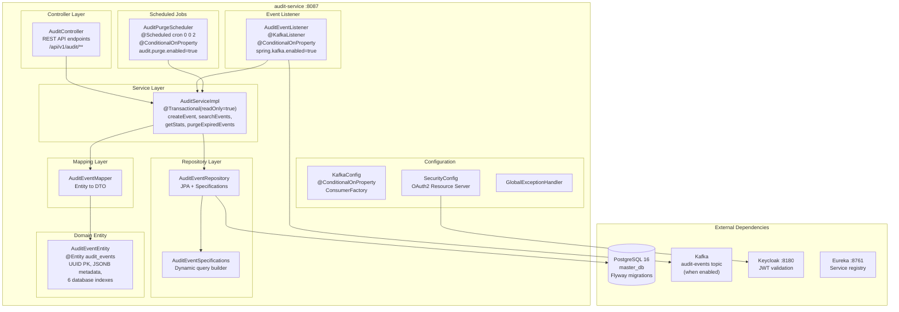
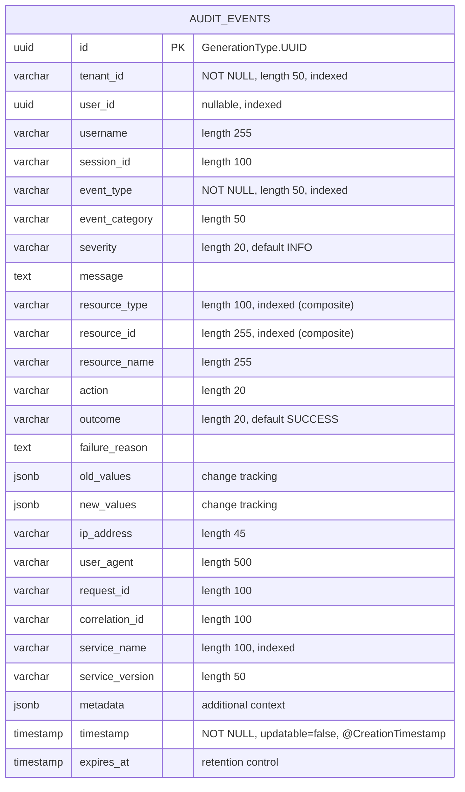
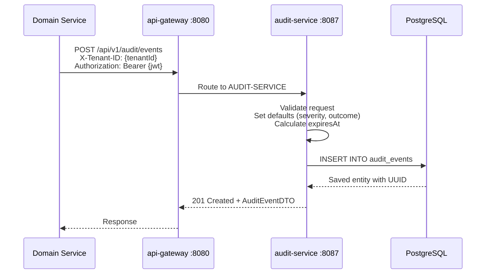
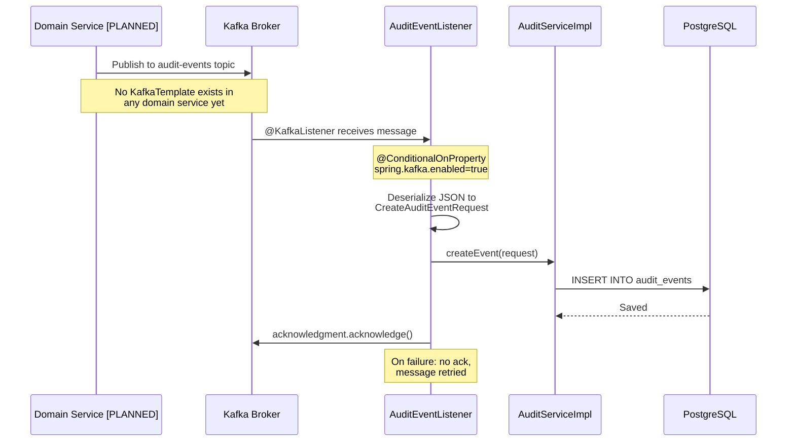
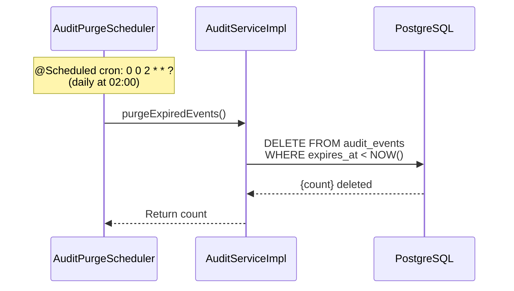

# ABB-004: Audit Event Backbone

## 1. Document Control

| Field | Value |
|-------|-------|
| ABB ID | ABB-004 |
| Name | Audit Event Backbone |
| Domain | Integration |
| Status | [IMPLEMENTED] (PostgreSQL persistence); [IN-PROGRESS] (Kafka consumer) |
| Owner | Platform Team |
| Last Updated | 2026-03-08 |
| Realized By | SBB-004: audit-service + PostgreSQL |
| Related ADRs | [ADR-016](../../../Architecture/09-architecture-decisions.md#911-polyglot-persistence-adr-001-adr-016) (Polyglot Persistence) |
| Arc42 Section | [08-crosscutting.md](../../../Architecture/08-crosscutting.md) Sections 8.5, 8.7 |

## 2. Purpose and Scope

The Audit Event Backbone provides an immutable, tenant-scoped audit trail for all security-relevant and business-relevant actions across the EMSIST platform. Audit events are structured records that capture who did what, to which resource, when, and from where.

**In scope:**
- Append-only audit event persistence in PostgreSQL
- Structured event schema with tenant, actor, action, resource, timestamp, and metadata
- Event search and filtering with pagination
- Correlation-based event grouping
- User activity trail
- Resource change history with before/after values (JSONB)
- Aggregated statistics per tenant
- Retention management with configurable TTL and scheduled purge
- Kafka consumer for async event ingestion (conditionally enabled)

**Out of scope:**
- Kafka event publishing from domain services (no `KafkaTemplate` in any service) [PLANNED]
- Real-time event streaming to UI (WebSocket/SSE) [PLANNED]
- Event-driven cache invalidation via audit events
- Log aggregation (handled by observability stack)

## 3. Functional Requirements

| ID | Description | Priority | Status |
|----|-------------|----------|--------|
| FR-AUD-001 | Create audit events via REST API (POST) | HIGH | [IMPLEMENTED] -- `AuditController.createEvent()` |
| FR-AUD-002 | Append-only persistence -- events are never updated after creation | HIGH | [IMPLEMENTED] -- `@CreationTimestamp` with `updatable = false` on timestamp; no `UPDATE` endpoints |
| FR-AUD-003 | Search events with multi-field filtering (tenant, user, type, resource, date range) | HIGH | [IMPLEMENTED] -- `AuditEventSpecifications.fromSearchRequest()` with JPA Specifications |
| FR-AUD-004 | Retrieve events by correlation ID for cross-service tracing | HIGH | [IMPLEMENTED] -- `AuditController.getByCorrelationId()` |
| FR-AUD-005 | User activity trail with configurable limit | MEDIUM | [IMPLEMENTED] -- `AuditController.getUserActivity()` |
| FR-AUD-006 | Resource change history with old/new value JSONB | MEDIUM | [IMPLEMENTED] -- `AuditEventEntity.oldValues`/`newValues` as `@JdbcTypeCode(SqlTypes.JSON)` |
| FR-AUD-007 | Aggregated statistics per tenant (by type, category, outcome, severity, service, day) | MEDIUM | [IMPLEMENTED] -- `AuditServiceImpl.getStats()` |
| FR-AUD-008 | Configurable retention with automatic expiry (default 365 days) | MEDIUM | [IMPLEMENTED] -- `AuditPurgeScheduler` runs daily at 02:00 |
| FR-AUD-009 | Kafka consumer for async event ingestion | MEDIUM | [IN-PROGRESS] -- `AuditEventListener` + `KafkaConfig` exist but disabled by default (`spring.kafka.enabled=false`) |
| FR-AUD-010 | Domain services publish events to Kafka topic | LOW | [PLANNED] -- no `KafkaTemplate` usage in any domain service |
| FR-AUD-011 | Purge expired events (manual and scheduled) | MEDIUM | [IMPLEMENTED] -- `AuditController.purgeExpired()` + `AuditPurgeScheduler` |

## 4. Interfaces

### 4.1 Provided Interfaces (APIs Exposed)

| Endpoint | Method | Description | Auth | Status |
|----------|--------|-------------|------|--------|
| `/api/v1/audit/events` | POST | Create a new audit event | JWT (authenticated) | [IMPLEMENTED] |
| `/api/v1/audit/events/{eventId}` | GET | Get a specific audit event by ID | JWT (authenticated) | [IMPLEMENTED] |
| `/api/v1/audit/events` | GET | List audit events with optional filters | JWT + `X-Tenant-ID` header | [IMPLEMENTED] |
| `/api/v1/audit/events/search` | POST | Advanced search with multi-field filter body | JWT (authenticated) | [IMPLEMENTED] |
| `/api/v1/audit/correlation/{correlationId}` | GET | Get all events by correlation ID | JWT (authenticated) | [IMPLEMENTED] |
| `/api/v1/audit/users/{userId}/activity` | GET | Get recent activity for a user | JWT (authenticated) | [IMPLEMENTED] |
| `/api/v1/audit/resources/{resourceType}/{resourceId}/history` | GET | Get audit history for a specific resource | JWT + `X-Tenant-ID` | [IMPLEMENTED] |
| `/api/v1/audit/stats` | GET | Get aggregated audit statistics | JWT + `X-Tenant-ID` | [IMPLEMENTED] |
| `/api/v1/audit/events/expired` | DELETE | Purge expired events | JWT (authenticated) | [IMPLEMENTED] |
| Kafka topic: `audit-events` | Consumer | Async event ingestion | Internal | [IN-PROGRESS] -- consumer code exists, disabled by default |

**Evidence:** All endpoints verified in `/backend/audit-service/src/main/java/com/ems/audit/controller/AuditController.java`

### 4.2 Required Interfaces (Dependencies Consumed)

| Interface | Provider | Description | Status |
|-----------|----------|-------------|--------|
| PostgreSQL `master_db` | PostgreSQL 16 | Audit event persistence via JPA + Flyway | [IMPLEMENTED] |
| Kafka `audit-events` topic | Kafka (Confluent) | Async event source (when enabled) | [IN-PROGRESS] |
| Keycloak JWKS | Keycloak 24 | JWT validation for API security | [IMPLEMENTED] |
| Eureka service registry | eureka-server | Service registration and discovery | [IMPLEMENTED] |

## 5. Internal Component Design

## 6. Data Model

### 6.1 AuditEventEntity

**Table:** `audit_events`
**Database:** PostgreSQL (`master_db`)
**Tenant Scope:** Tenant-scoped via `tenant_id` column
**Immutability:** Append-only; `timestamp` is `updatable = false`

### 6.2 Database Indexes

| Index Name | Columns | Purpose | Evidence |
|------------|---------|---------|----------|
| `idx_audit_tenant` | `tenant_id` | Tenant-scoped queries | `AuditEventEntity.java:14` |
| `idx_audit_user` | `user_id` | User activity lookups | `AuditEventEntity.java:15` |
| `idx_audit_event_type` | `event_type` | Filter by event type | `AuditEventEntity.java:16` |
| `idx_audit_resource` | `resource_type, resource_id` | Resource history queries | `AuditEventEntity.java:17` |
| `idx_audit_timestamp` | `timestamp` | Time-range filtering and sorting | `AuditEventEntity.java:18` |
| `idx_audit_service` | `service_name` | Filter by source service | `AuditEventEntity.java:19` |

### 6.3 Flyway Migrations

| Version | File | Purpose |
|---------|------|---------|
| V1 | `V1__audit_events.sql` | Create `audit_events` table with indexes |
| V2 | `V2__add_correlation_index.sql` | Add index on `correlation_id` |

**Flyway table:** `flyway_schema_history_audit` (separate from other services)

### 6.4 Immutability Enforcement

| Mechanism | How It Works | Evidence |
|-----------|-------------|----------|
| No UPDATE endpoint | `AuditController` has no PUT/PATCH for events | Controller code review |
| `@CreationTimestamp` + `updatable = false` | `timestamp` field cannot be modified after insert | `AuditEventEntity.java:116-118` |
| `@Transactional` on create | Single INSERT within transaction boundary | `AuditServiceImpl.java:35` |
| Purge only removes expired | `deleteExpiredEvents(Instant.now())` respects retention | `AuditServiceImpl.java:140-145` |

**Note:** There is no database-level trigger or row-level security preventing UPDATE/DELETE. Immutability is enforced at the application layer only. For compliance-grade immutability, a database trigger or append-only table constraint would be recommended.

## 7. Integration Points

### 7.1 Direct HTTP Event Creation (Current)

### 7.2 Kafka Async Event Ingestion (Conditionally Enabled)

### 7.3 Scheduled Purge

## 8. Security Considerations

| Concern | Mitigation | Status |
|---------|-----------|--------|
| Unauthorized event creation | JWT authentication required on all endpoints | [IMPLEMENTED] -- `SecurityConfig` with OAuth2 resource server |
| Cross-tenant data access | Events are tenant-scoped via `X-Tenant-ID` header filtering | [IMPLEMENTED] -- query parameters include `tenantId` |
| Audit log tampering | Application-level immutability (no UPDATE/PATCH endpoints) | [IMPLEMENTED] -- but no DB-level enforcement |
| Compliance independence | audit-service is a separate service with its own Flyway history | [IMPLEMENTED] -- `flyway_schema_history_audit` |
| Sensitive data in audit | `old_values`/`new_values` JSONB may contain sensitive fields | [PLANNED] -- field-level masking/redaction not implemented |
| Audit of admin operations | Master tenant operations should be tagged `source=MASTER_TENANT` | [PLANNED] -- no automatic tagging exists |

## 9. Configuration Model

| Config Key | Default | Env Override | Source |
|------------|---------|-------------|--------|
| `server.port` | `8087` | `SERVER_PORT` | `application.yml:2` |
| `spring.datasource.url` | `jdbc:postgresql://localhost:5432/master_db?sslmode=verify-full` | `DATABASE_URL` | `application.yml:16` |
| `spring.datasource.username` | `postgres` | `DATABASE_USER` | `application.yml:17` |
| `spring.datasource.password` | `postgres` | `DATABASE_PASSWORD` | `application.yml:18` |
| `spring.jpa.hibernate.ddl-auto` | `validate` | -- | `application.yml:22` |
| `spring.flyway.enabled` | `true` | -- | `application.yml:31` |
| `spring.flyway.table` | `flyway_schema_history_audit` | -- | `application.yml:35` |
| `spring.kafka.enabled` | `false` | `KAFKA_ENABLED` | `application.yml:38` |
| `spring.kafka.bootstrap-servers` | `localhost:9092` | `KAFKA_BOOTSTRAP_SERVERS` | `application.yml:39` |
| `spring.kafka.consumer.group-id` | `audit-service` | -- | `application.yml:41` |
| `audit.kafka.topic` | `audit-events` | -- | `application.yml:57` |
| `audit.purge.enabled` | `true` | -- | `application.yml:59` |
| `audit.purge.cron` | `0 0 2 * * ?` | -- | `application.yml:60` |
| `audit.retention.default-days` | `365` | -- | `application.yml:62` |
| `eureka.client.enabled` | `true` | `EUREKA_ENABLED` | `application.yml:50` |

## 10. Performance and Scalability

| Metric | Target | Current | Notes |
|--------|--------|---------|-------|
| Event creation latency (p99) | < 50 ms | Expected (single INSERT) | PostgreSQL with SSD-backed volume |
| Search query latency (p95) | < 200 ms | Depends on result set | 6 indexes optimize common queries |
| Daily purge duration | < 5 min | Depends on volume | Runs at 02:00 off-peak |
| Max events per tenant per day | 100,000+ | No hard limit | Index on `tenant_id` + `timestamp` |
| Retention default | 365 days | Configurable per event | `retentionDays` in `CreateAuditEventRequest` |

### Scaling Strategy

| Scale Dimension | Approach | Status |
|-----------------|----------|--------|
| Write throughput | Kafka consumer with batching | [IN-PROGRESS] -- consumer exists, producers do not |
| Read throughput | PostgreSQL read replicas | [PLANNED] |
| Storage growth | Partition by timestamp (monthly partitions) | [PLANNED] |
| Archival | Cold storage export (S3/blob) for events past retention | [PLANNED] |

## 11. Implementation Status

| Component | Status | Evidence |
|-----------|--------|----------|
| `AuditEventEntity` (JPA + JSONB) | [IMPLEMENTED] | `/backend/audit-service/src/main/java/com/ems/audit/entity/AuditEventEntity.java` |
| `AuditController` (9 REST endpoints) | [IMPLEMENTED] | `/backend/audit-service/src/main/java/com/ems/audit/controller/AuditController.java` |
| `AuditServiceImpl` (business logic) | [IMPLEMENTED] | `/backend/audit-service/src/main/java/com/ems/audit/service/AuditServiceImpl.java` |
| `AuditEventSpecifications` (JPA dynamic queries) | [IMPLEMENTED] | `/backend/audit-service/src/main/java/com/ems/audit/repository/AuditEventSpecifications.java` |
| `AuditEventMapper` (entity-to-DTO) | [IMPLEMENTED] | `/backend/audit-service/src/main/java/com/ems/audit/mapper/AuditEventMapper.java` |
| `AuditPurgeScheduler` (daily purge) | [IMPLEMENTED] | `/backend/audit-service/src/main/java/com/ems/audit/scheduler/AuditPurgeScheduler.java` |
| `KafkaConfig` (consumer factory) | [IN-PROGRESS] | `/backend/audit-service/src/main/java/com/ems/audit/config/KafkaConfig.java` -- `@ConditionalOnProperty` disabled by default |
| `AuditEventListener` (Kafka consumer) | [IN-PROGRESS] | `/backend/audit-service/src/main/java/com/ems/audit/listener/AuditEventListener.java` -- `@ConditionalOnProperty` disabled by default |
| Flyway migrations (V1, V2) | [IMPLEMENTED] | `/backend/audit-service/src/main/resources/db/migration/V1__audit_events.sql`, `V2__add_correlation_index.sql` |
| API gateway route | [IMPLEMENTED] | `RouteConfig.java:82-84` -- `/api/v1/audit/**` routes to `AUDIT-SERVICE` |
| Domain service Kafka producers | [PLANNED] | No `KafkaTemplate` in any service codebase |

## 12. Gap Analysis

| Gap ID | Description | Current | Target | Priority | Reference |
|--------|-------------|---------|--------|----------|-----------|
| GAP-A-001 | No Kafka producers in domain services | Direct HTTP POST only | Domain services publish events to `audit-events` topic | MEDIUM | arc42/08 Section 8.7 |
| GAP-A-002 | Kafka consumer disabled by default | `spring.kafka.enabled=false` | Enable Kafka consumer alongside HTTP ingestion | MEDIUM | `application.yml:38` |
| GAP-A-003 | No database-level immutability | Application-layer only (no UPDATE endpoints) | PostgreSQL trigger or row-level policy preventing UPDATE/DELETE | LOW | Compliance requirement |
| GAP-A-004 | No field-level masking in audit records | `old_values`/`new_values` may contain PII | Redact sensitive fields before persistence | MEDIUM | Security |
| GAP-A-005 | No automatic master tenant tagging | `source=MASTER_TENANT` tag not enforced | Auto-detect master tenant and tag events | LOW | ADR-014 Section 2a |
| GAP-A-006 | No table partitioning | Single `audit_events` table | Monthly/quarterly partitions for archival | LOW | Performance at scale |
| GAP-A-007 | No cold storage archival | All data in hot PostgreSQL | Export aged events to S3/blob storage | LOW | Cost optimization |
| GAP-A-008 | Shared database with other services | `master_db` is used by tenant-service and others | Dedicated `audit_db` for compliance isolation | MEDIUM | Best practice |

## 13. Dependencies

| Dependency | Type | Direction | Status |
|------------|------|-----------|--------|
| PostgreSQL 16 (`master_db`) | Infrastructure | Required | [IMPLEMENTED] |
| Flyway | Library | Required | [IMPLEMENTED] |
| Spring Data JPA + Specifications | Library | Required | [IMPLEMENTED] |
| Kafka (Confluent) | Infrastructure | Optional | [IN-PROGRESS] -- consumer ready, no producers |
| Keycloak (JWT validation) | Identity | Required | [IMPLEMENTED] |
| Eureka service registry | Infrastructure | Required | [IMPLEMENTED] |
| api-gateway route | Routing | Required | [IMPLEMENTED] |

---

**SA verification date:** 2026-03-08
**Verified by reading:** `AuditEventEntity.java`, `AuditController.java`, `AuditServiceImpl.java`, `KafkaConfig.java`, `AuditEventListener.java`, `AuditPurgeScheduler.java`, `application.yml` (audit-service), `RouteConfig.java` (api-gateway)
