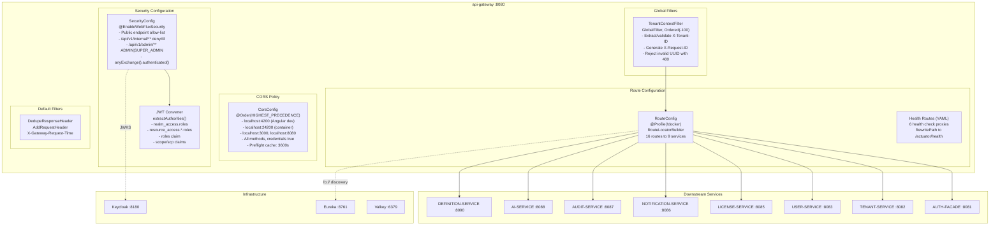
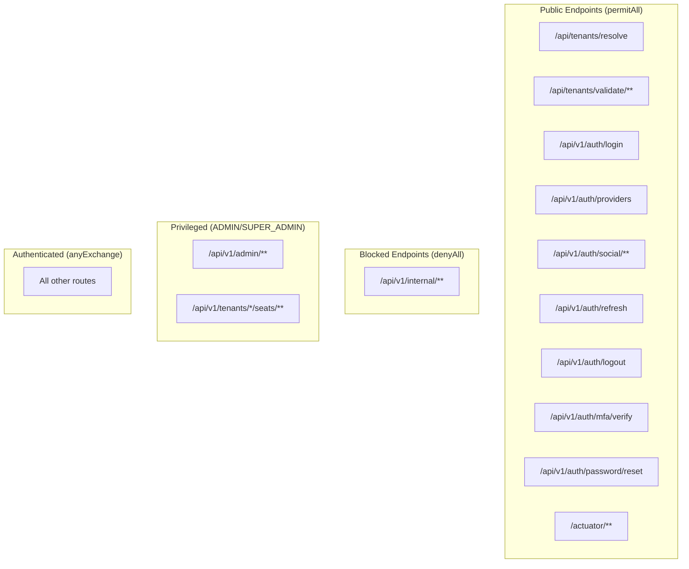
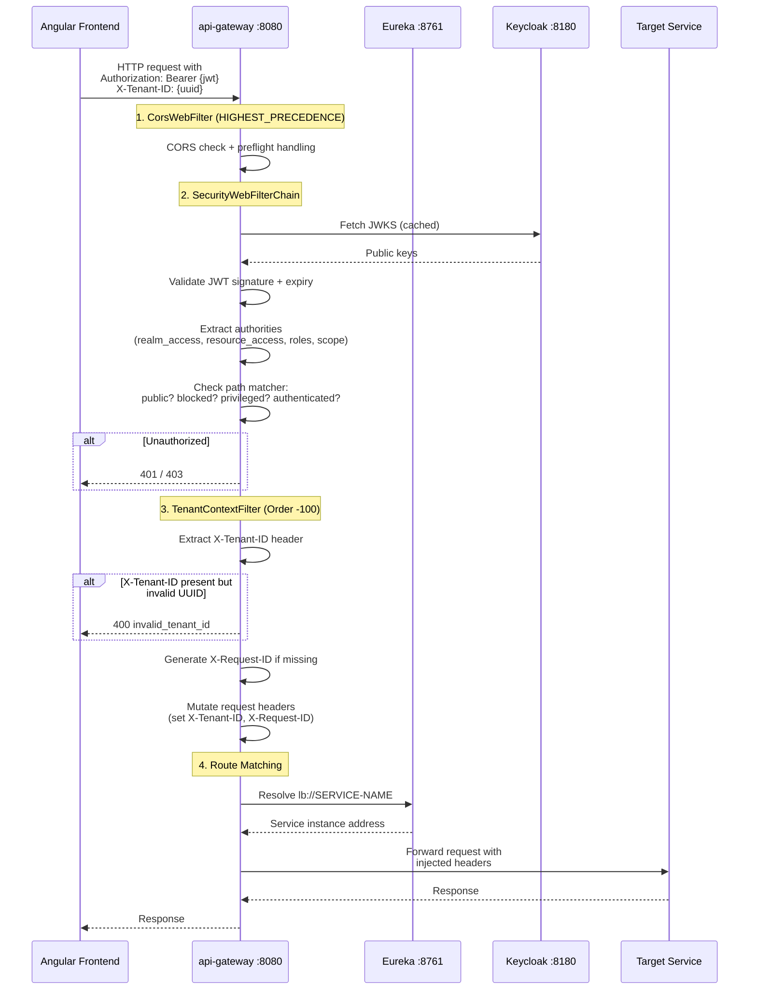
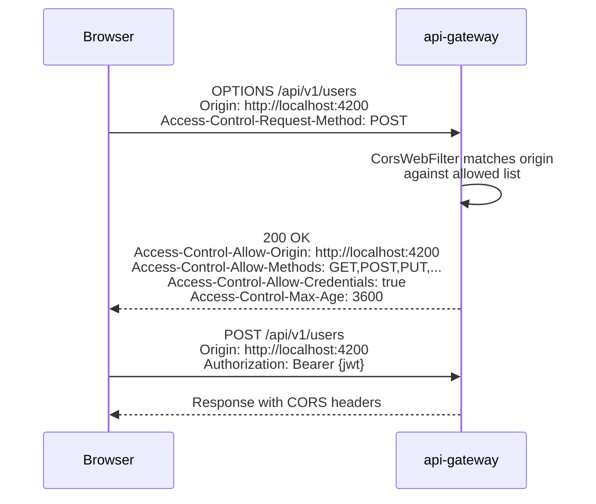

# ABB-005: API Gateway and Routing

## 1. Document Control

| Field | Value |
|-------|-------|
| ABB ID | ABB-005 |
| Name | API Gateway and Routing |
| Domain | Application |
| Status | [IMPLEMENTED] |
| Owner | Platform Team |
| Last Updated | 2026-03-08 |
| Realized By | SBB-005: Spring Cloud Gateway (`api-gateway` at :8080) |
| Related ADRs | [ADR-002](../../../Architecture/09-architecture-decisions.md#921-spring-boot-341-with-java-23-adr-002) (Spring Boot 3.4) |
| Arc42 Section | [04-application-architecture](../../04-application-architecture.md) Section 3, [08-crosscutting.md](../../../Architecture/08-crosscutting.md) Sections 8.1, 8.8 |

## 2. Purpose and Scope

The API Gateway is the single entry point for all external client traffic into the EMSIST platform. It provides centralized routing, JWT validation, tenant context injection, CORS policy enforcement, and coarse-grained role-based access control at the edge.

**In scope:**
- Route configuration and service discovery via Eureka
- Tenant context header injection (`X-Tenant-ID`, `X-Request-ID`)
- UUID validation for tenant IDs
- JWT validation via Keycloak JWKS
- Zero-trust security policy (explicit allow-list for public endpoints, deny-all internal)
- Coarse role checks at route level (ADMIN/SUPER_ADMIN for admin routes)
- CORS configuration for frontend origins
- Health check routing for downstream services
- Request deduplication headers

**Out of scope:**
- Rate limiting at the gateway level [PLANNED] -- Valkey connection configured but no rate-limiting filter exists
- BFF session cookie management [PLANNED] -- not implemented
- Request/response transformation
- API versioning enforcement (done at service level)
- Circuit breaker at gateway level (done at service-to-service level via Resilience4j)

## 3. Functional Requirements

| ID | Description | Priority | Status |
|----|-------------|----------|--------|
| FR-GW-001 | Route external traffic to internal services via Eureka discovery | HIGH | [IMPLEMENTED] -- `RouteConfig.java` with `lb://SERVICE-NAME` URIs |
| FR-GW-002 | Inject `X-Tenant-ID` and `X-Request-ID` headers into downstream requests | HIGH | [IMPLEMENTED] -- `TenantContextFilter.java` |
| FR-GW-003 | Validate `X-Tenant-ID` is a valid UUID format when present | HIGH | [IMPLEMENTED] -- `TenantContextFilter.isValidUuid()` returns 400 on invalid |
| FR-GW-004 | Validate JWT on all non-public endpoints via Keycloak JWKS | HIGH | [IMPLEMENTED] -- `SecurityConfig.java` with `oauth2ResourceServer().jwt()` |
| FR-GW-005 | Zero-trust: deny access to `/api/v1/internal/**` from edge | HIGH | [IMPLEMENTED] -- `SecurityConfig.java:58` `.pathMatchers("/api/v1/internal/**").denyAll()` |
| FR-GW-006 | Enforce ADMIN/SUPER_ADMIN role for `/api/v1/admin/**` routes | HIGH | [IMPLEMENTED] -- `SecurityConfig.java:60` `.hasAnyRole("ADMIN", "SUPER_ADMIN")` |
| FR-GW-007 | CORS policy allowing frontend origins with credentials | HIGH | [IMPLEMENTED] -- `CorsConfig.java` |
| FR-GW-008 | Health check proxy routes for all downstream services | MEDIUM | [IMPLEMENTED] -- `application.yml` routes with `RewritePath` filters |
| FR-GW-009 | Rate limiting at gateway level | MEDIUM | [PLANNED] -- Valkey configured but no filter |
| FR-GW-010 | Route for `/api/v1/features/**` to license-service | MEDIUM | [IMPLEMENTED] -- added to `RouteConfig.java` (Sprint 3, 2026-03-08) |
| FR-GW-011 | Token blacklist check against Valkey on every request | HIGH | [IMPLEMENTED] -- `TokenBlacklistFilter` added (Sprint 2, 2026-03-08) |

## 4. Interfaces

### 4.1 Provided Interfaces (Edge APIs)

The gateway exposes the full EMSIST API surface to external clients. All routes are defined in `RouteConfig.java` (Java DSL, `@Profile("!docker")`) and `application.yml` (health routes).

| Route ID | Path Pattern | Target Service | Auth | Evidence |
|----------|-------------|----------------|------|----------|
| `license-admin-service` | `/api/v1/admin/licenses/**` | `lb://LICENSE-SERVICE` | `ADMIN`, `SUPER_ADMIN` | `RouteConfig.java:25-27` |
| `license-seats-service` | `/api/v1/tenants/*/seats/**` | `lb://LICENSE-SERVICE` | `TENANT_ADMIN`, `ADMIN`, `SUPER_ADMIN` | `RouteConfig.java:28-30` |
| `auth-service` | `/api/v1/auth/**` | `lb://AUTH-FACADE` | Public (login, refresh, logout); authenticated (other) | `RouteConfig.java:35-37` |
| `auth-admin-service` | `/api/v1/admin/**` | `lb://AUTH-FACADE` | `ADMIN`, `SUPER_ADMIN` | `RouteConfig.java:38-40` |
| `auth-events-service` | `/api/v1/events/**` | `lb://AUTH-FACADE` | Authenticated | `RouteConfig.java:41-43` |
| `tenant-service` | `/api/tenants/**` | `lb://TENANT-SERVICE` | Public (resolve, validate); authenticated (other) | `RouteConfig.java:48-50` |
| `user-service` | `/api/v1/users/**` | `lb://USER-SERVICE` | Authenticated | `RouteConfig.java:55-57` |
| `license-products` | `/api/v1/products/**` | `lb://LICENSE-SERVICE` | Authenticated | `RouteConfig.java:62-64` |
| `license-service` | `/api/v1/licenses/**` | `lb://LICENSE-SERVICE` | Authenticated | `RouteConfig.java:65-67` |
| `notification-service` | `/api/v1/notifications/**` | `lb://NOTIFICATION-SERVICE` | Authenticated | `RouteConfig.java:72-74` |
| `notification-templates` | `/api/v1/notification-templates/**` | `lb://NOTIFICATION-SERVICE` | Authenticated | `RouteConfig.java:75-77` |
| `audit-service` | `/api/v1/audit/**` | `lb://AUDIT-SERVICE` | Authenticated | `RouteConfig.java:82-84` |
| `ai-agents` | `/api/v1/agents/**` | `lb://AI-SERVICE` | Authenticated | `RouteConfig.java:89-91` |
| `ai-conversations` | `/api/v1/conversations/**` | `lb://AI-SERVICE` | Authenticated | `RouteConfig.java:92-94` |
| `ai-providers` | `/api/v1/providers/**` | `lb://AI-SERVICE` | Authenticated | `RouteConfig.java:95-97` |
| `definition-service` | `/api/v1/definitions/**` | `lb://DEFINITION-SERVICE` | Authenticated | `RouteConfig.java:102-104` |

**Previously missing routes (now implemented, Sprint 3, 2026-03-08):**

| Path Pattern | Target Service | Status |
|-------------|----------------|--------|
| `/api/v1/features/**` | `lb://LICENSE-SERVICE` | [IMPLEMENTED] -- Route added in Sprint 3, 2026-03-08. `FeatureGateController` now has public endpoint. |

### 4.2 Required Interfaces (Dependencies Consumed)

| Interface | Provider | Description | Status |
|-----------|----------|-------------|--------|
| Eureka service discovery | eureka-server :8761 | Service name resolution (`lb://SERVICE-NAME`) | [IMPLEMENTED] |
| Keycloak JWKS endpoint | Keycloak :8180 | JWT signature verification | [IMPLEMENTED] |
| Valkey :6379 | Valkey 8 | Rate limiting / session state (connection configured) | [IN-PROGRESS] -- connection exists, no filters use it |

## 5. Internal Component Design

## 6. Data Model

The API gateway is stateless and does not persist data. It operates on:

| Data Element | Source | Purpose |
|-------------|--------|---------|
| `X-Tenant-ID` header | Incoming request | Tenant context propagation; validated as UUID |
| `X-Request-ID` header | Incoming or auto-generated | Request correlation/tracing |
| JWT claims (`realm_access.roles`, `resource_access`, `roles`, `scope`) | Keycloak-issued JWT | Authorization decisions |
| Eureka service registry | eureka-server | Dynamic route resolution |

### Security Policy Model

## 7. Integration Points

### 7.1 Request Lifecycle

### 7.2 CORS Preflight

## 8. Security Considerations

| Concern | Mitigation | Status |
|---------|-----------|--------|
| JWT validation | Keycloak JWKS-based signature verification | [IMPLEMENTED] |
| Internal endpoint exposure | `/api/v1/internal/**` explicitly denied | [IMPLEMENTED] |
| Privilege escalation | Admin routes require `ADMIN` or `SUPER_ADMIN` role | [IMPLEMENTED] |
| Tenant header spoofing | UUID format validation + cross-validation against JWT `tenant_id` claim | [IMPLEMENTED] -- tenant-JWT cross-validation added (Sprint 2, 2026-03-08) |
| CORS origin restriction | Explicit allow-list (localhost only currently) | [IMPLEMENTED] -- production domains must be added |
| Token blacklist check | Gateway checks Valkey for revoked tokens via `TokenBlacklistFilter` | [IMPLEMENTED] -- Sprint 2, 2026-03-08 |
| Rate limiting | Gateway-level throttling per IP/tenant | [PLANNED] |
| CSRF | Disabled (`csrf.disable()`) -- acceptable for JWT-based API | [IMPLEMENTED] |
| Response header dedup | `DedupeResponseHeader` filter prevents duplicate CORS headers | [IMPLEMENTED] |

### Authority Extraction Logic

The gateway extracts roles from multiple JWT claim locations to support Keycloak's token structure.

| Claim Path | Description | Example |
|------------|-------------|---------|
| `realm_access.roles` | Keycloak realm-level roles | `["ADMIN", "USER"]` |
| `resource_access.{client}.roles` | Keycloak client-level roles | `{"ems-client": {"roles": ["manage-users"]}}` |
| `roles` | Standard OIDC / Azure AD claim | `["ADMIN"]` |
| `scope` / `scp` | OAuth2 scopes | `"openid profile email"` |

All roles are normalized: `ROLE_` prefix stripped, hyphens converted to underscores, uppercased, then re-prefixed with `ROLE_`.

## 9. Configuration Model

| Config Key | Default | Env Override | Source |
|------------|---------|-------------|--------|
| `server.port` | `8080` | `SERVER_PORT` | `application.yml:2` |
| `spring.security.oauth2.resourceserver.jwt.issuer-uri` | `http://localhost:8180/realms/master` | `KEYCLOAK_ISSUER_URI` | `application.yml:10` |
| `spring.security.oauth2.resourceserver.jwt.jwk-set-uri` | `http://localhost:8180/realms/master/...certs` | `KEYCLOAK_JWKS_URI` | `application.yml:11` |
| `spring.cloud.gateway.x-forwarded.host-append` | `false` | -- | `application.yml:22` |
| `spring.data.redis.host` | `localhost` | `VALKEY_HOST` | `application.yml:81` |
| `spring.data.redis.port` | `6379` | `VALKEY_PORT` | `application.yml:82` |
| `eureka.client.enabled` | `true` | `EUREKA_ENABLED` | `application.yml:86` |
| `eureka.client.service-url.defaultZone` | `http://localhost:8761/eureka` | `EUREKA_URL` | `application.yml:88` |

### CORS Configuration

| Parameter | Value | Source |
|-----------|-------|--------|
| Allowed origins | `localhost:4200`, `127.0.0.1:4200`, `localhost:24200`, `127.0.0.1:24200`, `localhost:3000`, `localhost:8080` | `CorsConfig.java:29-36` |
| Allowed methods | GET, POST, PUT, PATCH, DELETE, OPTIONS, HEAD | `CorsConfig.java:39-41` |
| Allowed headers | `*` (all) | `CorsConfig.java:44` |
| Exposed headers | `Authorization`, `X-Tenant-ID`, `X-Request-ID`, `X-Total-Count`, `X-Page`, `X-Page-Size` | `CorsConfig.java:47-53` |
| Allow credentials | `true` | `CorsConfig.java:57` |
| Max age (preflight cache) | 3600 seconds (1 hour) | `CorsConfig.java:60` |

## 10. Performance and Scalability

| Metric | Target | Current | Notes |
|--------|--------|---------|-------|
| Request latency overhead | < 10 ms | Expected | Minimal filter chain; Eureka resolution cached |
| Max concurrent connections | 10,000+ | Spring WebFlux default | Non-blocking reactive model |
| JWKS fetch | Cached | Spring Security auto-caches | JWKS refreshed on key rotation |
| Eureka resolution | Cached | Spring Cloud auto-caches | Registry refreshed every 30s |

### Scaling Strategy

| Scale Dimension | Approach | Status |
|-----------------|----------|--------|
| Horizontal | Multiple gateway instances behind load balancer | Available (stateless) |
| Rate limiting | Valkey-backed token bucket per client/tenant | [PLANNED] |
| Circuit breaking | Per-route circuit breaker | [PLANNED] -- currently at service-to-service level only |

## 11. Implementation Status

| Component | Status | Evidence |
|-----------|--------|----------|
| `RouteConfig.java` (16 routes) | [IMPLEMENTED] | `/backend/api-gateway/src/main/java/com/ems/gateway/config/RouteConfig.java` |
| `TenantContextFilter.java` (global filter) | [IMPLEMENTED] | `/backend/api-gateway/src/main/java/com/ems/gateway/filter/TenantContextFilter.java` |
| `SecurityConfig.java` (zero-trust policy) | [IMPLEMENTED] | `/backend/api-gateway/src/main/java/com/ems/gateway/config/SecurityConfig.java` |
| `CorsConfig.java` (CORS policy) | [IMPLEMENTED] | `/backend/api-gateway/src/main/java/com/ems/gateway/config/CorsConfig.java` |
| Health check routes (YAML) | [IMPLEMENTED] | `/backend/api-gateway/src/main/resources/application.yml:34-76` |
| Eureka discovery client | [IMPLEMENTED] | `application.yml:84-88` |
| Valkey connection (rate limiting) | [IN-PROGRESS] | `application.yml:79-82` -- configured but no rate limit filter |
| Feature gate route (`/api/v1/features/**`) | [IMPLEMENTED] | Added to `RouteConfig.java` (Sprint 3, 2026-03-08) |
| Token blacklist check filter (`TokenBlacklistFilter`) | [IMPLEMENTED] | `TokenBlacklistFilter.java` checks Valkey blacklist (Sprint 2, 2026-03-08) |
| Production CORS origins | [PLANNED] | Only localhost origins configured |
| BFF session cookie management | [PLANNED] | Not implemented |

## 12. Gap Analysis

| Gap ID | Description | Current | Target | Priority | Reference |
|--------|-------------|---------|--------|----------|-----------|
| GAP-GW-001 | ~~No `/api/v1/features/**` route~~ | [IMPLEMENTED] Route added to `RouteConfig.java` (Sprint 3, 2026-03-08) | Resolved | ~~HIGH~~ DONE | ADR-014 |
| GAP-GW-002 | ~~No token blacklist check~~ | [IMPLEMENTED] `TokenBlacklistFilter` checks Valkey blacklist (Sprint 2, 2026-03-08) | Resolved | ~~HIGH~~ DONE | SEC-GAP-002 |
| GAP-GW-003 | No rate limiting | Valkey connection exists but no filter | Implement rate limit filter | MEDIUM | FR-GW-009 |
| GAP-GW-004 | Only localhost CORS origins | Production domains not configured | Add production domain origins | HIGH | Pre-production |
| GAP-GW-005 | `@Profile("!docker")` on RouteConfig | No Docker-profile route config exists | Create Docker-profile route config or remove profile restriction | MEDIUM | Deployment |
| GAP-GW-006 | ~~Tenant header not cross-validated with JWT~~ | [IMPLEMENTED] `TenantContextFilter` now cross-validates `X-Tenant-ID` against JWT `tenant_id` claim (Sprint 2, 2026-03-08) | Resolved | ~~MEDIUM~~ DONE | Security hardening |

## 13. Dependencies

| Dependency | Type | Direction | Status |
|------------|------|-----------|--------|
| Spring Cloud Gateway | Library | Required | [IMPLEMENTED] |
| Spring Security (WebFlux) | Library | Required | [IMPLEMENTED] |
| Eureka Discovery Client | Library | Required | [IMPLEMENTED] |
| Keycloak JWKS endpoint | Identity | Required | [IMPLEMENTED] |
| Valkey 8 | Infrastructure | Optional (rate limiting) | [IN-PROGRESS] |
| All 9 downstream services | Application | Downstream | [IMPLEMENTED] |

---

**SA verification date:** 2026-03-08
**Verified by reading:** `RouteConfig.java`, `TenantContextFilter.java`, `SecurityConfig.java`, `CorsConfig.java`, `application.yml` (api-gateway)
