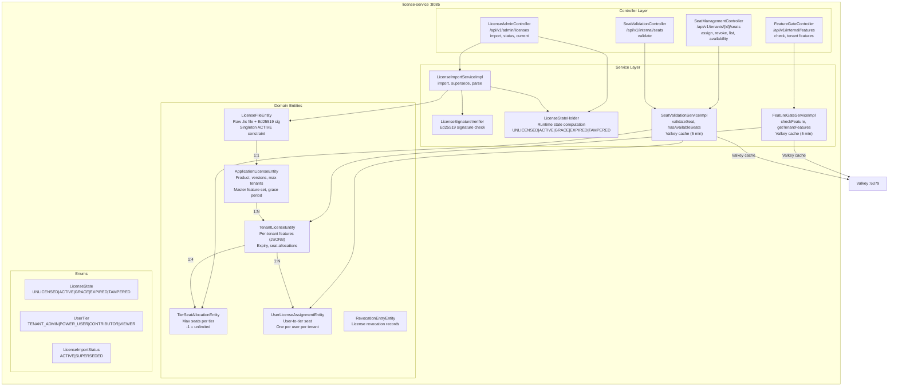
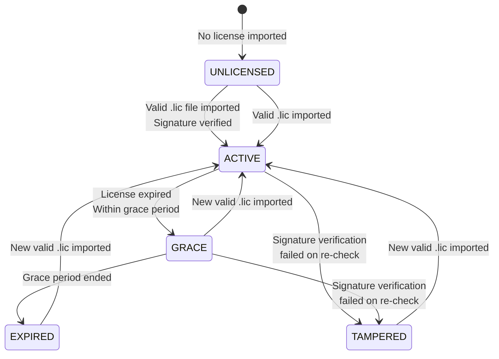
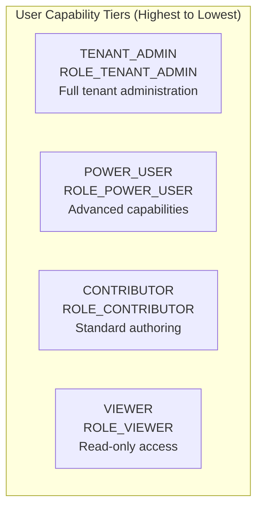
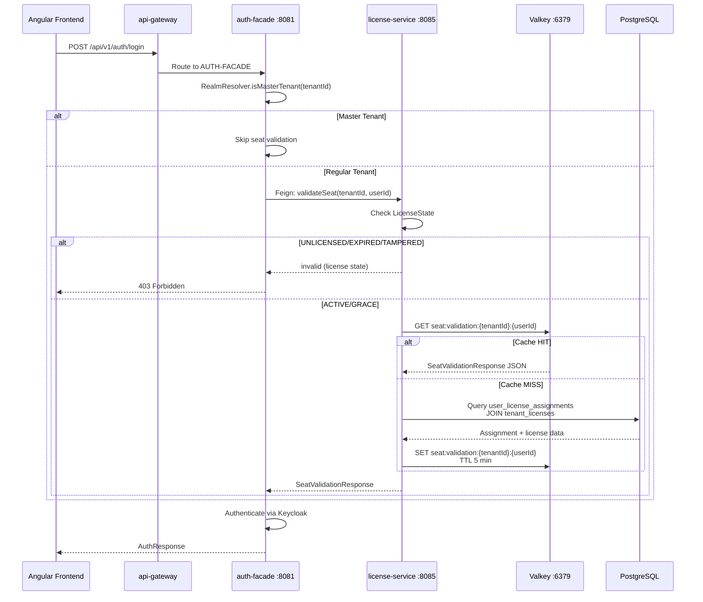
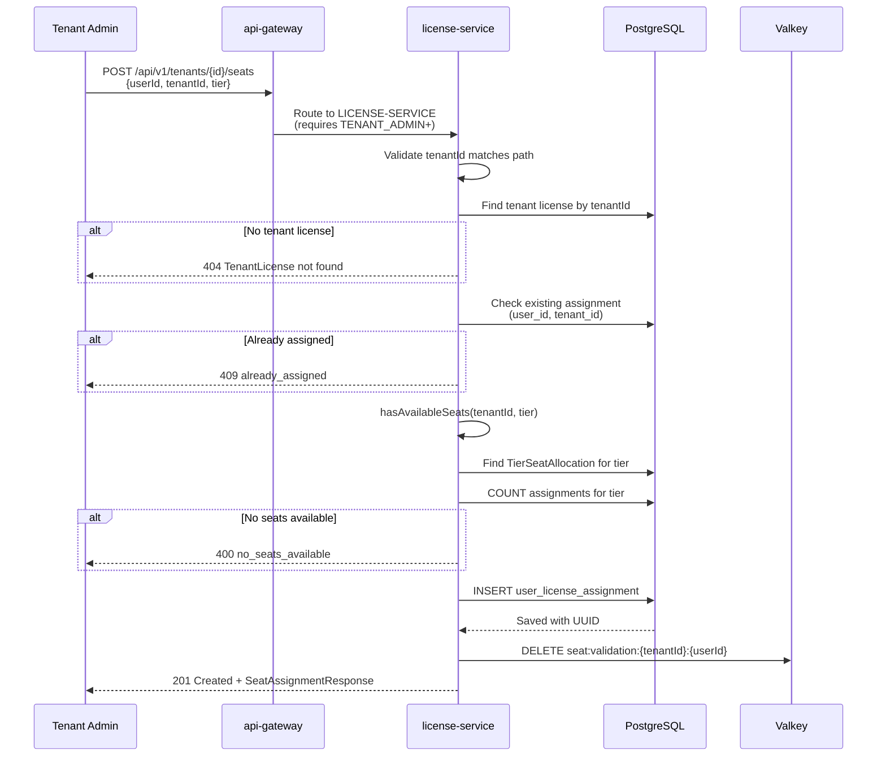
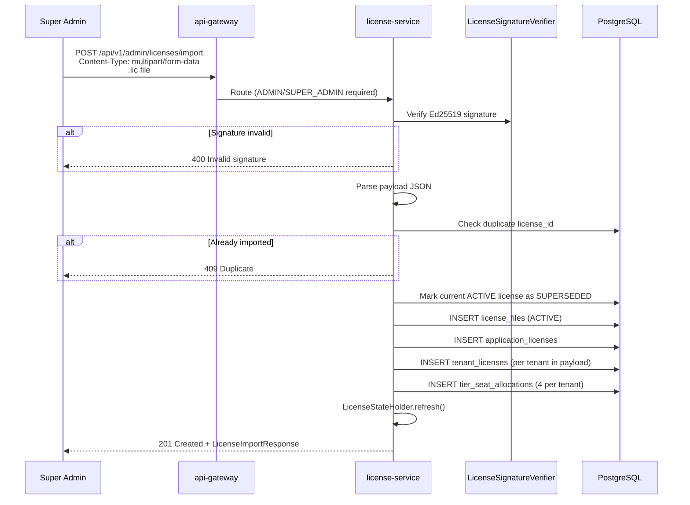

# ABB-006: License and Entitlement Management

## 1. Document Control

| Field | Value |
|-------|-------|
| ABB ID | ABB-006 |
| Name | License and Entitlement Management |
| Domain | Application |
| Status | [IN-PROGRESS] -- service operational; feature gate API consumed by auth-facade (Sprint 3, 2026-03-08); ADR-006 merge and `@FeatureGate` annotation still planned |
| Owner | Platform Team |
| Last Updated | 2026-03-08 |
| Realized By | SBB-006: license-service (:8085) + Valkey cache |
| Related ADRs | [ADR-006](../../../Architecture/09-architecture-decisions.md#942-platform-services-consolidation-adr-006) (Service Merge -- Proposed, 0% implemented), [ADR-014](../../../Architecture/09-architecture-decisions.md#936-rbac-and-licensing-integration-adr-014) (RBAC + Licensing Integration -- Proposed), [ADR-015](../../../Architecture/09-architecture-decisions.md#941-on-premise-cryptographic-license-architecture-adr-015) (On-Premise License Architecture) |
| Arc42 Section | [04-application-architecture](../../04-application-architecture.md) Section 6.2, [08-crosscutting.md](../../../Architecture/08-crosscutting.md) Sections 8.3, 8.4 |

## 2. Purpose and Scope

The License and Entitlement Management building block provides the complete licensing lifecycle for EMSIST, including license file import (on-premise model), application-level and tenant-level entitlement management, per-user seat assignment with tier-based quotas, and feature gate enforcement.

**In scope:**
- On-premise license file import with Ed25519 signature verification
- Application license model (product, version range, max tenants, features, grace period)
- Tenant license carving from application license (per-tenant feature subset, expiry, seat allocations)
- Per-user seat assignment with tier-based quotas (TENANT_ADMIN, POWER_USER, CONTRIBUTOR, VIEWER)
- Feature gate API for checking tenant feature access
- Seat validation API consumed by auth-facade during login
- License state machine (UNLICENSED, ACTIVE, GRACE, EXPIRED, TAMPERED)
- Valkey caching for feature gate and seat validation results
- License revocation tracking

**Out of scope:**
- SaaS subscription billing (dropped; replaced by on-premise model per ADR-015)
- Service merge into tenant-service (ADR-006 proposed but 0% implemented)
- Frontend feature guard / feature directive (ADR-014 -- PLANNED)
- Backend `@FeatureGate` annotation (ADR-014 -- PLANNED)
- RBAC-licensing composite authorization enrichment in auth response (ADR-014 -- PLANNED)

## 3. Functional Requirements

| ID | Description | Priority | Status |
|----|-------------|----------|--------|
| FR-LIC-001 | Import signed `.lic` file with Ed25519 signature verification | HIGH | [IMPLEMENTED] -- `LicenseImportService`, `LicenseSignatureVerifier` |
| FR-LIC-002 | Extract application license from imported file (product, versions, max tenants, features, grace period) | HIGH | [IMPLEMENTED] -- `ApplicationLicenseEntity` persisted in PostgreSQL |
| FR-LIC-003 | Carve tenant-level licenses from application license with feature subsets | HIGH | [IMPLEMENTED] -- `TenantLicenseEntity` with JSONB features array |
| FR-LIC-004 | Allocate seat quotas per tier per tenant (4 tiers: TENANT_ADMIN, POWER_USER, CONTRIBUTOR, VIEWER) | HIGH | [IMPLEMENTED] -- `TierSeatAllocationEntity` |
| FR-LIC-005 | Assign individual users to capability tiers within a tenant (one tier per user per tenant) | HIGH | [IMPLEMENTED] -- `UserLicenseAssignmentEntity` with unique constraint |
| FR-LIC-006 | Validate user seat during login (consumed by auth-facade via Feign) | HIGH | [IMPLEMENTED] -- `SeatValidationServiceImpl`, `SeatValidationController` |
| FR-LIC-007 | Feature gate check per tenant (is feature X available for tenant Y?) | HIGH | [IMPLEMENTED] -- `FeatureGateServiceImpl`, `FeatureGateController` |
| FR-LIC-008 | License state machine: compute runtime state from license file | HIGH | [IMPLEMENTED] -- `LicenseStateHolder` computes `LicenseState` enum |
| FR-LIC-009 | Graceful degradation during grace period (degraded features list) | MEDIUM | [IMPLEMENTED] -- `ApplicationLicenseEntity.degradedFeatures` JSONB |
| FR-LIC-010 | License revocation tracking | MEDIUM | [IMPLEMENTED] -- `RevocationEntryEntity` |
| FR-LIC-011 | API gateway route for feature gate endpoint | HIGH | [IMPLEMENTED] -- Public `FeatureGateController` added; `/api/v1/features/**` gateway route added (Sprint 3, 2026-03-08) |
| FR-LIC-012 | Feature context returned in auth-facade login response | HIGH | [IMPLEMENTED] -- Auth response includes `authorization.features` via Feign call to license-service (Sprint 3, 2026-03-08) |
| FR-LIC-013 | Master tenant implicit "all features" bypass | HIGH | [IMPLEMENTED] -- `FeatureGateServiceImpl` returns all features for master tenant (Sprint 3, 2026-03-08) |

## 4. Interfaces

### 4.1 Provided Interfaces (APIs Exposed)

#### License Administration (Master Tenant Only)

| Endpoint | Method | Description | Auth | Status | Evidence |
|----------|--------|-------------|------|--------|----------|
| `/api/v1/admin/licenses/import` | POST | Import a signed `.lic` file | `SUPER_ADMIN` | [IMPLEMENTED] | `LicenseAdminController.java:49` |
| `/api/v1/admin/licenses/status` | GET | Get current runtime license state | `SUPER_ADMIN` | [IMPLEMENTED] | `LicenseAdminController.java:75` |
| `/api/v1/admin/licenses/current` | GET | Get full active license details | `SUPER_ADMIN` | [IMPLEMENTED] | `LicenseAdminController.java:140` |

#### Seat Management (Tenant Admin)

| Endpoint | Method | Description | Auth | Status | Evidence |
|----------|--------|-------------|------|--------|----------|
| `/api/v1/tenants/{tenantId}/seats` | POST | Assign a seat to a user | `TENANT_ADMIN+` | [IMPLEMENTED] | `SeatManagementController.java:49` |
| `/api/v1/tenants/{tenantId}/seats/{userId}` | DELETE | Revoke a user's seat | `TENANT_ADMIN+` | [IMPLEMENTED] | `SeatManagementController.java:127` |
| `/api/v1/tenants/{tenantId}/seats` | GET | List all seat assignments in a tenant | `TENANT_ADMIN+` | [IMPLEMENTED] | `SeatManagementController.java:160` |
| `/api/v1/tenants/{tenantId}/seats/availability` | GET | Check seat availability by tier | `TENANT_ADMIN+` | [IMPLEMENTED] | `SeatManagementController.java:189` |

#### Internal APIs (Service-to-Service Only)

| Endpoint | Method | Description | Consumer | Status | Evidence |
|----------|--------|-------------|----------|--------|----------|
| `/api/v1/internal/features/check` | GET | Check if tenant has feature access | auth-facade (Feign) | [IMPLEMENTED] -- internal route for service-to-service; public route also available at `/api/v1/features/check` (Sprint 3, 2026-03-08) | `FeatureGateController.java:32` |
| `/api/v1/internal/features/tenant` | GET | Get all features for a tenant | auth-facade (Feign) | [IMPLEMENTED] -- internal route for service-to-service; public route also available at `/api/v1/features/tenant` (Sprint 3, 2026-03-08) | `FeatureGateController.java:51` |
| `/api/v1/internal/seats/validate` (inferred) | GET | Validate user seat for login | auth-facade (Feign) | [IMPLEMENTED] | `SeatValidationController.java` |

### 4.2 Required Interfaces (Dependencies Consumed)

| Interface | Provider | Description | Status |
|-----------|----------|-------------|--------|
| PostgreSQL `master_db` | PostgreSQL 16 | License data persistence via JPA + Flyway | [IMPLEMENTED] |
| Valkey :6379 | Valkey 8 | Feature gate and seat validation caching | [IMPLEMENTED] |
| Keycloak JWKS | Keycloak 24 | JWT validation for API security | [IMPLEMENTED] |
| Eureka service registry | eureka-server | Service registration and discovery | [IMPLEMENTED] |

## 5. Internal Component Design



## 6. Data Model

### 6.1 Entity Relationship Diagram

```mermaid
erDiagram
    LICENSE_FILES ||--|| APPLICATION_LICENSES : "1:1 extracted from"
    APPLICATION_LICENSES ||--o{ TENANT_LICENSES : "1:N carved into"
    TENANT_LICENSES ||--|{ TIER_SEAT_ALLOCATIONS : "1:4 allocates"
    TENANT_LICENSES ||--o{ USER_LICENSE_ASSIGNMENTS : "1:N seats"

    LICENSE_FILES {
        uuid id PK
        varchar license_id UK "e.g. LIC-2026-0001"
        varchar format_version "e.g. 1.0"
        varchar kid "Ed25519 key ID"
        varchar issuer "Vendor name"
        timestamp issued_at
        varchar customer_id
        varchar customer_name
        varchar customer_country "ISO 3166-1 alpha-2"
        bytea raw_content "Complete .lic file"
        text payload_json "Decoded JSON"
        bytea signature "Ed25519 signature"
        varchar payload_checksum "SHA-256"
        enum import_status "ACTIVE|SUPERSEDED"
        uuid imported_by "Cross-ref user-service"
        bigint version "@Version"
        timestamp created_at
        timestamp updated_at
    }

    APPLICATION_LICENSES {
        uuid id PK
        uuid license_file_id FK UK
        varchar product "Must match EMSIST"
        varchar version_min "Semver min"
        varchar version_max "Semver max"
        varchar instance_id "Optional HW binding"
        int max_tenants
        timestamp expires_at
        jsonb features "Master feature set"
        int grace_period_days "Default 30"
        jsonb degraded_features "Grace mode disabled"
        bigint version "@Version"
        timestamp created_at
        timestamp updated_at
    }

    TENANT_LICENSES {
        uuid id PK
        uuid application_license_id FK
        varchar tenant_id "Cross-ref tenant-service"
        varchar display_name
        timestamp expires_at
        jsonb features "Tenant feature subset"
        bigint version "@Version"
        timestamp created_at
        timestamp updated_at
    }

    TIER_SEAT_ALLOCATIONS {
        uuid id PK
        uuid tenant_license_id FK
        enum tier "TENANT_ADMIN|POWER_USER|CONTRIBUTOR|VIEWER"
        int max_seats "-1 = unlimited"
        bigint version "@Version"
        timestamp created_at
        timestamp updated_at
    }

    USER_LICENSE_ASSIGNMENTS {
        uuid id PK
        uuid tenant_license_id FK
        uuid user_id "Cross-ref user-service"
        varchar tenant_id "Denormalized for queries"
        enum tier "TENANT_ADMIN|POWER_USER|CONTRIBUTOR|VIEWER"
        timestamp assigned_at
        uuid assigned_by "Admin who assigned"
        bigint version "@Version"
        timestamp created_at
        timestamp updated_at
    }
```

### 6.2 Unique Constraints

| Constraint Name | Table | Columns | Business Rule |
|-----------------|-------|---------|---------------|
| `idx_tenant_licenses_app_tenant` | `tenant_licenses` | `application_license_id, tenant_id` | One tenant license per application license per tenant |
| `idx_user_license_assignments_user_tenant` | `user_license_assignments` | `user_id, tenant_id` | One seat per user per tenant |
| `idx_tier_seat_allocations_license_tier` | `tier_seat_allocations` | `tenant_license_id, tier` | One allocation per tier per tenant license |
| `license_files.license_id` (unique) | `license_files` | `license_id` | No duplicate license IDs |
| `application_licenses.license_file_id` (unique) | `application_licenses` | `license_file_id` | 1:1 with license file |

### 6.3 License State Machine



| State | Behavior | Feature Access | Evidence |
|-------|----------|---------------|----------|
| `UNLICENSED` | No license file imported | All features denied | `LicenseState.java:13-14` |
| `ACTIVE` | Valid, non-expired license | Full access per entitlements | `LicenseState.java:16-17` |
| `GRACE` | Expired but within grace period | Degraded features disabled | `LicenseState.java:19-20` |
| `EXPIRED` | Grace period ended | System locked down | `LicenseState.java:22-23` |
| `TAMPERED` | Signature verification failed | Emergency lockdown | `LicenseState.java:25-26` |

### 6.4 User Tier Model



| Tier | Display Name | RBAC Role | Evidence |
|------|-------------|-----------|----------|
| `TENANT_ADMIN` | Tenant Admin | `ROLE_TENANT_ADMIN` | `UserTier.java:18` |
| `POWER_USER` | Power User | `ROLE_POWER_USER` | `UserTier.java:21` |
| `CONTRIBUTOR` | Contributor | `ROLE_CONTRIBUTOR` | `UserTier.java:24` |
| `VIEWER` | Viewer | `ROLE_VIEWER` | `UserTier.java:27` |

### 6.5 Flyway Migrations

| Version | File | Purpose |
|---------|------|---------|
| V1 | `V1__licenses.sql` | Original SaaS licensing tables |
| V2 | `V2__add_version_column.sql` | Add optimistic locking `version` column |
| V3 | `V3__drop_saas_licensing_tables.sql` | Drop legacy SaaS tables |
| V4 | `V4__create_on_premise_licensing_schema.sql` | Create on-premise model (license_files, application_licenses, tenant_licenses, tier_seat_allocations, user_license_assignments, revocation_entries) |

## 7. Integration Points

### 7.1 Seat Validation During Login



### 7.2 Seat Assignment Flow



### 7.3 License Import Flow



## 8. Security Considerations

| Concern | Mitigation | Status |
|---------|-----------|--------|
| License file tampering | Ed25519 digital signature verification | [IMPLEMENTED] -- `LicenseSignatureVerifier` |
| License replay | Unique `license_id` constraint prevents re-import | [IMPLEMENTED] |
| Unauthorized import | Only `SUPER_ADMIN` can access `/api/v1/admin/licenses/**` | [IMPLEMENTED] -- gateway + controller auth |
| Seat assignment by non-admin | `/api/v1/tenants/*/seats/**` requires `TENANT_ADMIN+` | [IMPLEMENTED] -- gateway security config |
| Cross-tenant seat access | `tenantId` validated against path parameter | [IMPLEMENTED] -- `SeatManagementController.java:74` |
| Feature gate bypass | Feature check API at `/api/v1/internal/features/**` blocked from edge | [IMPLEMENTED] -- gateway `denyAll` on internal |
| Runtime state spoofing | `LicenseState` computed from signed data, not client input | [IMPLEMENTED] |
| Grace period abuse | `degradedFeatures` list explicitly disables specific features | [IMPLEMENTED] |

## 9. Configuration Model

| Config Key | Default | Env Override | Source |
|------------|---------|-------------|--------|
| `server.port` | `8085` | `SERVER_PORT` | `application.yml:2` |
| `spring.datasource.url` | `jdbc:postgresql://localhost:5432/master_db?sslmode=verify-full` | `DATABASE_URL` | `application.yml:16` |
| `spring.datasource.username` | `postgres` | `DATABASE_USER` | `application.yml:17` |
| `spring.datasource.password` | `postgres` | `DATABASE_PASSWORD` | `application.yml:18` |
| `spring.jpa.hibernate.ddl-auto` | `validate` | -- | `application.yml:22` |
| `spring.flyway.table` | `flyway_schema_history_license` | -- | `application.yml:35` |
| `spring.data.redis.host` | `localhost` | `VALKEY_HOST` | `application.yml:39` |
| `spring.data.redis.port` | `6379` | `VALKEY_PORT` | `application.yml:40` |
| `license.cache.ttl-minutes` | `5` | -- | `application.yml:53` |
| `license.cache.prefix` | `license:` | -- | `application.yml:54` |
| `eureka.client.enabled` | `true` | `EUREKA_ENABLED` | `application.yml:47` |

## 10. Performance and Scalability

| Metric | Target | Current | Notes |
|--------|--------|---------|-------|
| Feature gate check latency (p99) | < 10 ms (cache hit) | Expected | Valkey single-key GET |
| Feature gate check latency (cache miss) | < 50 ms | Expected | PostgreSQL JSONB query |
| Seat validation latency (p99) | < 10 ms (cache hit) | Expected | Valkey single-key GET |
| Seat assignment latency | < 100 ms | Expected | Single INSERT + cache invalidation |
| License import latency | < 5 s | Depends on payload size | Signature verification + multi-table insert |
| Max tenants per license | Configurable (`max_tenants`) | License-defined | Enforced by `ApplicationLicenseEntity.maxTenants` |

### Cache Performance

| Cache | TTL | Hit Ratio Target | Invalidation Strategy |
|-------|-----|-----------------|----------------------|
| `seat:validation:{tenantId}:{userId}` | 5 min | > 95% (seats rarely change) | Explicit deletion on assign/revoke |
| `license:feature:{tenantId}:tenant:{featureKey}` | 5 min | > 90% | TTL-based; no explicit invalidation on license change |

### Scaling Strategy

| Scale Dimension | Approach | Status |
|-----------------|----------|--------|
| Read throughput | Valkey cache reduces DB queries | [IMPLEMENTED] |
| Feature check volume | Cache-aside with 5-min TTL | [IMPLEMENTED] |
| License data volume | Low (< 100 tenants typically) | Not a concern |
| Seat assignment volume | Direct DB writes; cache invalidation | [IMPLEMENTED] |

## 11. Implementation Status

| Component | Status | Evidence |
|-----------|--------|----------|
| `LicenseFileEntity` | [IMPLEMENTED] | `/backend/license-service/src/main/java/com/ems/license/entity/LicenseFileEntity.java` |
| `ApplicationLicenseEntity` | [IMPLEMENTED] | `/backend/license-service/src/main/java/com/ems/license/entity/ApplicationLicenseEntity.java` |
| `TenantLicenseEntity` | [IMPLEMENTED] | `/backend/license-service/src/main/java/com/ems/license/entity/TenantLicenseEntity.java` |
| `TierSeatAllocationEntity` | [IMPLEMENTED] | `/backend/license-service/src/main/java/com/ems/license/entity/TierSeatAllocationEntity.java` |
| `UserLicenseAssignmentEntity` | [IMPLEMENTED] | `/backend/license-service/src/main/java/com/ems/license/entity/UserLicenseAssignmentEntity.java` |
| `RevocationEntryEntity` | [IMPLEMENTED] | `/backend/license-service/src/main/java/com/ems/license/entity/RevocationEntryEntity.java` |
| `LicenseState` enum | [IMPLEMENTED] | `/backend/license-service/src/main/java/com/ems/license/entity/LicenseState.java` |
| `UserTier` enum | [IMPLEMENTED] | `/backend/license-service/src/main/java/com/ems/license/entity/UserTier.java` |
| `LicenseImportServiceImpl` | [IMPLEMENTED] | `/backend/license-service/src/main/java/com/ems/license/service/LicenseImportServiceImpl.java` |
| `LicenseSignatureVerifier` | [IMPLEMENTED] | `/backend/license-service/src/main/java/com/ems/license/service/LicenseSignatureVerifier.java` |
| `LicenseStateHolder` | [IMPLEMENTED] | `/backend/license-service/src/main/java/com/ems/license/service/LicenseStateHolder.java` |
| `FeatureGateServiceImpl` + Valkey cache | [IMPLEMENTED] | `/backend/license-service/src/main/java/com/ems/license/service/FeatureGateServiceImpl.java` |
| `SeatValidationServiceImpl` + Valkey cache | [IMPLEMENTED] | `/backend/license-service/src/main/java/com/ems/license/service/SeatValidationServiceImpl.java` |
| `LicenseAdminController` | [IMPLEMENTED] | `/backend/license-service/src/main/java/com/ems/license/controller/LicenseAdminController.java` |
| `SeatManagementController` | [IMPLEMENTED] | `/backend/license-service/src/main/java/com/ems/license/controller/SeatManagementController.java` |
| `FeatureGateController` | [IMPLEMENTED] | `/backend/license-service/src/main/java/com/ems/license/controller/FeatureGateController.java` |
| `SeatValidationController` | [IMPLEMENTED] | `/backend/license-service/src/main/java/com/ems/license/controller/SeatValidationController.java` |
| auth-facade Feign client for seat validation | [IMPLEMENTED] | `/backend/auth-facade/src/main/java/com/ems/auth/client/LicenseServiceClient.java` |
| auth-facade circuit breaker for license-service | [IMPLEMENTED] | `/backend/auth-facade/src/main/java/com/ems/auth/service/SeatValidationService.java:32` |
| Gateway route for license admin | [IMPLEMENTED] | `RouteConfig.java:25-27` |
| Gateway route for seat management | [IMPLEMENTED] | `RouteConfig.java:28-30` |
| Gateway route for feature gate API | [IMPLEMENTED] | `/api/v1/features/**` route added to `RouteConfig.java` (Sprint 3, 2026-03-08) |
| Feign method for `getUserFeatures()` | [IMPLEMENTED] | `LicenseServiceClient.getUserFeatures()` added (Sprint 3, 2026-03-08) |
| Auth response with authorization context | [IMPLEMENTED] | Auth response includes `authorization.features` (Sprint 3, 2026-03-08) |
| Master tenant "all features" bypass | [IMPLEMENTED] | `FeatureGateServiceImpl` returns all features for master tenant (Sprint 3, 2026-03-08) |
| Service merge into tenant-service | [PLANNED] | ADR-006 -- 0% implemented |

## 12. Gap Analysis

| Gap ID | Description | Current | Target | Priority | Reference |
|--------|-------------|---------|--------|----------|-----------|
| GAP-L-001 | ~~No gateway route for feature gate API~~ | [IMPLEMENTED] Public `FeatureGateController` + `/api/v1/features/**` gateway route (Sprint 3, 2026-03-08) | Resolved | ~~HIGH~~ DONE | ADR-014 |
| GAP-L-002 | ~~No upstream consumers of feature gate~~ | [IMPLEMENTED] auth-facade calls `getUserFeatures()` during login (Sprint 3, 2026-03-08) | Resolved | ~~HIGH~~ DONE | ADR-014 |
| GAP-L-003 | ~~No `getUserFeatures()` Feign method in auth-facade~~ | [IMPLEMENTED] `LicenseServiceClient.getUserFeatures()` added (Sprint 3, 2026-03-08) | Resolved | ~~HIGH~~ DONE | ADR-014 |
| GAP-L-004 | ~~No master tenant feature bypass~~ | [IMPLEMENTED] `FeatureGateServiceImpl` returns all features for master tenant (Sprint 3, 2026-03-08) | Resolved | ~~HIGH~~ DONE | ADR-014 Section 2 |
| GAP-L-005 | ~~Auth response does not include features~~ | [IMPLEMENTED] Auth response includes `authorization.features` (Sprint 3, 2026-03-08) | Resolved | ~~HIGH~~ DONE | ADR-014 Section 3 |
| GAP-L-006 | No `@FeatureGate` backend annotation | Feature checks require explicit service calls | AOP annotation for declarative feature gating | MEDIUM | ADR-014 |
| GAP-L-007 | No cache invalidation on license import | Feature cache uses TTL only; import does not flush caches | Flush feature caches on license import/supersede | MEDIUM | -- |
| GAP-L-008 | Service merge with tenant-service not implemented | Separate service at :8085 | Merge per ADR-006 | LOW | ADR-006 (deferred) |
| GAP-L-009 | Shared `master_db` database | Same DB as tenant-service | Dedicated `license_db` | LOW | Best practice |

## 13. Dependencies

| Dependency | Type | Direction | Status |
|------------|------|-----------|--------|
| PostgreSQL 16 (`master_db`) | Infrastructure | Required | [IMPLEMENTED] |
| Flyway | Library | Required | [IMPLEMENTED] (V1-V4 migrations) |
| Spring Data JPA | Library | Required | [IMPLEMENTED] |
| Valkey 8 | Infrastructure | Required | [IMPLEMENTED] |
| Spring Data Redis (Lettuce) | Library | Required | [IMPLEMENTED] |
| Keycloak (JWT validation) | Identity | Required | [IMPLEMENTED] |
| Eureka service registry | Infrastructure | Required | [IMPLEMENTED] |
| api-gateway routes | Routing | Required | [IMPLEMENTED] (admin, seats, licenses, products) |
| auth-facade (Feign consumer) | Application | Upstream | [IMPLEMENTED] (seat validation + feature gate via `getUserFeatures()`, Sprint 3, 2026-03-08) |
| tenant-service | Application | Logical dependency | No direct integration (tenantId as string ref) |
| user-service | Application | Logical dependency | No direct integration (userId as UUID ref) |

---

**SA verification date:** 2026-03-08
**Verified by reading:** All entity classes in `/backend/license-service/src/main/java/com/ems/license/entity/`, all controller classes, `FeatureGateServiceImpl.java`, `SeatValidationServiceImpl.java`, `LicenseImportServiceImpl.java`, `LicenseSignatureVerifier.java`, `LicenseStateHolder.java`, `application.yml` (license-service), `RouteConfig.java` (api-gateway), `LicenseServiceClient.java` (auth-facade)
