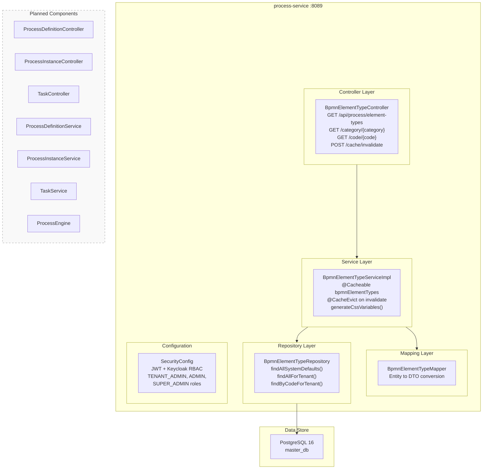
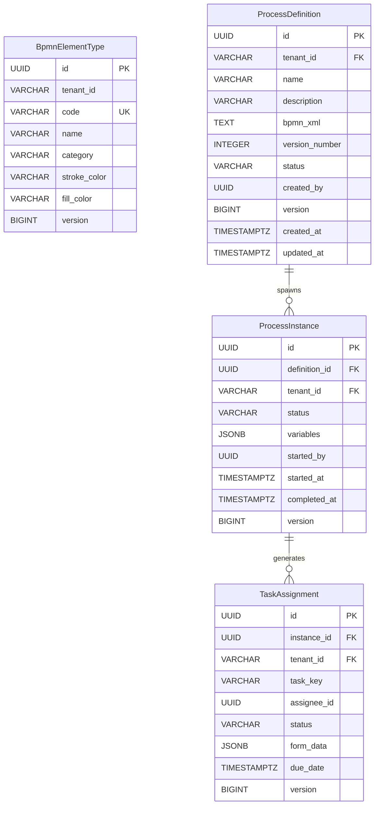
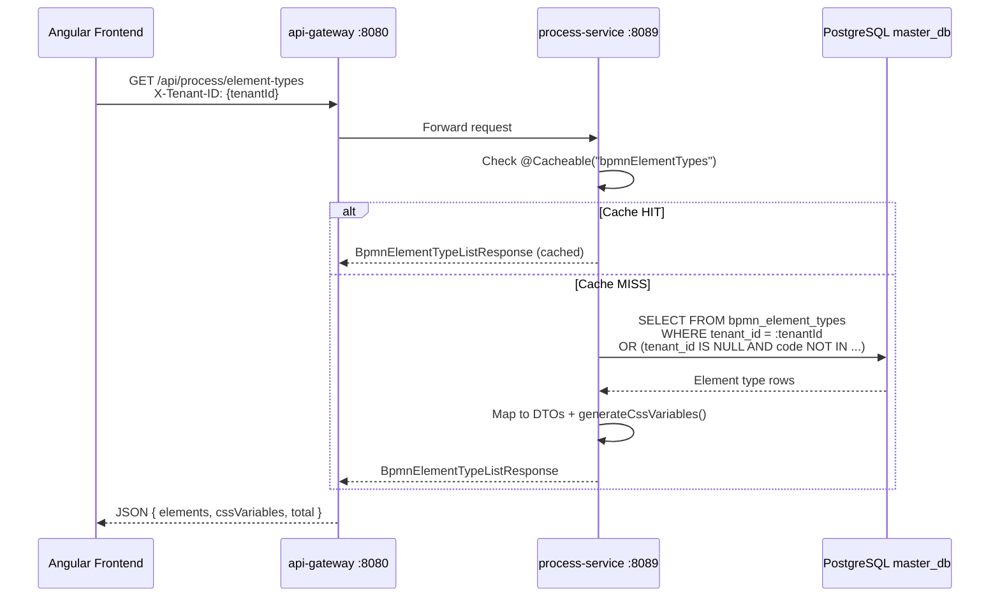
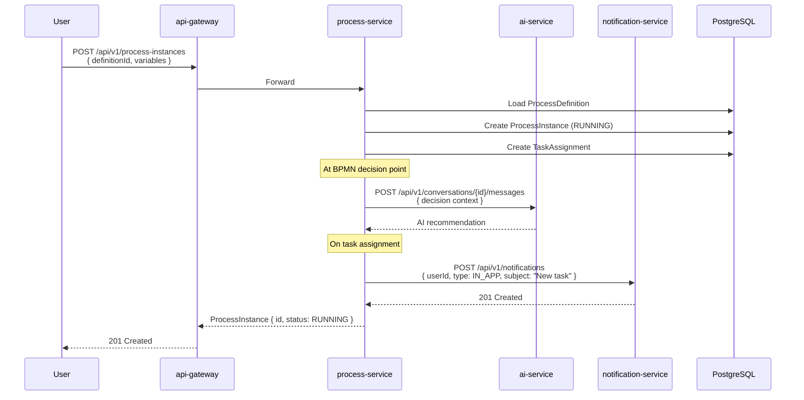

# ABB-007: Process Orchestration

## 1. Document Control

| Field | Value |
|-------|-------|
| ABB ID | ABB-007 |
| Name | Process Orchestration |
| Domain | Application |
| Status | [IN-PROGRESS] -- BPMN element type catalog implemented; process execution engine not yet built |
| Owner | Platform Team |
| Last Updated | 2026-03-08 |
| Realized By | SBB-007: process-service (port 8089) + PostgreSQL |
| Related ADRs | [ADR-002](../../../Architecture/09-architecture-decisions.md#921-spring-boot-341-with-java-23-adr-002) (Spring Boot 3.4), [ADR-016](../../../Architecture/09-architecture-decisions.md#911-polyglot-persistence-adr-001-adr-016) (Polyglot Persistence) |
| Arc42 Section | [04-application-architecture.md](../../04-application-architecture.md) Section 2 (Dormant Modules), [08-crosscutting.md](../../../Architecture/08-crosscutting.md) |

## 2. Purpose and Scope

The Process Orchestration building block provides BPMN 2.0 process definition management, tenant-scoped process execution, and process instance lifecycle tracking. It enables tenants to define, version, and execute business processes with human task assignment, AI-assisted decision points, and notification integration.

**In scope (current implementation):**
- BPMN element type catalog with tenant-scoped overrides [IMPLEMENTED]
- CSS variable generation for frontend BPMN rendering [IMPLEMENTED]
- Element type caching with Spring Cache [IMPLEMENTED]
- Cache invalidation API [IMPLEMENTED]
- Security with JWT + Keycloak RBAC [IMPLEMENTED]
- Flyway migrations for element type schema [IMPLEMENTED]

**In scope (planned):**
- BPMN 2.0 process definition storage and versioning [PLANNED]
- Tenant-scoped process execution engine [PLANNED]
- Process instance lifecycle management (created, running, completed, failed, cancelled) [PLANNED]
- Human task assignment per RBAC roles [PLANNED]
- AI service integration at decision points [PLANNED]
- Notification service integration for task notifications [PLANNED]
- Process designer frontend component [PLANNED]
- Process analytics and monitoring [PLANNED]

**Out of scope:**
- Complex event processing (CEP)
- Case management (CMMN)
- Decision model notation (DMN) -- may be added later
- Inter-tenant process orchestration

## 3. Functional Requirements

| ID | Description | Priority | Status |
|----|-------------|----------|--------|
| FR-PROC-001 | Store BPMN element type definitions with tenant overrides | HIGH | [IMPLEMENTED] -- `BpmnElementTypeEntity` with `tenant_id` nullable column; `BpmnElementTypeRepository.findAllForTenant()` falls back to system defaults |
| FR-PROC-002 | Generate CSS variables for BPMN element styling | HIGH | [IMPLEMENTED] -- `BpmnElementTypeServiceImpl.generateCssVariables()` produces `--bpmn-{category}-stroke/fill` variables |
| FR-PROC-003 | Cache element types per tenant with eviction | MEDIUM | [IMPLEMENTED] -- `@Cacheable("bpmnElementTypes")` keyed by `tenantId`, `@CacheEvict` on invalidate endpoint |
| FR-PROC-004 | Filter element types by category (task, event, gateway, data, artifact, flow) | MEDIUM | [IMPLEMENTED] -- `BpmnElementTypeController.getElementTypesByCategory()` |
| FR-PROC-005 | Look up element type by code (e.g., `bpmn:Task`) | MEDIUM | [IMPLEMENTED] -- `BpmnElementTypeController.getElementTypeByCode()` with tenant fallback |
| FR-PROC-006 | BPMN 2.0 process definition CRUD with versioning | HIGH | [PLANNED] -- No `ProcessDefinition` entity exists |
| FR-PROC-007 | Tenant-scoped process execution with instance tracking | HIGH | [PLANNED] -- No `ProcessInstance` entity exists |
| FR-PROC-008 | Process instance lifecycle state machine | HIGH | [PLANNED] -- No state management logic |
| FR-PROC-009 | Human task assignment based on RBAC roles | MEDIUM | [PLANNED] -- No `TaskAssignment` entity exists |
| FR-PROC-010 | AI service integration at BPMN decision points | LOW | [PLANNED] -- No Feign client to ai-service |
| FR-PROC-011 | Notification triggers on task assignment/completion | MEDIUM | [PLANNED] -- No Feign client to notification-service |
| FR-PROC-012 | Process definition import/export (BPMN XML) | LOW | [PLANNED] -- No BPMN XML parser |
| FR-PROC-013 | Process analytics (instance counts, duration, bottlenecks) | LOW | [PLANNED] -- No analytics layer |

## 4. Interfaces

### 4.1 Provided Interfaces (APIs Exposed)

| Endpoint | Method | Description | Auth | Status |
|----------|--------|-------------|------|--------|
| `/api/process/element-types` | GET | Get all BPMN element types with CSS variables | JWT (TENANT_ADMIN, ADMIN, SUPER_ADMIN) | [IMPLEMENTED] |
| `/api/process/element-types/category/{category}` | GET | Get element types filtered by category | JWT (TENANT_ADMIN, ADMIN, SUPER_ADMIN) | [IMPLEMENTED] |
| `/api/process/element-types/code/{code}` | GET | Get element type by BPMN code | JWT (TENANT_ADMIN, ADMIN, SUPER_ADMIN) | [IMPLEMENTED] |
| `/api/process/element-types/cache/invalidate` | POST | Invalidate element type cache for tenant | JWT (TENANT_ADMIN, ADMIN, SUPER_ADMIN) | [IMPLEMENTED] |
| `/api/v1/processes` | CRUD | Process definition management | JWT | [PLANNED] |
| `/api/v1/process-instances` | CRUD | Process instance lifecycle | JWT | [PLANNED] |
| `/api/v1/tasks` | CRUD | Human task management | JWT | [PLANNED] |

**Evidence:** All implemented endpoints verified in `backend/process-service/src/main/java/com/ems/process/controller/BpmnElementTypeController.java`

**Note:** The current API path uses `/api/process/element-types` (no `/v1/` prefix). The security config references `/api/v1/bpmn/element-types/**` in its `requestMatchers`, which is a mismatch with the actual controller mapping. This should be reconciled.

### 4.2 Required Interfaces (Dependencies Consumed)

| Interface | Provider | Description | Status |
|-----------|----------|-------------|--------|
| PostgreSQL `master_db` | PostgreSQL 16 | Element type persistence via JPA + Flyway | [IMPLEMENTED] -- `sslmode=verify-full` |
| Keycloak JWKS | Keycloak 24 | JWT validation for API security | [IMPLEMENTED] |
| Eureka service registry | eureka-server | Service registration and discovery | [IMPLEMENTED] |
| ai-service inference API | ai-service :8088 | AI-assisted decision points | [PLANNED] |
| notification-service API | notification-service :8086 | Task notification delivery | [PLANNED] |
| Valkey cache | Valkey 8 | Distributed caching (currently uses Spring simple cache) | [PLANNED] |
| Kafka events | Kafka | Process lifecycle event publishing | [PLANNED] |

## 5. Internal Component Design

## 6. Data Model

### 6.1 Implemented Entities

#### BpmnElementTypeEntity

**Table:** `bpmn_element_types`
**Service:** process-service
**Tenant Scope:** Optional (NULL = system default, non-NULL = tenant override)

| Field | Type | Constraints | Description |
|-------|------|-------------|-------------|
| id | UUID | PK, auto-generated | Primary key |
| tenant_id | VARCHAR(50) | Nullable, part of UK | Tenant scope (NULL = system default) |
| code | VARCHAR(100) | NOT NULL, part of UK | BPMN element type code (e.g., `bpmn:Task`) |
| name | VARCHAR(100) | NOT NULL | Display name |
| category | VARCHAR(50) | NOT NULL | Category: task, event, gateway, data, artifact, flow |
| sub_category | VARCHAR(50) | Nullable | Sub-classification |
| stroke_color | VARCHAR(7) | NOT NULL, default `#585858` | Border color in hex |
| fill_color | VARCHAR(7) | NOT NULL, default `#FFFFFF` | Background color in hex |
| stroke_width | NUMERIC(4,2) | NOT NULL, default 2.0 | Border width in pixels |
| default_width | INTEGER | Nullable | Default element width |
| default_height | INTEGER | Nullable | Default element height |
| icon_svg | TEXT | Nullable | SVG icon content |
| sort_order | INTEGER | Default 0 | Display order in palette |
| is_active | BOOLEAN | NOT NULL, default true | Visibility flag |
| version | BIGINT | @Version | Optimistic locking |
| created_at | TIMESTAMPTZ | NOT NULL, auto | Creation timestamp |
| updated_at | TIMESTAMPTZ | NOT NULL, auto | Last update timestamp |

**Unique Constraint:** `(tenant_id, code)`

**Evidence:** Verified in `backend/process-service/src/main/java/com/ems/process/entity/BpmnElementTypeEntity.java` and `backend/process-service/src/main/resources/db/migration/V1__create_bpmn_element_types.sql`

### 6.2 Planned Entities

### 6.3 Flyway Migrations

| Version | File | Description | Status |
|---------|------|-------------|--------|
| V1 | `V1__create_bpmn_element_types.sql` | Create `bpmn_element_types` table with indexes | [IMPLEMENTED] |
| V2 | `V2__seed_bpmn_element_types.sql` | Seed system default element types | [IMPLEMENTED] |
| V3 | `V3__update_bpmn_element_colors.sql` | Update element type color values | [IMPLEMENTED] |
| V4 | `V4__add_version_column.sql` | Add `version` column for optimistic locking | [IMPLEMENTED] |

**Evidence:** Files verified at `backend/process-service/src/main/resources/db/migration/`

## 7. Integration Points

### 7.1 Current Integration (Element Type Retrieval)

### 7.2 Planned Integration (Process Execution)

## 8. Security Considerations

| Concern | Mechanism | Status |
|---------|-----------|--------|
| Authentication | JWT validation via Keycloak JWKS endpoint | [IMPLEMENTED] -- `spring.security.oauth2.resourceserver.jwt` in application.yml |
| Authorization | Role-based access: TENANT_ADMIN, ADMIN, SUPER_ADMIN | [IMPLEMENTED] -- `SecurityConfig.java` line 43 |
| Tenant isolation | `X-Tenant-ID` header extraction; queries scoped by `tenant_id` | [IMPLEMENTED] -- Controller reads header, repository queries filter by tenantId |
| CORS | Disabled (handled by api-gateway) | [IMPLEMENTED] -- `cors(AbstractHttpConfigurer::disable)` |
| CSRF | Disabled (stateless JWT) | [IMPLEMENTED] -- `csrf(AbstractHttpConfigurer::disable)` |
| Session | Stateless | [IMPLEMENTED] -- `SessionCreationPolicy.STATELESS` |
| Process definition access control | Only authorized roles can create/modify definitions | [PLANNED] |
| Task assignment authorization | Tasks assigned only to users with matching RBAC roles | [PLANNED] |

**Evidence:** Security configuration verified in `backend/process-service/src/main/java/com/ems/process/config/SecurityConfig.java`

## 9. Configuration Model

| Property | Default | Source | Description |
|----------|---------|--------|-------------|
| `server.port` | 8089 | `application.yml` line 2 | Service port |
| `spring.datasource.url` | `jdbc:postgresql://localhost:5432/master_db?sslmode=verify-full` | `application.yml` line 16 | PostgreSQL connection with SSL |
| `spring.cache.type` | `simple` | `application.yml` line 41 | In-memory cache (not Valkey) |
| `spring.flyway.table` | `flyway_schema_history_process` | `application.yml` line 35 | Isolated Flyway history table |
| `eureka.client.service-url.defaultZone` | `http://localhost:8761/eureka` | `application.yml` line 47 | Eureka registration |

**Evidence:** Configuration verified in `backend/process-service/src/main/resources/application.yml`

**Gap:** Cache uses `spring.cache.type: simple` (in-memory ConcurrentHashMap), not Valkey. For multi-instance deployments, this must be migrated to Valkey (Spring Data Redis).

## 10. Performance and Scalability

| Concern | Current State | Target |
|---------|---------------|--------|
| Cache strategy | In-memory simple cache (single-instance only) | Valkey distributed cache for multi-instance |
| Element type queries | JPA with tenant-scoped fallback query | Add composite index on `(tenant_id, code, is_active)` |
| Process execution throughput | N/A (not implemented) | Async execution with configurable thread pool |
| Task assignment latency | N/A (not implemented) | Sub-100ms with cached role lookups |
| BPMN XML parsing | N/A (not implemented) | Parse on upload, cache parsed model |

## 11. Implementation Status

| Component | File Path | Status |
|-----------|-----------|--------|
| Application entry | `backend/process-service/src/main/java/com/ems/process/ProcessServiceApplication.java` | [IMPLEMENTED] |
| Security config | `backend/process-service/src/main/java/com/ems/process/config/SecurityConfig.java` | [IMPLEMENTED] |
| BpmnElementTypeEntity | `backend/process-service/src/main/java/com/ems/process/entity/BpmnElementTypeEntity.java` | [IMPLEMENTED] |
| BpmnElementTypeDTO | `backend/process-service/src/main/java/com/ems/process/dto/BpmnElementTypeDTO.java` | [IMPLEMENTED] |
| BpmnElementTypeListResponse | `backend/process-service/src/main/java/com/ems/process/dto/BpmnElementTypeListResponse.java` | [IMPLEMENTED] |
| BpmnElementTypeRepository | `backend/process-service/src/main/java/com/ems/process/repository/BpmnElementTypeRepository.java` | [IMPLEMENTED] |
| BpmnElementTypeService | `backend/process-service/src/main/java/com/ems/process/service/BpmnElementTypeService.java` | [IMPLEMENTED] |
| BpmnElementTypeServiceImpl | `backend/process-service/src/main/java/com/ems/process/service/BpmnElementTypeServiceImpl.java` | [IMPLEMENTED] |
| BpmnElementTypeMapper | `backend/process-service/src/main/java/com/ems/process/mapper/BpmnElementTypeMapper.java` | [IMPLEMENTED] |
| BpmnElementTypeController | `backend/process-service/src/main/java/com/ems/process/controller/BpmnElementTypeController.java` | [IMPLEMENTED] |
| V1 Migration | `backend/process-service/src/main/resources/db/migration/V1__create_bpmn_element_types.sql` | [IMPLEMENTED] |
| V2 Seed Data | `backend/process-service/src/main/resources/db/migration/V2__seed_bpmn_element_types.sql` | [IMPLEMENTED] |
| V3 Color Update | `backend/process-service/src/main/resources/db/migration/V3__update_bpmn_element_colors.sql` | [IMPLEMENTED] |
| V4 Version Column | `backend/process-service/src/main/resources/db/migration/V4__add_version_column.sql` | [IMPLEMENTED] |
| Unit Tests (6 files) | `backend/process-service/src/test/java/com/ems/process/` | [IMPLEMENTED] |
| ProcessDefinition entity | -- | [PLANNED] |
| ProcessInstance entity | -- | [PLANNED] |
| TaskAssignment entity | -- | [PLANNED] |
| Process engine integration | -- | [PLANNED] |
| BPMN XML parser | -- | [PLANNED] |

## 12. Gap Analysis

| Area | Current State | Target State | Gap | Priority |
|------|---------------|--------------|-----|----------|
| Process definitions | No entity or API | Full BPMN 2.0 definition CRUD with versioning | ProcessDefinition entity, repository, service, controller | HIGH |
| Process execution | No engine | Tenant-scoped process execution with variable binding | ProcessInstance lifecycle management, embedded or external BPMN engine | HIGH |
| Human tasks | No task entity | Role-based task assignment with form data support | TaskAssignment entity, notification integration | HIGH |
| Cache tier | In-memory `simple` cache | Valkey distributed cache | Migrate `spring.cache.type` from `simple` to `redis`, add `spring.data.redis` config | MEDIUM |
| API path | `/api/process/element-types` (no versioning) | `/api/v1/process/element-types` (URI-versioned) | Update controller `@RequestMapping` to include `/v1/` prefix | MEDIUM |
| Security config mismatch | `requestMatchers("/api/v1/bpmn/element-types/**")` | Should match actual controller path `/api/process/element-types/**` | Fix path in `SecurityConfig.java` line 42 | MEDIUM |
| AI integration | No Feign client | ai-service call at BPMN decision points | Add Feign client + circuit breaker | LOW |
| Notification integration | No Feign client | notification-service call on task events | Add Feign client for task notifications | LOW |
| Kafka events | No Kafka config | Process lifecycle events published to Kafka | Add spring-kafka dependency, KafkaTemplate, topic config | LOW |
| Process designer UI | No frontend component | BPMN.js-based process designer in Angular | Frontend component with bpmn-js library integration | LOW |

## 13. Dependencies

### Upstream Dependencies (Consumed)

| Dependency | Type | Status |
|------------|------|--------|
| PostgreSQL 16 (`master_db`) | Data store | [IMPLEMENTED] |
| Keycloak 24 (JWKS) | Identity provider | [IMPLEMENTED] |
| Eureka service registry | Service discovery | [IMPLEMENTED] |
| ai-service (decision support) | REST API | [PLANNED] |
| notification-service (task alerts) | REST API | [PLANNED] |
| Valkey 8 (distributed cache) | Cache | [PLANNED] -- currently uses in-memory |

### Downstream Dependents (Consumers)

| Consumer | Dependency Type | Status |
|----------|----------------|--------|
| Angular frontend (BPMN designer) | REST API consumer | [IN-PROGRESS] -- element type API consumed |
| audit-service (process audit events) | Event consumer | [PLANNED] |

### Technology Dependencies

| Technology | Version | Purpose | Evidence |
|------------|---------|---------|----------|
| Spring Boot | 3.4.1 | Application framework | `backend/process-service/pom.xml` |
| Spring Security OAuth2 | -- | JWT resource server | `application.yml` lines 8-13 |
| Spring Data JPA | -- | PostgreSQL data access | Entity annotations |
| Flyway | -- | Schema migrations | `application.yml` lines 30-38 |
| Lombok | -- | Boilerplate reduction | Entity/DTO annotations |
| SpringDoc OpenAPI | -- | API documentation | `application.yml` lines 62-66 |
| Eureka Client | -- | Service registration | `application.yml` lines 44-49 |

---

**Previous ABB:** [ABB-006](./ABB-006-*.md) (if exists)
**Next ABB:** [ABB-008: AI/RAG Pipeline](./ABB-008-ai-rag-pipeline.md)
