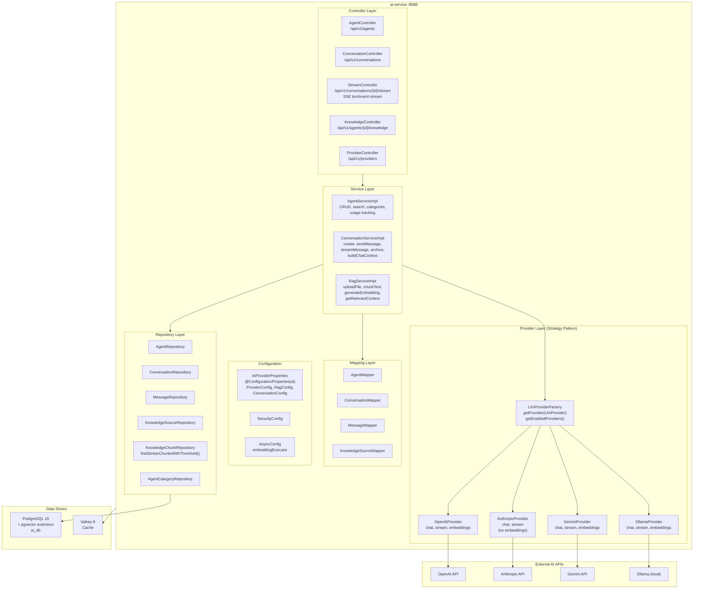
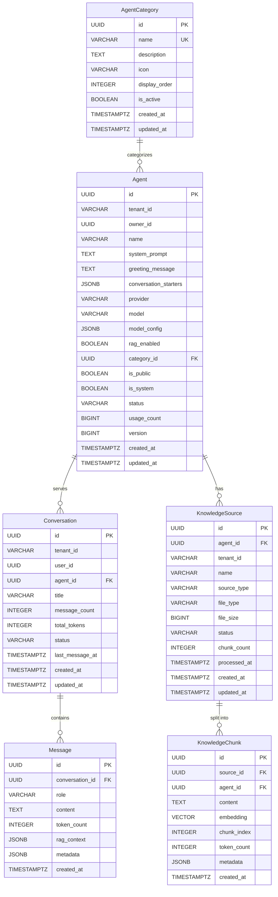
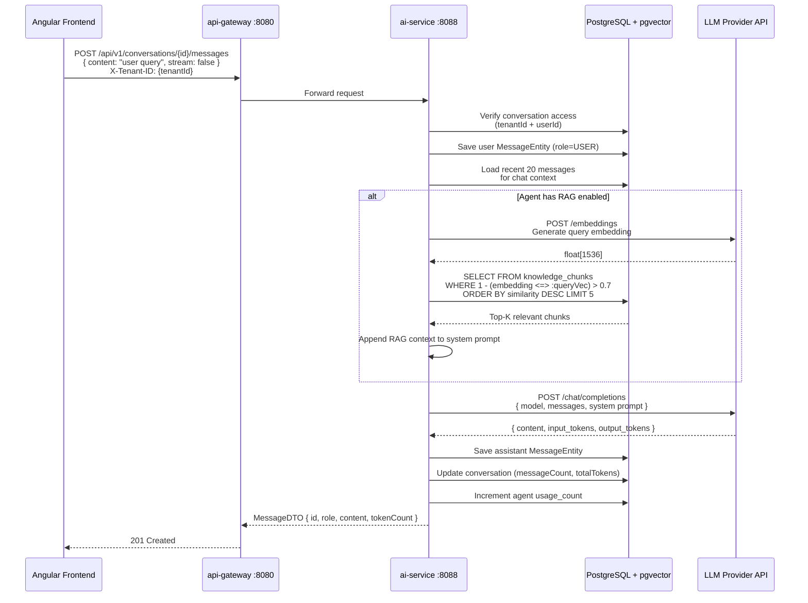
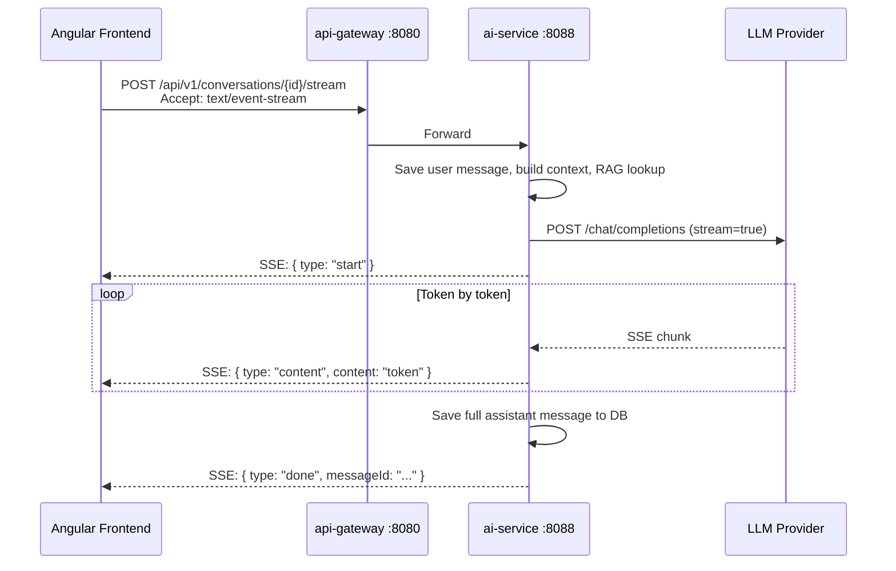
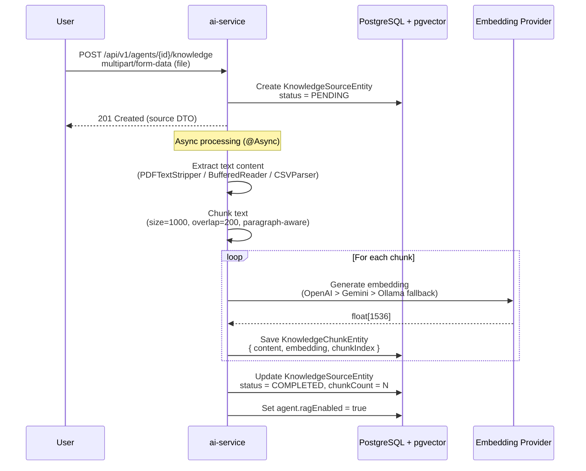

# ABB-008: AI/RAG Pipeline

## 1. Document Control

| Field | Value |
|-------|-------|
| ABB ID | ABB-008 |
| Name | AI/RAG Pipeline |
| Domain | Application |
| Status | [IMPLEMENTED] -- Multi-provider inference, RAG pipeline, conversation management, streaming; [IN-PROGRESS] -- token billing, advanced analytics |
| Owner | Platform Team |
| Last Updated | 2026-03-08 |
| Realized By | SBB-008: ai-service (port 8088) + PostgreSQL 16 + pgvector + Valkey 8 |
| Related ADRs | [ADR-002](../../../Architecture/09-architecture-decisions.md#921-spring-boot-341-with-java-23-adr-002) (Spring Boot 3.4), [ADR-016](../../../Architecture/09-architecture-decisions.md#911-polyglot-persistence-adr-001-adr-016) (Polyglot Persistence) |
| Arc42 Section | [04-application-architecture.md](../../04-application-architecture.md) Section 2, [08-crosscutting.md](../../../Architecture/08-crosscutting.md) |

## 2. Purpose and Scope

The AI/RAG Pipeline building block provides a multi-provider AI inference abstraction layer with retrieval-augmented generation (RAG) capabilities. It enables tenants to create custom AI agents backed by configurable LLM providers, attach knowledge bases for context-augmented responses, and manage conversational interactions with streaming support.

**In scope (implemented):**
- Multi-provider LLM abstraction (OpenAI, Anthropic, Gemini, Ollama) [IMPLEMENTED]
- Provider adapter/strategy pattern via `LlmProviderService` interface [IMPLEMENTED]
- Agent CRUD with tenant-scoped ownership and access control [IMPLEMENTED]
- Conversation lifecycle (create, send message, archive, delete) [IMPLEMENTED]
- Message persistence with token counting and RAG context [IMPLEMENTED]
- RAG pipeline: file upload, text chunking, vector embedding (pgvector), similarity search, context injection [IMPLEMENTED]
- SSE streaming responses via WebFlux `Flux<StreamChunkDTO>` [IMPLEMENTED]
- Knowledge source management (file upload: PDF/TXT/MD/CSV, text sources) [IMPLEMENTED]
- HNSW vector index for cosine similarity search [IMPLEMENTED]
- Agent categories for organization [IMPLEMENTED]
- Agent usage tracking (usage_count increment) [IMPLEMENTED]
- Async processing for knowledge source ingestion [IMPLEMENTED]

**In scope (planned):**
- Per-tenant token usage billing and quota enforcement [PLANNED]
- Advanced conversation analytics [PLANNED]
- Agent templates and cloning [PLANNED]
- Multi-modal input support (images) [PLANNED]
- Prompt injection defense [PLANNED]
- PII sanitization pipeline [PLANNED]
- Agent maturity model and publishing workflow [PLANNED]

**Out of scope:**
- Model fine-tuning
- Direct GPU/model hosting (delegates to external APIs or local Ollama)
- Frontend AI chat components (handled by Angular frontend)

## 3. Functional Requirements

| ID | Description | Priority | Status |
|----|-------------|----------|--------|
| FR-AI-001 | Multi-provider LLM inference with strategy pattern | HIGH | [IMPLEMENTED] -- `LlmProviderService` interface + `LlmProviderFactory` with 4 providers: `OpenAiProvider`, `AnthropicProvider`, `GeminiProvider`, `OllamaProvider` |
| FR-AI-002 | Provider health check and availability listing | HIGH | [IMPLEMENTED] -- `LlmProviderFactory.getEnabledProviders()`, `isProviderEnabled()` |
| FR-AI-003 | Agent CRUD with tenant-scoped access control | HIGH | [IMPLEMENTED] -- `AgentController` with full CRUD, `AgentServiceImpl` with owner/tenant validation |
| FR-AI-004 | Agent search and discovery (public, system, by category) | HIGH | [IMPLEMENTED] -- `AgentController.searchAgents()`, `getAccessibleAgents()`, `getAgentsByCategory()` |
| FR-AI-005 | Conversation lifecycle management | HIGH | [IMPLEMENTED] -- `ConversationController` with create, get, list, archive, delete, update title |
| FR-AI-006 | Message send with synchronous LLM response | HIGH | [IMPLEMENTED] -- `ConversationServiceImpl.sendMessage()` with full chat context building |
| FR-AI-007 | SSE streaming responses | HIGH | [IMPLEMENTED] -- `StreamController` produces `text/event-stream`, `ConversationServiceImpl.streamMessage()` via `Flux.concat()` |
| FR-AI-008 | RAG: Knowledge source file upload (PDF, TXT, MD, CSV) | HIGH | [IMPLEMENTED] -- `RagServiceImpl.uploadFile()` with `PDFTextStripper`, text/CSV extraction |
| FR-AI-009 | RAG: Text chunking with configurable size and overlap | HIGH | [IMPLEMENTED] -- `RagServiceImpl.chunkText()` with paragraph-aware chunking, `ai.rag.chunk-size=1000`, `chunk-overlap=200` |
| FR-AI-010 | RAG: Vector embedding generation via provider fallback chain | HIGH | [IMPLEMENTED] -- `RagServiceImpl.generateEmbedding()` tries OpenAI, then Gemini, then Ollama |
| FR-AI-011 | RAG: Similarity search with HNSW cosine index | HIGH | [IMPLEMENTED] -- `KnowledgeChunkRepository.findSimilarChunksWithThreshold()` + `idx_knowledge_chunks_embedding USING hnsw` |
| FR-AI-012 | RAG: Context injection into system prompt | HIGH | [IMPLEMENTED] -- `ConversationServiceImpl.sendMessage()` appends RAG context to `systemPrompt` when `ragEnabled=true` |
| FR-AI-013 | Knowledge source deletion with cascade | MEDIUM | [IMPLEMENTED] -- `RagServiceImpl.deleteKnowledgeSource()` deletes chunks then source |
| FR-AI-014 | Agent usage count tracking | MEDIUM | [IMPLEMENTED] -- `AgentServiceImpl.incrementUsage()` increments `usage_count` |
| FR-AI-015 | Conversation auto-title generation | LOW | [IMPLEMENTED] -- `ConversationServiceImpl.generateTitle()` uses first 50 chars of initial message |
| FR-AI-016 | Agent categories with display ordering | MEDIUM | [IMPLEMENTED] -- `AgentCategoryEntity` with seed data (V2 migration) |
| FR-AI-017 | Text-based knowledge source addition | MEDIUM | [IMPLEMENTED] -- `RagServiceImpl.addTextSource()` processes inline text |
| FR-AI-018 | Knowledge source reprocessing | LOW | [IMPLEMENTED] -- `KnowledgeController.reprocessKnowledgeSource()` (API exists, direct processing has TODO) |
| FR-AI-019 | Per-tenant token usage billing and quotas | MEDIUM | [PLANNED] -- `agent_usage_stats` table exists but no billing/quota logic |
| FR-AI-020 | Prompt injection defense | HIGH | [PLANNED] -- No input sanitization pipeline |
| FR-AI-021 | PII detection and sanitization | MEDIUM | [PLANNED] -- No PII scanner |

## 4. Interfaces

### 4.1 Provided Interfaces (APIs Exposed)

| Endpoint | Method | Description | Auth | Status |
|----------|--------|-------------|------|--------|
| `/api/v1/agents` | POST | Create a new agent | JWT + `X-Tenant-ID` | [IMPLEMENTED] |
| `/api/v1/agents/{id}` | GET | Get agent by ID | JWT + `X-Tenant-ID` | [IMPLEMENTED] |
| `/api/v1/agents/{id}` | PUT | Update an agent | JWT + `X-Tenant-ID` | [IMPLEMENTED] |
| `/api/v1/agents/{id}` | DELETE | Delete an agent (soft delete) | JWT + `X-Tenant-ID` | [IMPLEMENTED] |
| `/api/v1/agents/my` | GET | Get current user's agents | JWT + `X-Tenant-ID` | [IMPLEMENTED] |
| `/api/v1/agents` | GET | Get all accessible agents (paginated) | JWT + `X-Tenant-ID` | [IMPLEMENTED] |
| `/api/v1/agents/search` | GET | Search agents by query | JWT + `X-Tenant-ID` | [IMPLEMENTED] |
| `/api/v1/agents/category/{categoryId}` | GET | Get agents by category | JWT | [IMPLEMENTED] |
| `/api/v1/agents/categories` | GET | Get all agent categories | JWT | [IMPLEMENTED] |
| `/api/v1/conversations` | POST | Create a new conversation | JWT + `X-Tenant-ID` | [IMPLEMENTED] |
| `/api/v1/conversations/{id}` | GET | Get conversation by ID | JWT + `X-Tenant-ID` | [IMPLEMENTED] |
| `/api/v1/conversations` | GET | List user conversations (paginated) | JWT + `X-Tenant-ID` | [IMPLEMENTED] |
| `/api/v1/conversations/recent` | GET | Get recent conversations (top 10) | JWT + `X-Tenant-ID` | [IMPLEMENTED] |
| `/api/v1/conversations/{id}/archive` | POST | Archive a conversation | JWT + `X-Tenant-ID` | [IMPLEMENTED] |
| `/api/v1/conversations/{id}` | DELETE | Delete a conversation (soft delete) | JWT + `X-Tenant-ID` | [IMPLEMENTED] |
| `/api/v1/conversations/{id}/title` | PATCH | Update conversation title | JWT + `X-Tenant-ID` | [IMPLEMENTED] |
| `/api/v1/conversations/{id}/messages` | GET | Get messages (paginated) | JWT + `X-Tenant-ID` | [IMPLEMENTED] |
| `/api/v1/conversations/{id}/messages` | POST | Send message (sync response) | JWT + `X-Tenant-ID` | [IMPLEMENTED] |
| `/api/v1/conversations/{id}/stream` | POST | Send message (SSE streaming) | JWT + `X-Tenant-ID` | [IMPLEMENTED] |
| `/api/v1/providers` | GET | List available providers | JWT | [IMPLEMENTED] |
| `/api/v1/providers/enabled` | GET | List enabled providers | JWT | [IMPLEMENTED] |
| `/api/v1/agents/{agentId}/knowledge` | POST | Upload file as knowledge source | JWT + `X-Tenant-ID` | [IMPLEMENTED] |
| `/api/v1/agents/{agentId}/knowledge/text` | POST | Add text knowledge source | JWT + `X-Tenant-ID` | [IMPLEMENTED] |
| `/api/v1/agents/{agentId}/knowledge` | GET | List knowledge sources | JWT | [IMPLEMENTED] |
| `/api/v1/agents/{agentId}/knowledge/{sourceId}` | DELETE | Delete knowledge source | JWT + `X-Tenant-ID` | [IMPLEMENTED] |
| `/api/v1/agents/{agentId}/knowledge/{sourceId}/reprocess` | POST | Reprocess knowledge source | JWT | [IMPLEMENTED] |

**Evidence:** All endpoints verified in `backend/ai-service/src/main/java/com/ems/ai/controller/` (5 controller classes: `AgentController.java`, `ConversationController.java`, `StreamController.java`, `KnowledgeController.java`, `ProviderController.java`)

### 4.2 Required Interfaces (Dependencies Consumed)

| Interface | Provider | Description | Status |
|-----------|----------|-------------|--------|
| PostgreSQL + pgvector | PostgreSQL 16 | Agent/conversation/message persistence + vector similarity search | [IMPLEMENTED] -- `CREATE EXTENSION vector` in V1 migration |
| Valkey 8 | Valkey | Distributed cache | [IMPLEMENTED] -- `spring.data.redis` configured in application.yml lines 38-42 |
| OpenAI API | `https://api.openai.com/v1` | Chat completions + embeddings (text-embedding-3-small) | [IMPLEMENTED] -- `OpenAiProvider.java` |
| Anthropic API | `https://api.anthropic.com` | Chat completions (no embeddings) | [IMPLEMENTED] -- `AnthropicProvider.java`, API version `2023-06-01` |
| Google Gemini API | `https://generativelanguage.googleapis.com/v1beta` | Chat completions + embeddings (text-embedding-004) | [IMPLEMENTED] -- `GeminiProvider.java`, disabled by default |
| Ollama API | `http://localhost:11434` | Chat completions + embeddings (nomic-embed-text) | [IMPLEMENTED] -- `OllamaProvider.java`, disabled by default |
| Keycloak JWKS | Keycloak 24 | JWT validation | [IMPLEMENTED] |
| Eureka service registry | eureka-server | Service registration | [IMPLEMENTED] |
| Kafka | Kafka (Confluent) | Event publishing/consumption (config exists, not actively used) | [IN-PROGRESS] -- consumer config in application.yml, no KafkaTemplate usage |

## 5. Internal Component Design

## 6. Data Model

### 6.1 Entity-Relationship Diagram

### 6.2 Entity Details

#### AgentEntity

**Table:** `agents`
**Indexes:** `idx_agents_tenant`, `idx_agents_owner`, `idx_agents_category`, `idx_agents_public`, `idx_agents_system`, `idx_agents_status`
**Constraints:** `chk_agent_provider` (OPENAI, ANTHROPIC, GEMINI, OLLAMA), `chk_agent_status` (ACTIVE, INACTIVE, DELETED)
**Evidence:** `backend/ai-service/src/main/java/com/ems/ai/entity/AgentEntity.java`

#### KnowledgeChunkEntity (pgvector)

**Table:** `knowledge_chunks`
**Vector Column:** `embedding vector(1536)` -- 1536-dimensional float vector for OpenAI text-embedding-3-small
**Index:** `idx_knowledge_chunks_embedding USING hnsw (embedding vector_cosine_ops)` -- HNSW index for approximate nearest neighbor search
**Evidence:** `backend/ai-service/src/main/resources/db/migration/V1__ai_agents.sql` lines 126-144

### 6.3 Flyway Migrations

| Version | File | Description | Status |
|---------|------|-------------|--------|
| V1 | `V1__ai_agents.sql` | Create all 6 tables: agent_categories, agents, conversations, messages, knowledge_sources, knowledge_chunks with pgvector extension + HNSW index + agent_usage_stats | [IMPLEMENTED] |
| V2 | `V2__seed_categories.sql` | Seed agent categories | [IMPLEMENTED] |
| V3 | `V3__add_version_column.sql` | Add `version` column for optimistic locking | [IMPLEMENTED] |

## 7. Integration Points

### 7.1 Chat Message Flow (Non-Streaming)

### 7.2 SSE Streaming Flow

### 7.3 Knowledge Source Ingestion Flow

## 8. Security Considerations

| Concern | Mechanism | Status |
|---------|-----------|--------|
| Authentication | JWT validation via Keycloak JWKS | [IMPLEMENTED] |
| Authorization | Role-based via `@AuthenticationPrincipal Jwt` | [IMPLEMENTED] |
| Tenant isolation | All queries scoped by `tenantId` from `X-Tenant-ID` header | [IMPLEMENTED] -- Agents, conversations, knowledge sources all filter by tenantId |
| Data ownership | Conversations/messages scoped by `userId` (from JWT subject) | [IMPLEMENTED] -- `conversationRepository.findByIdAndAccess(id, tenantId, userId)` |
| Agent access control | Agent owner check for mutations; public/system agents readable by tenant | [IMPLEMENTED] -- `AgentRepository.findAccessibleById()` |
| Knowledge source isolation | Tenant check on upload and delete | [IMPLEMENTED] -- `RagServiceImpl.uploadFile()` validates `agent.getTenantId().equals(tenantId)` |
| API key protection | Provider API keys via environment variables, not hardcoded | [IMPLEMENTED] -- `${OPENAI_API_KEY:}`, `${ANTHROPIC_API_KEY:}` in application.yml |
| File upload limits | 50MB max file size | [IMPLEMENTED] -- `spring.servlet.multipart.max-file-size: 50MB` |
| Prompt injection defense | No input sanitization | [PLANNED] -- Raw user input passes directly to LLM |
| PII detection | No PII scanner | [PLANNED] -- Uploaded documents may contain PII |
| Rate limiting | No rate limiting | [PLANNED] -- No per-tenant request throttling |
| Encryption at rest | Jasypt not configured | [PLANNED] -- API keys should be encrypted |

## 9. Configuration Model

| Property | Default | Source | Description |
|----------|---------|--------|-------------|
| `server.port` | 8088 | `application.yml` line 2 | Service port |
| `spring.datasource.url` | `jdbc:postgresql://localhost:5432/ems` | `application.yml` line 16 | PostgreSQL (no `sslmode` -- gap) |
| `spring.data.redis.host` | `localhost` | `application.yml` line 39 | Valkey host |
| `ai.providers.openai.enabled` | `true` | `application.yml` line 66 | OpenAI provider enabled |
| `ai.providers.openai.api-key` | env `OPENAI_API_KEY` | `application.yml` line 67 | OpenAI API key |
| `ai.providers.openai.default-model` | `gpt-4o` | `application.yml` line 68 | Default OpenAI model |
| `ai.providers.openai.embedding-model` | `text-embedding-3-small` | `application.yml` line 69 | Embedding model |
| `ai.providers.anthropic.enabled` | `true` | `application.yml` line 73 | Anthropic provider enabled |
| `ai.providers.anthropic.default-model` | `claude-sonnet-4-20250514` | `application.yml` line 75 | Default Anthropic model |
| `ai.providers.gemini.enabled` | `false` | `application.yml` line 80 | Gemini disabled by default |
| `ai.providers.ollama.enabled` | `false` | `application.yml` line 86 | Ollama disabled by default |
| `ai.rag.chunk-size` | `1000` | `application.yml` line 94 | Characters per text chunk |
| `ai.rag.chunk-overlap` | `200` | `application.yml` line 95 | Overlap between chunks |
| `ai.rag.max-chunks-per-query` | `5` | `application.yml` line 96 | Top-K chunks for RAG context |
| `ai.rag.similarity-threshold` | `0.7` | `application.yml` line 97 | Minimum cosine similarity |
| `ai.rag.embedding-dimension` | `1536` | `application.yml` line 98 | Vector dimension (OpenAI standard) |
| `ai.conversation.max-context-messages` | `20` | `application.yml` line 101 | Max messages in chat context |

**Evidence:** All properties verified in `backend/ai-service/src/main/resources/application.yml`

## 10. Performance and Scalability

| Concern | Current State | Target |
|---------|---------------|--------|
| Embedding generation | Synchronous per-chunk, fallback chain (OpenAI > Gemini > Ollama) | Batch embedding API calls for multiple chunks |
| Vector search | HNSW index with cosine distance, threshold 0.7, limit 5 | Tunable `ef_construction` and `m` parameters for HNSW |
| Chat context | Last 20 messages loaded per request | Cache recent messages in Valkey for repeat queries |
| Streaming | WebFlux `Flux<StreamChunkDTO>` via SSE | Back-pressure handling, connection timeout management |
| File processing | `@Async("embeddingExecutor")` thread pool | Configurable pool size, progress tracking |
| Database connections | Standard HikariCP pool | Pool sizing for concurrent conversation load |
| Multi-provider | Sequential calls to single selected provider | Provider health monitoring, automatic failover |
| Knowledge ingestion | In-process text extraction (PDFBox, CSV) | Dedicated ingestion worker with job queue |

**Known gap:** The `spring.datasource.url` in `application.yml` does not include `sslmode=verify-full`. This is documented in [arc42/08-crosscutting.md](../../../Architecture/08-crosscutting.md) Section 8.14 as a planned fix.

## 11. Implementation Status

| Component | File Path | Status |
|-----------|-----------|--------|
| Application entry | `backend/ai-service/src/main/java/com/ems/ai/AiServiceApplication.java` | [IMPLEMENTED] |
| AiProviderProperties | `backend/ai-service/src/main/java/com/ems/ai/config/AiProviderProperties.java` | [IMPLEMENTED] |
| SecurityConfig | `backend/ai-service/src/main/java/com/ems/ai/config/SecurityConfig.java` | [IMPLEMENTED] |
| AsyncConfig | `backend/ai-service/src/main/java/com/ems/ai/config/AsyncConfig.java` | [IMPLEMENTED] |
| WebFluxConfig | `backend/ai-service/src/main/java/com/ems/ai/config/WebFluxConfig.java` | [IMPLEMENTED] |
| LlmProviderService (interface) | `backend/ai-service/src/main/java/com/ems/ai/provider/LlmProviderService.java` | [IMPLEMENTED] |
| LlmProviderFactory | `backend/ai-service/src/main/java/com/ems/ai/provider/LlmProviderFactory.java` | [IMPLEMENTED] |
| OpenAiProvider | `backend/ai-service/src/main/java/com/ems/ai/provider/OpenAiProvider.java` | [IMPLEMENTED] |
| AnthropicProvider | `backend/ai-service/src/main/java/com/ems/ai/provider/AnthropicProvider.java` | [IMPLEMENTED] |
| GeminiProvider | `backend/ai-service/src/main/java/com/ems/ai/provider/GeminiProvider.java` | [IMPLEMENTED] |
| OllamaProvider | `backend/ai-service/src/main/java/com/ems/ai/provider/OllamaProvider.java` | [IMPLEMENTED] |
| AgentEntity | `backend/ai-service/src/main/java/com/ems/ai/entity/AgentEntity.java` | [IMPLEMENTED] |
| ConversationEntity | `backend/ai-service/src/main/java/com/ems/ai/entity/ConversationEntity.java` | [IMPLEMENTED] |
| MessageEntity | `backend/ai-service/src/main/java/com/ems/ai/entity/MessageEntity.java` | [IMPLEMENTED] |
| KnowledgeSourceEntity | `backend/ai-service/src/main/java/com/ems/ai/entity/KnowledgeSourceEntity.java` | [IMPLEMENTED] |
| KnowledgeChunkEntity | `backend/ai-service/src/main/java/com/ems/ai/entity/KnowledgeChunkEntity.java` | [IMPLEMENTED] |
| AgentCategoryEntity | `backend/ai-service/src/main/java/com/ems/ai/entity/AgentCategoryEntity.java` | [IMPLEMENTED] |
| AgentController | `backend/ai-service/src/main/java/com/ems/ai/controller/AgentController.java` | [IMPLEMENTED] |
| ConversationController | `backend/ai-service/src/main/java/com/ems/ai/controller/ConversationController.java` | [IMPLEMENTED] |
| StreamController | `backend/ai-service/src/main/java/com/ems/ai/controller/StreamController.java` | [IMPLEMENTED] |
| KnowledgeController | `backend/ai-service/src/main/java/com/ems/ai/controller/KnowledgeController.java` | [IMPLEMENTED] |
| ProviderController | `backend/ai-service/src/main/java/com/ems/ai/controller/ProviderController.java` | [IMPLEMENTED] |
| AgentServiceImpl | `backend/ai-service/src/main/java/com/ems/ai/service/AgentServiceImpl.java` | [IMPLEMENTED] |
| ConversationServiceImpl | `backend/ai-service/src/main/java/com/ems/ai/service/ConversationServiceImpl.java` | [IMPLEMENTED] |
| RagServiceImpl | `backend/ai-service/src/main/java/com/ems/ai/service/RagServiceImpl.java` | [IMPLEMENTED] |
| 6 Repository interfaces | `backend/ai-service/src/main/java/com/ems/ai/repository/` | [IMPLEMENTED] |
| 4 Mapper classes | `backend/ai-service/src/main/java/com/ems/ai/mapper/` | [IMPLEMENTED] |
| 8+ DTO records | `backend/ai-service/src/main/java/com/ems/ai/dto/` | [IMPLEMENTED] |
| V1 Migration (pgvector) | `backend/ai-service/src/main/resources/db/migration/V1__ai_agents.sql` | [IMPLEMENTED] |
| V2 Seed Categories | `backend/ai-service/src/main/resources/db/migration/V2__seed_categories.sql` | [IMPLEMENTED] |
| V3 Version Column | `backend/ai-service/src/main/resources/db/migration/V3__add_version_column.sql` | [IMPLEMENTED] |

## 12. Gap Analysis

| Area | Current State | Target State | Gap | Priority |
|------|---------------|--------------|-----|----------|
| PostgreSQL SSL | No `sslmode` in JDBC URL | `sslmode=verify-full` | Add `?sslmode=verify-full` to `spring.datasource.url` | HIGH |
| Prompt injection | Raw user input to LLM | Input sanitization pipeline | Add prompt injection defense layer before LLM calls | HIGH |
| PII sanitization | No PII scanning | Detect and redact PII from knowledge sources | Add PII scanner during ingestion + output filtering | MEDIUM |
| Token billing | `agent_usage_stats` table exists, no billing logic | Per-tenant token quota enforcement | Build quota check in `ConversationServiceImpl.sendMessage()` | MEDIUM |
| Rate limiting | No request throttling | Per-tenant/per-user rate limits | Add Spring Cloud Gateway rate limiter or custom filter | MEDIUM |
| Jasypt encryption | API keys stored as plaintext env vars | Encrypted sensitive config | Add JasyptConfig like auth-facade | MEDIUM |
| DOCX support | `FileType.DOCX` declared in enum | DOCX text extraction | Add Apache POI dependency for `.docx` parsing | LOW |
| URL knowledge source | `SourceType.URL` declared in enum | Web page scraping and ingestion | Add URL content fetcher | LOW |
| Agent templates | No template system | Clonable agent templates for rapid creation | Add AgentTemplate entity and clone API | LOW |
| Conversation export | No export API | Export conversation history as JSON/PDF | Add export endpoint | LOW |

## 13. Dependencies

### Upstream Dependencies (Consumed)

| Dependency | Type | Status |
|------------|------|--------|
| PostgreSQL 16 + pgvector | Data store + vector search | [IMPLEMENTED] |
| Valkey 8 | Distributed cache | [IMPLEMENTED] |
| OpenAI API | LLM + embedding provider | [IMPLEMENTED] |
| Anthropic API | LLM provider (no embeddings) | [IMPLEMENTED] |
| Google Gemini API | LLM + embedding provider | [IMPLEMENTED] (disabled by default) |
| Ollama (local) | LLM + embedding provider | [IMPLEMENTED] (disabled by default) |
| Keycloak 24 (JWKS) | Identity provider | [IMPLEMENTED] |
| Eureka service registry | Service discovery | [IMPLEMENTED] |
| Kafka | Event bus | [IN-PROGRESS] -- config exists, no active usage |

### Downstream Dependents (Consumers)

| Consumer | Dependency Type | Status |
|----------|----------------|--------|
| Angular frontend (AI chat UI) | REST API + SSE consumer | [IMPLEMENTED] |
| process-service (decision support) | REST API consumer | [PLANNED] |
| audit-service (AI usage audit) | Event consumer | [PLANNED] |

### Technology Dependencies

| Technology | Version | Purpose | Evidence |
|------------|---------|---------|----------|
| Spring Boot | 3.4.1 | Application framework | `backend/ai-service/pom.xml` |
| Spring WebFlux | -- | SSE streaming support | `StreamController.java` returns `Flux<>` |
| Spring Data JPA + Hibernate | -- | PostgreSQL data access | Entity annotations |
| pgvector (Hibernate extension) | -- | Vector similarity search | `@Array(length = 1536)` on `embedding` field |
| Apache PDFBox | -- | PDF text extraction | `RagServiceImpl.extractPdfContent()` |
| Apache Commons CSV | -- | CSV parsing | `RagServiceImpl.extractCsvContent()` |
| Flyway | -- | Schema migrations | `application.yml` flyway config |
| Lombok | -- | Boilerplate reduction | Entity/DTO annotations |
| SpringDoc OpenAPI | -- | API documentation | `application.yml` springdoc config |

---

**Previous ABB:** [ABB-007: Process Orchestration](./ABB-007-process-orchestration.md)
**Next ABB:** [ABB-009: Multi-Channel Notification Delivery](./ABB-009-notification-delivery.md)
