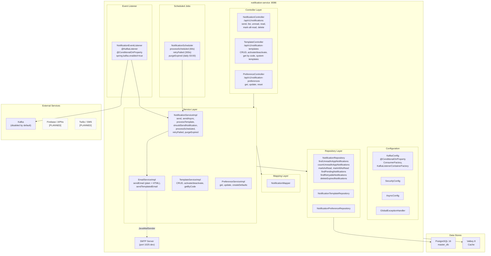
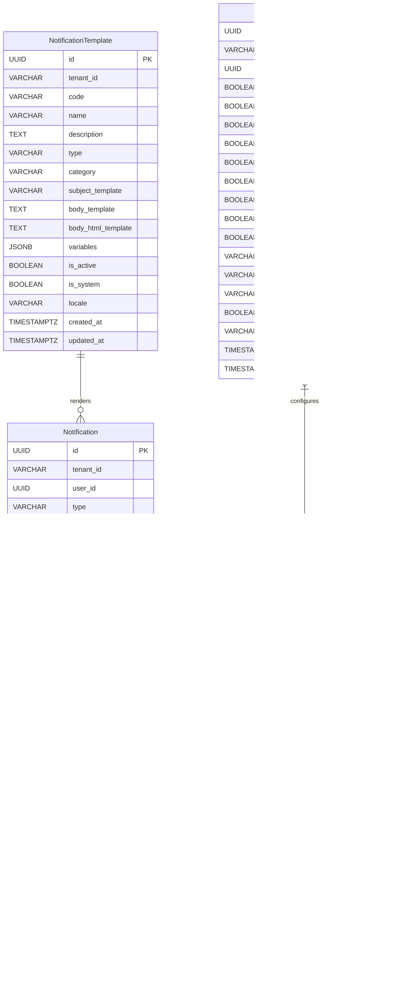
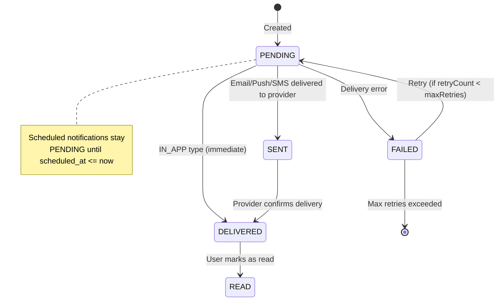
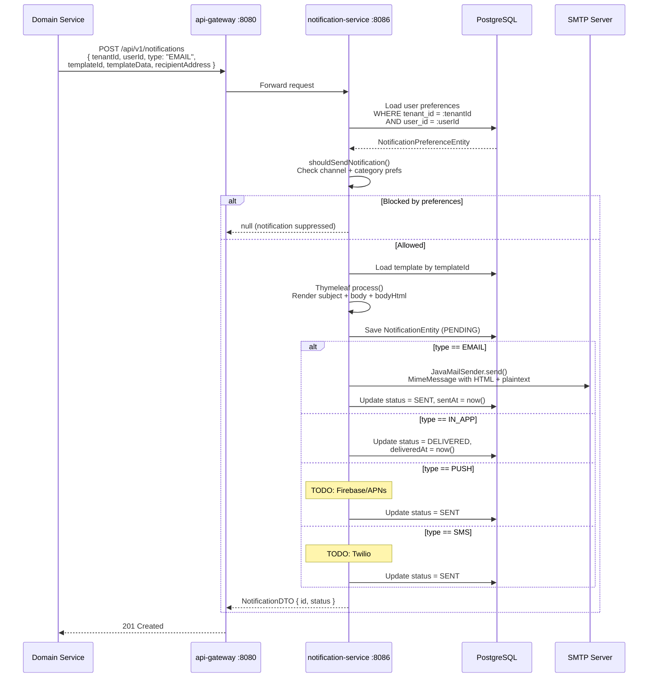
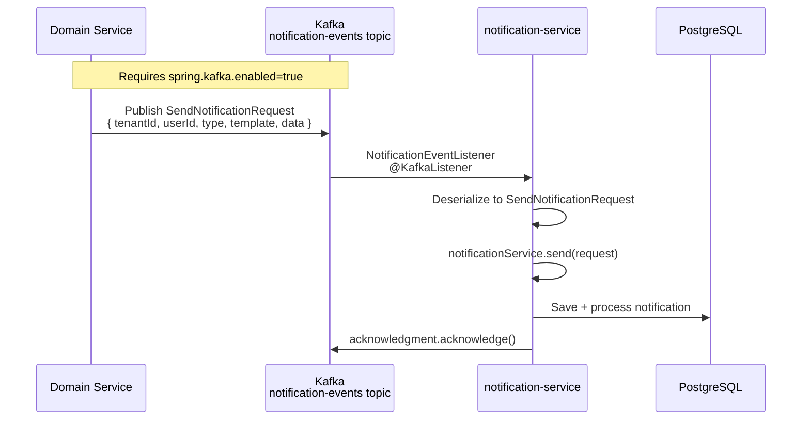
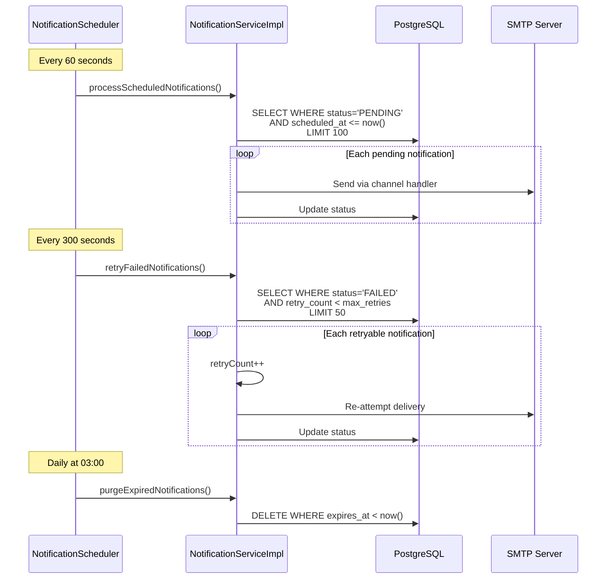

# ABB-009: Multi-Channel Notification Delivery

## 1. Document Control

| Field | Value |
|-------|-------|
| ABB ID | ABB-009 |
| Name | Multi-Channel Notification Delivery |
| Domain | Application |
| Status | [IMPLEMENTED] -- Email (SMTP), in-app, template engine, preferences, scheduling, retry; [IN-PROGRESS] -- Kafka consumer; [PLANNED] -- Push, SMS |
| Owner | Platform Team |
| Last Updated | 2026-03-08 |
| Realized By | SBB-009: notification-service (port 8086) + PostgreSQL + Valkey 8 + Thymeleaf + JavaMailSender |
| Related ADRs | [ADR-002](../../../Architecture/09-architecture-decisions.md#921-spring-boot-341-with-java-23-adr-002) (Spring Boot 3.4), [ADR-016](../../../Architecture/09-architecture-decisions.md#911-polyglot-persistence-adr-001-adr-016) (Polyglot Persistence) |
| Arc42 Section | [04-application-architecture.md](../../04-application-architecture.md) Section 2, [08-crosscutting.md](../../../Architecture/08-crosscutting.md) Sections 8.5, 8.7 |

## 2. Purpose and Scope

The Multi-Channel Notification Delivery building block provides template-driven notification rendering, multi-channel delivery orchestration, tenant-scoped notification preferences, and notification lifecycle management (creation, delivery, retry, expiration, purge). It serves as the platform's central notification hub for all domain services.

**In scope (implemented):**
- Notification CRUD with tenant-scoped, user-scoped access [IMPLEMENTED]
- Template engine for notification rendering (Thymeleaf) [IMPLEMENTED]
- Template management (CRUD, system/tenant templates, activation/deactivation) [IMPLEMENTED]
- Email delivery via JavaMailSender (SMTP) with HTML and plain text support [IMPLEMENTED]
- In-app notification delivery (status-based: PENDING, DELIVERED, READ) [IMPLEMENTED]
- User notification preferences per channel and category [IMPLEMENTED]
- Preference-based delivery filtering (channel + category checks) [IMPLEMENTED]
- Scheduled notification processing (60-second interval) [IMPLEMENTED]
- Failed notification retry with configurable max retries (default 3) [IMPLEMENTED]
- Expired notification purge (daily at 03:00) [IMPLEMENTED]
- Unread notification count and mark-read operations [IMPLEMENTED]
- Bulk mark-all-as-read [IMPLEMENTED]
- Async notification sending [IMPLEMENTED]
- Notification priority levels (LOW, NORMAL, HIGH, URGENT) [IMPLEMENTED]
- Quiet hours support (preference model, enforcement pending) [IMPLEMENTED] (model only)
- Digest preferences (DAILY, WEEKLY - preference model) [IMPLEMENTED] (model only)
- Kafka consumer for async event ingestion (conditionally enabled) [IN-PROGRESS]
- System template seed data (WELCOME, PASSWORD_RESET, EMAIL_VERIFICATION, LOGIN_ALERT, LICENSE_EXPIRING) [IMPLEMENTED]
- Base HTML email template with responsive design [IMPLEMENTED]

**In scope (planned):**
- Push notification delivery (Firebase/APNs) [PLANNED]
- SMS delivery (Twilio or similar) [PLANNED]
- Quiet hours enforcement logic [PLANNED]
- Digest aggregation and delivery [PLANNED]
- Notification analytics [PLANNED]
- Audit trail integration [PLANNED]
- Bulk notification sending API [PLANNED]
- WebSocket real-time delivery for in-app notifications [PLANNED]

**Out of scope:**
- Marketing automation campaigns
- Email list management
- Newsletter management
- Notification content creation (handled by domain services)

## 3. Functional Requirements

| ID | Description | Priority | Status |
|----|-------------|----------|--------|
| FR-NOT-001 | Send notification with template rendering and channel routing | HIGH | [IMPLEMENTED] -- `NotificationServiceImpl.send()` processes template, checks preferences, routes to channel handler |
| FR-NOT-002 | Email delivery via SMTP with HTML + plaintext multipart | HIGH | [IMPLEMENTED] -- `EmailServiceImpl.sendHtmlEmail()` using `MimeMessageHelper`, `JavaMailSender` |
| FR-NOT-003 | In-app notification delivery with read/unread tracking | HIGH | [IMPLEMENTED] -- `markAsDelivered()` for IN_APP type, `markAsRead()` + `markAllAsRead()` |
| FR-NOT-004 | Template management (CRUD, system/tenant, activation) | HIGH | [IMPLEMENTED] -- `TemplateController` with create, update, delete, activate, deactivate, get by code |
| FR-NOT-005 | Thymeleaf template rendering with variable substitution | HIGH | [IMPLEMENTED] -- `NotificationServiceImpl.processTemplate()` using `SpringTemplateEngine.process()` |
| FR-NOT-006 | User notification preferences per channel and category | HIGH | [IMPLEMENTED] -- `NotificationPreferenceEntity` with per-channel (email, push, sms, in_app) and per-category (system, marketing, transactional, alert) booleans |
| FR-NOT-007 | Preference-based delivery filtering | HIGH | [IMPLEMENTED] -- `NotificationServiceImpl.shouldSendNotification()` checks channel + category preferences |
| FR-NOT-008 | Scheduled notification processing | MEDIUM | [IMPLEMENTED] -- `NotificationScheduler.processScheduledNotifications()` every 60s |
| FR-NOT-009 | Failed notification retry with max retry count | MEDIUM | [IMPLEMENTED] -- `NotificationScheduler.retryFailedNotifications()` every 300s, max 3 retries |
| FR-NOT-010 | Expired notification purge | MEDIUM | [IMPLEMENTED] -- `NotificationScheduler.purgeExpiredNotifications()` daily at 03:00 |
| FR-NOT-011 | Unread notification count | HIGH | [IMPLEMENTED] -- `NotificationController.getUnreadCount()` via `notificationRepository.countUnreadInAppNotifications()` |
| FR-NOT-012 | Async notification sending | MEDIUM | [IMPLEMENTED] -- `NotificationController.sendNotificationAsync()` returns 202 Accepted |
| FR-NOT-013 | Notification priority levels | MEDIUM | [IMPLEMENTED] -- `priority` field: LOW, NORMAL, HIGH, URGENT |
| FR-NOT-014 | Kafka consumer for async event ingestion | MEDIUM | [IN-PROGRESS] -- `NotificationEventListener` with `@KafkaListener`, `@ConditionalOnProperty(spring.kafka.enabled=true)`, disabled by default |
| FR-NOT-015 | System template seed data | HIGH | [IMPLEMENTED] -- 5 templates seeded in V1 migration (WELCOME, PASSWORD_RESET, EMAIL_VERIFICATION, LOGIN_ALERT, LICENSE_EXPIRING) |
| FR-NOT-016 | Notification scheduling (future delivery) | MEDIUM | [IMPLEMENTED] -- `scheduled_at` field; `processScheduledNotifications()` picks up pending with `scheduled_at <= now` |
| FR-NOT-017 | Notification correlation ID | MEDIUM | [IMPLEMENTED] -- `correlation_id` field for cross-service event tracing |
| FR-NOT-018 | Push notification delivery (Firebase/APNs) | MEDIUM | [PLANNED] -- `sendPushNotification()` has TODO comment |
| FR-NOT-019 | SMS delivery (Twilio) | LOW | [PLANNED] -- `sendSms()` has TODO comment |
| FR-NOT-020 | Quiet hours enforcement | LOW | [PLANNED] -- Preference model exists, no enforcement logic |
| FR-NOT-021 | Digest aggregation and delivery | LOW | [PLANNED] -- Preference model exists, no aggregation logic |
| FR-NOT-022 | Templated email sending via template name | MEDIUM | [IMPLEMENTED] -- `EmailServiceImpl.sendTemplatedEmail()` processes Thymeleaf template by name |
| FR-NOT-023 | Notification action URL and label | MEDIUM | [IMPLEMENTED] -- `action_url` and `action_label` fields for call-to-action buttons |
| FR-NOT-024 | Notification expiration | MEDIUM | [IMPLEMENTED] -- `expires_at` field, default 72 hours, configurable via `expiresInHours` parameter |

## 4. Interfaces

### 4.1 Provided Interfaces (APIs Exposed)

| Endpoint | Method | Description | Auth | Status |
|----------|--------|-------------|------|--------|
| `/api/v1/notifications` | POST | Send a notification (sync) | JWT | [IMPLEMENTED] |
| `/api/v1/notifications/async` | POST | Send a notification (async, 202) | JWT | [IMPLEMENTED] |
| `/api/v1/notifications/{notificationId}` | GET | Get notification by ID | JWT | [IMPLEMENTED] |
| `/api/v1/notifications` | GET | List user notifications (paginated, filterable by type) | JWT + `X-Tenant-ID` | [IMPLEMENTED] |
| `/api/v1/notifications/unread` | GET | Get unread in-app notifications | JWT + `X-Tenant-ID` | [IMPLEMENTED] |
| `/api/v1/notifications/unread/count` | GET | Get unread notification count | JWT + `X-Tenant-ID` | [IMPLEMENTED] |
| `/api/v1/notifications/{notificationId}/read` | POST | Mark notification as read | JWT | [IMPLEMENTED] |
| `/api/v1/notifications/read-all` | POST | Mark all as read | JWT + `X-Tenant-ID` | [IMPLEMENTED] |
| `/api/v1/notifications/{notificationId}` | DELETE | Delete notification | JWT | [IMPLEMENTED] |
| `/api/v1/notification-templates` | POST | Create template | JWT | [IMPLEMENTED] |
| `/api/v1/notification-templates/{templateId}` | GET | Get template by ID | JWT | [IMPLEMENTED] |
| `/api/v1/notification-templates/code/{code}` | GET | Get template by code and type | JWT + `X-Tenant-ID` | [IMPLEMENTED] |
| `/api/v1/notification-templates` | GET | List tenant templates | JWT + `X-Tenant-ID` | [IMPLEMENTED] |
| `/api/v1/notification-templates/system` | GET | List system templates | JWT | [IMPLEMENTED] |
| `/api/v1/notification-templates/{templateId}` | PUT | Update template | JWT | [IMPLEMENTED] |
| `/api/v1/notification-templates/{templateId}` | DELETE | Delete template | JWT | [IMPLEMENTED] |
| `/api/v1/notification-templates/{templateId}/activate` | POST | Activate template | JWT | [IMPLEMENTED] |
| `/api/v1/notification-templates/{templateId}/deactivate` | POST | Deactivate template | JWT | [IMPLEMENTED] |
| `/api/v1/notification-preferences` | GET | Get user preferences | JWT + `X-Tenant-ID` | [IMPLEMENTED] |
| `/api/v1/notification-preferences` | PUT | Update user preferences | JWT + `X-Tenant-ID` | [IMPLEMENTED] |
| `/api/v1/notification-preferences/reset` | POST | Reset preferences to defaults | JWT + `X-Tenant-ID` | [IMPLEMENTED] |
| Kafka topic: `notification-events` | Consumer | Async event ingestion | Internal | [IN-PROGRESS] -- consumer exists, disabled by default (`spring.kafka.enabled=false`) |

**Evidence:** All endpoints verified in `backend/notification-service/src/main/java/com/ems/notification/controller/` (3 controller classes: `NotificationController.java`, `TemplateController.java`, `PreferenceController.java`)

### 4.2 Required Interfaces (Dependencies Consumed)

| Interface | Provider | Description | Status |
|-----------|----------|-------------|--------|
| PostgreSQL `master_db` | PostgreSQL 16 | Notification, template, preference persistence via JPA + Flyway | [IMPLEMENTED] -- `sslmode=verify-full` |
| Valkey 8 | Valkey | Distributed cache | [IMPLEMENTED] -- `spring.data.redis` configured |
| SMTP server | Mail server (port 1025 dev) | Email delivery | [IMPLEMENTED] -- JavaMailSender config in `application.yml` |
| Keycloak JWKS | Keycloak 24 | JWT validation | [IMPLEMENTED] |
| Eureka service registry | eureka-server | Service registration | [IMPLEMENTED] |
| Kafka `notification-events` topic | Kafka (Confluent) | Async event source (when enabled) | [IN-PROGRESS] -- consumer code exists, disabled by default |
| Thymeleaf template engine | Spring Thymeleaf | Template rendering | [IMPLEMENTED] -- `spring.thymeleaf` config, `SpringTemplateEngine` injected |

## 5. Internal Component Design

## 6. Data Model

### 6.1 Entity-Relationship Diagram

### 6.2 Entity Details

#### NotificationEntity

**Table:** `notifications`
**Indexes:** `idx_notification_tenant`, `idx_notification_user`, `idx_notification_status`, `idx_notification_type`, `idx_notification_created`, `idx_notification_scheduled`, `idx_notification_expires`, `idx_notification_tenant_user`, `idx_notification_correlation`
**Optimistic Locking:** `@Version` on `version` field
**Evidence:** `backend/notification-service/src/main/java/com/ems/notification/entity/NotificationEntity.java`

#### NotificationTemplateEntity

**Table:** `notification_templates`
**Indexes:** `idx_template_tenant`, `idx_template_code`, `idx_template_type`, `idx_template_active`
**Unique Constraint:** `(tenant_id, code, type)` -- ensures one template per code/type per tenant
**Evidence:** `backend/notification-service/src/main/java/com/ems/notification/entity/NotificationTemplateEntity.java`

#### NotificationPreferenceEntity

**Table:** `notification_preferences`
**Indexes:** `idx_pref_tenant_user`
**Unique Constraint:** `(tenant_id, user_id)` -- one preference record per user per tenant
**Evidence:** `backend/notification-service/src/main/java/com/ems/notification/entity/NotificationPreferenceEntity.java`

### 6.3 Notification State Machine

### 6.4 Flyway Migrations

| Version | File | Description | Status |
|---------|------|-------------|--------|
| V1 | `V1__notifications.sql` | Create `notification_templates`, `notifications`, `notification_preferences` tables + seed 5 system templates (WELCOME, PASSWORD_RESET, EMAIL_VERIFICATION, LOGIN_ALERT, LICENSE_EXPIRING) | [IMPLEMENTED] |
| V2 | `V2__add_version_column.sql` | Add `version` column for optimistic locking | [IMPLEMENTED] |

### 6.5 Seed Data (System Templates)

| Code | Type | Category | Subject | Variables |
|------|------|----------|---------|-----------|
| WELCOME | EMAIL | SYSTEM | Welcome to EMSIST, `[[${firstName}]]`! | firstName, email, tenantName |
| PASSWORD_RESET | EMAIL | TRANSACTIONAL | Reset Your EMSIST Password | firstName, resetLink, expiresIn |
| EMAIL_VERIFICATION | EMAIL | TRANSACTIONAL | Verify Your Email Address | firstName, verificationLink, expiresIn |
| LOGIN_ALERT | EMAIL | ALERT | New Login to Your EMSIST Account | firstName, deviceInfo, location, loginTime, secureAccountLink |
| LICENSE_EXPIRING | EMAIL | ALERT | Your EMSIST License is Expiring Soon | firstName, licenseName, expirationDate, renewLink |

**Evidence:** Seed data verified in `backend/notification-service/src/main/resources/db/migration/V1__notifications.sql` lines 119-150

## 7. Integration Points

### 7.1 Notification Send Flow

### 7.2 Kafka Event Ingestion (Planned Active Use)

### 7.3 Scheduled Processing

## 8. Security Considerations

| Concern | Mechanism | Status |
|---------|-----------|--------|
| Authentication | JWT validation via Keycloak JWKS | [IMPLEMENTED] |
| Authorization | JWT subject extraction for user-scoped operations | [IMPLEMENTED] -- `@AuthenticationPrincipal Jwt jwt` |
| Tenant isolation | `X-Tenant-ID` header required for user-scoped queries | [IMPLEMENTED] -- Controllers enforce `tenantId` parameter |
| User data isolation | Notifications scoped by `(tenant_id, user_id)` | [IMPLEMENTED] -- Repository queries filter by both |
| Template access control | System templates cannot be deleted (`is_system` flag) | [IMPLEMENTED] -- model has flag, enforcement in service |
| Email content security | Thymeleaf rendering (auto-escaping) | [IMPLEMENTED] -- Thymeleaf HTML mode |
| SMTP credentials | Externalized via environment variables | [IMPLEMENTED] -- `MAIL_USERNAME`, `MAIL_PASSWORD` |
| Kafka consumer auth | Manual acknowledgment (no auto-commit) | [IN-PROGRESS] -- `enable-auto-commit: false` |
| Recipient validation | Email address required for EMAIL type | [IMPLEMENTED] -- `sendEmail()` throws if recipient null |
| Notification expiration | Default 72-hour TTL with automated purge | [IMPLEMENTED] |

## 9. Configuration Model

| Property | Default | Source | Description |
|----------|---------|--------|-------------|
| `server.port` | 8086 | `application.yml` line 2 | Service port |
| `spring.datasource.url` | `jdbc:postgresql://localhost:5432/master_db?sslmode=verify-full` | `application.yml` line 16 | PostgreSQL with SSL |
| `spring.data.redis.host` | `localhost` | `application.yml` line 39 | Valkey host |
| `spring.mail.host` | `localhost` | `application.yml` line 43 | SMTP server host |
| `spring.mail.port` | `1025` | `application.yml` line 44 | SMTP port (MailHog/dev) |
| `spring.mail.from` | `noreply@ems.com` | `application.yml` line 48 | Sender address |
| `spring.kafka.enabled` | `false` | `application.yml` line 57 | Kafka consumer toggle |
| `notification.email.enabled` | `true` | `application.yml` line 82 | Email delivery toggle |
| `notification.kafka.topic` | `notification-events` | `application.yml` line 84 | Kafka topic name |
| `notification.scheduler.process-interval` | `60000` (1 min) | `application.yml` line 86 | Scheduled processing interval |
| `notification.scheduler.retry-interval` | `300000` (5 min) | `application.yml` line 87 | Failed retry interval |
| `notification.scheduler.purge-cron` | `0 0 3 * * ?` (daily 03:00) | `application.yml` line 88 | Expiration purge cron |
| `spring.thymeleaf.prefix` | `classpath:/templates/` | `application.yml` line 64 | Template directory |

**Evidence:** All properties verified in `backend/notification-service/src/main/resources/application.yml`

## 10. Performance and Scalability

| Concern | Current State | Target |
|---------|---------------|--------|
| Notification throughput | Synchronous processing, batched by scheduler (100/batch) | Kafka-driven async processing for high throughput |
| Email delivery | Single-threaded `@Async` via Spring executor | Dedicated mail sending thread pool with configurable size |
| Retry mechanism | Fixed 5-minute interval, max 3 retries | Exponential backoff with jitter |
| Purge efficiency | `DELETE WHERE expires_at < now()` in single query | Partitioned by date for faster purge |
| Template caching | No explicit caching | Thymeleaf template caching enabled (`cache: true`) |
| Notification listing | Paginated JPA queries with indexes | Composite indexes on `(tenant_id, user_id, status, created_at)` |
| Unread count | `COUNT(*)` query per request | Cache unread count in Valkey with event-driven invalidation |

## 11. Implementation Status

| Component | File Path | Status |
|-----------|-----------|--------|
| Application entry | `backend/notification-service/src/main/java/com/ems/notification/NotificationServiceApplication.java` | [IMPLEMENTED] |
| SecurityConfig | `backend/notification-service/src/main/java/com/ems/notification/config/SecurityConfig.java` | [IMPLEMENTED] |
| AsyncConfig | `backend/notification-service/src/main/java/com/ems/notification/config/AsyncConfig.java` | [IMPLEMENTED] |
| KafkaConfig | `backend/notification-service/src/main/java/com/ems/notification/config/KafkaConfig.java` | [IMPLEMENTED] (conditional) |
| GlobalExceptionHandler | `backend/notification-service/src/main/java/com/ems/notification/config/GlobalExceptionHandler.java` | [IMPLEMENTED] |
| NotificationEntity | `backend/notification-service/src/main/java/com/ems/notification/entity/NotificationEntity.java` | [IMPLEMENTED] |
| NotificationTemplateEntity | `backend/notification-service/src/main/java/com/ems/notification/entity/NotificationTemplateEntity.java` | [IMPLEMENTED] |
| NotificationPreferenceEntity | `backend/notification-service/src/main/java/com/ems/notification/entity/NotificationPreferenceEntity.java` | [IMPLEMENTED] |
| NotificationController | `backend/notification-service/src/main/java/com/ems/notification/controller/NotificationController.java` | [IMPLEMENTED] |
| TemplateController | `backend/notification-service/src/main/java/com/ems/notification/controller/TemplateController.java` | [IMPLEMENTED] |
| PreferenceController | `backend/notification-service/src/main/java/com/ems/notification/controller/PreferenceController.java` | [IMPLEMENTED] |
| NotificationService (interface) | `backend/notification-service/src/main/java/com/ems/notification/service/NotificationService.java` | [IMPLEMENTED] |
| NotificationServiceImpl | `backend/notification-service/src/main/java/com/ems/notification/service/NotificationServiceImpl.java` | [IMPLEMENTED] |
| EmailService (interface) | `backend/notification-service/src/main/java/com/ems/notification/service/EmailService.java` | [IMPLEMENTED] |
| EmailServiceImpl | `backend/notification-service/src/main/java/com/ems/notification/service/EmailServiceImpl.java` | [IMPLEMENTED] |
| TemplateService (interface) | `backend/notification-service/src/main/java/com/ems/notification/service/TemplateService.java` | [IMPLEMENTED] |
| TemplateServiceImpl | `backend/notification-service/src/main/java/com/ems/notification/service/TemplateServiceImpl.java` | [IMPLEMENTED] |
| PreferenceService (interface) | `backend/notification-service/src/main/java/com/ems/notification/service/PreferenceService.java` | [IMPLEMENTED] |
| PreferenceServiceImpl | `backend/notification-service/src/main/java/com/ems/notification/service/PreferenceServiceImpl.java` | [IMPLEMENTED] |
| NotificationEventListener | `backend/notification-service/src/main/java/com/ems/notification/listener/NotificationEventListener.java` | [IN-PROGRESS] (disabled by default) |
| NotificationScheduler | `backend/notification-service/src/main/java/com/ems/notification/scheduler/NotificationScheduler.java` | [IMPLEMENTED] |
| NotificationMapper | `backend/notification-service/src/main/java/com/ems/notification/mapper/NotificationMapper.java` | [IMPLEMENTED] |
| NotificationRepository | `backend/notification-service/src/main/java/com/ems/notification/repository/NotificationRepository.java` | [IMPLEMENTED] |
| NotificationTemplateRepository | `backend/notification-service/src/main/java/com/ems/notification/repository/NotificationTemplateRepository.java` | [IMPLEMENTED] |
| NotificationPreferenceRepository | `backend/notification-service/src/main/java/com/ems/notification/repository/NotificationPreferenceRepository.java` | [IMPLEMENTED] |
| DTOs (6 records) | `backend/notification-service/src/main/java/com/ems/notification/dto/` | [IMPLEMENTED] |
| V1 Migration + Seed | `backend/notification-service/src/main/resources/db/migration/V1__notifications.sql` | [IMPLEMENTED] |
| V2 Version Column | `backend/notification-service/src/main/resources/db/migration/V2__add_version_column.sql` | [IMPLEMENTED] |
| Base email template | `backend/notification-service/src/main/resources/templates/email/base.html` | [IMPLEMENTED] |

## 12. Gap Analysis

| Area | Current State | Target State | Gap | Priority |
|------|---------------|--------------|-----|----------|
| Push notifications | `sendPushNotification()` has TODO | Firebase Cloud Messaging / APNs integration | Implement FCM/APNs provider with device token management | MEDIUM |
| SMS notifications | `sendSms()` has TODO | Twilio or similar SMS provider integration | Add SMS provider client, phone number validation | LOW |
| Quiet hours | Preference model has `quiet_hours_enabled`, `quiet_hours_start`, `quiet_hours_end`, `timezone` | Suppress notifications during quiet hours | Add time-zone-aware quiet hours check in `shouldSendNotification()` | LOW |
| Digest delivery | Preference model has `digest_enabled`, `digest_frequency` | Aggregate notifications into daily/weekly digests | Build digest aggregation job, new email template | LOW |
| Kafka producers | No domain services publish to `notification-events` | Domain services publish notification events | Add KafkaTemplate to domain services (tenant-service, license-service, auth-facade) | MEDIUM |
| WebSocket | No real-time push | WebSocket/SSE for in-app notification push | Add WebSocket endpoint for real-time unread count and new notification events | MEDIUM |
| Audit integration | No audit event emission | Notification delivery events sent to audit-service | Add audit event publishing on send/fail/read | LOW |
| Bulk notifications | No bulk API | Send to multiple users in single request | Add bulk endpoint with pagination and rate limiting | LOW |
| Template versioning | Templates updated in place | Template version history with rollback | Add `version_number` and `revision_history` to templates | LOW |
| Notification preferences missing @Version | `NotificationPreferenceEntity` has no `@Version` | All entities should have optimistic locking | Add `@Version` field to `NotificationPreferenceEntity` | LOW |
| Template entity missing @Version | `NotificationTemplateEntity` has no `@Version` | All entities should have optimistic locking | Add `@Version` field to `NotificationTemplateEntity` | LOW |

## 13. Dependencies

### Upstream Dependencies (Consumed)

| Dependency | Type | Status |
|------------|------|--------|
| PostgreSQL 16 (`master_db`) | Data store | [IMPLEMENTED] -- `sslmode=verify-full` |
| Valkey 8 | Distributed cache | [IMPLEMENTED] |
| SMTP server | Email delivery | [IMPLEMENTED] -- port 1025 (dev), externalized config |
| Keycloak 24 (JWKS) | Identity provider | [IMPLEMENTED] |
| Eureka service registry | Service discovery | [IMPLEMENTED] |
| Kafka | Event bus (async ingestion) | [IN-PROGRESS] -- consumer exists, disabled by default |
| Firebase / APNs | Push notification delivery | [PLANNED] |
| Twilio / SMS provider | SMS delivery | [PLANNED] |

### Downstream Dependents (Consumers)

| Consumer | Dependency Type | Status |
|----------|----------------|--------|
| Angular frontend (notification bell/panel) | REST API consumer | [IMPLEMENTED] |
| auth-facade (login alerts, MFA notifications) | REST API producer | [PLANNED] |
| tenant-service (tenant provisioning notifications) | REST API producer | [PLANNED] |
| license-service (license expiry notifications) | REST API producer | [PLANNED] |
| process-service (task assignment notifications) | REST API producer | [PLANNED] |
| audit-service (notification delivery audit events) | Event consumer | [PLANNED] |

### Technology Dependencies

| Technology | Version | Purpose | Evidence |
|------------|---------|---------|----------|
| Spring Boot | 3.4.1 | Application framework | `backend/notification-service/pom.xml` |
| Spring Mail | -- | SMTP email delivery | `JavaMailSender`, `MimeMessageHelper` |
| Thymeleaf | -- | Template rendering engine | `SpringTemplateEngine`, `spring.thymeleaf` config |
| Spring Data JPA + Hibernate | -- | PostgreSQL data access | Entity annotations |
| Spring Kafka | -- | Kafka consumer (conditional) | `KafkaConfig.java`, `@KafkaListener` |
| Flyway | -- | Schema migrations | `application.yml` flyway config |
| Lombok | -- | Boilerplate reduction | Entity/DTO annotations |
| SpringDoc OpenAPI | -- | API documentation | `application.yml` springdoc config |
| ems-common | -- | Shared exception classes | `ResourceNotFoundException` import |

---

**Previous ABB:** [ABB-008: AI/RAG Pipeline](./ABB-008-ai-rag-pipeline.md)
**Next ABB:** [ABB-010: Encryption Infrastructure](./ABB-010-encryption-infrastructure.md)
