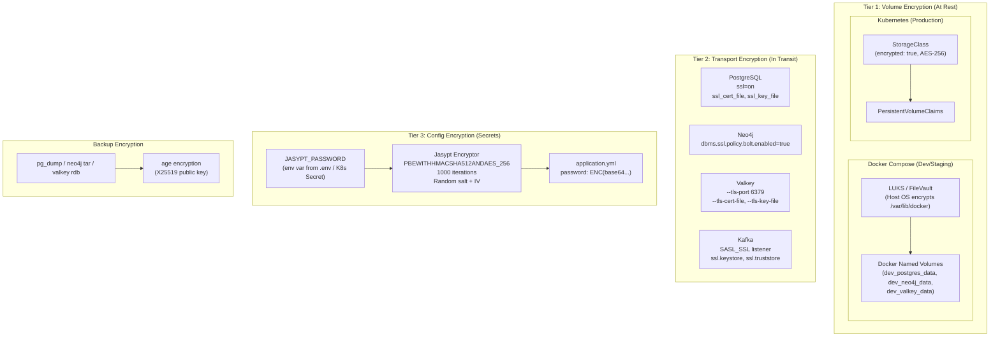
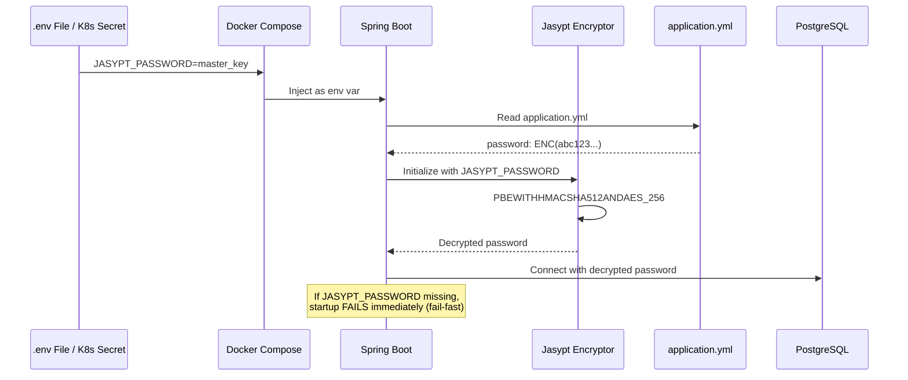
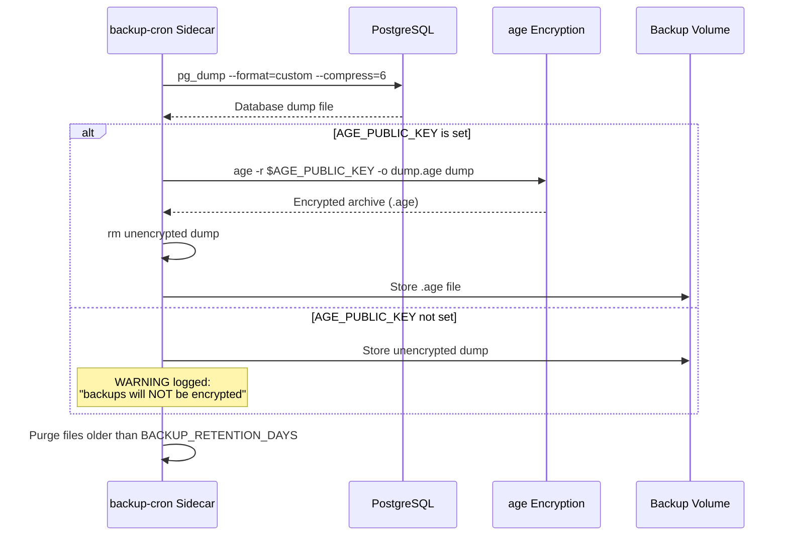
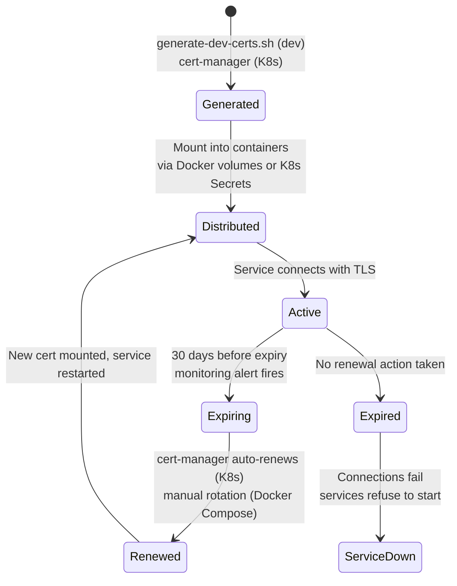

# ABB-010: Encryption Infrastructure

## 1. Document Control

| Field | Value |
|-------|-------|
| **ABB ID** | ABB-010 |
| **Name** | Encryption Infrastructure |
| **Domain** | Security |
| **Status** | In Progress |
| **Owner** | Architecture + Security |
| **Last Updated** | 2026-03-08 |
| **Realized By** | SBB-010: LUKS/FileVault + TLS 1.3 + Jasypt AES-256 |
| **Related ADRs** | [ADR-019](../../../Architecture/09-architecture-decisions.md#952-encryption-at-rest-strategy-adr-019), [ADR-022](../../../Architecture/09-architecture-decisions.md#951-production-parity-security-baseline-adr-022) |
| **Arc42 Sections** | [07-deployment-view](../../../Architecture/07-deployment-view.md), [08-crosscutting](../../../Architecture/08-crosscutting.md) |

## 2. Purpose and Scope

ABB-010 provides defense-in-depth encryption for the EMSIST platform through three independent tiers:

1. **Tier 1 -- Volume-Level Encryption (At Rest):** Encrypts the host filesystem underlying Docker volumes and Kubernetes PersistentVolumes so that all data stores (PostgreSQL, Neo4j, Valkey, Kafka) are protected against physical media theft, volume export, or backup file exposure.

2. **Tier 2 -- Transport-Level Encryption (In Transit):** Ensures all network connections between application services, data stores, and external clients use TLS 1.2+ (target TLS 1.3), preventing eavesdropping and man-in-the-middle attacks on the internal network.

3. **Tier 3 -- Configuration Encryption (Sensitive Properties):** Encrypts sensitive values in `application.yml` files (database passwords, API keys, client secrets) using Jasypt `PBEWITHHMACSHA512ANDAES_256`, ensuring that configuration files in source control or container images do not expose plaintext secrets.

**Scope boundaries:**
- Covers all 9 active backend services, 4 data stores (PostgreSQL, Neo4j, Valkey, Kafka), Keycloak, and the frontend.
- Does NOT cover application-layer field-level encryption (pgcrypto column encryption) -- that is deferred per ADR-019.
- Does NOT cover key management systems (HashiCorp Vault integration is ABB-011 / production scope).

## 3. Functional Requirements

| ID | Description | Priority | Status |
|----|-------------|----------|--------|
| ENC-FR-01 | All data at rest must be encrypted on the host filesystem via LUKS (Linux) or FileVault (macOS) | HIGH | [PLANNED] -- No volume encryption configured in any environment |
| ENC-FR-02 | Kubernetes PersistentVolumes must use an encrypted StorageClass (AES-256) | HIGH | [PLANNED] -- No Kubernetes deployment exists |
| ENC-FR-03 | All PostgreSQL JDBC connections must use `sslmode=verify-full` | HIGH | [IMPLEMENTED] -- All 7 services configured including ai-service (Sprint 2, 2026-03-08) |
| ENC-FR-04 | Neo4j Bolt connections must use `bolt+s://` (TLS) | HIGH | [IMPLEMENTED] -- `bolt+s://` configured for auth-facade (Sprint 2, 2026-03-08) |
| ENC-FR-05 | Valkey connections must use TLS (`--tls-port`) | HIGH | [IMPLEMENTED] -- TLS configured on Valkey server and all clients (Sprint 2, 2026-03-08) |
| ENC-FR-06 | Kafka connections must use `SASL_SSL://` listener | MEDIUM | [PLANNED] -- Currently `PLAINTEXT://` |
| ENC-FR-07 | All services must support Jasypt `ENC()` property encryption | HIGH | [IMPLEMENTED] -- All 8 services have Jasypt (PBEWITHHMACSHA512ANDAES_256); Sprint 1, 2026-03-08 |
| ENC-FR-08 | Jasypt must use `PBEWITHHMACSHA512ANDAES_256` algorithm with random salt and IV | HIGH | [IMPLEMENTED] -- Verified in auth-facade |
| ENC-FR-09 | Services must fail-fast if `JASYPT_PASSWORD` environment variable is missing | HIGH | [IMPLEMENTED] -- All 8 services fail-fast on missing JASYPT_PASSWORD; Sprint 1, 2026-03-08 |
| ENC-FR-10 | Backup files must be encrypted before offsite storage | MEDIUM | [IN-PROGRESS] -- `age` encryption support exists in backup-cron sidecar |
| ENC-FR-11 | TLS certificates must be rotated before expiry with 30-day alerting | MEDIUM | [PLANNED] -- No certificate management exists |
| ENC-FR-12 | Transport security baseline script must block net-new insecure entries in CI | HIGH | [IMPLEMENTED] -- `scripts/check-transport-security-baseline.sh` |

## 4. Interfaces

### 4.1 Provided Interfaces

| Interface | Type | Consumer | Description |
|-----------|------|----------|-------------|
| Encrypted JDBC connection | TLS 1.2+ | All PostgreSQL-backed services | PostgreSQL server with `ssl=on`, clients with `sslmode=verify-full` |
| Encrypted Bolt connection | TLS 1.2+ | auth-facade, definition-service | Neo4j Bolt over TLS (`bolt+s://`) |
| Encrypted Redis protocol | TLS 1.2+ | auth-facade, ai-service, api-gateway | Valkey with `--tls-port 6379` |
| Encrypted Kafka protocol | SASL_SSL | All Kafka producers/consumers | Kafka broker with SASL_SSL listener |
| Jasypt encryptor bean | Spring Bean | All 8 services | `StringEncryptor` bean for decrypting `ENC()` values at startup |
| Transport security gate | CI script | GitHub Actions pipeline | `scripts/check-transport-security-baseline.sh` blocks new insecure entries |

### 4.2 Required Interfaces

| Interface | Type | Provider | Description |
|-----------|------|----------|-------------|
| `JASYPT_PASSWORD` | Environment variable | Deployment configuration (.env / K8s Secret) | Master encryption key for Jasypt decryption |
| TLS certificates | PEM files | Host filesystem / cert-manager (K8s) | Server and CA certificates for data store TLS |
| Host disk encryption | OS feature | LUKS / FileVault / cloud KMS | Transparent encryption of Docker data partition |
| `AGE_PUBLIC_KEY` | Environment variable | Deployment configuration | Public key for encrypting backup archives (optional in dev) |

## 5. Internal Component Design



## 6. Data Model

This ABB does not introduce domain entities. Its data model is configuration-centric:

### 6.1 Jasypt Encryption Configuration

| Parameter | Value | Source |
|-----------|-------|--------|
| Algorithm | `PBEWITHHMACSHA512ANDAES_256` | `JasyptConfig.java` line 26 |
| Key derivation iterations | 1000 | `JasyptConfig.java` line 29 |
| Salt generator | `org.jasypt.salt.RandomSaltGenerator` | `JasyptConfig.java` line 35 |
| IV generator | `org.jasypt.iv.RandomIvGenerator` | `JasyptConfig.java` line 38 |
| Output type | Base64 | `JasyptConfig.java` line 41 |
| Pool size | 1 | `JasyptConfig.java` line 32 |
| Master key source | `JASYPT_PASSWORD` environment variable | `JasyptConfig.java` line 23 |

### 6.2 TLS Connection Matrix

| Connection | Protocol | Current State | Target State | Status |
|------------|----------|---------------|--------------|--------|
| tenant-service to PostgreSQL | JDBC | `sslmode=verify-full` | `sslmode=verify-full` | [IMPLEMENTED] |
| user-service to PostgreSQL | JDBC | `sslmode=verify-full` | `sslmode=verify-full` | [IMPLEMENTED] |
| license-service to PostgreSQL | JDBC | `sslmode=verify-full` | `sslmode=verify-full` | [IMPLEMENTED] |
| notification-service to PostgreSQL | JDBC | `sslmode=verify-full` | `sslmode=verify-full` | [IMPLEMENTED] |
| audit-service to PostgreSQL | JDBC | `sslmode=verify-full` | `sslmode=verify-full` | [IMPLEMENTED] |
| process-service to PostgreSQL | JDBC | `sslmode=verify-full` | `sslmode=verify-full` | [IMPLEMENTED] |
| ai-service to PostgreSQL | JDBC | `sslmode=verify-full` | `sslmode=verify-full` | [IMPLEMENTED] -- Sprint 2, 2026-03-08 |
| auth-facade to Neo4j | Bolt | `bolt+s://` (TLS) | `bolt+s://` | [IMPLEMENTED] -- Sprint 2, 2026-03-08 |
| auth-facade to Valkey | Redis | `ssl.enabled=true` | `ssl.enabled=true` | [IMPLEMENTED] -- Sprint 2, 2026-03-08 |
| ai-service to Valkey | Redis | `ssl.enabled=true` | `ssl.enabled=true` | [IMPLEMENTED] -- Sprint 2, 2026-03-08 |
| api-gateway to Valkey | Redis | `ssl.enabled=true` | `ssl.enabled=true` | [IMPLEMENTED] -- Sprint 2, 2026-03-08 |
| All services to Kafka | Kafka | **`PLAINTEXT://`** | `SASL_SSL://` | [PLANNED] |
| Keycloak to PostgreSQL | JDBC | `sslmode=verify-full` (via `KC_DB_URL`) | `sslmode=verify-full` | [IMPLEMENTED] |
| PostgreSQL server-side TLS | Server | `ssl=on` with cert/key | `ssl=on` with cert/key | [IMPLEMENTED] -- Sprint 2, 2026-03-08 |
| Neo4j server-side TLS | Server | `dbms.ssl.policy.bolt.enabled=true` | `dbms.ssl.policy.bolt.enabled=true` | [IMPLEMENTED] -- Sprint 2, 2026-03-08 |
| Valkey server-side TLS | Server | `--tls-port 6379` | `--tls-port 6379` | [IMPLEMENTED] -- Sprint 2, 2026-03-08 |

**Evidence (updated Sprint 2, 2026-03-08):**
- ai-service now has `sslmode=verify-full` in JDBC URL (Sprint 2, 2026-03-08)
- auth-facade now uses `bolt+s://` (TLS) for Neo4j connection (Sprint 2, 2026-03-08)
- Valkey now configured with `--tls-port` and client `ssl.enabled=true` (Sprint 2, 2026-03-08)
- PostgreSQL server-side TLS enabled with `ssl=on` and mounted certs (Sprint 2, 2026-03-08)
- Kafka still uses PLAINTEXT: `/docker-compose.dev-data.yml` (`PLAINTEXT:PLAINTEXT,PLAINTEXT_HOST:PLAINTEXT`) -- planned for Sprint 4

### 6.3 Transport Security Allowlist

The transport security baseline gate (`scripts/check-transport-security-baseline.sh`) scans for `http://` patterns in configuration files and compares against a known allowlist (`scripts/transport-security-allowlist.txt`). As of the last scan, there are approximately 30+ allowlisted `http://` entries across all services (Keycloak URLs, Eureka URLs, internal service URLs). These represent existing technical debt that must be progressively eliminated.

**Evidence:** `/Users/mksulty/Claude/Projects/EMSIST/scripts/check-transport-security-baseline.sh` -- verified script exists and functions correctly.

## 7. Integration Points

### 7.1 Jasypt Startup Sequence



### 7.2 Backup Encryption Flow



### 7.3 Certificate Lifecycle (Target State)



## 8. Security Considerations

| Concern | Mitigation | Status |
|---------|------------|--------|
| JASYPT_PASSWORD leak | Store only in gitignored `.env` files (dev/staging) or K8s Secrets with RBAC (production). Never commit to source control. | [IN-PROGRESS] -- `.env.dev.template` documents this; `.env.dev` is gitignored |
| JASYPT_PASSWORD loss | Document recovery procedure. In production, back up to Vault or HSM. Re-encryption requires regenerating all `ENC()` values. | [PLANNED] |
| TLS certificate expiry | Implement cert-manager for K8s auto-renewal. For Docker Compose, add monitoring script with 30-day warning. | [PLANNED] |
| Self-signed cert trust | Dev/staging use self-signed CA. Production uses Let's Encrypt or enterprise CA. Trust stores must include the CA cert. | [PLANNED] |
| Backup file exposure | Encrypted with `age` (X25519). Private key kept offline. Without the private key, backup files are unreadable. | [IN-PROGRESS] -- Mechanism exists in backup-cron; AGE_PUBLIC_KEY optional |
| Transport security regression | `scripts/check-transport-security-baseline.sh` blocks net-new `http://` entries in CI pipeline. | [IMPLEMENTED] |
| Compliance: SOC 2 CC6.1 | Three-tier encryption provides encryption at rest and in transit as required. | [IN-PROGRESS] -- TLS coverage now includes PostgreSQL, Neo4j, and Valkey (Sprint 2, 2026-03-08); Kafka TLS still planned |
| Compliance: ISO 27001 A.10.1 | Cryptographic controls documented. Key management lifecycle defined. | [PLANNED] |
| Compliance: GDPR Art. 32 | Encryption of personal data at rest and in transit is an "appropriate technical measure." | [IN-PROGRESS] |

## 9. Configuration Model

### 9.1 Tier 1 Configuration (Volume Encryption)

| Environment | Mechanism | Configuration |
|-------------|-----------|---------------|
| Dev (macOS) | FileVault | Enable in System Settings; automatic for Apple Silicon Macs |
| Dev (Linux) | LUKS | `cryptsetup luksFormat /dev/sdX`, mount at `/var/lib/docker` |
| Staging (Linux) | LUKS | Same as dev Linux, with TPM-backed key for unattended boot |
| Production (K8s) | Encrypted StorageClass | `storageClass: encrypted-gp3` (AWS) or `storageClass: encrypted-standard` (GCE) |

### 9.2 Tier 2 Configuration (TLS)

**PostgreSQL server (target `postgresql.conf` additions):**
```
ssl = on
ssl_cert_file = '/certs/server.crt'
ssl_key_file = '/certs/server.key'
ssl_ca_file = '/certs/ca.crt'
```

**Neo4j server (target environment additions):**
```
NEO4J_dbms_ssl_policy_bolt_enabled=true
NEO4J_dbms_ssl_policy_bolt_base__directory=/certs
NEO4J_dbms_ssl_policy_bolt_private__key=private.key
NEO4J_dbms_ssl_policy_bolt_public__certificate=public.crt
```

**Valkey server (target command additions):**
```
--tls-port 6379
--port 0
--tls-cert-file /certs/server.crt
--tls-key-file /certs/server.key
--tls-ca-cert-file /certs/ca.crt
```

### 9.3 Tier 3 Configuration (Jasypt)

**Per-service `application.yml` pattern:**
```yaml
jasypt:
  encryptor:
    password: ${JASYPT_PASSWORD}
    algorithm: PBEWITHHMACSHA512ANDAES_256
    key-obtention-iterations: 1000
    salt-generator-classname: org.jasypt.salt.RandomSaltGenerator
    iv-generator-classname: org.jasypt.iv.RandomIvGenerator
    string-output-type: base64
```

**Per-service Maven dependency (deployed to all 8 services as of Sprint 1, 2026-03-08):**
```xml
<dependency>
    <groupId>com.github.ulisesbocchio</groupId>
    <artifactId>jasypt-spring-boot-starter</artifactId>
    <version>3.0.5</version>
</dependency>
```

## 10. Performance and Scalability

| Factor | Impact | Mitigation |
|--------|--------|------------|
| TLS handshake latency | ~5% overhead per connection | HikariCP connection pooling (JDBC), Lettuce persistent connections (Valkey) amortize handshake cost over connection lifetime |
| Jasypt decryption at startup | One-time cost (~100ms per encrypted property) | Decryption occurs only at Spring Boot startup, not per request |
| Volume encryption overhead | 1-3% CPU for AES-NI accelerated LUKS | Modern CPUs have hardware AES acceleration; overhead is negligible |
| Backup encryption (age) | Linear with backup size | `age` uses X25519 + ChaCha20-Poly1305; encrypts at ~500 MB/s on modern hardware |
| TLS data transfer | ~2% throughput reduction | Acceptable trade-off for security; TLS 1.3 has fewer round trips than 1.2 |

## 11. Implementation Status

### 11.1 Implemented Components

| Component | Evidence | Notes |
|-----------|----------|-------|
| Jasypt in all 8 services | All services have `jasypt-spring-boot-starter` 3.0.5 dependency and `PBEWITHHMACSHA512ANDAES_256` configuration with random salt and IV. Sprint 1 rollout completed 2026-03-08. | [IMPLEMENTED] -- auth-facade, tenant-service, user-service, license-service, notification-service, audit-service, process-service, ai-service |
| PostgreSQL `sslmode=verify-full` (6 services) | `/Users/mksulty/Claude/Projects/EMSIST/backend/tenant-service/src/main/resources/application.yml` line 16 (and 5 others) | [IMPLEMENTED] -- tenant, user, license, notification, audit, process services |
| JASYPT_PASSWORD in env template | `/Users/mksulty/Claude/Projects/EMSIST/infrastructure/docker/.env.dev.template` line 76 | [IMPLEMENTED] -- Template includes JASYPT_PASSWORD |
| JASYPT_PASSWORD in dev compose | `/Users/mksulty/Claude/Projects/EMSIST/docker-compose.dev-app.yml` | [IMPLEMENTED] -- Passed to all 8 service containers |
| Transport security baseline script | `/Users/mksulty/Claude/Projects/EMSIST/scripts/check-transport-security-baseline.sh` (65 lines) | [IMPLEMENTED] -- Blocks net-new insecure entries |
| Transport security allowlist | `/Users/mksulty/Claude/Projects/EMSIST/scripts/transport-security-allowlist.txt` (~30+ entries) | [IMPLEMENTED] -- Tracks existing `http://` technical debt |
| Backup encryption support (age) | `/Users/mksulty/Claude/Projects/EMSIST/docker-compose.dev-data.yml` lines 169-322 | [IMPLEMENTED] -- backup-cron sidecar with optional `AGE_PUBLIC_KEY` |
| Valkey AOF persistence | `/Users/mksulty/Claude/Projects/EMSIST/docker-compose.dev-data.yml` lines 108-118 | [IMPLEMENTED] -- `--appendonly yes --appendfsync everysec` |

### 11.2 Not Yet Implemented

| Component | Gap | Priority |
|-----------|-----|----------|
| ~~ai-service PostgreSQL SSL~~ | ~~No `sslmode` parameter in JDBC URL~~ | ~~HIGH~~ DONE -- Sprint 2, 2026-03-08 |
| ~~Neo4j Bolt TLS~~ | ~~`bolt://` used, not `bolt+s://`~~ | ~~HIGH~~ DONE -- Sprint 2, 2026-03-08 |
| ~~Valkey server TLS~~ | ~~No `--tls-port` in Valkey container config~~ | ~~HIGH~~ DONE -- Sprint 2, 2026-03-08 |
| Kafka SASL_SSL | `PLAINTEXT://` listeners | MEDIUM |
| ~~PostgreSQL server `ssl=on`~~ | ~~No server-side TLS configured~~ | ~~HIGH~~ DONE -- Sprint 2, 2026-03-08 |
| ~~TLS certificate generation script~~ | ~~`scripts/generate-dev-certs.sh` does not exist~~ | ~~HIGH~~ DONE -- Sprint 1, 2026-03-08 |
| Volume encryption verification | No automated check that LUKS/FileVault is enabled | MEDIUM |
| Certificate rotation monitoring | No expiry alerting | MEDIUM |

## 12. Gap Analysis

| # | Gap | Current State | Target State | Priority | Effort | Reference |
|---|-----|---------------|--------------|----------|--------|-----------|
| GAP-T1-01 | No volume encryption verification | Docker volumes on potentially unencrypted filesystem | LUKS/FileVault verified at startup | MEDIUM | 2d | ADR-019 Tier 1 |
| GAP-T2-01 | ~~ai-service missing PostgreSQL SSL~~ | **RESOLVED** -- `sslmode=verify-full` configured (Sprint 2, 2026-03-08) | `sslmode=verify-full` | ~~HIGH~~ DONE | 0 | ADR-019 Tier 2 |
| GAP-T2-02 | ~~Neo4j Bolt plaintext~~ | **RESOLVED** -- `bolt+s://` configured (Sprint 2, 2026-03-08) | `bolt+s://neo4j:7687` + server SSL policy | ~~HIGH~~ DONE | 0 | ADR-019 Tier 2 |
| GAP-T2-03 | ~~Valkey no TLS~~ | **RESOLVED** -- `--tls-port 6379` + `ssl.enabled=true` configured (Sprint 2, 2026-03-08) | `--tls-port 6379` + client `ssl.enabled=true` | ~~HIGH~~ DONE | 0 | ADR-019 Tier 2, TD-13 |
| GAP-T2-04 | Kafka plaintext | `PLAINTEXT://` listener | `SASL_SSL://` listener + JAAS config | MEDIUM | 3d | ADR-019 Tier 2, TD-14 |
| GAP-T2-05 | ~~PostgreSQL server no TLS~~ | **RESOLVED** -- `ssl=on` with mounted certs configured (Sprint 2, 2026-03-08) | `ssl=on` with mounted certs | ~~HIGH~~ DONE | 0 | ADR-019 Tier 2 |
| GAP-T2-06 | ~~No dev certificate script~~ | **RESOLVED** -- `scripts/generate-dev-certs.sh` exists (Sprint 1, 2026-03-08) | Script generates self-signed CA + server certs | ~~HIGH~~ DONE | 0 | ADR-019 |
| GAP-T3-01 | ~~Jasypt missing in 7 services~~ | **RESOLVED** -- All 8 services have Jasypt (Sprint 1, 2026-03-08) | All 8 services with Jasypt dependency and config | ~~HIGH~~ DONE | 0 | ADR-019 Tier 3 |
| GAP-T3-02 | Hardcoded password fallbacks | `${DATABASE_PASSWORD:postgres}` in application.yml | No fallback defaults (fail-fast) | CRITICAL | 1d | ADR-019, ADR-020 |

## 13. Dependencies

| Dependency | Type | Description | Status |
|------------|------|-------------|--------|
| ABB-011 (Credential Management) | Co-dependent | Jasypt encrypts the credentials that ABB-011 provisions per service | [IN-PROGRESS] |
| ABB-012 (Container Orchestration) | Consuming | K8s encrypted StorageClass PVs, cert-manager for TLS certs, K8s Secrets for JASYPT_PASSWORD | [PLANNED] |
| ADR-018 (HA Multi-Tier) | Informing | Backup files must be encrypted; TLS required for replication streams | [PLANNED] |
| ADR-020 (Credentials) | Informing | Per-service passwords encrypted via Jasypt in application.yml | [IN-PROGRESS] |
| ADR-022 (Prod-Parity Security) | Governing | No environment-level security downgrades; transport security mandatory | [ACCEPTED] |
| Host OS encryption (LUKS/FileVault) | External | Tier 1 depends on OS-level disk encryption outside Docker | Operational prerequisite |
| cert-manager (K8s) | External | Tier 2 TLS in production depends on K8s cert-manager for auto-renewal | [PLANNED] |

---

**Document version:** 1.0.0
**Author:** SA Agent
**Verified against codebase:** 2026-03-08
