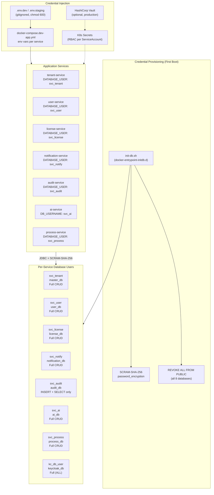
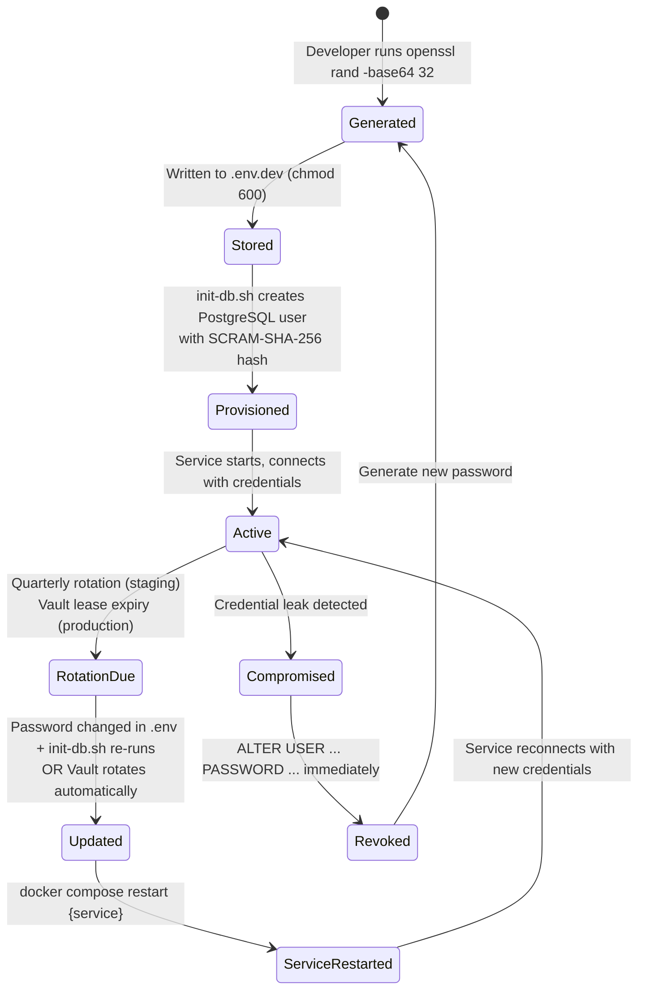
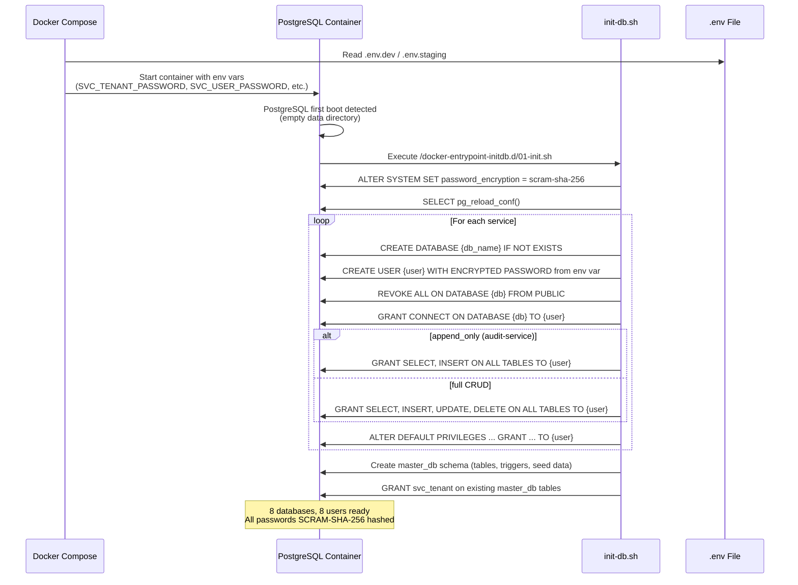
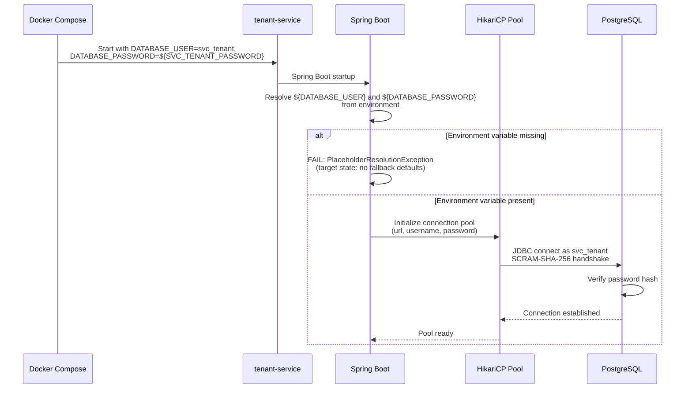

# ABB-011: Credential Management

## 1. Document Control

| Field | Value |
|-------|-------|
| **ABB ID** | ABB-011 |
| **Name** | Credential Management |
| **Domain** | Security |
| **Status** | In Progress |
| **Owner** | Architecture + DevOps + DBA |
| **Last Updated** | 2026-03-08 |
| **Realized By** | SBB-011: init-db.sh + SCRAM-SHA-256 + per-service env vars |
| **Related ADRs** | [ADR-020](../../../Architecture/09-architecture-decisions.md#953-service-credential-management-adr-020), [ADR-019](../../../Architecture/09-architecture-decisions.md#952-encryption-at-rest-strategy-adr-019), [ADR-022](../../../Architecture/09-architecture-decisions.md#951-production-parity-security-baseline-adr-022) |
| **Arc42 Sections** | [07-deployment-view S7.10](../../../Architecture/07-deployment-view.md), [08-crosscutting](../../../Architecture/08-crosscutting.md) |

## 2. Purpose and Scope

ABB-011 provides per-service database credential provisioning with least-privilege access control, replacing the shared `postgres` superuser pattern. It covers:

1. **PostgreSQL per-service users** with SCRAM-SHA-256 authentication, each having access only to their own database with the minimum required privileges.
2. **Credential externalization** via environment variable injection from gitignored `.env` files (dev/staging) or Kubernetes Secrets (production).
3. **Fail-fast behavior** where missing credentials cause immediate service startup failure rather than silent fallback to insecure defaults.
4. **Credential rotation lifecycle** from manual (dev/staging) through automated (production with Vault).

**Scope boundaries:**
- Covers PostgreSQL credentials for all 7 domain services + Keycloak.
- Covers Neo4j credentials for auth-facade.
- Identifies Valkey AUTH and Kafka SASL as in-scope gaps (TD-13, TD-14).
- Does NOT cover credential encryption (that is ABB-010 Tier 3 / Jasypt).
- Does NOT cover end-user authentication (that is Keycloak / auth-facade domain).

## 3. Functional Requirements

| ID | Description | Priority | Status |
|----|-------------|----------|--------|
| CRED-FR-01 | Each PostgreSQL-backed service must authenticate with a dedicated database user (not the superuser) | CRITICAL | [IN-PROGRESS] -- init-db.sh creates users; application.yml still has fallback defaults |
| CRED-FR-02 | PostgreSQL must use SCRAM-SHA-256 password encryption (not MD5) | HIGH | [IMPLEMENTED] -- init-db.sh sets `password_encryption = scram-sha-256` |
| CRED-FR-03 | audit-service database user must have INSERT + SELECT only (no UPDATE, no DELETE) | HIGH | [IMPLEMENTED] -- init-db.sh creates `svc_audit` with `append_only` mode |
| CRED-FR-04 | No hardcoded credential defaults in `application.yml` (fail-fast on missing env var) | CRITICAL | [IMPLEMENTED] -- All 7 PostgreSQL services removed fallback defaults; fail-fast on missing env vars (Sprint 1, 2026-03-08) |
| CRED-FR-05 | Credential source must be externalized to `.env` files (dev/staging) or K8s Secrets (production) | HIGH | [IN-PROGRESS] -- `.env.dev.template` defines per-service vars; Compose uses them |
| CRED-FR-06 | `REVOKE ALL FROM PUBLIC` must be applied to all databases | HIGH | [IMPLEMENTED] -- init-db.sh Step 4 |
| CRED-FR-07 | Valkey must require AUTH password | MEDIUM | [PLANNED] -- No AUTH configured (TD-13) |
| CRED-FR-08 | Kafka must use SASL authentication | MEDIUM | [PLANNED] -- No SASL configured (TD-14) |
| CRED-FR-09 | `.env` files must be gitignored and have `chmod 600` permissions | HIGH | [IMPLEMENTED] -- `.gitignore` includes `.env*` |
| CRED-FR-10 | Credential rotation must be possible without code changes (env var update + restart) | HIGH | [IMPLEMENTED] -- Credentials are env var driven |

## 4. Interfaces

### 4.1 Provided Interfaces

| Interface | Type | Consumer | Description |
|-----------|------|----------|-------------|
| Per-service PostgreSQL users | Database roles | 7 domain services + Keycloak | Dedicated users: `svc_tenant`, `svc_user`, `svc_license`, `svc_notify`, `svc_audit`, `svc_ai`, `svc_process`, `kc_db_user` |
| init-db.sh provisioning script | Shell script | PostgreSQL docker-entrypoint | Creates databases, users, and grants on first PostgreSQL startup |
| `.env.dev.template` | Template file | Developers | Documents all required environment variables with `CHANGE_ME` placeholders |
| Per-service env var naming | Convention | Docker Compose / K8s | `SVC_{SERVICE}_PASSWORD` pattern for each service |

### 4.2 Required Interfaces

| Interface | Type | Provider | Description |
|-----------|------|----------|-------------|
| PostgreSQL superuser | Database role | PostgreSQL container | `POSTGRES_USER` / `POSTGRES_PASSWORD` used only by init-db.sh for initial setup |
| `.env.dev` / `.env.staging` | Config file | Developer / Ops | Contains per-service passwords, must be created from template |
| `JASYPT_PASSWORD` | Environment variable | ABB-010 | For encrypting credentials in application.yml (Tier 3 dependency) |
| HashiCorp Vault (production) | Secret store | Infrastructure | Optional dynamic credential rotation via database secrets engine |

## 5. Internal Component Design



## 6. Data Model

### 6.1 Per-Service User Specification

| Service | DB User | Database | Privileges | Rationale |
|---------|---------|----------|------------|-----------|
| tenant-service | `svc_tenant` | `master_db` | SELECT, INSERT, UPDATE, DELETE on all tables + CREATE on schema | Full tenant CRUD, domain management, branding |
| user-service | `svc_user` | `user_db` | SELECT, INSERT, UPDATE, DELETE on all tables + CREATE on schema | User profile management |
| license-service | `svc_license` | `license_db` | SELECT, INSERT, UPDATE, DELETE on all tables + CREATE on schema | License and seat management |
| notification-service | `svc_notify` | `notification_db` | SELECT, INSERT, UPDATE, DELETE on all tables + CREATE on schema | Notification templates and delivery tracking |
| audit-service | `svc_audit` | `audit_db` | **INSERT, SELECT only** (no UPDATE, no DELETE) + CREATE on schema | Append-only audit log integrity |
| ai-service | `svc_ai` | `ai_db` | SELECT, INSERT, UPDATE, DELETE on all tables + CREATE on schema | Conversations, embeddings, RAG chunks |
| process-service | `svc_process` | `process_db` | SELECT, INSERT, UPDATE, DELETE on all tables + CREATE on schema | BPMN process definitions and deployments |
| keycloak | `kc_db_user` | `keycloak_db` | ALL on schema (full DDL + DML) | Keycloak manages its own schema lifecycle |

### 6.2 Environment Variable Naming Convention

| Service | Username Env Var | Password Env Var | Compose Injection |
|---------|-----------------|------------------|--------------------|
| tenant-service | `DATABASE_USER` (set to `svc_tenant`) | `SVC_TENANT_PASSWORD` (via `DATABASE_PASSWORD`) | `docker-compose.dev-app.yml` line 182-183 |
| user-service | `DATABASE_USER` (set to `svc_user`) | `SVC_USER_PASSWORD` (via `DATABASE_PASSWORD`) | `docker-compose.dev-app.yml` line 214-215 |
| license-service | `DATABASE_USER` (set to `svc_license`) | `SVC_LICENSE_PASSWORD` (via `DATABASE_PASSWORD`) | `docker-compose.dev-app.yml` line 244-245 |
| notification-service | `DATABASE_USER` (set to `svc_notify`) | `SVC_NOTIFICATION_PASSWORD` (via `DATABASE_PASSWORD`) | `docker-compose.dev-app.yml` line 272-273 |
| audit-service | `DATABASE_USER` (set to `svc_audit`) | `SVC_AUDIT_PASSWORD` (via `DATABASE_PASSWORD`) | `docker-compose.dev-app.yml` line 304-305 |
| ai-service | `DB_USERNAME` (set to `svc_ai`) | `SVC_AI_PASSWORD` (via `DB_PASSWORD`) | `docker-compose.dev-app.yml` line 334-335 |
| process-service | Not in active compose | `SVC_PROCESS_PASSWORD` | Template only (service excluded from runtime) |
| keycloak | `KC_DB_USERNAME` (set to `kc_db_user`) | `KC_DB_PASSWORD` | `docker-compose.dev-app.yml` line 37 |

### 6.3 Credential Lifecycle States



## 7. Integration Points

### 7.1 Database Initialization Flow



### 7.2 Service Startup with Per-Service Credentials



### 7.3 Current application.yml (Fail-Fast)

**Current state (all 7 PostgreSQL services -- Sprint 1 complete, 2026-03-08):**
```yaml
spring:
  datasource:
    username: ${DATABASE_USER}     # No fallback -- fails if missing
    password: ${DATABASE_PASSWORD}  # No fallback -- fails if missing
```

**Evidence:** Verified 2026-03-08 -- zero matches for `:postgres}` fallback in any `application.yml` across all 7 PostgreSQL services.

**Note:** The Docker Compose files (`docker-compose.dev-app.yml`) inject the correct per-service usernames (e.g., `DATABASE_USER: svc_tenant`). If the env var is missing, the service fails immediately with `PlaceholderResolutionException` rather than silently falling back to the `postgres` superuser.

## 8. Security Considerations

| Concern | Mitigation | Status |
|---------|------------|--------|
| Shared superuser access | Per-service users limit blast radius; each service can only access its own database | [IN-PROGRESS] -- Users created in init-db.sh; compose injects per-service creds; application.yml still has fallback |
| Audit log tampering | `svc_audit` user has INSERT + SELECT only; cannot UPDATE or DELETE audit records | [IMPLEMENTED] -- Verified in init-db.sh line 157 |
| Hardcoded fallback passwords | Removed `:postgres` fallback from all application.yml files; fail-fast on missing env vars | [IMPLEMENTED] -- Sprint 1, 2026-03-08 |
| `.env` file committed to git | `.gitignore` includes `.env*`; pre-commit hook validates no `.env` files staged | [IMPLEMENTED] |
| Valkey no AUTH | TD-13: Valkey has no password; any container on the network can read/write cache | [PLANNED] |
| Kafka no SASL | TD-14: Kafka has no authentication; any container can produce/consume | [PLANNED] |
| Credential rotation downtime | Password change requires service restart (env var driven); Vault dynamic creds in production avoid this | [PLANNED] for Vault |
| Cross-database access | `REVOKE ALL FROM PUBLIC` on all 8 databases prevents any user from connecting to databases they are not explicitly granted | [IMPLEMENTED] |

## 9. Configuration Model

### 9.1 Environment Template (.env.dev.template)

The template at `/Users/mksulty/Claude/Projects/EMSIST/infrastructure/docker/.env.dev.template` defines all required variables:

| Variable | Purpose | Default |
|----------|---------|---------|
| `POSTGRES_USER` | Superuser (init-db.sh only) | `postgres` |
| `POSTGRES_PASSWORD` | Superuser password | `CHANGE_ME_dev_postgres_superuser` |
| `SVC_TENANT_PASSWORD` | tenant-service password | `CHANGE_ME_dev_tenant_password` |
| `SVC_USER_PASSWORD` | user-service password | `CHANGE_ME_dev_user_password` |
| `SVC_LICENSE_PASSWORD` | license-service password | `CHANGE_ME_dev_license_password` |
| `SVC_NOTIFICATION_PASSWORD` | notification-service password | `CHANGE_ME_dev_notification_password` |
| `SVC_AUDIT_PASSWORD` | audit-service password | `CHANGE_ME_dev_audit_password` |
| `SVC_AI_PASSWORD` | ai-service password | `CHANGE_ME_dev_ai_password` |
| `SVC_PROCESS_PASSWORD` | process-service password | `CHANGE_ME_dev_process_password` |
| `KC_DB_PASSWORD` | Keycloak DB password | `CHANGE_ME_dev_keycloak_db_password` |
| `NEO4J_PASSWORD` | Neo4j password | `CHANGE_ME_dev_neo4j_password` |
| `JASYPT_PASSWORD` | Jasypt master key | `CHANGE_ME_dev_jasypt_secret` |

### 9.2 init-db.sh Security Controls

| Control | Implementation | Evidence |
|---------|---------------|----------|
| SCRAM-SHA-256 | `ALTER SYSTEM SET password_encryption = 'scram-sha-256'` | init-db.sh line 119 |
| REVOKE PUBLIC | `REVOKE ALL ON DATABASE {db} FROM PUBLIC` for all 8 databases | init-db.sh lines 170-178 |
| Fail on missing password | `if [ -z "$password" ]; then exit 1; fi` | init-db.sh lines 48-53 |
| Idempotent user creation | `IF NOT EXISTS (SELECT FROM pg_roles WHERE rolname = ...)` | init-db.sh lines 66-74 |
| Password update on re-run | `ALTER USER ... WITH ENCRYPTED PASSWORD ...` if user exists | init-db.sh line 71 |
| Append-only audit | `GRANT SELECT, INSERT ON ALL TABLES` (no UPDATE/DELETE) for `svc_audit` | init-db.sh lines 86-94 |

### 9.3 Credential Source by Environment

| Environment | Source | Rotation | Access Control | Encryption |
|-------------|--------|----------|----------------|------------|
| **Development** | `.env.dev` file (gitignored, `chmod 600`) | Manual (developer generates with `openssl rand -base64 32`) | Developer-only (local machine) | Host filesystem encryption (FileVault/LUKS) |
| **Staging** | `.env.staging` file (gitignored, `chmod 600`, server filesystem) | Manual (ops rotates quarterly) | SSH access required, ops team only | Host filesystem encryption + Jasypt for app config |
| **Production** | K8s Secrets (RBAC-protected per ServiceAccount) + optional Vault | Automated (Vault lease TTL, External Secrets Operator) | K8s RBAC: each service's ServiceAccount reads only its own Secret | etcd encryption at rest + Jasypt for app config |

## 10. Performance and Scalability

| Factor | Impact | Mitigation |
|--------|--------|------------|
| SCRAM-SHA-256 handshake | Slightly more CPU than MD5 (~0.1ms per auth) | Connection pooling (HikariCP) amortizes auth cost; connections are reused |
| Per-service users (connection limits) | 8 users instead of 1; potential for more connection pool fragmentation | Default PostgreSQL `max_connections = 100`; 8 services x 10 pool connections = 80, within limits |
| init-db.sh execution time | ~2-3 seconds for all 8 databases + schema + seed data | Runs only once on first PostgreSQL boot (idempotent on re-runs) |
| Credential rotation (restart) | Service restart required for password change (~30s downtime per service) | Rolling restarts in K8s (Phase 2); Vault dynamic creds avoid restart entirely |

## 11. Implementation Status

### 11.1 Implemented Components

| Component | Evidence | Notes |
|-----------|----------|-------|
| init-db.sh with per-service users | `/Users/mksulty/Claude/Projects/EMSIST/infrastructure/docker/init-db.sh` (452 lines) | [IMPLEMENTED] -- Creates 8 databases, 8 users, SCRAM-SHA-256, REVOKE PUBLIC, append-only audit |
| SCRAM-SHA-256 enforcement | init-db.sh line 119: `ALTER SYSTEM SET password_encryption = 'scram-sha-256'` | [IMPLEMENTED] |
| Audit-service append-only grants | init-db.sh line 157: `create_db_and_user "audit_db" "svc_audit" "SVC_AUDIT_PASSWORD" "append_only"` | [IMPLEMENTED] |
| Per-service env vars in dev compose | `/Users/mksulty/Claude/Projects/EMSIST/docker-compose.dev-app.yml` (e.g., line 182: `DATABASE_USER: svc_tenant`) | [IMPLEMENTED] -- Compose injects per-service usernames and passwords |
| Per-service passwords in data compose | `/Users/mksulty/Claude/Projects/EMSIST/docker-compose.dev-data.yml` lines 33-40 | [IMPLEMENTED] -- All `SVC_*_PASSWORD` vars passed to PostgreSQL |
| .env.dev.template | `/Users/mksulty/Claude/Projects/EMSIST/infrastructure/docker/.env.dev.template` (96 lines) | [IMPLEMENTED] -- Documents all required vars with CHANGE_ME placeholders |
| Keycloak dedicated user | init-db.sh line 129: `create_db_and_user "keycloak_db" "kc_db_user" "KC_DB_PASSWORD"` | [IMPLEMENTED] -- Uses `kc_db_user` instead of old `keycloak` user |
| Keycloak compose uses kc_db_user | docker-compose.dev-app.yml line 36: `KC_DB_USERNAME: kc_db_user` | [IMPLEMENTED] |
| Remove hardcoded fallback defaults | All 7 PostgreSQL services' `application.yml` now use `${DATABASE_USER}` and `${DATABASE_PASSWORD}` without fallback | [IMPLEMENTED] -- Verified 2026-03-08 -- zero matches for `:postgres}` fallback in any application.yml |

### 11.2 Not Yet Implemented

| Component | Gap | Priority |
|-----------|-----|----------|
| Valkey AUTH password | No `--requirepass` or `--user` configuration in Valkey container | MEDIUM (TD-13) |
| Kafka SASL authentication | No SASL_SCRAM configuration on Kafka broker or clients | MEDIUM (TD-14) |
| Per-service env var naming in application.yml | Services use generic `DATABASE_USER` instead of per-service `SVC_TENANT_DB_USER` as specified in ADR-020 | LOW (functional but not per-ADR naming) |
| Neo4j credential externalization | auth-facade compose uses `NEO4J_PASSWORD: ${NEO4J_PASSWORD:-dev_neo4j_password}` with fallback default | LOW |
| Vault integration (production) | No HashiCorp Vault deployment or dynamic credential engine | [PLANNED] (Phase 2 / K8s) |

## 12. Gap Analysis

| # | Gap | Current State | Target State | Priority | Effort | Reference |
|---|-----|---------------|--------------|----------|--------|-----------|
| GAP-CR-01 | Hardcoded fallback defaults in application.yml | `${DATABASE_USER:postgres}` in all 7 services | `${DATABASE_USER}` with no fallback (fail-fast) | CRITICAL | 2h | ADR-020 |
| GAP-CR-02 | Valkey no AUTH | No password, any container can access | `--requirepass` + Spring `spring.data.redis.password` | MEDIUM | 1d | TD-13 |
| GAP-CR-03 | Kafka no SASL | `PLAINTEXT://` listener, no auth | SASL_SCRAM-SHA-512 per-service KafkaUser | MEDIUM | 3d | TD-14 |
| GAP-CR-04 | ai-service different env var naming | Uses `DB_USERNAME`/`DB_PASSWORD` instead of `DATABASE_USER`/`DATABASE_PASSWORD` | Standardize to consistent naming across all services | LOW | 1h | ADR-020 |
| GAP-CR-05 | Neo4j hardcoded default in compose | `NEO4J_PASSWORD: ${NEO4J_PASSWORD:-dev_neo4j_password}` | No fallback default | LOW | 30m | ADR-020 |
| GAP-CR-06 | No Vault for production | Manual credential management | HashiCorp Vault database secrets engine with automatic rotation | LOW (Phase 2) | 5d | ADR-018 |
| GAP-CR-07 | No credential rotation runbook | No documented procedure | Step-by-step rotation guide for each credential type | MEDIUM | 1d | ADR-020 |

## 13. Dependencies

| Dependency | Type | Description | Status |
|------------|------|-------------|--------|
| ABB-010 (Encryption Infrastructure) | Co-dependent | Jasypt (Tier 3) encrypts credentials stored in application.yml; TLS (Tier 2) encrypts credential exchange over the wire | [IN-PROGRESS] |
| ABB-012 (Container Orchestration) | Consuming | K8s Secrets provide credential storage in production; Vault integration requires K8s service accounts | [PLANNED] |
| PostgreSQL 16 | Infrastructure | SCRAM-SHA-256 native support; per-user grants; `pg_hba.conf` network restrictions | [IMPLEMENTED] |
| Docker Compose `.env` mechanism | Infrastructure | `env_file` directive injects credentials into containers | [IMPLEMENTED] |
| init-db.sh idempotency | Operational | Script must be safe to re-run (password update on existing users, IF NOT EXISTS for databases) | [IMPLEMENTED] |
| ADR-020 (Service Credentials) | Governing | Defines the per-service user specification, privilege model, and env var naming convention | [PROPOSED] |
| ADR-022 (Prod-Parity Security) | Governing | No security downgrades between environments; credential isolation mandatory | [ACCEPTED] |

---

**Document version:** 1.0.0
**Author:** SA Agent
**Verified against codebase:** 2026-03-08
