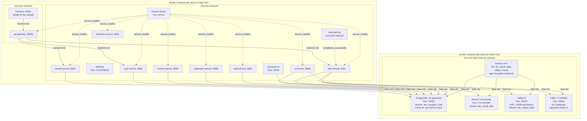
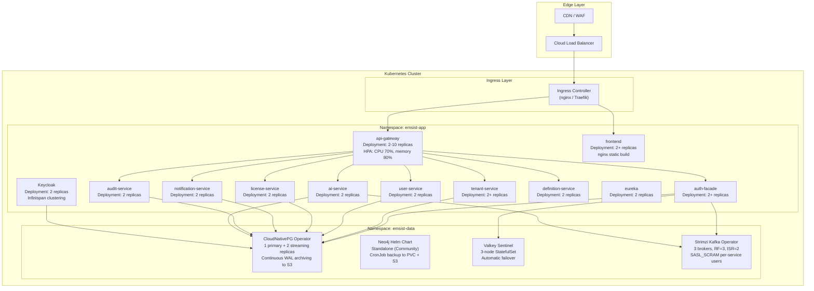
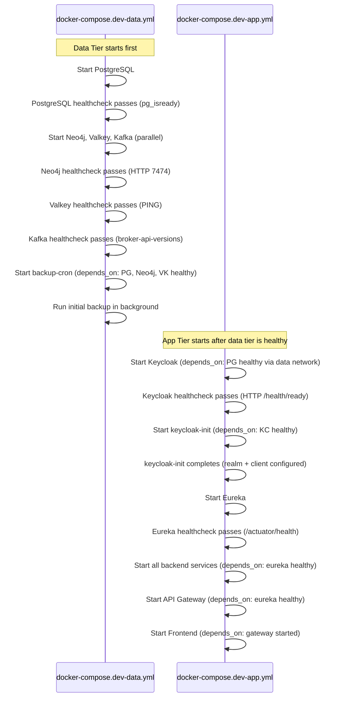
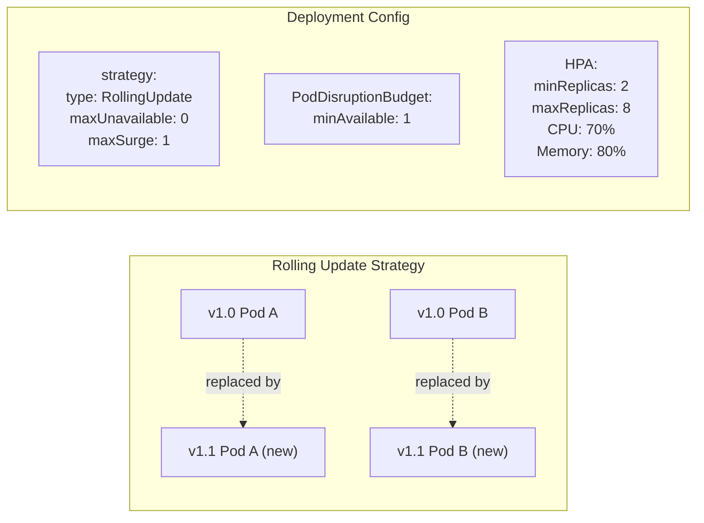
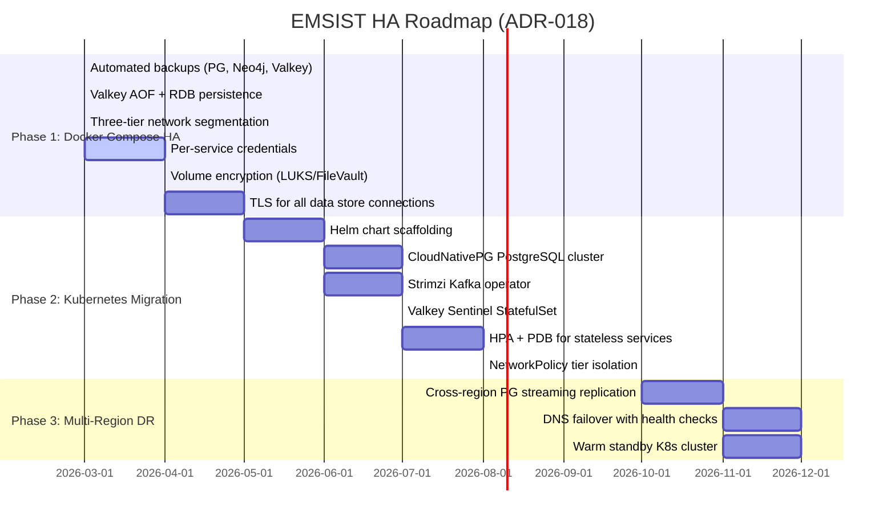

# ABB-012: Container Orchestration

## 1. Document Control

| Field | Value |
|-------|-------|
| **ABB ID** | ABB-012 |
| **Name** | Container Orchestration |
| **Domain** | Technology |
| **Status** | In Progress |
| **Owner** | Architecture + DevOps |
| **Last Updated** | 2026-03-08 |
| **Realized By** | SBB-012: Docker Compose (dev/staging) + Kubernetes Helm charts (target) |
| **Related ADRs** | [ADR-018](../../../Architecture/09-architecture-decisions.md#954-high-availability-and-multi-tier-architecture-adr-018), [ADR-019](../../../Architecture/09-architecture-decisions.md#952-encryption-at-rest-strategy-adr-019), [ADR-020](../../../Architecture/09-architecture-decisions.md#953-service-credential-management-adr-020), [ADR-022](../../../Architecture/09-architecture-decisions.md#951-production-parity-security-baseline-adr-022) |
| **Arc42 Sections** | [07-deployment-view](../../../Architecture/07-deployment-view.md), [05-technology-architecture](../../05-technology-architecture.md) |

## 2. Purpose and Scope

ABB-012 provides container-based service deployment and orchestration for the EMSIST platform, covering:

1. **Docker Compose topology** for development and staging environments with tier-separated lifecycle management (data tier independent of app tier).
2. **Kubernetes target topology** for staging and production with operator-managed stateful services, horizontal autoscaling, and pod disruption budgets.
3. **Three-phase HA roadmap** (ADR-018): Phase 1 automated backups in Compose, Phase 2 Kubernetes migration with operators, Phase 3 multi-region DR.
4. **Environment parity strategy** ensuring the same Docker images and application configuration deploy across all environments with only deployment-level differences.
5. **Network segmentation** via three-tier Docker networks (dev/staging) transitioning to Kubernetes NetworkPolicies (production).

**Scope boundaries:**
- Covers all 9 active backend services, frontend, Keycloak, Eureka, and 4 data stores.
- Covers service health checks (Spring Boot Actuator), resource limits, and deployment dependencies.
- Does NOT cover CI/CD pipeline design (separate ABB).
- Does NOT cover application code or business logic.

## 3. Functional Requirements

| ID | Description | Priority | Status |
|----|-------------|----------|--------|
| ORCH-FR-01 | Data tier must have independent lifecycle from app tier (separate Compose files) | HIGH | [IMPLEMENTED] -- `docker-compose.dev-data.yml` + `docker-compose.dev-app.yml` |
| ORCH-FR-02 | Data volumes must survive `docker compose -f app.yml down` | HIGH | [IMPLEMENTED] -- Volumes owned by data-tier Compose; app-tier references external networks |
| ORCH-FR-03 | All services must have Docker health checks | HIGH | [IMPLEMENTED] -- All containers in dev-data and dev-app have healthcheck definitions |
| ORCH-FR-04 | Services must use `restart: unless-stopped` for automatic recovery | HIGH | [IN-PROGRESS] -- backup-cron has it; application services rely on depends_on health |
| ORCH-FR-05 | Resource limits (CPU, memory) must be defined for all containers | HIGH | [IMPLEMENTED] -- All services in dev-app and dev-data have deploy.resources.limits |
| ORCH-FR-06 | Three-tier network segmentation (data, backend, frontend) | HIGH | [IMPLEMENTED] -- `ems-dev-data` (internal), `ems-dev-backend`, `ems-dev-frontend` |
| ORCH-FR-07 | Automated backup cron for all data stores | HIGH | [IMPLEMENTED] -- backup-cron sidecar: PG every 6h, Neo4j daily, Valkey hourly |
| ORCH-FR-08 | Spring Boot Actuator health endpoints for probes | HIGH | [IMPLEMENTED] -- `/actuator/health` used in Eureka healthcheck |
| ORCH-FR-09 | Service startup ordering via depends_on + health conditions | HIGH | [IMPLEMENTED] -- Services depend on eureka (service_healthy) and keycloak-init (service_completed_successfully) |
| ORCH-FR-10 | Kubernetes Deployment with HPA for stateless services | HIGH | [PLANNED] -- No K8s manifests exist |
| ORCH-FR-11 | Kubernetes StatefulSet with operators for stateful services | HIGH | [PLANNED] -- No K8s operators configured |
| ORCH-FR-12 | PodDisruptionBudgets for all services | MEDIUM | [PLANNED] |
| ORCH-FR-13 | Rolling update strategy with zero-downtime deploys | MEDIUM | [PLANNED] |

## 4. Interfaces

### 4.1 Provided Interfaces

| Interface | Type | Consumer | Description |
|-----------|------|----------|-------------|
| Docker Compose dev topology | Compose files | Developers | `docker-compose.dev-data.yml` + `docker-compose.dev-app.yml` + `docker-compose.dev.yml` (wrapper) |
| Docker Compose staging topology | Compose files | Staging server | `docker-compose.staging-data.yml` + `docker-compose.staging-app.yml` |
| Startup scripts | Shell scripts | Developers / CI | `scripts/dev-up.sh`, `scripts/staging-up.sh` |
| Service health endpoints | HTTP | Docker healthcheck / K8s probes | `/actuator/health` on all Spring Boot services |
| Backup cron sidecar | Container | Data tier | Automated pg_dump, neo4j tar, valkey BGSAVE with optional age encryption |
| Network segmentation | Docker networks | All containers | Three networks: data (internal), backend, frontend |

### 4.2 Required Interfaces

| Interface | Type | Provider | Description |
|-----------|------|----------|-------------|
| `.env.dev` / `.env.staging` | Config files | ABB-011 (Credential Management) | Per-service passwords and configuration |
| Docker Engine | Runtime | Host OS | Docker 24+ with Compose v2 |
| Kubernetes cluster | Runtime | Cloud / on-premise | K8s 1.28+ for Phase 2 |
| Container registry | Infrastructure | GitHub Container Registry / Harbor | Docker images for K8s pulls |
| S3-compatible storage | Infrastructure | AWS S3 / MinIO | Backup target for offsite copies (Phase 1) |

## 5. Internal Component Design

### 5.1 Docker Compose Topology (Current State)



### 5.2 Kubernetes Target Topology (Phase 2)



## 6. Data Model

### 6.1 Service Inventory

| Service | Port (Dev) | Port (Compose Host) | Image | Database | Health Check | Status |
|---------|-----------|---------------------|-------|----------|-------------|--------|
| postgres | 5432 | 25432 | `pgvector/pgvector:pg16` | N/A (is database) | `pg_isready -U postgres` | [IMPLEMENTED] |
| neo4j | 7474/7687 | 27474/27687 | `neo4j:5-community` | N/A (is database) | `wget http://localhost:7474` | [IMPLEMENTED] |
| valkey | 6379 | 26379 | `valkey/valkey:8-alpine` | N/A (is cache) | `valkey-cli ping` | [IMPLEMENTED] |
| kafka | 9092 | 29092 | `confluentinc/cp-kafka:7.6.0` | N/A (is broker) | `kafka-broker-api-versions` | [IMPLEMENTED] |
| backup-cron | N/A | N/A | `alpine:3.19` | Connects to PG, Neo4j, VK | N/A (sidecar) | [IMPLEMENTED] |
| keycloak | 8080 | 28180 | `quay.io/keycloak/keycloak:24.0` | keycloak_db (PG) | TCP health check on :8080 | [IMPLEMENTED] |
| eureka | 8761 | 28761 | Custom build | N/A | `/actuator/health` | [IMPLEMENTED] |
| auth-facade | 8081 | - | Custom build | Neo4j + Valkey | `/actuator/health` | [IMPLEMENTED] |
| tenant-service | 8082 | - | Custom build | master_db (PG) | `/actuator/health` | [IMPLEMENTED] |
| user-service | 8083 | - | Custom build | user_db (PG) | `/actuator/health` | [IMPLEMENTED] |
| license-service | 8085 | - | Custom build | license_db (PG) | `/actuator/health` | [IMPLEMENTED] |
| notification-service | 8086 | - | Custom build | notification_db (PG) | `/actuator/health` | [IMPLEMENTED] |
| audit-service | 8087 | - | Custom build | audit_db (PG) | `/actuator/health` | [IMPLEMENTED] |
| ai-service | 8088 | - | Custom build | ai_db (PG) | `/actuator/health` | [IMPLEMENTED] |
| definition-service | 8090 | - | Custom build | Neo4j | `/actuator/health` | [IMPLEMENTED] |
| api-gateway | 8080 | 28080 | Custom build | N/A (routes) | `/actuator/health` | [IMPLEMENTED] |
| frontend | 4200 | 24200 | `node:22-alpine` (dev) | N/A (static) | N/A | [IMPLEMENTED] |

### 6.2 Resource Limits (Docker Compose)

| Service | Memory Limit | CPU Limit | Evidence |
|---------|-------------|-----------|----------|
| postgres | 512M | 1.0 | docker-compose.dev-data.yml line 66-70 |
| neo4j | 1G | 1.0 | docker-compose.dev-data.yml line 97-101 |
| valkey | 256M | 0.5 | docker-compose.dev-data.yml line 130-134 |
| kafka | 1G | 1.0 | docker-compose.dev-data.yml line 163-167 |
| backup-cron | 256M | 0.25 | docker-compose.dev-data.yml line 318-322 |
| keycloak | 1G | 1.0 | docker-compose.dev-app.yml line 58-62 |
| keycloak-init | 64M | 0.25 | docker-compose.dev-app.yml line 88-92 |
| eureka | 256M | 0.5 | docker-compose.dev-app.yml line 120-124 |
| Backend services (each) | 512M | 0.5 | docker-compose.dev-app.yml (per service) |
| ai-service | 768M | 0.5 | docker-compose.dev-app.yml line 350-353 |
| frontend | 2G | 1.0 | docker-compose.dev-app.yml line 432-435 |

### 6.3 Volume Inventory (Dev Environment)

| Volume | Owner | Service | Backup | Labels |
|--------|-------|---------|--------|--------|
| `dev_postgres_data` | Data tier | PostgreSQL | `backup: required` | persist=true, env=dev |
| `dev_postgres_backups` | Data tier | PostgreSQL backups | N/A (is backup) | persist=true |
| `dev_neo4j_data` | Data tier | Neo4j | `backup: required` | persist=true, env=dev |
| `dev_neo4j_logs` | Data tier | Neo4j logs | N/A | persist=false |
| `dev_neo4j_backups` | Data tier | Neo4j backups | N/A (is backup) | persist=true |
| `dev_valkey_data` | Data tier | Valkey | N/A | persist=true |
| `dev_valkey_backups` | Data tier | Valkey backups | N/A (is backup) | persist=true |
| `dev_frontend_node_modules` | App tier | Frontend | N/A | persist=false |

### 6.4 Network Topology

| Network | Type | Purpose | Members | Host Access |
|---------|------|---------|---------|-------------|
| `ems-dev-data` | Bridge (internal: true) | Data tier isolation | PostgreSQL, Neo4j, Valkey, Kafka, backup-cron | **None** (internal flag prevents host access) |
| `ems-dev-backend` | Bridge | Backend services + identity | All backend services, Keycloak, Eureka, MailHog | Debug ports exposed |
| `ems-dev-frontend` | Bridge | Frontend isolation | Frontend, API Gateway | Port 24200 (frontend), 28080 (gateway) |

**Cross-network membership (verified from Compose):**
- `api-gateway`: frontend + backend + data (bridges all three tiers)
- `auth-facade`: backend + data (accesses Neo4j, Valkey)
- `keycloak`: backend + data (accesses PostgreSQL)
- `tenant-service`, `user-service`, etc.: backend + data (accesses PostgreSQL)
- `frontend`: frontend only
- All data stores: data only

## 7. Integration Points

### 7.1 Service Startup Sequence



### 7.2 Kubernetes Deployment Strategy (Phase 2 Target)



### 7.3 Three-Phase HA Roadmap



## 8. Security Considerations

| Concern | Mitigation | Status |
|---------|------------|--------|
| `docker compose down -v` destroys data | Data volumes owned by separate data-tier Compose file; app-tier `down` cannot remove them | [IMPLEMENTED] -- Volume lifecycle separated |
| Network isolation between tiers | `ems-dev-data` network has `internal: true` flag; data stores not accessible from host | [IMPLEMENTED] |
| Frontend can reach databases | Frontend on `ems-dev-frontend` network; cannot access `ems-dev-data` | [IMPLEMENTED] |
| Containers run as root | Target: add `user:` directive for non-root containers | [PLANNED] |
| Docker images from untrusted sources | All base images from official registries (Docker Hub, Quay.io, Confluent) | [IMPLEMENTED] |
| Secrets in Compose environment | Credential values from `.env` files (gitignored); not hardcoded in Compose files | [IN-PROGRESS] -- Some fallback defaults remain |
| K8s RBAC for Secrets | Target: each service's ServiceAccount can only read its own Secret | [PLANNED] |
| K8s NetworkPolicy | Target: deny-all default with explicit allow rules per namespace | [PLANNED] |
| Container image scanning | Target: Trivy scan in CI before deployment | [PLANNED] |

## 9. Configuration Model

### 9.1 Docker Compose File Structure

```
Project Root
  docker-compose.dev.yml           # Wrapper: includes data + app
  docker-compose.dev-data.yml      # Data tier: PG, Neo4j, VK, Kafka, backup-cron
  docker-compose.dev-app.yml       # App tier: KC, services, frontend
  docker-compose.staging.yml       # Wrapper: includes data + app
  docker-compose.staging-data.yml  # Data tier (staging ports)
  docker-compose.staging-app.yml   # App tier (staging config)
  .env.dev                         # Dev credentials (gitignored)
  .env.staging                     # Staging credentials (gitignored)
  infrastructure/docker/
    docker-compose.yml             # Legacy monolithic (deprecated for split)
    docker-compose.backup.yml      # DEPRECATED -- superseded by backup-cron in data tier
    init-db.sh                     # PostgreSQL initialization script
    init-db.sql                    # Legacy SQL init (superseded by init-db.sh)
    .env.dev.template              # Credential template
    .env.staging.template          # Staging credential template
    prometheus.yml                 # Prometheus scrape config
```

### 9.2 Kubernetes Target Structure (Phase 2)

```
infrastructure/k8s/
  base/                            # Kustomize base manifests
    namespaces.yaml                # emsist-app, emsist-data
    network-policies/
      deny-all.yaml
      allow-app-to-data.yaml
      allow-ingress-to-app.yaml
  apps/                            # Application Deployments
    api-gateway/
      deployment.yaml
      service.yaml
      hpa.yaml
      pdb.yaml
    auth-facade/
    tenant-service/
    ...
  data/                            # Stateful workloads
    postgresql/
      cluster.yaml                 # CloudNativePG Cluster CRD
    neo4j/
      values.yaml                  # Neo4j Helm chart values
    valkey/
      statefulset.yaml             # 3-node Sentinel
    kafka/
      kafka.yaml                   # Strimzi Kafka CRD
  overlays/
    staging/
      kustomization.yaml
    production/
      kustomization.yaml
```

### 9.3 Kubernetes Operator Specifications

| Component | Operator / Resource | Version | Configuration |
|-----------|-------------------|---------|---------------|
| PostgreSQL | CloudNativePG | >= 1.22 | 3 instances, streaming replication, PgBouncer sidecar, continuous WAL to S3 |
| Kafka | Strimzi | >= 0.40 | 3 brokers, RF=3, ISR=2, SASL_SCRAM-SHA-512, TLS inter-broker |
| Valkey | StatefulSet + Sentinel | N/A (no operator) | 3 pods, 3 Sentinel sidecars, quorum=2, AOF + RDB |
| Neo4j | Helm chart `neo4j/neo4j` | >= 5.12 | Standalone (Community), CronJob backup to PVC + S3 |
| Cert management | cert-manager | >= 1.14 | Let's Encrypt (production), self-signed CA (staging) |

### 9.4 HPA and PDB Specifications (Phase 2 Target)

| Service | minReplicas | maxReplicas | CPU Target | Memory Target | PDB minAvailable |
|---------|------------|------------|------------|---------------|-------------------|
| api-gateway | 2 | 10 | 70% | 80% | 1 |
| auth-facade | 2 | 6 | 70% | 80% | 1 |
| tenant-service | 2 | 6 | 70% | 80% | 1 |
| user-service | 2 | 6 | 70% | 80% | 1 |
| license-service | 2 | 4 | 70% | 80% | 1 |
| notification-service | 2 | 4 | 70% | 80% | 1 |
| audit-service | 2 | 4 | 70% | 80% | 1 |
| ai-service | 2 | 4 | 70% | 80% | 1 |
| definition-service | 2 | 4 | 70% | 80% | 1 |
| frontend | 2 | 6 | 70% | N/A | 1 |
| keycloak | 2 | 4 | 70% | 80% | 1 |

## 10. Performance and Scalability

| Factor | Docker Compose (Current) | Kubernetes (Target) | Notes |
|--------|-------------------------|---------------------|-------|
| **Service replicas** | 1 per service (manual change) | 2-10 per service (HPA auto) | HPA based on CPU/memory; manual override via `kubectl scale` |
| **PostgreSQL throughput** | Single instance | 1 primary + 2 read replicas (CloudNativePG) | 3x read throughput via replica services |
| **Valkey throughput** | Single instance | 3-node Sentinel (primary + 2 replicas) | Read-from-replica for cache reads |
| **Kafka throughput** | Single broker, RF=1 | 3 brokers, RF=3, ISR=2 | Partition-level parallelism; consumer groups scale horizontally |
| **Zero-downtime deploys** | Not supported (stop + start) | Rolling update, `maxUnavailable: 0` | New pods start before old pods terminate |
| **Failover time (PG)** | N/A (no failover) | < 30 seconds (CloudNativePG auto-promote) | Operator detects failure and promotes replica |
| **Failover time (Valkey)** | N/A (no failover) | < 10 seconds (Sentinel quorum) | Sentinel promotes replica after quorum agreement |
| **Horizontal scaling** | Manual compose restart | Automatic HPA within 60 seconds | Metrics-server provides CPU/memory utilization |
| **Resource overhead** | ~6.5 GB RAM total (all containers) | ~13 GB RAM (doubled for HA) | 2x replicas doubles base resource requirement |

## 11. Implementation Status

### 11.1 Implemented Components

| Component | Evidence | Notes |
|-----------|----------|-------|
| Tier-split Compose (dev) | `/Users/mksulty/Claude/Projects/EMSIST/docker-compose.dev-data.yml` (387 lines) + `/Users/mksulty/Claude/Projects/EMSIST/docker-compose.dev-app.yml` (461 lines) | [IMPLEMENTED] -- Full tier separation with external networks |
| Wrapper Compose (dev) | `/Users/mksulty/Claude/Projects/EMSIST/docker-compose.dev.yml` (18 lines) | [IMPLEMENTED] -- `include:` directive for backward compatibility |
| Three-tier networks | docker-compose.dev-data.yml lines 380-387: `ems-dev-data` (internal: true), `ems-dev-backend`, `ems-dev-frontend` | [IMPLEMENTED] |
| Backup-cron sidecar | docker-compose.dev-data.yml lines 169-322: PG every 6h, Neo4j daily, Valkey hourly, optional age encryption | [IMPLEMENTED] |
| Volume lifecycle protection | Data volumes defined in data-tier Compose only; app-tier references external networks | [IMPLEMENTED] |
| Resource limits (all containers) | Every service has `deploy.resources.limits` with memory and CPU | [IMPLEMENTED] |
| Health checks (all data stores) | PostgreSQL (`pg_isready`), Neo4j (HTTP), Valkey (`PING`), Kafka (`broker-api-versions`) | [IMPLEMENTED] |
| Health checks (services) | Eureka (`/actuator/health`), Keycloak (TCP /health/ready) | [IMPLEMENTED] |
| Startup ordering | `depends_on` with `service_healthy` / `service_completed_successfully` conditions | [IMPLEMENTED] |
| Valkey persistence hardening | `--appendonly yes --appendfsync everysec` + RDB snapshots | [IMPLEMENTED] |
| Kafka KRaft mode (no Zookeeper) | `KAFKA_PROCESS_ROLES: broker,controller` + `CLUSTER_ID` | [IMPLEMENTED] |
| Startup scripts | `/Users/mksulty/Claude/Projects/EMSIST/scripts/dev-up.sh`, `/Users/mksulty/Claude/Projects/EMSIST/scripts/staging-up.sh` | [IMPLEMENTED] |
| Upgrade safety scripts | `/Users/mksulty/Claude/Projects/EMSIST/scripts/safe-upgrade.sh`, `pre-upgrade-snapshot.sh`, `rollback.sh` | [IMPLEMENTED] |
| Prometheus + Grafana | `/Users/mksulty/Claude/Projects/EMSIST/infrastructure/docker/docker-compose.yml` lines 379-405 | [IMPLEMENTED] -- In legacy Compose; to be added to tier-split |
| Eureka service registry | `/Users/mksulty/Claude/Projects/EMSIST/backend/eureka-server/` with `@EnableEurekaServer` | [IMPLEMENTED] |
| Volume labels | Volumes have `com.emsist.persist`, `com.emsist.env`, `com.emsist.backup` labels | [IMPLEMENTED] |

### 11.2 Not Yet Implemented

| Component | Gap | Priority |
|-----------|-----|----------|
| Kubernetes manifests | No K8s Deployment, Service, Ingress, or HPA YAML files exist | HIGH (Phase 2) |
| CloudNativePG Cluster CRD | No PostgreSQL operator configuration | HIGH (Phase 2) |
| Strimzi Kafka CRD | No Kafka operator configuration | HIGH (Phase 2) |
| Valkey Sentinel StatefulSet | No K8s StatefulSet for Valkey HA | HIGH (Phase 2) |
| Neo4j Helm chart values | No Helm values file for Neo4j deployment | MEDIUM (Phase 2) |
| Helm charts for application services | No Helm chart directory structure | HIGH (Phase 2) |
| K8s NetworkPolicies | No network policy manifests | MEDIUM (Phase 2) |
| PodDisruptionBudgets | No PDB manifests | MEDIUM (Phase 2) |
| HPA configurations | No HPA manifests | MEDIUM (Phase 2) |
| Container image CI/CD pipeline | No automated build + push to registry | HIGH |
| Staging compose (tier-split) | `docker-compose.staging-data.yml` and `staging-app.yml` exist but not verified in this audit | MEDIUM |
| Multi-region DR (Phase 3) | No cross-region replication or DNS failover | LOW (Phase 3) |
| Non-root container users | No `user:` directive in Dockerfiles | MEDIUM |

## 12. Gap Analysis

| # | Gap | Current State | Target State | Priority | Effort | Reference |
|---|-----|---------------|--------------|----------|--------|-----------|
| GAP-O-01 | No Kubernetes manifests | Docker Compose only | Helm charts + Kustomize for K8s deployment | HIGH | 10d | ADR-018 Phase 2 |
| GAP-O-02 | No CloudNativePG operator | Single PostgreSQL instance | 3-instance cluster with streaming replication | HIGH | 3d | ADR-018 Phase 2 |
| GAP-O-03 | No Strimzi operator | Single Kafka broker, RF=1 | 3 brokers, RF=3, ISR=2 | HIGH | 3d | ADR-018 Phase 2 |
| GAP-O-04 | No Valkey Sentinel | Single Valkey instance | 3-node StatefulSet with Sentinel failover | HIGH | 2d | ADR-018 Phase 2 |
| GAP-O-05 | No K8s NetworkPolicies | Docker bridge networks (flat access within tier) | Deny-all default with explicit allow rules | MEDIUM | 2d | ADR-018 |
| GAP-O-06 | No HPA or PDB | Single instance, no auto-scaling | HPA (CPU 70%) + PDB (minAvailable: 1) per service | MEDIUM | 2d | ADR-018 Phase 2 |
| GAP-O-07 | No container image pipeline | Local `docker compose build` | CI builds + pushes to container registry | HIGH | 3d | DevOps |
| GAP-O-08 | No multi-region DR | Single host, single region | Active-passive with DNS failover | LOW | 15d | ADR-018 Phase 3 |
| GAP-O-09 | No non-root containers | Containers run as root | `user:` directive in Dockerfiles | MEDIUM | 1d | Security hardening |
| GAP-O-10 | Prometheus not in tier-split | Prometheus/Grafana in legacy monolithic Compose only | Add to dev-data or separate monitoring Compose | LOW | 1d | Observability |

## 13. Dependencies

| Dependency | Type | Description | Status |
|------------|------|-------------|--------|
| ABB-010 (Encryption Infrastructure) | Co-dependent | TLS for all data store connections within the orchestrated topology; encrypted StorageClass PVs in K8s | [IN-PROGRESS] |
| ABB-011 (Credential Management) | Co-dependent | Per-service credentials injected via `.env` files (Compose) or K8s Secrets; init-db.sh runs inside PostgreSQL container | [IN-PROGRESS] |
| Docker Engine 24+ | Infrastructure | Required for Compose v2 with `include:` directive and `deploy.resources` | [IMPLEMENTED] |
| Kubernetes 1.28+ | Infrastructure | Required for Phase 2 deployment; not yet provisioned | [PLANNED] |
| CloudNativePG operator | Infrastructure | CNCF Sandbox operator for PostgreSQL HA on K8s | [PLANNED] |
| Strimzi operator | Infrastructure | CNCF Incubating operator for Kafka on K8s | [PLANNED] |
| cert-manager | Infrastructure | Automatic TLS certificate provisioning in K8s | [PLANNED] |
| Container registry | Infrastructure | GitHub Container Registry or Harbor for image storage | [PLANNED] |
| ADR-018 (HA Multi-Tier) | Governing | Defines the three-phase HA roadmap and component specifications | [PROPOSED] |
| ADR-022 (Prod-Parity Security) | Governing | No environment-level security downgrades; parity across dev/staging/production | [ACCEPTED] |
| Spring Boot Actuator | Application | Provides `/actuator/health` endpoints used by Docker healthcheck and K8s probes | [IMPLEMENTED] |

---

**Document version:** 1.0.0
**Author:** SA Agent
**Verified against codebase:** 2026-03-08
