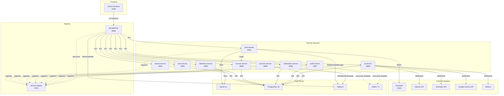
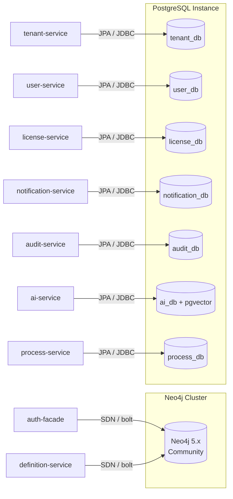
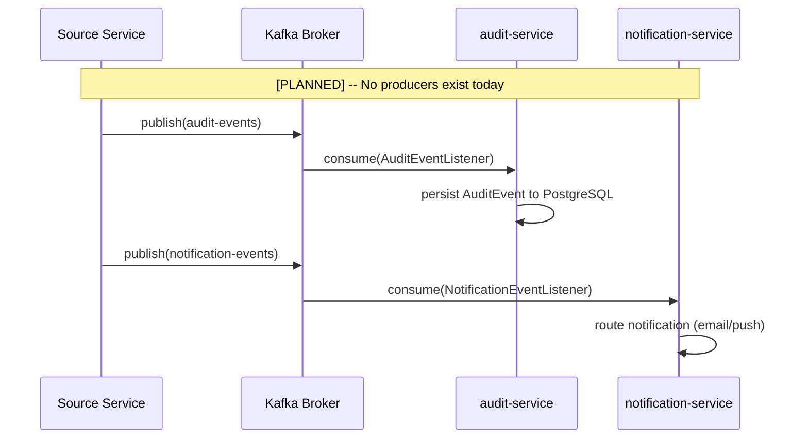

# Interface Catalog

> **Last Updated:** 2026-03-08
> **Status:** Active
> **Source:** TOGAF Phase C (Application Architecture), EMSIST Architecture Conformance Audit (2026-03-08)
> **GAP Reference:** GAP-007 (HIGH) -- No interface catalog existed prior to this document

## Overview

This catalog documents all service-to-service interfaces, external system integrations, data store connections, messaging contracts, and cache interactions in the EMSIST platform. Every interface entry includes its implementation status, evidence source, and protocol details.

**Methodology:** Each interface was verified against the codebase during the architecture conformance audit of 2026-03-08. Status tags follow the Evidence-Before-Documentation (EBD) rule:

- `[IMPLEMENTED]` -- Code exists, verified with file path
- `[IN-PROGRESS]` -- Partial implementation; what exists vs what is missing is stated
- `[PLANNED]` -- Design only, no code exists

## Interface Topology

---

## 1. Service Discovery Interfaces (Eureka Registration)

All backend services register with Netflix Eureka for service discovery. The API Gateway uses Eureka to resolve `lb://` URIs to actual service instances.

| Interface ID | Source Service | Target | Protocol | Eureka Name | @EnableDiscoveryClient | Config | Status |
|-------------|---------------|--------|----------|-------------|----------------------|--------|--------|
| IF-SD-001 | api-gateway | eureka-server:8761 | HTTP | api-gateway | No (auto-config via classpath) | `eureka.client.enabled=${EUREKA_ENABLED:true}` | [IMPLEMENTED] |
| IF-SD-002 | auth-facade | eureka-server:8761 | HTTP | auth-facade | Yes | Defaults to true | [IMPLEMENTED] |
| IF-SD-003 | tenant-service | eureka-server:8761 | HTTP | tenant-service | Yes | Defaults to true | [IMPLEMENTED] |
| IF-SD-004 | user-service | eureka-server:8761 | HTTP | user-service | Yes | `${EUREKA_ENABLED:true}` | [IMPLEMENTED] |
| IF-SD-005 | license-service | eureka-server:8761 | HTTP | license-service | Yes | `${EUREKA_ENABLED:true}` | [IMPLEMENTED] |
| IF-SD-006 | notification-service | eureka-server:8761 | HTTP | notification-service | Yes | `${EUREKA_ENABLED:true}` | [IMPLEMENTED] |
| IF-SD-007 | audit-service | eureka-server:8761 | HTTP | audit-service | Yes | `${EUREKA_ENABLED:true}` | [IMPLEMENTED] |
| IF-SD-008 | ai-service | eureka-server:8761 | HTTP | ai-service | No (auto-config via classpath) | `${EUREKA_ENABLED:true}` | [IMPLEMENTED] |
| IF-SD-009 | process-service | eureka-server:8761 | HTTP | process-service | Yes | Defaults to true | [IMPLEMENTED] |
| IF-SD-010 | definition-service | eureka-server:8761 | HTTP | definition-service | No (auto-config via classpath) | `${EUREKA_ENABLED:true}` | [IMPLEMENTED] |

**Evidence:** `backend/eureka-server/` contains `@EnableEurekaServer`. Each service's `application.yml` contains Eureka client configuration.

**Notes:**
- Three services (api-gateway, ai-service, definition-service) do not have `@EnableDiscoveryClient` but auto-configure via `spring-cloud-starter-netflix-eureka-client` on the classpath.
- All services use the environment variable `EUREKA_ENABLED` for toggle support (some default to `true` implicitly).

---

## 2. API Gateway Routes (Gateway to Downstream Services)

The API Gateway uses Spring Cloud Gateway with load-balanced routes to proxy frontend requests to downstream services. Routes are defined in `RouteConfig.java`.

| Interface ID | Route Name | Inbound Path | Target (lb://) | Protocol | Strip Prefix | Status |
|-------------|------------|-------------|----------------|----------|-------------|--------|
| IF-GW-001 | auth | `/api/v1/auth/**` | `lb://AUTH-FACADE` | HTTP/REST | No | [IMPLEMENTED] |
| IF-GW-002 | tenants | `/api/v1/tenants/**` | `lb://TENANT-SERVICE` | HTTP/REST | No | [IMPLEMENTED] |
| IF-GW-003 | users | `/api/v1/users/**` | `lb://USER-SERVICE` | HTTP/REST | No | [IMPLEMENTED] |
| IF-GW-004 | licenses | `/api/v1/licenses/**` | `lb://LICENSE-SERVICE` | HTTP/REST | No | [IMPLEMENTED] |
| IF-GW-005 | features | `/api/v1/features/**` | `lb://LICENSE-SERVICE` | HTTP/REST | No | [IMPLEMENTED] |
| IF-GW-006 | notifications | `/api/v1/notifications/**` | `lb://NOTIFICATION-SERVICE` | HTTP/REST | No | [IMPLEMENTED] |
| IF-GW-007 | audit | `/api/v1/audit/**` | `lb://AUDIT-SERVICE` | HTTP/REST | No | [IMPLEMENTED] |
| IF-GW-008 | ai | `/api/v1/ai/**` | `lb://AI-SERVICE` | HTTP/REST | No | [IMPLEMENTED] |
| IF-GW-009 | definitions | `/api/v1/definitions/**` | `lb://DEFINITION-SERVICE` | HTTP/REST | No | [IMPLEMENTED] |

**Evidence:** `backend/api-gateway/src/main/java/**/RouteConfig.java`

### Missing Gateway Routes

| Service | Has Gateway Route | Notes |
|---------|-------------------|-------|
| process-service (:8089) | No | No route defined in RouteConfig.java; service is not accessible through the gateway |

**Recommendation:** If process-service requires external access, a gateway route should be added. If it is an internal-only service, this should be documented as intentional.

---

## 3. Feign Client Interfaces (Service-to-Service REST)

Feign clients provide declarative REST communication between services. Currently, only one Feign client exists in the entire codebase.

| Interface ID | Source Service | Target Service | Client Class | Methods | Protocol | Status |
|-------------|---------------|----------------|-------------|---------|----------|--------|
| IF-FC-001 | auth-facade | license-service | `LicenseServiceClient` | `validateSeatAllocation()`, `getUserFeatures()` | HTTP/REST (via Eureka) | [IMPLEMENTED] |

**Evidence:** Feign client class in `backend/auth-facade/`

### Planned / Expected Feign Clients (Not Yet Implemented)

Based on architecture documentation (arc42/06 Runtime View), the following service-to-service calls are described but have no Feign client implementation:

| Expected Interface | Source | Target | arc42 Claim | Status |
|-------------------|--------|--------|-------------|--------|
| Session sync | auth-facade | user-service | AF creates/updates user session in US | [PLANNED] -- No user-service Feign client in auth-facade |
| Feature gate check | any service | license-service | Services call license-service for feature gating | [PLANNED] -- API exists but no consumers besides auth-facade |

---

## 4. External System Interfaces

### 4.1 Identity Provider -- Keycloak

| Interface ID | Source Service | External System | Client Type | Protocol | Purpose | Status |
|-------------|---------------|----------------|-------------|----------|---------|--------|
| IF-EXT-001 | auth-facade | Keycloak (:8180) | RestTemplate / RestClient | HTTP/REST + OIDC | Token exchange (authorization code flow) | [IMPLEMENTED] |
| IF-EXT-002 | auth-facade | Keycloak (:8180) | RestTemplate / RestClient | HTTP/REST | User management (create, update, delete users in Keycloak realm) | [IMPLEMENTED] |
| IF-EXT-003 | auth-facade | Keycloak (:8180) | RestTemplate / RestClient | HTTP/REST | OIDC discovery (`.well-known/openid-configuration`) | [IMPLEMENTED] |

**Evidence:** `KeycloakIdentityProvider.java` in `backend/auth-facade/`

**Other identity providers (Auth0, Okta, Azure AD):** [PLANNED] -- Provider-agnostic abstraction exists in design (ADR-007) but only `KeycloakIdentityProvider` is implemented. No other provider classes exist in the codebase.

### 4.2 AI Inference Providers

| Interface ID | Source Service | External System | Client Type | Protocol | Purpose | Status |
|-------------|---------------|----------------|-------------|----------|---------|--------|
| IF-EXT-004 | ai-service | OpenAI API | WebClient | HTTPS/REST | AI inference (chat completions, embeddings) | [IMPLEMENTED] |
| IF-EXT-005 | ai-service | Anthropic API | WebClient | HTTPS/REST | AI inference (chat completions) | [IMPLEMENTED] |
| IF-EXT-006 | ai-service | Google Gemini API | WebClient | HTTPS/REST | AI inference (chat completions) | [IMPLEMENTED] |
| IF-EXT-007 | ai-service | Ollama | WebClient | HTTP/REST | Local AI inference (self-hosted models) | [IMPLEMENTED] |

**Evidence:** WebClient configuration classes in `backend/ai-service/`

---

## 5. Database Interfaces

### 5.1 Neo4j Connections (Spring Data Neo4j)

| Interface ID | Service | Database | Technology | Connection URI | Schema Management | Tenant Isolation | Status |
|-------------|---------|----------|-----------|---------------|-------------------|-----------------|--------|
| IF-DB-001 | auth-facade | Neo4j 5.x (Community) | Spring Data Neo4j (SDN) | `bolt+s://neo4j:7687` | Neo4j Migrations | tenant_id property on nodes | [IMPLEMENTED] |
| IF-DB-002 | definition-service | Neo4j 5.x (Community) | Spring Data Neo4j (SDN) | `bolt://neo4j:7687` | Neo4j Migrations | tenant_id property on nodes | [IMPLEMENTED] |

**Evidence:** `application.yml` in respective service directories contains `spring.neo4j.uri` configuration.

**Note:** Only 2 of 10 services use Neo4j. The `bolt+s://` (encrypted) vs `bolt://` (unencrypted) difference reflects environment-specific TLS configuration.

### 5.2 PostgreSQL Connections (Spring Data JPA + Flyway)

| Interface ID | Service | Database Name | Technology | Connection URI | Schema Management | Tenant Isolation | Status |
|-------------|---------|--------------|-----------|---------------|-------------------|-----------------|--------|
| IF-DB-003 | tenant-service | tenant_db | Spring Data JPA | `jdbc:postgresql://postgres:5432/tenant_db` | Flyway | tenant_id column | [IMPLEMENTED] |
| IF-DB-004 | user-service | user_db | Spring Data JPA | `jdbc:postgresql://postgres:5432/user_db` | Flyway | tenant_id column | [IMPLEMENTED] |
| IF-DB-005 | license-service | license_db | Spring Data JPA | `jdbc:postgresql://postgres:5432/license_db` | Flyway | tenant_id column | [IMPLEMENTED] |
| IF-DB-006 | notification-service | notification_db | Spring Data JPA | `jdbc:postgresql://postgres:5432/notification_db` | Flyway | tenant_id column | [IMPLEMENTED] |
| IF-DB-007 | audit-service | audit_db | Spring Data JPA | `jdbc:postgresql://postgres:5432/audit_db` | Flyway | tenant_id column | [IMPLEMENTED] |
| IF-DB-008 | ai-service | ai_db | Spring Data JPA + pgvector | `jdbc:postgresql://postgres:5432/ai_db` | Flyway | tenant_id column | [IMPLEMENTED] |
| IF-DB-009 | process-service | process_db | Spring Data JPA | `jdbc:postgresql://postgres:5432/process_db` | Flyway | tenant_id column | [IMPLEMENTED] |

**Evidence:** `application.yml` in each service directory contains `spring.datasource.url` configuration.

**Notes:**
- All PostgreSQL services use Flyway for schema versioning.
- ai-service additionally uses the `pgvector` extension for vector embeddings (RAG retrieval).
- Tenant isolation is implemented via `tenant_id` column discrimination, not database-per-tenant (ADR-003 graph-per-tenant is 0% implemented).

### Database Interface Topology

---

## 6. Cache Interfaces (Valkey 8 / Redis Protocol)

Valkey 8 provides Redis-compatible distributed caching. Not all services actively use the cache, even if configuration is present.

| Interface ID | Service | Technology | Client Class | Cache Keys / Purpose | Status |
|-------------|---------|-----------|-------------|---------------------|--------|
| IF-CA-001 | auth-facade | Valkey 8 | `RedisCacheManager`, `StringRedisTemplate` | Sessions, tokens, roles, rate limiting, MFA state, provider config | [IMPLEMENTED] |
| IF-CA-002 | api-gateway | Valkey 8 | `ReactiveStringRedisTemplate` | Token blacklist checks (logout invalidation) | [IMPLEMENTED] |
| IF-CA-003 | license-service | Valkey 8 | `StringRedisTemplate` | Feature gate cache, seat validation cache | [IMPLEMENTED] |
| IF-CA-004 | user-service | Valkey 8 | Spring Redis auto-config | Config present in application.yml, no active usage in source code | [CONFIGURED] |
| IF-CA-005 | notification-service | Valkey 8 | Spring Redis auto-config | Config present in application.yml, no active usage in source code | [CONFIGURED] |
| IF-CA-006 | ai-service | Valkey 8 | Spring Redis auto-config | Config present in application.yml, no active usage in source code | [CONFIGURED] |

**Status Legend for Cache:**

| Tag | Meaning |
|-----|---------|
| [IMPLEMENTED] | Active cache read/write operations in source code |
| [CONFIGURED] | Redis/Valkey dependency and connection config present, but no `RedisTemplate` or `@Cacheable` usage found in service source code |

**Evidence:** `application.yml` Redis/Valkey configuration blocks; `RedisTemplate` / `RedisCacheManager` bean definitions in active services.

**Note:** Services marked [CONFIGURED] have `spring.data.redis` properties in their configuration but no application code that reads from or writes to the cache. The Spring Boot auto-configuration creates the connection pool, but it is unused.

---

## 7. Messaging Interfaces (Apache Kafka)

Kafka infrastructure (Confluent 7.5.0) is deployed via Docker Compose, but messaging is not actively used by any producer. Two consumers exist but are disabled.

| Interface ID | Topic | Producer | Consumer | Consumer Class | Status |
|-------------|-------|----------|----------|---------------|--------|
| IF-MQ-001 | `audit-events` | None (no `KafkaTemplate` exists in any service) | audit-service | `AuditEventListener` (disabled) | [PLANNED] |
| IF-MQ-002 | `notification-events` | None (no `KafkaTemplate` exists in any service) | notification-service | `NotificationEventListener` (disabled) | [PLANNED] |

**Evidence:**
- No `KafkaTemplate` bean or usage found in any service's source code (no producers exist).
- Consumer listener classes exist but are disabled (either via `@ConditionalOnProperty` or commented-out `@KafkaListener` annotations).
- Kafka broker (`confluentinc/cp-kafka:7.5.0`) is running in Docker Compose.

**Assessment:** The Kafka infrastructure is provisioned and the consumer-side contracts are defined, but the event-driven architecture is not active. No service publishes events. This is consistent with the arc42/06 discrepancy log (6.5: "Source services publish to Kafka" is documented but not implemented).

### Messaging Interface Flow (Target State)

---

## 8. Frontend-to-Gateway Interface

| Interface ID | Source | Target | Protocol | Auth | CORS | Status |
|-------------|--------|--------|----------|------|------|--------|
| IF-FE-001 | emsist-frontend (:4200) | api-gateway (:8080) | HTTP/REST | Bearer JWT (BFF pattern -- token managed by auth-facade, not stored in browser) | Configured in api-gateway | [IMPLEMENTED] |

**Evidence:** Angular `HttpClient` calls to `/api/v1/**` paths; api-gateway CORS configuration.

**Notes:**
- The frontend never holds tokens directly. The BFF pattern (ADR-007) means the auth-facade manages token lifecycle.
- All API calls from the frontend are proxied through the api-gateway, which applies rate limiting, tenant context extraction, and token validation.

---

## 9. Interface Summary by Category

| Category | Total | Implemented | In-Progress | Planned | Configured |
|----------|-------|-------------|-------------|---------|------------|
| Service Discovery (Eureka) | 10 | 10 | 0 | 0 | 0 |
| API Gateway Routes | 9 | 9 | 0 | 0 | 0 |
| Feign Clients (Service-to-Service) | 1 | 1 | 0 | 0 | 0 |
| External Systems | 7 | 7 | 0 | 0 | 0 |
| Database (Neo4j) | 2 | 2 | 0 | 0 | 0 |
| Database (PostgreSQL) | 7 | 7 | 0 | 0 | 0 |
| Cache (Valkey) | 6 | 3 | 0 | 0 | 3 |
| Messaging (Kafka) | 2 | 0 | 0 | 2 | 0 |
| Frontend-to-Gateway | 1 | 1 | 0 | 0 | 0 |
| **Total** | **45** | **40** | **0** | **2** | **3** |

---

## 10. Interface Gaps and Risks

| Gap ID | Description | Severity | Recommendation |
|--------|------------|----------|----------------|
| IG-001 | process-service has no API Gateway route | MEDIUM | Add route if external access is needed; document as internal-only if intentional |
| IG-002 | Only one Feign client exists (auth-facade to license-service); arc42/06 documents additional service-to-service calls | HIGH | Implement Feign clients or update arc42 to reflect actual architecture |
| IG-003 | Kafka infrastructure deployed but zero producers exist; event-driven architecture is non-functional | HIGH | Implement KafkaTemplate producers in source services or remove Kafka from infrastructure to reduce resource usage |
| IG-004 | Three services have Valkey configuration but no active cache usage | LOW | Either implement caching for performance optimization or remove unused Redis auto-configuration to reduce connection pool waste |
| IG-005 | auth-facade to user-service session sync (documented in arc42/06) has no implementation | HIGH | Implement Feign client or revise runtime view documentation |
| IG-006 | Only Keycloak identity provider implemented; Auth0/Okta/Azure AD are [PLANNED] per ADR-007 | MEDIUM | Implement additional providers or adjust ADR-007 timeline |

---

## 11. Cross-Reference to Other Catalogs

| Catalog | Relationship | Reference |
|---------|-------------|-----------|
| Application Portfolio Catalog | Services listed here map 1:1 to APP-001 through APP-012 | `application-portfolio-catalog.md` |
| Technology Standard Catalog | Protocols and technologies used by interfaces trace to TS-001 through TS-052 | `technology-standard-catalog.md` |
| Data Entity Catalog | Database interfaces (Section 5) connect services to entities DE-001 through DE-030+ | `data-entity-catalog.md` |

---

## Appendix A: Interface ID Naming Convention

| Prefix | Category |
|--------|----------|
| IF-SD-NNN | Service Discovery (Eureka registration) |
| IF-GW-NNN | API Gateway routes |
| IF-FC-NNN | Feign Client (service-to-service REST) |
| IF-EXT-NNN | External system integrations |
| IF-DB-NNN | Database connections |
| IF-CA-NNN | Cache (Valkey/Redis) connections |
| IF-MQ-NNN | Messaging (Kafka) topic contracts |
| IF-FE-NNN | Frontend-to-backend interfaces |
| IG-NNN | Interface gaps (risks/issues) |
