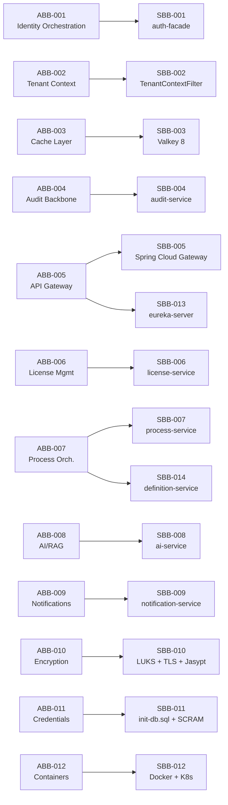

# ABB/SBB Register

## Architecture Building Blocks (ABB)

| ABB ID | ABB Name | Domain | Description | Realized By SBB |
|--------|----------|--------|-------------|-----------------|
| ABB-001 | Identity Orchestration | Application | Provider-agnostic authentication orchestration via BFF pattern; zero-redirect token exchange; session lifecycle management | SBB-001 |
| ABB-002 | Tenant Context Enforcement | Security/Data | Tenant-scoped context injection at gateway; tenant predicate enforcement in all data queries; cross-tenant isolation guarantee | SBB-002 |
| ABB-003 | Distributed Cache Layer | Technology | Shared L2 cache for hot reads, auth tokens, and session data; cache-aside pattern with configurable TTL | SBB-003 |
| ABB-004 | Audit Event Backbone | Integration | Event-driven immutable audit trail; structured audit event capture with tenant, actor, action, and timestamp | SBB-004 |
| ABB-005 | API Gateway and Routing | Application | Centralized traffic routing, rate limiting, tenant context injection via headers, CORS policy enforcement, and BFF session cookie management | SBB-005 |
| ABB-006 | License and Entitlement Management | Application | Master license pool management, tenant-level quota allocation, seat tracking, feature flag enforcement via entitlement checks | SBB-006 |
| ABB-007 | Process Orchestration | Application | BPMN process definition management, tenant-scoped process execution, process instance lifecycle tracking | SBB-007 |
| ABB-008 | AI/RAG Pipeline | Application | Multi-provider AI inference abstraction, retrieval-augmented generation with vector similarity search, tenant-scoped knowledge bases | SBB-008 |
| ABB-009 | Multi-Channel Notification Delivery | Application | Template-driven notification rendering, multi-channel delivery (email, SMS, push), tenant-scoped notification preferences and history | SBB-009 |
| ABB-010 | Encryption Infrastructure | Security | Three-tier encryption: volume-level (at-rest), transport-level (in-transit), config-level (sensitive properties); key management lifecycle | SBB-010 |
| ABB-011 | Credential Management | Security | Per-service database credential provisioning, SCRAM-SHA-256 authentication, credential rotation lifecycle, no shared passwords across services | SBB-011 |
| ABB-012 | Container Orchestration | Technology | Container-based service deployment, environment parity (dev/staging/prod), resource limits, health check probes, horizontal scaling | SBB-012 |

## Solution Building Blocks (SBB)

| SBB ID | SBB Name | Type | Realizes | Owner | Status |
|--------|----------|------|----------|-------|--------|
| SBB-001 | auth-facade + IdentityProvider strategy pattern | Application service | ABB-001 | Platform Team | [IN-PROGRESS] Keycloak provider implemented; Auth0/Okta/Azure AD planned (ADR-007). Token blacklisting wired into logout; features enrichment in login response (Sprint 2+3, 2026-03-08) |
| SBB-002 | TenantContextFilter + tenant-scoped repositories | Code pattern | ABB-002 | Service Teams | [IN-PROGRESS] tenant_id column discrimination implemented; graph-per-tenant planned (ADR-003, ADR-010) |
| SBB-003 | Valkey 8 distributed cache (valkey/valkey:8-alpine) | Platform runtime | ABB-003 | Platform Team | [IN-PROGRESS] Valkey L2 operational; Caffeine L1 in-process cache planned |
| SBB-004 | audit-service + PostgreSQL persistence | Integration runtime | ABB-004 | Platform Team | [IMPLEMENTED] Audit events persisted to PostgreSQL via JPA/@Entity + Flyway migrations |
| SBB-005 | Spring Cloud Gateway + route configuration | Application service | ABB-005 | Platform Team | [IMPLEMENTED] api-gateway at :8080 with route definitions for all backend services; tenant header injection via gateway filters. TokenBlacklistFilter added; tenant-JWT cross-validation; /api/v1/features/** route added (Sprint 2+3, 2026-03-08) |
| SBB-006 | license-service + tenant-service quota API | Application service | ABB-006 | Platform Team | [IN-PROGRESS] license-service exists at :8085 with PostgreSQL; public FeatureGateController added; master tenant bypass implemented; upstream consumers (auth-facade) call feature gate API (Sprint 3, 2026-03-08). ADR-006 merge not implemented |
| SBB-007 | process-service + BPMN engine integration | Application service | ABB-007 | Domain Team | [IN-PROGRESS] process-service exists at :8089 with PostgreSQL; BPMN engine integration in progress. Note: definition-service (SBB-014) also exists at :8090 with Neo4j for object type definitions |
| SBB-008 | ai-service + pgvector + provider adapters | Application service | ABB-008 | Domain Team | [IN-PROGRESS] ai-service exists at :8088 with PostgreSQL + pgvector; provider adapter pattern in development |
| SBB-009 | notification-service + template engine + provider integration | Application service | ABB-009 | Domain Team | [IN-PROGRESS] notification-service exists at :8086 with PostgreSQL; template engine and multi-channel delivery in development |
| SBB-010 | LUKS/FileVault (volume) + TLS 1.3 certificates (transit) + Jasypt AES-256 (config) | Infrastructure | ABB-010 | DevOps Team | [IN-PROGRESS] Jasypt [IMPLEMENTED] across all 8 services (2026-03-08); TLS enabled for PostgreSQL, Neo4j (bolt+s://), and Valkey (Sprint 2, 2026-03-08); volume encryption remains [PLANNED] (ADR-019) |
| SBB-011 | init-db.sql + SCRAM-SHA-256 + per-service environment variables | Infrastructure | ABB-011 | DevOps Team | [IN-PROGRESS] Per-service DB credentials defined in docker-compose.yml; SCRAM-SHA-256 auth configured for PostgreSQL; hardcoded fallback defaults removed; fail-fast on missing env vars verified (2026-03-08); Jasypt encryption integrated; credential rotation not yet automated (ADR-020) |
| SBB-012 | Docker Compose manifests (dev) + Kubernetes Helm charts (target) | Infrastructure | ABB-012 | DevOps Team | [IN-PROGRESS] Docker Compose operational for local development; Kubernetes manifests planned for staging/production (ADR-022) |
| SBB-013 | eureka-server (Spring Cloud Netflix Eureka) | Infrastructure runtime | ABB-005 | Platform Team | [IMPLEMENTED] Service registry at :8761; 10 client services register as Eureka clients (7 with @EnableDiscoveryClient, 3 via classpath auto-config); api-gateway uses `lb://` discovery for all routes; 3/3 tests passing |
| SBB-014 | definition-service (Neo4j-based object type definitions) | Application service | ABB-007 | Domain Team | [IN-PROGRESS] definition-service exists at :8090 with Neo4j (NOT PostgreSQL); uses @Node entities, Neo4jRepository; excludes JDBC auto-config; Eureka-registered; gateway-routed at /api/v1/definitions/** |

## ABB-to-SBB Realization Map

## ADR Traceability

| SBB | Related ADRs |
|-----|-------------|
| SBB-001 | ADR-004 (Keycloak), ADR-007 (Provider-Agnostic), ADR-008 (IDP Consolidation) |
| SBB-002 | ADR-003 (Database-per-Tenant), ADR-010 (Graph-per-Tenant Routing) |
| SBB-003 | ADR-005 (Valkey Caching) |
| SBB-004 | ADR-016 (Polyglot Persistence) |
| SBB-005 | ADR-002 (Spring Boot 3.4) |
| SBB-006 | ADR-006 (Service Merge), ADR-014 (RBAC + Licensing) |
| SBB-007 | ADR-016 (Polyglot Persistence) |
| SBB-008 | ADR-016 (Polyglot Persistence) |
| SBB-009 | ADR-016 (Polyglot Persistence) |
| SBB-010 | ADR-019 (Encryption) |
| SBB-011 | ADR-020 (Credentials) |
| SBB-012 | ADR-022 (Production Parity) |
| SBB-013 | -- (operational standard, no governing ADR; ADR recommended for service discovery technology choice) |
| SBB-014 | ADR-001 (Neo4j Primary), ADR-016 (Polyglot Persistence) |
