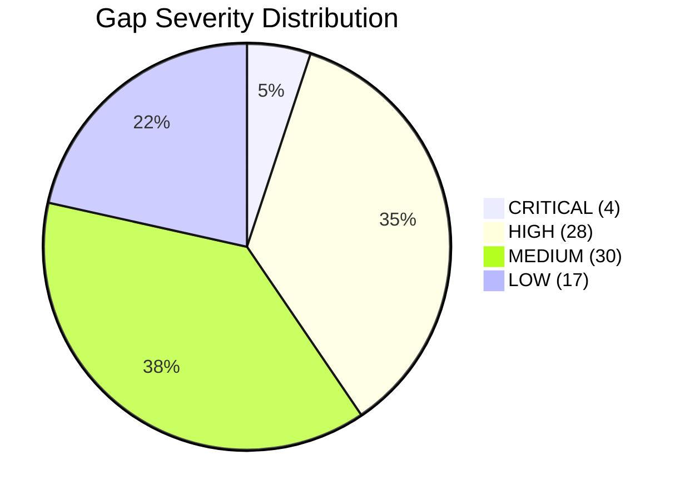
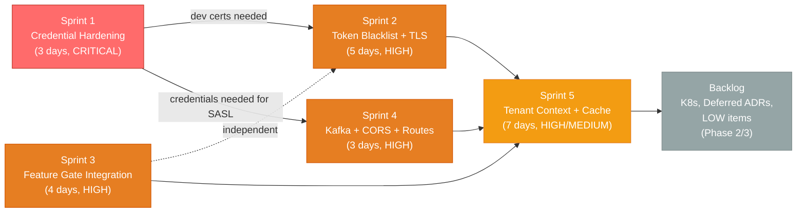
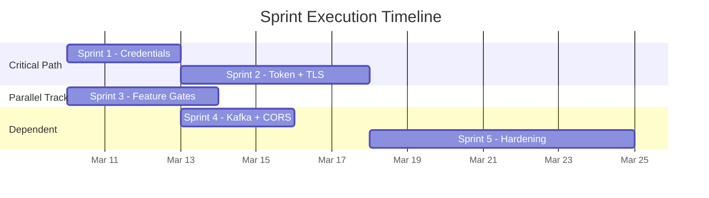

# EMSIST ABB Gap Fix Plan

## Document Control

| Field | Value |
|-------|-------|
| Document | Consolidated Gap Fix Plan |
| Status | [IN-PROGRESS] -- Sprints 1-3 COMPLETED (2026-03-08); Sprints 4-5 PLANNED |
| Author | SA Agent |
| Date | 2026-03-08 |
| Sources | 12 ABB Design Specifications (ABB-001 through ABB-012) |
| Sprint Model | 2-week sprints, priority-ordered |

---

## 1. Executive Summary

The ABB design specification audit across all 12 Architecture Building Blocks identified **79 discrete gaps** between the current codebase state and the target architecture. This plan organizes all gaps into 5 prioritized sprints plus a backlog for deferred items.

### Severity Breakdown



| Severity | Count | Definition |
|----------|-------|------------|
| CRITICAL | 4 | Security vulnerability with immediate exploit risk (hardcoded credentials, password fallbacks) |
| HIGH | 28 | Security gap, missing integration, or broken contract that must be fixed before staging |
| MEDIUM | 30 | Functional gap, hardening, or missing feature that should be fixed before production |
| LOW | 17 | Optimization, deferred architecture migration, or future-phase work |

### Sprint Overview

| Sprint | Focus | Duration | Gaps Addressed | Priority |
|--------|-------|----------|---------------|----------|
| Sprint 1 | Credential Hardening | 3 days | 7 gaps (4 CRITICAL + 2 HIGH + 1 MEDIUM) | COMPLETED 2026-03-08 |
| Sprint 2 | Token Blacklist + TLS | 5 days | 8 gaps (all HIGH) | COMPLETED 2026-03-08 |
| Sprint 3 | Feature Gate Integration | 4 days | 5 gaps (all HIGH) | COMPLETED 2026-03-08 |
| Sprint 4 | Kafka + CORS + Routes | 3 days | 5 gaps (3 HIGH + 2 MEDIUM) | HIGH |
| Sprint 5 | Tenant Context + Cache + Service Hardening | 7 days | 18 gaps (7 HIGH + 11 MEDIUM) | HIGH/MEDIUM |
| Backlog | Deferred Architecture + LOW items | Phase 2/3 | 37 gaps (5 HIGH + 15 MEDIUM + 17 LOW) | MEDIUM/LOW |

---

## 2. Gap Registry

The complete registry of all gaps extracted from ABB-001 through ABB-012, organized by ABB source.

### ABB-001: Identity Orchestration

| Gap ID | Severity | Description | Affected Files | Sprint |
|--------|----------|-------------|----------------|--------|
| GAP-ID-001 (SEC-GAP-001) | HIGH | [COMPLETED] Logout now calls `blacklistToken()` -- access token blacklisted on logout | `backend/auth-facade/src/main/java/com/ems/auth/service/AuthServiceImpl.java` | Sprint 2 |
| GAP-ID-002 (SEC-GAP-002) | HIGH | [COMPLETED] API gateway checks Valkey blacklist for revoked tokens via `TokenBlacklistFilter` | `backend/api-gateway/src/main/java/com/ems/gateway/filter/TokenBlacklistFilter.java` | Sprint 2 |
| GAP-ID-003 | LOW | Auth0, Okta, Azure AD providers not implemented (only Keycloak) | `backend/auth-facade/src/main/java/com/ems/auth/provider/` | Backlog |
| GAP-ID-004 | MEDIUM | MFA signing key has dev default fallback value | `backend/auth-facade/src/main/resources/application.yml` | Sprint 5 |

### ABB-002: Tenant Context Enforcement

| Gap ID | Severity | Description | Affected Files | Sprint |
|--------|----------|-------------|----------------|--------|
| GAP-TC-001 | HIGH | Only auth-facade has `TenantContextFilter` with ThreadLocal; 7 services lack it | `backend/common/` (new), all 7 domain service filter chains | Sprint 5 |
| GAP-TC-002 | HIGH | `TenantAccessValidator` only in auth-facade; other services do not validate JWT tenant claim | `backend/common/`, all domain service security configs | Sprint 5 |
| GAP-TC-003 | MEDIUM | No Hibernate `@FilterDef`/`@Filter` automatic tenant predicate injection | All tenant-scoped JPA entities across 7 services | Sprint 5 |
| GAP-TC-004 | MEDIUM | No Feign `RequestInterceptor` for automatic `X-Tenant-ID` forwarding | `backend/common/` (new interceptor) | Sprint 5 |
| GAP-TC-005 | MEDIUM | Some repository methods lack tenant scope (e.g., `AuditEventRepository.findByUserId`) | `backend/audit-service/src/main/java/com/ems/audit/repository/AuditEventRepository.java` | Sprint 5 |
| GAP-TC-006 | LOW | Physical graph-per-tenant isolation (ADR-003/ADR-010) 0% implemented | Neo4j configuration, auth-facade session factory | Backlog |
| GAP-TC-007 | LOW | `tenant_id` is VARCHAR(50) not native UUID PostgreSQL type | All entity definitions with tenant_id | Backlog |
| GAP-TC-008 | LOW | Cache key `userRoles::{email}` not tenant-scoped (collision risk if same email in multiple tenants) | `backend/auth-facade/src/main/java/com/ems/auth/service/GraphRoleService.java` | Backlog |

### ABB-003: Distributed Cache Layer

| Gap ID | Severity | Description | Affected Files | Sprint |
|--------|----------|-------------|----------------|--------|
| GAP-C-001 | LOW | No L1 Caffeine in-process cache (ADR-005 describes two-tier, only L2 exists) | All service `pom.xml` files, `CacheConfig.java` | Backlog |
| GAP-C-002 | HIGH | [COMPLETED] Logout now calls `blacklistToken()` (same as GAP-ID-001) | `backend/auth-facade/.../service/AuthServiceImpl.java` | Sprint 2 |
| GAP-C-003 | HIGH | [COMPLETED] Gateway checks Valkey for blacklisted tokens via `TokenBlacklistFilter` (same as GAP-ID-002) | `backend/api-gateway/.../filter/TokenBlacklistFilter.java` | Sprint 2 |
| GAP-C-004 | MEDIUM | [COMPLETED] Valkey TLS enabled (`spring.data.redis.ssl.enabled=true`) | All Valkey-consuming services' `application.yml`, Valkey container config | Sprint 2 |
| GAP-C-005 | MEDIUM | No cache metrics/monitoring (Micrometer hit/miss/eviction) | `backend/auth-facade/.../config/CacheConfig.java`, `application.yml` | Sprint 5 |
| GAP-C-006 | LOW | No Valkey cluster/replication (single standalone instance) | `docker-compose.dev-data.yml` | Backlog |
| GAP-C-007 | MEDIUM | api-gateway Valkey not used for rate limiting (connection configured but no filter) | `backend/api-gateway/` (new rate limit filter) | Sprint 5 |

### ABB-004: Audit Event Backbone

| Gap ID | Severity | Description | Affected Files | Sprint |
|--------|----------|-------------|----------------|--------|
| GAP-A-001 | MEDIUM | No Kafka producers in domain services (only HTTP POST for audit events) | 5+ services: add `KafkaTemplate` + `AuditEventPublisher` | Sprint 4 |
| GAP-A-002 | MEDIUM | Kafka consumer disabled by default (`spring.kafka.enabled=false`) | `backend/audit-service/src/main/resources/application.yml` | Sprint 4 |
| GAP-A-003 | LOW | No database-level immutability enforcement (application layer only) | `backend/audit-service/` PostgreSQL trigger or row policy | Backlog |
| GAP-A-004 | MEDIUM | No field-level PII masking in audit `old_values`/`new_values` JSONB | `backend/audit-service/.../service/AuditServiceImpl.java` | Sprint 5 |
| GAP-A-005 | LOW | No automatic master tenant tagging on audit events | `backend/audit-service/.../service/AuditServiceImpl.java` | Backlog |
| GAP-A-006 | LOW | No table partitioning for `audit_events` | `backend/audit-service/src/main/resources/db/migration/` | Backlog |
| GAP-A-007 | LOW | No cold storage archival for aged audit events | New: S3/blob export job | Backlog |
| GAP-A-008 | MEDIUM | Shared `master_db` database (should be dedicated `audit_db`) | `backend/audit-service/.../application.yml`, `init-db.sh` | Sprint 5 |

### ABB-005: API Gateway and Routing

| Gap ID | Severity | Description | Affected Files | Sprint |
|--------|----------|-------------|----------------|--------|
| GAP-GW-001 | HIGH | [COMPLETED] `/api/v1/features/**` route added to gateway | `backend/api-gateway/.../config/RouteConfig.java` | Sprint 3 |
| GAP-GW-002 | HIGH | [COMPLETED] Token blacklist check added in gateway via `TokenBlacklistFilter` (same as GAP-ID-002) | `backend/api-gateway/.../filter/TokenBlacklistFilter.java` | Sprint 2 |
| GAP-GW-003 | MEDIUM | No gateway-level rate limiting (Valkey connection exists, no filter) | `backend/api-gateway/` (new filter) | Sprint 5 |
| GAP-GW-004 | HIGH | Only localhost CORS origins (production domains not configured) | `backend/api-gateway/.../config/CorsConfig.java` | Sprint 4 |
| GAP-GW-005 | MEDIUM | `@Profile("!docker")` on RouteConfig means no routes in Docker profile | `backend/api-gateway/.../config/RouteConfig.java` | Sprint 4 |
| GAP-GW-006 | MEDIUM | [COMPLETED] Tenant header cross-validated against JWT `tenant_id` claim | `backend/api-gateway/.../filter/TenantContextFilter.java` | Sprint 2 |

### ABB-006: License and Entitlement Management

| Gap ID | Severity | Description | Affected Files | Sprint |
|--------|----------|-------------|----------------|--------|
| GAP-L-001 | HIGH | [COMPLETED] Public `FeatureGateController` added with gateway route | `backend/api-gateway/.../config/RouteConfig.java`, `backend/license-service/.../controller/FeatureGateController.java` | Sprint 3 |
| GAP-L-002 | HIGH | [COMPLETED] Upstream consumers (auth-facade) call the feature gate API | `backend/auth-facade/.../client/LicenseServiceClient.java` | Sprint 3 |
| GAP-L-003 | HIGH | [COMPLETED] `getUserFeatures()` Feign method added to auth-facade | `backend/auth-facade/.../client/LicenseServiceClient.java` | Sprint 3 |
| GAP-L-004 | HIGH | [COMPLETED] Master tenant "all features" bypass implemented in feature gate | `backend/license-service/.../service/FeatureGateServiceImpl.java` | Sprint 3 |
| GAP-L-005 | HIGH | [COMPLETED] Auth response includes `authorization.features` | `backend/auth-facade/.../service/AuthServiceImpl.java`, auth response DTO | Sprint 3 |
| GAP-L-006 | MEDIUM | No `@FeatureGate` backend AOP annotation for declarative feature gating | `backend/common/` (new annotation + aspect) | Backlog |
| GAP-L-007 | MEDIUM | No cache invalidation on license import (TTL-only for feature cache) | `backend/license-service/.../service/LicenseImportServiceImpl.java` | Sprint 5 |
| GAP-L-008 | LOW | Service merge with tenant-service not implemented (ADR-006) | Entire `backend/license-service/` | Backlog |
| GAP-L-009 | LOW | Shared `master_db` (should be dedicated `license_db`) | `backend/license-service/.../application.yml` | Backlog |

### ABB-007: Process Orchestration

| Gap ID | Severity | Description | Affected Files | Sprint |
|--------|----------|-------------|----------------|--------|
| GAP-P-001 | HIGH | No `ProcessDefinition` entity or API (core feature missing) | `backend/process-service/` (new entity, repo, service, controller) | Backlog |
| GAP-P-002 | HIGH | No `ProcessInstance` entity or execution engine | `backend/process-service/` (new entity, repo, service) | Backlog |
| GAP-P-003 | HIGH | No `TaskAssignment` entity for human task management | `backend/process-service/` (new entity, repo, service, controller) | Backlog |
| GAP-P-004 | MEDIUM | Cache uses `spring.cache.type: simple` (in-memory), not Valkey | `backend/process-service/src/main/resources/application.yml`, new `RedisConfig.java` | Sprint 5 |
| GAP-P-005 | MEDIUM | API path `/api/process/element-types` has no `/v1/` version prefix | `backend/process-service/.../controller/BpmnElementTypeController.java` | Sprint 5 |
| GAP-P-006 | MEDIUM | Security config `requestMatchers` path mismatch with actual controller path | `backend/process-service/.../config/SecurityConfig.java` | Sprint 5 |
| GAP-P-007 | LOW | No Feign client to ai-service for BPMN decision points | `backend/process-service/` (new Feign client) | Backlog |
| GAP-P-008 | LOW | No Feign client to notification-service for task notifications | `backend/process-service/` (new Feign client) | Backlog |
| GAP-P-009 | LOW | No Kafka config for process lifecycle event publishing | `backend/process-service/pom.xml`, `application.yml` | Backlog |

### ABB-008: AI/RAG Pipeline

| Gap ID | Severity | Description | Affected Files | Sprint |
|--------|----------|-------------|----------------|--------|
| GAP-AI-001 | HIGH | [COMPLETED] ai-service PostgreSQL JDBC URL has `sslmode=verify-full` | `backend/ai-service/src/main/resources/application.yml` | Sprint 2 |
| GAP-AI-002 | HIGH | No prompt injection defense (raw user input passes to LLM) | `backend/ai-service/.../service/ConversationServiceImpl.java` | Sprint 5 |
| GAP-AI-003 | MEDIUM | No PII detection/sanitization in knowledge source ingestion | `backend/ai-service/.../service/RagServiceImpl.java` | Sprint 5 |
| GAP-AI-004 | MEDIUM | Per-tenant token billing/quota not enforced (`agent_usage_stats` table exists, no logic) | `backend/ai-service/.../service/ConversationServiceImpl.java` | Backlog |
| GAP-AI-005 | MEDIUM | [COMPLETED] No Jasypt encryption for API keys (plaintext env vars) | `backend/ai-service/pom.xml`, new `JasyptConfig.java` | Sprint 1 |
| GAP-AI-006 | LOW | DOCX support declared in enum but not implemented | `backend/ai-service/.../service/RagServiceImpl.java` | Backlog |
| GAP-AI-007 | LOW | URL knowledge source type declared but not implemented | `backend/ai-service/.../service/RagServiceImpl.java` | Backlog |

### ABB-009: Multi-Channel Notification Delivery

| Gap ID | Severity | Description | Affected Files | Sprint |
|--------|----------|-------------|----------------|--------|
| GAP-N-001 | MEDIUM | Push notification `sendPushNotification()` has TODO (Firebase/APNs) | `backend/notification-service/.../service/NotificationServiceImpl.java` | Backlog |
| GAP-N-002 | LOW | SMS `sendSms()` has TODO (Twilio) | `backend/notification-service/.../service/NotificationServiceImpl.java` | Backlog |
| GAP-N-003 | LOW | Quiet hours enforcement logic not implemented (model exists) | `backend/notification-service/.../service/NotificationServiceImpl.java` | Backlog |
| GAP-N-004 | LOW | Digest aggregation not implemented (model exists) | `backend/notification-service/` (new scheduler job) | Backlog |
| GAP-N-005 | MEDIUM | No domain services publish to `notification-events` Kafka topic | Same as GAP-A-001 scope | Sprint 4 |
| GAP-N-006 | MEDIUM | No WebSocket for real-time in-app notification push | `backend/notification-service/` (new WebSocket endpoint) | Backlog |
| GAP-N-007 | LOW | `NotificationPreferenceEntity` and `NotificationTemplateEntity` missing `@Version` | Entity files | Sprint 5 |

### ABB-010: Encryption Infrastructure

| Gap ID | Severity | Description | Affected Files | Sprint |
|--------|----------|-------------|----------------|--------|
| GAP-T2-01 | HIGH | [COMPLETED] ai-service PostgreSQL SSL (`sslmode=verify-full`) configured | `backend/ai-service/src/main/resources/application.yml` | Sprint 2 |
| GAP-T2-02 | HIGH | [COMPLETED] Neo4j Bolt TLS (`bolt+s://`) enabled | `docker-compose.dev-app.yml`, `backend/auth-facade/.../application.yml` | Sprint 2 |
| GAP-T2-03 | HIGH | [COMPLETED] Valkey TLS enabled (`--tls-port`, `ssl.enabled=true`) | `docker-compose.dev-data.yml`, all Valkey-consuming services' `application.yml` | Sprint 2 |
| GAP-T2-04 | MEDIUM | Kafka plaintext (`PLAINTEXT://` not `SASL_SSL://`) | `docker-compose.dev-data.yml`, all Kafka consumer `application.yml` | Sprint 4 |
| GAP-T2-05 | HIGH | [COMPLETED] PostgreSQL server-side TLS enabled (`ssl=on`) | `docker-compose.dev-data.yml`, PostgreSQL config | Sprint 2 |
| GAP-T2-06 | HIGH | [COMPLETED] No dev certificate generation script | New: `scripts/generate-dev-certs.sh` | Sprint 1 |
| GAP-T3-01 | HIGH | [COMPLETED] Jasypt missing in 7 services (only auth-facade has it) | 7 services: `pom.xml` + new `JasyptConfig.java` each | Sprint 1 |
| GAP-T1-01 | MEDIUM | No volume encryption verification (LUKS/FileVault check) | New: startup verification script | Backlog |

### ABB-011: Credential Management

| Gap ID | Severity | Description | Affected Files | Sprint |
|--------|----------|-------------|----------------|--------|
| GAP-CR-01 | CRITICAL | [COMPLETED] Hardcoded fallback `${DATABASE_PASSWORD:postgres}` in 6 services | `backend/{tenant,user,license,notification,audit,process}-service/src/main/resources/application.yml` | Sprint 1 |
| GAP-CR-02 | MEDIUM | [COMPLETED] Neo4j hardcoded password fallback in Docker Compose | `docker-compose.dev-app.yml`, `docker-compose.staging-app.yml` | Sprint 1 |
| GAP-CR-03 | MEDIUM | Valkey no AUTH password | `docker-compose.dev-data.yml`, all Valkey clients' `application.yml` | Backlog |
| GAP-CR-04 | CRITICAL | [COMPLETED] ai-service uses different env var names (`DB_USERNAME` not `DATABASE_USER`) and has no fallback protection | `backend/ai-service/src/main/resources/application.yml`, Docker Compose env blocks | Sprint 1 |
| GAP-CR-05 | LOW | [COMPLETED] Neo4j compose has `NEO4J_PASSWORD:-dev_neo4j_password` fallback default | `docker-compose.dev-app.yml` | Sprint 1 |
| GAP-CR-06 | LOW | No HashiCorp Vault for production credential rotation | Infrastructure (Phase 2) | Backlog |
| GAP-CR-07 | MEDIUM | No credential rotation runbook | New: `docs/operations/credential-rotation-runbook.md` | Backlog |

### ABB-012: Container Orchestration

| Gap ID | Severity | Description | Affected Files | Sprint |
|--------|----------|-------------|----------------|--------|
| GAP-O-01 | HIGH | No Kubernetes manifests (Docker Compose only) | New: `infrastructure/k8s/` directory tree | Backlog |
| GAP-O-02 | HIGH | No CloudNativePG operator for PostgreSQL HA | New: `infrastructure/k8s/data/postgresql/cluster.yaml` | Backlog |
| GAP-O-03 | HIGH | No Strimzi operator for Kafka HA | New: `infrastructure/k8s/data/kafka/kafka.yaml` | Backlog |
| GAP-O-04 | HIGH | No Valkey Sentinel StatefulSet | New: `infrastructure/k8s/data/valkey/statefulset.yaml` | Backlog |
| GAP-O-05 | MEDIUM | No Kubernetes NetworkPolicies | New: `infrastructure/k8s/base/network-policies/` | Backlog |
| GAP-O-06 | MEDIUM | No HPA or PDB for any service | New: per-service `hpa.yaml` + `pdb.yaml` | Backlog |
| GAP-O-07 | HIGH | No container image CI/CD pipeline | New: `.github/workflows/docker-build.yml` | Backlog |
| GAP-O-08 | LOW | No multi-region DR | Phase 3 architecture | Backlog |
| GAP-O-09 | MEDIUM | Containers run as root (no `user:` directive) | All Dockerfiles | Backlog |
| GAP-O-10 | LOW | Prometheus/Grafana not in tier-split Compose | `docker-compose.dev-data.yml` or new monitoring Compose | Backlog |

---

## 3. Sprint Plans

### Sprint 1: CRITICAL -- Credential Hardening [COMPLETED 2026-03-08]

**Duration:** 3 days
**Priority:** CRITICAL
**Prerequisites:** None
**Gaps Addressed:** GAP-CR-01, GAP-CR-04, GAP-CR-02, GAP-CR-05, GAP-T3-01, GAP-T2-06

#### Tasks

| # | Task | Gaps | Files to Modify | Effort |
|---|------|------|----------------|--------|
| 1.1 | Remove `${DATABASE_PASSWORD:postgres}` fallback from 6 services (fail-fast) | GAP-CR-01 | `backend/{tenant,user,license,notification,audit,process}-service/src/main/resources/application.yml` | 2h |
| 1.2 | Standardize ai-service env vars (`DB_USERNAME` to `DATABASE_USER`, remove fallback) | GAP-CR-04 | `backend/ai-service/src/main/resources/application.yml`, `docker-compose.dev-app.yml` env block | 1h |
| 1.3 | Remove Neo4j hardcoded password fallback in Compose files | GAP-CR-02, GAP-CR-05 | `docker-compose.dev-app.yml`, `docker-compose.staging-app.yml` | 30m |
| 1.4 | Add `jasypt-spring-boot-starter` dependency to 7 remaining services | GAP-T3-01 | Each service `pom.xml` (7 files) | 2h |
| 1.5 | Create `JasyptConfig.java` in 7 services (pattern from auth-facade) | GAP-T3-01 | 7 new files: `backend/{service}/src/main/java/com/ems/{pkg}/config/JasyptConfig.java` | 3h |
| 1.6 | Create dev certificate generation script | GAP-T2-06 | New: `scripts/generate-dev-certs.sh` | 4h |

#### Verification Criteria

```bash
# 1.1 + 1.2: Services must fail-fast when env vars are missing
# Start service without DATABASE_PASSWORD -- must get PlaceholderResolutionException
grep -c ":postgres}" backend/*/src/main/resources/application.yml
# Expected: 0 (no fallback defaults remain)

# 1.3: No fallback passwords in compose
grep -c ":-dev_neo4j" docker-compose.dev-app.yml
# Expected: 0

# 1.4 + 1.5: Jasypt config exists in all 8 services
find backend/*/src/main/java -name "JasyptConfig.java" | wc -l
# Expected: 8

# 1.6: Dev cert script exists and runs
ls scripts/generate-dev-certs.sh
bash scripts/generate-dev-certs.sh --dry-run
```

---

### Sprint 2: HIGH -- Token Blacklist + TLS [COMPLETED 2026-03-08]

**Duration:** 5 days
**Priority:** HIGH
**Prerequisites:** Sprint 1 (dev cert script needed for TLS)
**Gaps Addressed:** GAP-ID-001/GAP-C-002, GAP-ID-002/GAP-C-003/GAP-GW-002, GAP-GW-006, GAP-T2-01/GAP-AI-001, GAP-T2-02, GAP-T2-03/GAP-C-004, GAP-T2-05

#### Tasks

| # | Task | Gaps | Files to Modify | Effort |
|---|------|------|----------------|--------|
| 2.1 | Wire `tokenService.blacklistToken()` into `AuthServiceImpl.logout()` | GAP-ID-001, GAP-C-002 | `backend/auth-facade/src/main/java/com/ems/auth/service/AuthServiceImpl.java` | 2h |
| 2.2 | Add Valkey blacklist check filter in api-gateway | GAP-ID-002, GAP-C-003, GAP-GW-002 | `backend/api-gateway/src/main/java/com/ems/gateway/filter/TokenBlacklistFilter.java` (new), `SecurityConfig.java` | 4h |
| 2.3 | Cross-validate `X-Tenant-ID` header against JWT `tenant_id` claim in gateway | GAP-GW-006 | `backend/api-gateway/src/main/java/com/ems/gateway/filter/TenantContextFilter.java` | 3h |
| 2.4 | Add `sslmode=verify-full` to ai-service JDBC URL | GAP-T2-01, GAP-AI-001 | `backend/ai-service/src/main/resources/application.yml` | 30m |
| 2.5 | Enable PostgreSQL server-side TLS (`ssl=on` with mounted certs) | GAP-T2-05 | `docker-compose.dev-data.yml`, PostgreSQL config volume mount | 4h |
| 2.6 | Enable Neo4j Bolt TLS (`bolt+s://`) | GAP-T2-02 | Neo4j docker config, `backend/auth-facade/src/main/resources/application.yml`, `docker-compose.dev-app.yml` | 4h |
| 2.7 | Enable Valkey TLS (`--tls-port 6379`) | GAP-T2-03, GAP-C-004 | `docker-compose.dev-data.yml`, all Valkey-consuming services' `application.yml` (3 services + gateway) | 4h |

#### Verification Criteria

```bash
# 2.1: After logout, token should be rejected
# Test: POST /api/v1/auth/login -> get token -> POST /api/v1/auth/logout
#   -> Use same token -> expect 401

# 2.2: Gateway checks blacklist
# Test: Blacklist a JTI in Valkey manually, send request -> expect 401

# 2.3: Mismatched tenant header + JWT should fail
# Test: Send X-Tenant-ID that differs from JWT tenant_id claim -> expect 403

# 2.4: ai-service connects with SSL
grep "sslmode=verify-full" backend/ai-service/src/main/resources/application.yml
# Expected: match found

# 2.5-2.7: TLS connections verified
openssl s_client -connect localhost:25432 < /dev/null 2>&1 | grep "SSL handshake"
openssl s_client -connect localhost:27687 < /dev/null 2>&1 | grep "SSL handshake"
openssl s_client -connect localhost:26379 < /dev/null 2>&1 | grep "SSL handshake"
```

---

### Sprint 3: HIGH -- Feature Gate Integration [COMPLETED 2026-03-08]

**Duration:** 4 days
**Priority:** HIGH
**Prerequisites:** None (independent, can run in parallel with Sprint 2)
**Gaps Addressed:** GAP-GW-001, GAP-L-001, GAP-L-002, GAP-L-003, GAP-L-004, GAP-L-005

#### Tasks

| # | Task | Gaps | Files to Modify | Effort |
|---|------|------|----------------|--------|
| 3.1 | Move `FeatureGateController` from `/api/v1/internal/features/**` to `/api/v1/features/**` (or add a public facade route) | GAP-L-001 | `backend/license-service/src/main/java/com/ems/license/controller/FeatureGateController.java` | 2h |
| 3.2 | Add `/api/v1/features/**` gateway route to license-service | GAP-GW-001 | `backend/api-gateway/src/main/java/com/ems/gateway/config/RouteConfig.java` | 1h |
| 3.3 | Add `getUserFeatures(tenantId)` Feign method to `LicenseServiceClient` | GAP-L-003 | `backend/auth-facade/src/main/java/com/ems/auth/client/LicenseServiceClient.java` | 2h |
| 3.4 | Add master tenant "all features" bypass in `FeatureGateServiceImpl` | GAP-L-004 | `backend/license-service/src/main/java/com/ems/license/service/FeatureGateServiceImpl.java` | 2h |
| 3.5 | Include `authorization.features` in auth-facade login response | GAP-L-002, GAP-L-005 | `backend/auth-facade/src/main/java/com/ems/auth/service/AuthServiceImpl.java`, auth response DTO | 4h |

#### Verification Criteria

```bash
# 3.1 + 3.2: Feature gate accessible through gateway
# Test: GET /api/v1/features/check?featureKey=advanced_workflows
#   with valid JWT and X-Tenant-ID -> expect 200

# 3.3: Feign client method exists
grep "getUserFeatures" backend/auth-facade/src/main/java/com/ems/auth/client/LicenseServiceClient.java
# Expected: method declaration found

# 3.4: Master tenant gets all features
# Test: GET /api/v1/features/tenant with master tenant ID -> expect all features enabled

# 3.5: Login response includes features
# Test: POST /api/v1/auth/login -> response body contains "features" or "authorization" key
```

---

### Sprint 4: HIGH -- Kafka + CORS + Routes [PLANNED]

**Duration:** 3 days
**Priority:** HIGH
**Prerequisites:** Sprint 1 (Kafka SASL needs credential infrastructure)
**Gaps Addressed:** GAP-A-001, GAP-A-002, GAP-N-005, GAP-GW-004, GAP-GW-005

#### Tasks

| # | Task | Gaps | Files to Modify | Effort |
|---|------|------|----------------|--------|
| 4.1 | Add `KafkaTemplate` + `AuditEventPublisher` to 5 domain services | GAP-A-001, GAP-N-005 | 5 services: `pom.xml` + new publisher class each (auth-facade, tenant-service, user-service, license-service, notification-service) | 8h |
| 4.2 | Enable Kafka consumer in audit-service (`spring.kafka.enabled=true` by default or new profile) | GAP-A-002 | `backend/audit-service/src/main/resources/application.yml` | 1h |
| 4.3 | Add production CORS origins (configurable via env var) | GAP-GW-004 | `backend/api-gateway/src/main/java/com/ems/gateway/config/CorsConfig.java` | 2h |
| 4.4 | Fix Docker-profile route config (create `@Profile("docker")` RouteConfig or remove profile restriction) | GAP-GW-005 | `backend/api-gateway/src/main/java/com/ems/gateway/config/RouteConfig.java` | 2h |

#### Verification Criteria

```bash
# 4.1: Kafka producers exist in domain services
grep -rl "KafkaTemplate" backend/*/src/main/java/ | wc -l
# Expected: >= 5

# 4.2: Audit-service Kafka consumer enabled
# Test: Publish to audit-events Kafka topic -> verify audit-service consumes and persists

# 4.3: Production CORS origins configurable
grep "CORS_ALLOWED_ORIGINS\|cors.allowed-origins" backend/api-gateway/src/main/resources/application.yml
# Expected: externalized via env var

# 4.4: Routes work in docker profile
# Test: docker compose up -> verify API gateway routes work (not empty)
```

---

### Sprint 5: HIGH/MEDIUM -- Tenant Context + Cache + Service Hardening [PLANNED]

**Duration:** 7 days
**Priority:** HIGH/MEDIUM
**Prerequisites:** Sprints 1-4 complete
**Gaps Addressed:** 18 gaps across ABB-002, ABB-003, ABB-004, ABB-007, ABB-008, ABB-009

#### 5A: Tenant Context Hardening (HIGH)

| # | Task | Gaps | Files to Modify | Effort |
|---|------|------|----------------|--------|
| 5A.1 | Extract common `TenantContextFilter` to `backend/common` module | GAP-TC-001 | `backend/common/` (new filter), 7 service security configs | 4h |
| 5A.2 | Extract `TenantAccessValidator` to `backend/common` and apply to all services | GAP-TC-002 | `backend/common/` (new validator), 7 service security configs | 4h |
| 5A.3 | Add Hibernate `@FilterDef`/`@Filter` for automatic tenant predicate | GAP-TC-003 | All tenant-scoped JPA entity classes (estimated 15+ entities) | 6h |
| 5A.4 | Create Feign `RequestInterceptor` for `X-Tenant-ID` forwarding | GAP-TC-004 | `backend/common/` (new interceptor), `application.yml` of Feign consumers | 2h |
| 5A.5 | Add tenant scope to `AuditEventRepository` methods lacking it | GAP-TC-005 | `backend/audit-service/.../repository/AuditEventRepository.java` | 1h |

#### 5B: Cache + Monitoring

| # | Task | Gaps | Files to Modify | Effort |
|---|------|------|----------------|--------|
| 5B.1 | Add Micrometer cache metrics for Valkey | GAP-C-005 | `backend/auth-facade/.../config/CacheConfig.java`, `application.yml` | 2h |
| 5B.2 | Implement gateway rate limiting filter using Valkey | GAP-C-007, GAP-GW-003 | `backend/api-gateway/` (new `RateLimitFilter.java`) | 4h |
| 5B.3 | Dedicated `audit_db` for audit-service (separate from `master_db`) | GAP-A-008 | `backend/audit-service/.../application.yml`, `init-db.sh` | 2h |
| 5B.4 | Add PII masking for audit event `old_values`/`new_values` | GAP-A-004 | `backend/audit-service/.../service/AuditServiceImpl.java` | 3h |

#### 5C: Process + Notification + AI Fixes

| # | Task | Gaps | Files to Modify | Effort |
|---|------|------|----------------|--------|
| 5C.1 | Migrate process-service cache from `simple` to Valkey (Spring Data Redis) | GAP-P-004 | `backend/process-service/pom.xml`, `application.yml`, new `RedisConfig.java` | 2h |
| 5C.2 | Fix process-service API path to include `/v1/` prefix | GAP-P-005 | `backend/process-service/.../controller/BpmnElementTypeController.java` | 1h |
| 5C.3 | Fix process-service SecurityConfig `requestMatchers` path mismatch | GAP-P-006 | `backend/process-service/.../config/SecurityConfig.java` | 30m |
| 5C.4 | Add prompt injection defense to ai-service | GAP-AI-002 | `backend/ai-service/.../service/ConversationServiceImpl.java` (new sanitizer class) | 4h |
| 5C.5 | Add PII sanitization to ai-service knowledge ingestion | GAP-AI-003 | `backend/ai-service/.../service/RagServiceImpl.java` (new PII scanner) | 4h |
| 5C.6 | Add `@Version` to notification entities missing it | GAP-N-007 | `NotificationPreferenceEntity.java`, `NotificationTemplateEntity.java` | 30m |
| 5C.7 | Add cache invalidation on license import | GAP-L-007 | `backend/license-service/.../service/LicenseImportServiceImpl.java` | 1h |
| 5C.8 | Remove MFA signing key dev default | GAP-ID-004 | `backend/auth-facade/src/main/resources/application.yml` | 30m |

#### Verification Criteria

```bash
# 5A.1: TenantContextFilter in all services
find backend/*/src/main/java -path "*/filter/TenantContextFilter.java" | wc -l
# Expected: >= 8 (or 1 in common + registered in all)

# 5A.3: @Filter annotation on entities
grep -rl "@Filter" backend/*/src/main/java/ | wc -l
# Expected: >= 15

# 5B.2: Gateway rate limit filter exists
ls backend/api-gateway/src/main/java/com/ems/gateway/filter/RateLimitFilter.java

# 5C.1: Process service uses Valkey cache
grep "redis" backend/process-service/src/main/resources/application.yml
# Expected: spring.data.redis config present

# 5C.4: Prompt injection defense exists
grep -rl "PromptSanitizer\|sanitize" backend/ai-service/src/main/java/ | wc -l
# Expected: >= 1
```

---

## 4. Sprint Dependency Graph



### Parallelism Opportunities



**Key insight:** Sprint 3 (Feature Gate Integration) has no dependencies on Sprint 1 or Sprint 2. It can start immediately and run in parallel, reducing overall timeline.

---

## 5. Verification Criteria Summary

| Sprint | Pass Criteria | Test Method |
|--------|--------------|-------------|
| Sprint 1 | Zero hardcoded password fallbacks in `application.yml`; all 8 services have JasyptConfig; `generate-dev-certs.sh` executes successfully | `grep ":postgres}" backend/*/src/main/resources/application.yml` returns 0 matches; `find ... -name JasyptConfig.java` returns 8; script exits 0 |
| Sprint 2 | Blacklisted token returns 401; all data store connections use TLS; ai-service has `sslmode=verify-full` | Integration test: logout + reuse token; `openssl s_client` connects to PG, Neo4j, Valkey |
| Sprint 3 | Login response includes `features` array; master tenant gets all features; `/api/v1/features/check` accessible via gateway | API test: login as regular tenant -> check features in response; login as master -> all features enabled |
| Sprint 4 | Audit events flow through Kafka; production CORS domain accepted; Docker-profile routes functional | Integration test: domain service publishes audit event -> audit-service persists via Kafka consumer; CORS test with production origin |
| Sprint 5 | `TenantContextFilter` in all services; Hibernate `@Filter` annotations present; gateway rate limiter functional; process-service uses Valkey | Code search for filter registrations; load test hitting rate limit; process-service health check with Valkey connected |

---

## 6. Backlog (LOW Priority + Phase 2/3)

These items are deferred to future phases. They do not block staging or production readiness for the current feature set.

### Phase 2: Kubernetes Migration (LOW/MEDIUM)

| Gap ID | Description | Effort | Reference |
|--------|-------------|--------|-----------|
| GAP-O-01 | Kubernetes manifests + Helm charts | 10d | ADR-018 Phase 2 |
| GAP-O-02 | CloudNativePG operator for PostgreSQL HA | 3d | ADR-018 Phase 2 |
| GAP-O-03 | Strimzi Kafka operator | 3d | ADR-018 Phase 2 |
| GAP-O-04 | Valkey Sentinel StatefulSet | 2d | ADR-018 Phase 2 |
| GAP-O-05 | Kubernetes NetworkPolicies | 2d | ADR-018 |
| GAP-O-06 | HPA + PDB for all services | 2d | ADR-018 Phase 2 |
| GAP-O-07 | Container image CI/CD pipeline | 3d | DevOps |
| GAP-O-09 | Non-root containers | 1d | Security hardening |
| GAP-CR-06 | HashiCorp Vault for production credentials | 5d | ADR-018 |

### Phase 2: Feature Completeness (MEDIUM)

| Gap ID | Description | Effort | Reference |
|--------|-------------|--------|-----------|
| GAP-P-001 | ProcessDefinition entity + API | 5d | ABB-007 core feature |
| GAP-P-002 | ProcessInstance entity + execution engine | 8d | ABB-007 core feature |
| GAP-P-003 | TaskAssignment entity + management | 5d | ABB-007 core feature |
| GAP-L-006 | `@FeatureGate` backend AOP annotation | 2d | ADR-014 |
| GAP-N-001 | Push notifications (Firebase/APNs) | 3d | ABB-009 |
| GAP-N-006 | WebSocket for real-time notifications | 3d | ABB-009 |
| GAP-AI-004 | Per-tenant token billing/quotas | 3d | ABB-008 |
| GAP-T2-04 | Kafka SASL_SSL | 3d | ABB-010 |

### Phase 3: Deferred Architecture (LOW)

| Gap ID | Description | Effort | Reference |
|--------|-------------|--------|-----------|
| GAP-TC-006 | Graph-per-tenant physical isolation (ADR-003) | 15d | ADR-003, ADR-010 |
| GAP-ID-003 | Auth0/Okta/Azure AD providers | 10d | ADR-007 |
| GAP-L-008 | Service merge (license + tenant per ADR-006) | 10d | ADR-006 |
| GAP-C-001 | Caffeine L1 two-tier cache | 3d | ADR-005 |
| GAP-C-006 | Valkey cluster/replication | 3d | ADR-005 |
| GAP-O-08 | Multi-region DR | 15d | ADR-018 Phase 3 |
| GAP-A-003 | Database-level audit immutability trigger | 2d | Compliance |
| GAP-A-006 | Audit table partitioning by timestamp | 2d | Performance |
| GAP-A-007 | Cold storage archival (S3) | 3d | Cost optimization |
| GAP-TC-007 | Migrate tenant_id from VARCHAR to native UUID type | 3d | Data integrity |
| GAP-TC-008 | Make cache keys explicitly tenant-scoped | 1d | Cache safety |
| GAP-CR-07 | Credential rotation runbook | 1d | Operations |
| GAP-O-10 | Prometheus in tier-split Compose | 1d | Observability |
| GAP-L-009 | Dedicated `license_db` database | 1d | Best practice |
| GAP-A-005 | Auto master tenant tagging in audit | 1d | ADR-014 |
| GAP-N-002 | SMS delivery (Twilio) | 3d | ABB-009 |
| GAP-N-003 | Quiet hours enforcement | 1d | ABB-009 |
| GAP-N-004 | Digest aggregation | 2d | ABB-009 |
| GAP-P-007 | Process to AI Feign client | 2d | ABB-007 |
| GAP-P-008 | Process to Notification Feign client | 2d | ABB-007 |
| GAP-P-009 | Process Kafka event publishing | 2d | ABB-007 |
| GAP-AI-006 | DOCX knowledge source support | 1d | ABB-008 |
| GAP-AI-007 | URL knowledge source support | 2d | ABB-008 |
| GAP-T1-01 | Volume encryption verification script | 2d | ABB-010 |
| GAP-CR-03 | Valkey AUTH password | 1d | TD-13 |
| GAP-CR-05 | Remove Neo4j password fallback in compose | 30m | ABB-011 |

---

## 7. Cross-ABB Impact Matrix

Certain gaps span multiple ABBs. The following matrix shows which sprints address which ABBs.

| ABB | Sprint 1 | Sprint 2 | Sprint 3 | Sprint 4 | Sprint 5 | Backlog |
|-----|----------|----------|----------|----------|----------|---------|
| ABB-001 Identity | | GAP-ID-001, GAP-ID-002 | | | GAP-ID-004 | GAP-ID-003 |
| ABB-002 Tenant | | | | | GAP-TC-001 to GAP-TC-005 | GAP-TC-006 to GAP-TC-008 |
| ABB-003 Cache | | GAP-C-002, GAP-C-003, GAP-C-004 | | | GAP-C-005, GAP-C-007 | GAP-C-001, GAP-C-006 |
| ABB-004 Audit | | | | GAP-A-001, GAP-A-002 | GAP-A-004, GAP-A-008 | GAP-A-003, GAP-A-005 to GAP-A-007 |
| ABB-005 Gateway | | GAP-GW-002, GAP-GW-006 | GAP-GW-001 | GAP-GW-004, GAP-GW-005 | GAP-GW-003 | |
| ABB-006 License | | | GAP-L-001 to GAP-L-005 | | GAP-L-007 | GAP-L-006, GAP-L-008, GAP-L-009 |
| ABB-007 Process | | | | | GAP-P-004 to GAP-P-006 | GAP-P-001 to GAP-P-003, GAP-P-007 to GAP-P-009 |
| ABB-008 AI/RAG | GAP-AI-005 | GAP-AI-001 | | | GAP-AI-002, GAP-AI-003 | GAP-AI-004, GAP-AI-006, GAP-AI-007 |
| ABB-009 Notification | | | | GAP-N-005 | GAP-N-007 | GAP-N-001 to GAP-N-004, GAP-N-006 |
| ABB-010 Encryption | GAP-T2-06, GAP-T3-01 | GAP-T2-01 to GAP-T2-03, GAP-T2-05 | | GAP-T2-04 | | GAP-T1-01 |
| ABB-011 Credentials | GAP-CR-01, GAP-CR-02, GAP-CR-04, GAP-CR-05 | | | | | GAP-CR-03, GAP-CR-06, GAP-CR-07 |
| ABB-012 Orchestration | | | | | | GAP-O-01 to GAP-O-10 |

---

## 8. Risk Register

| Risk | Probability | Impact | Mitigation |
|------|------------|--------|-----------|
| Sprint 1 breaks services that lack proper `.env` files | HIGH | HIGH | Document `.env.dev` setup thoroughly; update `CONTRIBUTING.md`; run integration test suite after changes |
| TLS certificate generation complexity for dev environments | MEDIUM | MEDIUM | Provide `scripts/generate-dev-certs.sh` with clear usage instructions; test on macOS + Linux |
| Feature gate route change breaks existing frontend calls | LOW | HIGH | Coordinate with frontend team; add backward-compatible alias route if needed |
| Kafka producer addition increases service startup time | LOW | MEDIUM | Use `@ConditionalOnProperty` to disable Kafka in local dev mode |
| Hibernate `@Filter` tenant enforcement breaks admin queries | MEDIUM | HIGH | Add explicit `@FilterDef` enable/disable toggle; admin operations explicitly disable filter |

---

**SA verification date:** 2026-03-08
**Data sources:** ABB-001 through ABB-012 gap analysis sections
**Approved plan reference:** `/Users/mksulty/.claude/plans/jolly-hopping-whale.md`
