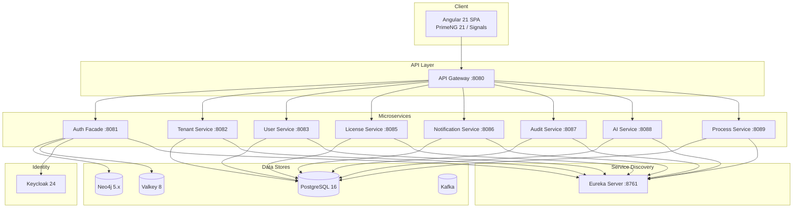

# Enterprise AI Platform

**Enterprise Management System for Integrated Service Transformation (EMSIST)**

A production-grade, multi-tenant SaaS platform built with microservices architecture, featuring AI-powered services, graph-based authentication, and BPMN process management.

> **Note:** This repository is source-available for portfolio viewing purposes. See [LICENSE](LICENSE) for terms.

---

## Architecture Overview



## Key Features

### Multi-Tenant Architecture
- Tenant isolation with per-tenant configuration and data segregation
- Tenant-scoped RBAC (Role-Based Access Control)
- On-premise licensing with seat management

### Zero-Redirect Authentication (BFF Pattern)
- Users never see the identity provider (Keycloak)
- Graph-based session and permission management via Neo4j
- Provider-agnostic auth facade with pluggable identity providers
- Session caching with Valkey

### AI-Powered Services
- Multi-provider AI integration (OpenAI, Anthropic, Gemini, Ollama)
- PostgreSQL + pgvector for vector embeddings and semantic search
- Tenant-scoped AI configurations

### BPMN Process Management
- Tenant-scoped process object definitions and orchestration
- Business process workflows with versioning
- Process execution and monitoring

### Enterprise Features
- Comprehensive audit trail logging
- Multi-channel notification service (email, in-app)
- License management with feature gating
- Service discovery via Eureka

---

## Tech Stack

| Layer | Technology | Details |
|-------|------------|---------|
| **Backend** | Java 23, Spring Boot 3.4.1 | 9 microservices, REST APIs, Spring Security |
| **Frontend** | Angular 21, PrimeNG 21 | Standalone components, Signals, Reactive Forms |
| **Graph Database** | Neo4j 5.x | Auth session & permission graphs |
| **Relational Database** | PostgreSQL 16 | All domain data, Flyway migrations |
| **Vector Database** | pgvector | AI embeddings and semantic search |
| **Identity Provider** | Keycloak 24 | OAuth2/OIDC, multi-realm |
| **Caching** | Valkey 8 (Redis-compatible) | Session caching, rate limiting |
| **Messaging** | Apache Kafka (Confluent 7.5) | Event-driven communication |
| **Service Discovery** | Netflix Eureka | Dynamic service registration |
| **API Gateway** | Spring Cloud Gateway | Routing, CORS, load balancing |
| **Containerization** | Docker & Docker Compose | Dev + Staging profiles |
| **CI/CD** | GitHub Actions | Automated pipelines |

---

## Microservices

| Service | Port | Database | Responsibility |
|---------|------|----------|----------------|
| `api-gateway` | 8080 | — | API routing, CORS, request filtering |
| `auth-facade` | 8081 | Neo4j + Valkey | Authentication BFF, session management |
| `tenant-service` | 8082 | PostgreSQL | Tenant lifecycle, configuration |
| `user-service` | 8083 | PostgreSQL | User profiles, preferences |
| `license-service` | 8085 | PostgreSQL | License management, feature gates |
| `notification-service` | 8086 | PostgreSQL | Email/in-app notifications |
| `audit-service` | 8087 | PostgreSQL | Audit trail, compliance logging |
| `ai-service` | 8088 | PostgreSQL + pgvector | AI/ML integrations, embeddings |
| `process-service` | 8089 | PostgreSQL | BPMN workflows, process execution |
| `eureka-server` | 8761 | — | Service discovery registry |

---

## Project Structure

```
Enterprise-AI-Platform/
├── backend/                    # Spring Boot microservices (Java 23)
│   ├── api-gateway/            # Spring Cloud Gateway
│   ├── auth-facade/            # Authentication BFF (Neo4j + Valkey)
│   ├── tenant-service/         # Multi-tenant management
│   ├── user-service/           # User profile management
│   ├── license-service/        # Enterprise licensing
│   ├── notification-service/   # Multi-channel notifications
│   ├── audit-service/          # Audit trail & compliance
│   ├── ai-service/             # AI/ML service (pgvector)
│   ├── process-service/        # BPMN workflow engine
│   ├── eureka-server/          # Service discovery
│   └── common/                 # Shared DTOs & utilities
├── frontend/                   # Angular 21 application
│   └── src/app/
│       ├── core/               # Guards, interceptors, services
│       ├── features/           # Feature modules (admin, auth, tenants)
│       └── layout/             # Shell, sidebar, header
├── infrastructure/             # Infrastructure configuration
│   ├── docker/                 # Init scripts, Prometheus config
│   └── keycloak/               # Realm bootstrap
├── docs/                       # Comprehensive documentation
│   ├── arc42/                  # Architecture documentation (12 sections)
│   ├── adr/                    # 22 Architecture Decision Records
│   ├── lld/                    # Low-level design documents
│   ├── data-models/            # Domain & canonical data models
│   ├── requirements/           # Business requirements
│   ├── governance/             # SDLC governance framework
│   └── togaf/                  # Enterprise architecture artifacts
├── contracts/                  # API contracts (OpenAPI)
├── scripts/                    # Development & deployment scripts
├── runbooks/                   # Operations & security playbooks
├── .github/workflows/          # CI/CD pipelines
└── .githooks/                  # Pre-commit quality enforcement
```

---

## Architecture Documentation

This project follows the **arc42** architecture documentation standard with 12 comprehensive sections:

| Section | Description |
|---------|-------------|
| [01 - Introduction & Goals](docs/arc42/01-introduction-goals.md) | Business context, quality goals, stakeholders |
| [02 - Constraints](docs/arc42/02-constraints.md) | Technical, organizational, and regulatory constraints |
| [03 - Context & Scope](docs/arc42/03-context-scope.md) | System boundary, external interfaces |
| [04 - Solution Strategy](docs/arc42/04-solution-strategy.md) | Technology decisions, architecture patterns |
| [05 - Building Blocks](docs/arc42/05-building-blocks.md) | Component decomposition |
| [06 - Runtime View](docs/arc42/06-runtime-view.md) | Key runtime scenarios, sequence diagrams |
| [07 - Deployment View](docs/arc42/07-deployment-view.md) | Infrastructure, Docker topology |
| [08 - Crosscutting](docs/arc42/08-crosscutting.md) | Security, caching, multi-tenancy patterns |
| [09 - Architecture Decisions](docs/arc42/09-architecture-decisions.md) | Decision log summary |
| [10 - Quality Requirements](docs/arc42/10-quality-requirements.md) | Quality tree, scenarios |
| [11 - Risks & Technical Debt](docs/arc42/11-risks-technical-debt.md) | Known risks, mitigation |
| [12 - Glossary](docs/arc42/12-glossary.md) | Domain terminology |

### Architecture Decision Records (ADRs)

22 ADRs covering key technical decisions including:
- Database strategy (Neo4j + PostgreSQL polyglot persistence)
- Authentication architecture (BFF pattern with provider-agnostic facade)
- Caching strategy (Valkey)
- Multi-tenancy isolation patterns
- AI service integration
- Security & encryption standards
- High availability design

---

## Engineering Practices

- **SDLC Governance** — Full agent-based development lifecycle with BA, SA, DEV, QA, SEC, DevOps agents
- **Evidence-Based Documentation** — Every documented feature verified against actual code
- **Test Pyramid** — Unit (JUnit 5/Vitest), Integration (Testcontainers), E2E (Playwright)
- **Database Migrations** — Flyway for PostgreSQL, versioned schema management
- **API-First Design** — OpenAPI contracts in `/contracts`
- **Security** — OWASP compliance, SAST/SCA scanning, tenant isolation verification
- **Accessibility** — WCAG AAA compliance target with axe-core auditing

---

## Development Setup

**Prerequisites:** Docker 24+, Docker Compose v2, Java 23, Node.js 20+

```bash
# Clone the repository
git clone https://github.com/samishekhalard/Enterprise-AI-Platform.git
cd Enterprise-AI-Platform

# Create environment file
cp .env.example .env
# Edit .env and replace all CHANGE_ME values

# Start full stack (staging profile)
docker compose --env-file .env -f docker-compose.staging.yml up --build -d

# Access the application
open http://localhost:4200
```

### Development Mode (shifted ports)

```bash
docker compose --env-file .env -f docker-compose.dev.yml up --build -d
# Access at http://localhost:24200
```

---

## Author

**Sami Shekhalard**
- GitHub: [@samishekhalard](https://github.com/samishekhalard)

---

## License

This project is **source-available** under a proprietary license. You may view the code for evaluation purposes only. See [LICENSE](LICENSE) for full terms.

Unauthorized copying, distribution, or use of this software is strictly prohibited.
