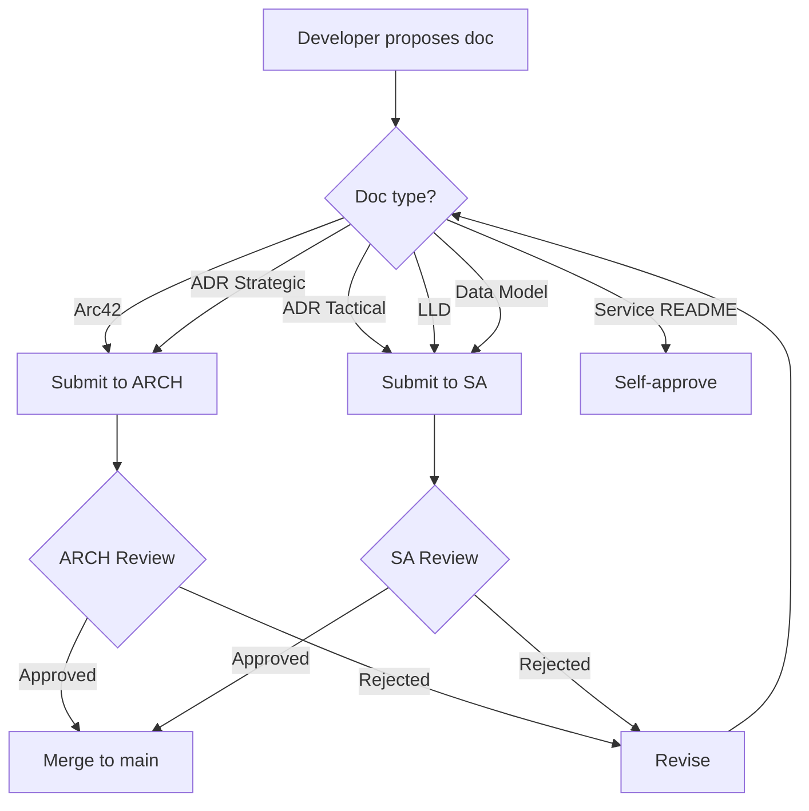

# Documentation Governance

> Standards, ownership, and approval processes for EMS platform documentation

**Version:** 1.0.0
**Owner:** Architecture Team
**Effective Date:** 2026-02-25

---

## 1. Purpose

This document establishes governance rules for all technical documentation in the EMS platform to ensure:

1. Consistency across all documentation
2. Clear ownership and accountability
3. Traceability between decisions and documentation
4. Elimination of redundancy and conflicting information

---

## 1.1 Mandatory Architecture Baseline

The following baseline is mandatory for all architecture documentation, per [ADR-016 Polyglot Persistence](adr/ADR-016-polyglot-persistence.md):

1. **Neo4j** is used by **auth-facade** for RBAC, identity graph, and provider configuration.
2. **PostgreSQL** is used by **7 domain services** (tenant, user, license, notification, audit, ai, process) and by **Keycloak** for internal persistence.
3. **Valkey 8** provides distributed caching for auth-facade token/session data.

Any documentation that describes Neo4j as the single application database or PostgreSQL as Keycloak-only is non-compliant and must be corrected to reflect the polyglot persistence baseline.

---

## 2. RACI Matrix

### Documentation Types

| Doc Type | ARCH | SA | BE/FE | DevOps | BA |
|----------|------|-----|-------|--------|-----|
| **Arc42 (01-12)** | R/A | C | I | C | I |
| **Strategic ADRs** | R/A | C | I | C | I |
| **Tactical ADRs** | C | R/A | C | C | I |
| **LLDs** | R | R/A | C | I | I |
| **Data Models** | C | R/A | C | I | I |
| **Service READMEs** | I | R | R/A | I | I |
| **API Specs (OpenAPI)** | C | R/A | R | I | I |
| **Runbooks** | C | C | C | R/A | I |

**Legend:** R = Responsible, A = Accountable, C = Consulted, I = Informed

### Key Ownership

| Document Category | Accountable Role |
|-------------------|------------------|
| Arc42 architecture docs | Architect (ARCH) |
| ADRs (strategic decisions) | Architect (ARCH) |
| ADRs (tactical/service-level) | Solution Architect (SA) |
| Low-Level Designs | Solution Architect (SA) |
| Data Model schemas | Solution Architect (SA) |
| Service READMEs | Backend/Frontend Developers |
| OpenAPI specifications | Solution Architect (SA) |
| Runbooks & playbooks | DevOps / SRE |

---

## 3. Directory Structure

### Canonical Locations

```
docs/
|-- README.md                    # Documentation index
|-- DOCUMENTATION-GOVERNANCE.md  # This file
|
|-- arc42/                       # Arc42 standard sections ONLY
|   |-- README.md
|   |-- 01-introduction-goals.md
|   |-- 02-constraints.md
|   |-- 03-context-scope.md
|   |-- 04-solution-strategy.md
|   |-- 05-building-blocks.md
|   |-- 06-runtime-view.md
|   |-- 07-deployment-view.md
|   |-- 08-crosscutting.md
|   |-- 09-architecture-decisions.md
|   |-- 10-quality-requirements.md
|   |-- 11-risks-technical-debt.md
|   |-- 12-glossary.md
|
|-- adr/                         # Architecture Decision Records
|   |-- ADR-NNN-title.md         # Sequential numbering
|
|-- lld/                         # Low-Level Designs (C4 L3-L4)
|   |-- {service}-lld.md
|
|-- data-models/                 # Database schemas
|   |-- {database}-{schema}.md
|
|-- api/                         # API specifications
|   |-- openapi/
|
backend/{service}/
|-- README.md                    # Service-specific docs
|-- openapi.yaml                 # Service API spec
|
runbooks/                        # Operational runbooks
|-- RUNBOOK-NNN-title.md
```

### Forbidden Locations

| Pattern | Reason |
|---------|--------|
| `docs/arc42/*.md` (non-standard) | Arc42 uses numbered sections 01-12 only |
| `docs/arc42/*/` (subfolders) | Arc42 is flat structure |
| `docs/*.md` (root, except governance) | Use proper subdirectories |
| Duplicate content across files | Single source of truth |

---

## 4. Document Standards

### Arc42 Sections

Arc42 documentation MUST follow the standard 12-section structure:

| Section | Content | Owner |
|---------|---------|-------|
| 01 | Introduction & Goals | ARCH |
| 02 | Constraints | ARCH |
| 03 | Context & Scope | ARCH |
| 04 | Solution Strategy | ARCH |
| 05 | Building Blocks (C4 L1-L2) | ARCH |
| 06 | Runtime View | SA |
| 07 | Deployment View | ARCH + DevOps |
| 08 | Crosscutting Concepts | ARCH |
| 09 | Architecture Decisions | ARCH (index) |
| 10 | Quality Requirements | ARCH |
| 11 | Risks & Technical Debt | ARCH |
| 12 | Glossary | SA |

**Rule:** No additional files in `/docs/arc42/` beyond these 12 + README.

### Single Source of Truth Matrix

To avoid duplication and conflicting statements, each architecture topic has one canonical owner document:

| Topic | Canonical Source | Allowed in Other Docs |
|-------|-------------------|------------------------|
| Non-negotiable platform constraints | `docs/arc42/02-constraints.md` | Short summary + link only |
| Architecture decision rationale | `docs/adr/ADR-*.md` | Reference only (no duplicated rationale blocks) |
| Decision index + implementation status | `docs/arc42/09-architecture-decisions.md` | Links only |
| Data model definitions | `docs/data-models/*.md` | Concept summary + link only |
| Runtime interaction flows | `docs/arc42/06-runtime-view.md` | Link to relevant scenario |
| Crosscutting policies (security, tenancy, observability) | `docs/arc42/08-crosscutting.md` | Policy reference only |

### Arc42 Section Contracts (Anti-Redundancy)

Each arc42 file has a strict content boundary:

| Section | Must Contain | Must Not Contain |
|---------|--------------|------------------|
| 03 Context & Scope | External actors, interfaces, boundaries | Full decision rationale (belongs in ADRs/09) |
| 04 Solution Strategy | Strategic choices and tradeoffs | Detailed runtime sequences (belongs in 06) |
| 05 Building Blocks | Static structure and ownership | Step-by-step runtime flows (belongs in 06) |
| 06 Runtime View | Sequence/process scenarios | Technology decision rationale (belongs in 04/ADRs) |
| 08 Crosscutting | Reusable policies and conventions | Service-specific deep implementation details |
| 09 Architecture Decisions | ADR index and implementation status | Rewritten ADR narratives |

### ADR Format (MADR)

All ADRs MUST follow the MADR format:

```markdown
# ADR-NNN: Title

**Status:** Proposed | Accepted | Deprecated | Superseded
**Date:** YYYY-MM-DD
**Decision Makers:** [List]
**Category:** Strategic | Tactical

## Context and Problem Statement
## Decision Drivers
## Considered Options
## Decision Outcome
### Consequences
## References
```

**Numbering:**
- Sequential: ADR-001, ADR-002, etc.
- Strategic ADRs: Created by ARCH
- Tactical ADRs: Created by SA

### LLD Format

Low-Level Designs MUST include:

1. Document header (type, owner, status, references)
2. Package/file structure
3. Key interfaces/classes
4. Data model references (link to `/docs/data-models/`)
5. Implementation status

### Data Model Format

Data model documents MUST include:

1. Visual schema diagram (Mermaid)
2. Node/table definitions with properties
3. Relationship definitions
4. Constraints and indexes
5. Sample queries
6. Migration scripts reference

---

## 5. Approval Process

### Creating New Documentation



### Review Checklist

Before creating or modifying documentation:

- [ ] **Location**: File is in correct canonical directory
- [ ] **Format**: Follows standard template for document type
- [ ] **No Duplication**: Content not covered elsewhere
- [ ] **Cross-References**: Links to related docs where appropriate
- [ ] **ADR Alignment**: Changes align with existing ADRs
- [ ] **Code Sync**: Documentation matches current codebase

---

## 6. Synchronization Rules

### ADR to Arc42 Mapping

When an ADR is accepted, the corresponding arc42 section MUST be updated:

| ADR Category | Arc42 Section(s) |
|--------------|------------------|
| Platform/Infrastructure | 07-deployment-view.md |
| Technology Stack | 04-solution-strategy.md, 09-architecture-decisions.md |
| Service Architecture | 05-building-blocks.md |
| Authentication/Security | 08-crosscutting.md |
| Data Architecture | 05-building-blocks.md, 08-crosscutting.md |
| Integration Patterns | 06-runtime-view.md |
| Quality Attributes | 10-quality-requirements.md |

### Workflow After ADR Approval

1. Update mapped arc42 sections to reflect decision
2. Add cross-reference from arc42 to ADR
3. If superseding, mark old ADR as "Superseded by ADR-NNN"
4. Update `/docs/README.md` ADR index if needed

---

## 7. Governance Violations

### Common Violations

| Violation | Remediation |
|-----------|-------------|
| File in wrong location | Move to canonical location |
| Duplicate content | Consolidate to single source, delete redundant |
| Missing ownership | Add owner header |
| Out of sync with code | Update documentation |
| Non-standard format | Reformat to standard |

### Escalation Path

1. Reviewer identifies violation
2. Author notified to fix within 48 hours
3. If not fixed, escalate to SA
4. SA may reject PR or force consolidation

---

## 8. Automation and Quality Gates

Documentation quality is enforced automatically in CI:

- Workflow: `.github/workflows/docs-quality.yml`
- Markdown lint rules: `.markdownlint.yml`
- Arc42 structure and consistency checks: `scripts/validate-docs-consistency.sh`

Every architecture-related pull request must pass these checks before merge.

---

## 8. Maintenance

### Quarterly Review

The Architecture team conducts quarterly documentation audits:

1. Verify all docs are in canonical locations
2. Check for duplications
3. Ensure ADR-to-arc42 sync
4. Update outdated content
5. Archive deprecated docs

### Deprecation Process

1. Mark document header: `**Status:** Deprecated`
2. Add note pointing to replacement
3. Move to `/docs/.archive/` after 90 days
4. Remove archive after 1 year

---

## 9. Quick Reference

### Where Do I Put My Doc?

| I want to document... | Location |
|----------------------|----------|
| Architecture overview | `docs/arc42/05-building-blocks.md` |
| A strategic decision | `docs/adr/ADR-NNN-title.md` |
| Detailed service design | `docs/lld/{service}-lld.md` |
| Database schema | `docs/data-models/{db}-{schema}.md` |
| Service-specific info | `backend/{service}/README.md` |
| API contract | `backend/{service}/openapi.yaml` |
| How to operate | `runbooks/RUNBOOK-NNN-title.md` |
| Security pattern | `docs/arc42/08-crosscutting.md` |

### Who Approves My Doc?

| Doc Type | Approver |
|----------|----------|
| Arc42 changes | Architecture Team (ARCH) |
| Strategic ADR | Architecture Team (ARCH) |
| Tactical ADR | Solution Architect (SA) |
| LLD | Solution Architect (SA) |
| Data Model | Solution Architect (SA) |
| Service README | Tech Lead / Self |
| Runbook | DevOps Lead |

---

**Effective Date:** 2026-02-25
**Review Cycle:** Quarterly
**Owner:** Architecture Team
