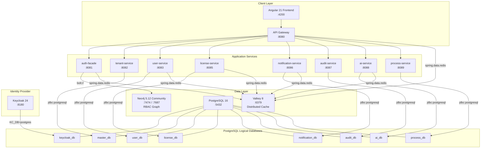
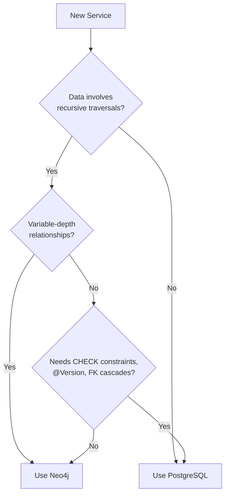

# ADR-001: EMS Application Data Architecture (Polyglot Persistence)

**Status:** Accepted (Amended)
**Date:** 2026-02-24
**Amended:** 2026-02-27
**Decision Makers:** Architecture Review Board
**Category:** Strategic ADR (Data Architecture)

> **Governance Note:** Implementation drift from the architectural target is classified
> as technical debt, not as an architecture override. The architecture is defined here
> and in arc42; the codebase converges toward it, not the other way around.

## Context

EMS requires a clear, enforceable data architecture across platform and business services. Early decisions (original ADR-001) mandated Neo4j as the single application database, reserving PostgreSQL exclusively for Keycloak internals. In practice, 7 of 8 services were correctly built with PostgreSQL because their data is relational and transactional in nature.

This amendment formalizes **polyglot persistence** as the architectural standard: Neo4j for graph-native domains, PostgreSQL for relational/transactional domains.

### Why the Original Single-Database Decision Was Insufficient

1. **The RBAC domain is graph-shaped.** Role inheritance (`INHERITS_FROM`), group membership (`MEMBER_OF`), and provider configuration form a recursive, relationship-heavy graph. Queries like "resolve all effective roles for a user through unlimited inheritance depth" map naturally to Cypher `(u)-[:HAS_ROLE|MEMBER_OF*0..]->(r)` but require expensive recursive CTEs in PostgreSQL.

2. **The licensing domain is relational and transactional.** It requires CHECK constraints on status enums, `@Version` optimistic locking for concurrent seat allocation, composite UNIQUE keys (`tenant_id, user_id, product_id`), JSONB columns for flexible feature metadata, and B-tree date-range indexing for license expiry queries. Neo4j Community does not provide CHECK constraints, has no native optimistic locking annotation, and its index types are not optimized for range scans.

3. **The remaining domain services (tenants, users, notifications, audit, AI, processes) are similarly relational.** They use foreign-key chains, Flyway migrations, Hibernate dialect-specific features (`PostgreSQLDialect`), and standard JPA patterns (`@Entity`, `@Version`, `@Column(columnDefinition = "JSONB")`).

4. **ai-service requires pgvector.** Semantic search for RAG (Retrieval-Augmented Generation) depends on PostgreSQL's pgvector extension for approximate nearest neighbor queries. Neo4j Community has no equivalent capability.

## Decision

**EMSIST adopts polyglot persistence: Neo4j for the identity/RBAC graph, PostgreSQL for all relational domain services.**

### Database Assignment

| Database | Service(s) | Port | Justification |
|----------|-----------|------|---------------|
| **Neo4j** | auth-facade | :8081 | Graph-shaped RBAC: recursive role inheritance (`INHERITS_FROM`), group membership (`MEMBER_OF`), provider configuration nodes, tenant-scoped identity graph |
| **PostgreSQL** | tenant-service | :8082 | Relational tenant registry: FK chains, CHECK constraints, JSONB branding config, Flyway migrations |
| **PostgreSQL** | user-service | :8083 | Relational user profiles: FK to tenants, JPA `@Entity`, Flyway migrations |
| **PostgreSQL** | license-service | :8085 | Transactional licensing: CHECK constraints, `@Version` optimistic locking, composite UNIQUE keys, JSONB feature metadata, date-range B-tree indexes |
| **PostgreSQL** | notification-service | :8086 | Relational notification queue: FK chains, Thymeleaf templates, Flyway migrations |
| **PostgreSQL** | audit-service | :8087 | Append-only audit log: BIGSERIAL PK, JSONB details, INET columns, time-range indexes, Flyway migrations |
| **PostgreSQL** | ai-service | :8088 | AI/RAG storage: pgvector extension for embeddings, JSONB conversation context, Flyway migrations |
| **PostgreSQL** | process-service | :8089 | BPMN process definitions: relational element hierarchy, Flyway migrations |
| **PostgreSQL** (Keycloak) | Keycloak | :8180 | Identity provider internal persistence (required by Keycloak -- `KC_DB=postgres`) |
| **Valkey** | auth-facade, license-service, user-service, notification-service, ai-service, api-gateway | :6379 | Distributed caching: role cache, seat validation, token blacklist, rate limiting, session state |

### Why Neo4j for RBAC / Why PostgreSQL for Licensing

| Requirement | Neo4j (auth-facade) | PostgreSQL (license-service) |
|-------------|---------------------|------------------------------|
| Recursive role inheritance (`INHERITS_FROM*0..`) | Native variable-length traversal in Cypher | Requires recursive CTE, poor performance at depth |
| Group membership resolution (`MEMBER_OF*0..`) | Single Cypher query with unlimited depth | Multiple JOINs or recursive CTE |
| CHECK constraints on status enums | Not supported | Native `CHECK (status IN ('ACTIVE', 'EXPIRED', 'SUSPENDED'))` |
| `@Version` optimistic locking | No native JPA `@Version` support | Hibernate `@Version` with `FOR UPDATE` |
| Composite UNIQUE constraints | Only basic uniqueness constraints | Native `UNIQUE(tenant_id, user_id, product_id)` |
| JSONB columns for flexible metadata | Properties are schemaless but no JSONB operators | Full JSONB indexing, containment operators (`@>`, `?`) |
| B-tree date-range indexing | Limited range index support | Native `CREATE INDEX ON ... (starts_at, expires_at)` |
| Foreign-key referential integrity | Relationships enforce structure but no cascading FK | Native `REFERENCES ... ON DELETE CASCADE` |

### Database Topology

### New Service Database Selection Criteria

When adding a new service, use this decision tree:

## Consequences

### Positive

* Each database is used for its strengths -- no constraint sacrifices, no application-level workarounds
* Documentation matches reality -- no "drift" narrative, no false debt claims
* Clear governance boundary: Neo4j for graph domains, PostgreSQL for relational domains
* Existing Flyway migrations, JPA entities, and Neo4j SDN code remain unchanged
* Operational teams know exactly which database backs which service
* Valkey provides a uniform caching layer across both database technologies

### Negative

* Two database technologies to maintain -- operations team needs both Neo4j and PostgreSQL expertise
* Different migration tooling: Flyway (PostgreSQL) vs application-managed migrations (Neo4j/auth-facade)
* Developers working across services must understand both data-access patterns (JPA/Hibernate and Neo4j SDN)

### Risks

| Risk | Probability | Impact | Mitigation |
|------|-------------|--------|------------|
| Schema drift if migration standards diverge | Medium | Medium | Flyway governs PostgreSQL; Neo4j SDN governs auth-facade; standardized CI pipeline validates both |
| Neo4j Community edition lacks cluster features | Low | Medium | auth-facade is the only Neo4j consumer; single-instance is sufficient for current scale; upgrade path to Enterprise exists |
| New service incorrectly chooses database | Low | Low | This ADR provides clear criteria and decision tree above |

## Implementation Evidence [IMPLEMENTED]

This amended ADR formalizes the architecture that is already fully implemented. See [ADR-016](./ADR-016-polyglot-persistence.md) for detailed per-service configuration evidence with file paths and line numbers.

### Summary Evidence

| Service | Database | Configuration File | Docker Compose |
|---------|----------|--------------------|----------------|
| auth-facade | Neo4j | `application.yml:27-31` (`spring.neo4j.uri`) | `NEO4J_URI: bolt://neo4j:7687` |
| tenant-service | PostgreSQL | `application.yml:9` (`jdbc:postgresql`) | `master_db` |
| user-service | PostgreSQL | `application.yml:9` (`jdbc:postgresql`) | `user_db` |
| license-service | PostgreSQL | `application.yml:9` (`jdbc:postgresql`) | `license_db` |
| notification-service | PostgreSQL | `application.yml:9` (`jdbc:postgresql`) | `notification_db` |
| audit-service | PostgreSQL | `application.yml:9` (`jdbc:postgresql`) | `audit_db` |
| ai-service | PostgreSQL + pgvector | `application.yml:9` (`jdbc:postgresql`) | `ai_db` |
| process-service | PostgreSQL | `application.yml:9` (`jdbc:postgresql`) | `process_db` |

### Infrastructure Images [IMPLEMENTED]

| Component | Image | Source |
|-----------|-------|--------|
| PostgreSQL | `postgres:16-alpine` | `/infrastructure/docker/docker-compose.yml:9` |
| Neo4j | `neo4j:5.12.0-community` | `/infrastructure/docker/docker-compose.yml:43` |
| Valkey | `valkey/valkey:8-alpine` | `/infrastructure/docker/docker-compose.yml:28` |
| Keycloak | `quay.io/keycloak/keycloak:24.0` | `/infrastructure/docker/docker-compose.yml:99` |

## Amendment History

| Date | Change | Rationale |
|------|--------|-----------|
| 2026-02-24 | Original decision: Neo4j as single app DB | Governance simplicity |
| 2026-02-25 | First amendment: clarified Keycloak boundary | Keycloak requires PostgreSQL |
| 2026-02-27 | **Major amendment: Polyglot Persistence** | 7/8 services are correctly relational; Neo4j is the right choice only for the RBAC/identity graph. See ADR-016 for detailed justification. |

## Related Decisions

- [ADR-003](./ADR-003-database-per-tenant.md) -- Multi-tenancy strategy (isolation patterns differ by database type)
- [ADR-004](./ADR-004-keycloak-authentication.md) -- Keycloak authentication model
- [ADR-005](./ADR-005-valkey-caching.md) -- Valkey distributed caching (uniform cache layer across both databases)
- [ADR-009](./ADR-009-auth-facade-neo4j-architecture.md) -- Auth-facade Neo4j identity graph design
- [ADR-014](./ADR-014-rbac-licensing-integration.md) -- RBAC and licensing integration
- [ADR-015](./ADR-015-on-premise-license-architecture.md) -- On-premise license architecture
- [ADR-016](./ADR-016-polyglot-persistence.md) -- Detailed polyglot persistence implementation evidence

## References

- [Neo4j Documentation](https://neo4j.com/docs/)
- [PostgreSQL Documentation](https://www.postgresql.org/docs/16/)
- [Polyglot Persistence (Martin Fowler)](https://martinfowler.com/bliki/PolyglotPersistence.html)
- [Spring Data Neo4j Reference](https://docs.spring.io/spring-data/neo4j/reference/)
- [Flyway Documentation](https://documentation.red-gate.com/fd)
