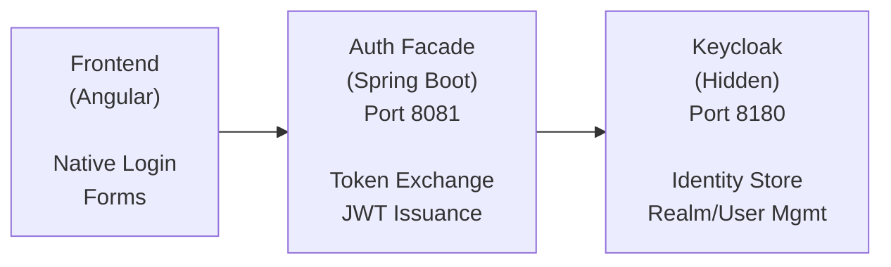

# ADR-004: Keycloak Authentication with BFF Pattern

**Status:** Accepted (Partially Superseded)
**Date:** 2026-02-24
**Decision Makers:** Architecture Team
**Partially Superseded By:** [ADR-007](./ADR-007-auth-facade-provider-agnostic.md)

> **Note:** The BFF pattern and architecture described here remain valid. The current implementation remains Keycloak-first. The provider-agnostic model from [ADR-007](./ADR-007-auth-facade-provider-agnostic.md) is partially implemented (abstraction and configuration), while non-Keycloak provider adapters are still planned.

## Context

EMS requires enterprise-grade authentication supporting:
- Username/password authentication
- Social login (Google, Microsoft, UAE Pass)
- Single Sign-On (SSO) via SAML/OIDC
- Multi-factor authentication (MFA)
- Per-tenant identity configuration

The authentication experience must feel native to the application (no visible redirects to external login pages).

## Decision

**Use Keycloak 24.x as the identity provider, hidden behind a Backend-for-Frontend (BFF) authentication facade.**

### Architecture



### Key Principles

1. **Zero Redirects** - Users never see Keycloak UI
2. **Native Forms** - Login forms are part of Angular app
3. **Server-to-Server** - Auth facade communicates with Keycloak REST API
4. **Token Exchange** - Social provider tokens exchanged for Keycloak tokens
5. **Tenant Isolation** - Realm per tenant for complete separation

### Endpoints

| Endpoint | Method | Description |
|----------|--------|-------------|
| `/api/v1/auth/login` | POST | Email/password login |
| `/api/v1/auth/social/google` | POST | Google One Tap token exchange |
| `/api/v1/auth/social/microsoft` | POST | Azure AD MSAL token exchange |
| `/api/v1/auth/refresh` | POST | Refresh token rotation |
| `/api/v1/auth/logout` | POST | Token invalidation |
| `/api/v1/auth/mfa/setup` | POST | Initialize TOTP |
| `/api/v1/auth/mfa/verify` | POST | Verify TOTP code |

## Consequences

### Positive

- **Native UX** - Users see only branded login forms
- **Security** - Keycloak not exposed to internet
- **Flexibility** - Full control over authentication flows
- **Enterprise SSO** - Keycloak handles SAML/OIDC complexity
- **Tenant isolation** - Per-tenant realms and configurations
- **MFA support** - Built-in TOTP, WebAuthn support
- **Audit trail** - Keycloak logs all authentication events

### Negative

- **Complexity** - BFF adds architectural layer
- **Maintenance** - Custom integration code to maintain
- **Keycloak dependency** - Tight coupling to Keycloak APIs
- **Development overhead** - More code than standard OIDC redirect flow

### Neutral

- JWT tokens used for all API authentication
- Tokens stored in memory (not localStorage) for security
- Silent refresh via hidden iframe or background fetch

## Alternatives Considered

### 1. Standard OIDC Redirect Flow

**Rejected because:**
- Users see Keycloak login page
- Breaks native UX
- Hard to customize per-tenant branding
- Multiple redirects degrade experience

### 2. Auth0/Okta SaaS

**Rejected because:**
- Per-MAU pricing expensive at scale
- Less control over customization
- Data residency concerns
- Vendor lock-in

### 3. Custom Identity Server

**Rejected because:**
- Massive security responsibility
- MFA, federation, SSO are complex
- Reinventing well-solved problems
- Keycloak is battle-tested

### 4. Firebase Authentication

**Rejected because:**
- Limited enterprise SSO support
- Google ecosystem lock-in
- Less suitable for B2B multi-tenant

## Implementation Notes

### Keycloak Configuration

```yaml
# Per-tenant realm configuration
realm: tenant-{slug}
enabled: true

clients:
  - clientId: auth-facade
    publicClient: false
    directAccessGrantsEnabled: true
    serviceAccountsEnabled: true
    attributes:
      token.exchange.standard.flow.enabled: true

identityProviders:
  - alias: google
    providerId: google
    enabled: true
    config:
      clientId: ${GOOGLE_CLIENT_ID}
      clientSecret: ${GOOGLE_CLIENT_SECRET}
```

### Auth Facade Implementation

```java
@Service
@RequiredArgsConstructor
public class KeycloakAuthService {

    private final KeycloakAdminClient keycloak;

    public TokenResponse login(String tenantId, String email, String password) {
        // Direct Access Grant (Resource Owner Password)
        return keycloak.realm(tenantId)
            .clients()
            .get(clientId)
            .getToken(email, password, "password");
    }

    public TokenResponse exchangeGoogleToken(String tenantId, String googleIdToken) {
        // RFC 8693 Token Exchange
        return keycloak.realm(tenantId)
            .tokenExchange()
            .subjectToken(googleIdToken)
            .subjectTokenType("urn:ietf:params:oauth:token-type:id_token")
            .subjectIssuer("google")
            .exchange();
    }
}
```

### Frontend Integration

```typescript
// Google One Tap (no redirects)
google.accounts.id.initialize({
  client_id: environment.googleClientId,
  callback: (response) => {
    this.authService.googleLogin(response.credential).subscribe();
  }
});

// Microsoft MSAL (popup, not redirect)
const result = await msalInstance.loginPopup({
  scopes: ['openid', 'profile', 'email']
});
this.authService.microsoftLogin(result.accessToken).subscribe();
```

## Security Considerations

1. **Rate limiting** - 100 req/min on auth endpoints
2. **Brute force protection** - Account lockout after failed attempts
3. **Token security** - Short-lived access tokens (15 min), longer refresh (7 days)
4. **CORS** - Strict origin validation
5. **HTTPS only** - No HTTP in production

## References

- [Keycloak Admin REST API](https://www.keycloak.org/docs-api/24.0/rest-api/)
- [RFC 8693 - Token Exchange](https://datatracker.ietf.org/doc/html/rfc8693)
- [BFF Pattern for SPAs](https://datatracker.ietf.org/doc/html/draft-ietf-oauth-browser-based-apps)
- [Google One Tap](https://developers.google.com/identity/gsi/web/guides/overview)

## Update: Provider-Agnostic Refactoring (2026-02-24)

The auth-facade has been refactored toward provider-agnostic architecture:

- **IdentityProvider Interface**: Strategy pattern abstraction implemented.
- **AuthProperties**: Externalized claim mappings to YAML configuration.
- **Conditional Bean Wiring**: Provider wiring is property-driven via `auth.facade.provider`.
- **Dynamic Provider Resolver**: Runtime tenant/provider configuration foundation implemented.

Current runtime reality:
- **Implemented provider adapter**: Keycloak (`KeycloakIdentityProvider`).
- **Planned adapters**: Auth0, Okta, Azure AD, FusionAuth.
- **Config placeholders exist** for Auth0/Okta/Azure AD, but adapter classes are not implemented.

See [ADR-007](./ADR-007-auth-facade-provider-agnostic.md) for target architecture and rollout plan.

---

**Implementation Status:** auth-facade service implemented (2026-02-21), provider-agnostic architecture foundation implemented (2026-02-24), non-Keycloak adapters pending (as of 2026-02-25)
