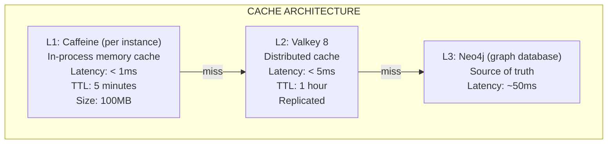

# ADR-005: Valkey Distributed Caching

**Status:** Accepted (Implemented with Valkey 8)
**Date:** 2026-02-24
**Updated:** 2026-02-25
**Decision Makers:** Architecture Team

## Implementation Note

> **Implementation Standard:** The platform standard is **Valkey 8** for distributed caching. Framework configuration and class names may still use the `redis` namespace due Spring/Data API conventions.

## Context

EMS requires a distributed caching solution for:
- Session data and token caching
- API response caching
- Rate limiting counters
- Pub/sub for real-time features
- Temporary data storage

The caching layer must support:
- Sub-5ms latency for cache hits
- High availability (replication)
- Cluster mode for horizontal scaling
- TTL-based expiration
- Atomic operations

## Decision

**Use Valkey 8 as the distributed caching database across environments.**

### Architecture



### Current Deployment

The system currently uses Valkey 8 Alpine as the distributed cache runtime:

| Aspect | Current Implementation |
|--------|----------------------|
| Image | `valkey/valkey:8-alpine` |
| Container | `ems-valkey` |
| Port | 6379 |
| Persistence | Volume-backed (`valkey_data`) |
| Client | Spring Data (Lettuce driver) |

### Framework Compatibility

Spring framework properties and APIs continue to use the `redis` namespace (`spring.data.redis`, `RedisConnectionFactory`) while pointing to Valkey runtime endpoints.

## Consequences

### Positive

- **Performance** - Sub-millisecond in-process, sub-5ms distributed
- **Scalability** - Cluster mode for horizontal scaling
- **Maturity** - Valkey-compatible ecosystem is battle-tested in production
- **Ecosystem** - Excellent tooling, monitoring, and documentation
- **Cost effective** - Open source core features sufficient for current needs
- **Feature rich** - Pub/sub, Lua scripts, atomic operations

### Negative

- **Complexity** - Two-tier cache adds complexity
- **Memory cost** - In-memory storage requires provisioning
- **Cache invalidation** - Classic hard problem
- **Cold starts** - Cache misses after deployments

### Neutral

- Standard key-value caching, no graph queries
- Session clustering enables zero-downtime deployments
- Spring Data cache abstractions isolate client wiring from runtime specifics

## Alternatives Considered

### 1. Managed Commercial Cache Runtime

**Rejected because:**
- Commercial licensing cost
- Valkey open-source runtime provides sufficient features
- Overkill for current scale

### 2. Memcached

**Rejected because:**
- No persistence options
- No pub/sub
- Less feature rich than Valkey
- No cluster mode with data partitioning

### 3. Hazelcast

**Rejected because:**
- More complex setup
- JVM-centric (less polyglot)
- Overkill for current requirements

### 4. Application-only Caffeine

**Rejected because:**
- No cross-instance sharing
- Each pod has separate cache
- Inconsistent data across replicas

## Implementation Notes

### Docker Configuration (Actual)

```yaml
valkey:
  image: valkey/valkey:8-alpine
  container_name: ems-valkey
  ports:
    - "6379:6379"
  volumes:
    - valkey_data:/data
  healthcheck:
    test: ["CMD", "valkey-cli", "ping"]
    interval: 10s
    timeout: 5s
    retries: 5
  networks:
    - ems-network
```

### Spring Configuration

```java
@Configuration
@EnableCaching
public class CacheConfig {

    @Bean
    public CacheManager cacheManager(RedisConnectionFactory redisConnectionFactory) {
        // L1: Caffeine (in-process)
        CaffeineCacheManager l1 = new CaffeineCacheManager();
        l1.setCaffeine(Caffeine.newBuilder()
            .maximumSize(10_000)
            .expireAfterWrite(Duration.ofMinutes(5)));

        // L2: Valkey (distributed)
        RedisCacheConfiguration l2Config = RedisCacheConfiguration.defaultCacheConfig()
            .entryTtl(Duration.ofHours(1))
            .serializeKeysWith(RedisSerializationContext.SerializationPair
                .fromSerializer(new StringRedisSerializer()))
            .serializeValuesWith(RedisSerializationContext.SerializationPair
                .fromSerializer(new GenericJackson2JsonRedisSerializer()));

        RedisCacheManager l2 = RedisCacheManager.builder(redisConnectionFactory)
            .cacheDefaults(l2Config)
            .build();

        return new CompositeCacheManager(l1, l2);
    }
}
```

### Cache Key Pattern

```
tenant:{tenantId}:{entity}:{id}

Examples:
tenant:abc123:product:uuid-456
tenant:abc123:user:uuid-789
tenant:xyz789:config:session
```

### Application Properties

```yaml
spring:
  data:
    redis:
      host: ${VALKEY_HOST:localhost}
      port: ${VALKEY_PORT:6379}
      timeout: 2000ms
      lettuce:
        pool:
          max-active: 10
          max-idle: 5
          min-idle: 2
```

## Cache Invalidation Strategy

1. **Time-based** - TTL expiration (primary strategy)
2. **Write-through** - Invalidate on entity update
3. **Event-driven** - Kafka events trigger invalidation
4. **Manual** - Admin API for cache clearing

```java
@Service
public class ProductService {

    @CacheEvict(value = "products", key = "#product.id")
    public Product update(Product product) {
        return productRepository.save(product);
    }

    @Cacheable(value = "products", key = "#id")
    public Product findById(UUID id) {
        return productRepository.findById(id).orElseThrow();
    }
}
```

## Monitoring

Key metrics to monitor:
- Cache hit ratio (target > 90%)
- Memory usage
- Connection pool utilization
- Latency percentiles (p50, p95, p99)
- Eviction rate

## References

- [Valkey Documentation](https://valkey.io/documentation/)
- [Spring Data (redis namespace)](https://docs.spring.io/spring-data/redis/docs/current/reference/html/)
- [Caffeine Cache](https://github.com/ben-manes/caffeine)

---

**Revision History:**
| Date | Change |
|------|--------|
| 2026-02-24 | Initial ADR for distributed caching |
| 2026-02-25 | Updated to standardize on Valkey 8 runtime |
