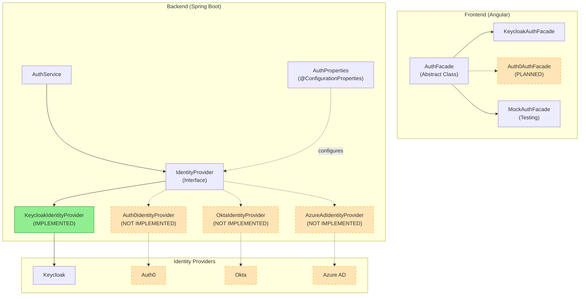

# ADR-007: Provider-Agnostic Auth Facade

**Status:** In Progress (25%)
**Date:** 2026-02-24
**Decision Makers:** Architecture Team
**Supersedes:** [ADR-004](./ADR-004-keycloak-authentication.md) (partially)

> **Implementation Reality Check (2026-02-25):**
> The provider-agnostic architecture (interface, configuration system, resolver pattern) is implemented.
> However, only the Keycloak provider has working code. Auth0, Okta, and Azure AD have
> configuration scaffolding but **no implementation code**. See Implementation Status section below.

## Context

EMS uses a Backend-for-Frontend (BFF) authentication pattern with Keycloak as the identity provider (documented in ADR-004). While this architecture successfully hides Keycloak from end users and provides a native authentication experience, the tight coupling to Keycloak creates several challenges:

1. **Vendor Lock-in**: Direct Keycloak API calls throughout the auth-facade make switching providers difficult
2. **Government Requirements**: Some government deployments require specific identity providers (e.g., Azure AD for Microsoft 365 environments)
3. **Enterprise Sales**: Prospects may already have Auth0, Okta, or Azure AD investments
4. **Testing**: Unit testing requires mocking Keycloak-specific classes
5. **Provider-Specific JWT Claims**: Different providers use different claim names for roles, tenant ID, and user attributes

### Current State Analysis

The auth-facade service had direct dependencies on Keycloak:

```java
// BEFORE: Tight coupling to Keycloak
@Service
public class KeycloakAuthService {
    private final KeycloakAdminClient keycloak;

    public TokenResponse login(String tenantId, String email, String password) {
        return keycloak.realm(tenantId)
            .clients()
            .get(clientId)
            .getToken(email, password, "password");
    }
}
```

JWT claim extraction was hardcoded:

```java
// BEFORE: Keycloak-specific claim paths
String roles = claims.get("realm_access.roles");
String tenantId = claims.get("tenant_id");
```

## Decision

**Refactor auth-facade to be provider-agnostic using the Strategy Pattern and externalized configuration.**

### Architecture (Target State)

> **Note:** This diagram shows the **target architecture**. Currently only `KeycloakIdentityProvider` is implemented.
> The dashed boxes indicate planned but not yet implemented components.



### Key Design Decisions

#### 1. Strategy Pattern for Identity Providers

```java
/**
 * Identity Provider abstraction for auth-facade.
 *
 * To switch providers:
 * 1. Implement this interface for the new provider
 * 2. Mark with @ConditionalOnProperty(name = "auth.facade.provider", havingValue = "new-provider")
 * 3. Set auth.facade.provider=new-provider in configuration
 *
 * No changes required to AuthService or controllers.
 */
public interface IdentityProvider {

    AuthResponse authenticate(String realm, String email, String password);
    AuthResponse refreshToken(String realm, String refreshToken);
    void logout(String realm, String refreshToken);
    AuthResponse exchangeToken(String realm, String token, String providerHint);
    LoginInitiationResponse initiateLogin(String realm, String providerHint, String redirectUri);
    MfaSetupResponse setupMfa(String realm, String userId);
    boolean verifyMfaCode(String realm, String userId, String code);
    boolean isMfaEnabled(String realm, String userId);
    List<AuthEventDTO> getEvents(String realm, AuthEventQuery query);
    long getEventCount(String realm, AuthEventQuery query);
    boolean supports(String providerType);
    String getProviderType();
}
```

#### 2. Externalized Claim Mappings

```yaml
auth:
  facade:
    # Active identity provider: keycloak, auth0, okta, azure-ad, fusionauth
    provider: ${AUTH_PROVIDER:keycloak}

    # JWT claim paths to extract roles/authorities (evaluated in order)
    role-claim-paths:
      - realm_access.roles     # Keycloak Realm Roles
      - resource_access        # Keycloak Client Roles
      - roles                  # Standard OIDC / Azure AD
      - groups                 # Azure AD / Okta
      - permissions            # Auth0

    # User claim mappings (standard OIDC claims)
    user-claim-mappings:
      user-id: sub
      email: email
      first-name: given_name
      last-name: family_name
      tenant-id: tenant_id
      identity-provider: identity_provider

    # Tenant resolution strategy
    tenant-resolution: header
    tenant-header: X-Tenant-ID
```

#### 3. Conditional Bean Activation

```java
@Service
@ConditionalOnProperty(name = "auth.facade.provider", havingValue = "keycloak", matchIfMissing = true)
public class KeycloakIdentityProvider implements IdentityProvider {
    // Keycloak-specific implementation
}

@Service
@ConditionalOnProperty(name = "auth.facade.provider", havingValue = "auth0")
public class Auth0IdentityProvider implements IdentityProvider {
    // Auth0-specific implementation
}
```

#### 4. Frontend Abstract DI Token

```typescript
/**
 * Abstract Auth Facade - DI token for authentication.
 * Components inject this abstraction, not the concrete implementation.
 *
 * Configuration in app.config.ts:
 * { provide: AuthFacade, useClass: KeycloakAuthFacade }
 */
export abstract class AuthFacade {
  abstract readonly user: Signal<AuthUser | null>;
  abstract readonly isAuthenticated: Signal<boolean>;
  abstract readonly isLoading: Signal<boolean>;
  abstract readonly error: Signal<AuthError | null>;
  abstract readonly mfaRequired: Signal<boolean>;

  abstract login(email: string, password: string, rememberMe?: boolean): Observable<AuthResponse>;
  abstract loginWithProvider(providerId: string, returnUrl?: string): void;
  abstract logout(redirectToLogin?: boolean): Observable<void>;
  // ... other methods
}
```

### Supported Providers

| Provider | Status | Configuration Key | Implementation | Notes |
|----------|--------|-------------------|----------------|-------|
| Keycloak | **IMPLEMENTED** | `keycloak` | `KeycloakIdentityProvider.java` | Default, full feature support, production-ready |
| Auth0 | PLANNED | `auth0` | Config only (`application-auth0.yml`) | No `Auth0IdentityProvider.java` exists |
| Okta | PLANNED | `okta` | Config only (`application-okta.yml`) | No `OktaIdentityProvider.java` exists |
| Azure AD | PLANNED | `azure-ad` | Config only (`application-azure-ad.yml`) | No `AzureAdIdentityProvider.java` exists |
| FusionAuth | PLANNED | `fusionauth` | None | Not started |

> **Current Reality:** Only `KeycloakIdentityProvider.java` exists in `/backend/auth-facade/src/main/java/com/ems/auth/provider/`.
> The `IdentityProvider` interface is defined, but Auth0, Okta, and Azure AD providers are **not implemented**.
> Configuration files exist as placeholders but have no backing implementation code.

### Provider Claim Mappings

Different providers use different JWT claim structures:

| Claim | Keycloak | Auth0 | Okta | Azure AD |
|-------|----------|-------|------|----------|
| User ID | `sub` | `sub` | `sub` | `oid` |
| Email | `email` | `email` | `email` | `preferred_username` |
| Roles | `realm_access.roles` | `permissions` | `groups` | `roles` |
| Tenant ID | `tenant_id` (custom) | `app_metadata.tenant_id` | `tenant` | `tid` |
| First Name | `given_name` | `given_name` | `given_name` | `given_name` |
| Last Name | `family_name` | `family_name` | `family_name` | `family_name` |

## Consequences

### Positive

1. **Provider Flexibility**: Switch identity providers via configuration without code changes
2. **Zero Vendor Lock-in**: No single provider dependency in core auth logic
3. **Enterprise Sales**: Support customer's existing identity infrastructure
4. **Government Compliance**: Meet specific provider requirements for government deployments
5. **Testability**: Mock providers for unit testing without provider SDK
6. **Claim Normalization**: Consistent internal user model regardless of provider
7. **Gradual Migration**: Run multiple providers during migration period

### Negative

1. **Abstraction Complexity**: Additional interface layer to maintain
2. **Feature Disparity**: Not all providers support all features (e.g., token exchange)
3. **Implementation Effort**: Each new provider requires dedicated implementation
4. **Configuration Complexity**: More YAML configuration to manage
5. **Documentation**: Must document provider-specific setup steps

### Neutral

- Keycloak remains the default and recommended provider
- BFF pattern (ADR-004) remains unchanged - users never see provider UI
- JWT format and token handling unchanged
- MFA support dependent on provider capabilities

## Alternatives Considered

### Alternative 1: Keep Keycloak-Only

**Description:** Continue with Keycloak as the sole provider.

**Pros:**
- Simpler codebase
- No abstraction overhead
- Full feature support guaranteed

**Cons:**
- Vendor lock-in
- Cannot meet diverse customer requirements
- Harder to enter enterprise markets with Auth0/Okta mandates

**Verdict:** Rejected - limits market opportunities.

### Alternative 2: Spring Security OAuth2 Client Only

**Description:** Use Spring Security's built-in OAuth2 client support.

**Pros:**
- Framework-provided abstraction
- Well-documented

**Cons:**
- Focused on redirect-based flows
- Limited admin/management API support
- Doesn't cover our BFF pattern requirements

**Verdict:** Rejected - doesn't support token exchange and admin operations.

### Alternative 3: Multi-Provider via Keycloak Brokering

**Description:** Use Keycloak as a broker, federating to other providers.

**Pros:**
- Single integration point
- Keycloak handles protocol translation

**Cons:**
- Still requires Keycloak deployment
- Adds latency (hop through Keycloak)
- Doesn't meet "no Keycloak" requirements

**Verdict:** Rejected - doesn't eliminate Keycloak dependency.

## Implementation Notes

### Adding a New Provider

1. Create implementation class:
   ```java
   @Service
   @ConditionalOnProperty(name = "auth.facade.provider", havingValue = "newprovider")
   public class NewProviderIdentityProvider implements IdentityProvider {
       // Implement all methods
   }
   ```

2. Add configuration section:
   ```yaml
   newprovider:
     base-url: ${NEWPROVIDER_URL}
     client-id: ${NEWPROVIDER_CLIENT_ID}
     client-secret: ${NEWPROVIDER_CLIENT_SECRET}
   ```

3. Document claim mappings in AuthProperties

4. Add integration tests with Testcontainers (if provider has container image)

### Switching Providers

```bash
# Development: Use Keycloak (default)
./gradlew bootRun

# Production: Use Auth0
AUTH_PROVIDER=auth0 \
AUTH0_DOMAIN=tenant.auth0.com \
AUTH0_CLIENT_ID=xxx \
AUTH0_CLIENT_SECRET=yyy \
./gradlew bootRun
```

## References

- [ADR-004: Keycloak with BFF Pattern](./ADR-004-keycloak-authentication.md) - Original Keycloak decision
- [Strategy Pattern](https://refactoring.guru/design-patterns/strategy) - Design pattern reference
- [Spring @ConditionalOnProperty](https://docs.spring.io/spring-boot/docs/current/reference/html/features.html#features.developing-auto-configuration.condition-annotations.property-conditions)
- [Auth0 Management API](https://auth0.com/docs/api/management/v2)
- [Okta Admin API](https://developer.okta.com/docs/reference/api/)
- [Microsoft Graph API](https://learn.microsoft.com/en-us/graph/api/overview)

---

## Implementation Status

**Overall Progress:** In Progress (25% - Architecture Ready, 1 of 4 Providers Implemented)

**Last Updated:** 2026-02-25

### What Is Implemented

| Component | Status | File |
|-----------|--------|------|
| `IdentityProvider` interface | COMPLETE | `/backend/auth-facade/src/main/java/com/ems/auth/provider/IdentityProvider.java` |
| `AuthProperties` configuration | COMPLETE | `/backend/auth-facade/src/main/java/com/ems/auth/config/AuthProperties.java` |
| `DynamicProviderResolver` | COMPLETE | `/backend/auth-facade/src/main/java/com/ems/auth/provider/DynamicProviderResolver.java` |
| `KeycloakIdentityProvider` | COMPLETE | `/backend/auth-facade/src/main/java/com/ems/auth/provider/KeycloakIdentityProvider.java` |
| Frontend `AuthFacade` abstraction | COMPLETE | `/frontend/src/app/core/auth/auth-facade.ts` |

### What Is NOT Implemented (Config Files Only)

| Provider | Config File Exists | Implementation Class | Status |
|----------|-------------------|---------------------|--------|
| Auth0 | `application-auth0.yml` | `Auth0IdentityProvider.java` | **DOES NOT EXIST** |
| Okta | `application-okta.yml` | `OktaIdentityProvider.java` | **DOES NOT EXIST** |
| Azure AD | `application-azure-ad.yml` | `AzureAdIdentityProvider.java` | **DOES NOT EXIST** |
| FusionAuth | None | `FusionAuthIdentityProvider.java` | **DOES NOT EXIST** |

### Provider Implementation Breakdown

| Provider | Architecture | Config | Code | Tests | Total |
|----------|-------------|--------|------|-------|-------|
| Keycloak | 100% | 100% | 100% | 100% | **100%** |
| Auth0 | 100% | 50% | 0% | 0% | **25%** |
| Okta | 100% | 50% | 0% | 0% | **25%** |
| Azure AD | 100% | 50% | 0% | 0% | **25%** |
| FusionAuth | 100% | 0% | 0% | 0% | **0%** |

### Next Steps to Complete

1. **Auth0**: Implement `Auth0IdentityProvider.java` using Auth0 Management API
2. **Okta**: Implement `OktaIdentityProvider.java` using Okta Admin API
3. **Azure AD**: Implement `AzureAdIdentityProvider.java` using Microsoft Graph API
4. **Tests**: Add integration tests for each provider (Testcontainers where possible)
5. **Documentation**: Provider-specific setup guides

**Files:**
- `/backend/auth-facade/src/main/java/com/ems/auth/provider/IdentityProvider.java` - Interface definition
- `/backend/auth-facade/src/main/java/com/ems/auth/provider/KeycloakIdentityProvider.java` - Only working implementation
- `/backend/auth-facade/src/main/java/com/ems/auth/config/AuthProperties.java` - Configuration properties
- `/backend/auth-facade/src/main/resources/application.yml` - Main configuration
- `/backend/auth-facade/src/main/resources/application-auth0.yml` - Auth0 config placeholder (no implementation)
- `/backend/auth-facade/src/main/resources/application-okta.yml` - Okta config placeholder (no implementation)
- `/backend/auth-facade/src/main/resources/application-azure-ad.yml` - Azure AD config placeholder (no implementation)
- `/frontend/src/app/core/auth/auth-facade.ts` - Frontend abstraction
