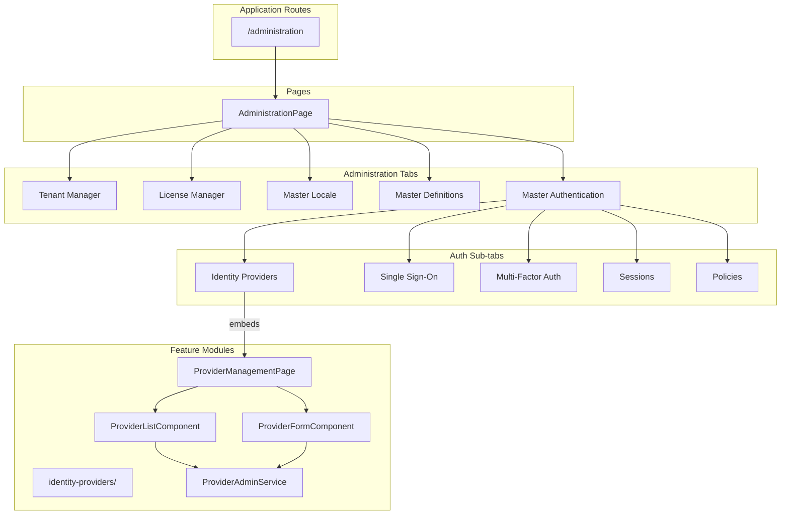

# ADR-008: Identity Provider Management UI Consolidation

**Status:** Proposed
**Date:** 2026-02-25
**Decision Makers:** Architecture Team, Frontend Team
**Category:** Tactical ADR (UI Architecture)

## Context

The EMS frontend currently has **two separate implementations** for managing identity providers:

### Implementation 1: Standalone Feature Module
- **Location:** `/frontend/src/app/features/admin/identity-providers/`
- **Route:** `/admin/identity-providers`
- **Architecture:**
  - Dedicated feature module with lazy-loaded routes
  - Modular components: `ProviderManagementPage`, `ProviderListComponent`, `ProviderFormComponent`
  - Dedicated service: `ProviderAdminService` with signal-based state management
  - Typed models: `ProviderConfig`, `ProviderTemplate`, protocol/type enums
  - Template-based provider creation with pre-configured defaults
  - Connection testing capability
  - Full CRUD operations via backend API (`/api/v1/admin/tenants/{tenantId}/providers`)

### Implementation 2: Embedded in Administration Page
- **Location:** `/frontend/src/app/pages/administration/administration.page.ts`
- **Route:** `/administration` (Master Authentication > Identity Providers tab)
- **Architecture:**
  - Inline template within a ~2000+ line monolithic component
  - Static/mock UI with hardcoded provider cards (Local, OAuth/OIDC, SAML, LDAP, UAE Pass)
  - No backend integration (UI mockups only)
  - UAE Pass configuration modal with form bindings
  - Social login toggles (Google, Microsoft, GitHub, Apple)
  - Mixed with other admin sections: Tenant Manager, License Manager, Locale, Definitions

### Key Differences

| Aspect | Feature Module | Administration Page |
|--------|----------------|---------------------|
| API Integration | Yes - Full CRUD | No - Static UI |
| State Management | Signal-based service | Component-level signals |
| Provider Types | Dynamic from API | Hardcoded 5 providers |
| Protocols Supported | OIDC, SAML, LDAP, OAuth2 | Display only |
| Connection Testing | Yes | No |
| Templates | Yes (8 templates) | No |
| Component Reusability | High | None (inline) |
| Tenant Context | Yes (from resolver/route) | Yes (from route) |
| Lines of Code | ~1200 (distributed) | ~600 (inline) |

### Problems with Current State

1. **Duplication**: Same functionality in two places with different implementations
2. **Inconsistent UX**: Users may encounter different interfaces depending on navigation path
3. **Maintenance Burden**: Bug fixes and features must be applied twice
4. **Technical Debt**: Administration page is monolithic (~54,000 tokens / ~2000+ lines)
5. **Data Mismatch**: Standalone module shows real data; admin page shows static mockups
6. **API Contract Violation**: Backend has a well-defined Admin Provider Management API (OpenAPI spec) but only one UI uses it

### Backend API Alignment

The auth-facade service provides a comprehensive Admin Provider Management API:

```
GET    /api/v1/admin/tenants/{tenantId}/providers          - List providers
POST   /api/v1/admin/tenants/{tenantId}/providers          - Create provider
GET    /api/v1/admin/tenants/{tenantId}/providers/{id}     - Get provider
PUT    /api/v1/admin/tenants/{tenantId}/providers/{id}     - Update provider
DELETE /api/v1/admin/tenants/{tenantId}/providers/{id}     - Delete provider
POST   /api/v1/admin/tenants/{tenantId}/providers/cache/invalidate - Clear cache
```

This API supports:
- All protocols: OIDC, SAML, LDAP, OAuth2
- All provider types: Keycloak, Auth0, Okta, Azure AD, UAE Pass, LDAP, Custom
- Connection testing and validation
- Encryption of sensitive credentials

## Decision

**Consolidate identity provider management by embedding the feature module components within the Administration page, retiring the standalone route.**

### Recommended Approach: Composition over Monolith

Rather than maintaining two implementations or completely extracting all functionality, we adopt a **component composition** approach:

1. **Retain the feature module** as the source of truth for IdP management components
2. **Embed the feature components** within the Administration page's "Identity Providers" tab
3. **Remove the standalone route** (`/admin/identity-providers`) to eliminate duplicate navigation paths
4. **Refactor the Administration page** to use composition for each section

### Implementation Architecture



### Code Changes Required

#### 1. Administration Page - Use Composition

```typescript
// administration.page.ts
import { ProviderManagementPage } from '../../features/admin/identity-providers';

@Component({
  selector: 'app-administration-page',
  standalone: true,
  imports: [
    // ... other imports
    ProviderManagementPage,  // Import the feature component
  ],
  template: `
    <!-- Identity Providers Tab -->
    @if (authTab() === 'providers') {
      <app-provider-management-page />
    }

    <!-- SSO Tab - kept inline or extracted similarly -->
    @if (authTab() === 'sso') {
      <!-- SSO content -->
    }
  `
})
export class AdministrationPage { }
```

#### 2. Remove Standalone Route

```typescript
// app.routes.ts - REMOVE this route
// {
//   path: 'admin/identity-providers',
//   loadChildren: () =>
//     import('./features/admin/identity-providers/identity-providers.routes')
//       .then(m => m.IDENTITY_PROVIDER_ROUTES),
//   canActivate: [authGuard],
//   data: { roles: ['admin', 'super-admin'] }
// },
```

#### 3. Feature Module Updates

Update the feature module to support both standalone and embedded usage:

```typescript
// provider-management.page.ts
@Component({
  selector: 'app-provider-management-page',
  standalone: true,
  // ... existing implementation
})
export class ProviderManagementPage implements OnInit {
  @Input() embedded = false;  // When true, hide page header (parent provides it)

  // Existing implementation continues to work
}
```

### Migration Path

| Phase | Action | Timeline |
|-------|--------|----------|
| 1 | Add `embedded` input to ProviderManagementPage | 1 day |
| 2 | Import and embed in AdministrationPage | 1 day |
| 3 | Remove inline IdP UI from AdministrationPage | 1 day |
| 4 | Remove standalone route from app.routes.ts | 1 day |
| 5 | Update navigation/breadcrumbs if needed | 1 day |
| 6 | QA testing | 2 days |

**Total estimated effort:** 1 week

## Consequences

### Positive

1. **Single Source of Truth**: One implementation for IdP management
2. **Real Data**: Administration page shows actual configured providers, not mockups
3. **Feature Complete**: Full CRUD, connection testing, templates available everywhere
4. **Reduced Code**: Remove ~600 lines of duplicated inline code
5. **Consistent UX**: Users have same experience regardless of navigation path
6. **Easier Maintenance**: Bug fixes apply once
7. **Better Architecture**: Composition promotes modular design
8. **API Alignment**: UI properly consumes the backend Admin Provider Management API

### Negative

1. **Migration Effort**: Requires refactoring the Administration page
2. **Breaking Change**: Removes `/admin/identity-providers` route (may affect bookmarks)
3. **Testing**: Need to verify embedded component behavior matches standalone
4. **Dependency**: Administration page now depends on identity-providers feature module

### Neutral

- Backend API unchanged
- ProviderAdminService remains singleton (providedIn: 'root')
- Feature module structure preserved for potential future standalone use
- Other authentication sub-tabs (SSO, MFA, Sessions, Policies) remain inline for now

## Alternatives Considered

### Alternative 1: Keep Both Routes

**Description:** Maintain both implementations, sync features manually.

**Pros:**
- No migration effort
- Both entry points preserved

**Cons:**
- Ongoing maintenance burden
- Divergent implementations inevitable
- Confusing for users
- Technical debt accumulation

**Verdict:** Rejected - unsustainable long-term.

### Alternative 2: Promote Standalone Route as Primary

**Description:** Keep `/admin/identity-providers` as the only IdP management UI, link from Administration page.

**Pros:**
- Standalone module is more complete
- Clear separation of concerns

**Cons:**
- Breaks the unified Administration dashboard concept
- Navigation inconsistency (some sections inline, some linked out)
- Poor UX for administrators who expect integrated dashboard

**Verdict:** Rejected - breaks dashboard UX pattern.

### Alternative 3: Full Administration Page Decomposition

**Description:** Extract ALL sections (Tenant, License, Locale, etc.) into feature modules.

**Pros:**
- Fully modular architecture
- Maximum reusability
- Smaller, focused components

**Cons:**
- Massive refactoring effort
- Overkill for current requirements
- Risk of over-engineering

**Verdict:** Deferred - consider for future if other sections need reuse.

### Alternative 4: Micro-Frontend Architecture

**Description:** Use Module Federation or similar to load IdP management as independent application.

**Pros:**
- Complete isolation
- Independent deployability

**Cons:**
- Complexity overkill for current scale
- Build/runtime overhead
- Unnecessary for single-team development

**Verdict:** Rejected - complexity not justified.

## Implementation Notes

### Component Interface Design

The `ProviderManagementPage` component should expose minimal inputs for embedded usage:

```typescript
interface ProviderManagementInputs {
  embedded?: boolean;      // Hide standalone page chrome
  tenantId?: string;       // Override tenant resolution
  showHeader?: boolean;    // Control header visibility
}
```

### Tenant Context Resolution

The embedded component inherits tenant context from:
1. Route parameter (if available)
2. Parent component injection (via context service)
3. TenantResolverService (fallback)

No changes needed - existing resolution logic handles all cases.

### Testing Considerations

1. **Unit Tests**: Existing feature module tests remain valid
2. **Integration Tests**: Add tests for embedded behavior
3. **E2E Tests**: Update navigation paths, remove standalone route tests
4. **Visual Regression**: Verify styling consistency when embedded

### Rollback Plan

If issues arise post-deployment:
1. Re-add the standalone route to app.routes.ts
2. Restore inline UI in Administration page
3. Both implementations work independently

## References

- [ADR-007: Provider-Agnostic Auth Facade](./ADR-007-auth-facade-provider-agnostic.md) - Backend architecture
- [Auth Facade OpenAPI Spec](/backend/auth-facade/openapi.yaml) - Admin Provider Management API
- [Angular Standalone Components](https://angular.io/guide/standalone-components)
- [Component Composition Patterns](https://angular.io/guide/component-interaction)

---

**Implementation Status:** Proposed (2026-02-25)

**Affected Files:**
- `/frontend/src/app/pages/administration/administration.page.ts` - Refactor to use composition
- `/frontend/src/app/app.routes.ts` - Remove standalone route
- `/frontend/src/app/features/admin/identity-providers/pages/provider-management.page.ts` - Add embedded input
- `/frontend/src/app/features/admin/identity-providers/index.ts` - Ensure proper exports

**Review Required By:**
- Frontend Lead
- Architecture Team
- UX Team (for navigation flow approval)
