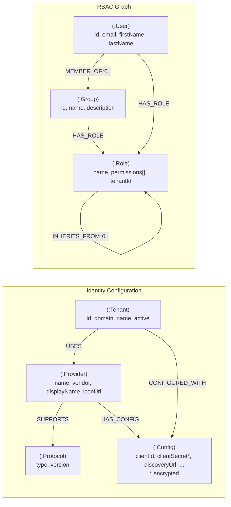
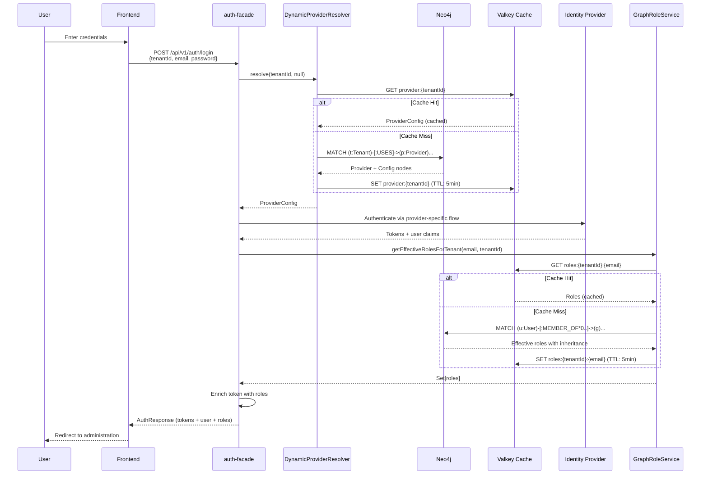
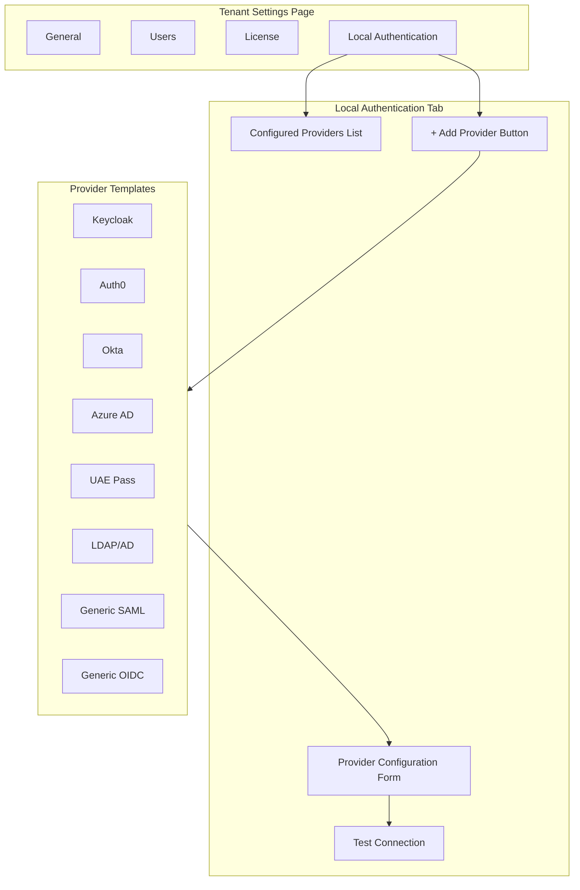

# ADR-009: Auth Facade Dynamic Identity Broker with Neo4j Graph

**Status:** Accepted
**Date:** 2026-02-25
**Decision Makers:** Architecture Team
**Category:** Strategic ADR (Identity Architecture)
**Extends:** [ADR-007](./ADR-007-auth-facade-provider-agnostic.md) (Provider-Agnostic Auth Facade)
**Related:** [ADR-001](./ADR-001-neo4j-primary.md) (Neo4j as Primary Database)

## Scope Boundary

This ADR defines the **identity-domain graph architecture** for `auth-facade` (provider configuration, protocol mapping, and graph-based RBAC patterns).

- Platform-wide application database standard is governed by [ADR-001](./ADR-001-neo4j-primary.md).
- Future graph-per-tenant routing mechanics are governed by [ADR-010](./ADR-010-graph-per-tenant-routing.md).
- This ADR does not replace tenant isolation strategy decisions from [ADR-003](./ADR-003-database-per-tenant.md).

## Context and Problem Statement

EMS requires a provider-agnostic identity broker that supports enterprise customers with diverse identity infrastructure requirements. While [ADR-007](./ADR-007-auth-facade-provider-agnostic.md) established the Strategy Pattern for provider abstraction, several challenges remain:

### Current Limitations

1. **Static Configuration**: Provider selection via `@ConditionalOnProperty` requires application restart to switch providers
2. **Global Provider**: Single provider per deployment; cannot support per-tenant provider selection
3. **No Runtime Management**: Administrators cannot configure identity providers through the UI
4. **Flat Role Model**: JWT claim extraction does not support role inheritance or group hierarchies
5. **Scattered Configuration**: Provider credentials stored in YAML files, not centralized

### Enterprise Requirements

1. **Per-Tenant Identity Configuration**: Each tenant must configure their own identity providers in their "Local Authentication" settings, not a global admin page
2. **Multi-Provider Support**: A tenant may use multiple providers (e.g., corporate LDAP + social login)
3. **Government Compliance**: Support for government-mandated providers (UAE Pass, IBM IAM for government contracts)
4. **Dynamic Resolution**: Resolve provider configuration at runtime without service restart
5. **Role Inheritance**: Support hierarchical RBAC with graph-based role inheritance
6. **Protocol Flexibility**: Support OIDC, SAML 2.0, LDAP, and OAuth 2.0 protocols

### Key Question

How do we evolve the auth-facade from static, single-provider deployment to a dynamic, per-tenant identity broker while leveraging Neo4j's graph capabilities for both configuration storage and hierarchical RBAC?

## Decision Drivers

1. **Multi-Tenancy First**: Per-tenant isolation is a core architectural principle (see [ADR-003](./ADR-003-database-per-tenant.md))
2. **Neo4j as Single Data Store**: All application data in Neo4j (see [ADR-001](./ADR-001-neo4j-primary.md)); avoid introducing configuration databases
3. **Graph-Native RBAC**: Role inheritance and group hierarchies are natural graph problems
4. **Runtime Configurability**: Tenant admins self-service their identity provider setup
5. **BFF Pattern Preservation**: Maintain Backend-for-Frontend security model (secrets never in browser)
6. **Protocol Agnosticism**: Support diverse protocols without code changes

## Considered Options

### Option 1: Database-per-Provider Configuration Tables (Rejected)

Store provider configurations in PostgreSQL tables with tenant foreign keys.

**Pros:**
- Familiar relational model
- Standard Spring Data JPA patterns

**Cons:**
- Introduces relational database for application data (violates ADR-001)
- Role hierarchy requires recursive CTEs or application-level traversal
- No natural representation of provider-protocol relationships
- Tenant-provider-config relationships require JOIN tables

**Verdict:** Rejected - contradicts Neo4j-first strategy and poorly represents graph relationships.

### Option 2: Configuration Service with etcd/Consul (Rejected)

Store provider configurations in distributed configuration store (etcd, Consul, or Spring Cloud Config Server).

**Pros:**
- Purpose-built for configuration
- Change notification built-in
- Industry standard for service discovery

**Cons:**
- Another infrastructure component to manage
- Not designed for complex relationships (tenant-provider-protocol)
- No built-in graph traversal for RBAC
- Separates configuration from domain data

**Verdict:** Rejected - adds infrastructure complexity without graph benefits.

### Option 3: Neo4j Identity Graph (Selected)

Store all identity configurations, provider relationships, and RBAC structures in Neo4j using a purpose-built graph schema.

**Pros:**
- Unified data store (aligns with ADR-001)
- Native graph traversal for role inheritance
- Natural relationships: Tenant USES Provider, Provider SUPPORTS Protocol
- O(1) relationship traversal for deep role lookups
- Graph queries for complex authorization patterns
- Single source of truth for identity domain

**Cons:**
- Learning curve for Cypher queries
- Less conventional than relational configuration
- Neo4j performance tuning required for high-throughput auth

**Verdict:** Selected - aligns with architectural principles and provides superior modeling for identity relationships.

### Option 4: Hybrid YAML + Neo4j for RBAC Only (Rejected)

Keep provider configurations in YAML files but use Neo4j only for RBAC (roles, groups, permissions).

**Pros:**
- Simpler migration from current state
- Familiar configuration format
- Neo4j for RBAC only

**Cons:**
- Two configuration sources to maintain
- Cannot achieve runtime provider management
- YAML changes still require restart
- Inconsistent architecture

**Verdict:** Rejected - does not solve runtime configuration requirement.

## Decision Outcome

**Implement Neo4j as the sole database for identity configuration and RBAC, creating a unified Identity Graph that stores tenant-provider relationships, protocol configurations, encrypted credentials, and hierarchical role structures.**

### Architecture Overview

> **Implementation Reality (2026-02-25):** The Neo4j-backed provider graph, `DynamicProviderResolver`, `Neo4jProviderResolver`, and tenant provider admin APIs are implemented. Only `KeycloakIdentityProvider` is implemented as an authentication execution adapter. Other provider adapters shown below are target-state.

```mermaid
flowchart TB
    subgraph frontend["Frontend (Angular)"]
        direction TB
        LoginPage["Login Page"]
        LocalAuth["Local Authentication Tab<br/>(Per-Tenant Admin)"]
        AuthFacade["AuthFacade<br/>(Abstract Class)"]
        KCImpl["KeycloakAuthFacade"]
        A0Impl["Auth0AuthFacade"]
    end

    subgraph authfacade["Auth Facade Service (Spring Boot)"]
        direction TB
        AuthCtrl["AuthController"]
        AdminCtrl["AdminProviderController"]
        AuthSvc["AuthService"]

        subgraph strategy["Strategy Pattern"]
            IdP["IdentityProvider<br/>(Interface)"]
            KC["KeycloakIdentityProvider"]
            A0["Auth0IdentityProvider"]
            OK["OktaIdentityProvider"]
            AZ["AzureAdIdentityProvider"]
            UAE["UaePassIdentityProvider"]
            IBM["IbmIamIdentityProvider"]
            LDAP["LdapIdentityProvider"]
        end

        subgraph resolver["Dynamic Resolution"]
            DPR["DynamicProviderResolver"]
            Neo4jRes["Neo4jProviderResolver"]
            InMemRes["InMemoryProviderResolver<br/>(Fallback)"]
        end

        subgraph rbac["Graph RBAC"]
            GRS["GraphRoleService"]
            RoleConv["ProviderAgnosticRoleConverter"]
        end

        subgraph security["Security Layer"]
            PrincipalExt["PrincipalExtractor"]
            JwtFilter["JwtValidationFilter"]
            SeatVal["SeatValidationService"]
        end
    end

    subgraph neo4j["Neo4j Identity Graph"]
        direction TB
        TenantN["(:Tenant)"]
        ProviderN["(:Provider)"]
        ProtocolN["(:Protocol)"]
        ConfigN["(:Config)"]
        UserN["(:User)"]
        GroupN["(:Group)"]
        RoleN["(:Role)"]
    end

    subgraph cache["Valkey Cache"]
        ProvCache["Provider Config Cache"]
        RoleCache["Role Lookup Cache"]
        SeatCache["Seat Status Cache"]
    end

    subgraph idps["External Identity Providers"]
        Keycloak["Keycloak"]
        Auth0["Auth0"]
        Okta["Okta"]
        AzureAD["Azure AD"]
        UaePass["UAE Pass"]
        IbmIam["IBM IAM"]
        LdapSrv["LDAP/AD"]
    end

    LoginPage --> AuthFacade
    LocalAuth --> AdminCtrl
    AuthFacade --> KCImpl
    AuthFacade --> A0Impl

    AuthCtrl --> AuthSvc
    AuthSvc --> IdP
    IdP --> DPR
    DPR --> Neo4jRes
    DPR --> InMemRes
    Neo4jRes --> TenantN
    AuthSvc --> GRS
    AuthSvc --> SeatVal

    KC --> Keycloak
    A0 --> Auth0
    OK --> Okta
    AZ --> AzureAD
    UAE --> UaePass
    IBM --> IbmIam
    LDAP --> LdapSrv

    TenantN -->|"USES"| ProviderN
    ProviderN -->|"SUPPORTS"| ProtocolN
    TenantN -->|"CONFIGURED_WITH"| ConfigN
    ProviderN -->|"HAS_CONFIG"| ConfigN
    UserN -->|"MEMBER_OF"| GroupN
    GroupN -->|"HAS_ROLE"| RoleN
    RoleN -->|"INHERITS_FROM"| RoleN

    Neo4jRes --> ProvCache
    GRS --> RoleCache
    SeatVal --> SeatCache
```



### Neo4j Graph Schema

The Identity Graph uses the following node and relationship structure.

#### Graph Schema Diagram



#### Node Definitions

| Node Label | Properties | Description |
| ------------ | ------------ | ------------- |
| `Tenant` | `id`, `domain`, `name`, `active`, `createdAt`, `updatedAt` | Tenant identity configuration root |
| `Provider` | `name`, `vendor`, `displayName`, `iconUrl`, `description` | Identity provider type (Keycloak, Auth0, etc.) |
| `Protocol` | `type`, `version` | Supported protocol (OIDC, SAML, LDAP, OAuth2) |
| `Config` | `clientId`, `clientSecret` (encrypted), `discoveryUrl`, `realm`, `scope`, `issuerUri`, `enabled`, `priority` | Tenant-specific provider configuration |
| `User` | `id`, `email`, `firstName`, `lastName`, `tenantId` | User identity (synced from IdP) |
| `Group` | `id`, `name`, `description`, `tenantId` | User group for role assignment |
| `Role` | `name`, `permissions[]`, `tenantId`, `description` | Role with permission set |

#### Relationship Definitions

| Relationship | From | To | Properties | Description |
| -------------- | ------ | ----- | ------------ | ------------- |
| `USES` | Tenant | Provider | `since`, `primary` | Tenant uses this provider type |
| `SUPPORTS` | Provider | Protocol | - | Provider supports this protocol |
| `CONFIGURED_WITH` | Tenant | Config | - | Tenant has this configuration |
| `HAS_CONFIG` | Provider | Config | - | Configuration belongs to provider |
| `MEMBER_OF` | User | Group | `since`, `expiresAt` | User membership (variable depth: 0..) |
| `HAS_ROLE` | User/Group | Role | `assignedAt`, `assignedBy` | Direct role assignment |
| `INHERITS_FROM` | Role | Role | - | Role inheritance (variable depth: 0..) |

#### Cypher Schema Examples

```cypher
// Create indexes for performance
CREATE INDEX tenant_id IF NOT EXISTS FOR (t:Tenant) ON (t.id);
CREATE INDEX provider_name IF NOT EXISTS FOR (p:Provider) ON (p.name);
CREATE INDEX user_email IF NOT EXISTS FOR (u:User) ON (u.email);
CREATE INDEX role_name IF NOT EXISTS FOR (r:Role) ON (r.name);
CREATE INDEX config_tenant IF NOT EXISTS FOR (c:Config) ON (c.tenantId);

// Example: Tenant with Keycloak provider
CREATE (t:Tenant {id: 'acme-corp', domain: 'acme.com', name: 'Acme Corporation', active: true})
CREATE (p:Provider {name: 'KEYCLOAK', vendor: 'Red Hat', displayName: 'Keycloak'})
CREATE (proto:Protocol {type: 'OIDC', version: '1.0'})
CREATE (c:Config {
    clientId: 'acme-webapp',
    clientSecret: 'ENC(encrypted-secret)',
    discoveryUrl: 'https://keycloak.acme.com/realms/acme/.well-known/openid-configuration',
    realm: 'acme',
    enabled: true,
    priority: 1
})
CREATE (t)-[:USES]->(p)
CREATE (p)-[:SUPPORTS]->(proto)
CREATE (t)-[:CONFIGURED_WITH]->(c)
CREATE (p)-[:HAS_CONFIG]->(c);

// Example: Role hierarchy
CREATE (superAdmin:Role {name: 'SUPER_ADMIN', permissions: ['*'], tenantId: 'system'})
CREATE (tenantAdmin:Role {name: 'TENANT_ADMIN', permissions: ['tenant:*', 'user:*'], tenantId: null})
CREATE (manager:Role {name: 'MANAGER', permissions: ['user:read', 'report:*'], tenantId: null})
CREATE (user:Role {name: 'USER', permissions: ['self:*', 'dashboard:read'], tenantId: null})
CREATE (tenantAdmin)-[:INHERITS_FROM]->(superAdmin)
CREATE (manager)-[:INHERITS_FROM]->(tenantAdmin)
CREATE (user)-[:INHERITS_FROM]->(manager);

// Query: Get effective roles with inheritance
MATCH (u:User {email: $email})-[:MEMBER_OF*0..]->(g:Group)-[:HAS_ROLE]->(r:Role)
WITH u, COLLECT(DISTINCT r) AS groupRoles
MATCH (u)-[:HAS_ROLE]->(dr:Role)
WITH groupRoles + COLLECT(dr) AS directAndGroupRoles
UNWIND directAndGroupRoles AS role
MATCH (role)-[:INHERITS_FROM*0..]->(inherited:Role)
RETURN COLLECT(DISTINCT inherited.name) AS effectiveRoles;

// Query: Get tenant's configured providers
MATCH (t:Tenant {id: $tenantId})-[:USES]->(p:Provider)-[:SUPPORTS]->(proto:Protocol)
MATCH (t)-[:CONFIGURED_WITH]->(c:Config)<-[:HAS_CONFIG]-(p)
WHERE c.enabled = true
RETURN p.name AS provider, p.displayName, proto.type AS protocol, c
ORDER BY c.priority;
```

### Backend Architecture

#### Component Responsibilities

| Component | Responsibility |
| ----------- | ---------------- |
| `IdentityProvider` | Interface for authentication operations |
| `KeycloakIdentityProvider`, `Auth0IdentityProvider`, etc. | Vendor-specific implementations (Keycloak implemented; others planned) |
| `DynamicProviderResolver` | Runtime resolution of provider from Neo4j graph |
| `Neo4jProviderResolver` | Neo4j-backed provider config lookup |
| `InMemoryProviderResolver` | Fallback for static/dev environments |
| `ProviderAgnosticRoleConverter` | Normalizes JWT claims to internal roles |
| `GraphRoleService` | Deep role lookup with inheritance via Cypher |
| `EncryptionService` | Jasypt-based encryption for secrets in Neo4j |
| `AdminProviderController` | REST API for tenant IdP management |

#### Key Interfaces

```java
/**
 * Dynamic provider resolution - loads config from Neo4j at runtime.
 */
public interface DynamicProviderResolver {

    /**
     * Resolve provider configuration for a tenant.
     *
     * @param tenantId Tenant identifier
     * @param providerHint Optional provider name (for multi-provider tenants)
     * @return ProviderConfig with connection details
     */
    ProviderConfig resolve(String tenantId, @Nullable String providerHint);

    /**
     * Get all enabled providers for a tenant.
     */
    List<ProviderConfig> getEnabledProviders(String tenantId);

    /**
     * Invalidate cached provider config after admin changes.
     */
    void invalidateCache(String tenantId);
}

/**
 * Graph-based RBAC service with role inheritance.
 */
public interface GraphRoleService {

    /**
     * Get effective roles including inherited roles via graph traversal.
     */
    Set<String> getEffectiveRoles(String email);

    /**
     * Get effective roles for a user within a specific tenant.
     */
    Set<String> getEffectiveRolesForTenant(String email, String tenantId);

    /**
     * Get Spring Security authorities for a user.
     */
    Collection<GrantedAuthority> getAuthorities(String email);
}
```

#### Authentication Flow with Dynamic Resolution



### Frontend Architecture

#### Per-Tenant Configuration UI

The "Local Authentication" tab appears in each tenant's settings, not a global admin page. Tenant administrators configure their own identity providers.



#### Frontend Abstract Class

```typescript
/**
 * Abstract Auth Facade - DI token for authentication.
 * Components inject this abstraction, not the concrete implementation.
 *
 * Provider configured at app startup based on environment.
 * Runtime provider selection delegated to backend (BFF pattern).
 */
export abstract class AuthFacade {
  // State signals
  abstract readonly user: Signal<AuthUser | null>;
  abstract readonly isAuthenticated: Signal<boolean>;
  abstract readonly isLoading: Signal<boolean>;
  abstract readonly error: Signal<AuthError | null>;
  abstract readonly mfaRequired: Signal<boolean>;
  abstract readonly availableProviders: Signal<ProviderInfo[]>;

  // Authentication methods
  abstract login(email: string, password: string, rememberMe?: boolean): Observable<AuthResponse>;
  abstract loginWithProvider(providerId: string, returnUrl?: string): void;
  abstract logout(redirectToLogin?: boolean): Observable<void>;
  abstract refreshToken(): Observable<AuthResponse>;
  abstract completeOAuthCallback(code: string, state: string): Observable<AuthResponse>;

  // MFA methods
  abstract setupMfa(): Observable<MfaSetupResponse>;
  abstract verifyMfaCode(code: string): Observable<AuthResponse>;

  // Provider discovery
  abstract getAvailableProviders(tenantId: string): Observable<ProviderInfo[]>;
}

/**
 * Provider information for login page rendering.
 */
export interface ProviderInfo {
  id: string;
  displayName: string;
  iconUrl?: string;
  protocol: 'OIDC' | 'SAML' | 'LDAP' | 'OAUTH2';
  primary: boolean;
}
```

### Supported Identity Providers

| Provider | Protocol | Status | Configuration |
| ---------- | ---------- | -------- | --------------- |
| Keycloak | OIDC, SAML | Implemented (default adapter) | Realm, Client ID/Secret, Discovery URL |
| Auth0 | OIDC | Planned (target-state adapter) | Domain, Client ID/Secret, Audience |
| Okta | OIDC | Planned (target-state adapter) | Domain, Client ID/Secret, Authorization Server |
| Azure AD | OIDC | Planned (target-state adapter) | Tenant ID, Client ID/Secret, Scope |
| UAE Pass | OAuth 2.0 | Planned (target-state adapter) | Environment, Client ID/Secret, Redirect URI |
| IBM IAM | SAML 2.0 | Planned | Metadata URL, Entity ID, Certificate |
| LDAP/AD | LDAP | Planned | Server URL, Base DN, Bind DN/Password |
| Generic OIDC | OIDC | Planned (target-state adapter) | Discovery URL, Client ID/Secret |
| Generic SAML | SAML 2.0 | Planned | Metadata URL, Entity ID |

### Security Considerations

#### Secret Encryption

All sensitive configuration values (client secrets, bind passwords) are encrypted at rest in Neo4j using Jasypt:

```java
@Service
public class JasyptEncryptionService implements EncryptionService {

    private final StringEncryptor encryptor;

    public String encrypt(String plainText) {
        return "ENC(" + encryptor.encrypt(plainText) + ")";
    }

    public String decrypt(String encryptedText) {
        if (encryptedText.startsWith("ENC(") && encryptedText.endsWith(")")) {
            String cipherText = encryptedText.substring(4, encryptedText.length() - 1);
            return encryptor.decrypt(cipherText);
        }
        return encryptedText;
    }
}
```

#### Cache Invalidation

Provider configurations and role lookups are cached in Valkey with automatic TTL and explicit invalidation:

| Cache Key Pattern | TTL | Invalidation Trigger |
| ------------------- | ----- | ---------------------- |
| `provider:{tenantId}` | 5 min | Admin updates provider config |
| `roles:{tenantId}:{email}` | 5 min | Role/group assignment change |
| `seat:{tenantId}:{userId}` | 5 min | License assignment change |

## Consequences

### Positive

1. **Per-Tenant Flexibility**: Each tenant configures their own identity providers without affecting others
2. **Runtime Configuration**: Add/modify providers without service restart
3. **Unified Data Model**: All identity data in Neo4j aligns with ADR-001
4. **Graph-Native RBAC**: O(1) role inheritance traversal via Cypher
5. **Self-Service Administration**: Tenant admins manage their own IdP configuration
6. **Protocol Agnostic**: Support OIDC, SAML, LDAP, OAuth 2.0 through unified interface
7. **Enterprise Readiness Path**: Government-provider model (UAE Pass, IBM IAM) is defined for rollout
8. **Reduced Technical Debt**: Single database technology for all identity concerns
9. **Testability**: Mock provider resolver for unit tests without IdP dependencies

### Negative

1. **Neo4j Dependency**: Auth flow depends on Neo4j availability (mitigated by caching)
2. **Query Complexity**: Cypher learning curve for team
3. **Performance Tuning**: Neo4j indexes required for high-throughput auth queries
4. **Migration Effort**: Existing YAML configurations must be migrated to graph
5. **Encryption Key Management**: Master encryption key must be securely managed
6. **Cache Consistency**: Eventual consistency between Neo4j and Valkey cache

### Neutral

- Keycloak remains default provider for new deployments
- BFF pattern unchanged - frontend never sees provider details
- JWT format and token handling unchanged
- Existing `IdentityProvider` interface preserved

## Implementation Notes

### Migration Path

| Phase | Action | Timeline |
| ------- | -------- | ---------- |
| 1 | Create Neo4j schema and seed data initializer | Week 1 |
| 2 | Implement `Neo4jProviderResolver` alongside existing static resolver | Week 1-2 |
| 3 | Add `AdminProviderController` REST endpoints | Week 2 |
| 4 | Build "Local Authentication" UI in tenant settings | Week 3 |
| 5 | Implement `GraphRoleService` with Cypher queries | Week 3-4 |
| 6 | Migrate existing YAML configs to Neo4j | Week 4 |
| 7 | Feature flag: enable dynamic broker per tenant | Week 5 |
| 8 | Remove legacy static configuration code | Week 6+ |

### Configuration Toggle

```yaml
auth:
  facade:
    dynamic-broker:
      enabled: ${AUTH_DYNAMIC_BROKER_ENABLED:true}
      fallback-provider: keycloak
      cache-ttl: 5m
```

### Monitoring

Key metrics to track:
- `auth.provider.resolution.time` - Time to resolve provider from graph
- `auth.provider.cache.hit.ratio` - Cache effectiveness
- `auth.graph.role.lookup.time` - Role inheritance query time
- `auth.provider.config.count` - Total providers configured per tenant

## References

- [ADR-001: Neo4j as Primary Database](./ADR-001-neo4j-primary.md)
- [ADR-003: Graph-per-Tenant Multi-Tenancy](./ADR-003-database-per-tenant.md)
- [ADR-007: Provider-Agnostic Auth Facade](./ADR-007-auth-facade-provider-agnostic.md)
- [ADR-008: Identity Provider Management UI Consolidation](./ADR-008-idp-management-consolidation.md)
- [Arc42 Section 8: Crosscutting Concepts - Security](../arc42/08-crosscutting.md)
- [Neo4j Graph Data Modeling](https://neo4j.com/developer/guide-data-modeling/)
- [Spring Data Neo4j](https://docs.spring.io/spring-data/neo4j/docs/current/reference/html/)
- [Jasypt Spring Boot](https://github.com/ulisesbocchio/jasypt-spring-boot)

---

**Implementation Status:** In Progress (2026-02-25) - core graph/resolver/admin management implemented; non-Keycloak provider adapters pending

**Key Files:**
- `/backend/auth-facade/src/main/java/com/ems/auth/provider/IdentityProvider.java`
- `/backend/auth-facade/src/main/java/com/ems/auth/provider/DynamicProviderResolver.java`
- `/backend/auth-facade/src/main/java/com/ems/auth/provider/Neo4jProviderResolver.java`
- `/backend/auth-facade/src/main/java/com/ems/auth/service/GraphRoleService.java`
- `/backend/auth-facade/src/main/java/com/ems/auth/graph/entity/*.java`
- `/backend/auth-facade/src/main/java/com/ems/auth/graph/repository/AuthGraphRepository.java`
- `/backend/auth-facade/src/main/java/com/ems/auth/controller/AdminProviderController.java`
- `/frontend/src/app/core/auth/auth-facade.ts`
- `/frontend/src/app/features/admin/identity-providers/`

**Review Required By:**
- Architecture Team
- Security Team (for encryption approach)
- DevOps (for Neo4j performance tuning)
