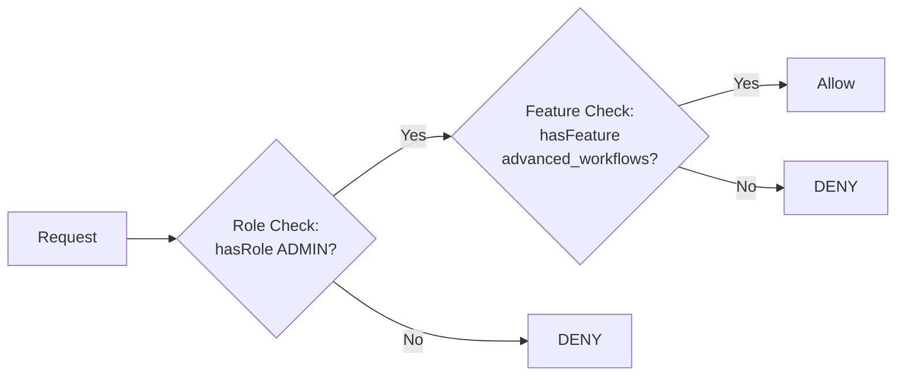
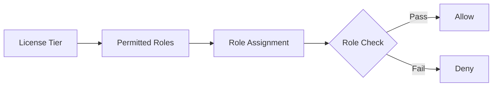
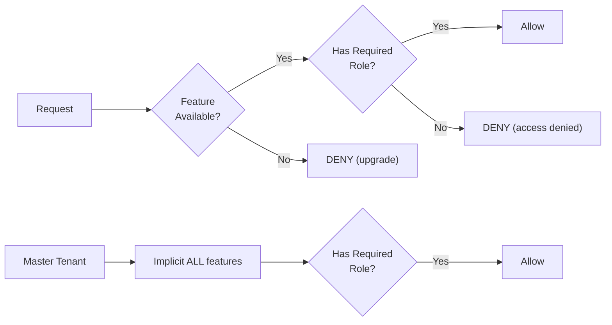
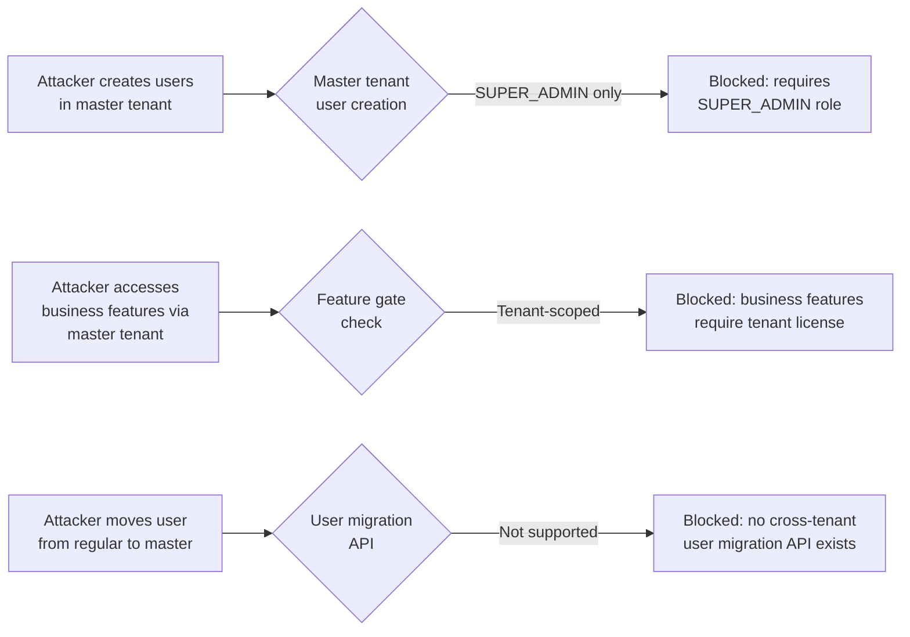
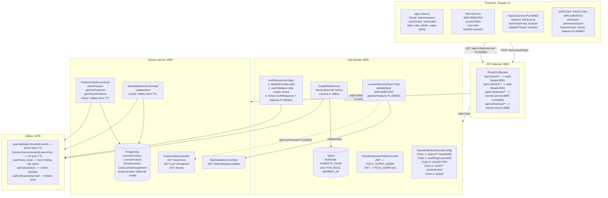

# ADR-014: RBAC and Licensing Integration Architecture

**Status:** Proposed
**Date:** 2026-02-26
**Decision Makers:** Architecture Review Board
**Author:** ARCH Agent

## Context

EMSIST is a multi-tenant SaaS platform that currently has two independent authorization subsystems:

1. **RBAC (Role-Based Access Control)** -- A 5-level role hierarchy (SUPER_ADMIN > ADMIN > MANAGER > USER > VIEWER) implemented in Neo4j with graph-based inheritance, extracted from JWT tokens by `ProviderAgnosticRoleConverter`, and enforced by Spring Security filter chains in `DynamicBrokerSecurityConfig`.

2. **Licensing** -- A product/feature/seat model owned by `license-service`, with feature gating (`FeatureGateServiceImpl` with Valkey cache) and seat validation (`SeatValidationServiceImpl`). Per ADR-016 (Polyglot Persistence), licensing data is persisted in PostgreSQL, which is the correct and permanent database for the license domain.

These two systems are loosely connected today: the `auth-facade` calls `license-service` via Feign during login for seat validation (skipping master tenant), and the frontend uses role-based route guards. However, the systems lack a coherent integration design, which causes the following problems:

### Current Problems

1. **SUPER_ADMIN access denied on administration page** -- The superadmin can authenticate but encounters errors accessing protected resources because the RBAC-license boundary is unclear at runtime.

2. **No feature context in the token or frontend** -- The JWT contains roles but no license/feature information. The frontend has `roleGuard` and `permissionGuard` but no `featureGuard`. Feature checks require live calls to `license-service`, which has no API gateway route for its `/api/v1/features/**` endpoint.

3. **Master tenant ambiguity** -- `RealmResolver.isMasterTenant()` bypasses seat validation during login, but there is no corresponding bypass in downstream services or the frontend. The master tenant has no license record and no feature set, so any feature-gate check against license-service will return "denied".

4. **No consumer of feature gate API** -- `FeatureGateController` exists at `/api/v1/features/**` in license-service but has no API gateway route and no callers in any other service or frontend code.

5. **Roles and features are unrelated** -- A user can have ADMIN role but no Enterprise license, or have an Enterprise license but only VIEWER role. There is no documented policy for how these dimensions interact.

### Decision Drivers

* Master tenant superadmin must be able to access all administration capabilities without license restrictions
* Regular tenant users need both valid roles AND valid license/features to access functionality
* The solution must work with the existing Keycloak JWT + ProviderAgnosticRoleConverter + Neo4j RBAC graph
* License feature state must be available to the frontend without per-request calls to license-service
* The architecture must handle license-service unavailability gracefully (circuit breaker already exists)
* Cache invalidation must propagate quickly when licenses change

## Database Authority Alignment

This ADR follows ADR-001 (Polyglot Persistence, amended 2026-02-27):

- **auth-facade** persists RBAC data (roles, providers, tenants) in **Neo4j** -- graph relationships are the natural fit for role inheritance and provider configuration.
- **license-service** persists licensing data (products, features, licenses, seat assignments) in **PostgreSQL** -- relational tables are the correct fit for transactional licensing records.
- This is a deliberate polyglot persistence strategy, not technical debt.

### Deployment Model Neutrality

This ADR applies equally to **SaaS** and **on-premise** deployments:

| Aspect | SaaS Deployment | On-Premise Deployment |
|--------|----------------|----------------------|
| License data source | Vendor-managed database records | Imported `.lic` file (see ADR-015) |
| Feature gating | Same `FeatureGateServiceImpl` + Valkey cache | Same -- data source changes, enforcement does not |
| Seat validation | Same `SeatValidationServiceImpl` | Same -- seat counts come from license file instead of catalog |
| RBAC enforcement | Identical -- Neo4j graph + JWT claims | Identical |
| Master tenant | Vendor-operated bootstrap tenant | Client-operated bootstrap tenant (initial setup only) |
| Database technology | PostgreSQL (license-service), Neo4j (auth-facade) | Identical -- no database technology changes between deployment models |

The licensing **enforcement plane** (RBAC + feature gates + seat validation) is deployment-model agnostic. Only the **data source** (how license entitlements enter the system) differs. See ADR-015 for on-premise-specific license file import.

## Considered Alternatives

### Option A: Independent Dimensions (Roles Gate Operations, Licenses Gate Features)

**Description:** RBAC and licensing remain fully independent authorization dimensions. A request must pass BOTH checks: the role check ("is this user allowed to perform this operation?") and the feature check ("is this feature available under the tenant's license?"). Neither dimension knows about the other.

**Enforcement model:**



**Pros:**
- Clean separation of concerns
- Roles and licenses evolve independently
- Familiar pattern (AWS IAM uses similar dual-policy model)
- Easy to reason about: "can do" (role) vs "allowed to do" (license)

**Cons:**
- Two independent enforcement points increase complexity
- Every protected operation needs two checks
- Frontend must understand both dimensions
- Master tenant still needs special handling for the license dimension

### Option B: License Tier Determines Available Roles

**Description:** The license product tier directly constrains which roles a tenant can assign. Starter allows only USER/VIEWER, Pro adds MANAGER, Enterprise enables ADMIN. SUPER_ADMIN is reserved for master tenant.

**Enforcement model:**



**Pros:**
- Single enforcement point (roles only)
- Simpler frontend -- just role guards, no feature guards
- Clear upgrade path: buy higher tier to unlock roles

**Cons:**
- Tightly couples licensing to RBAC -- changing product tiers requires changing role constraints
- Cannot have fine-grained feature gating (e.g., "API Access" feature is not a role)
- Breaks the existing feature model (12 features across 3 products) that is already seeded and designed
- Does not match the existing data model where features are independent of roles

### Option C: Hybrid -- License Gates Features, Roles Gate Operations Within Features (RECOMMENDED)

**Description:** Licensing determines WHICH features/modules are available to a tenant and user. RBAC determines WHAT operations a user can perform within those features. Features are coarse-grained capability switches; roles are fine-grained permission controls.

**Enforcement model:**



**Pros:**
- Natural mapping to existing data model (features in `license_features`, roles in Neo4j `RoleNode`)
- Master tenant gets implicit "all features" without needing a license record
- Frontend can show/hide entire modules based on features AND control operations within modules based on roles
- Feature degradation is natural: a module exists but with reduced capability per tier
- Matches how the seed data is structured (features like `advanced_workflows`, `ai_persona`, `audit_logs`)

**Cons:**
- Slightly more complex than pure-role approach
- Requires feature context to be available at the frontend (solved by token enrichment or dedicated endpoint)
- Two types of "deny" responses that the UI must distinguish

## Decision

**We adopt Option C: Hybrid -- License Gates Features, Roles Gate Operations Within Features.**

The key architectural choices within this decision are detailed below.

### 1. Authorization Dimensions

| Dimension | Source | Scope | Enforcement | Example |
|-----------|--------|-------|-------------|---------|
| **Role** | Neo4j graph via JWT claims | Per-user, per-tenant | Spring Security `hasRole()`, frontend `roleGuard` | "ADMIN can create users" |
| **Feature** | PostgreSQL via license-service (per ADR-016) | Per-tenant + per-user overrides | Backend annotation/filter, frontend `featureGuard` | "Tenant has advanced_workflows" |

### 2. Master Tenant Treatment

The master tenant (identified by `RealmResolver.isMasterTenant()`) receives **implicit unlimited features**. This is enforced at every feature-check point:

- **auth-facade login:** Already bypasses seat validation (line 48 of `AuthServiceImpl.java`) -- no change needed
- **Feature endpoint responses:** When `tenantId` is master, return all known features as enabled
- **Frontend:** When `TenantResolverService.isMasterTenant()` is true, all feature guards resolve to `true`
- **SUPER_ADMIN role:** Has implicit access to all admin operations. No license check is needed because the master tenant has all features, and SUPER_ADMIN has all role permissions.

This means the master tenant never needs a persisted tenant-license record. The feature-gate check short-circuits to "all allowed" for master tenants.

### 2a. Master Tenant Hardening Boundaries

The master tenant receives implicit unlimited features, but this **MUST NOT** be exploitable as a license bypass. The following boundaries are non-negotiable:

| Boundary | Rule | Enforcement Point |
|----------|------|-------------------|
| **Purpose** | Master tenant is for platform administration and initial setup ONLY | Organizational policy + audit trail |
| **No business data** | Master tenant MUST NOT be used to run production business workloads | Application-level: master tenant has no business entity quota |
| **No user promotion** | Regular tenant users CANNOT be moved to master tenant to bypass licensing | `AdminUserController`: user creation in master tenant restricted to SUPER_ADMIN role only |
| **Feature scope** | Master tenant features enable administration UIs (tenant management, license import, provider configuration) -- NOT business features for end users | Feature list for master tenant returns `["*"]` but business modules (process modeler, AI assistant) require a tenant-scoped license even for master tenant admins acting on behalf of a tenant |
| **Audit trail** | All master tenant operations are logged with `source=MASTER_TENANT` tag | `audit-service`: master tenant actions are always logged, never suppressed |
| **Seat exemption** | Master tenant bypasses seat validation during login -- but this only means the superadmin can log in without a license, not that they can access business features on behalf of regular tenants | `AuthServiceImpl.java:48`: `!RealmResolver.isMasterTenant(tenantId)` |

**Abuse scenarios prevented:**



### 2b. Enforcement Truth: Frontend vs Backend Authority

**Non-negotiable rule: The backend is the authoritative enforcement plane. The frontend is advisory only.**

| Layer | Purpose | Authority Level | What Happens if Bypassed |
|-------|---------|----------------|-------------------------|
| **Frontend feature toggles** | UX convenience: hide/show modules, disable buttons, display upgrade prompts | **Advisory (UX only)** | User sees a module they shouldn't -- but the backend blocks the operation |
| **Backend `@FeatureGate`** | Authoritative enforcement: reject API calls for unlicensed features | **Authoritative (security boundary)** | Cannot be bypassed -- server rejects with 403 |
| **Backend `@PreAuthorize`** | Authoritative enforcement: reject API calls for insufficient roles | **Authoritative (security boundary)** | Cannot be bypassed -- server rejects with 403 |

**Why frontend is never authoritative:**
- JavaScript is client-side and fully inspectable/modifiable by the user
- Browser DevTools can modify any Angular signal, remove `*ngIf` guards, or call APIs directly
- Feature toggles in the frontend are a UX optimization, not a security control
- Any API that relies on the frontend to enforce access control has an IDOR vulnerability

**Implementation contract:**
1. Every feature-gated API endpoint MUST have a `@FeatureGate("feature_key")` annotation (or equivalent filter)
2. Every role-protected API endpoint MUST have a `@PreAuthorize("hasRole('...')")` annotation
3. The frontend `featureGuard` and `*emsFeature` directive are UX helpers -- they improve the experience but do not provide security
4. A request that passes the frontend but fails the backend MUST return a clear 403 response with a body distinguishing "role denied" from "feature denied" (see Section 4, enforcement points)

### 2c. Tenant Activation Gate (Lifecycle Precondition)

For **non-master tenants**, lifecycle activation is gated by licensing:

- A tenant MUST NOT transition to `ACTIVE` unless a valid tenant license exists.
- Provisioning completion checks include identity bootstrap, data bootstrap, domain/TLS readiness, and license validity.
- If license validation fails, tenant remains `PROVISIONING_FAILED`/non-active and user authentication is blocked for that tenant.

Master tenant exception:

- The master tenant remains a bootstrap/administration tenant and is exempt from tenant-license activation gating.
- This exception does not grant business-feature access on behalf of regular tenants.

### 3. Authorization Context Enrichment Strategy

**Decision: Include authorization context in the auth response, NOT in the JWT itself.**

Rationale for NOT embedding authorization context in the JWT:
- JWT is issued by Keycloak; adding custom claims requires Keycloak SPI or protocol mapper configuration per tenant
- Features can change mid-session (license upgrade/downgrade); JWTs are immutable until refresh
- Authorization context can grow over time; bloating every JWT wastes bandwidth on every API call

Rationale for including in auth response:
- The `auth-facade` already calls `license-service` during login for seat validation
- Extend that call to also fetch user features via `FeatureGateService.getUserFeatures()`
- Resolve effective responsibilities using backend policy mapping
- Return roles/responsibilities/features/policyVersion alongside the existing `AuthResponse`
- Frontend stores this context in memory alongside tokens (same pattern as `TokenService`)

**Auth response enrichment:**
```json
{
  "accessToken": "...",
  "refreshToken": "...",
  "expiresIn": 300,
  "user": {
    "id": "u-123",
    "email": "admin@acme.com",
    "roles": ["ADMIN"],
    "tenantId": "tenant-acme"
  },
  "authorization": {
    "roles": ["ADMIN", "MANAGER"],
    "responsibilities": ["tenant.users.manage", "tenant.settings.read"],
    "features": ["basic_workflows", "advanced_reports", "api_access"],
    "policyVersion": "2026-03-r1",
    "uiVisibility": {
      "nav.admin": true,
      "page.audit": true
    }
  }
}
```

For the master tenant, `authorization.features` may resolve to wildcard/all features for platform administration boundaries.

Authorization context is refreshed on token refresh (the `refreshToken()` method already calls the backend).

### 3a. Incremental Policy Lifecycle and Test Gates

Policy is built incrementally, but under strict controls:

1. New capability keys start as **default-deny** until explicitly mapped.
2. Backend mapping (role + feature + endpoint) is mandatory before frontend visibility mapping.
3. Every policy change increments `policyVersion`.
4. Every policy increment must ship with:
   - Contract tests for auth response authorization context
   - Backend authorization tests for allow/deny
   - E2E visibility tests for the same policy keys
5. A release with failing policy tests is non-compliant and must not be promoted.

### 4. Enforcement Points

| Layer | What is Enforced | How | Existing/New |
|-------|------------------|-----|-------------|
| **API Gateway** | Routing only | Routes to services | [IMPLEMENTED] No change |
| **auth-facade login** | Seat validation | `SeatValidationService` via Feign | [IMPLEMENTED] Extend to fetch features |
| **auth-facade security chains** | Role-based access | `DynamicBrokerSecurityConfig` 5 chains | [IMPLEMENTED] No change |
| **license-service** | Feature queries | `FeatureGateController` | [IMPLEMENTED] Add gateway route |
| **Backend services** | Role checks | `@PreAuthorize("hasRole('ADMIN')")` | [IMPLEMENTED] No change |
| **Backend services** | Feature checks | New `@FeatureGate("feature_key")` annotation | [PLANNED] New |
| **Frontend routes** | Role guards | `authGuard` with `data: { roles: [...] }` | [IMPLEMENTED] No change |
| **Frontend routes** | Feature guards | New `featureGuard('feature_key')` | [PLANNED] New |
| **Frontend UI** | Feature visibility | Directive/pipe checking feature availability | [PLANNED] New |

### 5. Cache Strategy

Feature state is already cached in Valkey by `FeatureGateServiceImpl` with 5-minute TTL (key pattern: `license:feature:{tenantId}:{userId}:{featureKey}`). This is sufficient for backend checks.

For the frontend, features are held in-memory alongside the auth state (no additional cache tier needed). Features refresh on:
- Login (initial fetch)
- Token refresh (periodic refresh)
- Explicit invalidation (admin changes license)

Cache invalidation on license change:
1. Admin assigns/removes license seat in license-service
2. License-service invalidates Valkey cache for affected user (`SeatValidationController.invalidateCache()` already exists)
3. Next token refresh picks up new feature set
4. For immediate effect: frontend can expose a "refresh license" action, or a WebSocket/SSE push notification can trigger re-fetch (future enhancement)

### 6. Feature Flag Architecture

Features map to UI visibility as follows:

| Feature Key | UI Effect | License Tier |
|-------------|-----------|-------------|
| `basic_workflows` | Process Modeler page visible | Starter+ |
| `basic_reports` | Reports section visible | Starter+ |
| `email_notifications` | Notification preferences visible | Starter+ |
| `advanced_workflows` | Advanced BPMN elements enabled | Pro+ |
| `advanced_reports` | Custom report builder enabled | Pro+ |
| `api_access` | API key management section visible | Pro+ |
| `webhooks` | Webhook configuration visible | Pro+ |
| `ai_persona` | AI Assistant page visible | Enterprise |
| `custom_branding` | Branding section in admin page | Enterprise |
| `sso_integration` | IdP management in admin page | Enterprise |
| `audit_logs` | Audit trail page visible | Enterprise |
| `priority_support` | Support ticket priority option | Enterprise |

Feature degradation model:
- **Module hidden:** Feature not in tenant's product --> entire module/page not visible
- **Capability reduced:** Feature not in user's overrides --> specific functionality within a module disabled (e.g., export button grayed out)
- **Upgrade prompt:** When a user attempts to access a gated feature, show upgrade CTA instead of generic "access denied"

### 7. Architecture Diagram



### 8. Summary of Required Changes

| Component | Change | Priority | Effort |
|-----------|--------|----------|--------|
| **API Gateway RouteConfig** | Add route `/api/v1/features/**` --> license-service:8085 | HIGH | Small |
| **auth-facade AuthServiceImpl** | Fetch user features during login via Feign, include in AuthResponse | HIGH | Medium |
| **auth-facade LicenseServiceClient** | Add `getUserFeatures()` Feign method | HIGH | Small |
| **common AuthResponse DTO** | Add authorization context object (`roles`, `responsibilities`, `features`, `policyVersion`, `uiVisibility`) | HIGH | Medium |
| **license-service FeatureGateServiceImpl** | Short-circuit master tenant to return all features | HIGH | Small |
| **auth-facade PolicyMappingService (new)** | Resolve responsibilities and `uiVisibility` keys from backend policy mapping | HIGH | Medium |
| **Frontend FeatureService** | New service to store/query feature availability from auth response | HIGH | Medium |
| **Frontend featureGuard** | New route guard checking feature availability | MEDIUM | Small |
| **Frontend featureDirective** | `*emsFeature="feature_key"` structural directive for conditional UI | MEDIUM | Small |
| **Backend @FeatureGate annotation** | AOP annotation for backend feature checks (calls license-service) | LOW | Medium |
| **Frontend upgrade prompt** | Show "upgrade license" CTA instead of generic "access denied" | LOW | Small |
| **CI quality gates** | Block release unless authorization contract/backend/E2E policy tests pass | HIGH | Small |

## Consequences

### Positive

* Clear separation: features answer "is this module available?" while roles answer "what can the user do in this module?"
* Master tenant superadmin immediately works: all features implicit, SUPER_ADMIN role grants all operations
* No JWT bloat: features travel in the auth response, not in every JWT
* Existing RBAC system (Neo4j graph, ProviderAgnosticRoleConverter, Spring Security chains) is unchanged
* Existing license model (3 products, 12 features, seat validation) is unchanged
* Graceful degradation: if license-service is down, circuit breaker denies features for regular tenants but master tenant is unaffected (features are implicit)
* Frontend can progressively adopt feature guards without disrupting existing role guards

### Negative

* Feature state can be stale for up to 5 minutes (Valkey TTL) or until next token refresh
* Two types of "denied" response in the frontend require distinct UX handling (role-denied vs feature-denied)
* Adding features to the auth response increases the login response payload slightly
* The `@FeatureGate` backend annotation is a new cross-cutting concern that must be implemented consistently across services

### Risks

| Risk | Probability | Impact | Mitigation |
|------|-------------|--------|------------|
| Feature staleness causes confusion | Medium | Low | 5min cache + refresh on token renewal; admin can force-refresh |
| License-service down during login | Low | High | Circuit breaker exists; master tenant unaffected; fail-safe for regular tenants |
| Feature list grows very large | Low | Low | Currently 12 keys; even 100 string keys is negligible payload |
| Frontend/backend feature checks diverge | Medium | Medium | Single source of truth in license-service; frontend is advisory, backend is authoritative |

## Implementation Evidence

This ADR has status "Proposed" -- no implementation exists yet for the integration pattern. However, the building blocks that this ADR composes are verified as implemented:

### Existing Components (IMPLEMENTED)

| Component | File | Evidence |
|-----------|------|---------|
| 5-chain security config | `/backend/auth-facade/src/main/java/com/ems/auth/config/DynamicBrokerSecurityConfig.java` | 5 `@Bean @Order(N)` SecurityFilterChain methods |
| ProviderAgnosticRoleConverter | `/backend/auth-facade/src/main/java/com/ems/auth/security/ProviderAgnosticRoleConverter.java` | `implements Converter<Jwt, Collection<GrantedAuthority>>` |
| Neo4j RoleNode with inheritance | `/backend/auth-facade/src/main/java/com/ems/auth/graph/entity/RoleNode.java` | `@Relationship(type = "INHERITS_FROM")` |
| GraphRoleService with Valkey cache | `/backend/auth-facade/src/main/java/com/ems/auth/service/GraphRoleService.java` | `@Cacheable(value = "userRoles")` |
| Seat validation at login | `/backend/auth-facade/src/main/java/com/ems/auth/service/AuthServiceImpl.java:47-49` | `seatValidationService.validateUserSeat(tenantId, response.user().id())` |
| Master tenant bypass | `/backend/auth-facade/src/main/java/com/ems/auth/service/AuthServiceImpl.java:48` | `!RealmResolver.isMasterTenant(tenantId)` |
| LicenseServiceClient Feign | `/backend/auth-facade/src/main/java/com/ems/auth/client/LicenseServiceClient.java` | `@FeignClient(name = "license-service")` |
| Circuit breaker fallback | `/backend/auth-facade/src/main/java/com/ems/auth/service/SeatValidationService.java:32` | `@CircuitBreaker(name = "licenseService")` |
| FeatureGateServiceImpl with Valkey | `/backend/license-service/src/main/java/com/ems/license/service/FeatureGateServiceImpl.java` | `redisTemplate.opsForValue().set(cacheKey, ...)` |
| License catalog model | `license-service` domain model (PostgreSQL) | Product/feature/tier model persisted in PostgreSQL per ADR-016 (Polyglot Persistence) |
| SeatValidation with Valkey cache | `/backend/license-service/src/main/java/com/ems/license/service/SeatValidationServiceImpl.java` | `CACHE_PREFIX + tenantId + ":" + userId` |
| Frontend authGuard + roleGuard | `/frontend/src/app/core/guards/auth.guard.ts` | `authGuard`, `roleGuard`, `permissionGuard`, `landingRedirectGuard` |
| Frontend TokenService | `/frontend/src/app/core/services/token.service.ts` | `hasRole()`, `hasAnyRole()`, `hasAllPermissions()` |
| API Gateway routes (missing features) | `/backend/api-gateway/src/main/java/com/ems/gateway/config/RouteConfig.java` | Routes for auth, tenant, user, license -- but NOT features |

### Components That Need Change (PLANNED)

| Component | Planned Change |
|-----------|---------------|
| `RouteConfig.java` | Add `/api/v1/features/**` route to license-service |
| `LicenseServiceClient.java` | Add `getUserFeatures(tenantId, userId)` method |
| `AuthServiceImpl.java` | Call `getUserFeatures()` during login, include in response |
| `AuthResponse` record | Add authorization context object with responsibilities + policyVersion |
| `FeatureGateServiceImpl.java` | Add master-tenant short-circuit returning all feature keys |
| New: `FeatureService` (frontend) | Service to store/check feature availability |
| New: `featureGuard` (frontend) | Route guard for feature-gated pages |
| New: `PolicyMappingService` (backend) | Resolve responsibilities and UI visibility keys |

## Related Decisions

- **ADR-004** (Keycloak Authentication) -- Defines the JWT-based auth model that this ADR builds upon
- **ADR-007** (Provider-Agnostic Auth Facade) -- Defines the ProviderAgnosticRoleConverter used for RBAC
- **ADR-009** (Auth Facade Neo4j Architecture) -- Defines the Neo4j graph for roles/providers
- **ADR-005** (Valkey Caching) -- Defines the caching strategy used by both RBAC and licensing
- **ADR-001** (Polyglot Persistence, amended) -- Formalizes Neo4j for auth-facade RBAC and PostgreSQL for license-service as a deliberate polyglot persistence strategy
- **ADR-015** (On-Premise License Architecture) -- On-premise deployment model for cryptographic license validation
- **ADR-017** (Data Classification Access Control) -- Extends enforcement with classification-aware visibility and denial semantics

## Arc42 Sections to Update After Acceptance

| Section | Update Needed |
|---------|--------------|
| `08-crosscutting.md` Section 8.3 | Expand Authorization section with hybrid RBAC+licensing model |
| `06-runtime-view.md` | Add RBAC+licensing enforcement sequence diagram |
| `05-building-blocks.md` | Document feature-service integration between auth-facade and license-service |
| `09-architecture-decisions.md` | Add ADR-014 to the index |
