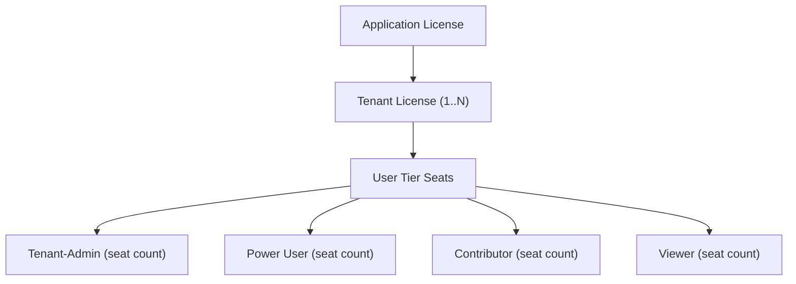
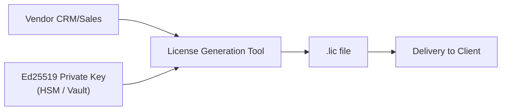
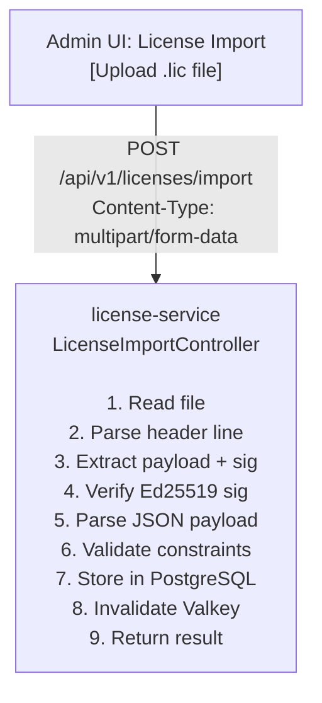
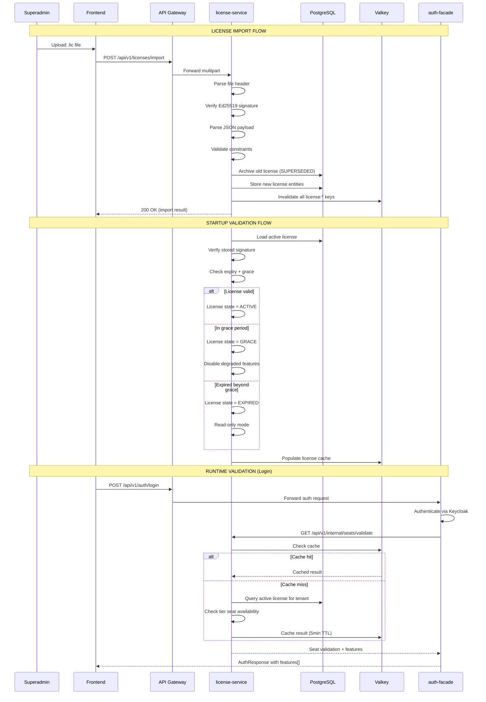
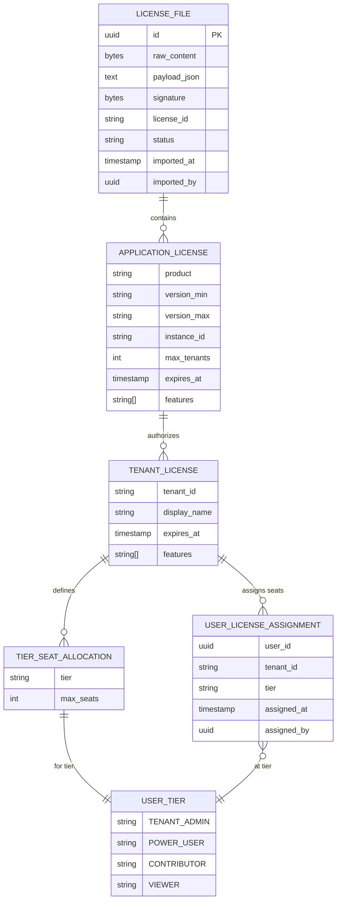
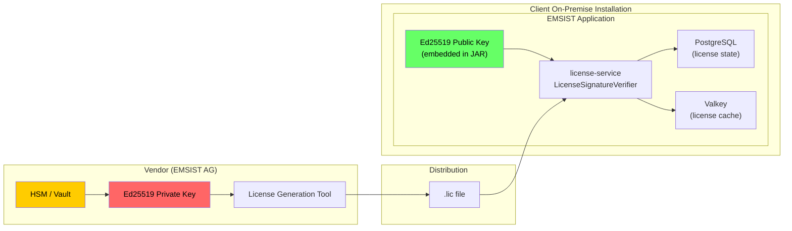
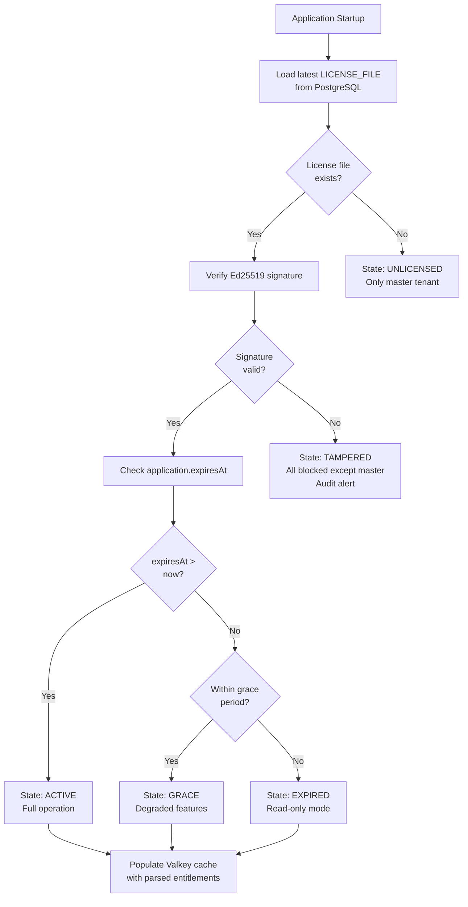
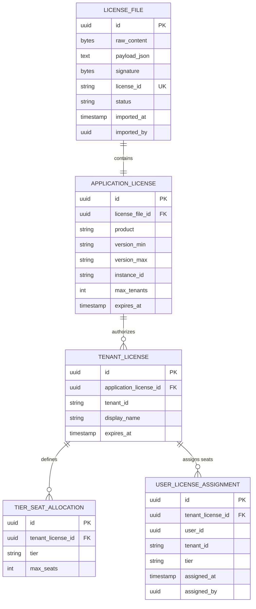

# ADR-015: On-Premise Cryptographic License Architecture

**Status:** Draft
**Date:** 2026-02-26
**Decision Makers:** Architecture Review Board
**Author:** ARCH Agent

## Context

EMSIST has been reclassified from a cloud SaaS platform to an **on-premise enterprise application** deployed at client sites. This fundamentally changes the licensing model:

- **No external license validation server** -- the application cannot phone home to a vendor-operated license server.
- **Air-gapped or limited-connectivity environments** -- many client deployments will have restricted or no internet access.
- **Local cryptographic validation** -- licenses must be self-contained, tamper-proof, and verifiable offline using embedded public keys.
- **Master tenant superadmin** is specifically for initial application setup at client premises, not a vendor-managed tenant.

The current `license-service` (at `/backend/license-service/`) is built on a SaaS model with:

- Existing PostgreSQL entities: `LicenseProductEntity`, `TenantLicenseEntity`, `UserLicenseAssignmentEntity`, `LicenseFeatureEntity`
- Three seeded SaaS products: Starter ($9.99/mo), Pro ($29.99/mo), Enterprise ($99.99/mo) with monthly/annual pricing
- Feature gating via `FeatureGateServiceImpl` with Valkey cache (5-minute TTL)
- Seat validation via `SeatValidationServiceImpl`
- SaaS-centric fields: `monthly_price`, `annual_price`, `billing_cycle`, `auto_renew`

This model is inappropriate for on-premise deployment where:

1. There is no recurring billing infrastructure running at the client site.
2. License entitlements must be delivered as signed files, not database records managed by a vendor.
3. The client's admin imports a license file; the software validates it locally.
4. Renewal means receiving a new signed license file, not an automated subscription renewal.

### User-Defined License Hierarchy

The user requires a three-tier license hierarchy:



This replaces the SaaS model of Starter/Pro/Enterprise products.

## Decision Drivers

* On-premise deployment: no internet dependency for license validation
* Cryptographic integrity: licenses must be tamper-proof and vendor-signed
* Offline operation: full functionality without connectivity to vendor infrastructure
* Hierarchical entitlements: application-level, tenant-level, and user-tier-level licensing
* Graceful degradation: clear behavior on license expiry with reasonable grace periods
* Auditability: every license import, validation, and expiry event must be logged
* Simplicity for the client admin: license import via file upload, not complex configuration
* Compatibility: the existing `license-service` infrastructure (PostgreSQL, Valkey, Feign) can be extended rather than replaced

## Considered Alternatives

### Option A: External License Server (Rejected)

**Description:** Deploy a separate license validation server alongside the application. The application calls this server for every license check.

**Pros:**
- Centralized license management
- Real-time revocation
- Dynamic license updates

**Cons:**
- Adds infrastructure dependency at client sites
- Single point of failure for the entire platform
- Does not work in air-gapped environments
- Increases operational complexity for the client
- Contradicts the on-premise, self-contained requirement

**Rejection reason:** Violates the core constraint of no external dependencies and air-gapped operation.

### Option B: Database-Only License Records with Activation Codes (Rejected)

**Description:** Client receives an activation code string. On first boot, the admin enters the code. The application stores the license entitlements as database records (similar to the current SaaS model but without billing fields).

**Pros:**
- Simple implementation -- minimal changes to current model
- Familiar pattern (Windows activation key)

**Cons:**
- Activation codes are easily shared, copied, or brute-forced
- No cryptographic integrity -- database records can be tampered with by anyone with DB access
- No way to encode complex hierarchical entitlements in a short code
- Revocation is impossible without phone-home
- No audit trail of what was originally licensed vs. what was modified

**Rejection reason:** Insufficient tamper-resistance and cannot encode the required license hierarchy.

### Option C: Signed License File with Local Validation (RECOMMENDED)

**Description:** The vendor generates a signed license file (JSON payload + cryptographic signature) encoding the full license hierarchy. The client admin imports this file into the application via a UI or CLI. The application validates the signature using an embedded public key and extracts the entitlements into the runtime license state.

**Pros:**
- Fully offline -- no internet dependency
- Cryptographically tamper-proof -- Ed25519 signature verification
- Self-describing -- the file contains all entitlements, expiry dates, and metadata
- Auditable -- the original signed file is stored alongside the parsed state
- Hierarchical -- naturally encodes application, tenant, and user-tier entitlements
- Revocable via expiry -- licenses have fixed expiry dates; renewal requires a new file
- Simple admin UX -- single file upload
- The existing `license-service` + Valkey infrastructure is reused, with license state persisted in PostgreSQL per ADR-016 (Polyglot Persistence)

**Cons:**
- Requires key management (public key distribution, private key security at vendor)
- License changes require generating and delivering a new file
- No real-time revocation (only expiry-based)
- Slightly more complex implementation than activation codes

## Decision

**We adopt Option C: Signed License File with Local Validation.**

### Database Authority Alignment

This ADR follows ADR-001 (Polyglot Persistence, amended 2026-02-27):

- **license-service** persists all licensing data (license files, application licenses, tenant licenses, seat allocations, user assignments) in **PostgreSQL** -- relational tables are the correct and permanent fit for transactional licensing records.
- **auth-facade** persists RBAC data (roles, providers) in **Neo4j** -- graph relationships are the natural fit for role inheritance.
- This is a deliberate polyglot persistence strategy, not technical debt.

### Deployment Model: On-Premise Specifics

This ADR is specifically for on-premise deployments. The differences from SaaS (ADR-014) are:

| Aspect | SaaS (ADR-014) | On-Premise (this ADR) |
|--------|---------------|----------------------|
| License source | Vendor-managed database records | Signed `.lic` file imported by client admin |
| Connectivity | Internet required for license validation server | Air-gapped -- no internet needed |
| Billing | Monthly/annual SaaS billing | Perpetual or term license with offline renewal |
| Key management | Vendor-hosted, transparent to client | Ed25519 public key embedded in JAR; private key in vendor HSM |
| Master tenant | Vendor-operated platform admin | Client-operated initial setup admin |
| Revocation | Real-time via database | Requires new license file delivery |

The **enforcement plane** (RBAC + feature gates + seat validation) is identical in both models. Only the data ingestion path differs.

### Tenant Activation Gate

Lifecycle rule for tenant provisioning and status transitions:

- **Non-master tenants MUST NOT be `ACTIVE` without a valid tenant license entitlement** in the currently active license file.
- Tenant activation is gated by both operational readiness (realm/data/domain/TLS) and license validity.
- If a tenant license is missing, expired, or invalid, the tenant remains non-active and authentication is denied for that tenant.
- Master tenant remains a bootstrap/administration exception and is not driven by tenant seat licensing.

---

## 1. License File Format

### 1.1 File Structure

The license file uses a two-part format: a Base64url-encoded JSON payload and an Ed25519 signature, separated by a delimiter. The file extension is `.lic`.
The first line includes a fixed format marker and key ID for deterministic key selection.

```
EMSIST-LICENSE-V1;KID=emsist-2026-k1
<base64url-encoded-payload>
---
<base64url-encoded-signature>
```

This is intentionally NOT a JWT. Rationale:

- JWTs are designed for short-lived bearer tokens, not long-lived license files.
- License files may be hundreds of kilobytes (many tenants with many features). JWT libraries impose size limits.
- The two-part format is simpler to parse, debug, and inspect than a compact JWT.
- No need for JWT header negotiation. The algorithm is fixed (Ed25519) and key selection is explicit via `KID` in the fixed first line.

### 1.2 Signature Algorithm: Ed25519

| Property | Value |
|----------|-------|
| Algorithm | Ed25519 (RFC 8032) |
| Key size | 256-bit (32 bytes) |
| Signature size | 512-bit (64 bytes) |
| Java library | `java.security.Signature` with `Ed25519` (Java 15+) or Bouncy Castle |

**Why Ed25519 over RSA or ECDSA:**

| Criterion | Ed25519 | RSA-2048 | ECDSA P-256 |
|-----------|---------|----------|-------------|
| Key size | 32 bytes | 256 bytes | 32 bytes |
| Signature size | 64 bytes | 256 bytes | 64 bytes |
| Verification speed | Fastest | Slowest | Medium |
| Side-channel resistance | Deterministic (no nonce) | Padding attacks | Nonce reuse vulnerability |
| Java support | Java 15+ (native) | All versions | Java 7+ |
| Simplicity | Single curve, no parameters | Multiple padding schemes | Multiple curves |

Ed25519 is deterministic (no random nonce needed), making it immune to the class of attacks where weak random number generation compromises the private key. It is also the smallest and fastest option.

### 1.3 License Payload Schema

The JSON payload encodes the complete license hierarchy:

```json
{
  "formatVersion": "1.0",
  "licenseId": "LIC-2026-0001",
  "issuer": "EMSIST AG",
  "issuedAt": "2026-03-01T00:00:00Z",
  "customer": {
    "id": "CUST-001",
    "name": "Acme Corporation",
    "country": "DE"
  },
  "application": {
    "product": "EMSIST",
    "version": {
      "min": "1.0.0",
      "max": "2.99.99"
    },
    "instanceId": "INST-acme-prod-001",
    "maxTenants": 5,
    "expiresAt": "2027-03-01T00:00:00Z",
    "features": [
      "basic_workflows",
      "basic_reports",
      "email_notifications",
      "advanced_workflows",
      "advanced_reports",
      "api_access",
      "webhooks",
      "ai_persona",
      "custom_branding",
      "sso_integration",
      "audit_logs"
    ]
  },
  "tenants": [
    {
      "tenantId": "acme-main",
      "displayName": "Acme Main Operations",
      "expiresAt": "2027-03-01T00:00:00Z",
      "features": ["basic_workflows", "advanced_workflows", "api_access", "audit_logs"],
      "seats": {
        "tenant-admin": 2,
        "power-user": 10,
        "contributor": 50,
        "viewer": -1
      }
    },
    {
      "tenantId": "acme-research",
      "displayName": "Acme R&D Division",
      "expiresAt": "2027-03-01T00:00:00Z",
      "features": ["basic_workflows", "basic_reports", "ai_persona"],
      "seats": {
        "tenant-admin": 1,
        "power-user": 5,
        "contributor": 20,
        "viewer": -1
      }
    }
  ],
  "grace": {
    "periodDays": 30,
    "degradedFeatures": ["ai_persona", "advanced_workflows", "advanced_reports", "webhooks", "api_access"]
  },
  "metadata": {
    "generatedBy": "EMSIST License Manager v1.0",
    "checksum": "sha256:a1b2c3d4..."
  }
}
```

### 1.4 Field Definitions

| Field | Type | Required | Description |
|-------|------|----------|-------------|
| `formatVersion` | string | Yes | License format version for forward compatibility |
| `licenseId` | string | Yes | Globally unique license identifier, used for revocation checking |
| `issuer` | string | Yes | Issuing entity (vendor legal name) |
| `issuedAt` | ISO 8601 | Yes | When the license was generated |
| `customer.id` | string | Yes | Customer identifier in vendor CRM |
| `customer.name` | string | Yes | Customer legal name |
| `customer.country` | string | No | ISO 3166-1 alpha-2 country code |
| `application.product` | string | Yes | Product identifier (must match application's own product ID) |
| `application.version.min` | semver | Yes | Minimum application version this license is valid for |
| `application.version.max` | semver | Yes | Maximum application version this license is valid for |
| `application.instanceId` | string | No | Locks license to a specific installation (optional hardware binding) |
| `application.maxTenants` | integer | Yes | Maximum number of tenants permitted |
| `application.expiresAt` | ISO 8601 | Yes | Application-level license expiry |
| `application.features` | string[] | Yes | Master feature set available to this installation |
| `tenants[].tenantId` | string | Yes | Tenant identifier (must match tenant-service registration) |
| `tenants[].displayName` | string | Yes | Human-readable tenant name |
| `tenants[].expiresAt` | ISO 8601 | Yes | Tenant-specific expiry (cannot exceed application expiry) |
| `tenants[].features` | string[] | Yes | Features enabled for this tenant (subset of application features) |
| `tenants[].seats.tenant-admin` | integer | Yes | Max Tenant-Admin tier seats (-1 = unlimited) |
| `tenants[].seats.power-user` | integer | Yes | Max Power User tier seats (-1 = unlimited) |
| `tenants[].seats.contributor` | integer | Yes | Max Contributor tier seats (-1 = unlimited) |
| `tenants[].seats.viewer` | integer | Yes | Max Viewer tier seats (-1 = unlimited) |
| `grace.periodDays` | integer | Yes | Grace period after expiry (in days) |
| `grace.degradedFeatures` | string[] | Yes | Features disabled during grace period |
| `metadata.checksum` | string | No | SHA-256 of the payload for integrity verification (belt-and-suspenders with Ed25519) |

### 1.5 User Tier Mapping to Roles

The four user tiers map to the existing RBAC role hierarchy:

| License Tier | RBAC Role(s) | Capabilities |
|-------------|--------------|--------------|
| **Tenant-Admin** | `ADMIN` | Full tenant administration: user management, IdP configuration, branding, license seat assignment |
| **Power User** | `MANAGER` | Advanced features: workflow design, API access, integrations, report building |
| **Contributor** | `USER` | Standard productivity: use workflows, fill forms, collaborate, view reports |
| **Viewer** | `VIEWER` | Read-only: view dashboards, reports, audit logs (no create/edit/delete) |

Note: `SUPER_ADMIN` is reserved for the master tenant and is **not** a licensed tier. The master tenant operates outside the license model entirely.

---

## 2. License Lifecycle

### 2.1 Generation (Vendor Side)

The vendor operates a **License Generation Tool** (CLI or internal web application, NOT part of the EMSIST platform). This tool:

1. Accepts customer, entitlement, and expiry information as input.
2. Constructs the JSON payload per the schema above.
3. Signs the payload with the vendor's **Ed25519 private key** (stored in an HSM or secure vault).
4. Produces a `.lic` file.



The License Generation Tool is an internal vendor tool and is explicitly **out of scope** for the EMSIST platform codebase. However, this ADR specifies its output format to ensure interoperability.

### 2.2 Delivery

License files are delivered via:

| Method | When |
|--------|------|
| Secure download link | Post-purchase, emailed to customer IT contact |
| USB / physical media | Air-gapped environments |
| Support ticket attachment | Renewals and amendments |

The license file is not secret (it contains no credentials), but it is tamper-evident (the signature protects integrity). It can be safely transmitted over insecure channels.

### 2.3 Import (Client Side)

The client's master tenant superadmin imports the license file:



**Import validation checks (in order):**

| # | Check | Failure Response |
|---|-------|-----------------|
| 1 | File starts with `EMSIST-LICENSE-V1` | 400: Invalid license file format |
| 2 | Payload and signature can be extracted | 400: Malformed license file |
| 3 | Ed25519 signature is valid | 403: License signature verification failed (tampered or invalid) |
| 4 | `formatVersion` is supported | 400: Unsupported license format version |
| 5 | `application.product` matches this installation | 400: License is for a different product |
| 6 | `application.version` range includes the running version | 400: License not valid for this application version |
| 7 | `application.instanceId` matches (if present) | 400: License is bound to a different instance |
| 8 | `application.expiresAt` is in the future | 400: License has already expired |
| 9 | All `tenants[].tenantId` values are registered in tenant-service | 400: Unknown tenant ID: {id} |
| 10 | No `tenants[].expiresAt` exceeds `application.expiresAt` | 400: Tenant expiry exceeds application expiry |
| 11 | `tenants[]` count does not exceed `application.maxTenants` | 400: License exceeds max tenant count |
| 12 | Non-master tenant status transitions obey license gate (`ACTIVE` requires valid tenant license) | 409: Tenant activation blocked by missing/invalid license |

On successful import:
- The previous license record (if any) is archived with status `SUPERSEDED`.
- The new license payload is stored in full (both raw file and parsed entities).
- All Valkey license cache entries are invalidated.
- An audit event is emitted: `LICENSE_IMPORTED`.
- Non-master tenant activation status is recalculated; only licensed tenants may be `ACTIVE`.

### 2.4 Renewal

Renewal is handled identically to initial import:

1. Vendor generates a new `.lic` file with updated expiry dates and/or entitlements.
2. Client admin imports the new file via the same UI.
3. The new license supersedes the old one.
4. No internet connectivity is required.

### 2.5 Revocation (Without Internet)

True real-time revocation is not possible without a phone-home mechanism. Instead, revocation is achieved through:

| Mechanism | Description |
|-----------|-------------|
| **Expiry-based** | All licenses have explicit expiry dates. The shortest practical license period is the revocation window. |
| **Replacement** | To revoke specific entitlements, issue a new license file with reduced entitlements. The client must import it. |
| **Revocation list** | Optional: a signed revocation list file (`.revoke`) can be imported. Contains `licenseId` values that are no longer valid. |

For most on-premise scenarios, expiry-based revocation with annual renewal cycles is sufficient. The 30-day grace period provides time for renewal logistics without abrupt service disruption.

---

## 3. License Validation Flow

### 3.1 Architecture Diagram



### 3.2 Startup Validation

When the `license-service` starts (or the application boots), it performs:

```
1. Load latest non-SUPERSEDED license record from PostgreSQL
2. If no license exists:
   a. Set license state = UNLICENSED
   b. Only master tenant can operate
   c. All regular tenants are blocked
   d. Log WARNING: "No license file imported"
3. If license exists:
   a. Re-verify Ed25519 signature against stored raw file
   b. Compare application.expiresAt against current date
   c. Set license state:
      - ACTIVE: expiresAt is in the future
      - GRACE: expiresAt is past but within grace.periodDays
      - EXPIRED: expiresAt + grace.periodDays is past
   d. Populate Valkey with parsed entitlements
4. Expose license state via /actuator/health (custom health indicator)
```

### 3.3 Runtime Validation

Runtime license checks occur at two levels:

**Level 1: Login-time seat validation (existing pattern, extended)**

The current auth-facade already calls `SeatValidationServiceImpl` during login. This is extended to:

1. Check that the tenant exists in the active license.
2. Check that the user's role/tier has available seats.
3. Return the tenant's feature list alongside the seat validation response.
4. Master tenant continues to bypass all license checks.

**Level 2: Feature gate checks (existing pattern, unchanged)**

The existing `FeatureGateServiceImpl` with Valkey cache continues to work as-is. The only change is the data source: instead of features being seeded from a SaaS product catalog, they are parsed from the imported license file.

### 3.4 License States and Behavior

| State | Condition | Behavior |
|-------|-----------|----------|
| **UNLICENSED** | No license file imported | Only master tenant operational. Regular tenants blocked. Admin UI shows "Import License" prompt. |
| **ACTIVE** | Current date < `expiresAt` | Full operation. All licensed features available. Only tenants with valid tenant license entitlements are operational. |
| **GRACE** | `expiresAt` < current date < `expiresAt` + `grace.periodDays` | Reduced operation. Core features remain. `grace.degradedFeatures` are disabled. Banner: "License expired, renew within N days." |
| **EXPIRED** | Current date > `expiresAt` + `grace.periodDays` | Read-only mode. Users can log in and view data. No create/edit/delete operations. No new user registration. Banner: "License expired. Contact vendor." |
| **TAMPERED** | Signature verification fails on stored file | Emergency state. All tenants blocked except master. Audit alert generated. This should never occur unless the database was manually edited. |

### 3.5 Grace Period Design

| Parameter | Value | Rationale |
|-----------|-------|-----------|
| Default grace period | 30 days | Sufficient for enterprise procurement cycles |
| Configurable | Yes, per license file (`grace.periodDays`) | Different customers may negotiate different terms |
| Degraded features | Defined in license file | Vendor controls what degrades; core features always remain |
| User notification | Banner in frontend, daily log warnings | Multiple channels to ensure awareness |
| Admin notification | Email (if notification-service operational) + UI banner | Ensure IT admin is aware |

### 3.6 Master Tenant Exemption

The master tenant is **always exempt** from license validation. This is critical because:

1. The master tenant is used for initial setup BEFORE a license is imported.
2. The superadmin must be able to access the license import UI.
3. The master tenant represents the vendor's operational footprint, not a customer tenant.

This is consistent with the existing `RealmResolver.isMasterTenant()` bypass in `AuthServiceImpl`.

---

## 4. Impact on Existing Code

### 4.1 Changes to `license-service`

| Component | Change Type | Description |
|-----------|-------------|-------------|
| **New: `LicenseFileEntity`** | Add entity | Stores the raw `.lic` file bytes, parsed payload JSON, signature, import timestamp, and status (ACTIVE/SUPERSEDED) |
| **New: `LicenseImportController`** | Add controller | `POST /api/v1/licenses/import` (multipart file upload) |
| **New: `LicenseImportService`** | Add service | Parses, validates signature, validates constraints, stores |
| **New: `LicenseSignatureVerifier`** | Add utility | Ed25519 signature verification using Java 15+ `Signature` API |
| **New: `LicenseStateHolder`** | Add component | Application-scoped bean holding current license state (ACTIVE/GRACE/EXPIRED/UNLICENSED) |
| **New: `LicenseHealthIndicator`** | Add health | Exposes license state via `/actuator/health` |
| **New: `LicenseScheduledValidator`** | Add scheduler | Daily re-validation of license expiry (transitions ACTIVE -> GRACE -> EXPIRED) |
| **Modify: license domain model** | Refactor | Persist license state as PostgreSQL tables (`license_file`, `application_license`, `tenant_license`, `tier_seat_allocation`, `user_license_assignment`) with standard JPA entities and Flyway migrations. |
| **Modify: `LicenseProductEntity`** | Schema update | SaaS pricing fields (`monthly_price`, `annual_price`, `billing_cycle`) are removed; entity is restructured for on-premise license-file-defined entitlements. PostgreSQL remains the persistence layer. |
| **Modify: user-tier assignment model** | Minor change | Add `tier` semantics (TENANT_ADMIN, POWER_USER, CONTRIBUTOR, VIEWER) to the PostgreSQL entity model and API DTOs. |
| **Modify: `SeatValidationServiceImpl`** | Extend | Validate against tier-specific seat limits from the license file, not just total seats. |
| **Modify: `FeatureGateServiceImpl`** | Minor change | Feature source changes from seeded `license_features` table to parsed license payload features. No logic change. |
| **Modify: Flyway migration scripts** | New migration | Add/upgrade PostgreSQL tables and constraints for on-prem cryptographic licensing model. |
| **New: embedded public key** | Add resource | `src/main/resources/license/emsist-license-public.pem` -- the vendor's Ed25519 public key shipped with the application. |

### 4.2 Changes to `auth-facade`

| Component | Change Type | Description |
|-----------|-------------|-------------|
| **Modify: `AuthServiceImpl`** | Extend | After seat validation, also fetch the tenant's feature list from `license-service` and include in `AuthResponse`. |
| **Modify: `LicenseServiceClient`** | Extend Feign | Add `getUserFeatures(tenantId, userId)` method (already planned in ADR-014). |
| **No change** to security chains, role converter, or Neo4j graph | -- | The RBAC model is orthogonal to the license model. |

### 4.3 Changes to Frontend

| Component | Change Type | Description |
|-----------|-------------|-------------|
| **New: License Import page** | Add page | Admin page for uploading `.lic` files. Accessible only to master tenant SUPER_ADMIN. |
| **New: License Status dashboard** | Add component | Shows current license state, expiry date, tenant entitlements, seat usage. |
| **New: License Expiry banner** | Add component | Persistent banner when license is in GRACE or EXPIRED state. |
| **Existing: FeatureService** | Extend (from ADR-014) | Features are populated from the auth response, which now sources from the license file. |

### 4.4 New Service or Extend Existing?

**Decision: Extend `license-service`.** No new service is needed.

Rationale:
- The license-service already owns the license domain (products, features, seats, tenant licenses).
- Adding license file import/validation is a natural extension of its responsibilities.
- Creating a separate "license-file-service" would fragment the license domain and require cross-service coordination.
- The existing PostgreSQL persistence, Valkey cache, and Feign client infrastructure are reusable.

---

## 5. Architecture Diagrams

### 5.1 License Hierarchy Model



### 5.2 Key Management Architecture



**Key management rules:**

| Key | Location | Access | Rotation |
|-----|----------|--------|----------|
| Ed25519 **private** key | Vendor HSM / hardware security module | License Generation Tool only. Never leaves HSM. Never in source control. | Every 2 years. Old key retained for verification of existing licenses. |
| Ed25519 **public** key | Embedded in application JAR as `license/emsist-license-public.pem` | Read-only at runtime. | Distributed with application updates. Multiple public keys supported (key ID in license header for rotation). |

**Key rotation strategy:**

When the vendor rotates the signing key:

1. A new key pair is generated in the HSM.
2. New licenses are signed with the new private key. The `KID` field in the fixed header line identifies the signing key (e.g., `EMSIST-LICENSE-V1;KID=emsist-2026-k2`).
3. The application ships with both the old and new public keys, stored as named PEM files (e.g., `emsist-2026-k1.pem`, `emsist-2026-k2.pem`).
4. The `LicenseSignatureVerifier` reads the `KID` from the license file header and selects the corresponding public key file.
5. Existing licenses signed with the old key remain valid until their expiry.

**Key selection is always deterministic:** the `KID` in the fixed first line of the `.lic` file maps directly to a public key filename. There is no ambiguity, no fallback, and no trial-and-error key matching.

### 5.3 License Validation Flow (Runtime)



---

## 6. Comparison with ADR-014

### 6.1 What from ADR-014 Still Applies

| ADR-014 Decision | Status | Comment |
|------------------|--------|---------|
| Hybrid model: License gates features, Roles gate operations | **Still applies** | Core authorization architecture unchanged. |
| Master tenant gets implicit unlimited features | **Still applies** | Master tenant is exempt from license validation. |
| Features in auth response, not JWT | **Still applies** | Feature delivery mechanism unchanged. |
| `FeatureGateServiceImpl` with Valkey cache | **Still applies** | Feature checking logic unchanged. Data source changes. |
| `@FeatureGate` annotation (planned) | **Still applies** | Backend feature enforcement mechanism unchanged. |
| Frontend `featureGuard` and `featureDirective` (planned) | **Still applies** | Frontend enforcement unchanged. |
| 5-chain `DynamicBrokerSecurityConfig` | **Still applies** | RBAC enforcement unchanged. |
| Neo4j role graph with inheritance | **Still applies** | RBAC data model unchanged. |
| Seat validation at login | **Still applies** | Extended to tier-based seats. |

### 6.2 What Needs to Be Revised in ADR-014

| ADR-014 Assumption | Revision |
|--------------------|----------|
| "Multi-tenant **SaaS** platform" (line 10) | Now "on-premise enterprise application" |
| Three products: Starter/Pro/Enterprise with pricing | Replaced by license-file-defined entitlements. No pricing in the application. |
| SaaS product/price fields (`monthly_price`, `annual_price`) | Removed from PostgreSQL schema. On-premise model uses license-file-defined entitlements. |
| SaaS billing fields (`billing_cycle`, `auto_renew`) | Removed from PostgreSQL schema. License validity comes from signed file state. |
| SQL seed features (`V1__licenses.sql`) | Replaced by license-file-imported features. New Flyway migrations update the PostgreSQL schema. |
| "Feature state can be stale for up to 5 minutes" | Still true for individual feature checks. But license state transitions (ACTIVE -> GRACE -> EXPIRED) are checked daily by scheduler and on startup. |
| "License-service down during login" (risk) | Still valid. Circuit breaker behavior unchanged. |
| API Gateway route for `/api/v1/features/**` | Still needed. No change. |

### 6.3 ADR-014 Status After This ADR

ADR-014 should be updated to status `Amended` with a note:

> "ADR-014 defines the RBAC + licensing integration architecture. ADR-015 redefines the licensing data model and validation mechanism for on-premise deployment. The authorization architecture (hybrid RBAC + features) from ADR-014 remains in effect. The SaaS licensing model (products, pricing, billing) from ADR-014 is superseded by ADR-015."

---

## 7. Data Model Changes (High-Level, Arc42-Aligned)

Per ADR-016 (Polyglot Persistence), license-service persists all licensing data in PostgreSQL.
The on-prem licensing migration adds new PostgreSQL tables and modifies existing ones via Flyway.

### 7.1 New/Updated Relational Model



The existing entities (`LicenseProductEntity`, `TenantLicenseEntity`, `UserLicenseAssignmentEntity`, `LicenseFeatureEntity`) remain in PostgreSQL and are restructured for the on-premise model. New entities (`LicenseFileEntity`, `ApplicationLicenseEntity`) are added as PostgreSQL tables.

### 7.2 Database Constraint Targets

- Unique `license_id` on `license_file` table.
- One active `license_file` per installation scope (enforced by application logic with `status = 'ACTIVE'`).
- Tenant license expiry cannot exceed application license expiry.
- User tier assignment must map to allowed tiers (`TENANT_ADMIN`, `POWER_USER`, `CONTRIBUTOR`, `VIEWER`).

Detailed physical migration scripts are owned by DBA/SA and must be delivered as Flyway migrations under `/backend/license-service/src/main/resources/db/migration/`.

---

## 8. Security Considerations

| Concern | Mitigation |
|---------|------------|
| Private key compromise | Private key never leaves vendor HSM. Key rotation every 2 years. If compromised: rotate key, issue new licenses to all customers, ship application update with new public key. |
| License file tampering | Ed25519 signature verification. Any modification to the payload invalidates the signature. |
| Database tampering (editing license records directly) | Startup re-verification of stored raw file signature. TAMPERED state blocks all operation. |
| Replay attack (re-importing old license) | `licenseId` uniqueness constraint. Superseded licenses cannot be re-activated. Each import archives the previous license. |
| Clock manipulation (setting system clock back to avoid expiry) | NTP is recommended but not enforced. Monotonic check: if system time goes backward significantly, log WARNING. For high-security environments, optional hardware clock binding via `instanceId`. |
| Public key extraction from JAR | The public key is NOT secret. Its purpose is verification, not encryption. Extracting it does not help an attacker forge licenses (they need the private key). |

---

## 9. Non-Functional Requirements

| NFR | Target | Rationale |
|-----|--------|-----------|
| License import time | < 2 seconds for a 100-tenant license file | File parsing and signature verification are CPU-bound; Ed25519 is fast |
| Seat validation latency | < 5ms (cache hit), < 50ms (cache miss) | Existing SLA, unchanged |
| Feature check latency | < 5ms (cache hit), < 50ms (cache miss) | Existing SLA, unchanged |
| License file size | < 1 MB for up to 1000 tenants | JSON payload is compact; 1000 tenants at ~500 bytes each = ~500KB |
| Startup validation | < 1 second | Single DB read + single signature verification |
| Grace period accuracy | +/- 1 day | Daily scheduler checks; acceptable for enterprise license management |

---

## Consequences

### Positive

* Fully offline licensing -- no internet dependency at client sites
* Cryptographically tamper-proof -- Ed25519 prevents license modification
* Hierarchical entitlements -- clean mapping from application to tenants to user tiers
* Backward compatible -- existing `FeatureGateServiceImpl`, `SeatValidationServiceImpl`, and Valkey cache patterns are reused
* Clear degradation path -- ACTIVE -> GRACE -> EXPIRED with well-defined behavior at each state
* Auditable -- every license import, validation failure, and state transition is logged
* No JWT changes -- license features continue to travel in the auth response (per ADR-014)
* Master tenant exemption is preserved -- the superadmin can always operate

### Negative

* No real-time revocation -- revocation requires a new license file to be delivered and imported
* Clock manipulation vulnerability -- system clock rollback can extend license validity (mitigated by NTP recommendation and monotonic checks)
* Key rotation requires application update -- new public keys are shipped in the JAR
* License file delivery is manual -- requires operational process at the vendor
* SaaS-to-on-premise migration -- existing seed data and pricing fields must be migrated away

### Risks

| Risk | Probability | Impact | Mitigation |
|------|-------------|--------|------------|
| Client fails to renew before grace period ends | Medium | High | 30-day grace period, daily admin notifications, email alerts |
| Private key compromise at vendor | Low | Critical | HSM storage, key rotation procedure, incident response plan |
| System clock manipulation by client | Low | Medium | NTP recommendation, monotonic time checks, audit logging |
| License file lost by client | Medium | Low | Vendor can regenerate from CRM records; license file is not unique |
| Application version mismatch after upgrade | Medium | Medium | Clear error message; vendor issues new license with updated version range |
| Data corruption in license database state | Low | High | Re-import from original `.lic` file; reconstruct active license tables; file can be re-delivered by vendor |

---

## Implementation Evidence

This ADR has status "Draft" -- no implementation exists yet. The building blocks it depends on are documented in ADR-014.

### Existing Components (will be modified)

| Component | File | Current State |
|-----------|------|--------------|
| `LicenseProductEntity` | `/backend/license-service/src/main/java/com/ems/license/entity/LicenseProductEntity.java` | SaaS model with pricing fields |
| `TenantLicenseEntity` | `/backend/license-service/src/main/java/com/ems/license/entity/TenantLicenseEntity.java` | SaaS model with billing fields |
| `UserLicenseAssignmentEntity` | `/backend/license-service/src/main/java/com/ems/license/entity/UserLicenseAssignmentEntity.java` | No tier field |
| `FeatureGateServiceImpl` | `/backend/license-service/src/main/java/com/ems/license/service/FeatureGateServiceImpl.java` | Feature source: seeded DB records |
| `SeatValidationServiceImpl` | `/backend/license-service/src/main/java/com/ems/license/service/SeatValidationServiceImpl.java` | Single total_seats check |
| Licensing Flyway migrations | `/backend/license-service/src/main/resources/db/migration/` | Current PostgreSQL schema for licensing entities; will be extended with on-prem tables |

### New Components (PLANNED)

| Component | Planned Location |
|-----------|-----------------|
| `LicenseFileEntity` | `/backend/license-service/src/main/java/com/ems/license/entity/LicenseFileEntity.java` |
| `LicenseImportController` | `/backend/license-service/src/main/java/com/ems/license/controller/LicenseImportController.java` |
| `LicenseImportService` | `/backend/license-service/src/main/java/com/ems/license/service/LicenseImportService.java` |
| `LicenseSignatureVerifier` | `/backend/license-service/src/main/java/com/ems/license/crypto/LicenseSignatureVerifier.java` |
| `LicenseStateHolder` | `/backend/license-service/src/main/java/com/ems/license/state/LicenseStateHolder.java` |
| `LicenseHealthIndicator` | `/backend/license-service/src/main/java/com/ems/license/health/LicenseHealthIndicator.java` |
| `LicenseScheduledValidator` | `/backend/license-service/src/main/java/com/ems/license/scheduler/LicenseScheduledValidator.java` |
| Flyway migration for on-prem licensing | `/backend/license-service/src/main/resources/db/migration/` |
| Ed25519 public key | `/backend/license-service/src/main/resources/license/emsist-license-public.pem` |
| License Import page (frontend) | `/frontend/src/app/pages/administration/sections/license-manager/` |

---

## Related Decisions

- **ADR-014** (RBAC and Licensing Integration) -- Defines the hybrid RBAC+licensing authorization model. ADR-015 changes the licensing DATA MODEL but preserves the authorization ARCHITECTURE from ADR-014.
- **ADR-004** (Keycloak Authentication) -- JWT-based auth model is unchanged.
- **ADR-005** (Valkey Caching) -- Caching strategy for license checks is unchanged.
- **ADR-009** (Auth Facade Neo4j Architecture) -- RBAC graph model is unchanged.
- **ADR-016** (Polyglot Persistence) -- Formalizes PostgreSQL as the correct and permanent database for license-service, and Neo4j for auth-facade RBAC.

## Arc42 Sections to Update After Acceptance

| Section | Update Needed |
|---------|--------------|
| `03-context-scope.md` | Remove SaaS billing context; add on-premise deployment model |
| `04-solution-strategy.md` | Update licensing strategy from SaaS to on-premise cryptographic |
| `05-building-blocks.md` | Update `license-service` responsibilities (add license file import) |
| `06-runtime-view.md` | Add license import sequence diagram; update seat validation to show tier-based checks |
| `07-deployment-view.md` | Document embedded public key distribution |
| `08-crosscutting.md` Section 8.3 | Update licensing model description |
| `09-architecture-decisions.md` | Add ADR-015 to the index |
| `10-quality-requirements.md` | Add license validation latency NFRs |

## Human Escalation Required

This ADR requires the following human decisions before moving to "Accepted":

| Decision | Escalation To | Reason |
|----------|---------------|--------|
| Ed25519 key management procedures | CISO / Security Board | Cryptographic key lifecycle is a security-critical decision |
| Grace period duration (30 days) | CTO + Legal | Commercial and contractual implications |
| License file format finalization | CTO + Product | Format is a vendor-customer contract; changes are breaking |
| Vendor License Generation Tool scope | Product + Engineering | Must be built separately but interoperable |
| SaaS-to-on-premise migration path | CTO + Engineering | Existing seed data and pricing must be cleanly migrated |
