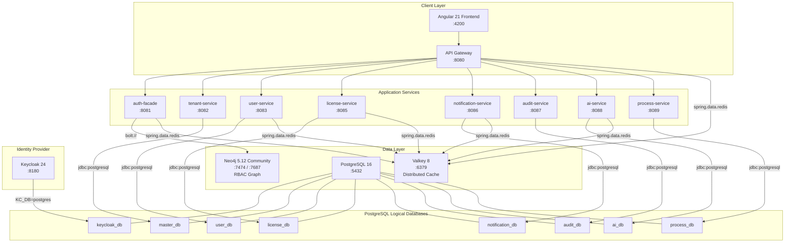

# ADR-016: Polyglot Persistence -- Neo4j for Identity Graph, PostgreSQL for Domain Services

**Status:** Accepted (Evidence Companion to ADR-001)
**Date:** 2026-02-27
**Decision Makers:** Architecture Review Board (Stakeholder-approved)
**Category:** Strategic ADR (Data Architecture)
**Parent ADR:** [ADR-001](./ADR-001-neo4j-primary.md) (Amended 2026-02-27 to adopt Polyglot Persistence)

## Context

ADR-001 mandated Neo4j as the single EMS application database, reserving PostgreSQL exclusively for Keycloak internal persistence. In practice, 7 of 8 services were built with PostgreSQL because their data is relational and transactional in nature. This is not implementation drift -- it is the correct engineering choice for those domains.

### Why the Original Decision Was Insufficient

ADR-001 was motivated by the desire for a "single, clear application data standard." While this goal is valid for governance simplicity, it overlooked the fundamentally different data-access requirements across the platform's bounded contexts:

1. **The RBAC domain is graph-shaped.** Role inheritance (`INHERITS_FROM`), group membership (`MEMBER_OF`), and provider configuration form a recursive, relationship-heavy graph. Queries like "resolve all effective roles for a user through unlimited inheritance depth" map naturally to Cypher `(u)-[:HAS_ROLE|MEMBER_OF*0..]->(r)` but require expensive recursive CTEs in PostgreSQL.

2. **The licensing domain is relational and transactional.** It requires CHECK constraints on status enums, `@Version` optimistic locking for concurrent seat allocation, composite UNIQUE keys (`tenant_id, user_id, product_id`), JSONB columns for flexible feature metadata, and B-tree date-range indexing for license expiry queries. Neo4j does not provide CHECK constraints, has no native optimistic locking annotation, and its index types are not optimized for range scans.

3. **The remaining domain services (tenants, users, notifications, audit, AI, processes) are similarly relational.** They use foreign-key chains, Flyway migrations, Hibernate dialect-specific features (`PostgreSQLDialect`), and standard JPA patterns (`@Entity`, `@Version`, `@Column(columnDefinition = "JSONB")`).

Forcing the licensing domain into Neo4j would sacrifice data integrity guarantees. Forcing the RBAC domain into PostgreSQL would sacrifice query simplicity and performance for recursive graph traversals.

### Decision Drivers

* Each database technology should be used for its strengths
* No application-level workarounds to compensate for database limitations
* Implementation reality: 7/8 services already use PostgreSQL
* The RBAC graph genuinely benefits from Neo4j's traversal engine
* Operational simplicity: two well-understood database technologies, not exotic alternatives
* Multi-tenancy: tenant isolation patterns differ by database (schema/row-level for PostgreSQL, graph labels for Neo4j)

## Decision

**EMSIST formally adopts polyglot persistence: Neo4j for the identity/RBAC graph, PostgreSQL for all relational domain services.**

### Database Assignment

| Database | Service(s) | Port | Justification |
|----------|-----------|------|---------------|
| **Neo4j** | auth-facade | :8081 | Graph-shaped RBAC: recursive role inheritance (`INHERITS_FROM`), group membership (`MEMBER_OF`), provider configuration nodes, tenant-scoped identity graph |
| **PostgreSQL** | tenant-service | :8082 | Relational tenant registry: FK chains, CHECK constraints, JSONB branding config, Flyway migrations |
| **PostgreSQL** | user-service | :8083 | Relational user profiles: FK to tenants, JPA `@Entity`, Flyway migrations |
| **PostgreSQL** | license-service | :8085 | Transactional licensing: CHECK constraints, `@Version` optimistic locking, composite UNIQUE keys, JSONB feature metadata, date-range B-tree indexes |
| **PostgreSQL** | notification-service | :8086 | Relational notification queue: FK chains, Thymeleaf templates, Flyway migrations |
| **PostgreSQL** | audit-service | :8087 | Append-only audit log: BIGSERIAL PK, JSONB details, INET columns, time-range indexes, Flyway migrations |
| **PostgreSQL** | ai-service | :8088 | AI/RAG storage: pgvector extension for embeddings, JSONB conversation context, Flyway migrations |
| **PostgreSQL** | process-service | :8089 | BPMN process definitions: relational element hierarchy, Flyway migrations |
| **PostgreSQL** (Keycloak) | Keycloak | :8180 | Identity provider internal persistence (required by Keycloak -- `KC_DB=postgres`) |
| **Valkey** | auth-facade, license-service, user-service, notification-service, ai-service, api-gateway | :6379 | Distributed caching: role cache, seat validation, token blacklist, rate limiting, session state |

### Why Neo4j for RBAC / Why PostgreSQL for Licensing

| Requirement | Neo4j (auth-facade) | PostgreSQL (license-service) |
|-------------|---------------------|------------------------------|
| Recursive role inheritance (`INHERITS_FROM*0..`) | Native variable-length traversal in Cypher | Requires recursive CTE, poor performance at depth |
| Group membership resolution (`MEMBER_OF*0..`) | Single Cypher query with unlimited depth | Multiple JOINs or recursive CTE |
| CHECK constraints on status enums | Not supported | Native `CHECK (status IN ('ACTIVE', 'EXPIRED', 'SUSPENDED'))` |
| `@Version` optimistic locking | No native JPA `@Version` support | Hibernate `@Version` with `FOR UPDATE` |
| Composite UNIQUE constraints | Only basic uniqueness constraints | Native `UNIQUE(tenant_id, user_id, product_id)` |
| JSONB columns for flexible metadata | Properties are schemaless but no JSONB operators | Full JSONB indexing, containment operators (`@>`, `?`) |
| B-tree date-range indexing | Limited range index support | Native `CREATE INDEX ON ... (starts_at, expires_at)` |
| Foreign-key referential integrity | Relationships enforce structure but no cascading FK | Native `REFERENCES ... ON DELETE CASCADE` |

### Database Topology



## Implementation Evidence [IMPLEMENTED]

This ADR formalizes the architecture that is already fully implemented. Every claim below has been verified against source files.

### auth-facade -- Neo4j [IMPLEMENTED]

- **Configuration:** `/backend/auth-facade/src/main/resources/application.yml:27-31`
  ```yaml
  spring:
    neo4j:
      uri: ${NEO4J_URI:bolt://localhost:7687}
      authentication:
        username: ${NEO4J_USER:neo4j}
        password: ${NEO4J_PASSWORD:}
  ```
- **Docker-compose:** `/infrastructure/docker/docker-compose.yml:199` -- `NEO4J_URI: bolt://neo4j:7687`
- **Graph entities:** `RoleNode.java` with `@Relationship(type = "INHERITS_FROM")`, `ConfigNode.java`, `GroupNode`

### tenant-service -- PostgreSQL [IMPLEMENTED]

- **Configuration:** `/backend/tenant-service/src/main/resources/application.yml:9`
  ```yaml
  url: ${DATABASE_URL:jdbc:postgresql://localhost:5432/master_db}
  ```
- **Docker-compose:** `/infrastructure/docker/docker-compose.yml:220` -- `DATABASE_URL: jdbc:postgresql://postgres:5432/master_db`
- **Migration:** Flyway with `PostgreSQLDialect` (line 19)

### user-service -- PostgreSQL [IMPLEMENTED]

- **Configuration:** `/backend/user-service/src/main/resources/application.yml:9`
  ```yaml
  url: ${DATABASE_URL:jdbc:postgresql://localhost:5432/master_db}
  ```
- **Docker-compose:** `/infrastructure/docker/docker-compose.yml:247` -- `DATABASE_URL: jdbc:postgresql://postgres:5432/user_db`
- **Migration:** Flyway with `flyway_schema_history_user` table (line 28)

### license-service -- PostgreSQL [IMPLEMENTED]

- **Configuration:** `/backend/license-service/src/main/resources/application.yml:9`
  ```yaml
  url: ${DATABASE_URL:jdbc:postgresql://localhost:5432/master_db}
  ```
- **Docker-compose:** `/infrastructure/docker/docker-compose.yml:272` -- `DATABASE_URL: jdbc:postgresql://postgres:5432/license_db`
- **Migration:** Flyway with `flyway_schema_history_license` table (line 28)
- **Valkey cache:** `spring.data.redis` at line 32

### notification-service -- PostgreSQL [IMPLEMENTED]

- **Configuration:** `/backend/notification-service/src/main/resources/application.yml:9`
  ```yaml
  url: ${DATABASE_URL:jdbc:postgresql://localhost:5432/master_db}
  ```
- **Docker-compose:** `/infrastructure/docker/docker-compose.yml:299` -- `DATABASE_URL: jdbc:postgresql://postgres:5432/notification_db`
- **Migration:** Flyway with `flyway_schema_history_notification` table (line 28)

### audit-service -- PostgreSQL [IMPLEMENTED]

- **Configuration:** `/backend/audit-service/src/main/resources/application.yml:9`
  ```yaml
  url: ${DATABASE_URL:jdbc:postgresql://localhost:5432/master_db}
  ```
- **Docker-compose:** `/infrastructure/docker/docker-compose.yml:324` -- `DATABASE_URL: jdbc:postgresql://postgres:5432/audit_db`
- **Migration:** Flyway with `flyway_schema_history_audit` table (line 28)

### ai-service -- PostgreSQL + pgvector [IMPLEMENTED]

- **Configuration:** `/backend/ai-service/src/main/resources/application.yml:9`
  ```yaml
  url: jdbc:postgresql://${DB_HOST:localhost}:${DB_PORT:5432}/${DB_NAME:ems}
  ```
- **Docker-compose:** `/infrastructure/docker/docker-compose.yml:347` -- `DATABASE_URL: jdbc:postgresql://postgres:5432/ai_db`
- **Migration:** Flyway with `ai_service_schema_history` table (line 28)
- **Valkey cache:** `spring.data.redis` at line 33

### process-service -- PostgreSQL [IMPLEMENTED]

- **Configuration:** `/backend/process-service/src/main/resources/application.yml:9`
  ```yaml
  url: ${DATABASE_URL:jdbc:postgresql://localhost:5432/master_db}
  ```
- **Docker-compose:** `/infrastructure/docker/docker-compose.yml:375` -- `DATABASE_URL: jdbc:postgresql://postgres:5432/process_db`
- **Migration:** Flyway with `flyway_schema_history_process` table (line 28)

### Database Isolation via init-db.sql [IMPLEMENTED]

- **File:** `/infrastructure/docker/init-db.sql`
- Each service gets its own logical database on a single PostgreSQL 16 server:
  ```
  keycloak_db, master_db, user_db, license_db, notification_db, audit_db, ai_db, process_db
  ```
- Keycloak gets a dedicated `keycloak` user with restricted grants (lines 7-19)

### Infrastructure Images [IMPLEMENTED]

- **PostgreSQL:** `postgres:16-alpine` (`/infrastructure/docker/docker-compose.yml:9`)
- **Neo4j:** `neo4j:5.12.0-community` (`/infrastructure/docker/docker-compose.yml:43`)
- **Valkey:** `valkey/valkey:8-alpine` (`/infrastructure/docker/docker-compose.yml:28`)
- **Keycloak:** `quay.io/keycloak/keycloak:24.0` (`/infrastructure/docker/docker-compose.yml:99`)

## Considered Alternatives

### 1. Neo4j for All Services (ADR-001 original mandate)

**Rejected.**

Reason: 7 of 8 services are already built with PostgreSQL. The licensing domain specifically requires CHECK constraints, `@Version` optimistic locking, composite UNIQUE keys, JSONB, and B-tree date-range indexing -- capabilities Neo4j does not provide natively. Forcing a migration would introduce risk with no functional benefit, and would require application-level workarounds for constraints that PostgreSQL handles at the database level.

### 2. PostgreSQL for All Services (eliminate Neo4j)

**Rejected.**

Reason: The RBAC domain genuinely benefits from Neo4j's graph traversal engine. Recursive role inheritance (`INHERITS_FROM*0..`) and group membership resolution (`MEMBER_OF*0..`) are first-class operations in Cypher but require recursive CTEs in PostgreSQL, which are harder to read, harder to optimize, and do not scale as elegantly at arbitrary depth. The auth-facade is already built and tested with Neo4j SDN.

### 3. Keep ADR-001 and Treat PostgreSQL as Technical Debt

**Rejected.**

Reason: This would create a false narrative of "implementation drift" when in fact PostgreSQL is the superior choice for 7 of 8 services. Treating correct engineering decisions as "debt" undermines architectural governance credibility and could motivate unnecessary and harmful migration work.

## Consequences

### Positive

* Each database is used for its strengths -- no constraint sacrifices, no application-level workarounds
* Documentation now matches reality -- no "drift" narrative, no false debt claims
* Clear governance boundary: Neo4j for graph domains, PostgreSQL for relational domains
* Existing Flyway migrations, JPA entities, and Neo4j SDN code remain unchanged
* Operational teams know exactly which database backs which service
* Valkey provides a uniform caching layer across both database technologies

### Negative

* Two database technologies to maintain -- operations team needs both Neo4j and PostgreSQL expertise
* Different migration tooling: Flyway (PostgreSQL) vs application-managed migrations (Neo4j/auth-facade)
* Developers working across services must understand both data-access patterns (JPA/Hibernate and Neo4j SDN)

### Risks

| Risk | Probability | Impact | Mitigation |
|------|-------------|--------|------------|
| Schema drift if migration standards diverge | Medium | Medium | Flyway governs PostgreSQL; Neo4j SDN governs auth-facade; standardized CI pipeline validates both |
| Neo4j Community edition lacks cluster features | Low | Medium | auth-facade is the only Neo4j consumer; single-instance is sufficient for current scale; upgrade path to Enterprise exists |
| New service incorrectly chooses database | Low | Low | This ADR provides clear criteria: if data is graph-shaped with recursive traversals, use Neo4j; otherwise, use PostgreSQL |

## Related Decisions

- **Companion to:** [ADR-001](./ADR-001-neo4j-primary.md) -- EMS Application Data Architecture (Polyglot Persistence) -- this ADR provides detailed implementation evidence
- **Related to:** [ADR-003](./ADR-003-database-per-tenant.md) -- Multi-Tenancy Strategy (tenant isolation patterns now differ by database type)
- **Related to:** [ADR-005](./ADR-005-valkey-caching.md) -- Valkey Distributed Caching (uniform cache layer across both databases)
- **Related to:** [ADR-009](./ADR-009-auth-facade-neo4j-architecture.md) -- Auth Facade Neo4j Identity Graph (the Neo4j side of this polyglot decision)
- **Related to:** [ADR-014](./ADR-014-rbac-licensing-integration.md) -- RBAC and Licensing Integration (licensing stays in PostgreSQL, RBAC stays in Neo4j)
- **Related to:** [ADR-015](./ADR-015-on-premise-license-architecture.md) -- On-Premise License Architecture (PostgreSQL-based license validation)

## Arc42 Sections to Update

| Section | Update Needed |
|---------|--------------|
| `04-solution-strategy.md` | Update data architecture strategy from "Neo4j primary" to "Polyglot Persistence" |
| `05-building-blocks.md` | Annotate each service building block with its database technology |
| `07-deployment-view.md` | Update deployment diagram to show database assignments per service |
| `08-crosscutting.md` | Update data architecture crosscutting concern to document polyglot rationale |
| `09-architecture-decisions.md` | Add ADR-016 to the decision index, mark ADR-001 as superseded |

## References

- [Neo4j Documentation](https://neo4j.com/docs/)
- [PostgreSQL Documentation](https://www.postgresql.org/docs/16/)
- [Polyglot Persistence (Martin Fowler)](https://martinfowler.com/bliki/PolyglotPersistence.html)
- [Spring Data Neo4j Reference](https://docs.spring.io/spring-data/neo4j/reference/)
- [Flyway Documentation](https://documentation.red-gate.com/fd)
