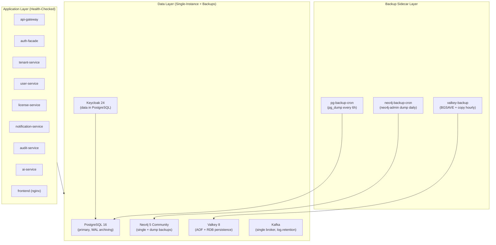
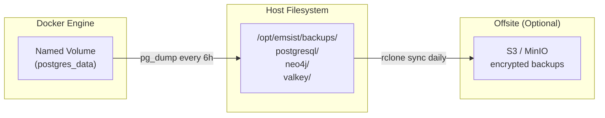
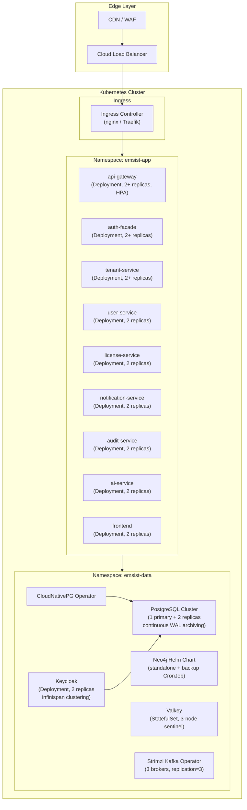
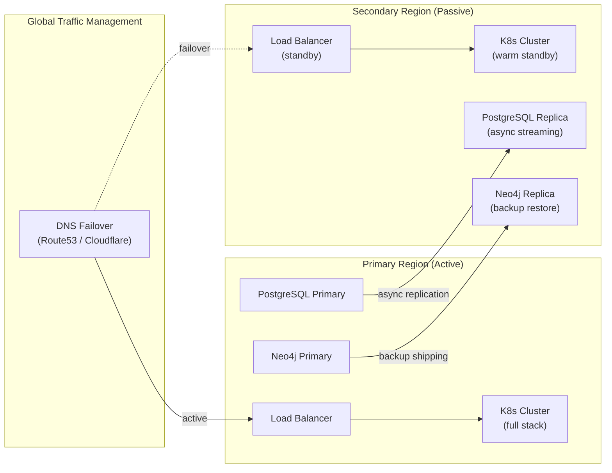
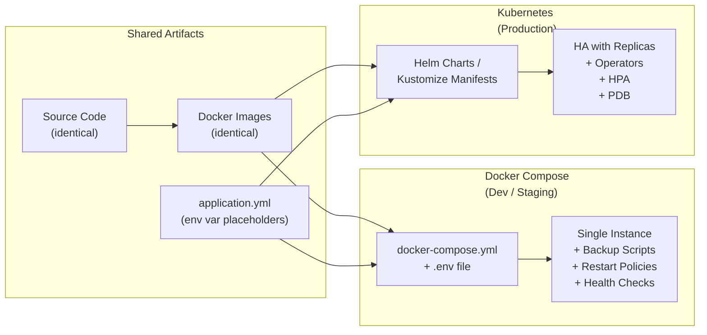
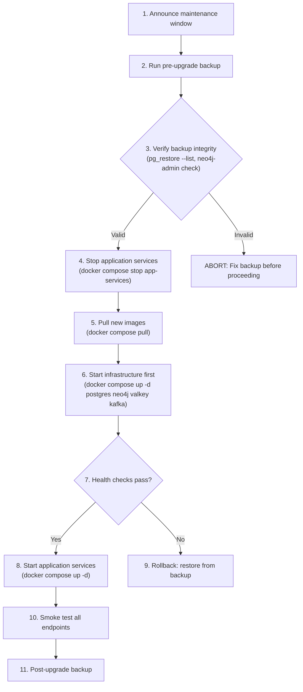

# ADR-018: High Availability and Multi-Tier Architecture

**Status:** Proposed
**Date:** 2026-03-02
**Decision Makers:** Architecture Review Board, CTO

## Context

EMSIST is a multi-tenant SaaS platform running 8 active microservices, 4 stateful data stores (PostgreSQL, Neo4j, Valkey, Kafka), an identity provider (Keycloak), and a frontend (Angular + nginx). The current deployment topology across all environments (dev, staging) uses single-instance Docker Compose with named volumes for persistence.

The user has experienced **data loss during major infrastructure upgrades** (e.g., Docker image version bumps, volume recreation during `docker compose down -v`, host OS upgrades). Root cause analysis identifies the following failure modes in the current topology:

### Root Causes of Data Loss

1. **Single-instance stateful services with no replication.** Every database (PostgreSQL, Neo4j) runs as a single container. If the container is destroyed, corrupted, or fails to restart, all data exists only in a Docker named volume on a single host.

2. **No automated backup strategy.** There is no scheduled `pg_dump`, Neo4j `neo4j-admin database dump`, or Valkey `BGSAVE` snapshot export. Recovery depends entirely on the named volume surviving intact.

3. **Volume lifecycle tied to Compose lifecycle.** Running `docker compose down -v` (a common developer mistake) destroys all named volumes. There is no guard against this.

4. **No health-based failover.** If PostgreSQL becomes unresponsive, all 6 dependent services fail simultaneously. There is no read replica, standby, or circuit breaker to absorb the impact.

5. **Single Kafka broker with replication factor 1.** All topic data resides on one broker. A broker failure loses uncommitted messages and halts event processing.

### Current Deployment Evidence

Verified against actual Compose files:

| Component | Dev Compose (`docker-compose.dev.yml`) | Staging Compose (`docker-compose.staging.yml`) | Replicas | Backup |
|-----------|----------------------------------------|------------------------------------------------|----------|--------|
| PostgreSQL | `pgvector/pgvector:pg16`, 1 instance, `dev_postgres_data` volume | `pgvector/pgvector:pg16`, 1 instance, `staging_postgres_data` volume | 1 | None |
| Neo4j | `neo4j:5-community`, 1 instance, `dev_neo4j_data` volume | `neo4j:5-community`, 1 instance, `staging_neo4j_data` volume | 1 | None |
| Valkey | `valkey/valkey:8-alpine`, 1 instance, `dev_valkey_data` volume | `valkey/valkey:8-alpine`, 1 instance, `staging_valkey_data` volume | 1 | None |
| Kafka | `confluentinc/cp-kafka:7.6.0`, 1 broker, replication factor 1 | `confluentinc/cp-kafka:7.6.0`, 1 broker, replication factor 1 | 1 | None |
| Keycloak | `quay.io/keycloak/keycloak:24.0`, 1 instance | Same | 1 | None (data in PostgreSQL) |
| Application services | 1 instance each (8 services) | 1 instance each (8 services) | 1 each | N/A (stateless) |
| Frontend | `node:22-alpine` (dev) / nginx build (staging) | nginx build | 1 | N/A (static) |

**File evidence:**
- `/docker-compose.dev.yml` lines 26-47 (PostgreSQL), 49-77 (Neo4j), 79-98 (Valkey), 99-130 (Kafka)
- `/docker-compose.staging.yml` lines 26-48 (PostgreSQL), 50-78 (Neo4j), 80-98 (Valkey), 100-130 (Kafka)
- `/infrastructure/docker/docker-compose.yml` lines 8-25 (PostgreSQL), 27-61 (Valkey/Neo4j), 65-92 (Kafka)

## Decision Drivers

* **Data durability** -- Prevent any single failure from causing permanent data loss
* **Service continuity** -- Minimize downtime during upgrades, restarts, and failures
* **Multi-tenancy obligation** -- Tenant data loss is a contractual and reputational risk
* **Operational maturity** -- Current topology is suitable for development but not for staging or production
* **Cost-awareness** -- Solutions must be phased to balance investment with risk reduction
* **Upgrade safety** -- Infrastructure version upgrades must not require downtime or risk data loss

## Considered Alternatives

### Option 1: Enhanced Docker Compose with Automated Backups (Phase 1 Only)

Add backup cron containers and volume bind-mounts to host filesystem.

**Pros:** Minimal infrastructure change, fast to implement.
**Cons:** Still single-instance, no failover, backups are point-in-time only (RPO > 0), no horizontal scaling.

### Option 2: Docker Compose HA with Replication + Kubernetes Migration (Phased -- SELECTED)

Phase 1: Add database replication, automated backups, and health-based restart policies within Docker Compose.
Phase 2: Migrate to Kubernetes with StatefulSets, PVCs, and operator-managed databases.
Phase 3: Multi-region active-passive with managed database services.

**Pros:** Incremental investment, each phase delivers measurable risk reduction, Kubernetes provides production-grade orchestration.
**Cons:** Complexity increases at each phase, requires operational skill growth.

### Option 3: Immediate Kubernetes Migration (Skip Docker Compose HA)

Jump directly to Kubernetes with managed databases.

**Pros:** Production-grade from day one, operator ecosystem (CloudNativePG, Neo4j Helm).
**Cons:** High upfront effort, steep learning curve, delays risk mitigation while K8s is being set up. Not suitable for current team velocity.

### Option 4: Managed Cloud Services Only (RDS, Atlas, etc.)

Use fully managed databases (AWS RDS, Neo4j Aura, Amazon ElastiCache).

**Pros:** Zero operational burden for HA, automated backups, managed failover.
**Cons:** Vendor lock-in, cost at scale, requires cloud account setup, not suitable for on-premise deployment model (see ADR-015).

## Decision

Adopt **Option 2: Phased HA Architecture** with three distinct phases, each delivering independently valuable risk reduction.

### Phase 1: Docker Compose HA (Immediate -- Q1 2026)

Goal: Eliminate data loss risk in current Docker Compose deployment.



**Phase 1 deliverables:**

| Deliverable | Description | RPO | RTO |
|-------------|-------------|-----|-----|
| PostgreSQL automated backup | `pg_dump` every 6 hours to host-mounted volume + optional S3 upload | 6 hours | 30 min (restore from dump) |
| Neo4j automated backup | `neo4j-admin database dump` daily to host-mounted volume | 24 hours | 15 min (restore from dump) |
| Valkey persistence hardening | Enable AOF (`appendonly yes`) + RDB snapshots every 15 min | ~15 min | 5 min (restart with AOF replay) |
| Kafka log retention | Set `log.retention.hours=168` (7 days), `log.segment.bytes` tuned | N/A (messaging) | Broker restart |
| Docker Compose restart policies | `restart: unless-stopped` on all services | N/A | Automatic restart |
| Volume backup guard | Host bind-mount backups to `/opt/emsist/backups/` outside Docker volume scope | N/A | N/A |
| Health check hardening | Tighten intervals, add `start_period` to all stateful services | N/A | Faster failure detection |
| Upgrade runbook | Documented procedure for safe image upgrades with pre-upgrade backup | N/A | N/A |

**Volume protection strategy:**



### Phase 2: Kubernetes with Database Operators (Q2-Q3 2026)

Goal: Production-grade orchestration with automated failover and horizontal scaling.



#### Kubernetes Operator Specifications

Each stateful component uses a purpose-built Kubernetes operator or deployment pattern:

**CloudNativePG (PostgreSQL)**

[CloudNativePG](https://cloudnative-pg.io/) is a CNCF Sandbox operator purpose-built for PostgreSQL on Kubernetes. It manages the full lifecycle of PostgreSQL clusters including provisioning, failover, backup, and major version upgrades.

| Feature | Configuration |
|---------|---------------|
| Operator version | CloudNativePG >= 1.22 |
| PostgreSQL version | 16 (matching current `pgvector/pgvector:pg16`) |
| Cluster topology | 1 primary + 2 streaming replicas |
| Failover | Automatic (operator promotes replica within seconds) |
| Connection pooling | Built-in PgBouncer sidecar (transaction-level pooling) |
| Backup | Continuous WAL archiving to S3-compatible storage (Barman) |
| Point-in-time recovery | Supported via WAL replay to any timestamp |
| Monitoring | Built-in Prometheus metrics exporter, PodMonitor CRD |
| TLS | Automatic TLS certificate management for inter-node and client connections |

```yaml
# Example CloudNativePG Cluster CRD (illustrative)
apiVersion: postgresql.cnpg.io/v1
kind: Cluster
metadata:
  name: emsist-pg
  namespace: emsist-data
spec:
  instances: 3
  postgresql:
    parameters:
      password_encryption: scram-sha-256
  storage:
    storageClass: encrypted-gp3
    size: 50Gi
  backup:
    barmanObjectStore:
      destinationPath: s3://emsist-backups/postgresql/
      wal:
        compression: gzip
  monitoring:
    enablePodMonitor: true
```

**Strimzi (Kafka)**

[Strimzi](https://strimzi.io/) is a CNCF Incubating operator for running Apache Kafka on Kubernetes. It manages brokers, topics, users, and MirrorMaker deployments declaratively.

| Feature | Configuration |
|---------|---------------|
| Operator version | Strimzi >= 0.40 |
| Kafka version | 3.7+ (current Compose uses cp-kafka 7.6.0 which bundles Kafka 3.6) |
| Broker count | 3 |
| Replication factor | 3 (default for all topics) |
| Min ISR | 2 |
| Storage | JBOD with encrypted PVCs |
| Authentication | SASL/SCRAM-SHA-512 per-service KafkaUser CRDs |
| Encryption | TLS for inter-broker and client connections |
| Monitoring | Built-in JMX + Prometheus metrics |

**Valkey Sentinel (StatefulSet)**

Valkey does not have a mature Kubernetes operator. The recommended deployment is a StatefulSet with Sentinel sidecars for automatic failover.

| Feature | Configuration |
|---------|---------------|
| Deployment | StatefulSet with 3 pods (1 primary + 2 replicas) |
| Failover | 3 Sentinel instances (can be sidecars or separate pods) |
| Quorum | 2 Sentinels must agree for failover |
| Persistence | AOF (`appendonly yes`) + RDB snapshots on each node |
| TLS | `--tls-port 6379` with cert-manager certificates |
| Client | Spring Data Redis Lettuce with Sentinel configuration |
| Monitoring | `INFO` command metrics exposed via Prometheus exporter sidecar |

**Neo4j (Helm Chart)**

Neo4j provides an official Helm chart. Since EMSIST uses Community Edition (no causal clustering), the Kubernetes deployment is standalone with robust backup automation.

| Feature | Configuration |
|---------|---------------|
| Helm chart | `neo4j/neo4j` >= 5.12 |
| Edition | Community (standalone only; Enterprise required for clustering) |
| Replicas | 1 (Community limitation) |
| Backup | CronJob: `neo4j-admin database dump` to PVC, then `rclone` to S3 |
| Persistence | PVC with encrypted StorageClass |
| HA consideration | If HA is required for Neo4j, upgrade to Enterprise Edition for causal clustering (3 core + N read replicas). Only auth-facade uses Neo4j, so standalone with fast backup restore is acceptable for Phase 2. |

**Phase 2 deliverables:**

| Component | Kubernetes Resource | HA Strategy | Backup Strategy |
|-----------|--------------------|----|-----|
| PostgreSQL | CloudNativePG Cluster (3 instances) | Streaming replication, automatic failover, connection pooling via PgBouncer | Continuous WAL archiving to S3, scheduled `pg_basebackup` |
| Neo4j | Helm chart (standalone or causal cluster if Enterprise) | Community: single + CronJob backup. Enterprise: causal cluster (3 cores) | CronJob: `neo4j-admin database dump` to PVC + S3 |
| Valkey | StatefulSet (3 nodes) + Sentinel | Sentinel-managed failover, read replicas | RDB snapshots to PVC, periodic S3 upload |
| Kafka | Strimzi Operator (3 brokers) | Replication factor 3, min ISR 2, automatic partition rebalancing | Topic-level retention, MirrorMaker for DR |
| Keycloak | Deployment (2+ replicas) | Infinispan distributed cache for session sharing | Data in PostgreSQL (covered by PG backup) |
| Application services | Deployment (2+ replicas each) | HPA based on CPU/memory, PodDisruptionBudget | Stateless -- no backup needed |
| Frontend | Deployment (2+ replicas) | HPA, CDN cache | Static assets -- no backup needed |

**Scaling targets:**

| Metric | Target | Mechanism |
|--------|--------|-----------|
| Application service replicas | 2 min, 8 max | HPA on CPU (70%) and memory (80%) |
| API gateway replicas | 2 min, 10 max | HPA on request rate |
| PostgreSQL read throughput | 3x via read replicas | CloudNativePG replica services |
| Valkey read throughput | 3x via read replicas | Sentinel read-from-replica |
| Zero-downtime deploys | Rolling update, maxUnavailable=0 | Deployment strategy |
| Pod disruption tolerance | 1 unavailable max per service | PodDisruptionBudget |

### Phase 3: Multi-Region Active-Passive (Q4 2026+)

Goal: Geographic redundancy for disaster recovery.



**Phase 3 deliverables:**

| Deliverable | RPO | RTO | Strategy |
|-------------|-----|-----|----------|
| Cross-region PostgreSQL replication | < 1 min | 5 min (promote replica) | Async streaming replication or managed cross-region replicas |
| Neo4j cross-region backup | 1 hour | 30 min (restore from backup) | Scheduled backup shipping to secondary region S3 |
| Valkey cross-region | Session rebuild | 2 min | Warm standby with periodic RDB sync |
| Kafka MirrorMaker 2 | < 5 min | 10 min (consumer repoint) | Active-passive topic mirroring |
| DNS failover | N/A | 2-5 min (DNS TTL) | Health-checked DNS with automatic failover |
| Application warm standby | N/A | 2 min (scale up from 1 to N replicas) | Scaled-down replicas in secondary region |

## Deployment Mode Toggle

The same application source code and Docker images deploy to both Docker Compose and Kubernetes. The difference is **purely deployment configuration** -- no code changes, no feature flags, no conditional compilation.

### Design Principle



### Docker Compose vs Kubernetes Comparison

| Component | Docker Compose (Dev/Staging) | Kubernetes (Production) |
|-----------|------------------------------|-------------------------|
| **PostgreSQL** | Single instance (`pgvector/pgvector:pg16`), named volume, `pg_dump` backup cron | CloudNativePG Operator: 1 primary + 2 streaming replicas, automated failover, continuous WAL archiving to S3 |
| **Neo4j** | Single instance (`neo4j:5-community`), named volume, `neo4j-admin dump` backup cron | Neo4j Helm chart: standalone (Community) or causal cluster (Enterprise), CronJob backup to PVC + S3 |
| **Valkey** | Single instance (`valkey/valkey:8-alpine`), AOF + RDB persistence, `BGSAVE` export cron | StatefulSet: 3-node Sentinel cluster, automatic failover, RDB snapshots to PVC |
| **Kafka** | Single broker (`cp-kafka:7.6.0`), replication factor 1, `log.retention.hours=168` | Strimzi Operator: 3 brokers, replication factor 3, min ISR 2, MirrorMaker for DR |
| **Backend Services** | 1 instance each, `restart: unless-stopped`, Docker health checks | Deployment: 2+ replicas, HPA (CPU 70%, memory 80%), PodDisruptionBudget (maxUnavailable=1) |
| **Frontend** | 1 nginx instance, `restart: unless-stopped` | Deployment: 2+ replicas, CDN cache, HPA on request rate |
| **Keycloak** | 1 instance, data in PostgreSQL | Deployment: 2+ replicas, Infinispan distributed cache for session clustering |
| **Credentials** | `.env.dev` / `.env.staging` files (gitignored, `chmod 600`) | Kubernetes Secrets (RBAC-protected per ServiceAccount) + optional HashiCorp Vault for dynamic rotation |
| **Encryption at Rest** | Host filesystem encryption (LUKS/FileVault on Docker data partition) | Encrypted StorageClass PVs (cloud KMS or LUKS-backed) |
| **Networking** | Docker bridge network, `ports:` host mapping | ClusterIP services, Ingress controller (nginx/Traefik), NetworkPolicy isolation between namespaces |
| **Monitoring** | Actuator health endpoints, Docker health checks | Prometheus + Grafana, liveness/readiness probes, PodMonitor CRDs |
| **Backup** | Cron sidecar containers writing to host bind-mount (`/opt/emsist/backups/`) | CronJobs writing to PVCs, `rclone` to S3, CloudNativePG continuous WAL archiving |
| **Failover** | Manual restart (Docker `restart: unless-stopped`) -- NOT HA | Automatic (operator-managed failover for databases, K8s restarts for stateless services) -- IS HA |
| **Scaling** | Manual (change `deploy.replicas` in Compose, restart) | Automatic (HPA scales based on metrics, VPA adjusts resource requests) |

**Key distinction:** Docker Compose environments are **NOT highly available**. They provide **durability** (backups + restart policies) but not **availability** (failover + replication). True HA requires Kubernetes (Phase 2+).

## Secrets Management by Environment

Credential management follows a progressive security model across environments:

```mermaid
flowchart TB
    subgraph dev["Dev Environment"]
        DEV_ENV[".env.dev\n(gitignored)\nchmod 600\nlocal filesystem only"]
        DEV_DC["docker-compose.dev.yml\nenv_file: .env.dev"]
        DEV_ENV --> DEV_DC
        DEV_DC --> DEV_CONT["Containers\n(env vars injected)"]
    end

    subgraph staging["Staging Environment"]
        STG_ENV[".env.staging\n(gitignored)\nchmod 600\nserver filesystem"]
        STG_DC["docker-compose.staging.yml\nenv_file: .env.staging"]
        STG_ENV --> STG_DC
        STG_DC --> STG_CONT["Containers\n(env vars injected)"]
    end

    subgraph production["Production Environment"]
        VAULT["HashiCorp Vault\n(optional)\nDynamic secrets engine\nAutomatic rotation"]
        K8S_SEC["Kubernetes Secrets\nRBAC per ServiceAccount\nEncrypted etcd"]
        K8S_POD["Pods\n(env from Secret ref)"]
        VAULT -.->|"dynamic\ncredentials"| K8S_SEC
        K8S_SEC --> K8S_POD
    end
```



| Environment | Secret Source | Rotation | Access Control | Encryption |
|-------------|-------------|----------|----------------|------------|
| **Dev** | `.env.dev` (local file) | Manual (developer generates on setup) | Developer-only (local machine) | Host filesystem encryption (FileVault/LUKS) |
| **Staging** | `.env.staging` (server file) | Manual (ops rotates quarterly) | SSH access required, `chmod 600 root:root` | Host filesystem encryption + Jasypt for app config |
| **Production** | K8s Secrets (+ optional Vault) | Automated (Vault lease TTL, External Secrets Operator) | K8s RBAC: each service's ServiceAccount can only read its own Secret | etcd encryption at rest + Jasypt for app config |

**Credential types managed:**

| Credential | Dev | Staging | Production |
|------------|-----|---------|------------|
| PostgreSQL per-service passwords | `.env.dev` | `.env.staging` | K8s Secret |
| Neo4j password | `.env.dev` | `.env.staging` | K8s Secret |
| Valkey password | `.env.dev` | `.env.staging` | K8s Secret |
| Keycloak admin password | `.env.dev` | `.env.staging` | K8s Secret |
| Jasypt master password | `.env.dev` | `.env.staging` | K8s Secret (mounted as env var) |
| AI provider API keys | `.env.dev` | `.env.staging` | K8s Secret + Vault |
| TLS certificates (ADR-019) | `scripts/generate-dev-certs.sh` | Let's Encrypt / self-signed | cert-manager + Let's Encrypt / ACM |

See ADR-020 for the per-service PostgreSQL user specification and ADR-019 for the Jasypt expansion plan.

## Consequences

### Positive

* **Eliminates single-point-of-failure data loss** -- Even in Phase 1, automated backups ensure data can be recovered from the most recent backup point.
* **Enables zero-downtime upgrades** -- Phase 2 rolling deployments mean infrastructure upgrades do not require service interruption.
* **Supports horizontal scaling** -- Phase 2 HPA allows the platform to handle growing tenant load without manual intervention.
* **Meets multi-tenant SLA obligations** -- Data durability guarantees are essential for tenant trust.
* **Phased investment** -- Each phase delivers independent value; the project can stop at any phase and still benefit.

### Negative

* **Increased operational complexity** -- Each phase adds infrastructure components that must be monitored and maintained.
* **Higher infrastructure cost** -- Replication and multi-region deployment multiply compute and storage costs.
* **Neo4j Community Edition limitation** -- Neo4j Community does not support causal clustering. HA for Neo4j requires either Enterprise Edition (licensed) or single-instance with robust backup/restore. This is an accepted constraint given that only auth-facade uses Neo4j.
* **Learning curve** -- Kubernetes, operators, and multi-region patterns require operational expertise.
* **Phase 1 RPO is not zero** -- Backup-based recovery means some data loss is possible (up to 6 hours for PostgreSQL, 24 hours for Neo4j). Phase 2 streaming replication reduces this to near-zero.

### Neutral

* Docker Compose remains the development environment runtime. Phase 2+ applies to staging and production only.
* The on-premise deployment model (ADR-015) benefits from Phase 1 and Phase 2. Phase 3 is cloud-specific and optional for on-premise customers.

## Phase Readiness Criteria

| Phase | Entry Criteria | Exit Criteria |
|-------|---------------|---------------|
| Phase 1 | Current topology verified, backup scripts tested | All backups running on schedule, restore tested, upgrade runbook validated |
| Phase 2 | Phase 1 stable, K8s cluster provisioned, team trained | All services running in K8s, failover tested, HPA validated, backup to S3 operational |
| Phase 3 | Phase 2 stable, secondary region provisioned | Cross-region replication verified, failover drill completed, RPO/RTO targets met |

## Upgrade Safety Runbook (Phase 1)

The immediate action to prevent data loss during upgrades:



**Critical rule:** NEVER run `docker compose down -v` on staging or production. The `-v` flag destroys all named volumes. Use `docker compose down` (without `-v`) or `docker compose stop` instead.

## Related Decisions

- **Supersedes:** None (new decision area)
- **Related to:** ADR-003 (Multi-tenancy -- tenant data isolation increases HA importance), ADR-005 (Valkey caching -- persistence configuration), ADR-015 (On-premise licensing -- on-premise customers need Phase 1+2), ADR-016 (Polyglot persistence -- PostgreSQL and Neo4j both need HA strategies), ADR-019 (Encryption at rest -- backups must be encrypted, TLS for all connections), ADR-020 (Service credentials -- per-service users, secrets management by environment)
- **Arc42 Sections:** 07-deployment-view.md, 11-risks-technical-debt.md, 04-solution-strategy.md

## Implementation Evidence

Status: **Proposed** -- No implementation exists yet. This ADR defines the target architecture.

Current state evidence (what exists today):
- Single-instance PostgreSQL: `/docker-compose.staging.yml` line 26 (`pgvector/pgvector:pg16`)
- Single-instance Neo4j: `/docker-compose.staging.yml` line 51 (`neo4j:5-community`)
- Single-instance Valkey: `/docker-compose.staging.yml` line 81 (`valkey/valkey:8-alpine`)
- Single-broker Kafka: `/docker-compose.staging.yml` line 101 (`confluentinc/cp-kafka:7.6.0`)
- No backup containers in any Compose file
- No replication configuration in any Compose file
- Volume definitions: `/docker-compose.staging.yml` lines 476-479 (4 named volumes, no host bind-mounts for backups)
