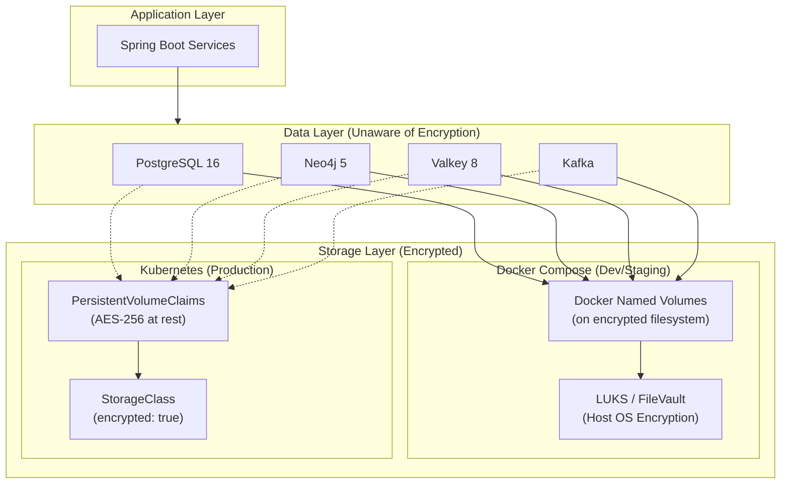
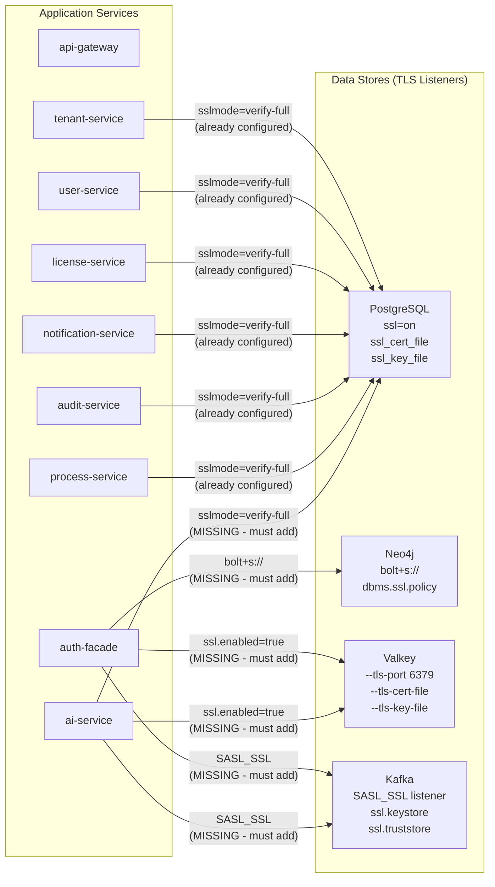
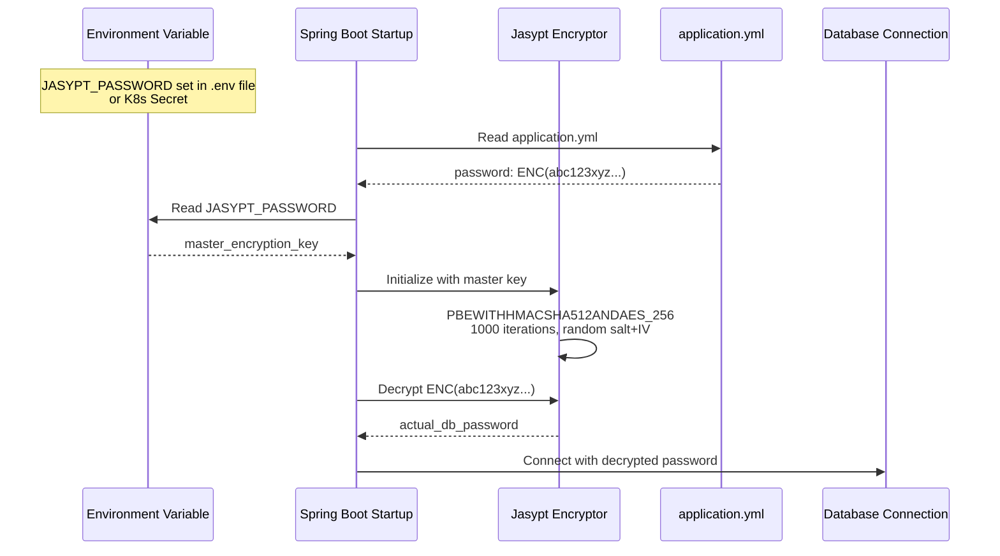
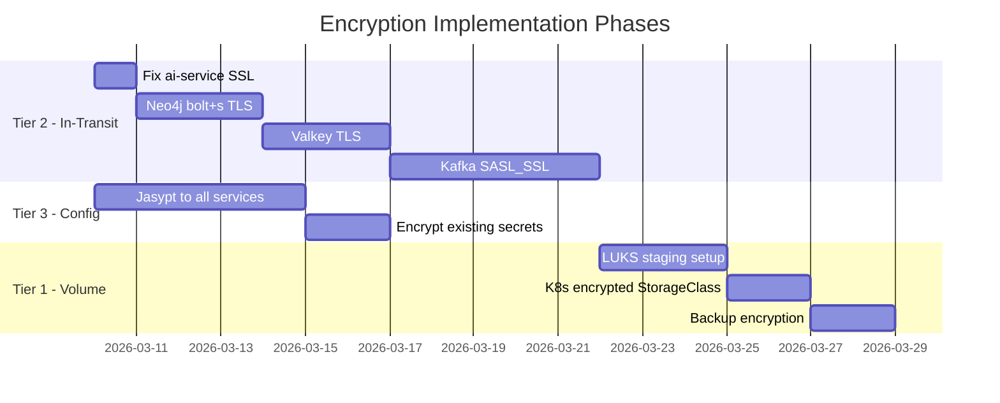

# ADR-019: Encryption at Rest Strategy

**Status:** Proposed
**Date:** 2026-03-02
**Decision Makers:** Architecture Review Board, CISO, CTO

## Context

EMSIST is a multi-tenant SaaS platform handling sensitive enterprise data across 8 active microservices, 4 stateful data stores (PostgreSQL, Neo4j, Valkey, Kafka), and an identity provider (Keycloak). An audit of the current deployment reveals that **no data store has encryption at rest**, and in-transit encryption is inconsistently applied.

### Current State (Verified Against Codebase)

**Data at rest -- no encryption:**

| Data Store | Current State | Evidence |
|------------|---------------|----------|
| PostgreSQL 16 | Data stored in plaintext Docker named volumes (`dev_postgres_data`, `staging_postgres_data`). No TDE, no pgcrypto column encryption. | `/docker-compose.dev.yml` line 26, `/docker-compose.staging.yml` line 26 |
| Neo4j 5 Community | Data stored in plaintext Docker named volume (`dev_neo4j_data`). Community Edition does not support at-rest encryption. | `/docker-compose.dev.yml` Neo4j volume, `neo4j:5-community` image |
| Valkey 8 | RDB snapshots and AOF files stored in plaintext Docker volume. No TLS configured. | `/docker-compose.dev.yml` Valkey service, no `--tls-port` flag |
| Kafka | Topic log segments stored in plaintext Docker volume. Replication factor 1, no encryption. | `/docker-compose.dev.yml` Kafka service, `KAFKA_OFFSETS_TOPIC_REPLICATION_FACTOR: 1` |
| Backup files | No backup automation exists (see ADR-018). When implemented, backups will be unencrypted by default. | No backup containers in any Compose file |

**Data in transit -- inconsistent TLS:**

| Connection | Current State | Evidence |
|------------|---------------|----------|
| PostgreSQL JDBC (6 services) | `sslmode=verify-full` configured | `backend/*/src/main/resources/application.yml` (tenant, user, license, notification, audit, process services) |
| PostgreSQL JDBC (ai-service) | **No `sslmode` parameter** -- plaintext default | `/backend/ai-service/src/main/resources/application.yml` line 9: `jdbc:postgresql://${DB_HOST:localhost}:${DB_PORT:5432}/${DB_NAME:ems}` |
| Neo4j Bolt (auth-facade) | **Plaintext `bolt://`** -- no TLS | `/backend/auth-facade/src/main/resources/application.yml` line 28: `uri: ${NEO4J_URI:bolt://localhost:7687}` |
| Valkey (auth-facade + ai-service) | **No TLS** -- plaintext Redis protocol | `/backend/auth-facade/src/main/resources/application.yml` lines 16-20: no `ssl` configuration |
| Kafka (all producers/consumers) | **Plaintext** -- `PLAINTEXT://` listener | `/docker-compose.dev.yml` Kafka: `KAFKA_ADVERTISED_LISTENERS: PLAINTEXT://kafka:29092` |
| Keycloak JDBC | `sslmode=verify-full` configured | `/backend/docker-compose.yml` line 83 |

**Config encryption -- auth-facade only:**

| Service | Jasypt Status | Evidence |
|---------|---------------|----------|
| auth-facade | Jasypt configured with `PBEWITHHMACSHA512ANDAES_256` | `/backend/auth-facade/src/main/java/com/ems/auth/config/JasyptConfig.java`, `/backend/auth-facade/src/main/resources/application.yml` lines 48-56 |
| All other services (7) | **No Jasypt** -- sensitive values (API keys, passwords) stored as plaintext `${ENV_VAR}` references with hardcoded fallback defaults | `/backend/ai-service/src/main/resources/application.yml` lines 9-11: `username: ${DB_USERNAME:ems}`, `password: ${DB_PASSWORD:ems}` |

### Why This Matters

1. **Multi-tenant data exposure** -- A compromised Docker volume or backup file exposes ALL tenant data across ALL databases.
2. **Compliance risk** -- Enterprise customers require data-at-rest encryption for SOC 2, ISO 27001, and GDPR compliance.
3. **On-premise deployment** (ADR-015) -- On-premise customers may have weaker physical security; encryption compensates.
4. **Backup safety** -- ADR-018 introduces automated backups. Unencrypted backups shipped to S3/MinIO create a second attack surface.

## Decision Drivers

* **Regulatory compliance** -- SOC 2 Type II, ISO 27001, GDPR Article 32 require appropriate encryption
* **Multi-tenant isolation** -- Data belonging to one tenant must not be readable if another tenant's data store is compromised
* **On-premise deployment model** -- ADR-015 requires encryption that works without cloud-managed services
* **Defense in depth** -- Encryption at rest is one layer in a multi-layer security strategy
* **Operational simplicity** -- Solution must not require per-query encryption logic in application code

## Considered Alternatives

### Option 1: pgcrypto Column-Level Encryption

Encrypt individual columns using PostgreSQL's `pgcrypto` extension (`pgp_sym_encrypt` / `pgp_sym_decrypt`).

**Pros:** Granular control over which fields are encrypted. Application-layer encryption independent of storage.
**Cons:** Requires modifying every repository query to encrypt/decrypt. Breaks indexing on encrypted columns. Adds application complexity across 7 services. Does not protect Neo4j, Valkey, or Kafka. Not practical for Phase 1.

### Option 2: AWS KMS / Cloud-Managed Encryption

Use AWS KMS (or equivalent) for envelope encryption. RDS transparent encryption, ElastiCache encryption, MSK encryption.

**Pros:** Zero application changes. Fully managed key rotation. Industry-standard key hierarchy.
**Cons:** Cloud vendor lock-in. Not suitable for on-premise deployments (ADR-015 requirement). Requires AWS account and IAM configuration. Cost scales with API calls.

### Option 3: Full-Disk Encryption Only (No In-Transit)

Rely solely on host-level full-disk encryption (LUKS on Linux, FileVault on macOS).

**Pros:** Simple. No application changes. Protects against physical theft.
**Cons:** Does not protect data in transit between services and databases. Does not protect against compromised processes reading data from disk. Does not encrypt backups shipped offsite. Insufficient for compliance frameworks requiring in-transit encryption.

### Option 4: Three-Tier Encryption Strategy (SELECTED)

Volume-level encryption + in-transit TLS for all connections + Jasypt config encryption for all services.

**Pros:** Defense in depth. Works for both Docker Compose and Kubernetes. No application query changes. Covers at-rest, in-transit, and config secrets. Compatible with on-premise deployment.
**Cons:** TLS adds latency (~5%). Jasypt adds startup complexity. Volume encryption requires host configuration outside Docker.

## Decision

Adopt **Option 4: Three-Tier Encryption Strategy** covering data at rest, data in transit, and configuration secrets.

### Tier 1: Volume-Level Encryption (Data at Rest) [PLANNED]

Encrypt the host filesystem where Docker volumes or Kubernetes PVs store data.

| Environment | Encryption Mechanism | Key Management |
|-------------|---------------------|----------------|
| Dev (macOS) | FileVault (default on macOS) | macOS Keychain |
| Dev (Linux) | LUKS on data partition | Passphrase at boot |
| Staging (Linux) | LUKS on `/var/lib/docker` partition | Passphrase or TPM |
| Production (K8s) | Encrypted StorageClass PVs (e.g., `gp3` with EBS encryption, or Longhorn with encryption) | Cloud KMS or LUKS |

### Tier 2: In-Transit Encryption (TLS for All Connections) [PLANNED]

All data connections between application services and data stores must use TLS.

**Required configuration changes:**

| Connection | Current | Target | Change Required |
|------------|---------|--------|-----------------|
| ai-service to PostgreSQL | `jdbc:postgresql://host:5432/db` (no SSL) | `jdbc:postgresql://host:5432/db?sslmode=verify-full` | Add `?sslmode=verify-full` to JDBC URL |
| auth-facade to Neo4j | `bolt://localhost:7687` | `bolt+s://localhost:7687` | Change URI scheme; configure Neo4j `dbms.ssl.policy.bolt` |
| auth-facade to Valkey | No TLS | `spring.data.redis.ssl.enabled=true` | Enable Valkey TLS listener (`--tls-port`); add Spring SSL config |
| ai-service to Valkey | No TLS | `spring.data.redis.ssl.enabled=true` | Same as above |
| All services to Kafka | `PLAINTEXT://` | `SASL_SSL://` | Configure Kafka SSL listener; add JAAS config to all producers/consumers |
| PostgreSQL server | No `ssl=on` in config | `ssl=on` with cert/key | Mount TLS certs into PostgreSQL container |
| Neo4j server | No SSL policy | `dbms.ssl.policy.bolt.enabled=true` | Mount TLS certs into Neo4j container |
| Valkey server | No TLS | `--tls-port 6379 --tls-cert-file --tls-key-file` | Mount TLS certs into Valkey container |

### Tier 3: Configuration Encryption (Jasypt for All Services) [PLANNED]

Expand Jasypt encrypted property support from auth-facade to all services with sensitive configuration values.

**Current state:** Only auth-facade has Jasypt configured (`/backend/auth-facade/src/main/java/com/ems/auth/config/JasyptConfig.java`).

**Target state:** All services that handle secrets (API keys, database passwords, client secrets) use Jasypt `ENC()` values in their `application.yml` files, decrypted at startup using the `JASYPT_PASSWORD` environment variable.

| Service | Sensitive Config Values | Jasypt Status |
|---------|------------------------|---------------|
| auth-facade | Keycloak admin password, client secret, Neo4j password, Valkey password | [IMPLEMENTED] -- Jasypt configured |
| ai-service | OpenAI/Anthropic API keys, DB password | [PLANNED] -- Must add Jasypt dependency and config |
| tenant-service | DB password, Keycloak admin password | [PLANNED] |
| user-service | DB password | [PLANNED] |
| license-service | DB password, license signing key | [PLANNED] |
| notification-service | DB password, SMTP credentials | [PLANNED] |
| audit-service | DB password | [PLANNED] |
| process-service | DB password | [PLANNED] |

**Jasypt encryption flow:**

**Jasypt algorithm details (matching auth-facade implementation):**

| Parameter | Value | Source |
|-----------|-------|--------|
| Algorithm | `PBEWITHHMACSHA512ANDAES_256` | `/backend/auth-facade/src/main/resources/application.yml` line 51 |
| Key derivation iterations | 1000 | Same file, line 52 |
| Salt generator | `RandomSaltGenerator` | Same file, line 54 |
| IV generator | `RandomIvGenerator` | Same file, line 55 |
| Output type | Base64 | Same file, line 56 |

## Consequences

### Positive

* **All data protected at rest and in transit** -- Meets SOC 2, ISO 27001, and GDPR Article 32 requirements for encryption of personal data.
* **Defense in depth** -- Three independent encryption layers mean compromise of one layer does not expose data.
* **No application query changes** -- Volume encryption and TLS are transparent to application code. Jasypt only affects configuration loading.
* **On-premise compatible** -- LUKS and self-signed TLS certs work without cloud services, supporting ADR-015 on-premise deployment model.
* **Backup safety** -- When ADR-018 backup automation is implemented, backups on encrypted volumes are encrypted at rest. Offsite backups can use `gpg` encryption.
* **Consistent Jasypt pattern** -- Reusing the proven auth-facade Jasypt configuration across all services reduces implementation risk.

### Negative

* **TLS adds ~5% latency** -- Connection setup overhead for PostgreSQL, Neo4j, Valkey, and Kafka connections. Mitigated by connection pooling (HikariCP for JDBC, Lettuce for Valkey).
* **Certificate management overhead** -- Self-signed TLS certificates for dev/staging must be generated, distributed to containers, and rotated. Production uses cloud-managed certificates (ACM, Let's Encrypt).
* **Jasypt master key is a critical secret** -- Loss of `JASYPT_PASSWORD` means inability to decrypt configuration values. Must be backed up securely and documented in the operational runbook.
* **Jasypt adds startup complexity** -- Each service now requires `JASYPT_PASSWORD` environment variable. Missing variable causes startup failure (fail-fast, which is the desired behavior).
* **Volume encryption requires host configuration** -- LUKS/FileVault must be configured outside Docker, which is an operational prerequisite rather than a code change.
* **Neo4j Community TLS limitations** -- Neo4j Community Edition supports TLS for bolt connections but has fewer configuration options than Enterprise Edition.

### Risks

| Risk | Likelihood | Impact | Mitigation |
|------|------------|--------|------------|
| `JASYPT_PASSWORD` lost or leaked | Medium | HIGH -- all encrypted configs become unreadable or compromised | Document recovery procedure; rotate password and re-encrypt all values; store master key in Vault (production) |
| TLS certificate expiry causes outage | Medium | MEDIUM -- services cannot connect to data stores | Certificate rotation automation; monitoring with 30-day expiry alerts |
| Performance degradation from TLS | Low | LOW -- connection pooling mitigates | Benchmark before/after; tune pool sizes if needed |
| Developer friction from encryption setup | Medium | LOW -- one-time setup cost | Document setup in README; provide `scripts/generate-dev-certs.sh` |

## Implementation Priority

**Recommended order:**
1. **Tier 2 first** (in-transit TLS) -- Highest security value per effort. Fixes the ai-service gap immediately.
2. **Tier 3 second** (Jasypt expansion) -- Low effort since auth-facade pattern already exists.
3. **Tier 1 last** (volume encryption) -- Requires host-level configuration and operational procedures.

## Related Decisions

- **Related to:** ADR-016 (Polyglot persistence -- encryption must cover both PostgreSQL and Neo4j), ADR-018 (HA/backups -- backups must be encrypted), ADR-020 (Service credentials -- encrypted config values complement per-service users), ADR-015 (On-premise -- encryption must work without cloud KMS), ADR-005 (Valkey caching -- Valkey TLS configuration)
- **Arc42 Sections:** 08-crosscutting.md (encryption as cross-cutting concern), 07-deployment-view.md (TLS configuration in deployment), 04-solution-strategy.md (security strategy)

## Implementation Evidence

Status: **Proposed** -- No encryption-at-rest implementation exists yet.

Current implementation evidence (what exists today):
- Jasypt in auth-facade: `/backend/auth-facade/src/main/java/com/ems/auth/config/JasyptConfig.java` (lines 1-65)
- Jasypt config: `/backend/auth-facade/src/main/resources/application.yml` lines 48-56
- PostgreSQL `sslmode=verify-full` in 6 of 7 services: e.g., `/backend/tenant-service/src/main/resources/application.yml` line 9
- Missing SSL in ai-service: `/backend/ai-service/src/main/resources/application.yml` line 9 (no `sslmode` parameter)
- Plaintext Neo4j bolt: `/backend/auth-facade/src/main/resources/application.yml` line 28 (`bolt://localhost:7687`)
- No Valkey TLS: `/backend/auth-facade/src/main/resources/application.yml` lines 16-20 (no `ssl` property)

## References

- [PostgreSQL SSL Support](https://www.postgresql.org/docs/16/ssl-tcp.html)
- [Neo4j SSL Configuration](https://neo4j.com/docs/operations-manual/current/security/ssl-framework/)
- [Valkey TLS Support](https://valkey.io/topics/encryption/)
- [Kafka SSL Configuration](https://kafka.apache.org/documentation/#security_ssl)
- [Jasypt Spring Boot](https://github.com/ulisesbocchio/jasypt-spring-boot)
- [LUKS Encryption](https://wiki.archlinux.org/title/Dm-crypt/Encrypting_an_entire_system)
- [GDPR Article 32](https://gdpr-info.eu/art-32-gdpr/) -- Security of Processing
