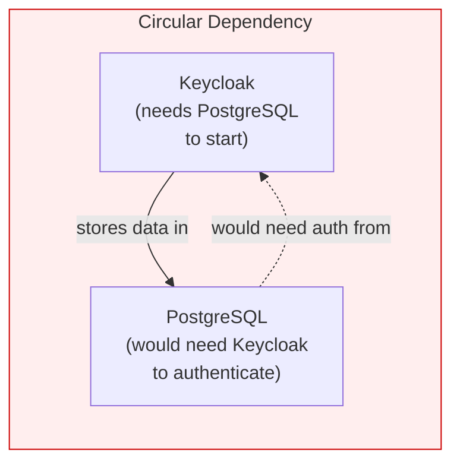
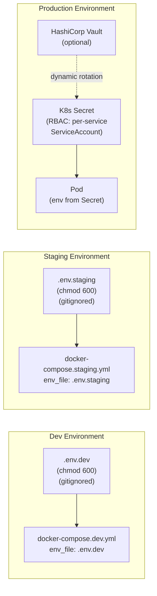

# ADR-020: Service Credential Management

**Status:** Proposed
**Date:** 2026-03-02
**Decision Makers:** Architecture Review Board, CISO, CTO

## Context

All 7 backend services that connect to PostgreSQL currently authenticate as the shared `postgres` superuser. If any single service is compromised (e.g., through an SSRF, SQL injection, or dependency vulnerability), the attacker gains **full superuser access to ALL 8 PostgreSQL databases** (master_db, user_db, license_db, notification_db, audit_db, ai_db, process_db, keycloak_db), including the ability to DROP databases, read other tenants' data, and modify Keycloak's authentication tables.

### Current State (Verified Against Codebase)

**All 7 services use the same `postgres` superuser:**

| Service | Username Config | Default Fallback | Evidence |
|---------|----------------|-------------------|----------|
| tenant-service | `${DATABASE_USER:postgres}` | `postgres` | `/backend/tenant-service/src/main/resources/application.yml` line 10 |
| user-service | `${DATABASE_USER:postgres}` | `postgres` | `/backend/user-service/src/main/resources/application.yml` line 10 |
| license-service | `${DATABASE_USER:postgres}` | `postgres` | `/backend/license-service/src/main/resources/application.yml` line 10 |
| notification-service | `${DATABASE_USER:postgres}` | `postgres` | `/backend/notification-service/src/main/resources/application.yml` line 10 |
| audit-service | `${DATABASE_USER:postgres}` | `postgres` | `/backend/audit-service/src/main/resources/application.yml` line 10 |
| process-service | `${DATABASE_USER:postgres}` | `postgres` | `/backend/process-service/src/main/resources/application.yml` line 10 |
| ai-service | `${DB_USERNAME:ems}` | `ems` | `/backend/ai-service/src/main/resources/application.yml` line 10 |

**Docker Compose uses a shared superuser:**

| Config | Value | Evidence |
|--------|-------|----------|
| `POSTGRES_USER` | `${POSTGRES_USER:-postgres}` | `/docker-compose.dev.yml` line 32 |
| `POSTGRES_PASSWORD` | `${POSTGRES_PASSWORD:-dev_password_change_me}` | `/docker-compose.dev.yml` line 33 |

**Hardcoded fallback defaults in source code:**

Every service's `application.yml` contains a hardcoded fallback password: `password: ${DATABASE_PASSWORD:postgres}`. This means if the environment variable is missing, the service silently connects with the well-known default password `postgres`. This is a security anti-pattern.

**init-db.sql creates databases but not per-service users:**

The current `init-db.sql` (`/infrastructure/docker/init-db.sql`) creates 7 databases (keycloak_db, master_db, audit_db, user_db, license_db, notification_db, ai_db) and one dedicated user (`keycloak` for keycloak_db), but all other databases rely on the `postgres` superuser. Evidence: lines 14-50 of `init-db.sql`.

### Why Keycloak Cannot Solve Database Authentication

The user asked whether Keycloak could authenticate database connections. This is architecturally infeasible for four reasons:

1. **PostgreSQL `pg_hba.conf` does not support OAuth2/OIDC.** PostgreSQL authentication methods are: trust, password, md5, scram-sha-256, cert, gss, sspi, ident, peer, pam, ldap, radius. There is no OAuth2 or OIDC method. The JDBC driver has no mechanism to present a Keycloak token to PostgreSQL.

2. **Keycloak cannot act as an LDAP server.** While PostgreSQL supports LDAP authentication via `pg_hba.conf`, Keycloak is an LDAP _consumer_ (it federates users from LDAP), not an LDAP _server_. It does not expose an LDAP bind interface.

3. **Circular dependency.** Keycloak stores its own data in PostgreSQL (keycloak_db). If PostgreSQL authentication required Keycloak, neither service could start -- PostgreSQL would need Keycloak to authenticate the connection, and Keycloak would need PostgreSQL to read its user store.

4. **Shared service account defeats purpose.** Even if a workaround existed (e.g., a sidecar LDAP proxy), using a single Keycloak service account for all services would provide no isolation benefit over a single PostgreSQL user. The goal is **per-service least-privilege isolation**, which requires per-service database users.



## Decision Drivers

* **Principle of least privilege** -- Each service should have only the minimum database permissions required for its function
* **Blast radius reduction** -- Compromise of one service must not expose data belonging to other services
* **Fail-fast on missing credentials** -- Services must not silently fall back to default passwords
* **Environment parity** -- Same credential pattern (env var injection) across dev, staging, and production
* **On-premise compatibility** -- Credential management must work without cloud-managed secret stores (ADR-015)

## Considered Alternatives

### Option 1: Keep Shared Superuser (Status Quo)

Continue using `postgres` superuser for all services.

**Pros:** Simple. No changes needed.
**Cons:** Critical security risk. Full database access if any service is compromised. Violates least privilege. Would fail SOC 2 / ISO 27001 audit.

### Option 2: Per-Service PostgreSQL Users with SCRAM-SHA-256 (SELECTED)

Create dedicated PostgreSQL users for each service with minimal grants. Externalize all credentials to environment configuration with no hardcoded fallbacks.

**Pros:** Least-privilege isolation. SCRAM-SHA-256 is PostgreSQL's strongest native auth. No application code changes (only config changes). Works on-premise without cloud services.
**Cons:** More users to manage. Credential rotation requires service restart (mitigated by Vault in production).

### Option 3: HashiCorp Vault Dynamic Database Credentials

Use Vault's database secrets engine to generate short-lived PostgreSQL credentials per service per request.

**Pros:** Automatic rotation. Credentials expire automatically. Audit trail in Vault.
**Cons:** Adds Vault as a critical infrastructure dependency. Complexity for dev/staging environments. Overkill for Phase 1.

### Option 4: PostgreSQL Certificate Authentication

Use client TLS certificates instead of passwords for service-to-database authentication.

**Pros:** No passwords to manage. Mutual TLS is strong authentication.
**Cons:** Certificate distribution and rotation complexity. Requires PKI infrastructure. Not compatible with standard Spring Boot `application.yml` datasource config without custom `DataSource` wiring.

## Decision

Adopt **Option 2: Per-service PostgreSQL users with SCRAM-SHA-256 authentication**, with credentials externalized to deployment configuration files.

### Per-Service User Specification

| Service | DB User | Database | Privileges | Rationale |
|---------|---------|----------|------------|-----------|
| tenant-service | `svc_tenant` | `master_db` | `ALL ON ALL TABLES IN SCHEMA public` | Manages tenant CRUD, domain registration, branding |
| user-service | `svc_user` | `user_db` | `ALL ON ALL TABLES IN SCHEMA public` | Manages user profiles, preferences |
| license-service | `svc_license` | `license_db` | `ALL ON ALL TABLES IN SCHEMA public` | Manages licenses, seats, feature gates |
| notification-service | `svc_notify` | `notification_db` | `ALL ON ALL TABLES IN SCHEMA public` | Manages notification templates, delivery |
| audit-service | `svc_audit` | `audit_db` | `INSERT, SELECT ON ALL TABLES IN SCHEMA public` | Append-only audit log -- no UPDATE or DELETE |
| ai-service | `svc_ai` | `ai_db` | `ALL ON ALL TABLES IN SCHEMA public` | Manages conversations, embeddings, RAG chunks |
| process-service | `svc_process` | `process_db` | `ALL ON ALL TABLES IN SCHEMA public` | Manages BPMN processes, deployments |
| keycloak | `keycloak` | `keycloak_db` | `ALL` (already isolated) | Already configured with dedicated user |

**Special note on audit-service:** The audit-service user (`svc_audit`) intentionally lacks `UPDATE` and `DELETE` privileges. Audit logs are append-only by design -- once written, they must not be modified or deleted by the application. This ensures audit trail integrity even if the audit-service is compromised.

### Credential Flow

All credentials are externalized to environment-specific configuration files. No hardcoded defaults in source code.

```mermaid
flowchart TB
    subgraph source["Source Code (Git)"]
        YML["application.yml\npassword: $&#123;DATABASE_PASSWORD&#125;\n(NO fallback default)"]
    end

    subgraph envfiles["Environment Config (gitignored)"]
        DEV_ENV[".env.dev\nSVC_TENANT_DB_PASSWORD=...\nSVC_USER_DB_PASSWORD=...\n(developer-local)"]
        STG_ENV[".env.staging\nSVC_TENANT_DB_PASSWORD=...\nSVC_USER_DB_PASSWORD=...\n(server filesystem)"]
    end

    subgraph runtime["Runtime"]
        subgraph compose["Docker Compose"]
            DC["docker-compose.yml\nenv_file: .env.dev"]
            CONT["Container\nEnvironment Variables"]
        end
        subgraph k8s["Kubernetes"]
            SEC["K8s Secret\n(base64 encoded)"]
            VAULT["HashiCorp Vault\n(optional, production)"]
            POD["Pod\nMounted as env vars"]
        end
    end

    subgraph db["PostgreSQL"]
        PG["Per-Service Users\n(SCRAM-SHA-256)"]
    end

    YML --> CONT
    DEV_ENV --> DC
    DC --> CONT
    CONT -->|"svc_tenant / password"| PG

    YML --> POD
    STG_ENV -.->|"staging only"| DC
    SEC --> POD
    VAULT -.->|"dynamic creds\n(Phase 2)"| SEC
    POD -->|"svc_tenant / password"| PG
```



### Source Code Changes Required

**1. Remove all hardcoded fallback defaults from `application.yml`:**

Current (insecure):
```yaml
spring:
  datasource:
    username: ${DATABASE_USER:postgres}
    password: ${DATABASE_PASSWORD:postgres}
```

Target (fail-fast):
```yaml
spring:
  datasource:
    username: ${DATABASE_USER}
    password: ${DATABASE_PASSWORD}
```

Removing the `:postgres` fallback means the service will **fail to start** if the environment variable is missing. This is the correct behavior -- silently connecting with a default superuser password is worse than a startup failure.

**2. Use per-service environment variable names:**

Each service uses a unique environment variable prefix to prevent accidental cross-service credential sharing:

| Service | Username Env Var | Password Env Var |
|---------|-----------------|-----------------|
| tenant-service | `SVC_TENANT_DB_USER` | `SVC_TENANT_DB_PASSWORD` |
| user-service | `SVC_USER_DB_USER` | `SVC_USER_DB_PASSWORD` |
| license-service | `SVC_LICENSE_DB_USER` | `SVC_LICENSE_DB_PASSWORD` |
| notification-service | `SVC_NOTIFY_DB_USER` | `SVC_NOTIFY_DB_PASSWORD` |
| audit-service | `SVC_AUDIT_DB_USER` | `SVC_AUDIT_DB_PASSWORD` |
| ai-service | `SVC_AI_DB_USER` | `SVC_AI_DB_PASSWORD` |
| process-service | `SVC_PROCESS_DB_USER` | `SVC_PROCESS_DB_PASSWORD` |

**3. Update `init-db.sql` to create per-service users:**

```sql
-- Per-service users with SCRAM-SHA-256 (passwords from env vars at runtime)
-- Example for tenant-service:
DO $$ BEGIN
  IF NOT EXISTS (SELECT FROM pg_roles WHERE rolname = 'svc_tenant') THEN
    CREATE USER svc_tenant WITH ENCRYPTED PASSWORD 'PLACEHOLDER';
  END IF;
END $$;

REVOKE ALL ON DATABASE master_db FROM PUBLIC;
GRANT CONNECT ON DATABASE master_db TO svc_tenant;

\c master_db
GRANT USAGE ON SCHEMA public TO svc_tenant;
GRANT ALL PRIVILEGES ON ALL TABLES IN SCHEMA public TO svc_tenant;
GRANT ALL PRIVILEGES ON ALL SEQUENCES IN SCHEMA public TO svc_tenant;
ALTER DEFAULT PRIVILEGES IN SCHEMA public
  GRANT ALL PRIVILEGES ON TABLES TO svc_tenant;
ALTER DEFAULT PRIVILEGES IN SCHEMA public
  GRANT ALL PRIVILEGES ON SEQUENCES TO svc_tenant;
```

The `PLACEHOLDER` passwords in `init-db.sql` will be replaced at deployment time by a setup script that reads from the `.env` file. Alternatively, `init-db.sql` can use `psql` variables (`:'svc_tenant_password'`) passed via environment.

### Credential Source by Environment

| Environment | Credential Source | Rotation | Access Control |
|-------------|-------------------|----------|----------------|
| **Dev** | `.env.dev` (gitignored, local filesystem) | Manual (developer generates) | Developer-only access |
| **Staging** | `.env.staging` (gitignored, server filesystem with `chmod 600`) | Manual (ops team rotates quarterly) | Ops team only, SSH access required |
| **Production** | Kubernetes Secrets (RBAC-protected) | Automated via Vault (optional) | K8s RBAC: only the service's ServiceAccount can read its Secret |



### Security Controls

| Control | Implementation |
|---------|---------------|
| **SCRAM-SHA-256** | PostgreSQL `password_encryption = scram-sha-256` in `postgresql.conf`. All passwords stored as SCRAM hashes (not MD5). |
| **REVOKE PUBLIC** | `REVOKE ALL ON DATABASE * FROM PUBLIC` for every database. No implicit access. |
| **Connection restriction** | `pg_hba.conf`: each service user can only connect from Docker network CIDR (`172.16.0.0/12`) or K8s pod CIDR. |
| **No CREATE/DROP** | Service users cannot create or drop databases, roles, or schemas. Only `postgres` superuser retains those privileges. |
| **Audit-service append-only** | `svc_audit` user has `INSERT` and `SELECT` only -- no `UPDATE` or `DELETE` on audit tables. |
| **Flyway migration user** | Flyway migrations run as the service user (which has DDL rights on its own tables). For initial schema creation, `init-db.sql` runs as superuser. |

## Consequences

### Positive

* **Blast radius contained** -- Compromise of tenant-service only exposes master_db. Attacker cannot read user_db, audit_db, keycloak_db, or any other database.
* **Audit trail integrity** -- audit-service cannot modify or delete its own logs, even if compromised.
* **Fail-fast on misconfiguration** -- Missing credentials cause immediate startup failure rather than silent connection with superuser.
* **SOC 2 / ISO 27001 compliant** -- Per-service least-privilege database access is a standard requirement for both frameworks.
* **On-premise compatible** -- `.env` files and PostgreSQL native auth work without cloud services, supporting ADR-015.
* **Keycloak already isolated** -- The existing `keycloak` user with dedicated `keycloak_db` confirms the pattern works and is the model for other services.

### Negative

* **More credentials to manage** -- 7 service users x 2 credentials (username + password) = 14 new environment variables. Documented in `.env.example`.
* **init-db.sql becomes more complex** -- Must create 7 users with individual grants. Mitigated by scripting and idempotent SQL.
* **Credential rotation requires restart** -- Changing a password requires updating the `.env` file and restarting the affected service. Production Vault integration (Phase 2) mitigates this with dynamic credentials.
* **Developer onboarding friction** -- New developers must set up `.env.dev` before running `docker compose up`. Mitigated by providing `.env.example` with placeholder values and setup documentation.

### Risks

| Risk | Likelihood | Impact | Mitigation |
|------|------------|--------|------------|
| Developer commits `.env` file | Medium | HIGH -- credentials exposed in git | `.gitignore` already includes `.env*`; pre-commit hook validates no `.env` files staged |
| Password lost, service cannot start | Low | MEDIUM -- requires password reset | Document password reset procedure; superuser can `ALTER USER ... PASSWORD ...` |
| Flyway migration fails with limited user | Low | LOW -- migration SQL must be compatible with service user privileges | Test migrations with service user in CI |

## Related Decisions

- **Supersedes:** None (new decision area; current shared superuser is implicit, not documented in any ADR)
- **Related to:** ADR-019 (Encryption at rest -- Jasypt encrypts credentials in config files), ADR-018 (HA -- backup scripts must authenticate with appropriate user), ADR-015 (On-premise -- credential management without cloud services), ADR-016 (Polyglot persistence -- credential strategy covers PostgreSQL; Neo4j credentials are separate)
- **Arc42 Sections:** 08-crosscutting.md (security, credential management), 07-deployment-view.md (environment configuration), 04-solution-strategy.md (security strategy)

## Implementation Evidence

Status: **Proposed** -- No per-service users exist yet (except `keycloak`).

Current implementation evidence (what exists today):
- Shared `postgres` superuser: `/backend/tenant-service/src/main/resources/application.yml` line 10-11 (repeated across all 6 PostgreSQL services)
- ai-service uses `ems` default user: `/backend/ai-service/src/main/resources/application.yml` lines 10-11
- Existing `keycloak` dedicated user: `/infrastructure/docker/init-db.sql` lines 16-26
- Hardcoded fallback defaults: `${DATABASE_USER:postgres}` and `${DATABASE_PASSWORD:postgres}` in all service configs
- Docker Compose superuser: `/docker-compose.dev.yml` lines 32-33

## References

- [PostgreSQL SCRAM-SHA-256 Authentication](https://www.postgresql.org/docs/16/auth-password.html)
- [PostgreSQL GRANT Documentation](https://www.postgresql.org/docs/16/sql-grant.html)
- [PostgreSQL pg_hba.conf](https://www.postgresql.org/docs/16/auth-pg-hba-conf.html)
- [HashiCorp Vault Database Secrets Engine](https://developer.hashicorp.com/vault/docs/secrets/databases)
- [Kubernetes Secrets](https://kubernetes.io/docs/concepts/configuration/secret/)
- [OWASP Credential Management Cheat Sheet](https://cheatsheetseries.owasp.org/cheatsheets/Credential_Management_Cheat_Sheet.html)
