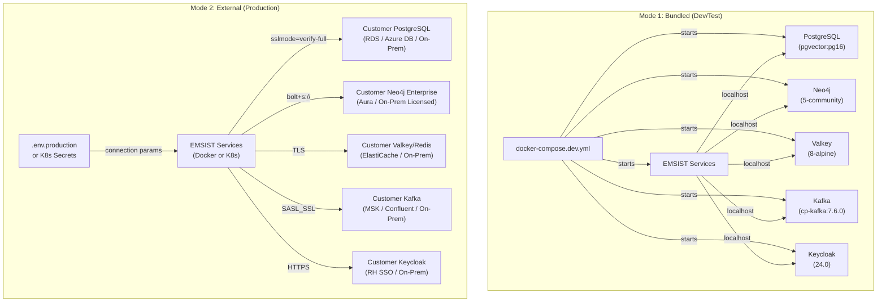
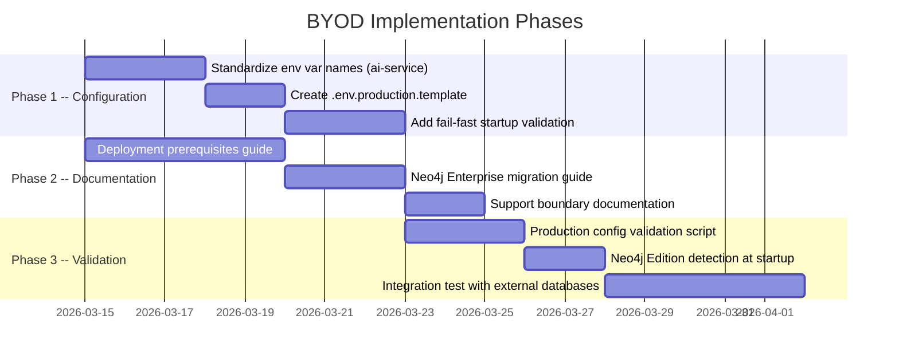

# ADR-021: On-Premise Licensed Software Requirements

**Status:** Proposed
**Date:** 2026-03-03
**Decision Makers:** Architecture Review Board, CTO
**Author:** ARCH Agent

## Context

EMSIST is an **on-premise enterprise application** (per ADR-015) deployed at customer sites. Customers install EMSIST on their own infrastructure, which fundamentally determines how infrastructure components are licensed, configured, and operated.

### Current Development Stack (Verified Against Docker Compose)

The development and staging Docker Compose configurations use community/free editions of all data stores. This is appropriate for development but must be evaluated for production on-premise deployments.

| Component | Image | Source | License |
|-----------|-------|--------|---------|
| PostgreSQL | `pgvector/pgvector:pg16` | `/docker-compose.dev.yml` line 29 | PostgreSQL License (OSS, free) |
| Neo4j | `neo4j:5-community` | `/docker-compose.dev.yml` line 68 | GPLv3 (Community, free) |
| Valkey | `valkey/valkey:8-alpine` | `/docker-compose.dev.yml` line 99 | BSD-3-Clause (OSS, free) |
| Kafka | `confluentinc/cp-kafka:7.6.0` | `/docker-compose.dev.yml` line 119 | Apache 2.0 (Community, free) |
| Keycloak | `quay.io/keycloak/keycloak:24.0` | `/docker-compose.dev.yml` line 152 | Apache 2.0 (Community, free) |
| Frontend | Angular static assets (nginx in staging) | `/docker-compose.staging.yml` line 478 | N/A (EMSIST owns the code) |

### Why This Decision Is Needed

1. **Neo4j Community Edition lacks production-critical features.** Community Edition does not support native encryption at rest, causal clustering for HA, fine-grained role-based access control (RBAC), LDAP/AD integration, or vendor-backed commercial support. ADR-019 identified this gap: Neo4j Community has no native encryption at rest, and the LUKS/FileVault workaround (volume-level encryption) is the only option without Enterprise.

2. **On-premise customers require production-grade databases.** Enterprise customers deploying EMSIST on their own infrastructure expect database-level HA (clustering/replication), native encryption, enterprise security integration (LDAP), and commercial SLA support from database vendors.

3. **EMSIST must not bundle commercial database software.** Distributing Neo4j Enterprise (or any commercially licensed database) would impose licensing liability on EMSIST. Instead, customers must provide their own database instances and licenses.

4. **Configuration must support both bundled and external databases.** Development environments use Docker Compose with bundled community images. Production environments connect to customer-provided database servers via externalized configuration.

### What EMSIST Provides vs. What Customers Provide

EMSIST is a software application, not an infrastructure platform. The distinction between what EMSIST provides and what customers must supply is critical for licensing, support boundaries, and deployment documentation.

## Decision Drivers

* **Licensing liability** -- EMSIST must not redistribute commercially licensed software
* **Production readiness** -- On-premise enterprise deployments require encryption, HA, and support
* **Customer autonomy** -- Customers choose their own database editions, cloud providers, and managed services
* **Configuration flexibility** -- Same application binaries must connect to both bundled (dev) and external (production) databases
* **Compliance requirements** -- SOC 2, ISO 27001, GDPR Article 32 require encryption at rest, which Neo4j Community cannot provide natively

## Considered Alternatives

### Option 1: Bundle Neo4j Enterprise in Docker Compose

Distribute Neo4j Enterprise Edition images in the Docker Compose configuration.

**Pros:** Turnkey production setup. No customer configuration required for Neo4j features.
**Cons:** Neo4j Enterprise requires a commercial license (~$90K+/year for clustering). EMSIST would need to embed or redistribute the license, creating licensing liability. Violates the principle that EMSIST should not bundle third-party commercial software.

### Option 2: Replace Neo4j Entirely with PostgreSQL

Migrate auth-facade from Neo4j to PostgreSQL using recursive CTEs for RBAC graph traversal.

**Pros:** Single database technology. No commercial licensing requirement. PostgreSQL Community is production-grade.
**Cons:** Recursive CTEs perform poorly for deep graph traversals. ADR-016 specifically chose Neo4j for the identity/RBAC graph because of its native traversal capabilities. Migration would require rewriting all Cypher queries, Neo4j SDN entities, and graph-based RBAC resolution. This contradicts the polyglot persistence decision.

### Option 3: Bring Your Own Database (BYOD) Model (SELECTED)

EMSIST provides application code, configuration templates, migration scripts, and deployment documentation. Customers provide their own database servers (community or enterprise editions) and are responsible for database licensing, hosting, backup, and HA configuration.

**Pros:** Zero licensing liability for EMSIST. Customers choose editions that match their requirements and budget. Same application code works with both community (dev) and enterprise (production) editions. Customers can use managed database services (AWS RDS, Azure Database, GCP Cloud SQL, Neo4j Aura).
**Cons:** Requires clear deployment documentation. Customers must configure their own databases. EMSIST support boundary must be clearly defined (application vs. infrastructure).

## Decision

Adopt **Option 3: Bring Your Own Database (BYOD) model**. EMSIST classifies each infrastructure component by licensing requirement and provides configuration templates for external database connectivity. [PLANNED]

### Component Licensing Classification

| Component | Dev/Test Edition | Production Recommendation | License Type | Customer Provides | EMSIST Provides |
|-----------|-----------------|---------------------------|--------------|-------------------|-----------------|
| **PostgreSQL 16+** | Community (`pgvector/pgvector:pg16`) | Community (free, OSS) -- production-grade as-is | PostgreSQL License (OSS) | DB server instance or managed PostgreSQL (RDS, Azure Database, Cloud SQL) | `init-db.sql`, Flyway migrations, JDBC config template, `sslmode=verify-full` connection strings |
| **Neo4j** | Community (`neo4j:5-community`) | **Enterprise (licensed)** -- required for native encryption, clustering, RBAC, LDAP | GPLv3 (Community) / Commercial (Enterprise) | Neo4j Enterprise license + server, or Neo4j Aura (managed) | Cypher migrations, Spring Data Neo4j config template, `bolt+s://` connection strings |
| **Valkey 8** | Community (`valkey/valkey:8-alpine`) | Community (free, OSS) -- production-grade as-is | BSD-3-Clause (OSS) | Valkey or Redis-compatible server | Spring Data Redis config template, TLS connection parameters |
| **Apache Kafka** | Community (`confluentinc/cp-kafka:7.6.0`) | Community (free, OSS) -- production-grade with multi-broker setup | Apache 2.0 (OSS) | Kafka cluster (self-managed or Confluent Cloud, AWS MSK, Azure Event Hubs) | Producer/consumer config templates, topic definitions, SASL_SSL connection parameters |
| **Keycloak 24** | Community (`quay.io/keycloak/keycloak:24.0`) | Community (free, OSS) or Red Hat SSO (commercial alternative) | Apache 2.0 (OSS) | Keycloak server or Red Hat SSO instance | Realm export JSON, client configuration, redirect URI templates |
| **Frontend (nginx)** | Node dev server / nginx | nginx (free, OSS) or any static file server | BSD-2-Clause (nginx) | Web server / reverse proxy / CDN | Built Angular static assets (`dist/`), nginx config template |

### Why Neo4j Enterprise Is Required for Production

Neo4j is the only component where the Community Edition is insufficient for production on-premise deployments. The following table details the gap:

| Capability | Neo4j Community | Neo4j Enterprise | Production Impact |
|-----------|----------------|-------------------|-------------------|
| **Encryption at rest** | Not supported | Native, per-database encryption with key management | Required for SOC 2 / ISO 27001 / GDPR compliance. Without Enterprise, the only option is LUKS/FileVault host-level encryption (ADR-019 Tier 1). |
| **Causal clustering** | Not supported (single instance only) | 3+ node cluster with automatic leader election and read replicas | Required for HA. Without clustering, Neo4j is a single point of failure for the entire auth-facade service. |
| **Fine-grained RBAC** | Basic authentication only | Role-based access control with custom roles and sub-graph access | Required for multi-tenant data isolation within the identity graph. |
| **LDAP/AD integration** | Not supported | Native LDAP and Active Directory authentication | Enterprise customers require AD integration for database admin access. |
| **Hot backup** | `neo4j-admin dump` (offline) | Online backup without downtime | Required for zero-downtime backup strategy (ADR-018). |
| **Commercial SLA** | Community forum support | 24/7 vendor-backed support with SLA | Enterprise customers require vendor support for production databases. |
| **Approximate cost** | Free | ~$90K+/year (contact Neo4j sales for on-premise pricing) | Significant cost; must be documented in deployment prerequisites. |

### Configuration Architecture -- Two Deployment Modes [PLANNED]

The EMSIST application must support two configuration modes without code changes. All connection parameters are externalized through environment variables with sensible defaults for development.



### Production Configuration Template (`.env.production`) [PLANNED]

EMSIST will provide a documented `.env.production.template` file that customers copy and populate with their infrastructure connection details. This file is referenced by Docker Compose or Kubernetes Secrets.

```
# ==============================================================================
# EMSIST Production Environment Configuration Template
# Copy to .env.production and fill in customer-specific values.
# All values are REQUIRED unless marked (optional).
# ==============================================================================

# --- PostgreSQL (customer-provided) ---
POSTGRES_HOST=db.customer-internal.com
POSTGRES_PORT=5432
POSTGRES_DB=master_db
DATABASE_USER=ems_app
DATABASE_PASSWORD=<customer-managed-password>
POSTGRES_SSLMODE=verify-full
POSTGRES_SSLCERT=/etc/certs/pg-client.crt
POSTGRES_SSLKEY=/etc/certs/pg-client.key
POSTGRES_SSLROOTCERT=/etc/certs/pg-ca.crt

# --- Neo4j Enterprise (customer-provided, licensed) ---
NEO4J_URI=bolt+s://neo4j.customer-internal.com:7687
NEO4J_AUTH=neo4j/<customer-managed-password>
NEO4J_ENCRYPTION=true

# --- Valkey / Redis (customer-provided) ---
VALKEY_HOST=cache.customer-internal.com
VALKEY_PORT=6379
VALKEY_PASSWORD=<customer-managed-password>
VALKEY_TLS_ENABLED=true

# --- Kafka (customer-provided) ---
KAFKA_BOOTSTRAP_SERVERS=kafka.customer-internal.com:9093
KAFKA_SECURITY_PROTOCOL=SASL_SSL
KAFKA_SASL_MECHANISM=SCRAM-SHA-512
KAFKA_SASL_USERNAME=ems_producer
KAFKA_SASL_PASSWORD=<customer-managed-password>

# --- Keycloak (customer-provided) ---
KEYCLOAK_URL=https://sso.customer-internal.com
KEYCLOAK_ADMIN=admin
KEYCLOAK_ADMIN_PASSWORD=<customer-managed-password>

# --- Jasypt Configuration Encryption (ADR-019) ---
JASYPT_PASSWORD=<customer-generated-master-encryption-key>
```

### Spring Boot Configuration Externalization [PLANNED]

Each service's `application.yml` already uses `${ENV_VAR:default}` syntax for database connection parameters. The current defaults target the bundled Docker Compose development environment. Production deployments override these via the `.env.production` file.

**Current evidence** (verified against source code):

| Service | Config File | Current JDBC URL Pattern | Evidence |
|---------|------------|--------------------------|----------|
| tenant-service | `application.yml` line 9 | `jdbc:postgresql://${DATABASE_HOST:localhost}:${DATABASE_PORT:5432}/${DATABASE_NAME:master_db}` | Externalized via env vars |
| user-service | `application.yml` line 9 | Same pattern with `user_db` | Externalized via env vars |
| license-service | `application.yml` line 9 | Same pattern with `license_db` | Externalized via env vars |
| notification-service | `application.yml` line 9 | Same pattern with `notification_db` | Externalized via env vars |
| audit-service | `application.yml` line 9 | Same pattern with `audit_db` | Externalized via env vars |
| ai-service | `application.yml` line 9 | `jdbc:postgresql://${DB_HOST:localhost}:${DB_PORT:5432}/${DB_NAME:ems}` | Externalized (different var names) |
| auth-facade | `application.yml` line 28 | `${NEO4J_URI:bolt://localhost:7687}` | Externalized via env var |

**What remains [PLANNED]:**
- Create `.env.production.template` file with all required variables documented
- Standardize environment variable names across services (ai-service uses different naming: `DB_HOST` vs `DATABASE_HOST`)
- Add startup validation (fail-fast if required external connection parameters are missing)
- Add connection health check at startup (verify external databases are reachable before accepting traffic)
- Document supported database versions and minimum requirements

### Support Boundary [PLANNED]

| Layer | EMSIST Responsibility | Customer Responsibility |
|-------|----------------------|------------------------|
| **Application code** | Full support (bug fixes, updates, patches) | Report issues |
| **Configuration templates** | Provide and maintain templates, document required parameters | Populate with site-specific values |
| **Database migrations** | Provide Flyway scripts (`init-db.sql`, `V*.sql`), ensure forward compatibility | Execute migrations, manage backup before migration |
| **Database server** | N/A -- EMSIST does not host databases | Install, license, configure, back up, patch, monitor |
| **Database HA/clustering** | Document requirements (e.g., "Neo4j Enterprise required for clustering") | Configure clustering, manage failover |
| **TLS certificates** | Document requirements, provide connection string patterns | Generate, deploy, rotate certificates |
| **Operating system** | Document minimum OS requirements | Install, patch, secure the host OS |

### Arc42 Impact

This ADR affects the following arc42 sections:

| Arc42 Section | Impact | Details |
|---------------|--------|---------|
| `04-solution-strategy.md` | New subsection | Add "Deployment Modes" subsection documenting BYOD configuration architecture |
| `05-building-blocks.md` | Reference | Note Neo4j Enterprise requirement in data layer description |
| `07-deployment-view.md` | New subsection | Add production deployment mode with externalized database connections |
| `09-architecture-decisions.md` | Index update | Add ADR-021 to Section 9.1 and Section 9.3 tables |

## Consequences

### Positive

* **Zero licensing liability** -- EMSIST distributes only its own application code. Customers procure and manage their own database licenses. This avoids legal complexity of embedding commercial licenses.
* **Production-grade databases** -- Customers get native encryption at rest, clustering for HA, enterprise security (LDAP/RBAC), and commercial SLA support by using enterprise editions.
* **Managed service compatibility** -- Customers can use cloud-managed databases (AWS RDS, Neo4j Aura, AWS ElastiCache, AWS MSK) instead of self-hosting, reducing their operational burden.
* **Configuration already partially externalized** -- All services already use `${ENV_VAR:default}` patterns in `application.yml`, so the application code changes required are minimal (primarily standardizing variable names and adding fail-fast validation).
* **Clear support boundary** -- Separating application support from infrastructure support sets realistic expectations and reduces support scope for the EMSIST team.

### Negative

* **Neo4j Enterprise cost is significant** -- At ~$90K+/year for clustering, this is a material cost that customers must budget. For smaller deployments that do not need clustering, a single Neo4j Enterprise instance (lower cost) with LUKS volume encryption (ADR-019 Tier 1) may suffice.
* **Deployment complexity** -- Customers must configure their own database servers, TLS certificates, and connection parameters before EMSIST can start. This requires deployment documentation and potentially professional services engagement.
* **Environment variable standardization needed** -- ai-service currently uses different variable names (`DB_HOST`, `DB_PORT`, `DB_NAME`, `DB_USERNAME`) compared to all other services (`DATABASE_HOST`, `DATABASE_PORT`, `DATABASE_NAME`, `DATABASE_USER`). This must be standardized before production deployment.
* **Startup validation not yet implemented** -- Services currently start even if database connections fail (they fail at first query, not at startup). Fail-fast validation must be added.

### Risks

| Risk | Likelihood | Impact | Mitigation |
|------|------------|--------|------------|
| Customer uses Neo4j Community in production (skipping Enterprise) | High | HIGH -- no encryption at rest, no clustering, limited to LUKS workaround | Document clearly in deployment prerequisites; add startup warning log if Neo4j Community detected in non-dev profile |
| Customer misconfigures TLS certificates | Medium | MEDIUM -- connection failures, potential plaintext fallback | Provide `scripts/validate-production-config.sh` that tests all connections with TLS before deployment |
| Environment variable naming inconsistency causes deployment failures | Medium | MEDIUM -- ai-service uses different variable names | Standardize variable names in Phase 1 implementation |
| Customer expects EMSIST team to support database infrastructure | Medium | LOW -- support scope mismatch | Document support boundary clearly; include in customer deployment agreement |
| Neo4j Enterprise licensing cost causes customer to seek alternatives | Low | LOW -- alternative is PostgreSQL recursive CTEs (rejected in ADR-016) | Document cost upfront; offer single-instance Enterprise (lower cost) as minimum viable option |

## Implementation Priority [PLANNED]



## Related Decisions

- **Depends on:** ADR-015 (On-premise deployment model -- establishes that EMSIST is on-premise software)
- **Related to:** ADR-016 (Polyglot persistence -- defines which services use PostgreSQL vs Neo4j; this ADR inherits that assignment)
- **Related to:** ADR-019 (Encryption at rest -- LUKS/FileVault is the fallback when Neo4j Enterprise is not available; Neo4j Enterprise provides native encryption)
- **Related to:** ADR-020 (Service credential management -- per-service PostgreSQL users apply to both bundled and external database modes)
- **Related to:** ADR-018 (High availability -- Neo4j clustering requires Enterprise; PostgreSQL replication uses Community streaming replication)
- **Arc42 Sections:** 04-solution-strategy.md, 05-building-blocks.md, 07-deployment-view.md, 09-architecture-decisions.md

## Implementation Evidence

Status: **Proposed** -- No BYOD configuration implementation exists yet.

**What exists today (verified):**
- Environment variable externalization in `application.yml` for all 8 services (partial -- naming is inconsistent for ai-service)
- `init-db.sql` at `/infrastructure/docker/init-db.sql` creates databases and seed data for bundled mode
- Flyway migrations exist for all PostgreSQL services (e.g., `/backend/tenant-service/src/main/resources/db/migration/`)
- Docker Compose files for dev and staging at `/docker-compose.dev.yml` and `/docker-compose.staging.yml`

**What does NOT exist yet:**
- `.env.production.template` file
- Standardized environment variable names across all services
- Fail-fast startup validation for missing connection parameters
- Neo4j Edition detection at startup
- Production deployment documentation
- Configuration validation script (`scripts/validate-production-config.sh`)
- Support boundary documentation

## References

- [Neo4j Edition Comparison](https://neo4j.com/pricing/) -- Community vs Enterprise feature matrix
- [Neo4j Aura (Managed Service)](https://neo4j.com/cloud/aura/) -- Cloud-managed Neo4j option for customers
- [PostgreSQL License](https://www.postgresql.org/about/licence/) -- Liberal OSS license, no commercial restrictions
- [Valkey License (BSD-3)](https://github.com/valkey-io/valkey/blob/unstable/LICENSE) -- Fork of Redis under BSD license
- [Keycloak License (Apache 2.0)](https://www.keycloak.org/) -- Free and open source
- [ADR-015: On-Premise License Architecture](./ADR-015-on-premise-license-architecture.md)
- [ADR-016: Polyglot Persistence](./ADR-016-polyglot-persistence.md)
- [ADR-019: Encryption at Rest Strategy](./ADR-019-encryption-at-rest.md)
