# Technical Low-Level Design: AI Agent Platform

**Document:** 05-Technical-LLD.md
**Version:** 1.0.0
**Date:** 2026-03-06
**Status:** [PLANNED] -- Design baseline; no code exists yet
**Author:** SA Agent
**Cross-References:** 01-PRD Section 2-3, 02-Tech-Spec Sections 2-9, 03-Epics US-1 through US-13

---

## Table of Contents

1. [Maven Multi-Project Configuration](#1-maven-multi-project-configuration)
2. [Application Configuration Files](#2-application-configuration-files)
3. [Database Schema Design](#3-database-schema-design)
4. [API Contracts (OpenAPI 3.1)](#4-api-contracts-openapi-31)
5. [Inter-Service Communication](#5-inter-service-communication)
6. [Security Architecture](#6-security-architecture)
7. [Data Flow Diagrams](#7-data-flow-diagrams)
8. [Class Diagrams](#8-class-diagrams)

---

## 1. Maven Multi-Project Configuration

**Status:** [PLANNED]
**Cross-Reference:** 02-Tech-Spec Section 2, 04-Git-Structure Section 1

The platform uses a Maven multi-module build with a parent POM providing centralized dependency management. The project structure follows the repository layout defined in the Git Structure guide, with four top-level module groups: `infrastructure`, `libraries`, `agents`, and `learning`.

### 1.1 Root POM (pom.xml)

```xml
<?xml version="1.0" encoding="UTF-8"?>
<project xmlns="http://maven.apache.org/POM/4.0.0"
         xmlns:xsi="http://www.w3.org/2001/XMLSchema-instance"
         xsi:schemaLocation="http://maven.apache.org/POM/4.0.0
         https://maven.apache.org/xsd/maven-4.0.0.xsd">
    <modelVersion>4.0.0</modelVersion>

    <parent>
        <groupId>org.springframework.boot</groupId>
        <artifactId>spring-boot-starter-parent</artifactId>
        <version>3.4.1</version>
        <relativePath/>
    </parent>

    <groupId>com.emsist.ai</groupId>
    <artifactId>agent-platform</artifactId>
    <version>1.0.0-SNAPSHOT</version>
    <packaging>pom</packaging>
    <name>AI Agent Platform</name>
    <description>Multi-agent AI platform with local LLM inference and continuous learning</description>

    <modules>
        <!-- Infrastructure Services -->
        <module>infrastructure/eureka-server</module>
        <module>infrastructure/config-server</module>
        <module>infrastructure/api-gateway</module>

        <!-- Shared Libraries -->
        <module>libraries/agent-common</module>

        <!-- Agent Microservices -->
        <module>agents/agent-orchestrator</module>
        <module>agents/agent-data-analyst</module>
        <module>agents/agent-customer-support</module>
        <module>agents/agent-code-reviewer</module>
        <module>agents/agent-document-processor</module>

        <!-- Learning Pipeline Services -->
        <module>learning/trace-collector</module>
        <module>learning/feedback-service</module>
        <module>learning/teacher-service</module>
        <module>learning/training-data-service</module>
        <module>learning/training-orchestrator</module>
        <module>learning/model-evaluator</module>
    </modules>

    <properties>
        <!-- Java -->
        <java.version>21</java.version>
        <maven.compiler.source>21</maven.compiler.source>
        <maven.compiler.target>21</maven.compiler.target>
        <project.build.sourceEncoding>UTF-8</project.build.sourceEncoding>

        <!-- Spring -->
        <spring-boot.version>3.4.1</spring-boot.version>
        <spring-cloud.version>2024.0.0</spring-cloud.version>
        <spring-ai.version>1.0.0</spring-ai.version>

        <!-- Database -->
        <postgresql.version>42.7.4</postgresql.version>
        <flyway.version>10.21.0</flyway.version>
        <pgvector-java.version>0.1.6</pgvector-java.version>

        <!-- Messaging -->
        <kafka.version>3.7.1</kafka.version>

        <!-- Observability -->
        <micrometer.version>1.14.2</micrometer.version>
        <opentelemetry.version>1.44.1</opentelemetry.version>

        <!-- Utilities -->
        <lombok.version>1.18.34</lombok.version>
        <mapstruct.version>1.6.3</mapstruct.version>

        <!-- Testing -->
        <testcontainers.version>1.20.4</testcontainers.version>
        <archunit.version>1.3.0</archunit.version>
    </properties>

    <dependencyManagement>
        <dependencies>
            <!-- Spring Cloud BOM -->
            <dependency>
                <groupId>org.springframework.cloud</groupId>
                <artifactId>spring-cloud-dependencies</artifactId>
                <version>${spring-cloud.version}</version>
                <type>pom</type>
                <scope>import</scope>
            </dependency>

            <!-- Spring AI BOM -->
            <dependency>
                <groupId>org.springframework.ai</groupId>
                <artifactId>spring-ai-bom</artifactId>
                <version>${spring-ai.version}</version>
                <type>pom</type>
                <scope>import</scope>
            </dependency>

            <!-- Internal library -->
            <dependency>
                <groupId>com.emsist.ai</groupId>
                <artifactId>agent-common</artifactId>
                <version>${project.version}</version>
            </dependency>

            <!-- PGVector -->
            <dependency>
                <groupId>com.pgvector</groupId>
                <artifactId>pgvector</artifactId>
                <version>${pgvector-java.version}</version>
            </dependency>

            <!-- Testcontainers BOM -->
            <dependency>
                <groupId>org.testcontainers</groupId>
                <artifactId>testcontainers-bom</artifactId>
                <version>${testcontainers.version}</version>
                <type>pom</type>
                <scope>import</scope>
            </dependency>
        </dependencies>
    </dependencyManagement>

    <!-- Common dependencies for ALL modules -->
    <dependencies>
        <dependency>
            <groupId>org.projectlombok</groupId>
            <artifactId>lombok</artifactId>
            <optional>true</optional>
        </dependency>
        <dependency>
            <groupId>org.springframework.boot</groupId>
            <artifactId>spring-boot-starter-test</artifactId>
            <scope>test</scope>
        </dependency>
    </dependencies>

    <build>
        <pluginManagement>
            <plugins>
                <plugin>
                    <groupId>org.springframework.boot</groupId>
                    <artifactId>spring-boot-maven-plugin</artifactId>
                    <configuration>
                        <excludes>
                            <exclude>
                                <groupId>org.projectlombok</groupId>
                                <artifactId>lombok</artifactId>
                            </exclude>
                        </excludes>
                        <image>
                            <name>emsist/${project.artifactId}:${project.version}</name>
                        </image>
                    </configuration>
                </plugin>
                <plugin>
                    <groupId>org.flywaydb</groupId>
                    <artifactId>flyway-maven-plugin</artifactId>
                    <version>${flyway.version}</version>
                </plugin>
            </plugins>
        </pluginManagement>
    </build>

    <profiles>
        <!-- Development profile (default) -->
        <profile>
            <id>dev</id>
            <activation>
                <activeByDefault>true</activeByDefault>
            </activation>
            <properties>
                <spring.profiles.active>dev</spring.profiles.active>
            </properties>
        </profile>

        <!-- Staging profile -->
        <profile>
            <id>staging</id>
            <properties>
                <spring.profiles.active>staging</spring.profiles.active>
            </properties>
        </profile>

        <!-- Production profile -->
        <profile>
            <id>prod</id>
            <properties>
                <spring.profiles.active>prod</spring.profiles.active>
            </properties>
            <build>
                <plugins>
                    <plugin>
                        <groupId>org.springframework.boot</groupId>
                        <artifactId>spring-boot-maven-plugin</artifactId>
                        <executions>
                            <execution>
                                <goals>
                                    <goal>build-image</goal>
                                </goals>
                            </execution>
                        </executions>
                    </plugin>
                </plugins>
            </build>
        </profile>

        <!-- Integration test profile -->
        <profile>
            <id>integration</id>
            <build>
                <plugins>
                    <plugin>
                        <groupId>org.apache.maven.plugins</groupId>
                        <artifactId>maven-failsafe-plugin</artifactId>
                        <executions>
                            <execution>
                                <goals>
                                    <goal>integration-test</goal>
                                    <goal>verify</goal>
                                </goals>
                            </execution>
                        </executions>
                    </plugin>
                </plugins>
            </build>
        </profile>
    </profiles>
</project>
```

### 1.2 Per-Module Dependencies

#### 1.2.1 libraries/agent-common (pom.xml)

Shared library consumed by all agent and learning services.

```xml
<project>
    <parent>
        <groupId>com.emsist.ai</groupId>
        <artifactId>agent-platform</artifactId>
        <version>1.0.0-SNAPSHOT</version>
        <relativePath>../../pom.xml</relativePath>
    </parent>

    <artifactId>agent-common</artifactId>
    <name>Agent Common Library</name>
    <description>Base agent framework, pipeline, tools, skills, tracing</description>

    <!-- Library JAR, not a Spring Boot app -->
    <packaging>jar</packaging>

    <dependencies>
        <!-- Spring Boot core (auto-configuration, DI) -->
        <dependency>
            <groupId>org.springframework.boot</groupId>
            <artifactId>spring-boot-starter</artifactId>
        </dependency>

        <!-- Spring AI - Ollama -->
        <dependency>
            <groupId>org.springframework.ai</groupId>
            <artifactId>spring-ai-ollama-spring-boot-starter</artifactId>
        </dependency>

        <!-- Spring AI - Anthropic (Claude teacher/fallback) -->
        <dependency>
            <groupId>org.springframework.ai</groupId>
            <artifactId>spring-ai-anthropic-spring-boot-starter</artifactId>
        </dependency>

        <!-- Spring AI - OpenAI (Codex teacher/fallback) -->
        <dependency>
            <groupId>org.springframework.ai</groupId>
            <artifactId>spring-ai-openai-spring-boot-starter</artifactId>
        </dependency>

        <!-- Spring AI - PGVector store -->
        <dependency>
            <groupId>org.springframework.ai</groupId>
            <artifactId>spring-ai-pgvector-store-spring-boot-starter</artifactId>
        </dependency>

        <!-- Spring Data JPA (SkillDefinition, TenantProfile entities) -->
        <dependency>
            <groupId>org.springframework.boot</groupId>
            <artifactId>spring-boot-starter-data-jpa</artifactId>
        </dependency>

        <!-- Kafka (trace publishing) -->
        <dependency>
            <groupId>org.springframework.kafka</groupId>
            <artifactId>spring-kafka</artifactId>
        </dependency>

        <!-- Resilience4j (circuit breakers for tool execution) -->
        <dependency>
            <groupId>org.springframework.cloud</groupId>
            <artifactId>spring-cloud-starter-circuitbreaker-resilience4j</artifactId>
        </dependency>

        <!-- Eureka client (service discovery) -->
        <dependency>
            <groupId>org.springframework.cloud</groupId>
            <artifactId>spring-cloud-starter-netflix-eureka-client</artifactId>
        </dependency>

        <!-- Spring Cloud Config client -->
        <dependency>
            <groupId>org.springframework.cloud</groupId>
            <artifactId>spring-cloud-starter-config</artifactId>
        </dependency>

        <!-- Observability -->
        <dependency>
            <groupId>org.springframework.boot</groupId>
            <artifactId>spring-boot-starter-actuator</artifactId>
        </dependency>
        <dependency>
            <groupId>io.micrometer</groupId>
            <artifactId>micrometer-tracing-bridge-otel</artifactId>
        </dependency>

        <!-- Validation -->
        <dependency>
            <groupId>org.springframework.boot</groupId>
            <artifactId>spring-boot-starter-validation</artifactId>
        </dependency>

        <!-- Jackson (JSON serialization) -->
        <dependency>
            <groupId>com.fasterxml.jackson.core</groupId>
            <artifactId>jackson-databind</artifactId>
        </dependency>
        <dependency>
            <groupId>com.fasterxml.jackson.datatype</groupId>
            <artifactId>jackson-datatype-jsr310</artifactId>
        </dependency>
    </dependencies>
</project>
```

#### 1.2.2 agents/agent-orchestrator (pom.xml)

```xml
<project>
    <parent>
        <groupId>com.emsist.ai</groupId>
        <artifactId>agent-platform</artifactId>
        <version>1.0.0-SNAPSHOT</version>
        <relativePath>../../pom.xml</relativePath>
    </parent>

    <artifactId>agent-orchestrator</artifactId>
    <name>Agent Orchestrator</name>
    <description>Task routing, coordination, 7-step pipeline host</description>

    <dependencies>
        <dependency>
            <groupId>com.emsist.ai</groupId>
            <artifactId>agent-common</artifactId>
        </dependency>
        <dependency>
            <groupId>org.springframework.boot</groupId>
            <artifactId>spring-boot-starter-web</artifactId>
        </dependency>
        <dependency>
            <groupId>org.springframework.boot</groupId>
            <artifactId>spring-boot-starter-data-jpa</artifactId>
        </dependency>
        <dependency>
            <groupId>org.postgresql</groupId>
            <artifactId>postgresql</artifactId>
            <scope>runtime</scope>
        </dependency>
        <dependency>
            <groupId>org.flywaydb</groupId>
            <artifactId>flyway-core</artifactId>
        </dependency>
        <dependency>
            <groupId>org.flywaydb</groupId>
            <artifactId>flyway-database-postgresql</artifactId>
        </dependency>
        <dependency>
            <groupId>org.springframework.boot</groupId>
            <artifactId>spring-boot-starter-data-redis</artifactId>
        </dependency>
        <dependency>
            <groupId>org.springframework.boot</groupId>
            <artifactId>spring-boot-starter-security</artifactId>
        </dependency>
        <dependency>
            <groupId>org.springframework.boot</groupId>
            <artifactId>spring-boot-starter-oauth2-resource-server</artifactId>
        </dependency>

        <!-- Test -->
        <dependency>
            <groupId>org.testcontainers</groupId>
            <artifactId>postgresql</artifactId>
            <scope>test</scope>
        </dependency>
        <dependency>
            <groupId>org.testcontainers</groupId>
            <artifactId>kafka</artifactId>
            <scope>test</scope>
        </dependency>
    </dependencies>

    <build>
        <plugins>
            <plugin>
                <groupId>org.springframework.boot</groupId>
                <artifactId>spring-boot-maven-plugin</artifactId>
            </plugin>
        </plugins>
    </build>
</project>
```

#### 1.2.3 Specialist Agent POMs (agent-data-analyst, agent-customer-support, agent-code-reviewer, agent-document-processor)

All specialist agents share the same dependency pattern. They differ only in `artifactId` and `name`.

```xml
<project>
    <parent>
        <groupId>com.emsist.ai</groupId>
        <artifactId>agent-platform</artifactId>
        <version>1.0.0-SNAPSHOT</version>
        <relativePath>../../pom.xml</relativePath>
    </parent>

    <artifactId>agent-data-analyst</artifactId>
    <!-- Or: agent-customer-support, agent-code-reviewer, agent-document-processor -->
    <name>Agent Data Analyst</name>

    <dependencies>
        <dependency>
            <groupId>com.emsist.ai</groupId>
            <artifactId>agent-common</artifactId>
        </dependency>
        <dependency>
            <groupId>org.springframework.boot</groupId>
            <artifactId>spring-boot-starter-web</artifactId>
        </dependency>
        <dependency>
            <groupId>org.springframework.boot</groupId>
            <artifactId>spring-boot-starter-data-jpa</artifactId>
        </dependency>
        <dependency>
            <groupId>org.postgresql</groupId>
            <artifactId>postgresql</artifactId>
            <scope>runtime</scope>
        </dependency>
        <dependency>
            <groupId>org.flywaydb</groupId>
            <artifactId>flyway-core</artifactId>
        </dependency>
        <dependency>
            <groupId>org.flywaydb</groupId>
            <artifactId>flyway-database-postgresql</artifactId>
        </dependency>
        <dependency>
            <groupId>org.springframework.boot</groupId>
            <artifactId>spring-boot-starter-security</artifactId>
        </dependency>
        <dependency>
            <groupId>org.springframework.boot</groupId>
            <artifactId>spring-boot-starter-oauth2-resource-server</artifactId>
        </dependency>

        <!-- Test -->
        <dependency>
            <groupId>org.testcontainers</groupId>
            <artifactId>postgresql</artifactId>
            <scope>test</scope>
        </dependency>
    </dependencies>

    <build>
        <plugins>
            <plugin>
                <groupId>org.springframework.boot</groupId>
                <artifactId>spring-boot-maven-plugin</artifactId>
            </plugin>
        </plugins>
    </build>
</project>
```

#### 1.2.4 learning/trace-collector (pom.xml)

```xml
<project>
    <parent>
        <groupId>com.emsist.ai</groupId>
        <artifactId>agent-platform</artifactId>
        <version>1.0.0-SNAPSHOT</version>
        <relativePath>../../pom.xml</relativePath>
    </parent>

    <artifactId>trace-collector</artifactId>
    <name>Trace Collector Service</name>
    <description>Kafka consumer that persists agent execution traces</description>

    <dependencies>
        <dependency>
            <groupId>com.emsist.ai</groupId>
            <artifactId>agent-common</artifactId>
        </dependency>
        <dependency>
            <groupId>org.springframework.boot</groupId>
            <artifactId>spring-boot-starter-web</artifactId>
        </dependency>
        <dependency>
            <groupId>org.springframework.boot</groupId>
            <artifactId>spring-boot-starter-data-jpa</artifactId>
        </dependency>
        <dependency>
            <groupId>org.postgresql</groupId>
            <artifactId>postgresql</artifactId>
            <scope>runtime</scope>
        </dependency>
        <dependency>
            <groupId>org.flywaydb</groupId>
            <artifactId>flyway-core</artifactId>
        </dependency>
        <dependency>
            <groupId>org.flywaydb</groupId>
            <artifactId>flyway-database-postgresql</artifactId>
        </dependency>
        <dependency>
            <groupId>org.springframework.kafka</groupId>
            <artifactId>spring-kafka</artifactId>
        </dependency>

        <!-- Test -->
        <dependency>
            <groupId>org.testcontainers</groupId>
            <artifactId>postgresql</artifactId>
            <scope>test</scope>
        </dependency>
        <dependency>
            <groupId>org.testcontainers</groupId>
            <artifactId>kafka</artifactId>
            <scope>test</scope>
        </dependency>
        <dependency>
            <groupId>org.springframework.kafka</groupId>
            <artifactId>spring-kafka-test</artifactId>
            <scope>test</scope>
        </dependency>
    </dependencies>

    <build>
        <plugins>
            <plugin>
                <groupId>org.springframework.boot</groupId>
                <artifactId>spring-boot-maven-plugin</artifactId>
            </plugin>
        </plugins>
    </build>
</project>
```

#### 1.2.5 learning/feedback-service (pom.xml)

```xml
<project>
    <parent>
        <groupId>com.emsist.ai</groupId>
        <artifactId>agent-platform</artifactId>
        <version>1.0.0-SNAPSHOT</version>
        <relativePath>../../pom.xml</relativePath>
    </parent>

    <artifactId>feedback-service</artifactId>
    <name>Feedback Service</name>
    <description>Ingests user ratings, corrections, and customer feedback</description>

    <dependencies>
        <dependency>
            <groupId>com.emsist.ai</groupId>
            <artifactId>agent-common</artifactId>
        </dependency>
        <dependency>
            <groupId>org.springframework.boot</groupId>
            <artifactId>spring-boot-starter-web</artifactId>
        </dependency>
        <dependency>
            <groupId>org.springframework.boot</groupId>
            <artifactId>spring-boot-starter-data-jpa</artifactId>
        </dependency>
        <dependency>
            <groupId>org.postgresql</groupId>
            <artifactId>postgresql</artifactId>
            <scope>runtime</scope>
        </dependency>
        <dependency>
            <groupId>org.flywaydb</groupId>
            <artifactId>flyway-core</artifactId>
        </dependency>
        <dependency>
            <groupId>org.flywaydb</groupId>
            <artifactId>flyway-database-postgresql</artifactId>
        </dependency>
        <dependency>
            <groupId>org.springframework.kafka</groupId>
            <artifactId>spring-kafka</artifactId>
        </dependency>
        <dependency>
            <groupId>org.springframework.boot</groupId>
            <artifactId>spring-boot-starter-security</artifactId>
        </dependency>
        <dependency>
            <groupId>org.springframework.boot</groupId>
            <artifactId>spring-boot-starter-oauth2-resource-server</artifactId>
        </dependency>
    </dependencies>

    <build>
        <plugins>
            <plugin>
                <groupId>org.springframework.boot</groupId>
                <artifactId>spring-boot-maven-plugin</artifactId>
            </plugin>
        </plugins>
    </build>
</project>
```

#### 1.2.6 learning/teacher-service (pom.xml)

```xml
<project>
    <parent>
        <groupId>com.emsist.ai</groupId>
        <artifactId>agent-platform</artifactId>
        <version>1.0.0-SNAPSHOT</version>
        <relativePath>../../pom.xml</relativePath>
    </parent>

    <artifactId>teacher-service</artifactId>
    <name>Teacher Service</name>
    <description>Cloud model teacher pipeline (Claude, Codex, Gemini)</description>

    <dependencies>
        <dependency>
            <groupId>com.emsist.ai</groupId>
            <artifactId>agent-common</artifactId>
        </dependency>
        <dependency>
            <groupId>org.springframework.boot</groupId>
            <artifactId>spring-boot-starter-web</artifactId>
        </dependency>

        <!-- All three cloud AI providers -->
        <dependency>
            <groupId>org.springframework.ai</groupId>
            <artifactId>spring-ai-anthropic-spring-boot-starter</artifactId>
        </dependency>
        <dependency>
            <groupId>org.springframework.ai</groupId>
            <artifactId>spring-ai-openai-spring-boot-starter</artifactId>
        </dependency>
        <dependency>
            <groupId>org.springframework.ai</groupId>
            <artifactId>spring-ai-vertex-ai-gemini-spring-boot-starter</artifactId>
        </dependency>

        <dependency>
            <groupId>org.springframework.boot</groupId>
            <artifactId>spring-boot-starter-data-jpa</artifactId>
        </dependency>
        <dependency>
            <groupId>org.postgresql</groupId>
            <artifactId>postgresql</artifactId>
            <scope>runtime</scope>
        </dependency>
        <dependency>
            <groupId>org.flywaydb</groupId>
            <artifactId>flyway-core</artifactId>
        </dependency>
        <dependency>
            <groupId>org.flywaydb</groupId>
            <artifactId>flyway-database-postgresql</artifactId>
        </dependency>
        <dependency>
            <groupId>org.springframework.kafka</groupId>
            <artifactId>spring-kafka</artifactId>
        </dependency>
    </dependencies>

    <build>
        <plugins>
            <plugin>
                <groupId>org.springframework.boot</groupId>
                <artifactId>spring-boot-maven-plugin</artifactId>
            </plugin>
        </plugins>
    </build>
</project>
```

#### 1.2.7 learning/training-data-service, learning/training-orchestrator, learning/model-evaluator

These three services share a common dependency pattern with the additions noted below.

| Service | Extra Dependencies |
|---------|-------------------|
| training-data-service | `spring-ai-pgvector-store-spring-boot-starter` (vector store queries) |
| training-orchestrator | `spring-boot-starter-quartz` (scheduled training jobs), all Spring AI provider starters |
| model-evaluator | `spring-ai-ollama-spring-boot-starter`, `spring-ai-anthropic-spring-boot-starter` (model comparison) |

All three follow the same parent/dependency structure as `trace-collector` above, adding only the extra dependencies listed.

#### 1.2.8 infrastructure/eureka-server (pom.xml)

```xml
<project>
    <parent>
        <groupId>com.emsist.ai</groupId>
        <artifactId>agent-platform</artifactId>
        <version>1.0.0-SNAPSHOT</version>
        <relativePath>../../pom.xml</relativePath>
    </parent>

    <artifactId>eureka-server</artifactId>
    <name>Eureka Server</name>

    <dependencies>
        <dependency>
            <groupId>org.springframework.cloud</groupId>
            <artifactId>spring-cloud-starter-netflix-eureka-server</artifactId>
        </dependency>
        <dependency>
            <groupId>org.springframework.boot</groupId>
            <artifactId>spring-boot-starter-actuator</artifactId>
        </dependency>
    </dependencies>

    <build>
        <plugins>
            <plugin>
                <groupId>org.springframework.boot</groupId>
                <artifactId>spring-boot-maven-plugin</artifactId>
            </plugin>
        </plugins>
    </build>
</project>
```

#### 1.2.9 infrastructure/config-server (pom.xml)

```xml
<project>
    <parent>
        <groupId>com.emsist.ai</groupId>
        <artifactId>agent-platform</artifactId>
        <version>1.0.0-SNAPSHOT</version>
        <relativePath>../../pom.xml</relativePath>
    </parent>

    <artifactId>config-server</artifactId>
    <name>Config Server</name>

    <dependencies>
        <dependency>
            <groupId>org.springframework.cloud</groupId>
            <artifactId>spring-cloud-config-server</artifactId>
        </dependency>
        <dependency>
            <groupId>org.springframework.cloud</groupId>
            <artifactId>spring-cloud-starter-netflix-eureka-client</artifactId>
        </dependency>
        <dependency>
            <groupId>org.springframework.boot</groupId>
            <artifactId>spring-boot-starter-actuator</artifactId>
        </dependency>
    </dependencies>

    <build>
        <plugins>
            <plugin>
                <groupId>org.springframework.boot</groupId>
                <artifactId>spring-boot-maven-plugin</artifactId>
            </plugin>
        </plugins>
    </build>
</project>
```

#### 1.2.10 infrastructure/api-gateway (pom.xml)

```xml
<project>
    <parent>
        <groupId>com.emsist.ai</groupId>
        <artifactId>agent-platform</artifactId>
        <version>1.0.0-SNAPSHOT</version>
        <relativePath>../../pom.xml</relativePath>
    </parent>

    <artifactId>api-gateway</artifactId>
    <name>API Gateway</name>

    <dependencies>
        <dependency>
            <groupId>org.springframework.cloud</groupId>
            <artifactId>spring-cloud-starter-gateway</artifactId>
        </dependency>
        <dependency>
            <groupId>org.springframework.cloud</groupId>
            <artifactId>spring-cloud-starter-netflix-eureka-client</artifactId>
        </dependency>
        <dependency>
            <groupId>org.springframework.cloud</groupId>
            <artifactId>spring-cloud-starter-config</artifactId>
        </dependency>
        <dependency>
            <groupId>org.springframework.cloud</groupId>
            <artifactId>spring-cloud-starter-circuitbreaker-reactor-resilience4j</artifactId>
        </dependency>
        <dependency>
            <groupId>org.springframework.boot</groupId>
            <artifactId>spring-boot-starter-security</artifactId>
        </dependency>
        <dependency>
            <groupId>org.springframework.boot</groupId>
            <artifactId>spring-boot-starter-oauth2-resource-server</artifactId>
        </dependency>
        <dependency>
            <groupId>org.springframework.boot</groupId>
            <artifactId>spring-boot-starter-actuator</artifactId>
        </dependency>
        <dependency>
            <groupId>org.springframework.boot</groupId>
            <artifactId>spring-boot-starter-data-redis-reactive</artifactId>
        </dependency>
    </dependencies>

    <build>
        <plugins>
            <plugin>
                <groupId>org.springframework.boot</groupId>
                <artifactId>spring-boot-maven-plugin</artifactId>
            </plugin>
        </plugins>
    </build>
</project>
```

### 1.3 Module Dependency Graph

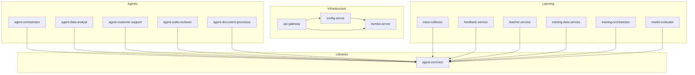

---

## 2. Application Configuration Files

**Status:** [PLANNED]
**Cross-Reference:** 02-Tech-Spec Section 7

All services pull shared configuration from Spring Cloud Config Server backed by a Git repository. Each service has a `bootstrap.yml` that points to the config server, plus an `application.yml` for local overrides during development.

### 2.1 Shared Configuration (config-repo/application.yml)

This file is served by the Config Server to all services as the baseline configuration.

```yaml
# config-repo/application.yml
# Shared defaults for all AI Agent Platform services
spring:
  # -- AI Model Providers --
  ai:
    ollama:
      base-url: http://ollama:11434
    anthropic:
      api-key: ${ANTHROPIC_API_KEY:}
      chat:
        options:
          model: claude-sonnet-4-5-20250929
          temperature: 0.5
          max-tokens: 4096
    openai:
      api-key: ${OPENAI_API_KEY:}
      chat:
        options:
          model: gpt-4
          temperature: 0.5
          max-tokens: 4096

  # -- Database (PostgreSQL + PGVector) --
  datasource:
    url: jdbc:postgresql://postgres:5432/${spring.application.name}
    username: ${DB_USERNAME:agent_platform}
    password: ${DB_PASSWORD:agent_platform_secret}
    hikari:
      maximum-pool-size: 10
      minimum-idle: 2
      connection-timeout: 20000

  jpa:
    hibernate:
      ddl-auto: validate
    open-in-view: false
    properties:
      hibernate:
        format_sql: false
        default_schema: public

  flyway:
    enabled: true
    locations: classpath:db/migration
    baseline-on-migrate: true

  # -- Kafka --
  kafka:
    bootstrap-servers: kafka:9092
    producer:
      key-serializer: org.apache.kafka.common.serialization.StringSerializer
      value-serializer: org.springframework.kafka.support.serializer.JsonSerializer
      acks: all
      retries: 3
    consumer:
      auto-offset-reset: earliest
      key-deserializer: org.apache.kafka.common.serialization.StringDeserializer
      value-deserializer: org.springframework.kafka.support.serializer.JsonDeserializer
      properties:
        spring.json.trusted.packages: "com.emsist.ai.*"

  # -- Valkey/Redis (session + cache) --
  data:
    redis:
      host: valkey
      port: 6379
      timeout: 2000ms

# -- Eureka Client --
eureka:
  client:
    service-url:
      defaultZone: http://eureka-server:8761/eureka/
    registry-fetch-interval-seconds: 10
  instance:
    prefer-ip-address: true
    lease-renewal-interval-in-seconds: 10
    lease-expiration-duration-in-seconds: 30

# -- Agent Platform Common --
agent:
  models:
    orchestrator:
      model: "llama3.1:8b"
      temperature: 0.3
      num-ctx: 4096
      max-concurrent: 10
    worker:
      model: "devstral-small:24b"
      temperature: 0.7
      num-ctx: 8192
      max-concurrent: 5

  routing:
    cloud-threshold: 0.7
    default-model: worker
    fallback-model: claude

  react-loop:
    max-turns: 10
    self-reflection: true
    tool-timeout-ms: 30000
    tool-retries: 2

  pipeline:
    validation-enabled: true
    explanation-enabled: true
    max-retries-on-validation-failure: 2
    max-retries-upper-bound: 3

  tenant:
    isolation-enabled: true
    default-namespace: "global"

  training:
    daily-cron: "0 0 2 * * *"
    weekly-cron: "0 0 4 * * SUN"
    quality-gate-threshold: 0.85
    recency-decay-factor: 0.95

# -- Resilience4j --
resilience4j:
  circuitbreaker:
    configs:
      default:
        sliding-window-size: 10
        failure-rate-threshold: 50
        wait-duration-in-open-state: 30s
        permitted-number-of-calls-in-half-open-state: 3
        slow-call-duration-threshold: 10s
        slow-call-rate-threshold: 80
    instances:
      ollama:
        base-config: default
        wait-duration-in-open-state: 60s
      claude:
        base-config: default
        failure-rate-threshold: 30
      tool-execution:
        base-config: default
        sliding-window-size: 20
  retry:
    configs:
      default:
        max-attempts: 3
        wait-duration: 1s
        retry-exceptions:
          - java.io.IOException
          - java.util.concurrent.TimeoutException
  timelimiter:
    configs:
      default:
        timeout-duration: 30s
    instances:
      ollama:
        timeout-duration: 120s
      claude:
        timeout-duration: 60s

# -- Actuator --
management:
  endpoints:
    web:
      exposure:
        include: health,info,metrics,prometheus,refresh
  endpoint:
    health:
      show-details: when-authorized
  metrics:
    tags:
      application: ${spring.application.name}
    distribution:
      percentiles-histogram:
        http.server.requests: true

# -- Logging --
logging:
  level:
    com.emsist.ai: DEBUG
    org.springframework.ai: INFO
    org.apache.kafka: WARN
  pattern:
    console: "%d{ISO8601} [%thread] [%X{traceId:-}] %-5level %logger{36} - %msg%n"
```

### 2.2 Infrastructure Service Configs

#### 2.2.1 Eureka Server (infrastructure/eureka-server/src/main/resources/application.yml)

```yaml
spring:
  application:
    name: eureka-server

server:
  port: 8761

eureka:
  client:
    register-with-eureka: false
    fetch-registry: false
  server:
    enable-self-preservation: true
    eviction-interval-timer-in-ms: 5000
    renewal-percent-threshold: 0.85
```

#### 2.2.2 Config Server (infrastructure/config-server/src/main/resources/application.yml)

```yaml
spring:
  application:
    name: config-server
  cloud:
    config:
      server:
        git:
          uri: ${CONFIG_REPO_URI:file:///config-repo}
          default-label: main
          search-paths: "{application}"
          clone-on-start: true
  profiles:
    active: native

server:
  port: 8888

eureka:
  client:
    service-url:
      defaultZone: http://eureka-server:8761/eureka/
```

#### 2.2.3 API Gateway (infrastructure/api-gateway/src/main/resources/application.yml)

```yaml
spring:
  application:
    name: api-gateway
  cloud:
    gateway:
      discovery:
        locator:
          enabled: true
          lower-case-service-id: true
      default-filters:
        - DedupeResponseHeader=Access-Control-Allow-Origin
      routes:
        # Agent Orchestrator
        - id: agent-orchestrator
          uri: lb://agent-orchestrator
          predicates:
            - Path=/api/v1/agents/orchestrate,/api/v1/pipeline/**
          filters:
            - StripPrefix=0

        # Agent Chat (by type)
        - id: agent-chat
          uri: lb://agent-orchestrator
          predicates:
            - Path=/api/v1/agents/{agentId}/chat
          filters:
            - StripPrefix=0

        # Skills Management
        - id: skills
          uri: lb://agent-orchestrator
          predicates:
            - Path=/api/v1/skills/**
          filters:
            - StripPrefix=0

        # Tool Management
        - id: tools
          uri: lb://agent-orchestrator
          predicates:
            - Path=/api/v1/tools/**
          filters:
            - StripPrefix=0

        # Feedback
        - id: feedback
          uri: lb://feedback-service
          predicates:
            - Path=/api/v1/feedback/**
          filters:
            - StripPrefix=0

        # Training & Models
        - id: training
          uri: lb://training-orchestrator
          predicates:
            - Path=/api/v1/training/**,/api/v1/models/**
          filters:
            - StripPrefix=0

        # Patterns & Materials
        - id: patterns
          uri: lb://feedback-service
          predicates:
            - Path=/api/v1/patterns/**,/api/v1/materials/**
          filters:
            - StripPrefix=0

        # Traces
        - id: traces
          uri: lb://trace-collector
          predicates:
            - Path=/api/v1/traces/**
          filters:
            - StripPrefix=0

        # Tenant Management
        - id: tenants
          uri: lb://agent-orchestrator
          predicates:
            - Path=/api/v1/tenants/**
          filters:
            - StripPrefix=0

        # Validation Rules
        - id: validation
          uri: lb://agent-orchestrator
          predicates:
            - Path=/api/v1/validation/**
          filters:
            - StripPrefix=0

  security:
    oauth2:
      resourceserver:
        jwt:
          issuer-uri: ${KEYCLOAK_ISSUER_URI:http://keycloak:8080/realms/emsist}

server:
  port: 8080

# Rate limiting via Valkey
  data:
    redis:
      host: valkey
      port: 6379
```

### 2.3 Agent Service Configs

#### 2.3.1 agent-orchestrator (config-repo/agent-orchestrator.yml)

```yaml
spring:
  application:
    name: agent-orchestrator

server:
  port: 8090

# Orchestrator-specific model config
agent:
  orchestrator:
    routing-strategy: complexity-based
    max-multi-agent-depth: 3
    plan-timeout-ms: 15000

  models:
    orchestrator:
      temperature: 0.2
      num-ctx: 4096
    worker:
      temperature: 0.7
      num-ctx: 8192

  pipeline:
    steps:
      intake:
        classification-prompt: "Classify this request by type and complexity"
      retrieve:
        top-k: 10
        similarity-threshold: 0.75
      plan:
        max-plan-steps: 15
      execute:
        max-turns: 10
      validate:
        enabled: true
      explain:
        enabled: true
      record:
        async: true
```

#### 2.3.2 agent-data-analyst (config-repo/agent-data-analyst.yml)

```yaml
spring:
  application:
    name: agent-data-analyst

server:
  port: 8091

agent:
  type: data-analyst
  default-skill: "data-analysis-v1"
  max-turns: 12
  self-reflection: true

  tools:
    run-sql:
      timeout-ms: 30000
      max-rows: 10000
      allowed-operations: [SELECT]
      blocked-operations: [DELETE, DROP, TRUNCATE, ALTER]
    create-chart:
      timeout-ms: 15000
      output-format: png
    summarize-table:
      timeout-ms: 20000
```

#### 2.3.3 agent-customer-support (config-repo/agent-customer-support.yml)

```yaml
spring:
  application:
    name: agent-customer-support

server:
  port: 8092

agent:
  type: customer-support
  default-skill: "ticket-resolution-v1"
  max-turns: 8
  self-reflection: false

  tools:
    search-tickets:
      timeout-ms: 10000
      max-results: 50
    search-kb:
      timeout-ms: 10000
      max-results: 20
    create-ticket:
      timeout-ms: 5000
      requires-approval: false
```

#### 2.3.4 agent-code-reviewer (config-repo/agent-code-reviewer.yml)

```yaml
spring:
  application:
    name: agent-code-reviewer

server:
  port: 8093

agent:
  type: code-reviewer
  default-skill: "code-security-review-v1"
  max-turns: 15
  self-reflection: true

  models:
    worker:
      model: "devstral-small:24b"
      temperature: 0.3
      num-ctx: 16384

  tools:
    analyze-code:
      timeout-ms: 60000
      supported-languages: [java, typescript, python, go]
    run-linter:
      timeout-ms: 30000
    check-security:
      timeout-ms: 45000
      owasp-categories: [injection, xss, auth, crypto, ssrf]
```

#### 2.3.5 agent-document-processor (config-repo/agent-document-processor.yml)

```yaml
spring:
  application:
    name: agent-document-processor

server:
  port: 8094

agent:
  type: document-processor
  default-skill: "document-summarization-v1"
  max-turns: 8
  self-reflection: false

  tools:
    parse-document:
      timeout-ms: 30000
      max-file-size-mb: 50
      supported-formats: [pdf, docx, xlsx, csv, txt, md, html]
    extract-entities:
      timeout-ms: 20000
    summarize:
      timeout-ms: 25000
      max-summary-length: 2000
```

### 2.4 Learning Pipeline Service Configs

#### 2.4.1 trace-collector (config-repo/trace-collector.yml)

```yaml
spring:
  application:
    name: trace-collector

  kafka:
    consumer:
      group-id: trace-collector-group

server:
  port: 8095

trace:
  collection:
    batch-size: 100
    flush-interval-ms: 5000
    retention-days: 90
  review:
    confidence-threshold: 0.5
    auto-flag-enabled: true
```

#### 2.4.2 feedback-service (config-repo/feedback-service.yml)

```yaml
spring:
  application:
    name: feedback-service

server:
  port: 8096

feedback:
  rating:
    scale: 5
    negative-threshold: 2
  correction:
    auto-queue-for-training: true
    priority: highest
  pattern:
    expansion:
      max-examples-per-pattern: 10
  material:
    chunking:
      chunk-size: 512
      chunk-overlap: 50
    embedding:
      model: "nomic-embed-text"
      batch-size: 50
```

#### 2.4.3 teacher-service (config-repo/teacher-service.yml)

```yaml
spring:
  application:
    name: teacher-service

server:
  port: 8097

teacher:
  claude:
    enabled: true
    model: claude-sonnet-4-5-20250929
    max-daily-calls: 1000
    cost-budget-usd: 50.0
  codex:
    enabled: true
    model: gpt-4
    max-daily-calls: 500
    cost-budget-usd: 30.0
  gemini:
    enabled: false
    model: gemini-1.5-pro
  evaluation:
    system-prompt: "You are an expert evaluator. Score the agent response on accuracy, helpfulness, and safety. Return a JSON with scores 1-5 for each dimension."
  gap-filling:
    max-examples-per-area: 50
    diversity-sampling: true
```

#### 2.4.4 training-data-service (config-repo/training-data-service.yml)

```yaml
spring:
  application:
    name: training-data-service

server:
  port: 8098

training-data:
  sources:
    traces:
      min-rating: 4
      lookback-days: 30
    corrections:
      lookback-days: 90
    patterns:
      include-inactive: false
    teacher:
      synthetic-limit: 200
  dataset:
    recency-decay-factor: 0.95
    min-examples-for-training: 100
    max-examples-per-dataset: 10000
    holdout-ratio: 0.1
    curriculum-enabled: false
  export:
    format: jsonl
    output-dir: /data/training-datasets
```

#### 2.4.5 training-orchestrator (config-repo/training-orchestrator.yml)

```yaml
spring:
  application:
    name: training-orchestrator

server:
  port: 8099

training:
  schedule:
    daily:
      enabled: true
      cron: "0 0 2 * * *"
      methods: [SFT, DPO, RAG_UPDATE]
    weekly:
      enabled: true
      cron: "0 0 4 * * SUN"
      methods: [SFT, DPO, KNOWLEDGE_DISTILLATION, CURRICULUM]
    monthly:
      enabled: false
      cron: "0 0 3 1 * *"
      methods: [SELF_SUPERVISED, CONTRASTIVE, SEMI_SUPERVISED]
  quality-gate:
    threshold: 0.85
    metrics: [accuracy, f1-score, latency-p95]
    auto-deploy: true
    shadow-period-hours: 4
  ollama:
    model-prefix: "agent"
    modelfile-template: /config/modelfile-template.txt
  sft:
    epochs: 3
    learning-rate: 2e-5
    lora-rank: 16
    lora-alpha: 16
    batch-size: 4
    max-seq-length: 4096
  dpo:
    beta: 0.1
    learning-rate: 5e-7
    epochs: 1
    batch-size: 4
```

#### 2.4.6 model-evaluator (config-repo/model-evaluator.yml)

```yaml
spring:
  application:
    name: model-evaluator

server:
  port: 8100

evaluator:
  benchmark:
    test-set-path: /data/eval/test-set.jsonl
    metrics: [accuracy, f1, bleu, latency]
    per-agent-eval: true
  comparison:
    baseline-model: "current-production"
    candidate-timeout-ms: 120000
  ab-testing:
    enabled: false
    traffic-split: 0.1
    min-sample-size: 100
    significance-level: 0.05
  reporting:
    output-dir: /data/eval/reports
    notify-on-completion: true
```

---

## 3. Database Schema Design

**Status:** [PLANNED]
**Cross-Reference:** 02-Tech-Spec Sections 3.7, 3.9, 3.12, 4.1-4.5

All services use PostgreSQL 16 with PGVector extension for embedding storage. Each service owns its own database following the database-per-service pattern. Flyway manages schema migrations.

### 3.1 Entity Relationship Diagram

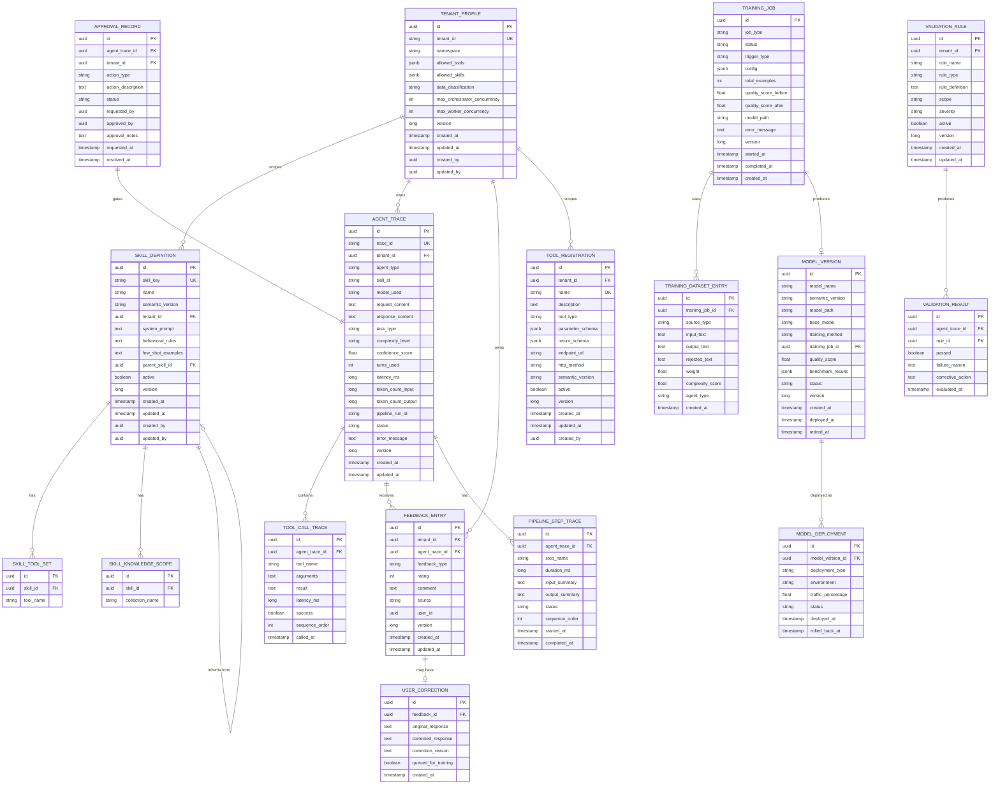

### 3.2 PGVector Extension for Embedding Storage

The vector store is managed through Spring AI's PGVector integration. The following table holds document embeddings for RAG retrieval.

```sql
-- V1__create_pgvector_extension.sql
CREATE EXTENSION IF NOT EXISTS vector;
CREATE EXTENSION IF NOT EXISTS "uuid-ossp";

-- Spring AI PGVector store table (standard schema)
CREATE TABLE IF NOT EXISTS vector_store (
    id          UUID DEFAULT uuid_generate_v4() PRIMARY KEY,
    content     TEXT NOT NULL,
    metadata    JSONB DEFAULT '{}',
    embedding   vector(1536),  -- dimension matches embedding model output
    tenant_id   UUID NOT NULL,
    created_at  TIMESTAMP WITH TIME ZONE DEFAULT NOW()
);

-- Tenant-scoped HNSW index for fast approximate nearest neighbor search
CREATE INDEX IF NOT EXISTS idx_vector_store_embedding
    ON vector_store USING hnsw (embedding vector_cosine_ops)
    WITH (m = 16, ef_construction = 200);

-- Tenant filter index (every RAG query is scoped by tenant)
CREATE INDEX IF NOT EXISTS idx_vector_store_tenant
    ON vector_store (tenant_id);

-- JSONB metadata index for filtering by document type, source, etc.
CREATE INDEX IF NOT EXISTS idx_vector_store_metadata
    ON vector_store USING gin (metadata jsonb_path_ops);
```

### 3.3 Flyway Migration Scripts

Migrations are organized per service. Each service has its own Flyway migration directory at `src/main/resources/db/migration/`.

#### 3.3.1 agent-orchestrator Migrations

```sql
-- V1__create_tenant_profiles.sql
CREATE TABLE IF NOT EXISTS tenant_profiles (
    id                          UUID DEFAULT uuid_generate_v4() PRIMARY KEY,
    tenant_id                   VARCHAR(255) NOT NULL UNIQUE,
    namespace                   VARCHAR(255) NOT NULL,
    allowed_tools               JSONB DEFAULT '[]',
    allowed_skills              JSONB DEFAULT '[]',
    data_classification         VARCHAR(50) DEFAULT 'INTERNAL',
    max_orchestrator_concurrency INT DEFAULT 10,
    max_worker_concurrency      INT DEFAULT 5,
    version                     BIGINT NOT NULL DEFAULT 0,
    created_at                  TIMESTAMP WITH TIME ZONE NOT NULL DEFAULT NOW(),
    updated_at                  TIMESTAMP WITH TIME ZONE NOT NULL DEFAULT NOW(),
    created_by                  UUID,
    updated_by                  UUID
);

CREATE INDEX IF NOT EXISTS idx_tenant_profiles_tenant ON tenant_profiles (tenant_id);
```

```sql
-- V2__create_skill_definitions.sql
CREATE TABLE IF NOT EXISTS skill_definitions (
    id                UUID DEFAULT uuid_generate_v4() PRIMARY KEY,
    skill_key         VARCHAR(255) NOT NULL UNIQUE,
    name              VARCHAR(255) NOT NULL,
    semantic_version  VARCHAR(50) NOT NULL DEFAULT '1.0.0',
    tenant_id         UUID,
    system_prompt     TEXT NOT NULL,
    behavioral_rules  TEXT,
    few_shot_examples TEXT,
    parent_skill_id   UUID REFERENCES skill_definitions(id),
    active            BOOLEAN NOT NULL DEFAULT FALSE,
    version           BIGINT NOT NULL DEFAULT 0,
    created_at        TIMESTAMP WITH TIME ZONE NOT NULL DEFAULT NOW(),
    updated_at        TIMESTAMP WITH TIME ZONE NOT NULL DEFAULT NOW(),
    created_by        UUID,
    updated_by        UUID
);

CREATE TABLE IF NOT EXISTS skill_tool_sets (
    id        UUID DEFAULT uuid_generate_v4() PRIMARY KEY,
    skill_id  UUID NOT NULL REFERENCES skill_definitions(id) ON DELETE CASCADE,
    tool_name VARCHAR(255) NOT NULL
);

CREATE TABLE IF NOT EXISTS skill_knowledge_scopes (
    id              UUID DEFAULT uuid_generate_v4() PRIMARY KEY,
    skill_id        UUID NOT NULL REFERENCES skill_definitions(id) ON DELETE CASCADE,
    collection_name VARCHAR(255) NOT NULL
);

CREATE INDEX IF NOT EXISTS idx_skill_definitions_tenant ON skill_definitions (tenant_id);
CREATE INDEX IF NOT EXISTS idx_skill_definitions_active ON skill_definitions (active) WHERE active = TRUE;
CREATE INDEX IF NOT EXISTS idx_skill_tool_sets_skill ON skill_tool_sets (skill_id);
CREATE INDEX IF NOT EXISTS idx_skill_knowledge_scopes_skill ON skill_knowledge_scopes (skill_id);
```

```sql
-- V3__create_tool_registrations.sql
CREATE TABLE IF NOT EXISTS tool_registrations (
    id               UUID DEFAULT uuid_generate_v4() PRIMARY KEY,
    tenant_id        UUID,
    name             VARCHAR(255) NOT NULL,
    description      TEXT,
    tool_type        VARCHAR(50) NOT NULL DEFAULT 'REST',
    parameter_schema JSONB DEFAULT '{}',
    return_schema    JSONB DEFAULT '{}',
    endpoint_url     VARCHAR(1024),
    http_method      VARCHAR(10) DEFAULT 'POST',
    semantic_version VARCHAR(50) NOT NULL DEFAULT '1.0.0',
    active           BOOLEAN NOT NULL DEFAULT TRUE,
    version          BIGINT NOT NULL DEFAULT 0,
    created_at       TIMESTAMP WITH TIME ZONE NOT NULL DEFAULT NOW(),
    updated_at       TIMESTAMP WITH TIME ZONE NOT NULL DEFAULT NOW(),
    created_by       UUID,
    CONSTRAINT uq_tool_name_tenant UNIQUE (name, tenant_id)
);

CREATE INDEX IF NOT EXISTS idx_tool_registrations_tenant ON tool_registrations (tenant_id);
CREATE INDEX IF NOT EXISTS idx_tool_registrations_active ON tool_registrations (active) WHERE active = TRUE;
```

```sql
-- V4__create_validation_rules.sql
CREATE TABLE IF NOT EXISTS validation_rules (
    id              UUID DEFAULT uuid_generate_v4() PRIMARY KEY,
    tenant_id       UUID,
    rule_name       VARCHAR(255) NOT NULL,
    rule_type       VARCHAR(50) NOT NULL,
    rule_definition TEXT NOT NULL,
    scope           VARCHAR(100) DEFAULT 'GLOBAL',
    severity        VARCHAR(20) NOT NULL DEFAULT 'ERROR',
    active          BOOLEAN NOT NULL DEFAULT TRUE,
    version         BIGINT NOT NULL DEFAULT 0,
    created_at      TIMESTAMP WITH TIME ZONE NOT NULL DEFAULT NOW(),
    updated_at      TIMESTAMP WITH TIME ZONE NOT NULL DEFAULT NOW()
);

CREATE INDEX IF NOT EXISTS idx_validation_rules_tenant ON validation_rules (tenant_id);
CREATE INDEX IF NOT EXISTS idx_validation_rules_scope ON validation_rules (scope);
```

#### 3.3.2 trace-collector Migrations

```sql
-- V1__create_agent_traces.sql
CREATE TABLE IF NOT EXISTS agent_traces (
    id                  UUID DEFAULT uuid_generate_v4() PRIMARY KEY,
    trace_id            VARCHAR(255) NOT NULL UNIQUE,
    tenant_id           UUID NOT NULL,
    agent_type          VARCHAR(100) NOT NULL,
    skill_id            VARCHAR(255),
    model_used          VARCHAR(255),
    request_content     TEXT NOT NULL,
    response_content    TEXT,
    task_type           VARCHAR(50),
    complexity_level    VARCHAR(20),
    confidence_score    REAL,
    turns_used          INT DEFAULT 0,
    latency_ms          BIGINT,
    token_count_input   BIGINT DEFAULT 0,
    token_count_output  BIGINT DEFAULT 0,
    pipeline_run_id     VARCHAR(255),
    status              VARCHAR(20) NOT NULL DEFAULT 'COMPLETED',
    error_message       TEXT,
    version             BIGINT NOT NULL DEFAULT 0,
    created_at          TIMESTAMP WITH TIME ZONE NOT NULL DEFAULT NOW(),
    updated_at          TIMESTAMP WITH TIME ZONE NOT NULL DEFAULT NOW()
);

CREATE TABLE IF NOT EXISTS tool_call_traces (
    id              UUID DEFAULT uuid_generate_v4() PRIMARY KEY,
    agent_trace_id  UUID NOT NULL REFERENCES agent_traces(id) ON DELETE CASCADE,
    tool_name       VARCHAR(255) NOT NULL,
    arguments       TEXT,
    result          TEXT,
    latency_ms      BIGINT,
    success         BOOLEAN NOT NULL DEFAULT TRUE,
    sequence_order  INT NOT NULL DEFAULT 0,
    called_at       TIMESTAMP WITH TIME ZONE NOT NULL DEFAULT NOW()
);

CREATE TABLE IF NOT EXISTS pipeline_step_traces (
    id              UUID DEFAULT uuid_generate_v4() PRIMARY KEY,
    agent_trace_id  UUID NOT NULL REFERENCES agent_traces(id) ON DELETE CASCADE,
    step_name       VARCHAR(50) NOT NULL,
    duration_ms     BIGINT,
    input_summary   TEXT,
    output_summary  TEXT,
    status          VARCHAR(20) NOT NULL DEFAULT 'COMPLETED',
    sequence_order  INT NOT NULL DEFAULT 0,
    started_at      TIMESTAMP WITH TIME ZONE,
    completed_at    TIMESTAMP WITH TIME ZONE
);

-- Performance indexes
CREATE INDEX IF NOT EXISTS idx_agent_traces_tenant ON agent_traces (tenant_id);
CREATE INDEX IF NOT EXISTS idx_agent_traces_agent_type ON agent_traces (agent_type);
CREATE INDEX IF NOT EXISTS idx_agent_traces_created ON agent_traces (created_at DESC);
CREATE INDEX IF NOT EXISTS idx_agent_traces_status ON agent_traces (status);
CREATE INDEX IF NOT EXISTS idx_agent_traces_confidence ON agent_traces (confidence_score)
    WHERE confidence_score < 0.5;
CREATE INDEX IF NOT EXISTS idx_agent_traces_pipeline ON agent_traces (pipeline_run_id);
CREATE INDEX IF NOT EXISTS idx_tool_call_traces_agent ON tool_call_traces (agent_trace_id);
CREATE INDEX IF NOT EXISTS idx_pipeline_step_traces_agent ON pipeline_step_traces (agent_trace_id);
```

```sql
-- V2__create_validation_results.sql
CREATE TABLE IF NOT EXISTS validation_results (
    id               UUID DEFAULT uuid_generate_v4() PRIMARY KEY,
    agent_trace_id   UUID NOT NULL REFERENCES agent_traces(id) ON DELETE CASCADE,
    rule_id          UUID,
    passed           BOOLEAN NOT NULL,
    failure_reason   TEXT,
    corrective_action TEXT,
    evaluated_at     TIMESTAMP WITH TIME ZONE NOT NULL DEFAULT NOW()
);

CREATE INDEX IF NOT EXISTS idx_validation_results_trace ON validation_results (agent_trace_id);
CREATE INDEX IF NOT EXISTS idx_validation_results_failed ON validation_results (passed) WHERE passed = FALSE;
```

```sql
-- V3__create_approval_records.sql
CREATE TABLE IF NOT EXISTS approval_records (
    id                UUID DEFAULT uuid_generate_v4() PRIMARY KEY,
    agent_trace_id    UUID NOT NULL REFERENCES agent_traces(id),
    tenant_id         UUID NOT NULL,
    action_type       VARCHAR(100) NOT NULL,
    action_description TEXT,
    status            VARCHAR(20) NOT NULL DEFAULT 'PENDING',
    requested_by      UUID,
    approved_by       UUID,
    approval_notes    TEXT,
    requested_at      TIMESTAMP WITH TIME ZONE NOT NULL DEFAULT NOW(),
    resolved_at       TIMESTAMP WITH TIME ZONE
);

CREATE INDEX IF NOT EXISTS idx_approval_records_tenant ON approval_records (tenant_id);
CREATE INDEX IF NOT EXISTS idx_approval_records_status ON approval_records (status)
    WHERE status = 'PENDING';
```

#### 3.3.3 feedback-service Migrations

```sql
-- V1__create_feedback_tables.sql
CREATE TABLE IF NOT EXISTS feedback_entries (
    id              UUID DEFAULT uuid_generate_v4() PRIMARY KEY,
    tenant_id       UUID NOT NULL,
    agent_trace_id  UUID,
    feedback_type   VARCHAR(50) NOT NULL,
    rating          INT CHECK (rating >= 1 AND rating <= 5),
    comment         TEXT,
    source          VARCHAR(50) NOT NULL DEFAULT 'USER',
    user_id         UUID,
    version         BIGINT NOT NULL DEFAULT 0,
    created_at      TIMESTAMP WITH TIME ZONE NOT NULL DEFAULT NOW(),
    updated_at      TIMESTAMP WITH TIME ZONE NOT NULL DEFAULT NOW()
);

CREATE TABLE IF NOT EXISTS user_corrections (
    id                  UUID DEFAULT uuid_generate_v4() PRIMARY KEY,
    feedback_id         UUID NOT NULL REFERENCES feedback_entries(id) ON DELETE CASCADE,
    original_response   TEXT NOT NULL,
    corrected_response  TEXT NOT NULL,
    correction_reason   TEXT,
    queued_for_training BOOLEAN NOT NULL DEFAULT TRUE,
    created_at          TIMESTAMP WITH TIME ZONE NOT NULL DEFAULT NOW()
);

CREATE TABLE IF NOT EXISTS business_patterns (
    id           UUID DEFAULT uuid_generate_v4() PRIMARY KEY,
    tenant_id    UUID NOT NULL,
    name         VARCHAR(255) NOT NULL,
    description  TEXT,
    pattern_type VARCHAR(50) NOT NULL,
    trigger_text TEXT NOT NULL,
    response_text TEXT NOT NULL,
    agent_type   VARCHAR(100),
    active       BOOLEAN NOT NULL DEFAULT TRUE,
    version      BIGINT NOT NULL DEFAULT 0,
    created_at   TIMESTAMP WITH TIME ZONE NOT NULL DEFAULT NOW(),
    updated_at   TIMESTAMP WITH TIME ZONE NOT NULL DEFAULT NOW(),
    created_by   UUID
);

CREATE TABLE IF NOT EXISTS learning_materials (
    id                UUID DEFAULT uuid_generate_v4() PRIMARY KEY,
    tenant_id         UUID NOT NULL,
    title             VARCHAR(500) NOT NULL,
    content_type      VARCHAR(50) NOT NULL,
    source_path       VARCHAR(1024),
    raw_content       TEXT,
    chunk_count       INT DEFAULT 0,
    embedding_status  VARCHAR(20) NOT NULL DEFAULT 'PENDING',
    agent_type        VARCHAR(100),
    version           BIGINT NOT NULL DEFAULT 0,
    created_at        TIMESTAMP WITH TIME ZONE NOT NULL DEFAULT NOW(),
    updated_at        TIMESTAMP WITH TIME ZONE NOT NULL DEFAULT NOW(),
    created_by        UUID
);

-- Indexes
CREATE INDEX IF NOT EXISTS idx_feedback_entries_tenant ON feedback_entries (tenant_id);
CREATE INDEX IF NOT EXISTS idx_feedback_entries_trace ON feedback_entries (agent_trace_id);
CREATE INDEX IF NOT EXISTS idx_feedback_entries_type ON feedback_entries (feedback_type);
CREATE INDEX IF NOT EXISTS idx_feedback_entries_rating ON feedback_entries (rating);
CREATE INDEX IF NOT EXISTS idx_feedback_entries_created ON feedback_entries (created_at DESC);
CREATE INDEX IF NOT EXISTS idx_user_corrections_queued ON user_corrections (queued_for_training)
    WHERE queued_for_training = TRUE;
CREATE INDEX IF NOT EXISTS idx_business_patterns_tenant ON business_patterns (tenant_id);
CREATE INDEX IF NOT EXISTS idx_business_patterns_agent ON business_patterns (agent_type);
CREATE INDEX IF NOT EXISTS idx_learning_materials_tenant ON learning_materials (tenant_id);
CREATE INDEX IF NOT EXISTS idx_learning_materials_status ON learning_materials (embedding_status);
```

#### 3.3.4 training-orchestrator Migrations

```sql
-- V1__create_training_tables.sql
CREATE TABLE IF NOT EXISTS training_jobs (
    id                  UUID DEFAULT uuid_generate_v4() PRIMARY KEY,
    job_type            VARCHAR(50) NOT NULL,
    status              VARCHAR(20) NOT NULL DEFAULT 'PENDING',
    trigger_type        VARCHAR(50) NOT NULL DEFAULT 'SCHEDULED',
    config              JSONB DEFAULT '{}',
    total_examples      INT DEFAULT 0,
    quality_score_before REAL,
    quality_score_after  REAL,
    model_path          VARCHAR(1024),
    error_message       TEXT,
    version             BIGINT NOT NULL DEFAULT 0,
    started_at          TIMESTAMP WITH TIME ZONE,
    completed_at        TIMESTAMP WITH TIME ZONE,
    created_at          TIMESTAMP WITH TIME ZONE NOT NULL DEFAULT NOW()
);

CREATE TABLE IF NOT EXISTS training_dataset_entries (
    id               UUID DEFAULT uuid_generate_v4() PRIMARY KEY,
    training_job_id  UUID NOT NULL REFERENCES training_jobs(id) ON DELETE CASCADE,
    source_type      VARCHAR(50) NOT NULL,
    input_text       TEXT NOT NULL,
    output_text      TEXT NOT NULL,
    rejected_text    TEXT,
    weight           REAL DEFAULT 1.0,
    complexity_score REAL,
    agent_type       VARCHAR(100),
    created_at       TIMESTAMP WITH TIME ZONE NOT NULL DEFAULT NOW()
);

CREATE TABLE IF NOT EXISTS model_versions (
    id                UUID DEFAULT uuid_generate_v4() PRIMARY KEY,
    model_name        VARCHAR(255) NOT NULL,
    semantic_version  VARCHAR(50) NOT NULL,
    model_path        VARCHAR(1024) NOT NULL,
    base_model        VARCHAR(255) NOT NULL,
    training_method   VARCHAR(50),
    training_job_id   UUID REFERENCES training_jobs(id),
    quality_score     REAL,
    benchmark_results JSONB DEFAULT '{}',
    status            VARCHAR(20) NOT NULL DEFAULT 'CREATED',
    version           BIGINT NOT NULL DEFAULT 0,
    created_at        TIMESTAMP WITH TIME ZONE NOT NULL DEFAULT NOW(),
    deployed_at       TIMESTAMP WITH TIME ZONE,
    retired_at        TIMESTAMP WITH TIME ZONE
);

CREATE TABLE IF NOT EXISTS model_deployments (
    id                 UUID DEFAULT uuid_generate_v4() PRIMARY KEY,
    model_version_id   UUID NOT NULL REFERENCES model_versions(id),
    deployment_type    VARCHAR(50) NOT NULL DEFAULT 'FULL',
    environment        VARCHAR(50) NOT NULL DEFAULT 'PRODUCTION',
    traffic_percentage REAL DEFAULT 100.0,
    status             VARCHAR(20) NOT NULL DEFAULT 'ACTIVE',
    deployed_at        TIMESTAMP WITH TIME ZONE NOT NULL DEFAULT NOW(),
    rolled_back_at     TIMESTAMP WITH TIME ZONE
);

-- Indexes
CREATE INDEX IF NOT EXISTS idx_training_jobs_status ON training_jobs (status);
CREATE INDEX IF NOT EXISTS idx_training_jobs_type ON training_jobs (job_type);
CREATE INDEX IF NOT EXISTS idx_training_jobs_created ON training_jobs (created_at DESC);
CREATE INDEX IF NOT EXISTS idx_training_dataset_entries_job ON training_dataset_entries (training_job_id);
CREATE INDEX IF NOT EXISTS idx_training_dataset_entries_source ON training_dataset_entries (source_type);
CREATE INDEX IF NOT EXISTS idx_model_versions_status ON model_versions (status);
CREATE INDEX IF NOT EXISTS idx_model_versions_name ON model_versions (model_name, semantic_version);
CREATE INDEX IF NOT EXISTS idx_model_deployments_version ON model_deployments (model_version_id);
CREATE INDEX IF NOT EXISTS idx_model_deployments_active ON model_deployments (status)
    WHERE status = 'ACTIVE';
```

### 3.4 Index Strategy Summary

| Table | Index | Type | Purpose |
|-------|-------|------|---------|
| vector_store | embedding (HNSW) | vector_cosine_ops | Fast ANN similarity search for RAG |
| vector_store | tenant_id (BTREE) | BTREE | Every RAG query scoped by tenant |
| vector_store | metadata (GIN) | GIN jsonb_path_ops | Filter by document type, source |
| agent_traces | tenant_id (BTREE) | BTREE | Tenant-scoped trace queries |
| agent_traces | created_at DESC | BTREE | Recent traces for training data |
| agent_traces | confidence_score (partial) | BTREE | Flag low-confidence for review |
| feedback_entries | rating (BTREE) | BTREE | DPO pair generation (positive vs negative) |
| user_corrections | queued_for_training (partial) | BTREE | Find unprocessed corrections |
| training_jobs | status (BTREE) | BTREE | Monitor running jobs |
| model_deployments | status (partial) | BTREE | Find active deployments |
| skill_definitions | active (partial) | BTREE | Resolve only active skills |

### 3.5 Database-per-Service Allocation

| Service | Database Name | Tables Owned |
|---------|--------------|-------------|
| agent-orchestrator | `agent_orchestrator` | tenant_profiles, skill_definitions, skill_tool_sets, skill_knowledge_scopes, tool_registrations, validation_rules, vector_store |
| trace-collector | `trace_collector` | agent_traces, tool_call_traces, pipeline_step_traces, validation_results, approval_records |
| feedback-service | `feedback_service` | feedback_entries, user_corrections, business_patterns, learning_materials |
| training-orchestrator | `training_orchestrator` | training_jobs, training_dataset_entries, model_versions, model_deployments |
| teacher-service | `teacher_service` | teacher_evaluations, synthetic_examples (lightweight tables for teacher outputs) |
| training-data-service | `training_data_service` | dataset_snapshots, data_quality_metrics (aggregation and export tables) |
| model-evaluator | `model_evaluator` | evaluation_runs, benchmark_results (evaluation history) |

Each agent service (data-analyst, customer-support, code-reviewer, document-processor) does NOT own its own database. Agents are stateless microservices that interact with the orchestrator's database for skills and tools, the trace-collector for logging, and the feedback-service for feedback.

---

## 4. API Contracts (OpenAPI 3.1)

**Status:** [PLANNED]
**Cross-Reference:** 02-Tech-Spec Section 8, 01-PRD Sections 3.1-3.7

All APIs follow these conventions per SA-PRINCIPLES.md:
- Path-based versioning: `/api/v1/...`
- Kebab-case for paths, camelCase for JSON properties
- RFC 7807 Problem Details for error responses
- Bearer JWT authentication on all endpoints
- Pagination via `page`, `size`, `sort` query parameters

### 4.1 Common Schemas

```yaml
# Reusable schemas referenced by all API contracts
components:
  schemas:
    # RFC 7807 Problem Details
    ProblemDetail:
      type: object
      properties:
        type:
          type: string
          format: uri
          description: "URI reference identifying the problem type"
          example: "https://api.emsist.com/problems/validation-error"
        title:
          type: string
          description: "Short human-readable summary"
          example: "Validation Error"
        status:
          type: integer
          description: "HTTP status code"
          example: 400
        detail:
          type: string
          description: "Human-readable explanation"
          example: "The 'rating' field must be between 1 and 5"
        instance:
          type: string
          format: uri
          description: "URI reference identifying the specific occurrence"
        timestamp:
          type: string
          format: date-time
        traceId:
          type: string
          description: "Distributed trace ID for correlation"
      required: [type, title, status]

    # Paginated response wrapper
    PageResponse:
      type: object
      properties:
        content:
          type: array
          items: {}
        page:
          type: integer
          example: 0
        size:
          type: integer
          example: 20
        totalElements:
          type: integer
          format: int64
        totalPages:
          type: integer
        first:
          type: boolean
        last:
          type: boolean

    # Audit metadata (embedded in all entities)
    AuditMetadata:
      type: object
      properties:
        createdAt:
          type: string
          format: date-time
        updatedAt:
          type: string
          format: date-time
        createdBy:
          type: string
          format: uuid
        updatedBy:
          type: string
          format: uuid
        version:
          type: integer
          format: int64

  securitySchemes:
    bearerAuth:
      type: http
      scheme: bearer
      bearerFormat: JWT
      description: "Keycloak-issued JWT with tenant context"
```

### 4.2 Agent Chat API

```yaml
openapi: 3.1.0
info:
  title: Agent Chat API
  version: 1.0.0
  description: |
    Send messages to AI agents and receive structured responses.
    All requests flow through the 7-step pipeline.
    Cross-Reference: PRD Section 3.1

paths:
  /api/v1/agents/{agentId}/chat:
    post:
      operationId: chatWithAgent
      tags: [Agent Chat]
      summary: Send a message to a specific agent
      description: |
        Routes the message through the 7-step pipeline (Intake, Retrieve, Plan,
        Execute, Validate, Explain, Record) using the specified agent type.
      security:
        - bearerAuth: []
      parameters:
        - name: agentId
          in: path
          required: true
          schema:
            type: string
            enum: [data-analyst, customer-support, code-reviewer, document-processor]
          description: "Agent type identifier"
      requestBody:
        required: true
        content:
          application/json:
            schema:
              $ref: '#/components/schemas/ChatRequest'
            example:
              message: "Show me the top 10 customers by revenue this quarter"
              conversationId: "conv-123e4567-e89b"
              context:
                department: "sales"
                dataSource: "crm_warehouse"
      responses:
        '200':
          description: Agent response with explanation
          content:
            application/json:
              schema:
                $ref: '#/components/schemas/ChatResponse'
        '400':
          description: Invalid request
          content:
            application/json:
              schema:
                $ref: '#/components/schemas/ProblemDetail'
        '401':
          description: Missing or invalid JWT
          content:
            application/json:
              schema:
                $ref: '#/components/schemas/ProblemDetail'
        '403':
          description: Insufficient permissions or tenant mismatch
          content:
            application/json:
              schema:
                $ref: '#/components/schemas/ProblemDetail'
        '429':
          description: Rate limit exceeded (per-tenant concurrency limit)
          content:
            application/json:
              schema:
                $ref: '#/components/schemas/ProblemDetail'
        '503':
          description: Agent or model unavailable (circuit breaker open)
          content:
            application/json:
              schema:
                $ref: '#/components/schemas/ProblemDetail'

  /api/v1/agents/orchestrate:
    post:
      operationId: orchestrateTask
      tags: [Agent Chat]
      summary: Let the orchestrator route the task to the best agent
      description: |
        The orchestrator classifies the request and routes it to the
        most appropriate specialist agent automatically.
      security:
        - bearerAuth: []
      requestBody:
        required: true
        content:
          application/json:
            schema:
              $ref: '#/components/schemas/ChatRequest'
      responses:
        '200':
          description: Orchestrated agent response
          content:
            application/json:
              schema:
                $ref: '#/components/schemas/ChatResponse'

components:
  schemas:
    ChatRequest:
      type: object
      required: [message]
      properties:
        message:
          type: string
          maxLength: 32000
          description: "User message content"
        conversationId:
          type: string
          description: "Optional conversation ID for context continuity"
        skillOverride:
          type: string
          description: "Force a specific skill instead of auto-selection"
        context:
          type: object
          additionalProperties: true
          description: "Additional context key-value pairs"
        options:
          $ref: '#/components/schemas/ChatOptions'

    ChatOptions:
      type: object
      properties:
        maxTurns:
          type: integer
          minimum: 1
          maximum: 20
          default: 10
        selfReflection:
          type: boolean
          default: true
        explanationLevel:
          type: string
          enum: [none, summary, full]
          default: full
        streamResponse:
          type: boolean
          default: false

    ChatResponse:
      type: object
      properties:
        traceId:
          type: string
          description: "Unique trace ID for this interaction"
        agentType:
          type: string
          description: "Which agent processed the request"
        content:
          type: string
          description: "Agent response content"
        explanation:
          $ref: '#/components/schemas/Explanation'
        artifacts:
          type: array
          items:
            $ref: '#/components/schemas/Artifact'
        validation:
          $ref: '#/components/schemas/ValidationSummary'
        metadata:
          $ref: '#/components/schemas/ResponseMetadata'

    Explanation:
      type: object
      properties:
        businessSummary:
          type: string
          description: "Non-technical summary of what was done"
        technicalDetail:
          type: string
          description: "Technical step-by-step breakdown"
        artifactList:
          type: array
          items:
            type: string
          description: "List of artifacts created or modified"

    Artifact:
      type: object
      properties:
        type:
          type: string
          enum: [code, query, chart, document, data]
        name:
          type: string
        content:
          type: string
        mimeType:
          type: string

    ValidationSummary:
      type: object
      properties:
        passed:
          type: boolean
        issueCount:
          type: integer
        issues:
          type: array
          items:
            type: string

    ResponseMetadata:
      type: object
      properties:
        modelUsed:
          type: string
        turnsUsed:
          type: integer
        latencyMs:
          type: integer
          format: int64
        tokenCountInput:
          type: integer
          format: int64
        tokenCountOutput:
          type: integer
          format: int64
        skillId:
          type: string
        pipelineRunId:
          type: string
```

### 4.3 Pipeline API

```yaml
paths:
  /api/v1/pipeline/execute:
    post:
      operationId: executePipeline
      tags: [Pipeline]
      summary: Execute the full 7-step request pipeline
      description: |
        Explicit pipeline execution with step-level control.
        Returns the full pipeline result including per-step traces.
      security:
        - bearerAuth: []
      requestBody:
        required: true
        content:
          application/json:
            schema:
              $ref: '#/components/schemas/PipelineRequest'
      responses:
        '200':
          description: Pipeline execution result
          content:
            application/json:
              schema:
                $ref: '#/components/schemas/PipelineResponse'

  /api/v1/pipeline/{runId}/status:
    get:
      operationId: getPipelineStatus
      tags: [Pipeline]
      summary: Get status of a pipeline run
      security:
        - bearerAuth: []
      parameters:
        - name: runId
          in: path
          required: true
          schema:
            type: string
      responses:
        '200':
          description: Pipeline run status
          content:
            application/json:
              schema:
                $ref: '#/components/schemas/PipelineStatus'
        '404':
          description: Pipeline run not found
          content:
            application/json:
              schema:
                $ref: '#/components/schemas/ProblemDetail'

components:
  schemas:
    PipelineRequest:
      type: object
      required: [message]
      properties:
        message:
          type: string
        agentType:
          type: string
          description: "Optional, auto-routed if omitted"
        skillId:
          type: string
        validationRuleIds:
          type: array
          items:
            type: string
            format: uuid
        requireApproval:
          type: boolean
          default: false
        context:
          type: object
          additionalProperties: true

    PipelineResponse:
      type: object
      properties:
        runId:
          type: string
        status:
          type: string
          enum: [COMPLETED, FAILED, PENDING_APPROVAL]
        content:
          type: string
        explanation:
          $ref: '#/components/schemas/Explanation'
        artifacts:
          type: array
          items:
            $ref: '#/components/schemas/Artifact'
        validation:
          $ref: '#/components/schemas/ValidationSummary'
        steps:
          type: array
          items:
            $ref: '#/components/schemas/PipelineStepResult'
        metadata:
          $ref: '#/components/schemas/ResponseMetadata'

    PipelineStepResult:
      type: object
      properties:
        stepName:
          type: string
          enum: [INTAKE, RETRIEVE, PLAN, EXECUTE, VALIDATE, EXPLAIN, RECORD]
        status:
          type: string
          enum: [COMPLETED, FAILED, SKIPPED]
        durationMs:
          type: integer
          format: int64
        summary:
          type: string

    PipelineStatus:
      type: object
      properties:
        runId:
          type: string
        status:
          type: string
        currentStep:
          type: string
        startedAt:
          type: string
          format: date-time
        completedAt:
          type: string
          format: date-time
```

### 4.4 Skill Management API

```yaml
paths:
  /api/v1/skills:
    get:
      operationId: listSkills
      tags: [Skills]
      summary: List skill definitions
      security:
        - bearerAuth: []
      parameters:
        - name: agentType
          in: query
          schema:
            type: string
        - name: active
          in: query
          schema:
            type: boolean
        - name: page
          in: query
          schema:
            type: integer
            default: 0
        - name: size
          in: query
          schema:
            type: integer
            default: 20
      responses:
        '200':
          description: Paginated list of skills
          content:
            application/json:
              schema:
                allOf:
                  - $ref: '#/components/schemas/PageResponse'
                  - properties:
                      content:
                        type: array
                        items:
                          $ref: '#/components/schemas/SkillDefinitionDto'
    post:
      operationId: createSkill
      tags: [Skills]
      summary: Create a new skill definition
      security:
        - bearerAuth: []
      requestBody:
        required: true
        content:
          application/json:
            schema:
              $ref: '#/components/schemas/CreateSkillRequest'
      responses:
        '201':
          description: Skill created
          headers:
            Location:
              schema:
                type: string
          content:
            application/json:
              schema:
                $ref: '#/components/schemas/SkillDefinitionDto'
        '400':
          description: Invalid skill definition
          content:
            application/json:
              schema:
                $ref: '#/components/schemas/ProblemDetail'
        '409':
          description: Skill key already exists
          content:
            application/json:
              schema:
                $ref: '#/components/schemas/ProblemDetail'

  /api/v1/skills/{skillId}:
    get:
      operationId: getSkill
      tags: [Skills]
      summary: Get skill definition by ID
      security:
        - bearerAuth: []
      parameters:
        - name: skillId
          in: path
          required: true
          schema:
            type: string
            format: uuid
      responses:
        '200':
          description: Skill definition
          content:
            application/json:
              schema:
                $ref: '#/components/schemas/SkillDefinitionDto'
        '404':
          description: Skill not found
    put:
      operationId: updateSkill
      tags: [Skills]
      summary: Update a skill definition
      security:
        - bearerAuth: []
      parameters:
        - name: skillId
          in: path
          required: true
          schema:
            type: string
            format: uuid
      requestBody:
        required: true
        content:
          application/json:
            schema:
              $ref: '#/components/schemas/UpdateSkillRequest'
      responses:
        '200':
          description: Skill updated
        '404':
          description: Skill not found
        '409':
          description: Optimistic lock conflict
    delete:
      operationId: deleteSkill
      tags: [Skills]
      summary: Soft-delete a skill definition
      security:
        - bearerAuth: []
      parameters:
        - name: skillId
          in: path
          required: true
          schema:
            type: string
            format: uuid
      responses:
        '204':
          description: Skill deactivated

  /api/v1/skills/{skillId}/activate:
    post:
      operationId: activateSkill
      tags: [Skills]
      summary: Activate a skill (makes it available for agent use)
      security:
        - bearerAuth: []
      parameters:
        - name: skillId
          in: path
          required: true
          schema:
            type: string
            format: uuid
      responses:
        '200':
          description: Skill activated

  /api/v1/skills/{skillId}/test:
    post:
      operationId: testSkill
      tags: [Skills]
      summary: Run test cases against a skill
      security:
        - bearerAuth: []
      parameters:
        - name: skillId
          in: path
          required: true
          schema:
            type: string
            format: uuid
      requestBody:
        required: true
        content:
          application/json:
            schema:
              type: array
              items:
                $ref: '#/components/schemas/SkillTestCase'
      responses:
        '200':
          description: Test results
          content:
            application/json:
              schema:
                $ref: '#/components/schemas/SkillTestResult'

components:
  schemas:
    CreateSkillRequest:
      type: object
      required: [skillKey, name, systemPrompt, toolSet]
      properties:
        skillKey:
          type: string
          pattern: "^[a-z0-9-]+$"
          example: "data-analysis-v2"
        name:
          type: string
          example: "Data Analysis Skill"
        systemPrompt:
          type: string
          maxLength: 16000
        toolSet:
          type: array
          items:
            type: string
          example: ["run_sql", "create_chart", "summarize_table"]
        knowledgeScopes:
          type: array
          items:
            type: string
          example: ["data_warehouse_docs", "sql_best_practices"]
        behavioralRules:
          type: string
        fewShotExamples:
          type: string
        parentSkillId:
          type: string
          format: uuid

    UpdateSkillRequest:
      type: object
      properties:
        name:
          type: string
        systemPrompt:
          type: string
        toolSet:
          type: array
          items:
            type: string
        knowledgeScopes:
          type: array
          items:
            type: string
        behavioralRules:
          type: string
        fewShotExamples:
          type: string
        version:
          type: integer
          format: int64
          description: "Required for optimistic locking"

    SkillDefinitionDto:
      type: object
      properties:
        id:
          type: string
          format: uuid
        skillKey:
          type: string
        name:
          type: string
        semanticVersion:
          type: string
        systemPrompt:
          type: string
        toolSet:
          type: array
          items:
            type: string
        knowledgeScopes:
          type: array
          items:
            type: string
        behavioralRules:
          type: string
        fewShotExamples:
          type: string
        parentSkillId:
          type: string
          format: uuid
        active:
          type: boolean
        audit:
          $ref: '#/components/schemas/AuditMetadata'

    SkillTestCase:
      type: object
      required: [input, expectedOutput]
      properties:
        input:
          type: string
        expectedOutput:
          type: string
        evaluationCriteria:
          type: string

    SkillTestResult:
      type: object
      properties:
        totalCases:
          type: integer
        passed:
          type: integer
        failed:
          type: integer
        results:
          type: array
          items:
            type: object
            properties:
              input:
                type: string
              expected:
                type: string
              actual:
                type: string
              passed:
                type: boolean
              score:
                type: number
```

### 4.5 Tool Management API

```yaml
paths:
  /api/v1/tools:
    get:
      operationId: listTools
      tags: [Tools]
      summary: List all registered tools
      security:
        - bearerAuth: []
      parameters:
        - name: type
          in: query
          schema:
            type: string
            enum: [STATIC, REST, WEBHOOK, SCRIPT, COMPOSITE]
        - name: active
          in: query
          schema:
            type: boolean
      responses:
        '200':
          description: List of tools
          content:
            application/json:
              schema:
                type: array
                items:
                  $ref: '#/components/schemas/ToolDefinitionDto'
    post:
      operationId: registerTool
      tags: [Tools]
      summary: Register a new dynamic tool
      security:
        - bearerAuth: []
      requestBody:
        required: true
        content:
          application/json:
            schema:
              $ref: '#/components/schemas/RegisterToolRequest'
      responses:
        '201':
          description: Tool registered
          headers:
            Location:
              schema:
                type: string
          content:
            application/json:
              schema:
                $ref: '#/components/schemas/ToolDefinitionDto'
        '409':
          description: Tool name already exists for this tenant

  /api/v1/tools/webhook:
    post:
      operationId: registerWebhookTool
      tags: [Tools]
      summary: Register a webhook as a tool
      security:
        - bearerAuth: []
      requestBody:
        required: true
        content:
          application/json:
            schema:
              $ref: '#/components/schemas/WebhookToolRequest'
      responses:
        '201':
          description: Webhook tool registered

  /api/v1/tools/composite:
    post:
      operationId: createCompositeTool
      tags: [Tools]
      summary: Create a composite tool from existing tools
      security:
        - bearerAuth: []
      requestBody:
        required: true
        content:
          application/json:
            schema:
              $ref: '#/components/schemas/CompositeToolRequest'
      responses:
        '201':
          description: Composite tool created

  /api/v1/tools/{toolId}:
    delete:
      operationId: deregisterTool
      tags: [Tools]
      summary: Deactivate a dynamic tool
      security:
        - bearerAuth: []
      parameters:
        - name: toolId
          in: path
          required: true
          schema:
            type: string
            format: uuid
      responses:
        '204':
          description: Tool deactivated

components:
  schemas:
    RegisterToolRequest:
      type: object
      required: [name, description, parameterSchema, endpointUrl]
      properties:
        name:
          type: string
          pattern: "^[a-z_][a-z0-9_]*$"
        description:
          type: string
        parameterSchema:
          type: object
          description: "JSON Schema for tool parameters"
        returnSchema:
          type: object
        endpointUrl:
          type: string
          format: uri
        httpMethod:
          type: string
          enum: [GET, POST, PUT, DELETE]
          default: POST

    WebhookToolRequest:
      type: object
      required: [name, description, webhookUrl]
      properties:
        name:
          type: string
        description:
          type: string
        webhookUrl:
          type: string
          format: uri
        method:
          type: string
          default: POST
        parameterSchema:
          type: object

    CompositeToolRequest:
      type: object
      required: [name, description, steps]
      properties:
        name:
          type: string
        description:
          type: string
        steps:
          type: array
          items:
            type: object
            properties:
              toolName:
                type: string
              inputMapping:
                type: object
              outputKey:
                type: string

    ToolDefinitionDto:
      type: object
      properties:
        id:
          type: string
          format: uuid
        name:
          type: string
        description:
          type: string
        toolType:
          type: string
        parameterSchema:
          type: object
        returnSchema:
          type: object
        endpointUrl:
          type: string
        semanticVersion:
          type: string
        active:
          type: boolean
        audit:
          $ref: '#/components/schemas/AuditMetadata'
```

### 4.6 Feedback API

```yaml
paths:
  /api/v1/feedback/rating:
    post:
      operationId: submitRating
      tags: [Feedback]
      summary: Submit a rating for an agent response
      security:
        - bearerAuth: []
      requestBody:
        required: true
        content:
          application/json:
            schema:
              $ref: '#/components/schemas/UserRatingRequest'
      responses:
        '201':
          description: Rating submitted
        '400':
          description: Invalid rating value
        '404':
          description: Referenced trace not found

  /api/v1/feedback/correction:
    post:
      operationId: submitCorrection
      tags: [Feedback]
      summary: Submit an explicit correction for an agent response
      description: |
        Corrections are the highest-priority training signal. They are
        immediately queued for the next fine-tuning batch.
      security:
        - bearerAuth: []
      requestBody:
        required: true
        content:
          application/json:
            schema:
              $ref: '#/components/schemas/UserCorrectionRequest'
      responses:
        '201':
          description: Correction submitted and queued for training

  /api/v1/feedback/stats:
    get:
      operationId: getFeedbackStats
      tags: [Feedback]
      summary: Get feedback statistics for the current tenant
      security:
        - bearerAuth: []
      parameters:
        - name: agentType
          in: query
          schema:
            type: string
        - name: fromDate
          in: query
          schema:
            type: string
            format: date
        - name: toDate
          in: query
          schema:
            type: string
            format: date
      responses:
        '200':
          description: Feedback statistics
          content:
            application/json:
              schema:
                $ref: '#/components/schemas/FeedbackStats'

components:
  schemas:
    UserRatingRequest:
      type: object
      required: [traceId, rating]
      properties:
        traceId:
          type: string
          description: "Trace ID of the agent interaction"
        rating:
          type: integer
          minimum: 1
          maximum: 5
        comment:
          type: string
          maxLength: 2000

    UserCorrectionRequest:
      type: object
      required: [traceId, correctedResponse]
      properties:
        traceId:
          type: string
        correctedResponse:
          type: string
          maxLength: 32000
        correctionReason:
          type: string
          maxLength: 2000

    FeedbackStats:
      type: object
      properties:
        totalRatings:
          type: integer
        averageRating:
          type: number
        ratingDistribution:
          type: object
          additionalProperties:
            type: integer
        totalCorrections:
          type: integer
        correctionsByAgent:
          type: object
          additionalProperties:
            type: integer
        period:
          type: object
          properties:
            from:
              type: string
              format: date
            to:
              type: string
              format: date
```

### 4.7 Training and Model Management API

```yaml
paths:
  /api/v1/training/trigger:
    post:
      operationId: triggerTraining
      tags: [Training]
      summary: Trigger an on-demand training job
      security:
        - bearerAuth: []
      requestBody:
        required: true
        content:
          application/json:
            schema:
              $ref: '#/components/schemas/TrainingTriggerRequest'
      responses:
        '202':
          description: Training job accepted
          content:
            application/json:
              schema:
                $ref: '#/components/schemas/TrainingJobDto'
        '409':
          description: Training job already in progress

  /api/v1/training/status:
    get:
      operationId: getTrainingStatus
      tags: [Training]
      summary: Get status of the current or most recent training job
      security:
        - bearerAuth: []
      responses:
        '200':
          description: Training job status
          content:
            application/json:
              schema:
                $ref: '#/components/schemas/TrainingJobDto'

  /api/v1/training/history:
    get:
      operationId: getTrainingHistory
      tags: [Training]
      summary: List training job history
      security:
        - bearerAuth: []
      parameters:
        - name: page
          in: query
          schema:
            type: integer
            default: 0
        - name: size
          in: query
          schema:
            type: integer
            default: 20
      responses:
        '200':
          description: Training history
          content:
            application/json:
              schema:
                allOf:
                  - $ref: '#/components/schemas/PageResponse'
                  - properties:
                      content:
                        type: array
                        items:
                          $ref: '#/components/schemas/TrainingJobDto'

  /api/v1/models/versions:
    get:
      operationId: listModelVersions
      tags: [Models]
      summary: List all model versions
      security:
        - bearerAuth: []
      parameters:
        - name: status
          in: query
          schema:
            type: string
            enum: [CREATED, DEPLOYED, SHADOW, RETIRED]
      responses:
        '200':
          description: Model versions
          content:
            application/json:
              schema:
                type: array
                items:
                  $ref: '#/components/schemas/ModelVersionDto'

  /api/v1/models/rollback/{version}:
    post:
      operationId: rollbackModel
      tags: [Models]
      summary: Rollback to a previous model version
      security:
        - bearerAuth: []
      parameters:
        - name: version
          in: path
          required: true
          schema:
            type: string
      responses:
        '200':
          description: Rollback initiated
        '404':
          description: Version not found

components:
  schemas:
    TrainingTriggerRequest:
      type: object
      required: [jobType]
      properties:
        jobType:
          type: string
          enum: [SFT, DPO, RAG_UPDATE, KNOWLEDGE_DISTILLATION, FULL]
        agentType:
          type: string
          description: "Target specific agent type, or 'all'"
        config:
          type: object
          additionalProperties: true

    TrainingJobDto:
      type: object
      properties:
        id:
          type: string
          format: uuid
        jobType:
          type: string
        status:
          type: string
          enum: [PENDING, RUNNING, EVALUATING, DEPLOYING, COMPLETED, FAILED]
        triggerType:
          type: string
          enum: [SCHEDULED, ON_DEMAND, QUALITY_DROP]
        totalExamples:
          type: integer
        qualityScoreBefore:
          type: number
        qualityScoreAfter:
          type: number
        modelPath:
          type: string
        errorMessage:
          type: string
        startedAt:
          type: string
          format: date-time
        completedAt:
          type: string
          format: date-time

    ModelVersionDto:
      type: object
      properties:
        id:
          type: string
          format: uuid
        modelName:
          type: string
        semanticVersion:
          type: string
        baseModel:
          type: string
        trainingMethod:
          type: string
        qualityScore:
          type: number
        benchmarkResults:
          type: object
        status:
          type: string
          enum: [CREATED, DEPLOYED, SHADOW, RETIRED]
        deployedAt:
          type: string
          format: date-time
```

### 4.8 Tenant Management API

```yaml
paths:
  /api/v1/tenants/{tenantId}/profile:
    get:
      operationId: getTenantProfile
      tags: [Tenants]
      summary: Get tenant profile and AI platform settings
      security:
        - bearerAuth: []
      parameters:
        - name: tenantId
          in: path
          required: true
          schema:
            type: string
      responses:
        '200':
          description: Tenant profile
          content:
            application/json:
              schema:
                $ref: '#/components/schemas/TenantProfileDto'
        '404':
          description: Tenant profile not found
    put:
      operationId: updateTenantProfile
      tags: [Tenants]
      summary: Update tenant AI platform configuration
      security:
        - bearerAuth: []
      parameters:
        - name: tenantId
          in: path
          required: true
          schema:
            type: string
      requestBody:
        required: true
        content:
          application/json:
            schema:
              $ref: '#/components/schemas/UpdateTenantProfileRequest'
      responses:
        '200':
          description: Profile updated

  /api/v1/tenants/{tenantId}/skills:
    get:
      operationId: getTenantSkills
      tags: [Tenants]
      summary: Get skills available to a tenant
      security:
        - bearerAuth: []
      parameters:
        - name: tenantId
          in: path
          required: true
          schema:
            type: string
      responses:
        '200':
          description: Tenant skills (global + tenant-specific)
          content:
            application/json:
              schema:
                type: array
                items:
                  $ref: '#/components/schemas/SkillDefinitionDto'

components:
  schemas:
    TenantProfileDto:
      type: object
      properties:
        id:
          type: string
          format: uuid
        tenantId:
          type: string
        namespace:
          type: string
        allowedTools:
          type: array
          items:
            type: string
        allowedSkills:
          type: array
          items:
            type: string
        dataClassification:
          type: string
          enum: [PUBLIC, INTERNAL, CONFIDENTIAL, RESTRICTED]
        maxOrchestratorConcurrency:
          type: integer
        maxWorkerConcurrency:
          type: integer
        audit:
          $ref: '#/components/schemas/AuditMetadata'

    UpdateTenantProfileRequest:
      type: object
      properties:
        namespace:
          type: string
        allowedTools:
          type: array
          items:
            type: string
        allowedSkills:
          type: array
          items:
            type: string
        dataClassification:
          type: string
        maxOrchestratorConcurrency:
          type: integer
          minimum: 1
          maximum: 50
        maxWorkerConcurrency:
          type: integer
          minimum: 1
          maximum: 20
        version:
          type: integer
          format: int64
```

### 4.9 Error Code Catalog

| HTTP Status | Error Type URI | Title | Applies To |
|-------------|---------------|-------|------------|
| 400 | `/problems/validation-error` | Validation Error | All endpoints |
| 400 | `/problems/invalid-skill-definition` | Invalid Skill Definition | POST /skills |
| 401 | `/problems/authentication-required` | Authentication Required | All endpoints |
| 403 | `/problems/access-denied` | Access Denied | All endpoints |
| 403 | `/problems/tenant-mismatch` | Tenant Mismatch | Cross-tenant access attempt |
| 404 | `/problems/resource-not-found` | Resource Not Found | GET by ID |
| 409 | `/problems/conflict` | Conflict | Duplicate key or optimistic lock |
| 409 | `/problems/training-in-progress` | Training Already Running | POST /training/trigger |
| 422 | `/problems/unprocessable-entity` | Unprocessable Entity | Invalid pipeline request |
| 429 | `/problems/rate-limited` | Rate Limit Exceeded | Per-tenant concurrency |
| 500 | `/problems/internal-error` | Internal Server Error | All endpoints |
| 503 | `/problems/service-unavailable` | Service Unavailable | Circuit breaker open |
| 503 | `/problems/model-unavailable` | Model Unavailable | Ollama/cloud model down |

---

## 5. Inter-Service Communication

**Status:** [PLANNED]
**Cross-Reference:** 02-Tech-Spec Section 6, 01-PRD Section 2.2

### 5.1 Kafka Topic Design

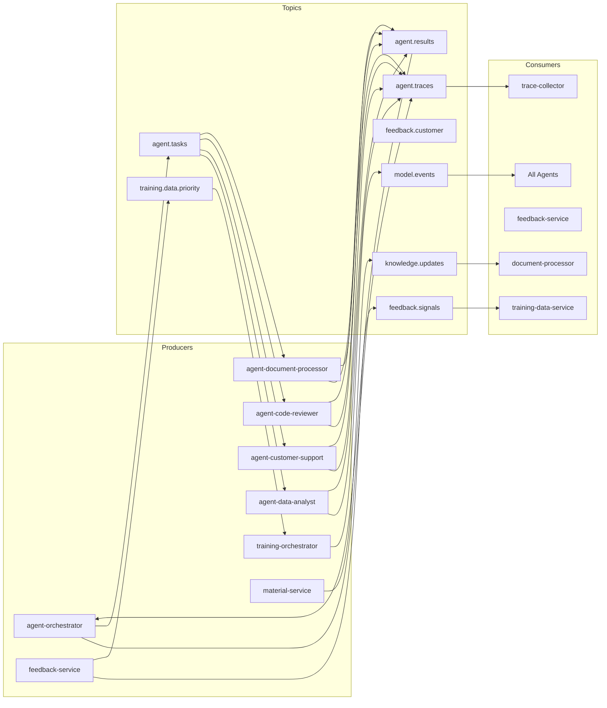

### 5.2 Topic Specifications

| Topic | Partitions | Replication Factor | Retention | Key | Value Schema |
|-------|-----------|-------------------|-----------|-----|-------------|
| `agent.traces` | 6 | 3 | 90 days | traceId (String) | AgentTraceEvent |
| `feedback.signals` | 3 | 3 | 30 days | traceId (String) | FeedbackSignalEvent |
| `feedback.customer` | 3 | 3 | 30 days | customerId (String) | CustomerFeedbackEvent |
| `knowledge.updates` | 3 | 3 | 7 days | materialId (String) | KnowledgeUpdateEvent |
| `training.data.priority` | 1 | 3 | 7 days | correctionId (String) | TrainingExampleEvent |
| `agent.tasks` | 6 | 3 | 1 day | taskId (String) | AgentTaskEvent |
| `agent.results` | 6 | 3 | 1 day | taskId (String) | AgentResultEvent |
| `model.events` | 1 | 3 | 30 days | modelName (String) | ModelEvent |

### 5.3 Message Schemas

#### 5.3.1 AgentTraceEvent

```json
{
  "$schema": "https://json-schema.org/draft/2020-12/schema",
  "type": "object",
  "required": ["traceId", "tenantId", "agentType", "timestamp"],
  "properties": {
    "traceId": { "type": "string" },
    "tenantId": { "type": "string", "format": "uuid" },
    "agentType": { "type": "string" },
    "skillId": { "type": "string" },
    "modelUsed": { "type": "string" },
    "taskType": { "type": "string" },
    "complexityLevel": { "type": "string", "enum": ["SIMPLE", "MODERATE", "COMPLEX", "CODE_SPECIFIC"] },
    "requestContent": { "type": "string" },
    "responseContent": { "type": "string" },
    "confidenceScore": { "type": "number", "minimum": 0, "maximum": 1 },
    "turnsUsed": { "type": "integer" },
    "latencyMs": { "type": "integer" },
    "tokenCountInput": { "type": "integer" },
    "tokenCountOutput": { "type": "integer" },
    "pipelineRunId": { "type": "string" },
    "toolCalls": {
      "type": "array",
      "items": {
        "type": "object",
        "properties": {
          "toolName": { "type": "string" },
          "arguments": { "type": "string" },
          "result": { "type": "string" },
          "latencyMs": { "type": "integer" },
          "success": { "type": "boolean" }
        }
      }
    },
    "pipelineSteps": {
      "type": "array",
      "items": {
        "type": "object",
        "properties": {
          "stepName": { "type": "string" },
          "durationMs": { "type": "integer" },
          "status": { "type": "string" }
        }
      }
    },
    "status": { "type": "string", "enum": ["COMPLETED", "FAILED", "TIMEOUT"] },
    "errorMessage": { "type": "string" },
    "timestamp": { "type": "string", "format": "date-time" }
  }
}
```

#### 5.3.2 FeedbackSignalEvent

```json
{
  "$schema": "https://json-schema.org/draft/2020-12/schema",
  "type": "object",
  "required": ["traceId", "signalType", "timestamp"],
  "properties": {
    "traceId": { "type": "string" },
    "tenantId": { "type": "string", "format": "uuid" },
    "signalType": { "type": "string", "enum": ["POSITIVE", "NEGATIVE", "CORRECTION"] },
    "rating": { "type": "integer", "minimum": 1, "maximum": 5 },
    "comment": { "type": "string" },
    "correctedResponse": { "type": "string" },
    "correctionReason": { "type": "string" },
    "userId": { "type": "string", "format": "uuid" },
    "agentType": { "type": "string" },
    "timestamp": { "type": "string", "format": "date-time" }
  }
}
```

#### 5.3.3 ModelEvent

```json
{
  "$schema": "https://json-schema.org/draft/2020-12/schema",
  "type": "object",
  "required": ["eventType", "modelName", "version", "timestamp"],
  "properties": {
    "eventType": { "type": "string", "enum": ["DEPLOYED", "ROLLED_BACK", "SHADOW_START", "SHADOW_END", "RETIRED"] },
    "modelName": { "type": "string" },
    "version": { "type": "string" },
    "previousVersion": { "type": "string" },
    "qualityScore": { "type": "number" },
    "trafficPercentage": { "type": "number" },
    "environment": { "type": "string" },
    "timestamp": { "type": "string", "format": "date-time" }
  }
}
```

### 5.4 Consumer Group Strategy

| Consumer Group | Topics | Instances | Strategy |
|---------------|--------|-----------|----------|
| `trace-collector-group` | agent.traces | 2 | All traces consumed by trace-collector for persistence |
| `training-data-group` | feedback.signals | 1 | Single consumer ensures ordering per trace |
| `feedback-customer-group` | feedback.customer | 2 | External customer feedback processing |
| `knowledge-processor-group` | knowledge.updates | 2 | Document chunking and embedding |
| `training-priority-group` | training.data.priority | 1 | Priority corrections processed sequentially |
| `agent-task-{agentType}` | agent.tasks | 1 per agent type | Each agent type has its own consumer group |
| `model-events-{service}` | model.events | 1 per service | Every agent service subscribes for model updates |

### 5.5 Dead Letter Queue Configuration

Each consumer group has a corresponding DLQ topic for messages that fail processing after maximum retries.

```yaml
# Shared Kafka consumer DLQ config
spring:
  kafka:
    consumer:
      properties:
        spring.kafka.listener.concurrency: 3
    listener:
      ack-mode: RECORD
      default-error-handler:
        type: DefaultErrorHandler
        back-off:
          initial-interval: 1000
          multiplier: 2.0
          max-interval: 30000
        max-retries: 3
```

| Source Topic | DLQ Topic | Retry Policy |
|-------------|-----------|-------------|
| agent.traces | agent.traces.dlq | 3 retries, exponential backoff |
| feedback.signals | feedback.signals.dlq | 3 retries, exponential backoff |
| training.data.priority | training.data.priority.dlq | 5 retries (critical data) |
| knowledge.updates | knowledge.updates.dlq | 3 retries |
| agent.tasks | agent.tasks.dlq | 2 retries (time-sensitive) |
| model.events | model.events.dlq | 3 retries |

---

## 6. Security Architecture

**Status:** [PLANNED]
**Cross-Reference:** 01-PRD Section 7, 02-Tech-Spec Section 1.2

### 6.1 JWT Token Validation Flow

All API requests pass through the Spring Cloud Gateway, which validates the JWT issued by Keycloak before routing to downstream services.

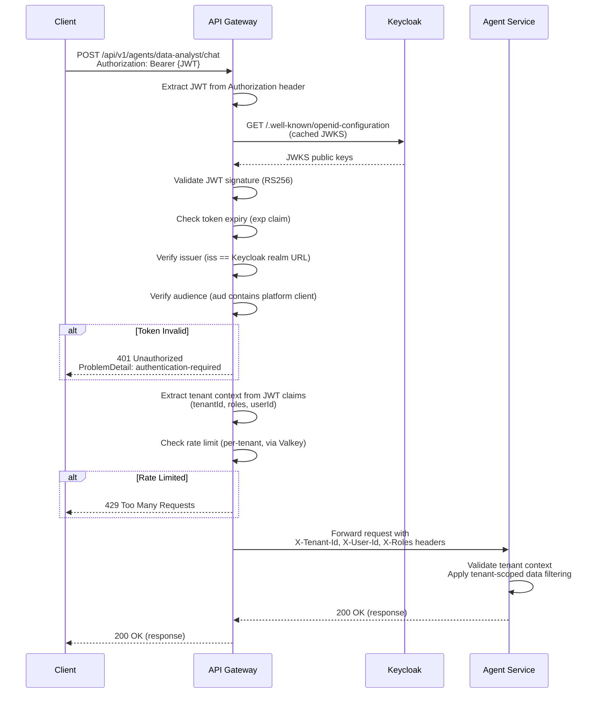

### 6.2 Tenant Context Extraction

The JWT issued by Keycloak contains custom claims for tenant isolation:

```json
{
  "sub": "user-uuid-here",
  "iss": "https://keycloak.example.com/realms/emsist",
  "aud": "agent-platform",
  "exp": 1709741234,
  "iat": 1709737634,
  "realm_access": {
    "roles": ["USER", "DOMAIN_EXPERT"]
  },
  "tenant_id": "tenant-uuid-here",
  "tenant_namespace": "acme-corp",
  "preferred_username": "john.doe@acme.com"
}
```

The gateway extracts these claims and propagates them as HTTP headers:

| JWT Claim | Propagated Header | Used By |
|-----------|------------------|---------|
| `tenant_id` | `X-Tenant-Id` | All services for data scoping |
| `sub` | `X-User-Id` | Audit fields (createdBy, updatedBy) |
| `realm_access.roles` | `X-Roles` | Authorization checks |
| `tenant_namespace` | `X-Tenant-Namespace` | Vector store namespace selection |

### 6.3 API Gateway Route Security Rules

```yaml
# Security filter chain for the API Gateway
spring:
  security:
    oauth2:
      resourceserver:
        jwt:
          issuer-uri: ${KEYCLOAK_ISSUER_URI}
          jwk-set-uri: ${KEYCLOAK_ISSUER_URI}/protocol/openid-connect/certs

# Route-level security rules
gateway:
  security:
    routes:
      # Public endpoints (no auth required)
      - pattern: /actuator/health
        auth: NONE
      - pattern: /eureka/**
        auth: NONE

      # User-level endpoints
      - pattern: /api/v1/agents/*/chat
        auth: AUTHENTICATED
        roles: [USER, DOMAIN_EXPERT, ML_ENGINEER, ADMIN]
      - pattern: /api/v1/pipeline/execute
        auth: AUTHENTICATED
        roles: [USER, DOMAIN_EXPERT, ML_ENGINEER, ADMIN]
      - pattern: /api/v1/feedback/**
        auth: AUTHENTICATED
        roles: [USER, DOMAIN_EXPERT, ML_ENGINEER, ADMIN]

      # Domain expert endpoints
      - pattern: /api/v1/skills/**
        auth: AUTHENTICATED
        roles: [DOMAIN_EXPERT, ML_ENGINEER, ADMIN]
      - pattern: /api/v1/tools/**
        auth: AUTHENTICATED
        roles: [DOMAIN_EXPERT, ML_ENGINEER, ADMIN]
      - pattern: /api/v1/patterns/**
        auth: AUTHENTICATED
        roles: [DOMAIN_EXPERT, ML_ENGINEER, ADMIN]
      - pattern: /api/v1/materials/**
        auth: AUTHENTICATED
        roles: [DOMAIN_EXPERT, ML_ENGINEER, ADMIN]

      # ML Engineer endpoints
      - pattern: /api/v1/training/**
        auth: AUTHENTICATED
        roles: [ML_ENGINEER, ADMIN]
      - pattern: /api/v1/models/**
        auth: AUTHENTICATED
        roles: [ML_ENGINEER, ADMIN]

      # Admin-only endpoints
      - pattern: /api/v1/tenants/**
        auth: AUTHENTICATED
        roles: [ADMIN]
      - pattern: /api/v1/validation/rules
        auth: AUTHENTICATED
        roles: [ADMIN, ML_ENGINEER]
```

### 6.4 RBAC Role Definitions

| Role | Description | Permissions |
|------|-------------|------------|
| `USER` | End user interacting with agents | Chat with agents, submit feedback (ratings and corrections), view own traces |
| `DOMAIN_EXPERT` | Business analyst managing skills and patterns | All USER permissions + create/update skills, register tools, add patterns, upload materials |
| `ML_ENGINEER` | ML team managing training pipeline | All DOMAIN_EXPERT permissions + trigger training, manage models, view all traces, configure validation rules |
| `ADMIN` | Platform administrator | All permissions + tenant management, user management, system configuration |

### 6.5 Service-to-Service Authentication

Internal service-to-service calls (between microservices within the platform) use propagated JWT tokens. The gateway passes the original user's JWT to downstream services, which re-validate it.

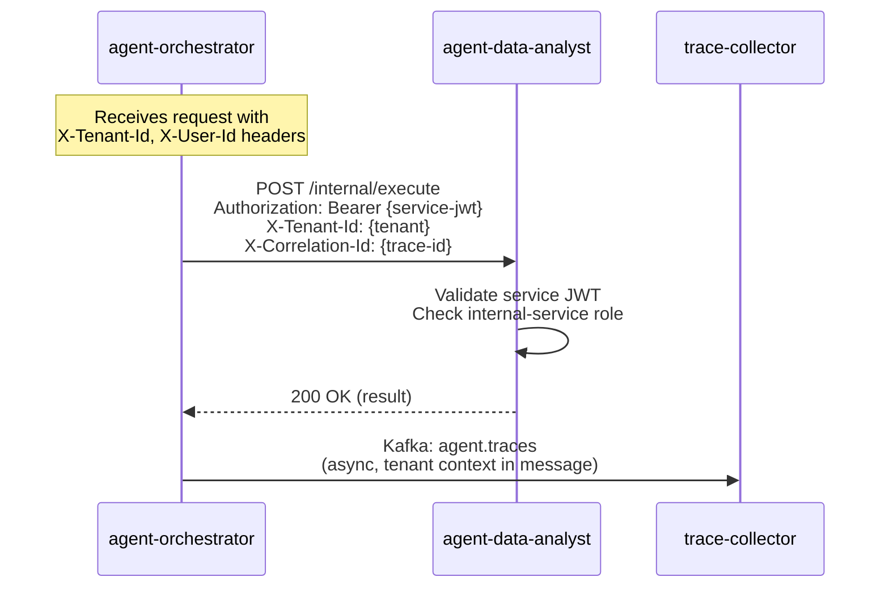

For async Kafka communication, tenant context is embedded directly in the message payload (not in headers), ensuring tenant isolation persists across async boundaries.

### 6.6 Data Protection

| Data Category | At Rest | In Transit | Access Control |
|--------------|---------|-----------|----------------|
| User messages | PostgreSQL encryption (via PDE or TDE) | TLS 1.3 | Tenant-scoped queries |
| Agent responses | PostgreSQL encryption | TLS 1.3 | Tenant-scoped queries |
| Embeddings (vector store) | PGVector within PostgreSQL | TLS 1.3 | Tenant namespace filtering |
| Training data | Encrypted volume mounts | TLS 1.3 | ML_ENGINEER role only |
| Model weights | Encrypted Ollama volume | N/A (local only) | ADMIN role for deployment |
| API keys (Claude, etc.) | Kubernetes Secrets / Vault | Env var injection | Never in code/config files |
| Kafka messages | Disk encryption | SASL_SSL | Consumer group ACLs |

---

## 7. Data Flow Diagrams

**Status:** [PLANNED]
**Cross-Reference:** 01-PRD Section 3.1, 02-Tech-Spec Sections 3.9, 4.1-4.5

### 7.1 Seven-Step Request Pipeline (Sequence Diagram)

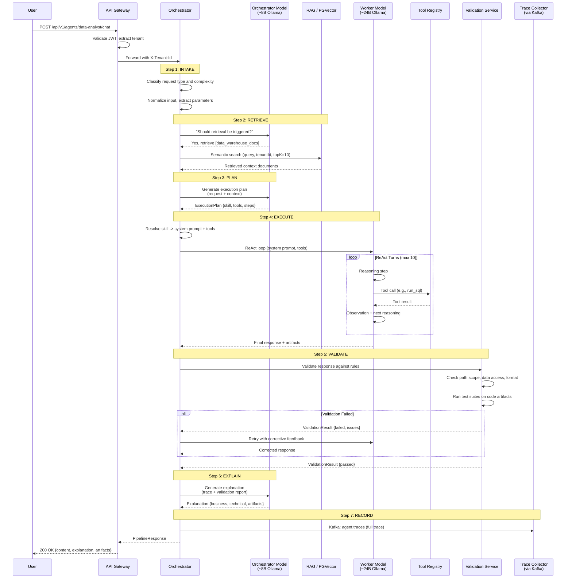

### 7.2 Training Data Flow

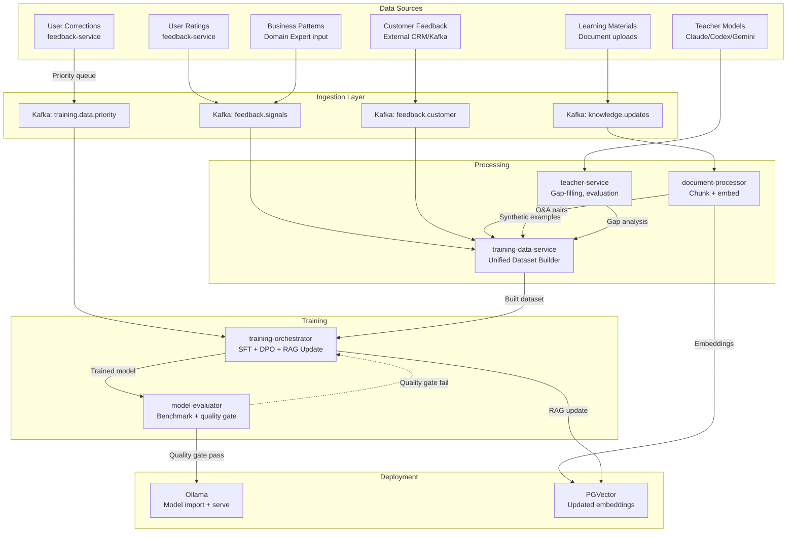

### 7.3 Feedback Loop (User Rating to Model Improvement)

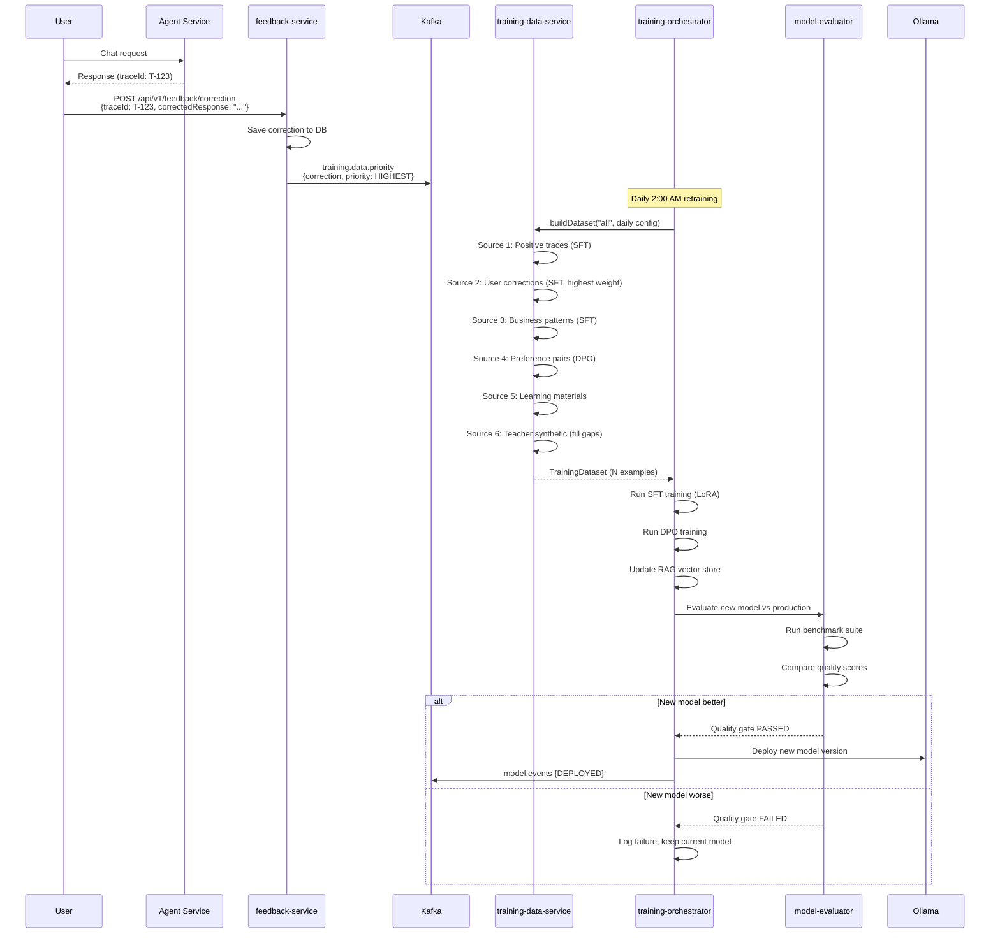

### 7.4 Tenant Isolation in Vector Store Queries

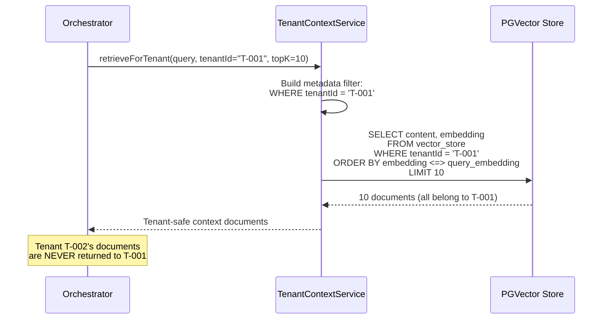

---

## 8. Class Diagrams

**Status:** [PLANNED]
**Cross-Reference:** 02-Tech-Spec Sections 3.1-3.12

### 8.1 BaseAgent Hierarchy

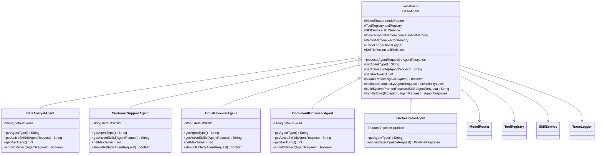

### 8.2 Request Pipeline Components

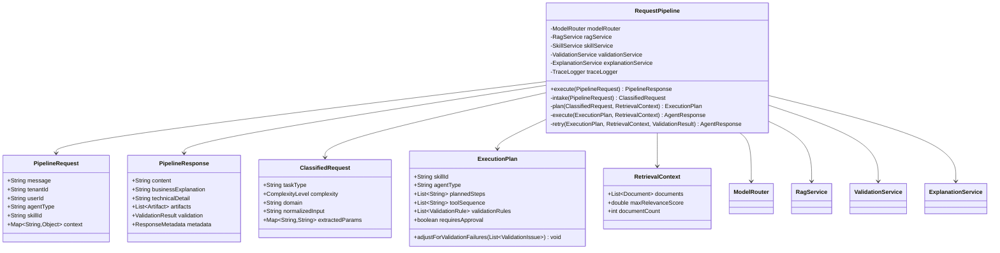

### 8.3 Skill and Tool System

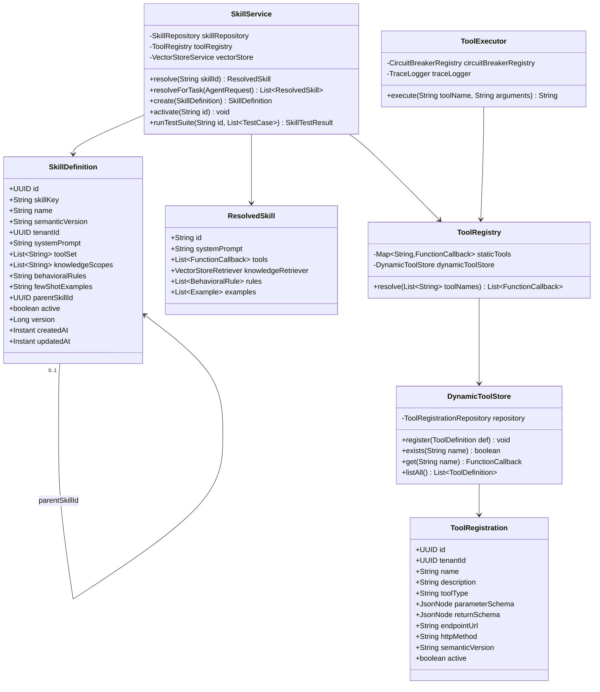

### 8.4 Validation Service Chain

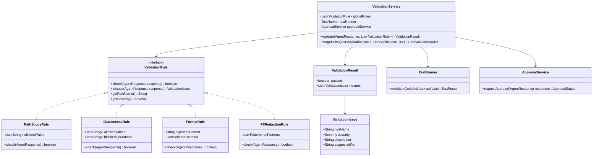

### 8.5 TraceLogger and AgentTrace

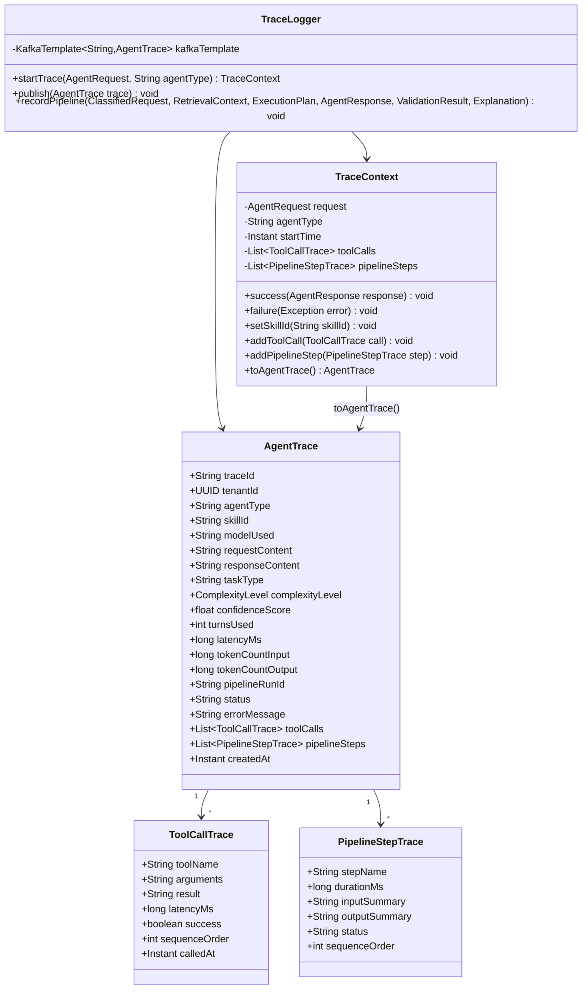

### 8.6 Model Router

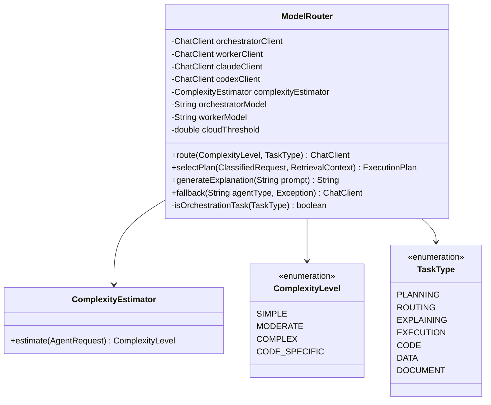

### 8.7 Learning Pipeline Classes

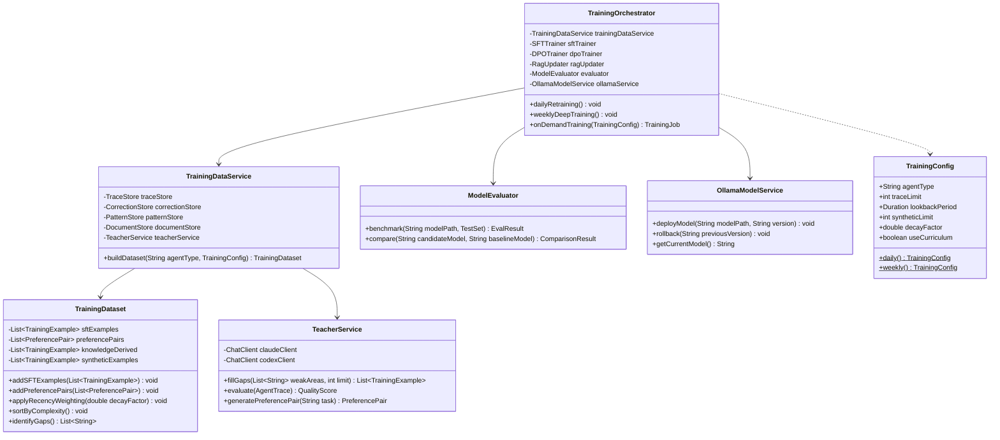

---

## Appendix A: Service Port Allocation

| Service | Port | Category |
|---------|------|----------|
| eureka-server | 8761 | Infrastructure |
| config-server | 8888 | Infrastructure |
| api-gateway | 8080 | Infrastructure |
| agent-orchestrator | 8090 | Agent |
| agent-data-analyst | 8091 | Agent |
| agent-customer-support | 8092 | Agent |
| agent-code-reviewer | 8093 | Agent |
| agent-document-processor | 8094 | Agent |
| trace-collector | 8095 | Learning |
| feedback-service | 8096 | Learning |
| teacher-service | 8097 | Learning |
| training-data-service | 8098 | Learning |
| training-orchestrator | 8099 | Learning |
| model-evaluator | 8100 | Learning |

## Appendix B: Technology Stack Summary

| Layer | Technology | Version | Purpose |
|-------|-----------|---------|---------|
| Runtime | Java | 21 (LTS) | Application runtime |
| Framework | Spring Boot | 3.4.1 | Microservice framework |
| Cloud | Spring Cloud | 2024.0.0 | Service discovery, config, gateway |
| AI | Spring AI | 1.0.0 | LLM integration (Ollama, Claude, OpenAI) |
| Database | PostgreSQL | 16+ | Relational data store |
| Vector DB | PGVector | 0.7.4+ | Embedding storage for RAG |
| Cache | Valkey | 8+ | Session cache, rate limiting |
| Messaging | Apache Kafka | 3.7+ | Inter-service async communication |
| LLM Runtime | Ollama | Latest | Local model serving |
| Service Discovery | Netflix Eureka | Via Spring Cloud | Service registry |
| Circuit Breaker | Resilience4j | Via Spring Cloud | Fault tolerance |
| Migration | Flyway | 10.21+ | Database schema versioning |
| Build | Maven | 3.9+ | Multi-module build |
| Container | Docker | Latest | Service containerization |

## Appendix C: Cross-Reference Matrix

| LLD Section | PRD Section | Tech-Spec Section | Epic/Story |
|-------------|-------------|-------------------|------------|
| 1. Maven Config | 2.2 | 1.1, 2 | US-1.1 to US-1.5 |
| 2. App Config | 2.2 | 7.1, 7.2 | US-1.2, US-1.3 |
| 3. DB Schema | 3.4, 3.5, 4.1-4.5 | 3.7, 3.12, 4.1-4.5 | US-2.3, US-4.1, US-5.1 |
| 4. API Contracts | 3.1-3.7 | 8.1-8.7 | US-2.1, US-3.1, US-4.1, US-11.1 |
| 5. Kafka Topics | 2.2 | 6 | US-1.4, US-5.1 |
| 6. Security | 7.1, 7.2 | 1.2 | US-1.5, US-13.1 |
| 7. Data Flows | 3.1, 4.1-4.5 | 3.9, 4.1-4.5 | US-11.1, US-5.1, US-4.2 |
| 8. Class Diagrams | 3.2, 3.4, 3.5, 3.6 | 3.1-3.12 | US-2.1, US-2.2, US-2.3, US-11.1 |
