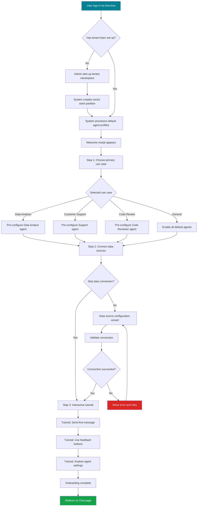
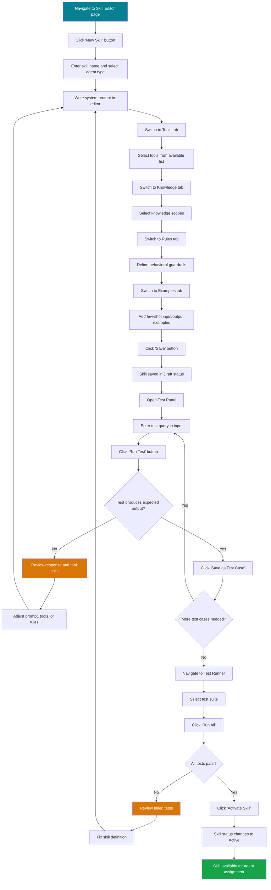
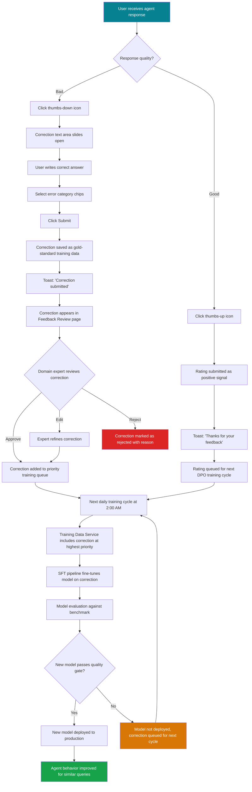
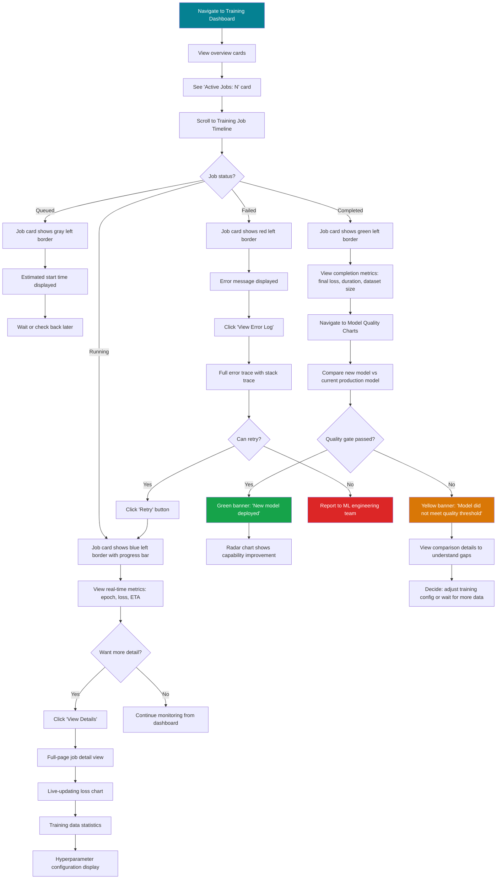
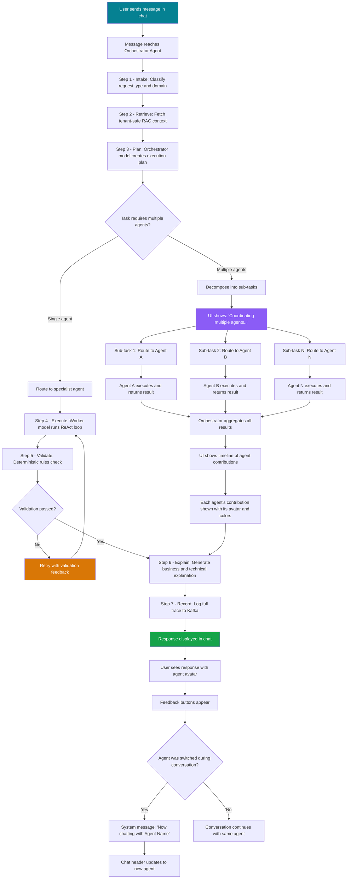

# UI/UX Design Specification: AI Agent Platform

**Product Name:** [PRODUCT_NAME] AI Agent Platform
**Version:** 1.0
**Date:** March 6, 2026
**Status:** [PLANNED] -- Design specification; no frontend implementation exists yet
**Owner:** UX Agent

**Scope:** This document defines the complete UI/UX design system, component library, page layouts, responsive breakpoints, accessibility requirements, interaction patterns, animation specifications, and user flows for the AI Agent Platform frontend. All sections are [PLANNED] design artifacts to guide DEV agent implementation.

**Framework:** Angular 21+ with PrimeNG standalone components
**Design System:** Extends the EMSIST neumorphic design system (emisi-ui) with AI-platform-specific tokens

---

## Table of Contents

1. [Design System Foundation](#1-design-system-foundation)
2. [Component Library (PrimeNG-based)](#2-component-library-primeng-based)
3. [Page Layouts and Wireframes](#3-page-layouts-and-wireframes)
4. [Responsive Breakpoints](#4-responsive-breakpoints)
5. [Accessibility (WCAG AAA)](#5-accessibility-wcag-aaa)
6. [Interaction Patterns](#6-interaction-patterns)
7. [Animation and Motion](#7-animation-and-motion)
8. [User Flows](#8-user-flows-mermaid-diagrams)

---

## 1. Design System Foundation

**Status:** [PLANNED]

The AI Agent Platform extends the existing EMSIST design system (`emisi-ui`) with tokens, patterns, and components specific to conversational AI, agent management, and training pipeline visualization. All design tokens follow the 8px grid and are compatible with both light and dark mode.

### 1.1 Color Palette

#### 1.1.1 Primary Colors

| Token | Hex (Light) | Hex (Dark) | Usage |
|-------|-------------|------------|-------|
| `--ai-primary` | `#058192` | `#07A0B5` | Primary actions, active agent indicators, links |
| `--ai-primary-hover` | `#046D7D` | `#09B8D0` | Hover state for primary elements |
| `--ai-primary-pressed` | `#035A66` | `#0BCEE5` | Active/pressed state |
| `--ai-primary-subtle` | `#E6F5F7` | `#0A2E33` | Primary tinted backgrounds |
| `--ai-forest` | `#054239` | `#06B09A` | Brand headers, navigation chrome |
| `--ai-forest-light` | `#0A5C50` | `#08C4AC` | Secondary brand surface |

#### 1.1.2 Secondary Colors

| Token | Hex (Light) | Hex (Dark) | Usage |
|-------|-------------|------------|-------|
| `--ai-surface` | `#FFFFFF` | `#1A1A2E` | Card surfaces, panels |
| `--ai-surface-raised` | `#F8FAFC` | `#212140` | Slightly elevated surfaces |
| `--ai-surface-overlay` | `#FFFFFF` | `#2A2A4A` | Modals, dropdowns, popovers |
| `--ai-background` | `#F1F5F9` | `#0F0F23` | Page background |
| `--ai-background-chat` | `#F8FAFC` | `#141428` | Chat area background |
| `--ai-border` | `#E2E8F0` | `#2D2D50` | Default borders |
| `--ai-border-subtle` | `#F1F5F9` | `#1E1E38` | Subtle dividers |

#### 1.1.3 Accent Colors (Agent Identity)

Each agent type has a distinct accent color for avatars, status indicators, and skill badges:

| Token | Hex | Agent Type | Usage |
|-------|-----|------------|-------|
| `--ai-agent-orchestrator` | `#8B5CF6` | Orchestrator | Purple -- coordination, routing |
| `--ai-agent-data` | `#3B82F6` | Data Analyst | Blue -- analytics, charts |
| `--ai-agent-support` | `#10B981` | Customer Support | Green -- help, resolution |
| `--ai-agent-code` | `#F59E0B` | Code Reviewer | Amber -- code, security |
| `--ai-agent-document` | `#EC4899` | Document Processor | Pink -- documents, parsing |
| `--ai-agent-custom` | `#6366F1` | Custom Agents | Indigo -- user-defined |

#### 1.1.4 Semantic Colors

| Token | Hex (Light) | Hex (Dark) | Usage |
|-------|-------------|------------|-------|
| `--ai-success` | `#16A34A` | `#22C55E` | Completed training, passed validation, healthy service |
| `--ai-success-bg` | `#F0FDF4` | `#052E16` | Success background fill |
| `--ai-warning` | `#D97706` | `#F59E0B` | Low confidence, approaching limits, degraded |
| `--ai-warning-bg` | `#FFFBEB` | `#422006` | Warning background fill |
| `--ai-error` | `#DC2626` | `#EF4444` | Failed training, service down, validation failure |
| `--ai-error-bg` | `#FEF2F2` | `#450A0A` | Error background fill |
| `--ai-info` | `#2563EB` | `#60A5FA` | Informational messages, tips, documentation links |
| `--ai-info-bg` | `#EFF6FF` | `#172554` | Info background fill |

#### 1.1.5 Chat-Specific Colors

| Token | Hex (Light) | Hex (Dark) | Usage |
|-------|-------------|------------|-------|
| `--ai-bubble-user` | `#058192` | `#058192` | User message bubble background |
| `--ai-bubble-user-text` | `#FFFFFF` | `#FFFFFF` | User message text |
| `--ai-bubble-agent` | `#F1F5F9` | `#212140` | Agent message bubble background |
| `--ai-bubble-agent-text` | `#1E293B` | `#E2E8F0` | Agent message text |
| `--ai-bubble-system` | `#FEF3C7` | `#422006` | System messages (connection, errors) |
| `--ai-code-bg` | `#1E293B` | `#0F172A` | Code block background in messages |
| `--ai-code-text` | `#E2E8F0` | `#F1F5F9` | Code block text |
| `--ai-tool-bg` | `#F0FDF4` | `#052E16` | Tool execution panel background |
| `--ai-tool-border` | `#BBF7D0` | `#166534` | Tool execution panel border |

### 1.2 Typography Scale

Based on a **1.250 (Major Third)** scale with `16px` base size. The system uses the EMSIST system font stack for UI text and a monospace stack for code/agent output.

#### 1.2.1 Font Families

| Token | Stack | Usage |
|-------|-------|-------|
| `--ai-font-sans` | `-apple-system, BlinkMacSystemFont, 'Segoe UI', Roboto, 'Helvetica Neue', Arial, sans-serif` | All UI text |
| `--ai-font-mono` | `'JetBrains Mono', 'Fira Code', 'SF Mono', 'Cascadia Code', Consolas, monospace` | Code blocks, tool output, agent traces |
| `--ai-font-arabic` | `'Noto Sans Arabic', 'Segoe UI', Tahoma, sans-serif` | RTL/Arabic content |

#### 1.2.2 Type Scale

| Token | Size (rem/px) | Line Height | Weight | Usage |
|-------|---------------|-------------|--------|-------|
| `--ai-text-display` | `2.441rem / 39px` | 1.2 | 700 | Page hero titles (rare) |
| `--ai-text-h1` | `1.953rem / 31px` | 1.25 | 700 | Page titles |
| `--ai-text-h2` | `1.563rem / 25px` | 1.3 | 600 | Section headings |
| `--ai-text-h3` | `1.25rem / 20px` | 1.4 | 600 | Card titles, panel headers |
| `--ai-text-body` | `1rem / 16px` | 1.6 | 400 | Body text, chat messages |
| `--ai-text-body-medium` | `1rem / 16px` | 1.6 | 500 | Emphasized body text |
| `--ai-text-small` | `0.875rem / 14px` | 1.5 | 400 | Secondary text, timestamps, metadata |
| `--ai-text-caption` | `0.75rem / 12px` | 1.4 | 400 | Captions, badges, labels |
| `--ai-text-code` | `0.875rem / 14px` | 1.6 | 400 | Code blocks (monospace) |
| `--ai-text-code-small` | `0.75rem / 12px` | 1.5 | 400 | Inline code, trace output |

#### 1.2.3 Text Colors

| Token | Hex (Light) | Hex (Dark) | Usage |
|-------|-------------|------------|-------|
| `--ai-text-primary` | `#1E293B` | `#F1F5F9` | Primary body text |
| `--ai-text-secondary` | `#64748B` | `#94A3B8` | Secondary/muted text |
| `--ai-text-tertiary` | `#94A3B8` | `#64748B` | Timestamps, placeholders |
| `--ai-text-disabled` | `#CBD5E1` | `#475569` | Disabled elements |
| `--ai-text-link` | `#058192` | `#07A0B5` | Links, interactive text |
| `--ai-text-on-primary` | `#FFFFFF` | `#FFFFFF` | Text on primary-colored backgrounds |
| `--ai-text-on-dark` | `#F1F5F9` | `#F1F5F9` | Text on dark surfaces |

### 1.3 Spacing System

Based on an **8px grid** with a 4px half-step for fine adjustments.

| Token | Value | Common Usage |
|-------|-------|-------------|
| `--ai-space-0` | `0px` | Reset |
| `--ai-space-0-5` | `2px` | Hairline borders, micro-gaps |
| `--ai-space-1` | `4px` | Inline icon gaps, badge padding |
| `--ai-space-2` | `8px` | Tight padding, list item gaps |
| `--ai-space-3` | `12px` | Input padding vertical, compact card padding |
| `--ai-space-4` | `16px` | Default component padding, input padding horizontal |
| `--ai-space-5` | `20px` | Medium component padding |
| `--ai-space-6` | `24px` | Card padding, section gaps |
| `--ai-space-8` | `32px` | Panel padding, major section spacing |
| `--ai-space-10` | `40px` | Page-level spacing |
| `--ai-space-12` | `48px` | Large section dividers |
| `--ai-space-16` | `64px` | Page margins on desktop |
| `--ai-space-20` | `80px` | Hero sections |

### 1.4 Border Radius

| Token | Value | Usage |
|-------|-------|-------|
| `--ai-radius-none` | `0px` | Sharp edges (tables, full-bleed) |
| `--ai-radius-sm` | `4px` | Badges, chips, small buttons |
| `--ai-radius-md` | `8px` | Cards, inputs, standard buttons |
| `--ai-radius-lg` | `12px` | Modals, panels, chat bubbles |
| `--ai-radius-xl` | `16px` | Floating action buttons, large cards |
| `--ai-radius-2xl` | `24px` | Message bubbles, pill shapes |
| `--ai-radius-full` | `9999px` | Circular avatars, dots |

### 1.5 Shadows and Elevation

Three elevation levels following the neumorphic design system. In dark mode, shadows shift to subtle light edges.

| Token | Light Mode Value | Dark Mode Value | Usage |
|-------|-----------------|-----------------|-------|
| `--ai-shadow-sm` | `0 1px 2px rgba(0,0,0,0.06)` | `0 1px 2px rgba(0,0,0,0.3)` | Flat cards, list items |
| `--ai-shadow-md` | `0 4px 12px rgba(0,0,0,0.08)` | `0 4px 12px rgba(0,0,0,0.4)` | Raised cards, dropdowns |
| `--ai-shadow-lg` | `0 8px 24px rgba(0,0,0,0.12)` | `0 8px 24px rgba(0,0,0,0.5)` | Modals, floating panels |
| `--ai-shadow-chat` | `0 2px 8px rgba(0,0,0,0.06)` | `0 2px 8px rgba(0,0,0,0.3)` | Chat message bubbles |
| `--ai-shadow-focus` | `0 0 0 3px rgba(5,129,146,0.4)` | `0 0 0 3px rgba(7,160,181,0.5)` | Focus rings (accessibility) |

### 1.6 Dark Mode Considerations

The AI platform is expected to be used during extended coding/analysis sessions, making dark mode a primary consideration rather than an afterthought.

**Implementation strategy:**

- All colors defined as CSS custom properties toggled by `[data-theme="dark"]` on `<html>`
- User preference stored in localStorage and synchronized with tenant-level theme settings
- Respect `prefers-color-scheme` media query as the default
- Transition between modes uses `transition: background-color 0.2s ease, color 0.2s ease` on `body`
- Code blocks use dark background in both modes (no jarring contrast shift)
- Charts and graphs adapt palette via theme-aware chart configuration
- All text/background combinations maintain WCAG AAA contrast in both modes

**Dark mode specific adjustments:**

| Element | Light Approach | Dark Adjustment |
|---------|---------------|-----------------|
| Code blocks | Dark background (`#1E293B`) | Slightly darker (`#0F172A`) |
| Agent avatars | Solid background | Add subtle `1px` lighter border |
| Tool panels | Light green tint | Deep green tint with increased border opacity |
| Charts | Black text on white | White text on dark, grid lines at 0.15 opacity |
| Skeleton loaders | Light gray shimmer | Dark gray shimmer with lower contrast |
| Scrollbars | Browser default | Custom thin scrollbar with `--ai-border` color |

---

## 2. Component Library (PrimeNG-based)

**Status:** [PLANNED]

All components use PrimeNG standalone components as the base layer, extended with AI-platform-specific styling via the design tokens above. Angular standalone components use `inject()` for dependency injection per EMSIST coding standards.

### 2.1 Chat Interface Components

#### 2.1.1 Message Bubble (`ai-message-bubble`)

The primary conversation unit. Two variants: user messages (right-aligned, primary color) and agent messages (left-aligned, surface color).

**Structure:**

- Outer container: `div.ai-message` with role `article` and `aria-label="Message from {sender}"`
- Avatar slot (agent only): 40px circular avatar with agent accent color, positioned left
- Bubble body: `div.ai-bubble` with border-radius `--ai-radius-2xl` (24px)
- Content area: supports Markdown rendering (via `ngx-markdown` or `marked`), including:
  - Inline code: monospace with `--ai-code-bg` background, `--ai-radius-sm` border radius
  - Fenced code blocks: syntax-highlighted with language label, copy button (top-right corner), line numbers optional
  - Tables: rendered with `p-table` styling (striped rows, sticky header)
  - Charts: rendered inline via PrimeNG `p-chart` (Chart.js wrapper)
  - Lists: standard Markdown ordered/unordered with `--ai-space-2` gaps
  - Links: styled with `--ai-text-link`, underline on hover
- Metadata row: timestamp (`--ai-text-caption` size), model badge (e.g., "Ollama 8B", "Claude"), confidence score (if available)
- Action row (agent messages only): thumbs-up, thumbs-down, copy, expand/collapse explanation

**Dimensions:**

| Property | User Bubble | Agent Bubble |
|----------|-------------|--------------|
| Max width | 70% of container | 80% of container |
| Min width | 60px | 120px |
| Padding | `16px 20px` | `16px 20px` |
| Border radius | `24px 24px 4px 24px` | `24px 24px 24px 4px` |
| Margin bottom | `8px` | `8px` |
| Background | `--ai-bubble-user` | `--ai-bubble-agent` |
| Text color | `--ai-bubble-user-text` | `--ai-bubble-agent-text` |

**Accessibility:**

- Each message has `role="article"` with `aria-label` including sender name and timestamp
- Code blocks have `role="code"` with accessible copy buttons
- Thumbs up/down buttons include `aria-label="Rate this response as helpful"` / `"Rate this response as unhelpful"`

#### 2.1.2 Typing Indicator / Streaming Response (`ai-streaming-indicator`)

Displays while the agent is generating a response. Two modes: "thinking" (before first token) and "streaming" (character-by-character rendering).

**Thinking mode:**

- Three animated dots inside an agent-style bubble
- Dots are 8px diameter circles with `--ai-text-tertiary` color
- Animation: sequential bounce with 0.6s period, 0.15s stagger
- `aria-live="polite"` with `aria-label="Agent is thinking..."`
- Timeout: if no response after 30 seconds, show "Taking longer than expected..." message with cancel option

**Streaming mode:**

- Agent bubble appears immediately at minimum height and grows as content streams in
- Text appears with a subtle fade-in (opacity 0 to 1 over 100ms per chunk)
- Markdown is rendered progressively -- headings and paragraphs complete before rendering
- Code blocks buffer until the closing fence is received, then render all at once with syntax highlighting
- Scroll-to-bottom behavior: auto-scroll if user is within 100px of bottom; otherwise show "New content below" indicator

#### 2.1.3 Tool Call Visualization (`ai-tool-panel`)

Expandable panel showing agent tool execution steps. Appears inline within the agent message bubble or immediately below it.

**Structure:**

- Container: `p-accordion` (PrimeNG accordion) with custom styling
- Header: tool icon + tool name + execution status badge + duration
- Body (collapsed by default): shows tool arguments (formatted JSON), tool response (formatted output), and any errors
- Status badges:
  - Running: animated spinner + "Executing..." in `--ai-info` color
  - Success: checkmark icon + "Completed" in `--ai-success` color
  - Failed: X icon + "Failed" in `--ai-error` color
  - Timed Out: clock icon + "Timed out" in `--ai-warning` color

**Multi-step execution:**

When an agent calls multiple tools, they appear as an ordered list within a `p-timeline` (PrimeNG timeline) component:

- Timeline runs vertically
- Each node shows: step number, tool name, status icon, duration
- Active step has pulsing indicator
- Completed steps show green checkmarks
- Lines between steps are solid (completed) or dashed (pending)

**Dimensions:**

| Property | Value |
|----------|-------|
| Container padding | `12px 16px` |
| Background | `--ai-tool-bg` |
| Border | `1px solid --ai-tool-border` |
| Border radius | `--ai-radius-md` (8px) |
| Max height (expanded) | `400px` with overflow scroll |
| Code font | `--ai-font-mono` at `--ai-text-code-small` |

#### 2.1.4 Agent Avatar / Icon System (`ai-agent-avatar`)

Circular avatar representing the current agent or agent type.

**Variants:**

| Size | Diameter | Usage |
|------|----------|-------|
| xs | 24px | Inline references, compact lists |
| sm | 32px | Chat sidebar conversation list |
| md | 40px | Chat message avatars |
| lg | 56px | Agent cards, detail headers |
| xl | 80px | Agent profile page hero |

**Rendering:**

- Background color: agent accent color (from Section 1.1.3)
- Icon: white SVG icon representing agent type (brain, chart, headset, code, document)
- Status dot: 10px circle positioned bottom-right, overlapping avatar by 2px
  - Online: `--ai-success` with subtle pulse animation
  - Busy: `--ai-warning` solid
  - Offline: `--ai-text-disabled` solid
  - Error: `--ai-error` solid
- Shape: perfect circle (`border-radius: --ai-radius-full`)
- Alt text: `"{Agent Name} - {Status}"` for screen readers

### 2.2 Agent Management Components

#### 2.2.1 Agent Card (`ai-agent-card`)

A `p-card` displaying an agent's summary information in the agent list/grid view.

**Layout:**

- Top section: agent avatar (lg size) + agent name (`--ai-text-h3`) + agent type badge
- Middle section:
  - Status indicator (online/offline/error) with text label
  - Active skill name and version
  - Model assignment (e.g., "Worker: Ollama 24B")
  - Performance sparkline (last 7 days response quality)
- Bottom section:
  - Action buttons: "Configure" (primary outline), "Chat" (primary solid), overflow menu (more actions)
  - Metrics row: avg latency, success rate, total conversations (small text)

**Dimensions:**

| Property | Value |
|----------|-------|
| Card width | `320px` (grid) or `100%` (list) |
| Card min-height | `280px` |
| Padding | `24px` |
| Border radius | `--ai-radius-md` (8px) |
| Shadow | `--ai-shadow-md` |
| Hover shadow | `--ai-shadow-lg` |
| Transition | `box-shadow 0.2s ease, transform 0.15s ease` |
| Hover transform | `translateY(-2px)` |

**Agent type badge colors:**

Uses the accent colors from Section 1.1.3, rendered as a `p-tag` (PrimeNG tag) component with `severity` mapped to agent type.

#### 2.2.2 Agent List/Grid with Filtering (`ai-agent-list`)

Switchable list/grid view using `p-dataView` (PrimeNG DataView) component.

**Controls bar:**

- Left: search input (`p-inputText` with search icon, 320px width)
- Center: filter chips (`p-chips`) for agent type, status, model
- Right: view toggle (grid/list icons using `p-selectButton`), sort dropdown (`p-dropdown`: by name, status, performance, last active)

**Grid layout:**

- CSS Grid with `auto-fill, minmax(320px, 1fr)` for responsive columns
- Gap: `--ai-space-6` (24px)
- Cards use `ai-agent-card` component

**List layout:**

- Each row: avatar (sm) + agent name + type badge + status + active skill + model + latency + actions
- Alternating row backgrounds using `p-table` stripedRows mode
- Row height: 56px
- Hover highlight: `--ai-primary-subtle` background

#### 2.2.3 Agent Creation Wizard (`ai-agent-wizard`)

Multi-step wizard using `p-steps` (PrimeNG Steps) component.

**Steps:**

1. **Basic Info** -- Name, description, agent type (dropdown from predefined types), icon selection
2. **Model Assignment** -- Select worker model (Ollama models dropdown), orchestrator model (auto-assigned), cloud fallback toggle and model selection
3. **Skill Assignment** -- Multi-select skills from available skill list (`p-listbox` with checkboxes), or create new skill inline
4. **Tool Configuration** -- Review tools provided by assigned skills, optionally add/remove individual tools (`p-pickList`)
5. **Behavioral Rules** -- Text area for guardrails, max turns slider (`p-slider`, range 1-20), self-reflection toggle, temperature slider (0.0-2.0)
6. **Review and Create** -- Summary of all selections, "Create" button (primary), "Create and Test" button (secondary)

**Wizard dimensions:**

| Property | Value |
|----------|-------|
| Dialog width | `800px` (desktop), `90vw` (mobile) |
| Dialog max-height | `85vh` |
| Step indicator height | `64px` |
| Content area min-height | `400px` |
| Footer height | `64px` with "Back", "Next", "Cancel" buttons |

### 2.3 Skill Management Components

#### 2.3.1 Skill Editor (`ai-skill-editor`)

Three-panel editor for creating and editing skills.

**Left panel (skill navigator, 280px wide):**

- `p-tree` (PrimeNG Tree) showing skills organized by agent type
- Drag-and-drop reordering within agent groups
- Context menu (right-click): Duplicate, Delete, Export, Version History
- "New Skill" button (primary, bottom of panel)
- Search filter at top

**Center panel (prompt editor, flex-grow):**

- Header: skill name (editable `p-inplace`), version badge, status indicator (Draft/Active/Deprecated)
- Tab bar (`p-tabView`):
  - **Prompt** tab: full-height text editor (Monaco-like) with markdown syntax highlighting, 100% width, min-height 300px. Font: `--ai-font-mono` at `--ai-text-code`. Background: `--ai-code-bg`
  - **Tools** tab: `p-pickList` showing available tools (left) and assigned tools (right)
  - **Knowledge** tab: `p-listbox` with checkboxes for selecting vector store scopes
  - **Rules** tab: text area for behavioral rules with template insertion buttons
  - **Examples** tab: list of few-shot examples. Each example has "Input" and "Expected Output" text areas. Add/remove buttons
  - **History** tab: version history list with diff viewer

**Right panel (test panel, 360px wide, collapsible):**

- Header: "Test Skill" with run button
- Input area: `p-inputTextarea` for test query
- Output area: rendered agent response preview
- Tool call log: scrollable list of tool calls made during test
- Quality score: displayed if teacher model evaluation is enabled
- "Save Test Case" button to add current input/output as a few-shot example

#### 2.3.2 Skill Version Comparison (`ai-skill-diff`)

Side-by-side comparison view for skill version changes. Uses `p-splitter` (PrimeNG Splitter) with two panels.

**Left panel:** Previous version content (read-only, highlighted deletions in `--ai-error-bg`)
**Right panel:** Current version content (read-only, highlighted additions in `--ai-success-bg`)

**Header:** Version selector dropdowns for each side (`p-dropdown`), unified diff toggle

**Diff categories shown:**

- System prompt changes (text diff)
- Tool set changes (added/removed tools highlighted)
- Knowledge scope changes
- Behavioral rule changes
- Example changes

#### 2.3.3 Skill Test Runner UI (`ai-skill-test-runner`)

Batch test execution panel for validating skills against test suites.

**Structure:**

- Test suite selector: `p-dropdown` with available test suites
- Test case table: `p-table` with columns: Test Name, Input (truncated), Expected, Actual, Status (Pass/Fail), Duration
- Summary bar: total tests, passed (green), failed (red), skipped (gray), average duration
- Failed test detail: expandable row showing full input, expected output, actual output, and diff
- Actions: "Run All", "Run Failed", "Export Results" buttons

### 2.4 Feedback Components

#### 2.4.1 Inline Feedback (`ai-feedback-inline`)

Non-intrusive rating controls appearing below each agent message.

**Compact mode (default):**

- Two icon buttons side by side: thumbs-up and thumbs-down (24px icons)
- Spacing: `--ai-space-2` (8px) gap
- Color: `--ai-text-tertiary` default, `--ai-success` when thumbs-up selected, `--ai-error` when thumbs-down selected
- On selection, briefly show "Thanks for your feedback" toast (auto-dismiss 2s)

**Expanded mode (triggers on thumbs-down or on "Add detail" link):**

- Slides down below the compact buttons with `200ms ease-out` animation
- `p-inputTextarea` with placeholder "What should the correct answer be?" (3 rows, auto-grow to 6)
- Category chips (`p-chips`): "Incorrect", "Incomplete", "Irrelevant", "Harmful", "Other"
- Submit button (primary, small) and Cancel link
- On submit: toast "Correction submitted -- it will be used to improve the agent"

#### 2.4.2 Detailed Feedback Form (`ai-feedback-form`)

Full-page form for domain expert feedback on agent traces.

**Layout:**

- Left column (60%): original agent trace display (scrollable, read-only)
  - Shows: user query, agent response, tool calls, execution time, model used
- Right column (40%): feedback form
  - Overall quality: 5-star rating (`p-rating`, star size 28px)
  - Category: `p-dropdown` with options: Accuracy, Completeness, Relevance, Safety, Style
  - Corrected response: `p-inputTextarea` (8 rows, full width)
  - Notes for training team: `p-inputTextarea` (4 rows)
  - Priority: `p-selectButton` with Low/Medium/High
  - Submit button (primary) and "Skip" link

#### 2.4.3 Feedback History Viewer (`ai-feedback-history`)

Paginated table showing submitted feedback with filtering and batch actions.

**Structure:**

- Filters bar: date range (`p-calendar` range mode), agent type (`p-multiSelect`), feedback type (`p-multiSelect`: Rating, Correction, Pattern), status (`p-multiSelect`: Pending, Reviewed, Applied, Rejected)
- Table: `p-table` with columns:
  - Date/Time (sortable)
  - Agent (with avatar, sortable)
  - User (who submitted)
  - Type (Rating/Correction/Pattern, as badge)
  - Summary (truncated to 100 chars)
  - Status (color-coded badge)
  - Actions (View, Apply, Reject)
- Pagination: `p-paginator` with 20 items per page, page size options [10, 20, 50]
- Batch actions: select checkbox column, "Apply Selected", "Reject Selected", "Export" buttons in toolbar

### 2.5 Training Dashboard Components

#### 2.5.1 Training Job Status Cards (`ai-training-card`)

Compact card showing a single training job's status.

**Layout:**

- Header: job name + type badge (SFT/DPO/Distillation/RAG Update)
- Progress bar: `p-progressBar` showing completion percentage
- Status: Running (animated), Completed (green), Failed (red), Queued (gray)
- Metrics row: dataset size, current epoch, loss value, estimated time remaining
- Footer: "View Details" link, "Cancel" button (for running jobs), "Retry" button (for failed jobs)

**Dimensions:**

| Property | Value |
|----------|-------|
| Card width | `380px` (grid) or `100%` (list) |
| Min height | `200px` |
| Padding | `20px` |
| Border radius | `--ai-radius-md` |
| Progress bar height | `8px` |
| Border-left | `4px solid {status-color}` |

#### 2.5.2 Model Quality Charts (`ai-quality-charts`)

Visualization suite for model performance metrics.

**Line chart (quality over time):**

- Uses `p-chart` (Chart.js) with type `line`
- X-axis: dates (last 30 days by default, configurable range)
- Y-axis: quality score (0-100)
- Lines: current model (solid `--ai-primary`), previous model (dashed `--ai-text-secondary`)
- Data points: circular markers (6px diameter) with tooltips showing exact values
- Grid: subtle horizontal lines at 25, 50, 75, 100

**Radar chart (capability profile):**

- Uses `p-chart` with type `radar`
- Axes: Accuracy, Helpfulness, Tool Use, Safety, Speed, Completeness
- Filled area: current model (primary color at 0.3 opacity), baseline (secondary at 0.15 opacity)
- Labels: `--ai-text-small` size

**Bar chart (training data distribution):**

- Uses `p-chart` with type `bar` (horizontal)
- Categories: Corrections, Patterns, Rated Traces, Materials, Teacher Data, Customer Feedback
- Bars colored by data priority (darker = higher priority)
- Value labels at end of each bar

#### 2.5.3 Data Source Health Indicators (`ai-data-health`)

Grid of small status cards showing the health of each training data source.

**Per-source card:**

- Icon representing source type (database, document, user, cloud)
- Source name
- Status dot (green/yellow/red)
- Last sync timestamp
- Record count
- Trend arrow (up/down/flat compared to previous period)
- Clicking opens a detail panel with sync history and error log

**Layout:** CSS Grid, `auto-fill, minmax(200px, 1fr)`, gap `16px`

### 2.6 Admin Dashboard Components

#### 2.6.1 Tenant Management Table (`ai-tenant-table`)

Full-featured `p-table` for managing platform tenants.

**Columns:**

| Column | Width | Features |
|--------|-------|----------|
| Tenant Name | 200px | Sortable, filterable (text) |
| Tenant ID | 140px | Copyable (click to copy UUID) |
| Status | 100px | Sortable, filterable (dropdown: Active/Suspended/Pending) |
| Agents | 80px | Count badge |
| Skills | 80px | Count badge |
| Data Volume | 120px | Formatted (e.g., "2.4 GB"), sortable |
| Last Active | 140px | Relative time ("3 hours ago"), sortable |
| Actions | 120px | Edit, Suspend/Activate, Delete (with confirmation) |

**Features:**

- Global search across all text columns
- Column reordering via drag-and-drop
- Row expansion showing tenant detail panel (settings, resource usage, agent list)
- Export: CSV, Excel via `p-table` built-in export
- Pagination: 25 items per page, configurable

#### 2.6.2 System Health Overview (`ai-system-health`)

Dashboard grid showing the status of all platform services, models, and queues.

**Service health grid:**

- Grid of `p-card` components, one per microservice
- Each card: service name, status (healthy/degraded/down), uptime percentage, last health check time, response latency (P50/P95)
- Color-coded left border: green (healthy), yellow (degraded), red (down)
- Clicking a card opens the service detail panel with metric history

**Model status section:**

- Cards for each loaded model (Orchestrator, Worker, cloud models)
- Metrics: requests/minute, average latency, token usage, GPU memory usage (for local models)
- Model version and last deployment date

**Queue status section:**

- Kafka topic monitoring cards
- Metrics: message throughput, consumer lag, dead letter queue size
- Color-coded lag indicators (green < 100, yellow < 1000, red >= 1000)

**Layout:** Responsive CSS grid with named areas:

```
Desktop (3 columns):
[services] [services] [models]
[services] [services] [queues]

Tablet (2 columns):
[services] [services]
[models]   [queues]

Mobile (1 column):
[services]
[models]
[queues]
```

---

## 3. Page Layouts and Wireframes

**Status:** [PLANNED]

All pages share a common shell: top navigation bar (56px height), optional sidebar (280px width on desktop), and main content area. The shell uses `p-menubar` for the top nav and a custom sidebar component.

### 3.1 Chat Page (Primary Interaction Surface)

The chat page is the primary user interaction surface. It follows a three-panel layout on desktop, collapsing to a single panel on mobile.

**Layout structure (Desktop, >1280px):**

```
+-------------------------------------------------------------------+
| Top Navigation Bar (56px)                                          |
|  Logo | Agent Selector Dropdown | Search | Notifications | Avatar  |
+------------+---------------------------------+--------------------+
| Sidebar    | Main Chat Area                  | Context Panel      |
| (280px)    | (flex-grow, min 480px)          | (360px, collapse)  |
|            |                                 |                    |
| Convo      | Message List                    | Knowledge          |
| History    |  (scrollable, flex-grow)        | Sources            |
| List       |                                 |                    |
|            |                                 | Retrieved          |
| New Chat   |                                 | Documents          |
| Button     |                                 |                    |
|            |                                 | Agent Info         |
| Filter     | +--------------------------+    | Card               |
| By Agent   | | Chat Input Area (120px)  |    |                    |
|            | | Multi-line + Attachments |    | Active Skill       |
|            | +--------------------------+    | Details            |
+------------+---------------------------------+--------------------+
```

**Sidebar (left, 280px):**

- Header: "Conversations" title with "New Chat" button (primary, full-width, 40px height)
- Search input: `p-inputText` with search icon, filters conversation list
- Conversation list: `p-listbox` with custom template per item:
  - Agent avatar (sm, 32px) + conversation title (truncated at 2 lines) + timestamp (relative)
  - Unread indicator: `--ai-primary` dot (8px)
  - Active conversation: `--ai-primary-subtle` background with left border accent
- Agent filter: `p-multiSelect` dropdown at bottom of sidebar, filter by agent type
- Collapsible: hamburger icon in top-nav toggles sidebar visibility

**Main Chat Area (center, flex-grow):**

- Chat header (56px): current agent avatar (md) + agent name + status dot + active skill badge + settings gear icon
- Message list: vertical scroll container with `scroll-behavior: smooth`
  - Messages alternate between user and agent bubbles (see Section 2.1.1)
  - Date separators between messages on different days: centered text "Today", "Yesterday", or date
  - System messages: centered, muted text with info icon (e.g., "Agent switched to Code Reviewer")
  - Tool call panels inline with agent messages (see Section 2.1.3)
  - "Scroll to bottom" floating button appears when scrolled up >200px from bottom
- Chat input area (variable height, min 56px, max 200px):
  - `p-inputTextarea` with auto-grow (1-6 rows)
  - Left controls: attach file button (paperclip icon, opens file dialog), voice input placeholder button (mic icon, disabled for v1)
  - Right controls: send button (arrow-up icon in primary circle, 40px diameter, disabled when empty)
  - Keyboard: Enter to send (unless Shift+Enter for newline)
  - Character count displayed when >80% of max length
  - File attachment preview: horizontal scroll of thumbnail chips above input

**Context Panel (right, 360px, collapsible):**

- Toggle button: chevron icon on left edge of panel to expand/collapse
- Section 1 -- Agent Info: agent avatar (lg) + name + type + description + model assignment
- Section 2 -- Active Skill: skill name + version + system prompt preview (truncated, "Show full" link)
- Section 3 -- Knowledge Sources: list of active RAG knowledge scopes with document counts
- Section 4 -- Retrieved Documents: when RAG retrieval happens, show retrieved document snippets ranked by relevance (similarity score badge)
- Section 5 -- Execution Trace: expandable summary of the last response's pipeline steps (Intake -> Retrieve -> Plan -> Execute -> Validate -> Explain -> Record) with status and timing

### 3.2 Agent Management Page

**Layout structure (Desktop):**

```
+-------------------------------------------------------------------+
| Top Navigation Bar (56px)                                          |
+-------------------------------------------------------------------+
| Page Header (80px)                                                 |
|  "Agent Management" (h1)                      [+ Create Agent]    |
+-------------------------------------------------------------------+
| Controls Bar (56px)                                                |
|  [Search...] [Type Filter] [Status Filter] [Model Filter] [Grid|List] |
+-------------------------------------------------------------------+
| Agent Grid / List (flex-grow, scrollable)                          |
|                                                                    |
|  +----------+  +----------+  +----------+  +----------+          |
|  | Agent    |  | Agent    |  | Agent    |  | Agent    |          |
|  | Card     |  | Card     |  | Card     |  | Card     |          |
|  |          |  |          |  |          |  |          |          |
|  +----------+  +----------+  +----------+  +----------+          |
|                                                                    |
+-------------------------------------------------------------------+
```

**Agent Detail View (opens as right drawer or full page):**

- Header: agent avatar (xl) + name (editable) + status toggle
- Tab bar (`p-tabView`):
  - **Overview** tab: description, created date, last active, total conversations, average quality score
  - **Configuration** tab: model assignment, max turns, temperature, self-reflection toggle, concurrency limits
  - **Skills** tab: assigned skills list with activation toggles, "Add Skill" button
  - **Performance** tab: latency chart, quality chart, tool usage breakdown, error rate
  - **Traces** tab: paginated trace history (`p-table`) with filtering by date, rating, confidence
  - **Feedback** tab: feedback summary and recent feedback items

### 3.3 Skill Editor Page

**Layout structure (Desktop, three-panel):**

```
+-------------------------------------------------------------------+
| Top Navigation Bar (56px)                                          |
+-------------------------------------------------------------------+
| Page Header (56px)                                                 |
|  "Skill Editor" (h1)  |  Skill: {name} v{version}  |  [Save] [Test] |
+----------+---------------------------------+-----------------------+
| Skill    | Editor Area                     | Test Panel            |
| Tree     | (flex-grow)                     | (360px, collapsible)  |
| (280px)  |                                 |                       |
|          | [Prompt|Tools|Knowledge|Rules|  |  Test Input           |
|          |  Examples|History]              |  [textarea]           |
|          |                                 |                       |
|          | Full-height editor content      |  [Run Test]           |
|          | (scrollable per tab)            |                       |
|          |                                 |  Test Output           |
|          |                                 |  (rendered response)   |
|          |                                 |                       |
|          |                                 |  Tool Calls            |
|          |                                 |  (execution log)       |
|          |                                 |                       |
|          |                                 |  Quality Score         |
|          |                                 |  [Save as Test Case]   |
+----------+---------------------------------+-----------------------+
```

See Section 2.3.1 for detailed component specifications for each panel.

### 3.4 Training Dashboard

**Layout structure (Desktop):**

```
+-------------------------------------------------------------------+
| Top Navigation Bar (56px)                                          |
+-------------------------------------------------------------------+
| Page Header (56px)                                                 |
|  "Training Dashboard" (h1)             [Trigger Training] [Settings] |
+-------------------------------------------------------------------+
| Overview Cards Row (120px)                                         |
|  +-------------+ +-------------+ +-------------+ +-------------+  |
|  | Active Jobs | | Model       | | Data        | | Next        |  |
|  | 3           | | Quality: 87 | | Volume:     | | Training:   |  |
|  |             | | (+2.1%)     | | 145K items  | | 2:00 AM     |  |
|  +-------------+ +-------------+ +-------------+ +-------------+  |
+-------------------------------------------------------------------+
| Two-Column Layout (flex-grow)                                      |
|  +------------------------------+ +-----------------------------+  |
|  | Training Job Timeline        | | Model Quality Charts        |  |
|  | (p-timeline, vertical)       | | (p-chart, line + radar)     |  |
|  |                              | |                             |  |
|  | * SFT Daily - Completed      | | [Line chart: 30-day trend]  |  |
|  | * DPO Weekly - Running (67%) | |                             |  |
|  | * RAG Update - Queued        | | [Radar chart: capability]   |  |
|  |                              | |                             |  |
|  +------------------------------+ +-----------------------------+  |
|  +------------------------------+ +-----------------------------+  |
|  | Data Source Health           | | Training Data Distribution  |  |
|  | (health indicator grid)      | | (p-chart, horizontal bar)   |  |
|  +------------------------------+ +-----------------------------+  |
+-------------------------------------------------------------------+
```

**Overview cards:** use `p-card` with large center number (`--ai-text-display`), label above (`--ai-text-caption`), and trend indicator below (arrow + percentage).

**Training Job Timeline:** `p-timeline` component showing recent and upcoming training jobs chronologically, with status icons and expandable details.

**Model Comparison View (accessed via "Compare Models" button):**

- Side-by-side metrics table: current production model vs. candidate model
- Per-metric comparison with delta and pass/fail indicator against quality gates
- Radar chart overlay (both models on one chart)
- "Deploy Candidate" and "Reject Candidate" action buttons

### 3.5 Feedback Review Page

**Layout structure (Desktop):**

```
+-------------------------------------------------------------------+
| Top Navigation Bar (56px)                                          |
+-------------------------------------------------------------------+
| Page Header (56px)                                                 |
|  "Feedback Review" (h1)        [Batch Apply] [Batch Reject] [Export] |
+-------------------------------------------------------------------+
| Filters Bar (56px)                                                 |
|  [Date Range] [Agent Type] [Feedback Type] [Status] [Priority]    |
+-------------------------------------------------------------------+
| Split View (flex-grow)                                             |
|  +------------------------------+ +-----------------------------+  |
|  | Feedback Queue (50%)         | | Detail View (50%)           |  |
|  | (p-table, selectable rows)   | |                             |  |
|  |                              | | Original Query              |  |
|  | [x] Date  Agent  Type Status | | [user message display]      |  |
|  | [x] ...                      | |                             |  |
|  | [ ] ...                      | | Original Response           |  |
|  | [ ] ...                      | | [agent message display]     |  |
|  |                              | |                             |  |
|  | Pagination (20/page)         | | Corrected Response          |  |
|  |                              | | [correction text, highlighted |  |
|  |                              | |  differences]               |  |
|  |                              | |                             |  |
|  |                              | | [Apply] [Reject] [Edit]     |  |
|  +------------------------------+ +-----------------------------+  |
+-------------------------------------------------------------------+
```

**Side-by-side diff view:**

When a correction is selected, the detail panel shows the original response on top and the corrected response below, with a visual diff highlighting additions (green background) and removals (red strikethrough).

### 3.6 System Admin Page

**Layout structure (Desktop):**

```
+-------------------------------------------------------------------+
| Top Navigation Bar (56px)                                          |
+-------------------------------------------------------------------+
| Page Header (56px)                                                 |
|  "System Administration" (h1)                          [Settings]  |
+-------------------------------------------------------------------+
| Tab Bar (48px)                                                     |
|  [Services] [Tenants] [Models] [Configuration]                    |
+-------------------------------------------------------------------+
| Tab Content (flex-grow)                                            |
|                                                                    |
| Services Tab:                                                      |
|   Service health grid (see Section 2.6.2)                          |
|                                                                    |
| Tenants Tab:                                                       |
|   Tenant management table (see Section 2.6.1)                     |
|                                                                    |
| Models Tab:                                                        |
|   Model deployment controls:                                       |
|   - Loaded models table (name, version, size, GPU memory, status) |
|   - Deploy new model: file upload + version input + deploy button  |
|   - Rollback: version selector + rollback button (with confirm)    |
|   - A/B test controls: traffic split slider, metrics comparison    |
|                                                                    |
| Configuration Tab:                                                 |
|   Key-value configuration editor (p-table editable cells)          |
|   - Training schedule (cron expressions)                           |
|   - Quality gate thresholds                                        |
|   - Rate limits per tenant                                         |
|   - Cloud model API key management (masked)                       |
+-------------------------------------------------------------------+
```

---

## 4. Responsive Breakpoints

**Status:** [PLANNED]

Three breakpoints define the responsive behavior of all pages.

### 4.1 Breakpoint Definitions

| Breakpoint | Range | Layout Model | Grid Columns |
|------------|-------|-------------|-------------|
| Desktop | >1280px | Full 3-panel layout, all sidebars visible | 12-column grid |
| Tablet | 768px - 1279px | Collapsible sidebar, stacked panels | 8-column grid |
| Mobile | <768px | Single panel, bottom navigation | 4-column grid |

### 4.2 Chat Page Responsive Behavior

| Element | Desktop (>1280px) | Tablet (768-1279px) | Mobile (<768px) |
|---------|-------------------|---------------------|-----------------|
| Left sidebar | Always visible (280px) | Drawer overlay (toggle via hamburger) | Drawer overlay (toggle via hamburger) |
| Main chat area | Center column (flex-grow) | Full width when sidebar hidden | Full width |
| Right context panel | Always visible (360px) | Drawer overlay (toggle via info icon) | Hidden (accessible via swipe-left gesture or info icon) |
| Chat input | Fixed at bottom of main area | Fixed at bottom of viewport | Fixed at bottom of viewport |
| Agent selector | Dropdown in top nav | Dropdown in top nav | Bottom sheet selector |
| Message bubbles max-width | 70% user / 80% agent | 75% user / 85% agent | 85% user / 95% agent |
| Tool call panels | Inline, full width | Inline, full width | Inline, full width (scrollable horizontally for wide content) |

### 4.3 Agent Management Page Responsive Behavior

| Element | Desktop (>1280px) | Tablet (768-1279px) | Mobile (<768px) |
|---------|-------------------|---------------------|-----------------|
| Grid columns | 4 cards per row | 2 cards per row | 1 card per row (full width) |
| Agent detail | Right drawer (480px) | Full-page overlay | Full-page overlay |
| Controls bar | Single row | Single row (search full-width on second row if needed) | Stacked: search full-width, filters in horizontal scroll |
| Create wizard dialog | 800px centered modal | 90vw modal | Full-screen modal (sheet from bottom) |

### 4.4 Skill Editor Page Responsive Behavior

| Element | Desktop (>1280px) | Tablet (768-1279px) | Mobile (<768px) |
|---------|-------------------|---------------------|-----------------|
| Skill tree panel | Always visible (280px) | Drawer overlay | Hidden, accessible via dropdown selector at top |
| Editor area | Center (flex-grow) | Full width | Full width |
| Test panel | Always visible (360px) | Bottom sheet (50vh) | Full-screen overlay (tab) |
| Tab bar | Horizontal tabs | Horizontal tabs (scrollable) | Bottom tab bar |

### 4.5 Training Dashboard Responsive Behavior

| Element | Desktop (>1280px) | Tablet (768-1279px) | Mobile (<768px) |
|---------|-------------------|---------------------|-----------------|
| Overview cards | 4 columns | 2 columns | 1 column (full width, horizontal scroll option) |
| Two-column layout | Side by side (50/50) | Stacked (full width each) | Stacked (full width each) |
| Charts | Full size | Full width, reduced height | Full width, compact aspect ratio (16:10) |
| Timeline | Vertical left-aligned | Vertical left-aligned | Vertical center-aligned |

### 4.6 Mobile Navigation Pattern

On mobile (<768px), the top navigation bar is replaced with:

- **Top bar (48px):** Current page title (centered) + hamburger menu (left) + notifications (right)
- **Bottom navigation (56px + safe area):** Fixed bottom bar with 5 tabs:
  - Chat (message icon)
  - Agents (robot icon)
  - Skills (brain icon)
  - Training (chart icon)
  - Admin (gear icon)
- Active tab: `--ai-primary` color, label visible
- Inactive tabs: `--ai-text-secondary` color, icon only
- Safe area: padding-bottom for iOS home indicator

---

## 5. Accessibility (WCAG AAA)

**Status:** [PLANNED]

The AI Agent Platform targets WCAG 2.1 AAA compliance. This section defines the accessibility requirements, keyboard navigation patterns, screen reader annotations, and high-contrast mode support.

### 5.1 Color Contrast Requirements

WCAG AAA requires stricter contrast ratios than AA:

| Element Type | Minimum Contrast Ratio | Verification Method |
|-------------|------------------------|-------------------|
| Normal text (<18pt / <14pt bold) | 7:1 | All `--ai-text-*` against their backgrounds |
| Large text (>=18pt / >=14pt bold) | 4.5:1 | Headings `--ai-text-h1` through `--ai-text-h3` |
| UI components and graphics | 3:1 | Buttons, icons, borders, chart elements |
| Focus indicators | 3:1 against adjacent colors | `--ai-shadow-focus` ring |
| Placeholder text | 4.5:1 | `--ai-text-tertiary` against input background |

**Verified contrast ratios (light mode):**

| Foreground | Background | Ratio | Pass? |
|-----------|------------|-------|-------|
| `#1E293B` (text-primary) | `#FFFFFF` (surface) | 13.5:1 | AAA |
| `#1E293B` (text-primary) | `#F8FAFC` (surface-raised) | 12.9:1 | AAA |
| `#64748B` (text-secondary) | `#FFFFFF` (surface) | 4.9:1 | AAA Large |
| `#94A3B8` (text-tertiary) | `#FFFFFF` (surface) | 3.0:1 | Fail normal, borderline UI |
| `#058192` (primary) | `#FFFFFF` (surface) | 4.7:1 | AAA Large |
| `#FFFFFF` (on-primary) | `#058192` (primary) | 4.7:1 | AAA Large |

**Note:** `--ai-text-tertiary` is used ONLY for non-essential decorative text (timestamps alongside other identifying content). Critical information never relies on tertiary text alone.

### 5.2 Keyboard Navigation Patterns

#### 5.2.1 Global Keyboard Shortcuts

| Shortcut | Action | Context |
|----------|--------|---------|
| `Ctrl+K` / `Cmd+K` | Open command palette (global search) | Anywhere |
| `Ctrl+N` / `Cmd+N` | New conversation | Chat page |
| `Ctrl+/` / `Cmd+/` | Show keyboard shortcuts dialog | Anywhere |
| `Escape` | Close modal/drawer/panel | When modal/drawer/panel is open |
| `Ctrl+Shift+D` | Toggle dark mode | Anywhere |
| `Tab` | Move to next focusable element | Standard |
| `Shift+Tab` | Move to previous focusable element | Standard |

#### 5.2.2 Chat Interface Keyboard Navigation

| Shortcut | Action | Context |
|----------|--------|---------|
| `Enter` | Send message | Chat input focused |
| `Shift+Enter` | New line in message | Chat input focused |
| `Ctrl+Enter` | Send message (alternative) | Chat input focused |
| `Arrow Up` | Edit last sent message | Chat input focused, empty |
| `Escape` | Cancel editing/clear input | Chat input focused |
| `Alt+Arrow Up/Down` | Navigate between messages | Message list focused |
| `Space` or `Enter` | Expand/collapse tool call panel | Tool panel header focused |
| `T` then `U` / `D` | Thumbs up / Thumbs down | Message focused (with feedback bar visible) |
| `Ctrl+C` | Copy message content | Message focused |
| `F6` | Cycle between panels (sidebar, chat, context) | Chat page |

**Focus management during streaming:**

- Focus remains on the chat input while agent is responding
- `aria-live="polite"` region announces "Agent response received" when streaming completes
- Auto-scroll does NOT steal focus
- User can Tab to the new message after streaming completes

#### 5.2.3 Tab Order Specification

The tab order follows logical reading order (left to right, top to bottom):

**Chat page tab order:**

1. Skip navigation link ("Skip to chat input")
2. Top navigation: logo, agent selector, search, notifications, user avatar
3. Sidebar: new chat button, search input, conversation list items (top to bottom)
4. Chat header: agent name link, settings button
5. Message list: messages in chronological order, each message's action buttons
6. Chat input: attachment button, textarea, send button
7. Context panel (if visible): sections in order

### 5.3 Screen Reader Annotations

#### 5.3.1 ARIA Roles and Labels

| Component | Role | ARIA Attributes |
|-----------|------|-----------------|
| Chat message list | `role="log"` | `aria-label="Conversation messages"`, `aria-live="polite"` |
| Individual message | `role="article"` | `aria-label="Message from {sender} at {time}"` |
| User message | `role="article"` | `aria-label="Your message at {time}"` |
| Agent message | `role="article"` | `aria-label="Response from {agent name} at {time}"` |
| Code block in message | `role="code"` | `aria-label="Code block in {language}"` |
| Tool call panel | `role="region"` | `aria-label="Tool execution: {tool name}"` |
| Copy button | `role="button"` | `aria-label="Copy {context} to clipboard"` |
| Agent avatar | `role="img"` | `aria-label="{agent name}, {status}"` |
| Streaming indicator | `role="status"` | `aria-live="polite"`, `aria-label="Agent is generating response"` |
| Chat input | `role="textbox"` | `aria-label="Message to {agent name}"`, `aria-multiline="true"` |
| Conversation list | `role="listbox"` | `aria-label="Conversation history"` |
| Conversation item | `role="option"` | `aria-label="{title}, {agent}, {time}"`, `aria-selected="{boolean}"` |
| Feedback thumbs up | `role="button"` | `aria-label="Rate this response as helpful"`, `aria-pressed="{boolean}"` |
| Feedback thumbs down | `role="button"` | `aria-label="Rate this response as unhelpful"`, `aria-pressed="{boolean}"` |
| Training progress bar | `role="progressbar"` | `aria-label="{job name} progress"`, `aria-valuenow="{%}"`, `aria-valuemin="0"`, `aria-valuemax="100"` |

#### 5.3.2 Screen Reader Announcements

| Event | Announcement | Priority |
|-------|-------------|----------|
| New agent message received | "Response from {agent name}: {first 100 chars}..." | polite |
| Tool execution started | "{tool name} is executing" | polite |
| Tool execution completed | "{tool name} completed in {duration}" | polite |
| Tool execution failed | "{tool name} failed: {error summary}" | assertive |
| Streaming started | "Agent is generating a response" | polite |
| Streaming completed | "Response complete" | polite |
| Feedback submitted | "Feedback submitted. Thank you." | polite |
| Connection lost | "Connection to server lost. Attempting to reconnect..." | assertive |
| Connection restored | "Connection restored" | polite |
| Training job completed | "Training job {name} completed successfully" | polite |
| Training job failed | "Training job {name} failed: {reason}" | assertive |

### 5.4 Focus Management

#### 5.4.1 Modal Focus Trapping

When any modal opens (`p-dialog`, `p-confirmDialog`, `p-sidebar`):

- Focus moves to the first focusable element inside the modal
- Tab cycling is trapped within the modal
- Escape key closes the modal
- Focus returns to the triggering element on close
- Background content receives `aria-hidden="true"` and `inert` attribute

#### 5.4.2 Dynamic Content Focus

| Scenario | Focus Behavior |
|----------|---------------|
| New message appears | Focus stays on chat input; `aria-live` announces the message |
| Agent starts streaming | Focus stays on chat input; streaming indicator is aria-live |
| Tool panel expands | Focus stays on the trigger button |
| Conversation switched | Focus moves to the chat input of the new conversation |
| Search results update | Focus stays on search input; result count announced |
| Wizard step changes | Focus moves to the first focusable element in the new step |
| Toast notification | Auto-dismiss; `role="alert"` for errors, `role="status"` for info |

### 5.5 High Contrast Mode

Support for `prefers-contrast: more` and Windows High Contrast Mode:

- All borders increase to `2px` minimum
- All focus indicators increase to `3px` outline with `2px` offset
- Background/foreground pairs use at least 10:1 contrast
- Chart elements use patterns in addition to color (hatching, dotting)
- Agent accent colors include text labels (not color-only differentiation)
- Status indicators include icon + text (not just colored dots)
- All interactive elements have visible borders in high contrast

### 5.6 RTL/Arabic Layout Support

The platform must support right-to-left text direction for Arabic-speaking users:

| Element | RTL Behavior |
|---------|-------------|
| Chat messages | User bubbles on left, agent bubbles on right |
| Sidebar | Positioned on right side |
| Context panel | Positioned on left side |
| Text alignment | Body text right-aligned, code blocks left-aligned |
| Icons | Directional icons (arrows, chevrons) mirrored |
| Navigation | Tab order reversed (right to left) |
| Numbers | Western Arabic numerals (not Eastern Arabic, unless locale specifies) |
| Timestamps | Right-aligned in LTR, left-aligned in RTL |
| Progress bars | Fill from right to left |

**Implementation:** Use `[dir="rtl"]` CSS selectors and CSS logical properties (`margin-inline-start`, `padding-inline-end`, etc.) instead of physical properties.

---

## 6. Interaction Patterns

**Status:** [PLANNED]

### 6.1 Chat Input Patterns

#### 6.1.1 Multi-Line Input

- Default: single line, expands to multi-line as user types
- Auto-grow from 1 row (56px) to 6 rows (200px max)
- Shift+Enter inserts newline; Enter sends message
- Text wraps at container width
- Undo/redo support (Ctrl+Z / Ctrl+Shift+Z)
- Paste support for plain text and formatted text (auto-converts to markdown)

#### 6.1.2 File Attachment

- Trigger: paperclip icon button or drag-and-drop onto chat input area
- Accepted file types: `.pdf`, `.docx`, `.txt`, `.md`, `.csv`, `.xlsx`, `.png`, `.jpg`, `.json`, `.yaml`
- Max file size: 10 MB per file, 25 MB total per message
- Drag-and-drop: overlay with dashed border and "Drop files here" text appears when file is dragged over chat area
- Preview: attached files appear as horizontal chips above the input, each with filename, size, and remove (X) button
- Upload progress: `p-progressBar` inside each chip during upload

#### 6.1.3 Voice Input (Placeholder)

- Microphone icon button (disabled in v1 with tooltip "Coming soon")
- When implemented: tap-to-record with waveform visualization, auto-transcription, editable transcript before sending

### 6.2 Streaming Response Pattern

**Character-by-character rendering with markdown:**

1. Agent bubble appears with typing indicator (3 dots)
2. First token arrives: indicator replaced with text
3. Tokens stream in and are appended to the message
4. Markdown rendering is progressive:
   - Inline formatting (bold, italic, code) renders as complete tokens arrive
   - Block elements (headers, lists, blockquotes) render when the line is complete (newline received)
   - Code blocks buffer until the closing ``` fence arrives, then render all at once with syntax highlighting
   - Tables buffer until complete, then render as `p-table` styled elements
5. During streaming, a subtle blinking cursor (2px wide, `--ai-primary` color) appears at the insertion point
6. When streaming completes, cursor disappears and feedback buttons fade in (200ms)

**Error during streaming:**

- If connection drops mid-stream: partial message remains visible, system message appears below: "Connection lost. Response may be incomplete." with "Retry" button
- If model times out: message shows "The agent took too long to respond." with "Retry" button
- Retry preserves the original user message

### 6.3 Tool Execution Visualization

**Step-by-step expandable pattern:**

1. During agent execution, when a tool is called, a compact tool indicator appears inline in the agent message: `[icon] Running {tool_name}...` with animated spinner
2. When the tool completes, the indicator updates to show status (success/failure) and duration
3. User can click/tap the indicator to expand the full tool panel (see Section 2.1.3)
4. For multi-tool sequences, a numbered timeline appears showing all tool calls in order

**Tool approval flow (for tools with `requiresApproval: true`):**

1. Tool execution pauses and a notification card appears:
   - Tool name + icon
   - Arguments summary (formatted JSON)
   - Agent's reasoning for calling this tool
   - Two buttons: "Approve" (primary) and "Reject" (secondary)
   - Auto-reject timer if configured (countdown displayed)
2. On approve: tool executes and agent continues
3. On reject: agent receives rejection feedback and may choose an alternative approach

### 6.4 Agent Switching

When user switches agents mid-conversation or the orchestrator routes to a different agent:

1. System message appears: "Switching to {Agent Name}..." with agent avatar
2. Chat header updates: new agent avatar, name, and skill badge
3. Context panel updates: new agent info, new skill details
4. Conversation continues in the same thread (conversation history preserved)
5. Visual separator: horizontal line with agent icon and text "Now chatting with {Agent Name}"

**Context preservation:**

- Conversation history remains visible
- Previous agent's messages retain their original avatar and styling
- New agent has access to the conversation history up to its context window limit
- If context is truncated, a system message notes: "Context may be limited due to conversation length"

### 6.5 Feedback Flow

**Non-intrusive inline rating:**

1. After each agent response, thumbs-up and thumbs-down icons appear with low opacity (0.5)
2. On hover (or focus), opacity increases to 1.0
3. Clicking thumbs-up: icon turns green, brief "Thanks!" tooltip, rating submitted
4. Clicking thumbs-down: icon turns red, correction text area slides down (200ms ease-out)
5. If correction text provided and submitted: "Correction saved" toast
6. User can change their rating by clicking the other thumb
7. After rating, both icons remain visible but smaller (20px instead of 24px)

### 6.6 Error States

| Error | Visual Treatment | Recovery Action |
|-------|-----------------|----------------|
| Connection lost | Banner at top of chat: red background, "Connection lost" text, animated reconnection dots | Auto-retry every 5s; "Retry now" button |
| Model timeout | Inline message in chat: "Agent did not respond within {timeout}s" | "Retry" button resends the same message |
| Validation failure | Agent message with warning banner: "Response validation failed: {reason}. Retrying..." | Auto-retry (up to 2x), then "The agent could not produce a valid response" with "Try different approach" button |
| Rate limit exceeded | Banner: "Rate limit reached. Please wait {cooldown}s." with countdown | Auto-countdown, input disabled until cooldown expires |
| Service unavailable | Full-page overlay: "Service temporarily unavailable" with animated illustration | "Check status" link to system health page |
| File upload failed | Chip turns red with error icon and tooltip: "{error reason}" | "Retry upload" button on the chip |
| Authentication expired | Modal overlay: "Your session has expired" | "Sign in again" button redirects to login |

### 6.7 Empty States

| Context | Message | Visual | Action |
|---------|---------|--------|--------|
| No conversations | "Start your first conversation" | Centered illustration of a chat bubble with sparkles | "New Chat" button (primary, large) |
| No agents | "No agents configured yet" | Centered illustration of a robot | "Create Agent" button (primary, large) |
| No skills | "Create your first skill" | Centered illustration of a brain with gears | "New Skill" button (primary, large) |
| No training data | "No training data available" | Centered illustration of an empty database | "Upload Data" button + "Learn more" link |
| No feedback | "No feedback received yet" | Centered illustration of speech bubbles | "How feedback works" link |
| Search no results | "No results for '{query}'" | Centered search icon with X | "Clear search" link, suggestion chips |
| Empty conversation | "Ask me anything!" (agent greeting) | Agent avatar with wave animation | Suggestion chips with sample questions |

### 6.8 Loading States

**Skeleton screens by component:**

| Component | Skeleton Pattern |
|-----------|-----------------|
| Agent card | Rectangle (avatar) + 3 text lines (varying width) + 2 button outlines |
| Message bubble | Rounded rectangle with 3 shimmering text lines |
| Conversation list item | Circle (avatar) + 2 text lines |
| Training card | Left border + 2 text lines + progress bar outline + metric placeholders |
| Table row | Row of shimmering cells matching column widths |
| Chart | Rectangle outline with axis lines and shimmering fill |
| Data source health card | Icon placeholder + 2 text lines + status dot |

**Skeleton animation:** subtle left-to-right shimmer gradient using `background-size: 200% 100%` with `animation: shimmer 1.5s ease-in-out infinite`. Colors: `--ai-border` to `--ai-border-subtle` to `--ai-border`.

**Loading sequence:**

1. Page shell (nav, sidebar structure) renders immediately
2. Content areas show skeleton loaders
3. API calls fire in parallel
4. Each section replaces its skeleton independently as data arrives
5. Minimum skeleton display time: 300ms (prevents flash for fast loads)

---

## 7. Animation and Motion

**Status:** [PLANNED]

All animations follow the principle of purposeful motion: animations convey meaning (element appearing, state change) rather than decoration. All durations and easings are defined as CSS custom properties for consistency.

### 7.1 Timing Tokens

| Token | Value | Usage |
|-------|-------|-------|
| `--ai-duration-instant` | `100ms` | Micro-interactions (hover color change) |
| `--ai-duration-fast` | `200ms` | Small element transitions (tooltips, badges) |
| `--ai-duration-normal` | `300ms` | Standard transitions (panel expand, page elements) |
| `--ai-duration-slow` | `500ms` | Large element transitions (modals, drawers) |
| `--ai-easing-standard` | `cubic-bezier(0.4, 0.0, 0.2, 1)` | General-purpose easing |
| `--ai-easing-enter` | `cubic-bezier(0.0, 0.0, 0.2, 1)` | Elements entering the screen |
| `--ai-easing-exit` | `cubic-bezier(0.4, 0.0, 1, 1)` | Elements leaving the screen |
| `--ai-easing-bounce` | `cubic-bezier(0.34, 1.56, 0.64, 1)` | Playful bounce (typing dots) |

### 7.2 Message Appearance

When a new message appears in the chat:

**User message:**

- `transform: translateX(20px)` to `translateX(0)` -- slides in from the right
- `opacity: 0` to `1`
- Duration: `--ai-duration-fast` (200ms)
- Easing: `--ai-easing-enter`

**Agent message:**

- `transform: translateY(16px)` to `translateY(0)` -- slides up from below
- `opacity: 0` to `1`
- Duration: `--ai-duration-fast` (200ms)
- Easing: `--ai-easing-enter`
- Stagger: if multiple elements (message + tool panel), 100ms delay between each

### 7.3 Tool Execution Accordion

**Expand:**

- `max-height: 0` to `max-height: {content-height}` (calculated)
- `opacity: 0` to `1`
- Duration: `--ai-duration-normal` (300ms)
- Easing: `--ai-easing-standard`
- Content fades in after container expands (50ms delay)

**Collapse:**

- Reverse of expand
- Content fades out first (100ms), then container collapses (200ms)
- Easing: `--ai-easing-exit`

### 7.4 Agent Status Transitions

**Online pulse:**

- Status dot scales 1.0 to 1.3 to 1.0 with opacity 1.0 to 0.5 to 1.0
- Duration: 2s, infinite loop
- Only when agent is in "online" status

**Status change:**

- Old status dot fades out (100ms)
- New status dot fades in with brief scale animation (1.2 to 1.0, 200ms)
- Toast notification appears for significant changes (online to offline, error)

### 7.5 Chart Data Updates

When chart data updates (e.g., new training metrics arrive):

- New data points animate in from the previous value to the new value
- Line charts: line draws from the previous end point to the new point
- Bar charts: bar grows from previous height to new height
- Duration: `--ai-duration-slow` (500ms)
- Easing: `--ai-easing-standard`
- Chart.js `animation` config:

```typescript
animation: {
  duration: 500,
  easing: 'easeInOutQuad',
  delay: (context) => context.dataIndex * 50 // stagger bars
}
```

### 7.6 Page Transitions (Route Animations)

Using Angular `@routeAnimations` trigger:

**Default transition (fade through):**

- Outgoing page: `opacity 1 to 0`, duration 150ms
- Incoming page: `opacity 0 to 1`, duration 150ms, delay 50ms
- Total perceived transition: 200ms

**Drill-down transition (e.g., agent list to agent detail):**

- Outgoing page: `transform: scale(0.95)`, `opacity: 0`, duration 200ms
- Incoming page: `transform: translateX(20px)` to `translateX(0)`, `opacity 0 to 1`, duration 250ms
- Easing: `--ai-easing-enter`

**Drawer/panel transitions:**

- Sidebar: `transform: translateX(-100%)` to `translateX(0)`, duration 300ms
- Right panel: `transform: translateX(100%)` to `translateX(0)`, duration 300ms
- Overlay backdrop: `opacity: 0` to `0.5`, duration 200ms

### 7.7 Reduced Motion Support

All animations respect `prefers-reduced-motion: reduce`:

```css
@media (prefers-reduced-motion: reduce) {
  *,
  *::before,
  *::after {
    animation-duration: 0.01ms !important;
    animation-iteration-count: 1 !important;
    transition-duration: 0.01ms !important;
    scroll-behavior: auto !important;
  }

  .ai-streaming-cursor {
    animation: none;
    opacity: 1;
  }

  .ai-status-pulse {
    animation: none;
  }

  .ai-typing-dots span {
    animation: none;
    opacity: 0.5;
  }
}
```

**Behavior with reduced motion:**

- Messages appear instantly (no slide/fade)
- Tool panels expand instantly (no animation)
- Page transitions are instant cross-fades
- Status pulse is replaced with a static filled dot
- Typing indicator shows static dots instead of bouncing
- Chart updates snap to new values without tweening
- Skeletons show static gray instead of shimmer animation

---

## 8. User Flows (Mermaid Diagrams)

**Status:** [PLANNED]

### 8.1 New User Onboarding Flow



### 8.2 Create and Test a New Skill



### 8.3 Submit Feedback and See It Applied



### 8.4 Monitor a Training Job to Completion



### 8.5 Multi-Agent Conversation Flow



---

## Appendix A: PrimeNG Component Mapping

**Status:** [PLANNED]

This table maps each custom AI platform component to its PrimeNG base component.

| AI Platform Component | PrimeNG Base | Module Import |
|-----------------------|-------------|---------------|
| `ai-message-bubble` | Custom (no direct PrimeNG base) | - |
| `ai-streaming-indicator` | Custom | - |
| `ai-tool-panel` | `p-accordion`, `p-timeline` | `AccordionModule`, `TimelineModule` |
| `ai-agent-avatar` | `p-avatar` | `AvatarModule` |
| `ai-agent-card` | `p-card` | `CardModule` |
| `ai-agent-list` | `p-dataView` | `DataViewModule` |
| `ai-agent-wizard` | `p-steps`, `p-dialog` | `StepsModule`, `DialogModule` |
| `ai-skill-editor` | `p-tree`, `p-tabView`, `p-splitter` | `TreeModule`, `TabViewModule`, `SplitterModule` |
| `ai-skill-diff` | `p-splitter` | `SplitterModule` |
| `ai-skill-test-runner` | `p-table` | `TableModule` |
| `ai-feedback-inline` | `p-button`, `p-inputTextarea` | `ButtonModule`, `InputTextareaModule` |
| `ai-feedback-form` | `p-rating`, `p-dropdown`, `p-inputTextarea` | `RatingModule`, `DropdownModule`, `InputTextareaModule` |
| `ai-feedback-history` | `p-table`, `p-calendar`, `p-multiSelect` | `TableModule`, `CalendarModule`, `MultiSelectModule` |
| `ai-training-card` | `p-card`, `p-progressBar` | `CardModule`, `ProgressBarModule` |
| `ai-quality-charts` | `p-chart` | `ChartModule` |
| `ai-data-health` | `p-card` | `CardModule` |
| `ai-tenant-table` | `p-table` | `TableModule` |
| `ai-system-health` | `p-card` | `CardModule` |
| Chat input | `p-inputTextarea` | `InputTextareaModule` |
| Global search | `p-autoComplete` | `AutoCompleteModule` |
| Command palette | `p-dialog`, `p-inputText`, `p-listbox` | `DialogModule`, `InputTextModule`, `ListboxModule` |
| Notifications | `p-toast`, `p-overlayPanel` | `ToastModule`, `OverlayPanelModule` |
| Confirmation dialogs | `p-confirmDialog` | `ConfirmDialogModule` |

---

## Appendix B: Icon System

**Status:** [PLANNED]

The platform uses PrimeIcons as the default icon set, extended with custom SVG icons for agent-specific needs.

### Agent Type Icons

| Agent Type | PrimeIcon / Custom | Description |
|-----------|-------------------|-------------|
| Orchestrator | `pi pi-sitemap` | Network/routing icon |
| Data Analyst | `pi pi-chart-bar` | Bar chart icon |
| Customer Support | `pi pi-comments` | Chat/speech icon |
| Code Reviewer | `pi pi-code` | Code brackets icon |
| Document Processor | `pi pi-file` | Document icon |
| Custom | `pi pi-cog` | Gear icon (default for user-created) |

### Action Icons

| Action | PrimeIcon | Size |
|--------|----------|------|
| Send message | `pi pi-send` | 20px |
| Attach file | `pi pi-paperclip` | 20px |
| Thumbs up | `pi pi-thumbs-up` | 20px |
| Thumbs down | `pi pi-thumbs-down` | 20px |
| Copy | `pi pi-copy` | 16px |
| Expand | `pi pi-angle-down` | 16px |
| Collapse | `pi pi-angle-up` | 16px |
| Settings | `pi pi-cog` | 20px |
| Search | `pi pi-search` | 20px |
| New/Add | `pi pi-plus` | 20px |
| Delete | `pi pi-trash` | 20px |
| Edit | `pi pi-pencil` | 20px |
| Close | `pi pi-times` | 20px |
| Refresh | `pi pi-refresh` | 20px |
| Download/Export | `pi pi-download` | 20px |

### Status Icons

| Status | PrimeIcon | Color Token |
|--------|----------|-------------|
| Success | `pi pi-check-circle` | `--ai-success` |
| Warning | `pi pi-exclamation-triangle` | `--ai-warning` |
| Error | `pi pi-times-circle` | `--ai-error` |
| Info | `pi pi-info-circle` | `--ai-info` |
| Loading | `pi pi-spin pi-spinner` | `--ai-text-secondary` |

---

## Appendix C: Touch Target and Interactive Element Sizes

**Status:** [PLANNED]

All interactive elements meet the WCAG 2.1 AAA target size requirement of 44x44px minimum touch target.

| Element | Visual Size | Touch Target | Spacing |
|---------|------------|-------------|---------|
| Primary button | 40px height | 44px min | 8px between buttons |
| Icon button | 36px diameter | 44px touch area (with padding) | 8px between icons |
| Chat send button | 40px diameter | 44px touch area | - |
| Thumbs up/down | 24px icon | 44px touch area (with padding) | 8px gap between |
| Sidebar conversation item | 56px height | 56px (full row clickable) | 0px (stacked) |
| Dropdown option | 40px height | 44px touch area | 0px (stacked, but 40px meets minimum per WCAG) |
| Tab bar tab | 48px height | 48px touch area | 0px (adjacent) |
| Checkbox | 20px visual | 44px touch area (label extends target) | 8px between items |
| Toggle switch | 36x20px visual | 44px touch area | - |

---

## Revision History

| Version | Date | Author | Changes |
|---------|------|--------|---------|
| 1.0 | 2026-03-06 | UX Agent | Initial design specification covering all 8 sections |
