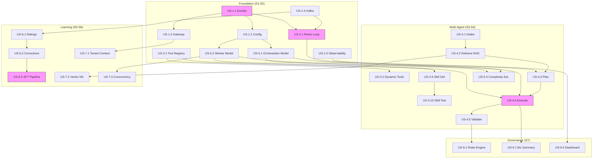
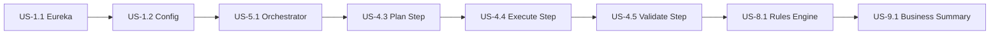

# Detailed User Stories: AI Agent Platform

**Product Name:** AI Agent Platform
**Version:** 1.0
**Date:** March 6, 2026
**Status:** [PLANNED] -- All stories in this document are planned; no implementation exists yet.
**Author:** BA Agent
**Source Documents:** 01-PRD, 02-Technical-Specification, 03-Epics-and-User-Stories

---

## Sprint Mapping

| Sprint | Weeks | Phase | Epics Covered | Stories | Total Points |
|--------|-------|-------|---------------|---------|--------------|
| S1 | 1-3 | Foundation | E1, E2 (partial) | 12 | 46 |
| S2 | 4-6 | Foundation | E2 (rest), E3 (partial), E5 (partial) | 14 | 55 |
| S3 | 7-9 | Multi-Agent | E3 (rest), E4 (partial), E5 (rest) | 12 | 50 |
| S4 | 10-12 | Multi-Agent | E4 (rest), E7 (partial) | 10 | 42 |
| S5 | 13-16 | Learning | E6 (partial), E7 (rest) | 10 | 43 |
| S6 | 17-20 | Learning | E6 (rest), E8 | 9 | 38 |
| S7 | 21-24 | Governance | E8 (rest), E9 | 8 | 33 |

**Total: 75 stories, 307 story points across 7 sprints**

---

## Story Point Summary per Epic

| Epic | Name | Stories | Points | Must | Should | Could |
|------|------|---------|--------|------|--------|-------|
| E1 | Spring Cloud Infrastructure | 8 | 30 | 6 | 2 | 0 |
| E2 | Base Agent Framework | 10 | 42 | 7 | 2 | 1 |
| E3 | Tool and Skill System | 12 | 50 | 6 | 4 | 2 |
| E4 | 7-Step Request Pipeline | 10 | 44 | 8 | 2 | 0 |
| E5 | Two-Model Architecture | 6 | 26 | 4 | 2 | 0 |
| E6 | Feedback and Learning | 10 | 44 | 5 | 3 | 2 |
| E7 | Multi-Tenancy | 8 | 32 | 6 | 2 | 0 |
| E8 | Validation and Governance | 6 | 22 | 4 | 2 | 0 |
| E9 | Explanation and Observability | 5 | 17 | 3 | 1 | 1 |

---

## Priority Matrix (MoSCoW)

| Priority | Count | Percentage | Description |
|----------|-------|------------|-------------|
| Must Have | 49 | 65% | Required for MVP launch |
| Should Have | 20 | 27% | Expected for v1.0 but deferrable |
| Could Have | 6 | 8% | Nice-to-have enhancements |
| Won't Have | 0 | 0% | Out of scope for this release |

---

## Personas Referenced

| Persona | Description | Primary Epics |
|---------|-------------|---------------|
| Platform Developer | Builds and maintains the agent infrastructure | E1, E2, E4, E5 |
| Platform Administrator | Manages configuration, deployment, and monitoring | E1, E7, E8, E9 |
| End User | Interacts with agents to accomplish tasks | E2, E4, E9 |
| Domain Expert | Injects business patterns, skills, and learning materials | E3, E6 |
| ML Engineer | Manages the training pipeline and model evaluation | E5, E6 |
| Agent Developer | Creates new agent types and configures tool sets | E2, E3 |

---

## Epic 1: Spring Cloud Infrastructure

**Goal:** Establish the foundational microservice infrastructure for the agent platform.
**PRD Reference:** Section 2.2, Section 8 Phase 1
**Phase:** Foundation (Weeks 1-6)

---

### US-1.1: Service Discovery Setup

**Priority:** Must Have
**Sprint:** S1
**Story Points:** 3
**Dependencies:** None (foundation story)

**As a** platform developer,
**I want** all agent microservices to automatically register with and discover each other through a service registry,
**So that** agents can communicate without hardcoded service URLs and new services are found automatically.

**Acceptance Criteria:**

- [ ] AC-1.1.1: Given the Eureka Server is deployed, When it starts up, Then it is accessible on a configured port and its dashboard shows a healthy status.
- [ ] AC-1.1.2: Given an agent microservice starts, When it connects to Eureka, Then it registers itself with its logical service name within 30 seconds.
- [ ] AC-1.1.3: Given a registered service shuts down gracefully, When it deregisters, Then it is removed from the registry within one heartbeat interval.
- [ ] AC-1.1.4: Given a registered service becomes unresponsive, When it misses 3 consecutive heartbeats (each 30 seconds), Then Eureka removes it from the active registry.
- [ ] AC-1.1.5: Given two registered services, When service A looks up service B by logical name, Then service A receives the current network address of service B.
- [ ] AC-1.1.6: Given the Eureka dashboard is loaded, When an administrator views it, Then all registered services, their instances, and their health status are displayed.

**Business Rules:**

- BR-1.1.1: Every microservice in the platform must register with Eureka; no service may operate in isolation.
- BR-1.1.2: Heartbeat interval is 30 seconds; eviction threshold is 3 missed heartbeats.

**Test Scenarios:**

- Happy path: Service registers on startup, appears in dashboard, is discoverable by other services.
- Error case: Eureka server is temporarily unavailable; service retries registration with exponential backoff.
- Edge case: Two instances of the same service register; both appear and load balancing routes to both.

---

### US-1.2: Centralized Configuration

**Priority:** Must Have
**Sprint:** S1
**Story Points:** 5
**Dependencies:** US-1.1

**As a** platform administrator,
**I want** all service configurations managed in a single Git-backed config server,
**So that** I can update model settings, routing rules, and training schedules without redeploying services.

**Acceptance Criteria:**

- [ ] AC-1.2.1: Given the Config Server is running, When it starts, Then it loads configuration from a specified Git repository.
- [ ] AC-1.2.2: Given a service starts, When it requests its configuration, Then it receives the correct profile-specific properties (dev, staging, production).
- [ ] AC-1.2.3: Given a configuration value is updated in Git, When an administrator calls the refresh endpoint, Then the service picks up the new value without restarting.
- [ ] AC-1.2.4: Given sensitive values such as API keys exist in configuration, When they are stored in the Git repository, Then they are encrypted at rest using a symmetric key.
- [ ] AC-1.2.5: Given an invalid configuration value is pushed, When a service refreshes, Then the service rejects the invalid value and retains the previous valid configuration.

**Business Rules:**

- BR-1.2.1: All model parameters, routing rules, and training schedules must be centrally managed.
- BR-1.2.2: Environment-specific profiles must be supported (dev, staging, production).

**Test Scenarios:**

- Happy path: Service starts, fetches config from Git-backed server, applies environment profile.
- Error case: Config Server is unreachable at startup; service uses local fallback configuration.
- Edge case: Two services share a common property key but need different values per profile.

---

### US-1.3: API Gateway

**Priority:** Must Have
**Sprint:** S1
**Story Points:** 5
**Dependencies:** US-1.1

**As an** end user,
**I want** a single entry point for all agent interactions,
**So that** I do not need to know which specific agent service handles my request.

**Acceptance Criteria:**

- [ ] AC-1.3.1: Given the API Gateway is running, When a request arrives for a known route, Then it is forwarded to the correct downstream agent service discovered via Eureka.
- [ ] AC-1.3.2: Given a user without a valid JWT token, When they call any protected endpoint, Then the gateway returns a 401 Unauthorized response.
- [ ] AC-1.3.3: Given rate limiting is configured at 100 requests per minute per user, When a user exceeds that limit, Then the gateway returns a 429 Too Many Requests response.
- [ ] AC-1.3.4: Given a downstream agent service is unhealthy, When the circuit breaker trips, Then the gateway returns a 503 Service Unavailable response with a meaningful error message.
- [ ] AC-1.3.5: Given a request passes through the gateway, When it is processed, Then the request and response are logged for observability with a correlation ID.

**Business Rules:**

- BR-1.3.1: All external access to platform services must pass through the API Gateway.
- BR-1.3.2: Authentication via OAuth2/JWT is mandatory on all endpoints.

**Test Scenarios:**

- Happy path: Authenticated request is routed to the correct agent service and response is returned.
- Error case: Downstream service is down; circuit breaker returns 503.
- Edge case: Request matches multiple route predicates; most specific route wins.

---

### US-1.4: Kafka Messaging Infrastructure

**Priority:** Must Have
**Sprint:** S1
**Story Points:** 5
**Dependencies:** None

**As a** platform developer,
**I want** a reliable message broker connecting all services,
**So that** agent traces, feedback signals, and training events flow asynchronously between services.

**Acceptance Criteria:**

- [ ] AC-1.4.1: Given Kafka is deployed, When it starts, Then predefined topics (agent-traces, feedback-signals, training-data-priority, knowledge-updates, customer-feedback) are created.
- [ ] AC-1.4.2: Given a producer sends a message, When the message is published to a topic, Then it is durably stored according to the topic's retention policy.
- [ ] AC-1.4.3: Given a consumer fails to process a message after 3 retries, When the retry limit is exhausted, Then the message is sent to the corresponding dead-letter topic.
- [ ] AC-1.4.4: Given topic retention is configured, When the agent-traces topic holds messages older than 30 days, Then those messages are automatically purged.
- [ ] AC-1.4.5: Given message schemas are versioned, When a producer sends a message with an incompatible schema, Then the schema registry rejects the message.

**Business Rules:**

- BR-1.4.1: Trace retention is 30 days; feedback retention is 90 days.
- BR-1.4.2: All messages must carry a tenant ID for multi-tenant filtering.

**Test Scenarios:**

- Happy path: Trace message is published and consumed by the trace-collector service.
- Error case: Consumer crashes mid-processing; message is replayed from the last committed offset.
- Edge case: Burst of 10,000 messages; Kafka handles backpressure without message loss.

---

### US-1.5: Observability Stack

**Priority:** Must Have
**Sprint:** S1
**Story Points:** 5
**Dependencies:** US-1.1, US-1.3

**As a** platform administrator,
**I want** unified metrics, traces, and logs from all services,
**So that** I can monitor platform health, debug issues, and optimize performance.

**Acceptance Criteria:**

- [ ] AC-1.5.1: Given any service is running, When it processes a request, Then Micrometer exports metrics (request count, latency histogram, error rate) to the configured metrics backend.
- [ ] AC-1.5.2: Given OpenTelemetry tracing is enabled, When a request passes through multiple services, Then a distributed trace links all service hops with a single trace ID.
- [ ] AC-1.5.3: Given structured logging is configured, When any service logs a message, Then the log entry includes timestamp, service name, trace ID, tenant ID, and log level.
- [ ] AC-1.5.4: Given token usage tracking is enabled, When an agent calls a model, Then the token count (prompt + completion) is recorded as a metric with agent and model labels.
- [ ] AC-1.5.5: Given a latency threshold of 2 seconds is defined, When a request exceeds that threshold, Then an alert is raised.

**Business Rules:**

- BR-1.5.1: Every model invocation must track token usage for cost attribution.
- BR-1.5.2: P95 latency must be measurable per agent, per model, and per tenant.

**Test Scenarios:**

- Happy path: Request flows through gateway and agent; distributed trace shows full path.
- Error case: Metrics backend is temporarily unavailable; metrics are buffered and retransmitted.
- Edge case: High-cardinality tenant label; metrics storage handles thousands of unique tenant values.

---

### US-1.6: Health Check Endpoints

**Priority:** Must Have
**Sprint:** S1
**Story Points:** 2
**Dependencies:** US-1.1

**As a** platform administrator,
**I want** every service to expose standardized health check endpoints,
**So that** container orchestrators and monitoring tools can determine service readiness.

**Acceptance Criteria:**

- [ ] AC-1.6.1: Given a service is running, When a liveness probe calls /actuator/health/liveness, Then it returns 200 OK if the service process is alive.
- [ ] AC-1.6.2: Given a service has finished initialization, When a readiness probe calls /actuator/health/readiness, Then it returns 200 OK only after all dependencies (database, Eureka, Kafka) are connected.
- [ ] AC-1.6.3: Given a database connection is lost, When the readiness probe fires, Then the service reports DOWN and stops receiving traffic.
- [ ] AC-1.6.4: Given the health endpoint is called, When the response is returned, Then it includes component-level details (db: UP, kafka: UP, eureka: UP).

**Business Rules:**

- BR-1.6.1: Health endpoints must not require authentication for use by orchestration tooling.

**Test Scenarios:**

- Happy path: All dependencies are up; both liveness and readiness return 200 OK.
- Error case: Kafka connection drops; readiness returns 503 while liveness stays 200.
- Edge case: Service starts but database migration is still running; readiness stays DOWN until migration completes.

---

### US-1.7: Environment Profiles

**Priority:** Should Have
**Sprint:** S1
**Story Points:** 3
**Dependencies:** US-1.2

**As a** platform administrator,
**I want** distinct configuration profiles for dev, staging, and production environments,
**So that** each environment uses appropriate model endpoints, database credentials, and feature flags.

**Acceptance Criteria:**

- [ ] AC-1.7.1: Given the dev profile is active, When the service starts, Then it connects to the local Ollama endpoint and local database.
- [ ] AC-1.7.2: Given the production profile is active, When the service starts, Then it connects to the production Ollama cluster and production database with encrypted credentials.
- [ ] AC-1.7.3: Given a feature flag is set to false in staging, When the flagged feature is requested, Then the service responds with a 404 or feature-disabled message.
- [ ] AC-1.7.4: Given a profile-specific property overrides a default property, When both exist, Then the profile-specific value takes precedence.

**Business Rules:**

- BR-1.7.1: Production profile must never use in-memory databases or local file storage.

**Test Scenarios:**

- Happy path: Service boots with staging profile; connects to staging endpoints.
- Error case: Profile name is misspelled; service fails to start with a clear error message.
- Edge case: A property exists in default but not in profile; default value is used.

---

### US-1.8: Structured Logging

**Priority:** Should Have
**Sprint:** S1
**Story Points:** 2
**Dependencies:** US-1.5

**As a** platform developer,
**I want** all services to emit structured JSON logs with consistent fields,
**So that** logs are searchable and correlatable across the distributed system.

**Acceptance Criteria:**

- [ ] AC-1.8.1: Given structured logging is enabled, When any service logs a message, Then the output is valid JSON with fields: timestamp, level, service, traceId, tenantId, message.
- [ ] AC-1.8.2: Given a request enters the API gateway with a correlation ID header, When it propagates through downstream services, Then every log entry in the chain includes the same correlation ID.
- [ ] AC-1.8.3: Given log level is set to WARN in production, When a DEBUG-level message is logged, Then it is suppressed and not emitted.
- [ ] AC-1.8.4: Given a log message contains PII, When the PII masking filter is active, Then email addresses and tokens are masked before output.

**Business Rules:**

- BR-1.8.1: PII must never appear in production logs in clear text.

**Test Scenarios:**

- Happy path: Request flows through 3 services; all logs share the same traceId.
- Error case: Correlation ID header is missing; a new ID is generated at the gateway.
- Edge case: Log message contains nested JSON; it is properly escaped in the structured output.

---

## Epic 2: Base Agent Framework

**Goal:** Build the reusable agent library that all specialist agents extend.
**PRD Reference:** Section 3.2, Section 3.8
**Phase:** Foundation (Weeks 1-6)

---

### US-2.1: ReAct Loop Engine

**Priority:** Must Have
**Sprint:** S1
**Story Points:** 8
**Dependencies:** US-1.1

**As a** platform developer,
**I want** a configurable Reasoning-and-Acting loop engine,
**So that** any agent can alternate between reasoning steps and tool actions to solve tasks.

**Acceptance Criteria:**

- [ ] AC-2.1.1: Given an agent receives a request, When the ReAct loop starts, Then the model generates a reasoning step followed by an action (tool call) or a final answer.
- [ ] AC-2.1.2: Given a tool call is returned by the model, When the tool executes, Then the result is added to the conversation and the loop continues.
- [ ] AC-2.1.3: Given the model returns a response with no tool calls, When the loop evaluates, Then the response is treated as the final answer and the loop terminates.
- [ ] AC-2.1.4: Given the maximum turn limit (configurable, default 10) is reached, When the loop evaluates, Then the loop terminates with a max-turns-reached response containing the best partial answer.
- [ ] AC-2.1.5: Given a tool call times out, When the timeout is caught, Then an error message is added to the conversation as a tool response and the loop continues.
- [ ] AC-2.1.6: Given the ReAct loop completes, When the trace is recorded, Then it includes the number of turns used, each reasoning step, and each tool call with arguments and results.

**Business Rules:**

- BR-2.1.1: The maximum turn limit must be configurable per agent type.
- BR-2.1.2: Every turn must be traced for the learning pipeline.

**Test Scenarios:**

- Happy path: Agent receives question, calls 2 tools, then returns final answer in 3 turns.
- Error case: Tool call fails; error is injected as observation and model recovers.
- Edge case: Model enters an infinite tool-calling loop; max turns limit terminates it.

---

### US-2.2: Tool Registry

**Priority:** Must Have
**Sprint:** S1
**Story Points:** 5
**Dependencies:** None

**As an** agent developer,
**I want** a central registry that resolves available tools by skill set,
**So that** each agent only sees the tools it is authorized to use.

**Acceptance Criteria:**

- [ ] AC-2.2.1: Given static tools are registered as Spring beans, When the registry initializes, Then all annotated tool beans are catalogued with their name, description, and parameter schema.
- [ ] AC-2.2.2: Given an agent requests tools for its skill set, When the registry resolves them, Then only tools matching the skill's tool list are returned.
- [ ] AC-2.2.3: Given a tool name does not exist in the registry, When it is requested, Then the registry returns an empty result for that name and logs a warning.
- [ ] AC-2.2.4: Given the registry contains both static and dynamic tools, When resolution occurs, Then static tools are checked first, then dynamic tools.
- [ ] AC-2.2.5: Given the tool list is returned, When the agent inspects it, Then each tool includes its name, description, and JSON schema for parameters.

**Business Rules:**

- BR-2.2.1: Tool resolution must complete within 50ms to avoid impacting ReAct loop latency.

**Test Scenarios:**

- Happy path: Agent skill set lists 3 tools; registry returns exactly those 3.
- Error case: One tool in the list was deleted; registry returns the other 2 and logs a warning.
- Edge case: Two dynamic tools have the same name; the most recently registered version wins.

---

### US-2.3: Tool Execution Engine

**Priority:** Must Have
**Sprint:** S2
**Story Points:** 5
**Dependencies:** US-2.2

**As a** platform developer,
**I want** tools to execute with timeout, retry, and circuit-breaking protections,
**So that** a single slow or failing tool does not block the entire agent pipeline.

**Acceptance Criteria:**

- [ ] AC-2.3.1: Given a tool is called, When it executes within the configured timeout (default 30 seconds), Then the result is returned to the ReAct loop.
- [ ] AC-2.3.2: Given a tool exceeds the timeout, When the timeout fires, Then a JSON error message is returned and the tool call is recorded as timed-out in the trace.
- [ ] AC-2.3.3: Given a tool's circuit breaker has tripped, When a new call is made to that tool, Then the call is rejected immediately with a circuit-open error.
- [ ] AC-2.3.4: Given a tool call fails with a transient error, When retry is configured, Then the call is retried up to the configured limit (default 2) with exponential backoff.
- [ ] AC-2.3.5: Given every tool call, When it completes (success or failure), Then the call name, arguments, response, latency, and outcome are recorded in the trace.

**Business Rules:**

- BR-2.3.1: Tool call traces are mandatory for every invocation; they feed the learning pipeline.
- BR-2.3.2: Circuit breaker must open after 5 consecutive failures and attempt reset after 60 seconds.

**Test Scenarios:**

- Happy path: Tool executes in 200ms, returns result, trace recorded.
- Error case: Tool throws exception on first call, succeeds on retry.
- Edge case: Circuit breaker is open; call fails fast, model uses alternative reasoning.

---

### US-2.4: Conversation Memory

**Priority:** Must Have
**Sprint:** S2
**Story Points:** 5
**Dependencies:** US-2.1

**As an** end user,
**I want** agents to remember the context of our conversation,
**So that** I can have multi-turn interactions without repeating myself.

**Acceptance Criteria:**

- [ ] AC-2.4.1: Given a user starts a conversation, When the first message is sent, Then a session is created and subsequent messages within the session include prior conversation history.
- [ ] AC-2.4.2: Given conversation history exceeds the configured token limit (default 4096 tokens), When the next turn starts, Then the oldest messages are summarized or truncated to fit within the limit.
- [ ] AC-2.4.3: Given a session has been inactive for the configured timeout (default 30 minutes), When the timeout expires, Then the session is marked as expired and a new conversation starts fresh.
- [ ] AC-2.4.4: Given a user explicitly requests to clear memory, When they call the clear endpoint, Then all session history is deleted and the next message starts a new context.
- [ ] AC-2.4.5: Given long-term memory is enabled, When a user returns after session expiry, Then the agent can recall key facts from previous sessions via vector store lookup.

**Business Rules:**

- BR-2.4.1: Session timeout and token limit must be configurable per agent type.
- BR-2.4.2: Long-term memory is tenant-scoped; a user from tenant A must never recall facts from tenant B.

**Test Scenarios:**

- Happy path: User sends 5 messages in sequence; agent references message 2 when answering message 5.
- Error case: Cache (Redis) is temporarily unavailable; service degrades to stateless mode.
- Edge case: Conversation token count is exactly at the limit; next message triggers summarization.

---

### US-2.5: Self-Reflection

**Priority:** Should Have
**Sprint:** S2
**Story Points:** 5
**Dependencies:** US-2.1

**As an** end user,
**I want** agents to verify their own answers before responding,
**So that** I receive higher quality, more accurate responses.

**Acceptance Criteria:**

- [ ] AC-2.5.1: Given self-reflection is enabled for the agent and the request complexity exceeds the configured threshold, When the initial response is generated, Then a reflection pass critiques the response for accuracy, completeness, and consistency.
- [ ] AC-2.5.2: Given the reflection pass identifies issues, When it generates corrections, Then the revised response replaces the original and both are recorded in the trace.
- [ ] AC-2.5.3: Given self-reflection is disabled for simple requests, When a simple request is processed, Then the initial response is returned without a reflection pass.
- [ ] AC-2.5.4: Given the reflection pass does not find issues, When it completes, Then the original response is returned and the reflection is recorded as "no changes needed."
- [ ] AC-2.5.5: Given the reflection pass runs, When it completes, Then the total latency added by reflection is recorded as a separate metric.

**Business Rules:**

- BR-2.5.1: Reflection is configurable per agent and per complexity level.
- BR-2.5.2: Reflection must add no more than 3 seconds of latency for the orchestrator model.

**Test Scenarios:**

- Happy path: Complex request triggers reflection; response is improved.
- Error case: Reflection model call fails; original response is returned as-is.
- Edge case: Reflection generates a worse response; original is retained (based on quality scoring).

---

### US-2.6: Trace Logging

**Priority:** Must Have
**Sprint:** S2
**Story Points:** 3
**Dependencies:** US-1.4, US-2.1

**As a** platform developer,
**I want** every agent interaction to be automatically traced and published to Kafka,
**So that** the learning pipeline can consume traces for model improvement.

**Acceptance Criteria:**

- [ ] AC-2.6.1: Given an agent processes a request, When the processing completes (success or failure), Then a trace record is published to the agent-traces Kafka topic.
- [ ] AC-2.6.2: Given a trace record, When it is published, Then it includes: trace ID, agent type, skill ID, request content, response content, turns used, tool calls, latency, outcome (success/failure), and confidence score.
- [ ] AC-2.6.3: Given the confidence score is below the configured threshold (default 0.6), When the trace is published, Then it is also flagged for human review.
- [ ] AC-2.6.4: Given Kafka is temporarily unavailable, When a trace needs to be published, Then the trace is buffered locally and retransmitted when Kafka recovers.

**Business Rules:**

- BR-2.6.1: Every agent interaction must produce a trace; no interaction may go unrecorded.
- BR-2.6.2: Traces must include tenant ID for multi-tenant filtering.

**Test Scenarios:**

- Happy path: Agent processes request; trace appears in Kafka topic within 1 second.
- Error case: Kafka is down; trace is buffered; on recovery, buffered traces are sent.
- Edge case: Agent fails mid-processing; partial trace is recorded with failure details.

---

### US-2.7: Agent Lifecycle Management

**Priority:** Must Have
**Sprint:** S2
**Story Points:** 3
**Dependencies:** US-1.1, US-1.2

**As a** platform administrator,
**I want** to start, stop, and restart individual agent services independently,
**So that** I can perform maintenance without affecting the entire platform.

**Acceptance Criteria:**

- [ ] AC-2.7.1: Given an agent service is running, When an administrator triggers a graceful shutdown, Then the agent finishes in-progress requests, deregisters from Eureka, and stops accepting new requests.
- [ ] AC-2.7.2: Given an agent service is stopped, When it is restarted, Then it re-registers with Eureka and resumes accepting requests within 30 seconds.
- [ ] AC-2.7.3: Given an agent service crashes unexpectedly, When Eureka detects the missed heartbeats, Then traffic is routed away from the crashed instance.
- [ ] AC-2.7.4: Given multiple instances of the same agent are running, When one instance is stopped for maintenance, Then the remaining instances handle the traffic without errors.

**Business Rules:**

- BR-2.7.1: Graceful shutdown must complete within 60 seconds; after that, the process is force-killed.

**Test Scenarios:**

- Happy path: Agent is stopped gracefully; in-flight request completes; Eureka updated.
- Error case: Agent crashes; Eureka evicts after 90 seconds; no requests lost due to retry.
- Edge case: All instances of an agent are stopped; gateway returns 503 with clear error.

---

### US-2.8: Agent Error Handling

**Priority:** Must Have
**Sprint:** S2
**Story Points:** 3
**Dependencies:** US-2.1, US-2.3

**As an** end user,
**I want** agents to handle errors gracefully and provide meaningful feedback,
**So that** I understand what went wrong and whether to retry.

**Acceptance Criteria:**

- [ ] AC-2.8.1: Given an agent encounters a model call failure, When the error is caught, Then the agent returns a user-friendly error message indicating the issue category (model unavailable, tool failure, timeout).
- [ ] AC-2.8.2: Given all local models are unavailable, When a cloud fallback is configured, Then the agent escalates to the cloud model and processes the request.
- [ ] AC-2.8.3: Given all models (local and cloud) are unavailable, When the agent cannot process the request, Then it returns a 503 response with a retry-after header.
- [ ] AC-2.8.4: Given an error occurs during processing, When the error trace is recorded, Then it includes the full exception chain, the step at which the failure occurred, and the partial response if any.

**Business Rules:**

- BR-2.8.1: User-facing error messages must never expose internal stack traces or sensitive system details.
- BR-2.8.2: Cloud fallback is a last resort, not a primary execution path.

**Test Scenarios:**

- Happy path: Tool fails, agent retries, succeeds on second attempt.
- Error case: All models down; 503 returned with retry-after header.
- Edge case: Error occurs in reflection step; original (pre-reflection) response is returned.

---

### US-2.9: Agent Configuration

**Priority:** Should Have
**Sprint:** S2
**Story Points:** 3
**Dependencies:** US-1.2, US-2.1

**As an** agent developer,
**I want** to configure agent behavior (max turns, temperature, reflection, timeout) via the config server,
**So that** I can tune agent performance without redeploying.

**Acceptance Criteria:**

- [ ] AC-2.9.1: Given agent configuration is stored in the config server, When the agent starts, Then it loads its max turns, temperature, reflection toggle, and timeout settings.
- [ ] AC-2.9.2: Given a configuration value is changed, When the refresh endpoint is called, Then the agent picks up the new value within the current session for new requests.
- [ ] AC-2.9.3: Given an agent configuration specifies max turns of 5, When the ReAct loop runs, Then it terminates after a maximum of 5 turns.
- [ ] AC-2.9.4: Given invalid configuration (e.g., negative max turns), When the agent loads it, Then the agent rejects the value and uses the default.

**Business Rules:**

- BR-2.9.1: Configuration changes take effect on new requests only; in-flight requests use the configuration present at request start.

**Test Scenarios:**

- Happy path: Max turns changed from 10 to 5; next request terminates after 5 turns.
- Error case: Config server unreachable during refresh; current config retained.
- Edge case: Two configuration keys conflict; most specific (agent-level) wins over global.

---

### US-2.10: BaseAgent Extension Point

**Priority:** Could Have
**Sprint:** S2
**Story Points:** 2
**Dependencies:** US-2.1, US-2.2

**As an** agent developer,
**I want** a well-defined BaseAgent abstract class with clear extension points,
**So that** I can create new specialist agents by implementing only domain-specific logic.

**Acceptance Criteria:**

- [ ] AC-2.10.1: Given BaseAgent defines abstract methods (getAgentType, getActiveSkillId, getMaxTurns, shouldReflect), When a developer creates a new agent, Then they implement only those methods and inherit all ReAct, memory, tracing, and error-handling behavior.
- [ ] AC-2.10.2: Given a new agent extends BaseAgent, When it is deployed as a Spring Boot service, Then it automatically registers with Eureka and is discoverable by the orchestrator.
- [ ] AC-2.10.3: Given the BaseAgent processes a request, When the processing follows the standard flow (skill resolution, model routing, ReAct loop, optional reflection, tracing), Then all steps execute without the specialist agent needing to implement them.

**Business Rules:**

- BR-2.10.1: All agents must extend BaseAgent; no agent may bypass the standard processing flow.

**Test Scenarios:**

- Happy path: New agent is created with 4 method implementations; it processes requests correctly.
- Error case: Developer forgets to implement getAgentType; compile-time error prevents deployment.
- Edge case: Agent overrides the standard process method; overridden flow still produces traces.

---

## Epic 3: Tool and Skill System

**Goal:** Build the comprehensive tool and skill framework that enables agent specialization.
**PRD Reference:** Section 3.4, Section 3.5
**Phase:** Foundation + Multi-Agent (Weeks 4-12)

---

### US-3.1: Static Tool Registration

**Priority:** Must Have
**Sprint:** S2
**Story Points:** 3
**Dependencies:** US-2.2

**As an** agent developer,
**I want** to register tools as annotated Spring beans that are automatically discovered,
**So that** I can add new tools by writing a function and annotating it.

**Acceptance Criteria:**

- [ ] AC-3.1.1: Given a function bean annotated with @Bean and @Description, When the application context loads, Then the tool is registered in the ToolRegistry with its name and parameter schema.
- [ ] AC-3.1.2: Given a registered static tool, When its JSON schema is inspected, Then it includes parameter names, types, descriptions, and required flags.
- [ ] AC-3.1.3: Given a skill references a static tool by name, When the skill resolves, Then the correct static tool function is included in the tool list.
- [ ] AC-3.1.4: Given a static tool is called by the ReAct loop, When it executes, Then it receives deserialized arguments and returns a serialized response.

**Business Rules:**

- BR-3.1.1: Each static tool must have a unique name within the registry.

**Test Scenarios:**

- Happy path: @Bean function is annotated; tool appears in registry; agent calls it successfully.
- Error case: Two beans have the same tool name; application fails to start with a clear duplicate error.
- Edge case: Tool with optional parameters; model calls it with only required parameters.

---

### US-3.2: Dynamic Tool Registration API

**Priority:** Must Have
**Sprint:** S3
**Story Points:** 5
**Dependencies:** US-3.1

**As a** domain expert,
**I want** to register new tools at runtime via a REST API without redeploying services,
**So that** I can extend agent capabilities as business needs evolve.

**Acceptance Criteria:**

- [ ] AC-3.2.1: Given a valid tool definition (name, description, parameter schema, endpoint URL), When it is posted to the tool registration API, Then the tool is stored and immediately available to agents.
- [ ] AC-3.2.2: Given a dynamic tool is registered, When an agent's skill references it by name, Then the ToolRegistry resolves it just like a static tool.
- [ ] AC-3.2.3: Given a dynamic tool's endpoint is a REST URL, When the tool is called, Then the ToolExecutor makes an HTTP call to that URL with the provided arguments.
- [ ] AC-3.2.4: Given the tool list API is called, When the response is returned, Then it lists all registered tools (static and dynamic) with their names, descriptions, and schemas.
- [ ] AC-3.2.5: Given a dynamic tool is updated, When the new version is posted, Then subsequent calls use the updated endpoint and schema.

**Business Rules:**

- BR-3.2.1: Dynamic tool registration requires an authenticated user with the TOOL_ADMIN role.
- BR-3.2.2: Dynamic tools must not override static tools with the same name.

**Test Scenarios:**

- Happy path: Domain expert registers a webhook tool via API; agent uses it in next request.
- Error case: Tool endpoint returns 500; circuit breaker opens after 5 failures.
- Edge case: Tool is registered but its endpoint is unreachable; tool call returns a connection error.

---

### US-3.3: Agent-as-Tool

**Priority:** Must Have
**Sprint:** S3
**Story Points:** 5
**Dependencies:** US-2.1, US-2.2

**As an** end user,
**I want** agents to delegate sub-tasks to other specialist agents,
**So that** complex tasks leverage multiple areas of expertise.

**Acceptance Criteria:**

- [ ] AC-3.3.1: Given an agent is registered as a tool (e.g., ask_data_analyst), When another agent's skill includes it in its tool set, Then the calling agent can invoke the specialist agent as a tool.
- [ ] AC-3.3.2: Given the orchestrator agent invokes a specialist agent as a tool, When the specialist processes the sub-task, Then the result is returned to the orchestrator's ReAct loop as a tool response.
- [ ] AC-3.3.3: Given the specialist agent fails or times out, When the error is returned, Then the calling agent receives an error response and can decide how to proceed.
- [ ] AC-3.3.4: Given agent-as-tool calls are made, When the trace is recorded, Then both the parent and child agent traces are linked by a shared correlation ID.
- [ ] AC-3.3.5: Given a circular call is attempted (agent A calls agent B which calls agent A), When the depth limit (default 3) is reached, Then the call is rejected with a circular-dependency error.

**Business Rules:**

- BR-3.3.1: Agent-as-tool call depth must not exceed 3 levels to prevent resource exhaustion.
- BR-3.3.2: The tenant context from the parent request must propagate to the child agent.

**Test Scenarios:**

- Happy path: Orchestrator asks data analyst to run a query; result is used in orchestrator's response.
- Error case: Specialist agent is down; circuit breaker returns error; orchestrator tries alternative.
- Edge case: Circular call detected at depth 3; call rejected with clear error.

---

### US-3.4: Composite Tools

**Priority:** Should Have
**Sprint:** S3
**Story Points:** 5
**Dependencies:** US-3.2

**As a** domain expert,
**I want** to combine existing tools into higher-level composite tools,
**So that** common multi-step workflows can be executed as a single tool call.

**Acceptance Criteria:**

- [ ] AC-3.4.1: Given a composite tool definition with ordered steps and data mappings, When it is posted to the composite tool API, Then it is registered as a single tool.
- [ ] AC-3.4.2: Given a composite tool is called, When it executes, Then each step runs in sequence and the output of each step is mapped as input to the next step.
- [ ] AC-3.4.3: Given a step in the composite tool fails, When the failure is caught, Then the composite tool returns a partial result indicating which step failed and why.
- [ ] AC-3.4.4: Given a composite tool is listed, When its schema is inspected, Then it shows the parameters of the first step as input and the output schema of the last step as output.

**Business Rules:**

- BR-3.4.1: Composite tools must reference only existing registered tools.
- BR-3.4.2: Maximum 10 steps per composite tool.

**Test Scenarios:**

- Happy path: Composite tool "full_customer_report" chains search_tickets, search_orders, and summarize.
- Error case: Step 2 fails; partial result returned with step 1 output and step 2 error.
- Edge case: Data mapping between steps is missing a field; step 2 receives null and handles gracefully.

---

### US-3.5: Webhook Tools

**Priority:** Should Have
**Sprint:** S3
**Story Points:** 3
**Dependencies:** US-3.2

**As a** domain expert,
**I want** to register any external webhook as an agent tool,
**So that** agents can interact with third-party systems without custom code.

**Acceptance Criteria:**

- [ ] AC-3.5.1: Given a webhook URL, HTTP method, and parameter schema, When a webhook tool is registered, Then the system generates a tool definition that wraps the webhook call.
- [ ] AC-3.5.2: Given the webhook tool is called, When the HTTP request is made, Then it includes the provided arguments as query parameters (GET) or request body (POST).
- [ ] AC-3.5.3: Given the webhook returns a non-2xx status, When the response is processed, Then the tool returns an error message including the HTTP status code.
- [ ] AC-3.5.4: Given the webhook requires authentication, When the tool definition includes auth configuration (Bearer token, API key), Then the HTTP request includes the appropriate header.

**Business Rules:**

- BR-3.5.1: Webhook authentication credentials must be stored encrypted, never in plain text.

**Test Scenarios:**

- Happy path: Webhook tool calls external CRM API; result is returned to agent.
- Error case: Webhook endpoint is unavailable; tool returns timeout error.
- Edge case: Webhook returns 301 redirect; tool follows redirect up to 3 hops.

---

### US-3.6: Script Tools

**Priority:** Could Have
**Sprint:** S3
**Story Points:** 3
**Dependencies:** US-3.2

**As a** domain expert,
**I want** to upload a Python or shell script that becomes an executable tool,
**So that** I can create custom data transformations without modifying the platform code.

**Acceptance Criteria:**

- [ ] AC-3.6.1: Given a script file and a parameter schema, When a script tool is registered, Then the script is stored and mapped to a tool name.
- [ ] AC-3.6.2: Given a script tool is called, When it executes, Then the arguments are passed as environment variables or command-line parameters to the script.
- [ ] AC-3.6.3: Given the script runs, When it executes, Then it runs in a sandboxed environment with restricted file system and network access.
- [ ] AC-3.6.4: Given the script exceeds the execution timeout (default 60 seconds), When the timeout fires, Then the process is killed and an error is returned.

**Business Rules:**

- BR-3.6.1: Script tools must be reviewed and approved by an administrator before activation.
- BR-3.6.2: Scripts run in isolated containers with no access to host resources.

**Test Scenarios:**

- Happy path: Python script processes CSV data; result is returned as JSON to the agent.
- Error case: Script contains an infinite loop; killed after timeout.
- Edge case: Script tries to access the network; sandbox blocks the call.

---

### US-3.7: Tool Versioning

**Priority:** Should Have
**Sprint:** S3
**Story Points:** 3
**Dependencies:** US-3.1, US-3.2

**As an** agent developer,
**I want** tools to have semantic versions so that agents can pin to stable tool versions,
**So that** tool updates do not unexpectedly break agent behavior.

**Acceptance Criteria:**

- [ ] AC-3.7.1: Given a tool is registered, When the registration includes a version, Then the version is stored alongside the tool definition.
- [ ] AC-3.7.2: Given a skill references a tool with a specific version (e.g., run_sql:2.1), When the skill resolves, Then the exact versioned tool is returned.
- [ ] AC-3.7.3: Given a skill references a tool without a version, When the skill resolves, Then the latest active version of the tool is returned.
- [ ] AC-3.7.4: Given an older tool version is deprecated, When it is marked inactive, Then skills pinned to that version receive a warning but continue to function until migration.

**Business Rules:**

- BR-3.7.1: Deprecated tool versions must remain available for at least 30 days before removal.

**Test Scenarios:**

- Happy path: Skill pins to run_sql:2.0; new version 2.1 is registered; skill still uses 2.0.
- Error case: Pinned version is deleted; skill falls back to latest with a warning in the trace.
- Edge case: Three versions exist; skill uses the one it was tested against.

---

### US-3.8: Tool Monitoring

**Priority:** Should Have
**Sprint:** S3
**Story Points:** 2
**Dependencies:** US-2.3, US-1.5

**As a** platform administrator,
**I want** per-tool metrics on call count, latency, and error rate,
**So that** I can identify poorly performing tools and optimize or replace them.

**Acceptance Criteria:**

- [ ] AC-3.8.1: Given a tool is called, When the call completes, Then metrics for that tool (call count, latency, success/failure) are exported.
- [ ] AC-3.8.2: Given tool metrics are aggregated, When an administrator views the metrics, Then they can see per-tool P50, P95, and P99 latency.
- [ ] AC-3.8.3: Given a tool's error rate exceeds 20% in a 5-minute window, When the threshold is breached, Then an alert is raised.
- [ ] AC-3.8.4: Given tool metrics include an agent label, When filtered by agent, Then the administrator sees which agents use which tools most.

**Business Rules:**

- BR-3.8.1: Tool metrics must be available within 60 seconds of the call completing.

**Test Scenarios:**

- Happy path: Tool called 100 times; metrics show count, average latency, zero errors.
- Error case: Tool has 50% error rate; alert fires within 5 minutes.
- Edge case: Tool is called by 10 different agents; metrics show breakdown per agent.

---

### US-3.9: Skill Definition

**Priority:** Must Have
**Sprint:** S2
**Story Points:** 5
**Dependencies:** US-2.2

**As a** domain expert,
**I want** to define skills that package a system prompt, tool set, knowledge scope, and behavioral rules,
**So that** agents can be specialized for different tasks through configuration rather than code.

**Acceptance Criteria:**

- [ ] AC-3.9.1: Given a skill definition with name, system prompt, tool set, knowledge scopes, behavioral rules, and few-shot examples, When it is submitted via the API, Then it is stored with status "inactive" and version "1.0.0."
- [ ] AC-3.9.2: Given a stored skill, When it is resolved by the SkillService, Then the result includes the full system prompt (including rules and examples appended), resolved tools, and a knowledge retriever scoped to the specified collections.
- [ ] AC-3.9.3: Given a skill's behavioral rules specify "never run DELETE queries," When the agent uses that skill, Then the system prompt includes this constraint.
- [ ] AC-3.9.4: Given a skill has few-shot examples, When the system prompt is built, Then the examples are included in the prompt under an Examples section.

**Business Rules:**

- BR-3.9.1: Skills start as inactive and must be tested before activation.
- BR-3.9.2: Skill names must be unique within a tenant scope.

**Test Scenarios:**

- Happy path: Domain expert creates a "data-analysis-v2" skill; agent uses it for SQL tasks.
- Error case: Skill references a tool that does not exist; resolution fails with a clear error.
- Edge case: Skill with no behavioral rules; prompt is built from system prompt and examples only.

---

### US-3.10: Skill Testing

**Priority:** Must Have
**Sprint:** S3
**Story Points:** 5
**Dependencies:** US-3.9

**As a** domain expert,
**I want** to test a skill against a suite of test cases before activating it,
**So that** I know the skill works correctly before it handles real user requests.

**Acceptance Criteria:**

- [ ] AC-3.10.1: Given a set of test cases (each with an input prompt and expected output pattern), When the test suite is run against a skill, Then each test case is executed using the skill's configuration.
- [ ] AC-3.10.2: Given a test case specifies an expected output pattern, When the agent's response is evaluated, Then the test passes if the response matches the pattern (contains expected keywords, follows expected format).
- [ ] AC-3.10.3: Given a test suite completes, When the results are returned, Then they include per-case pass/fail status, actual output, and latency.
- [ ] AC-3.10.4: Given all test cases pass, When the domain expert reviews results, Then they can activate the skill via the activation endpoint.
- [ ] AC-3.10.5: Given any test case fails, When the domain expert reviews results, Then the skill remains inactive and the failure details guide skill refinement.

**Business Rules:**

- BR-3.10.1: A skill cannot be activated without running at least one test suite.

**Test Scenarios:**

- Happy path: 5 of 5 test cases pass; skill is activated.
- Error case: 3 of 5 pass; skill stays inactive; domain expert adjusts the system prompt.
- Edge case: Test case has a loose pattern; ambiguous match; reported as "partial match."

---

### US-3.11: Skill Versioning

**Priority:** Must Have
**Sprint:** S3
**Story Points:** 3
**Dependencies:** US-3.9

**As a** domain expert,
**I want** skills to have semantic versions with a clear upgrade path,
**So that** I can iterate on skills without breaking agents that rely on stable versions.

**Acceptance Criteria:**

- [ ] AC-3.11.1: Given a skill exists at version 1.0.0, When an updated version is submitted, Then the new version is stored alongside the previous version.
- [ ] AC-3.11.2: Given multiple versions of a skill exist, When an agent resolves a skill by ID without a version qualifier, Then the latest active version is returned.
- [ ] AC-3.11.3: Given a skill version is deprecated, When it is marked inactive, Then agents pinned to that version continue to use it until they are reconfigured.
- [ ] AC-3.11.4: Given a new skill version is activated, When per-skill metrics are tracked, Then the new version's quality metrics are tracked separately from the old version.

**Business Rules:**

- BR-3.11.1: At most one version of a skill may be active at any time within a tenant.

**Test Scenarios:**

- Happy path: Skill v1 is active; v2 is submitted, tested, and activated; v1 becomes inactive.
- Error case: v2 has worse test results; domain expert keeps v1 active.
- Edge case: Version rollback; v1 is re-activated after v2 shows quality regression.

---

### US-3.12: Skill Inheritance

**Priority:** Could Have
**Sprint:** S3
**Story Points:** 3
**Dependencies:** US-3.9

**As a** domain expert,
**I want** to create new skills that extend an existing parent skill,
**So that** I can reuse common configurations and specialize them.

**Acceptance Criteria:**

- [ ] AC-3.12.1: Given a skill definition includes a parent skill ID, When the skill is resolved, Then the parent's system prompt, tools, and rules are merged with the child's overrides.
- [ ] AC-3.12.2: Given a child skill adds additional tools beyond the parent's tool set, When the skill resolves, Then the merged tool set includes both parent and child tools.
- [ ] AC-3.12.3: Given a child skill overrides the parent's system prompt, When the skill resolves, Then the child's system prompt replaces (not appends to) the parent's.
- [ ] AC-3.12.4: Given a parent skill is updated, When a child skill is resolved, Then the child inherits the updated parent configuration unless the child has explicit overrides.

**Business Rules:**

- BR-3.12.1: Inheritance depth must not exceed 3 levels (parent, child, grandchild).

**Test Scenarios:**

- Happy path: Child skill adds security tools to parent's data-analysis skill.
- Error case: Parent skill is deleted; child resolution fails with a clear orphan error.
- Edge case: Child overrides a rule that the parent defines; child's rule wins.

---

## Epic 4: 7-Step Request Pipeline

**Goal:** Implement the formal 7-step pipeline that ensures every request flows through intake, retrieve, plan, execute, validate, explain, and record.
**PRD Reference:** Section 3.1
**Phase:** Multi-Agent (Weeks 7-16)

---

### US-4.1: Intake Step

**Priority:** Must Have
**Sprint:** S3
**Story Points:** 5
**Dependencies:** US-1.3, US-2.1

**As a** platform developer,
**I want** every incoming request to be classified by task type, normalized, and security-validated,
**So that** subsequent pipeline steps receive clean, structured input.

**Acceptance Criteria:**

- [ ] AC-4.1.1: Given a raw HTTP request arrives at the pipeline, When the intake step processes it, Then it extracts tenant context, user identity, and raw input parameters.
- [ ] AC-4.1.2: Given the extracted request, When classification runs, Then the request is assigned a task type (DATA, CODE, DOCUMENT, SUPPORT) and a complexity estimate (SIMPLE, MODERATE, COMPLEX).
- [ ] AC-4.1.3: Given the request includes references to previous conversations, When normalization runs, Then references are resolved to actual content from conversation memory.
- [ ] AC-4.1.4: Given the user does not have permission for the requested task type, When security validation runs, Then a 403 Forbidden response is returned.
- [ ] AC-4.1.5: Given the intake step completes, When the classified request is produced, Then it includes: tenant ID, user ID, task type, complexity estimate, normalized parameters, and original input.

**Business Rules:**

- BR-4.1.1: Every request must pass security validation before entering the pipeline.
- BR-4.1.2: Classification must complete within 200ms.

**Test Scenarios:**

- Happy path: User sends "analyze sales data for Q1"; classified as DATA/MODERATE.
- Error case: User token is expired; 401 returned before classification.
- Edge case: Request is ambiguous (could be DATA or DOCUMENT); classifier assigns primary type with confidence score.

---

### US-4.2: Retrieve Step (RAG at Orchestrator)

**Priority:** Must Have
**Sprint:** S3
**Story Points:** 8
**Dependencies:** US-4.1, US-2.4

**As a** platform developer,
**I want** the orchestrator to gather relevant context from the vector store before planning,
**So that** the execution step is grounded in tenant-specific knowledge.

**Acceptance Criteria:**

- [ ] AC-4.2.1: Given a classified request, When the orchestrator model evaluates it, Then it determines whether retrieval is needed based on the task type and content.
- [ ] AC-4.2.2: Given retrieval is needed, When the RAG query runs, Then it searches the vector store with the request content filtered by tenant ID.
- [ ] AC-4.2.3: Given the vector store returns documents, When the context packet is assembled, Then it includes the top-K most relevant documents (default K=5) ranked by similarity score.
- [ ] AC-4.2.4: Given retrieval is not needed (e.g., simple arithmetic), When the retrieve step is skipped, Then the context packet is empty and the pipeline proceeds directly to plan.
- [ ] AC-4.2.5: Given the context packet is assembled, When it is passed to the plan step, Then the total token count of the context does not exceed the configured limit (default 2048 tokens).
- [ ] AC-4.2.6: Given a tenant's vector store has no relevant documents, When the RAG query returns zero results, Then the context packet is empty and the pipeline continues without error.

**Business Rules:**

- BR-4.2.1: Retrieval must be tenant-scoped; documents from one tenant must never appear in another tenant's context.
- BR-4.2.2: Source code is not a RAG use case; code is accessed via tools in the execute step.

**Test Scenarios:**

- Happy path: Request about company policy; RAG returns 3 relevant policy documents.
- Error case: Vector store is unavailable; pipeline continues with empty context and logs a warning.
- Edge case: Request matches documents from 2 different knowledge scopes; both are included.

---

### US-4.3: Plan Step

**Priority:** Must Have
**Sprint:** S3
**Story Points:** 5
**Dependencies:** US-4.2, US-3.9

**As a** platform developer,
**I want** the orchestrator model to produce a structured execution plan,
**So that** the worker model receives clear instructions for what to do.

**Acceptance Criteria:**

- [ ] AC-4.3.1: Given a classified request and retrieval context, When the orchestrator model plans, Then it produces an execution plan containing: selected agent/skill, planned tool sequence, expected inputs/outputs, and success criteria.
- [ ] AC-4.3.2: Given the plan includes an agent/skill selection, When the skill is resolved, Then the selected skill exists and is active.
- [ ] AC-4.3.3: Given the plan includes approval requirements, When the plan is produced, Then the approval flag is set and the validate step will enforce it.
- [ ] AC-4.3.4: Given the orchestrator cannot determine a plan, When planning fails, Then a fallback plan using a general-purpose skill is selected.
- [ ] AC-4.3.5: Given the plan is produced, When it is serialized, Then it is a valid JSON object that the execute step can consume.

**Business Rules:**

- BR-4.3.1: Planning always uses the orchestrator model (not the worker model).
- BR-4.3.2: Planning must complete within 1 second.

**Test Scenarios:**

- Happy path: Request classified as DATA; plan selects data-analysis skill with run_sql and create_chart tools.
- Error case: Selected skill does not exist; fallback plan uses general-purpose skill.
- Edge case: Request requires multiple skills (data analysis + document summarization); plan is multi-step.

---

### US-4.4: Execute Step (Worker Model)

**Priority:** Must Have
**Sprint:** S4
**Story Points:** 8
**Dependencies:** US-4.3, US-2.1, US-2.3

**As a** platform developer,
**I want** the worker model to execute the plan through the ReAct loop with the specified tools,
**So that** the actual task is performed and artifacts are generated.

**Acceptance Criteria:**

- [ ] AC-4.4.1: Given an execution plan, When the execute step starts, Then the worker model is initialized with the skill's system prompt and the retrieved context.
- [ ] AC-4.4.2: Given the worker model runs the ReAct loop, When it calls tools, Then each tool call is executed by the ToolExecutor with timeout and retry protections.
- [ ] AC-4.4.3: Given the ReAct loop completes, When the response is produced, Then it includes: content, artifacts (code, queries, documents), tool call history, and termination reason.
- [ ] AC-4.4.4: Given the execution plan specifies self-reflection, When the worker completes its initial response, Then a reflection pass is run and the response may be revised.
- [ ] AC-4.4.5: Given the execute step produces artifacts, When the trace is recorded, Then each artifact is stored with its type, content, and generation metadata.

**Business Rules:**

- BR-4.4.1: Execution always uses the worker model for task complexity; only orchestration tasks use the orchestrator model.

**Test Scenarios:**

- Happy path: Plan says run SQL then chart; worker calls run_sql, gets data, calls create_chart, returns report.
- Error case: Tool call fails; worker retries or explains the failure in its response.
- Edge case: Worker reaches max turns; partial result is returned with max-turns-reached reason.

---

### US-4.5: Validate Step (Deterministic)

**Priority:** Must Have
**Sprint:** S4
**Story Points:** 5
**Dependencies:** US-4.4

**As a** platform developer,
**I want** execution outputs to be validated by a deterministic rules engine before being returned to the user,
**So that** unsafe, non-compliant, or incorrect outputs are caught and corrected.

**Acceptance Criteria:**

- [ ] AC-4.5.1: Given an execution response, When the validation step runs, Then all configured rules (global and skill-specific) are evaluated against the response.
- [ ] AC-4.5.2: Given a rule detects a path-scope violation (file access outside approved directories), When the violation is found, Then the response is blocked and the violation is recorded.
- [ ] AC-4.5.3: Given the response contains code artifacts, When automated tests run, Then test results are included in the validation report.
- [ ] AC-4.5.4: Given validation fails, When the retry loop activates, Then the execute step is re-run with corrective feedback appended to the plan (default max 2 retries).
- [ ] AC-4.5.5: Given all validation rules pass, When the validation report is produced, Then it shows "passed" status and the pipeline proceeds to the explain step.

**Business Rules:**

- BR-4.5.1: Validation is deterministic (code-based, not model-based); the model does not judge its own output here.
- BR-4.5.2: Retry limit is configurable per skill; default 2, maximum 3.

**Test Scenarios:**

- Happy path: Response passes all rules and tests; validation report shows "passed."
- Error case: Response includes a DELETE query against a prohibited table; blocked on first pass, corrected on retry.
- Edge case: Retry limit exhausted; response is returned with a validation-failed warning.

---

### US-4.6: Approval Workflows

**Priority:** Must Have
**Sprint:** S4
**Story Points:** 5
**Dependencies:** US-4.5

**As a** platform administrator,
**I want** high-impact agent actions to require human approval before execution,
**So that** destructive or sensitive operations are reviewed by a human.

**Acceptance Criteria:**

- [ ] AC-4.6.1: Given a response requires approval (data deletion, large export, system configuration change), When the validation step detects the approval requirement, Then an approval request is created.
- [ ] AC-4.6.2: Given an approval request is created, When it is pending, Then the pipeline pauses and returns a "pending approval" status to the user.
- [ ] AC-4.6.3: Given an approver approves the request, When the approval is recorded, Then the pipeline resumes and completes the remaining steps.
- [ ] AC-4.6.4: Given an approver rejects the request, When the rejection is recorded, Then the pipeline terminates and returns a "rejected" response to the user.
- [ ] AC-4.6.5: Given an approval request is not acted upon within the configured timeout (default 24 hours), When the timeout expires, Then the request is automatically rejected.

**Business Rules:**

- BR-4.6.1: Approval rules are configurable per skill and per action type.
- BR-4.6.2: All approval decisions are logged to the trace system for audit.

**Test Scenarios:**

- Happy path: Agent proposes deleting 500 records; approver approves; deletion proceeds.
- Error case: Approver rejects; user is notified with the rejection reason.
- Edge case: Approval timeout; request auto-rejected; user is notified.

---

### US-4.7: Validation Retry Loop

**Priority:** Must Have
**Sprint:** S4
**Story Points:** 3
**Dependencies:** US-4.5

**As a** platform developer,
**I want** validation failures to automatically trigger re-execution with corrective feedback,
**So that** agents can self-correct without user intervention.

**Acceptance Criteria:**

- [ ] AC-4.7.1: Given validation fails on the first attempt, When the retry loop activates, Then the validation failure reasons are formatted as corrective feedback and appended to the execution plan.
- [ ] AC-4.7.2: Given the execute step re-runs with corrective feedback, When the worker model processes it, Then it adjusts its approach based on the feedback.
- [ ] AC-4.7.3: Given the retry succeeds on the second attempt, When the validation passes, Then the pipeline continues and the trace records both attempts.
- [ ] AC-4.7.4: Given the maximum retry count is reached without passing validation, When retries are exhausted, Then the best partial response is returned with a validation-incomplete warning.

**Business Rules:**

- BR-4.7.1: Each retry uses additional model tokens; cost tracking must include retry tokens.

**Test Scenarios:**

- Happy path: First attempt has a format error; feedback corrects it; second attempt passes.
- Error case: All 3 attempts fail; partial response with warning returned.
- Edge case: Corrective feedback causes the model to produce a completely different (but valid) approach.

---

### US-4.8: Record Step (Trace Persistence)

**Priority:** Must Have
**Sprint:** S4
**Story Points:** 3
**Dependencies:** US-4.4, US-2.6

**As a** platform developer,
**I want** the complete execution trace from all 7 steps to be persisted,
**So that** the learning pipeline can consume the full context for model improvement.

**Acceptance Criteria:**

- [ ] AC-4.8.1: Given the pipeline completes, When the record step runs, Then a complete trace is persisted containing: classified request, retrieved context, execution plan, raw response, tool calls, validation results, explanation, and final response.
- [ ] AC-4.8.2: Given the trace is persisted, When it is stored, Then a unique trace ID is returned to the caller for correlation and debugging.
- [ ] AC-4.8.3: Given traces are stored, When the learning pipeline queries them, Then traces are filterable by agent type, skill, tenant, outcome, and date range.
- [ ] AC-4.8.4: Given approval records exist, When the trace is stored, Then approval decisions (who, when, outcome) are included in the trace.

**Business Rules:**

- BR-4.8.1: Trace persistence must not block the response to the user; it should be asynchronous.
- BR-4.8.2: Traces must be retained for a minimum of 30 days.

**Test Scenarios:**

- Happy path: Pipeline completes; trace is persisted; trace ID is returned in the response.
- Error case: Trace persistence fails; response is still returned; trace is queued for retry.
- Edge case: Extremely large trace (10+ tool calls); stored without truncation.

---

### US-4.9: Pipeline Configuration

**Priority:** Should Have
**Sprint:** S4
**Story Points:** 2
**Dependencies:** US-4.1, US-1.2

**As a** platform administrator,
**I want** to configure pipeline behavior (retry limits, approval timeouts, context token limits) via the config server,
**So that** I can tune the pipeline without redeploying.

**Acceptance Criteria:**

- [ ] AC-4.9.1: Given pipeline configuration is stored in the config server, When the pipeline starts a request, Then it loads current settings for retry limit, approval timeout, and context token limit.
- [ ] AC-4.9.2: Given the retry limit is changed from 2 to 3, When the next request is processed, Then the new retry limit is applied.
- [ ] AC-4.9.3: Given the context token limit is reduced, When RAG returns more tokens than the limit, Then the context is truncated to fit.
- [ ] AC-4.9.4: Given an invalid configuration value is set, When the pipeline loads it, Then the invalid value is rejected and the previous valid value is retained.

**Business Rules:**

- BR-4.9.1: Configuration changes apply to new requests only; in-flight requests are not affected.

**Test Scenarios:**

- Happy path: Retry limit changed; next request uses new limit.
- Error case: Invalid value (negative retry limit); previous value retained.
- Edge case: Configuration refresh happens mid-request; the in-flight request is unaffected.

---

### US-4.10: Pipeline Metrics

**Priority:** Should Have
**Sprint:** S4
**Story Points:** 2
**Dependencies:** US-4.1, US-1.5

**As a** platform administrator,
**I want** per-step latency and throughput metrics for the 7-step pipeline,
**So that** I can identify bottlenecks and optimize the pipeline.

**Acceptance Criteria:**

- [ ] AC-4.10.1: Given each pipeline step completes, When the step timer stops, Then the step name and duration are recorded as a metric.
- [ ] AC-4.10.2: Given pipeline metrics are aggregated, When an administrator views them, Then they can see P50, P95, and P99 latency per step.
- [ ] AC-4.10.3: Given the total pipeline latency exceeds 5 seconds, When the threshold is breached, Then an alert is raised.
- [ ] AC-4.10.4: Given pipeline metrics include retry counts, When an administrator reviews them, Then they can see the retry rate per skill.

**Business Rules:**

- BR-4.10.1: Metrics must distinguish between first-attempt and retry executions.

**Test Scenarios:**

- Happy path: Request flows through all 7 steps; each step's latency is visible in metrics.
- Error case: Execute step takes 10 seconds; total pipeline latency alert fires.
- Edge case: Pipeline skips the retrieve step; metrics show 0ms for retrieve step.

---

## Epic 5: Two-Model Architecture

**Goal:** Implement the dual-model local strategy where a smaller orchestrator model handles routing/planning and a larger worker model handles execution.
**PRD Reference:** Section 2.4
**Phase:** Foundation + Multi-Agent (Weeks 4-12)

---

### US-5.1: Orchestrator Model Setup

**Priority:** Must Have
**Sprint:** S2
**Story Points:** 5
**Dependencies:** US-1.2

**As a** platform developer,
**I want** a local orchestrator model (approximately 8B parameters) configured via Spring AI and Ollama,
**So that** routing, planning, and explanation tasks use a lightweight model optimized for throughput.

**Acceptance Criteria:**

- [ ] AC-5.1.1: Given the orchestrator model configuration is set in the config server, When the ModelRouter initializes, Then it creates a ChatClient connected to the orchestrator model via Ollama.
- [ ] AC-5.1.2: Given the orchestrator model is running, When a planning task is sent, Then it responds within 1 second for typical requests.
- [ ] AC-5.1.3: Given the orchestrator model configuration includes temperature, max tokens, and context window settings, When the ChatClient is created, Then these settings are applied.
- [ ] AC-5.1.4: Given the orchestrator model name is changed in configuration, When the config is refreshed, Then new requests use the updated model.

**Business Rules:**

- BR-5.1.1: The orchestrator model must be model-agnostic; organizations choose which Ollama-compatible model fills this role.
- BR-5.1.2: Conservative temperature settings (default 0.3) to maximize deterministic planning.

**Test Scenarios:**

- Happy path: Orchestrator model is configured as llama3.1:8b; planning calls succeed within 1 second.
- Error case: Ollama is unreachable; ModelRouter triggers cloud fallback.
- Edge case: Model name is misspelled in config; clear error on initialization.

---

### US-5.2: Worker Model Setup

**Priority:** Must Have
**Sprint:** S2
**Story Points:** 5
**Dependencies:** US-1.2

**As a** platform developer,
**I want** a local worker model (approximately 24B parameters) configured for execution tasks,
**So that** complex reasoning, code generation, and data analysis use a higher-capacity model.

**Acceptance Criteria:**

- [ ] AC-5.2.1: Given the worker model configuration is set in the config server, When the ModelRouter initializes, Then it creates a ChatClient connected to the worker model via Ollama.
- [ ] AC-5.2.2: Given the worker model is running, When an execution task is sent, Then it responds with higher quality output than the orchestrator model for complex tasks.
- [ ] AC-5.2.3: Given concurrency limits are configured (default max 5 concurrent calls), When the limit is reached, Then additional calls are queued.
- [ ] AC-5.2.4: Given the worker model configuration includes temperature and context window settings, When the ChatClient is created, Then these settings are applied.

**Business Rules:**

- BR-5.2.1: Worker model concurrency must be limited per tenant to prevent resource exhaustion.
- BR-5.2.2: Worker model should use higher temperature (default 0.7) for creative tasks and lower (0.2) for code.

**Test Scenarios:**

- Happy path: Worker model processes a code review task; returns detailed analysis.
- Error case: Worker model is overloaded; request is queued and processed when capacity frees.
- Edge case: Worker model OOM; graceful degradation to orchestrator model with quality warning.

---

### US-5.3: Model Routing Logic

**Priority:** Must Have
**Sprint:** S2
**Story Points:** 5
**Dependencies:** US-5.1, US-5.2

**As a** platform developer,
**I want** the ModelRouter to automatically select the correct model based on task type and complexity,
**So that** orchestration tasks use the small model and execution tasks use the large model.

**Acceptance Criteria:**

- [ ] AC-5.3.1: Given a task type of PLANNING, ROUTING, or EXPLAINING, When the ModelRouter routes it, Then the orchestrator model is selected.
- [ ] AC-5.3.2: Given a task type of EXECUTION with SIMPLE or MODERATE complexity, When the ModelRouter routes it, Then the worker model is selected.
- [ ] AC-5.3.3: Given a task type of EXECUTION with COMPLEX complexity, When the ModelRouter routes it, Then the cloud model (Claude) is selected as fallback.
- [ ] AC-5.3.4: Given a task type of CODE_SPECIFIC, When the ModelRouter routes it, Then the code-specialized cloud model (Codex) is selected.
- [ ] AC-5.3.5: Given the routing decision is made, When it is recorded, Then the trace includes which model was selected and why.

**Business Rules:**

- BR-5.3.1: Cloud models are fallback only; agents must be able to function fully on local models.
- BR-5.3.2: Routing decisions must be logged for cost attribution and training analysis.

**Test Scenarios:**

- Happy path: Simple data query routed to worker model; plan step routed to orchestrator model.
- Error case: Worker model is down; routing falls back to cloud model.
- Edge case: Task complexity is borderline between MODERATE and COMPLEX; complexity estimator decides.

---

### US-5.4: Complexity Estimation

**Priority:** Must Have
**Sprint:** S3
**Story Points:** 5
**Dependencies:** US-5.3

**As a** platform developer,
**I want** an automatic complexity estimator that evaluates each request,
**So that** model routing is based on objective criteria rather than hardcoded rules.

**Acceptance Criteria:**

- [ ] AC-5.4.1: Given a request, When the complexity estimator evaluates it, Then it returns a complexity level (SIMPLE, MODERATE, COMPLEX, CODE_SPECIFIC).
- [ ] AC-5.4.2: Given the request is a simple factual question, When it is estimated, Then it is classified as SIMPLE.
- [ ] AC-5.4.3: Given the request requires multi-step reasoning with tool calls, When it is estimated, Then it is classified as MODERATE.
- [ ] AC-5.4.4: Given the request requires advanced reasoning, multi-agent coordination, or large context, When it is estimated, Then it is classified as COMPLEX.
- [ ] AC-5.4.5: Given the complexity estimation runs, When the result is produced, Then it includes a confidence score (0.0-1.0) alongside the classification.

**Business Rules:**

- BR-5.4.1: If confidence score is below 0.5, the request should be escalated to the next complexity tier.

**Test Scenarios:**

- Happy path: "What is 2+2?" classified as SIMPLE with confidence 0.95.
- Error case: Completely novel request type; classified as COMPLEX as a safe default.
- Edge case: Request is in a language the model has limited training for; complexity escalated.

---

### US-5.5: Cloud Fallback Escalation

**Priority:** Should Have
**Sprint:** S3
**Story Points:** 3
**Dependencies:** US-5.3

**As a** platform developer,
**I want** local model failures or low-confidence results to automatically escalate to cloud models,
**So that** users always receive a response even when local models cannot handle the task.

**Acceptance Criteria:**

- [ ] AC-5.5.1: Given the local worker model fails with an exception, When the fallback mechanism activates, Then the request is sent to the configured cloud model (default: Claude).
- [ ] AC-5.5.2: Given the cloud model processes the escalated request, When the response is returned, Then the trace records that a cloud fallback was used, including the original error.
- [ ] AC-5.5.3: Given cloud models are disabled for a tenant (opt-out for data sovereignty), When a fallback is needed, Then the request fails with a "local models only" error instead of escalating.
- [ ] AC-5.5.4: Given a cloud fallback occurs, When the cost is tracked, Then the cloud model token usage is recorded with a "fallback" label for cost monitoring.

**Business Rules:**

- BR-5.5.1: Cloud fallback is opt-in per tenant; some tenants may disable it for data sovereignty reasons.
- BR-5.5.2: Every cloud fallback must be logged for cost tracking.

**Test Scenarios:**

- Happy path: Worker model fails; Claude handles the request; user gets a response.
- Error case: Cloud models are also unavailable; 503 returned with clear error.
- Edge case: Tenant has cloud disabled; worker failure returns a model-unavailable error.

---

### US-5.6: Model Configuration Management

**Priority:** Should Have
**Sprint:** S3
**Story Points:** 3
**Dependencies:** US-5.1, US-5.2, US-1.2

**As a** platform administrator,
**I want** to manage model configurations (model names, temperatures, context windows, concurrency limits) centrally,
**So that** I can swap models or tune parameters without code changes.

**Acceptance Criteria:**

- [ ] AC-5.6.1: Given model configuration is stored in the config server, When it is updated, Then the ModelRouter picks up the changes on the next config refresh.
- [ ] AC-5.6.2: Given the orchestrator model is changed from llama3.1:8b to mistral:7b, When the configuration is refreshed, Then new planning requests use the Mistral model.
- [ ] AC-5.6.3: Given model concurrency limits are configured, When the limit is reached, Then a queue depth metric is exported.
- [ ] AC-5.6.4: Given the cloud threshold is adjusted from 0.7 to 0.5, When subsequent requests are classified with complexity above 0.5, Then they are escalated to cloud models.

**Business Rules:**

- BR-5.6.1: Model configuration changes must be tested in staging before production.

**Test Scenarios:**

- Happy path: Admin swaps worker model; new requests use the updated model.
- Error case: New model is not available in Ollama; fallback to previous model with alert.
- Edge case: Concurrency limit set to 1; requests serialize; latency increases.

---

## Epic 6: Feedback and Learning

**Goal:** Build the multi-source learning pipeline that ingests feedback, patterns, and materials to continuously improve agents.
**PRD Reference:** Section 4
**Phase:** Learning (Weeks 13-20)

---

### US-6.1: Feedback API (Ratings)

**Priority:** Must Have
**Sprint:** S5
**Story Points:** 5
**Dependencies:** US-2.6

**As an** end user,
**I want** to rate agent responses with thumbs up/down or a star rating,
**So that** my feedback improves future agent responses.

**Acceptance Criteria:**

- [ ] AC-6.1.1: Given an agent response is displayed, When the user submits a rating (thumbs up/down or 1-5 stars) linked to the trace ID, Then the rating is persisted in the feedback store.
- [ ] AC-6.1.2: Given a negative rating is submitted, When it is processed, Then the corresponding trace ID is added to the retraining queue.
- [ ] AC-6.1.3: Given a positive rating is submitted, When it is processed, Then the trace is flagged as a good example for SFT training data.
- [ ] AC-6.1.4: Given a rating is submitted, When the feedback signal is published, Then a Kafka message is sent to the feedback-signals topic with the rating, trace ID, and tenant ID.

**Business Rules:**

- BR-6.1.1: Ratings must be linked to a specific trace ID.
- BR-6.1.2: Negative ratings are highest priority for retraining queue.

**Test Scenarios:**

- Happy path: User gives thumbs up; trace marked as positive SFT example.
- Error case: Rating submitted for an expired trace ID; rating stored with orphan flag.
- Edge case: User changes rating from positive to negative; previous rating is replaced.

---

### US-6.2: Feedback API (Corrections)

**Priority:** Must Have
**Sprint:** S5
**Story Points:** 5
**Dependencies:** US-6.1

**As an** end user,
**I want** to submit explicit corrections when an agent's response was wrong,
**So that** the corrected answer becomes gold-standard training data.

**Acceptance Criteria:**

- [ ] AC-6.2.1: Given an agent response, When the user submits a correction with the correct answer, Then the correction is persisted with the original trace ID, original response, and corrected response.
- [ ] AC-6.2.2: Given a correction is submitted, When it is processed, Then it is published to the training-data-priority Kafka topic as a high-priority SFT example.
- [ ] AC-6.2.3: Given a correction is submitted, When the training data service builds the next dataset, Then the correction appears as the highest-priority training example.
- [ ] AC-6.2.4: Given a correction is submitted, When the RAG store is updated, Then the correction is immediately available for retrieval in similar future requests.

**Business Rules:**

- BR-6.2.1: User corrections are the highest-weighted training signal in the priority hierarchy.
- BR-6.2.2: Corrections must be tenant-scoped in the training data.

**Test Scenarios:**

- Happy path: User corrects a SQL query; correction is used in next daily training.
- Error case: Correction is malformed (empty corrected text); rejected with validation error.
- Edge case: Multiple users submit different corrections for the same trace; all are stored; latest wins for SFT.

---

### US-6.3: Pattern Ingestion

**Priority:** Must Have
**Sprint:** S5
**Story Points:** 5
**Dependencies:** US-1.4

**As a** domain expert,
**I want** to submit business patterns (when X happens, do Y) that are expanded into training examples,
**So that** agents learn organizational best practices.

**Acceptance Criteria:**

- [ ] AC-6.3.1: Given a business pattern with a trigger condition and expected response, When it is submitted via the pattern API, Then it is stored in the pattern repository.
- [ ] AC-6.3.2: Given a stored pattern, When the pattern expander processes it, Then it generates multiple training examples (input variations + consistent output) for SFT.
- [ ] AC-6.3.3: Given training examples are generated from a pattern, When they are added to the training store, Then they are tagged with source "business_pattern" and the pattern ID.
- [ ] AC-6.3.4: Given patterns are submitted, When the training data service builds a dataset, Then pattern-derived examples are weighted as third priority (after corrections and customer feedback).

**Business Rules:**

- BR-6.3.1: Patterns must be reviewed by a domain expert before they generate training data.
- BR-6.3.2: Each pattern should generate at least 5 varied training examples.

**Test Scenarios:**

- Happy path: Pattern "when customer asks about refund policy, provide steps from SOP-42" generates 5 training examples.
- Error case: Pattern has no expected response; rejected with validation error.
- Edge case: Two patterns conflict (opposite expected behaviors); flagged for domain expert review.

---

### US-6.4: Learning Material Upload

**Priority:** Must Have
**Sprint:** S5
**Story Points:** 5
**Dependencies:** US-4.2

**As a** domain expert,
**I want** to upload documents, manuals, and knowledge base articles that are chunked, embedded, and added to the vector store,
**So that** agents can retrieve organizational knowledge during the RAG step.

**Acceptance Criteria:**

- [ ] AC-6.4.1: Given a learning material document (PDF, DOCX, or Markdown), When it is uploaded, Then it is chunked into segments of configurable size (default 512 tokens).
- [ ] AC-6.4.2: Given chunks are created, When they are embedded, Then vector embeddings are generated and stored in PGVector with tenant ID metadata.
- [ ] AC-6.4.3: Given embedded chunks are stored, When a RAG query runs, Then the new material is immediately searchable.
- [ ] AC-6.4.4: Given a document is uploaded, When Q&A pairs are generated, Then the generated pairs are added to the SFT training store for the next training cycle.
- [ ] AC-6.4.5: Given a material is uploaded, When the upload completes, Then a Kafka message is published to the knowledge-updates topic.

**Business Rules:**

- BR-6.4.1: Uploaded materials must be tagged with tenant ID for isolation.
- BR-6.4.2: Maximum file size is 50MB per document.

**Test Scenarios:**

- Happy path: PDF manual uploaded; 50 chunks created; all searchable via RAG.
- Error case: Unsupported file type (.exe); rejected with clear error message.
- Edge case: Empty document; no chunks generated; warning logged.

---

### US-6.5: SFT Pipeline

**Priority:** Must Have
**Sprint:** S5
**Story Points:** 5
**Dependencies:** US-6.1, US-6.2, US-6.3

**As an** ML engineer,
**I want** a supervised fine-tuning pipeline that trains local models on accumulated corrections, patterns, and positive traces,
**So that** agent quality improves incrementally over time.

**Acceptance Criteria:**

- [ ] AC-6.5.1: Given the training data service has accumulated SFT examples, When the daily training job runs (2:00 AM), Then it builds a training dataset from corrections, positive traces, patterns, materials, and teacher examples.
- [ ] AC-6.5.2: Given the dataset is built, When SFT runs, Then the model is fine-tuned using LoRA adapters with the configured hyperparameters.
- [ ] AC-6.5.3: Given training completes, When the new model is evaluated, Then it is benchmarked against the current production model using a held-out test set.
- [ ] AC-6.5.4: Given the new model passes the quality gate (scores higher than current model), When it is deployed, Then Ollama loads the new model and subsequent requests use it.
- [ ] AC-6.5.5: Given the new model fails the quality gate, When the evaluation completes, Then the current production model is retained and a notification is sent.

**Business Rules:**

- BR-6.5.1: Recency weighting applies; recent data counts more than older data.
- BR-6.5.2: Training must complete before the next business day (by 6:00 AM).

**Test Scenarios:**

- Happy path: 100 corrections + 500 positive traces; model improves by 5% on benchmark.
- Error case: Training fails due to GPU memory; notification sent; current model retained.
- Edge case: Zero new data since last training; job skips and logs "no new data."

---

### US-6.6: DPO Pipeline

**Priority:** Should Have
**Sprint:** S5
**Story Points:** 5
**Dependencies:** US-6.1

**As an** ML engineer,
**I want** a Direct Preference Optimization pipeline that uses positive/negative rating pairs,
**So that** the model learns to prefer higher-quality responses over lower-quality ones.

**Acceptance Criteria:**

- [ ] AC-6.6.1: Given positive and negative traces exist for similar prompts, When the DPO dataset is built, Then preference pairs (chosen vs rejected) are constructed.
- [ ] AC-6.6.2: Given the DPO dataset is built, When DPO training runs, Then the model is optimized to prefer chosen responses over rejected ones.
- [ ] AC-6.6.3: Given DPO training completes, When the model is evaluated, Then it shows improved preference alignment on a held-out preference test set.
- [ ] AC-6.6.4: Given the DPO training runs daily after SFT, When both complete, Then the combined model is evaluated as a single unit.

**Business Rules:**

- BR-6.6.1: DPO requires at least 50 preference pairs before running.
- BR-6.6.2: DPO runs after SFT in the daily training cycle.

**Test Scenarios:**

- Happy path: 200 preference pairs; DPO improves preference accuracy by 3%.
- Error case: Fewer than 50 pairs; DPO skipped; notification sent.
- Edge case: All pairs are positive (no negatives); DPO skipped; only SFT runs.

---

### US-6.7: Knowledge Distillation

**Priority:** Should Have
**Sprint:** S6
**Story Points:** 5
**Dependencies:** US-5.5

**As an** ML engineer,
**I want** to distill knowledge from cloud teacher models (Claude, Codex, Gemini) into local models,
**So that** local models gain advanced reasoning capabilities without runtime cloud dependency.

**Acceptance Criteria:**

- [ ] AC-6.7.1: Given identified weak areas from trace analysis, When the teacher service generates targeted examples, Then Claude produces high-quality responses for those weak areas.
- [ ] AC-6.7.2: Given teacher-generated examples, When they are added to the training dataset, Then they are tagged with source "teacher_model" and weighted as lowest priority.
- [ ] AC-6.7.3: Given the weekly training cycle runs, When distillation examples are included, Then the local model's performance improves on previously weak tasks.
- [ ] AC-6.7.4: Given Claude evaluates a local model's response, When it produces a quality score, Then the score is stored for trend analysis.

**Business Rules:**

- BR-6.7.1: Teacher-generated data is lowest priority in the training data hierarchy.
- BR-6.7.2: Cloud API costs for teacher interactions must be tracked and budgeted.

**Test Scenarios:**

- Happy path: 10 weak areas identified; Claude generates 50 examples each; local model improves.
- Error case: Claude API is unavailable; distillation skipped; notification sent.
- Edge case: Claude generates a response that is worse than the local model's; filtered out by quality score.

---

### US-6.8: RAG Update Pipeline

**Priority:** Should Have
**Sprint:** S6
**Story Points:** 3
**Dependencies:** US-6.4, US-4.2

**As a** platform developer,
**I want** the RAG vector store to be automatically updated when new materials, corrections, or patterns are ingested,
**So that** agents have access to the most current knowledge without manual intervention.

**Acceptance Criteria:**

- [ ] AC-6.8.1: Given a new learning material is ingested, When embedding is complete, Then the vector store is updated and the material is searchable immediately.
- [ ] AC-6.8.2: Given a correction references specific factual information, When the correction is processed, Then the relevant vector store entry is updated or a new entry is added.
- [ ] AC-6.8.3: Given the daily training cycle completes, When knowledge-derived Q&A pairs are generated, Then they are embedded and added to the vector store.
- [ ] AC-6.8.4: Given a material is deleted or superseded, When the deletion is processed, Then the corresponding vector store entries are removed.

**Business Rules:**

- BR-6.8.1: Vector store updates must be tenant-scoped.

**Test Scenarios:**

- Happy path: New document uploaded at 3:00 PM; searchable via RAG by 3:05 PM.
- Error case: Embedding service is down; material is queued for embedding when service recovers.
- Edge case: Document is updated (same URL, new content); old embeddings are replaced with new.

---

### US-6.9: Training Scheduling

**Priority:** Could Have
**Sprint:** S6
**Story Points:** 3
**Dependencies:** US-6.5, US-6.6

**As an** ML engineer,
**I want** configurable training schedules (daily, weekly, on-demand),
**So that** training cadence matches the organization's data volume and quality requirements.

**Acceptance Criteria:**

- [ ] AC-6.9.1: Given daily training is scheduled for 2:00 AM, When the cron job fires, Then the SFT and DPO pipelines run in sequence.
- [ ] AC-6.9.2: Given weekly deep training is scheduled for Sunday 4:00 AM, When the cron job fires, Then the full curriculum training with teacher augmentation runs.
- [ ] AC-6.9.3: Given an ML engineer triggers on-demand training, When the API is called, Then an immediate training job starts with the specified configuration.
- [ ] AC-6.9.4: Given a training job is already running, When another trigger fires, Then the new job is queued until the running job completes.

**Business Rules:**

- BR-6.9.1: Only one training job may run at a time per model.
- BR-6.9.2: Training schedules must be configurable via the config server.

**Test Scenarios:**

- Happy path: Daily training runs at 2:00 AM; completes by 4:30 AM.
- Error case: Training job fails; alert sent; automatic retry at next scheduled time.
- Edge case: On-demand training triggered during scheduled training; queued.

---

### US-6.10: Model Evaluation and Quality Gate

**Priority:** Could Have
**Sprint:** S6
**Story Points:** 3
**Dependencies:** US-6.5

**As an** ML engineer,
**I want** an automated evaluation pipeline that benchmarks retrained models against production,
**So that** only models that improve quality are deployed.

**Acceptance Criteria:**

- [ ] AC-6.10.1: Given a retrained model, When the evaluation pipeline runs, Then it is benchmarked against the current production model on a held-out test set.
- [ ] AC-6.10.2: Given the benchmark produces scores, When the new model scores higher on all key metrics, Then it passes the quality gate.
- [ ] AC-6.10.3: Given the new model fails the quality gate, When the result is recorded, Then the current production model is retained and a detailed failure report is generated.
- [ ] AC-6.10.4: Given a model passes the quality gate, When it is deployed, Then it enters a shadow period (default 1 hour) where both old and new models run; only the new model's responses are served if quality holds.

**Business Rules:**

- BR-6.10.1: Key metrics include accuracy, helpfulness rating, and average latency.
- BR-6.10.2: Automatic rollback if quality degrades during the shadow period.

**Test Scenarios:**

- Happy path: New model scores 5% higher; deployed after 1-hour shadow period.
- Error case: New model degrades on one metric; quality gate blocks deployment.
- Edge case: Shadow period reveals intermittent quality drop; automatic rollback to old model.

---

## Epic 7: Multi-Tenancy

**Goal:** Implement comprehensive tenant isolation across all platform components.
**PRD Reference:** Section 7.2
**Phase:** Multi-Agent + Learning (Weeks 10-16)

---

### US-7.1: Tenant Context Extraction

**Priority:** Must Have
**Sprint:** S4
**Story Points:** 3
**Dependencies:** US-1.3, US-4.1

**As a** platform developer,
**I want** tenant context to be extracted from every incoming request and propagated through all pipeline steps,
**So that** all processing is scoped to the correct tenant.

**Acceptance Criteria:**

- [ ] AC-7.1.1: Given a request arrives at the API Gateway, When the JWT is validated, Then the tenant ID is extracted from the token claims.
- [ ] AC-7.1.2: Given the tenant ID is extracted, When the request is forwarded to downstream services, Then the tenant ID is included as a header on every inter-service call.
- [ ] AC-7.1.3: Given a service processes a request, When it accesses any data store, Then the query is automatically scoped to the extracted tenant ID.
- [ ] AC-7.1.4: Given a request is missing a tenant ID, When the intake step validates it, Then a 400 Bad Request error is returned.

**Business Rules:**

- BR-7.1.1: Tenant ID must be present on every request; anonymous or unscoped requests are rejected.

**Test Scenarios:**

- Happy path: JWT contains tenant_id claim; extracted and propagated to all services.
- Error case: JWT is valid but missing tenant_id claim; request rejected with 400.
- Edge case: Tenant ID changes mid-session (user switches tenants); new context applied.

---

### US-7.2: Vector Store Namespacing

**Priority:** Must Have
**Sprint:** S4
**Story Points:** 5
**Dependencies:** US-4.2, US-7.1

**As a** platform developer,
**I want** each tenant's documents to be stored in isolated namespaces in the vector store,
**So that** RAG queries for one tenant never return documents belonging to another tenant.

**Acceptance Criteria:**

- [ ] AC-7.2.1: Given a document is embedded and stored, When the storage call is made, Then the document metadata includes the tenant ID.
- [ ] AC-7.2.2: Given a RAG query runs, When the vector store is searched, Then a metadata filter ensures only documents with the requesting tenant's ID are returned.
- [ ] AC-7.2.3: Given tenant A has 1000 documents and tenant B has 500, When tenant B searches, Then only tenant B's 500 documents are considered.
- [ ] AC-7.2.4: Given a cross-tenant search is attempted programmatically, When the tenant filter is bypassed, Then the request is blocked by the TenantContextService.

**Business Rules:**

- BR-7.2.1: Cross-tenant document access is never permitted at the application level.

**Test Scenarios:**

- Happy path: Tenant A uploads a document; tenant A's RAG query finds it; tenant B's does not.
- Error case: Metadata filter is missing; TenantContextService blocks the query.
- Edge case: Global knowledge documents (shared across tenants); stored with a "global" tenant marker.

---

### US-7.3: Skill Scoping per Tenant

**Priority:** Must Have
**Sprint:** S5
**Story Points:** 3
**Dependencies:** US-3.9, US-7.1

**As a** platform administrator,
**I want** skills to be scoped per tenant so that each tenant sees only their own skills plus global skills,
**So that** tenant-specific configurations do not leak to other tenants.

**Acceptance Criteria:**

- [ ] AC-7.3.1: Given a skill is created with a tenant ID, When another tenant queries the skill list, Then the skill is not visible to them.
- [ ] AC-7.3.2: Given a global skill exists (tenant ID is null), When any tenant queries the skill list, Then the global skill is visible to all tenants.
- [ ] AC-7.3.3: Given a tenant creates a skill with the same name as a global skill, When the tenant's skill list is resolved, Then the tenant-specific skill takes precedence over the global one.
- [ ] AC-7.3.4: Given a tenant's skill is resolved, When it references tools, Then only tools available to that tenant are included.

**Business Rules:**

- BR-7.3.1: Tenants can create, modify, and delete their own skills but cannot affect global skills.

**Test Scenarios:**

- Happy path: Tenant A creates "custom-analysis" skill; only tenant A can use it.
- Error case: Tenant B tries to delete a global skill; request rejected with 403.
- Edge case: Tenant overrides a global skill; override takes precedence; global remains for others.

---

### US-7.4: Tool Registry per Tenant

**Priority:** Must Have
**Sprint:** S5
**Story Points:** 3
**Dependencies:** US-3.2, US-7.1

**As a** platform administrator,
**I want** dynamic tools to be scoped per tenant with an optional shared (global) registry,
**So that** tenant-specific integrations do not interfere with other tenants.

**Acceptance Criteria:**

- [ ] AC-7.4.1: Given a dynamic tool is registered with a tenant ID, When another tenant resolves tools, Then the tool is not available to them.
- [ ] AC-7.4.2: Given a global tool is registered (tenant ID is null), When any tenant resolves tools, Then the global tool is available to all.
- [ ] AC-7.4.3: Given a tenant's tool whitelist is configured, When tool resolution runs, Then only whitelisted tools (tenant-specific plus allowed global) are returned.
- [ ] AC-7.4.4: Given a tenant registers a tool with the same name as a global tool, When the tenant's tools are resolved, Then the tenant-specific tool takes precedence.

**Business Rules:**

- BR-7.4.1: Tenant tool whitelists are optional; by default, all global tools plus tenant tools are available.

**Test Scenarios:**

- Happy path: Tenant A registers a CRM webhook tool; only tenant A's agents can use it.
- Error case: Tenant B calls tenant A's tool by name; tool not found.
- Edge case: Tenant A's tool whitelist excludes a global tool; tool not available to tenant A.

---

### US-7.5: Concurrency Limits per Tenant

**Priority:** Must Have
**Sprint:** S5
**Story Points:** 5
**Dependencies:** US-5.2, US-7.1

**As a** platform administrator,
**I want** per-tenant concurrency limits on model invocations,
**So that** one tenant cannot monopolize compute resources and starve others.

**Acceptance Criteria:**

- [ ] AC-7.5.1: Given a tenant's orchestrator model concurrency limit is 10, When the 11th concurrent request arrives, Then it is queued until a slot opens.
- [ ] AC-7.5.2: Given a tenant's worker model concurrency limit is 5, When the 6th concurrent execution starts, Then it is queued.
- [ ] AC-7.5.3: Given fair-share scheduling is active, When multiple tenants are queuing, Then requests are processed in round-robin order across tenants.
- [ ] AC-7.5.4: Given a tenant's queue depth exceeds the configured maximum (default 50), When a new request arrives, Then it is rejected with a 429 Too Many Requests response.
- [ ] AC-7.5.5: Given concurrency metrics are tracked, When an administrator views them, Then per-tenant queue depth, wait time, and active request counts are visible.

**Business Rules:**

- BR-7.5.1: Default limits are 10 orchestrator and 5 worker concurrent calls per tenant.
- BR-7.5.2: Limits are configurable per tenant profile.

**Test Scenarios:**

- Happy path: Tenant A sends 5 concurrent requests; all processed within limits.
- Error case: Tenant A sends 60 requests; first 50 queued; last 10 rejected with 429.
- Edge case: Two tenants at capacity; fair-share scheduling alternates between them.

---

### US-7.6: Tenant Provisioning

**Priority:** Must Have
**Sprint:** S5
**Story Points:** 3
**Dependencies:** US-7.1, US-7.2

**As a** platform administrator,
**I want** an API to provision new tenants with their namespace, configuration, and default skills,
**So that** new tenants can start using the platform immediately.

**Acceptance Criteria:**

- [ ] AC-7.6.1: Given a new tenant is provisioned, When the provisioning API is called, Then a tenant profile is created with namespace, tool whitelist, and concurrency limits.
- [ ] AC-7.6.2: Given a tenant is provisioned, When the vector store is initialized, Then a namespace is created for the tenant's documents.
- [ ] AC-7.6.3: Given a tenant is provisioned, When default global skills are copied, Then the tenant has access to standard skills immediately.
- [ ] AC-7.6.4: Given a tenant already exists, When a duplicate provisioning request is made, Then the request is rejected with a conflict error.

**Business Rules:**

- BR-7.6.1: Provisioning must be idempotent for restartability.

**Test Scenarios:**

- Happy path: New tenant provisioned; namespace created; default skills available.
- Error case: Duplicate tenant name; 409 Conflict returned.
- Edge case: Provisioning partially completes (namespace created, skills fail); rollback cleans up.

---

### US-7.7: Tenant Configuration

**Priority:** Should Have
**Sprint:** S5
**Story Points:** 3
**Dependencies:** US-7.6, US-1.2

**As a** platform administrator,
**I want** to configure per-tenant settings (data classification, allowed tools, cloud model access, concurrency limits),
**So that** each tenant's environment matches their security and compliance requirements.

**Acceptance Criteria:**

- [ ] AC-7.7.1: Given a tenant profile, When the data classification is set to "RESTRICTED," Then cloud model fallback is disabled for that tenant.
- [ ] AC-7.7.2: Given a tenant profile, When the allowed tools list is configured, Then only those tools are available during skill resolution.
- [ ] AC-7.7.3: Given tenant configuration is updated, When the next request from that tenant is processed, Then the updated configuration is applied.
- [ ] AC-7.7.4: Given a tenant configuration is missing a value, When it is resolved, Then the platform-wide default is used.

**Business Rules:**

- BR-7.7.1: Tenant configuration is stored in the config server and the database (profile table).

**Test Scenarios:**

- Happy path: Tenant sets classification to RESTRICTED; cloud fallback disabled.
- Error case: Invalid tool name in whitelist; rejected with validation error.
- Edge case: Tenant has no explicit configuration; all defaults apply.

---

### US-7.8: Tenant Metrics

**Priority:** Should Have
**Sprint:** S5
**Story Points:** 2
**Dependencies:** US-7.5, US-1.5

**As a** platform administrator,
**I want** per-tenant usage metrics (request count, token usage, model split, queue depth),
**So that** I can monitor tenant consumption and bill accordingly.

**Acceptance Criteria:**

- [ ] AC-7.8.1: Given requests are processed, When metrics are aggregated, Then per-tenant request count is available.
- [ ] AC-7.8.2: Given model calls are made, When token usage is tracked, Then per-tenant token consumption (local and cloud) is available.
- [ ] AC-7.8.3: Given concurrency limits are enforced, When queue metrics are exported, Then per-tenant queue depth and wait time are visible.
- [ ] AC-7.8.4: Given tenant metrics are available, When an administrator queries them by date range, Then they receive a breakdown of usage.

**Business Rules:**

- BR-7.8.1: Tenant metrics must be retained for at least 90 days for billing purposes.

**Test Scenarios:**

- Happy path: Tenant A uses 100K tokens in a day; metric shows 100K with local/cloud split.
- Error case: Metrics backend is down; metrics are buffered and backfilled.
- Edge case: Tenant with zero activity; metrics show zeros rather than missing data.

---

## Epic 8: Validation and Governance

**Goal:** Implement the deterministic validation layer that ensures agent outputs meet safety, compliance, and quality standards.
**PRD Reference:** Section 3.6
**Phase:** Learning + Governance (Weeks 17-24)

---

### US-8.1: Backend Rules Engine

**Priority:** Must Have
**Sprint:** S6
**Story Points:** 5
**Dependencies:** US-4.5

**As a** platform administrator,
**I want** a configurable rules engine that evaluates agent outputs against business and safety rules,
**So that** non-compliant outputs are caught before reaching the user.

**Acceptance Criteria:**

- [ ] AC-8.1.1: Given global validation rules are configured, When any agent response is validated, Then all global rules are evaluated.
- [ ] AC-8.1.2: Given skill-specific rules are configured, When a response from that skill is validated, Then both global and skill-specific rules are evaluated.
- [ ] AC-8.1.3: Given a rule detects a PII exposure (email, phone, SSN in the response), When the violation is found, Then the PII is redacted and the violation is logged.
- [ ] AC-8.1.4: Given a rule checks data access scope, When the response includes a query accessing an unauthorized table, Then the query is blocked.
- [ ] AC-8.1.5: Given a new rule is added via the admin API, When the rules engine reloads, Then subsequent validations include the new rule.

**Business Rules:**

- BR-8.1.1: Rules are evaluated in order; the first blocking rule terminates evaluation.
- BR-8.1.2: PII rules apply to all skills regardless of configuration.

**Test Scenarios:**

- Happy path: Response passes all 10 configured rules; validation report shows "passed."
- Error case: Response contains an email address; PII rule redacts it and flags the violation.
- Edge case: Two rules conflict (one allows, one blocks); blocking rule takes precedence.

---

### US-8.2: Test Suite Execution

**Priority:** Must Have
**Sprint:** S6
**Story Points:** 5
**Dependencies:** US-4.5

**As a** platform developer,
**I want** automated tests to run against code artifacts generated by agents,
**So that** generated code is validated before being presented to the user.

**Acceptance Criteria:**

- [ ] AC-8.2.1: Given the response contains code artifacts, When validation runs, Then the code is executed in a sandboxed environment.
- [ ] AC-8.2.2: Given unit tests exist for the code's context, When the test runner executes, Then test results (pass/fail per test) are included in the validation report.
- [ ] AC-8.2.3: Given all tests pass, When the validation completes, Then the code artifact is approved.
- [ ] AC-8.2.4: Given any test fails, When the failure is recorded, Then the specific failing test, error message, and expected vs actual output are included in the corrective feedback.
- [ ] AC-8.2.5: Given the sandboxed environment detects a dangerous operation (system call, network access), When the violation is caught, Then the code execution is terminated.

**Business Rules:**

- BR-8.2.1: Code execution must occur in a sandboxed environment with no network or file system access beyond the sandbox.

**Test Scenarios:**

- Happy path: Agent generates a SQL query; test verifies it returns expected columns; passes.
- Error case: Generated code has a syntax error; test fails; corrective feedback sent.
- Edge case: Code runs successfully but produces wrong result; assertion failure triggers retry.

---

### US-8.3: Path-Scope Checks

**Priority:** Must Have
**Sprint:** S6
**Story Points:** 3
**Dependencies:** US-4.5

**As a** platform administrator,
**I want** all file and database operations in agent responses to be checked against approved boundaries,
**So that** agents cannot access or modify resources outside their authorized scope.

**Acceptance Criteria:**

- [ ] AC-8.3.1: Given an agent response includes file operations, When path-scope validation runs, Then all file paths are checked against the approved directory whitelist.
- [ ] AC-8.3.2: Given a file path is outside the approved directories, When the violation is detected, Then the operation is blocked and the violation is logged.
- [ ] AC-8.3.3: Given an agent response includes database queries, When scope validation runs, Then all table names are checked against the approved table whitelist for that skill.
- [ ] AC-8.3.4: Given a query targets an unauthorized table, When the violation is detected, Then the query is blocked.

**Business Rules:**

- BR-8.3.1: Path scope is defined per skill in the skill definition's behavioral rules.
- BR-8.3.2: Scope violations are logged as security events.

**Test Scenarios:**

- Happy path: Agent accesses /data/reports/; approved; operation proceeds.
- Error case: Agent tries to access /etc/passwd; blocked; security event logged.
- Edge case: Path traversal attempt (../../secrets); blocked by path normalization.

---

### US-8.4: Validation Metrics

**Priority:** Must Have
**Sprint:** S6
**Story Points:** 2
**Dependencies:** US-8.1, US-1.5

**As a** platform administrator,
**I want** metrics on validation pass/fail rates, rule trigger frequency, and retry effectiveness,
**So that** I can assess how well validation is protecting users and tune rules accordingly.

**Acceptance Criteria:**

- [ ] AC-8.4.1: Given validations run, When metrics are aggregated, Then per-rule trigger counts are available.
- [ ] AC-8.4.2: Given retries occur, When metrics are aggregated, Then retry success rate (pass after retry vs still failing) is available.
- [ ] AC-8.4.3: Given validation metrics include a skill label, When filtered, Then administrators can see which skills trigger the most violations.
- [ ] AC-8.4.4: Given the validation fail rate exceeds 30% for a skill, When the threshold is breached, Then an alert is raised.

**Business Rules:**

- BR-8.4.1: Validation metrics are critical for identifying skills that need refinement.

**Test Scenarios:**

- Happy path: 95% of responses pass validation; metrics confirm healthy state.
- Error case: New rule has a false-positive rate of 40%; alert fires; rule is tuned.
- Edge case: A skill has 0% validation failures; metrics show perfect compliance.

---

### US-8.5: Approval Workflow Configuration

**Priority:** Should Have
**Sprint:** S7
**Story Points:** 3
**Dependencies:** US-4.6

**As a** platform administrator,
**I want** to configure which actions require human approval per skill and per action type,
**So that** approval workflows match the organization's risk tolerance.

**Acceptance Criteria:**

- [ ] AC-8.5.1: Given approval configuration specifies that data deletion requires approval, When an agent response includes a delete operation, Then an approval request is created.
- [ ] AC-8.5.2: Given approval configuration specifies that read-only operations do not require approval, When an agent returns a SELECT query result, Then no approval is needed.
- [ ] AC-8.5.3: Given a new approval rule is added, When the configuration is refreshed, Then subsequent responses are evaluated against the new rule.
- [ ] AC-8.5.4: Given an approval rule is removed, When the configuration is refreshed, Then previously blocked actions proceed without approval.

**Business Rules:**

- BR-8.5.1: Approval rules are additive; a rule can only add approval requirements, not bypass existing ones.

**Test Scenarios:**

- Happy path: Delete operation triggers approval; approver approves; operation proceeds.
- Error case: Approval rule is malformed; configuration rejected; previous rules retained.
- Edge case: An operation matches two approval rules; only one approval request is created.

---

### US-8.6: Validation Rule Management API

**Priority:** Should Have
**Sprint:** S7
**Story Points:** 3
**Dependencies:** US-8.1

**As a** platform administrator,
**I want** a REST API to create, update, delete, and list validation rules,
**So that** I can manage governance rules without redeploying services.

**Acceptance Criteria:**

- [ ] AC-8.6.1: Given a validation rule definition (name, condition, action, scope), When it is posted to the rules API, Then it is stored and active on the next validation cycle.
- [ ] AC-8.6.2: Given a rule is updated, When the update is applied, Then subsequent validations use the updated rule.
- [ ] AC-8.6.3: Given a rule is deleted, When the deletion is confirmed, Then it no longer applies to validations.
- [ ] AC-8.6.4: Given the rules list API is called, When the response is returned, Then all active rules are listed with their scope, condition, and action.

**Business Rules:**

- BR-8.6.1: Rule management requires the GOVERNANCE_ADMIN role.

**Test Scenarios:**

- Happy path: Admin creates a new PII rule; next validation checks for PII.
- Error case: Rule condition is syntactically invalid; rejected with clear error message.
- Edge case: Rule applies only to one skill; other skills are unaffected.

---

## Epic 9: Explanation and Observability

**Goal:** Generate dual-audience explanations and provide comprehensive platform observability.
**PRD Reference:** Section 3.7, Section 6
**Phase:** Governance (Weeks 21-24)

---

### US-9.1: Business Summary Generation

**Priority:** Must Have
**Sprint:** S7
**Story Points:** 5
**Dependencies:** US-4.4, US-5.1

**As an** end user,
**I want** every agent response to include a plain-language business summary,
**So that** I understand what was done, why it matters, and what the key results are.

**Acceptance Criteria:**

- [ ] AC-9.1.1: Given the execute and validate steps complete, When the explain step runs, Then the orchestrator model generates a business summary in 1-3 sentences.
- [ ] AC-9.1.2: Given the business summary is generated, When the response is returned, Then the summary uses non-technical language suitable for managers and stakeholders.
- [ ] AC-9.1.3: Given the response includes a risk (e.g., affects 500 records), When the summary is generated, Then the risk is highlighted in the summary.
- [ ] AC-9.1.4: Given the response includes cost or time estimates, When the summary is generated, Then the estimates are included.

**Business Rules:**

- BR-9.1.1: Every response must include a business summary; it is not optional.
- BR-9.1.2: Summary generation must complete within 2 seconds.

**Test Scenarios:**

- Happy path: Agent ran a SQL query returning sales data; summary says "Retrieved Q1 sales totaling $2.3M across 12 regions."
- Error case: Orchestrator model fails to generate summary; a default template summary is used.
- Edge case: Agent performed no meaningful action (trivial request); summary says "No action was required."

---

### US-9.2: Technical Detail Generation

**Priority:** Must Have
**Sprint:** S7
**Story Points:** 3
**Dependencies:** US-9.1

**As a** platform developer,
**I want** every agent response to include a detailed technical breakdown,
**So that** engineers can understand the reasoning, tool calls, and assumptions behind the response.

**Acceptance Criteria:**

- [ ] AC-9.2.1: Given the explain step runs, When the technical detail is generated, Then it includes step-by-step reasoning decisions made by the model.
- [ ] AC-9.2.2: Given tool calls were made, When the technical detail is generated, Then each tool call is listed with its arguments, response, and latency.
- [ ] AC-9.2.3: Given assumptions were made during execution, When the technical detail is generated, Then assumptions are explicitly listed.
- [ ] AC-9.2.4: Given edge cases were encountered, When the technical detail is generated, Then the handling approach for each edge case is described.

**Business Rules:**

- BR-9.2.1: Technical details are included in the response but are collapsible or hidden by default in the UI.

**Test Scenarios:**

- Happy path: Agent made 3 tool calls; technical detail shows each with timing.
- Error case: One tool call failed; technical detail shows the failure and recovery strategy.
- Edge case: No tools were called; technical detail shows reasoning-only approach.

---

### US-9.3: Artifact Listing

**Priority:** Must Have
**Sprint:** S7
**Story Points:** 2
**Dependencies:** US-9.1

**As an** end user,
**I want** a structured list of all artifacts created or modified by the agent,
**So that** I can review exactly what changed as a result of the agent's actions.

**Acceptance Criteria:**

- [ ] AC-9.3.1: Given the agent created or modified files, When the artifact list is generated, Then each file is listed with its path, change type (created/modified/deleted), and a brief summary.
- [ ] AC-9.3.2: Given the agent executed queries, When the artifact list is generated, Then each query is listed with the record count and execution time.
- [ ] AC-9.3.3: Given the agent called external services, When the artifact list is generated, Then each service call is listed with the service name and response status.
- [ ] AC-9.3.4: Given no artifacts were created, When the artifact list is generated, Then it shows "No artifacts were created or modified."

**Business Rules:**

- BR-9.3.1: Artifact listings must not include sensitive data (passwords, tokens, PII).

**Test Scenarios:**

- Happy path: Agent created 2 files and ran 1 query; artifact list shows all 3.
- Error case: Artifact contains PII; PII is redacted in the listing.
- Edge case: Agent attempted to create a file but was blocked by validation; listed as "blocked."

---

### US-9.4: Agent Metrics Dashboard

**Priority:** Should Have
**Sprint:** S7
**Story Points:** 5
**Dependencies:** US-1.5, US-7.8

**As a** platform administrator,
**I want** a comprehensive dashboard showing agent performance, usage, and quality metrics,
**So that** I can monitor platform health and make data-driven optimization decisions.

**Acceptance Criteria:**

- [ ] AC-9.4.1: Given the dashboard is loaded, When it renders, Then it shows response latency (P50, P95, P99) per agent and per model.
- [ ] AC-9.4.2: Given the dashboard is loaded, When it renders, Then it shows tool call success/failure rates per tool.
- [ ] AC-9.4.3: Given the dashboard is loaded, When it renders, Then it shows model routing distribution (local orchestrator vs local worker vs cloud).
- [ ] AC-9.4.4: Given the dashboard is loaded, When it renders, Then it shows per-tenant usage breakdown.
- [ ] AC-9.4.5: Given the dashboard supports date range filtering, When a range is selected, Then all metrics update to reflect only that period.

**Business Rules:**

- BR-9.4.1: Dashboard data must be near-real-time (max 1 minute delay).

**Test Scenarios:**

- Happy path: Dashboard shows 7-day overview; all metrics populated.
- Error case: Metrics backend is degraded; dashboard shows partial data with a warning.
- Edge case: No traffic for a tenant; dashboard shows zeros rather than errors.

---

### US-9.5: Cost Tracking

**Priority:** Could Have
**Sprint:** S7
**Story Points:** 2
**Dependencies:** US-9.4, US-5.3

**As a** platform administrator,
**I want** per-request and per-tenant cost tracking for model usage,
**So that** I can attribute costs accurately and optimize spending.

**Acceptance Criteria:**

- [ ] AC-9.5.1: Given a model call is made, When the cost is calculated, Then it is computed based on token count and the configured per-token rate for that model.
- [ ] AC-9.5.2: Given a request uses both local and cloud models, When the cost is tracked, Then the local cost (estimated compute) and cloud cost (API charges) are tracked separately.
- [ ] AC-9.5.3: Given cost data is aggregated per tenant, When an administrator queries the cost API, Then they receive a breakdown by model, agent, and date.
- [ ] AC-9.5.4: Given a cost threshold is configured for a tenant, When the threshold is approached (80%), Then an alert is raised.

**Business Rules:**

- BR-9.5.1: Local model costs are estimated based on configured compute rates; cloud costs are based on API pricing.

**Test Scenarios:**

- Happy path: Tenant used 50K local tokens and 5K cloud tokens; cost breakdown is accurate.
- Error case: Cloud API pricing changes; admin updates config; new rates applied prospectively.
- Edge case: Tenant has zero cloud usage (data sovereignty mode); cloud cost is $0.

---

## Summary Tables

### Epic Completion Matrix

| Epic | Name | Stories | Points | Sprint Start | Sprint End | Phase |
|------|------|---------|--------|-------------|------------|-------|
| E1 | Spring Cloud Infrastructure | 8 | 30 | S1 | S1 | Foundation |
| E2 | Base Agent Framework | 10 | 42 | S1 | S2 | Foundation |
| E3 | Tool and Skill System | 12 | 50 | S2 | S3 | Foundation / Multi-Agent |
| E4 | 7-Step Request Pipeline | 10 | 44 | S3 | S4 | Multi-Agent |
| E5 | Two-Model Architecture | 6 | 26 | S2 | S3 | Foundation / Multi-Agent |
| E6 | Feedback and Learning | 10 | 44 | S5 | S6 | Learning |
| E7 | Multi-Tenancy | 8 | 32 | S4 | S5 | Multi-Agent / Learning |
| E8 | Validation and Governance | 6 | 22 | S6 | S7 | Learning / Governance |
| E9 | Explanation and Observability | 5 | 17 | S7 | S7 | Governance |
| **Total** | | **75** | **307** | | | |

### Persona Coverage Matrix

| Persona | E1 | E2 | E3 | E4 | E5 | E6 | E7 | E8 | E9 | Total Stories |
|---------|----|----|----|----|----|----|----|----|----|----|
| Platform Developer | 6 | 5 | 2 | 6 | 4 | 1 | 2 | 1 | 0 | 27 |
| Platform Administrator | 4 | 2 | 0 | 2 | 1 | 0 | 5 | 4 | 3 | 21 |
| End User | 0 | 4 | 0 | 0 | 0 | 2 | 0 | 0 | 2 | 8 |
| Domain Expert | 0 | 0 | 6 | 0 | 0 | 3 | 0 | 0 | 0 | 9 |
| ML Engineer | 0 | 0 | 0 | 0 | 1 | 4 | 0 | 0 | 0 | 5 |
| Agent Developer | 0 | 3 | 4 | 0 | 0 | 0 | 0 | 0 | 0 | 7 |

### Risk and Dependency Map

**Legend:** Pink-highlighted nodes are critical-path stories. Delays to these stories will delay downstream epics.

### Critical Path

The following sequence represents the longest dependency chain:

**Critical path length:** 8 stories across 6 sprints. Any delay on this path delays the full platform.

### Key Risks

| Risk | Impact | Mitigation | Related Stories |
|------|--------|------------|----------------|
| Ollama model performance insufficient | High | Cloud fallback, model swapping | US-5.1, US-5.2, US-5.5 |
| GPU memory for daily training | High | LoRA adapters, batch sizing | US-6.5, US-6.6 |
| Cross-tenant data leakage | Critical | Metadata filtering, integration tests | US-7.2, US-7.3, US-7.4 |
| Validation false positives blocking users | Medium | Rule tuning, metrics monitoring | US-8.1, US-8.4 |
| Explanation quality (hallucination in summaries) | Medium | Template fallbacks, teacher QA | US-9.1, US-9.2 |
| Kafka message loss during training ingestion | Medium | DLQ, idempotent consumers | US-1.4, US-6.1 |

---

## BA Checklist Verification

- [x] User stories follow As a/I want/So that format
- [x] Acceptance criteria in Given/When/Then format
- [x] All criteria are testable by QA
- [x] Business rules documented and numbered (BR-NNN)
- [x] Priority assigned using MoSCoW
- [x] Dependencies on other stories identified
- [x] All diagrams use Mermaid syntax (no ASCII art)
- [x] Traceability to PRD sections established
- [x] Edge cases and error scenarios covered
- [x] Multi-tenancy scope specified where relevant
- [x] All stories marked as [PLANNED] status
- [x] 75 total stories across 9 epics
- [ ] Stakeholder validation pending

---

**Document Status:** [PLANNED] -- This document defines planned user stories. No implementation exists yet. All stories require stakeholder review and approval before development begins.
