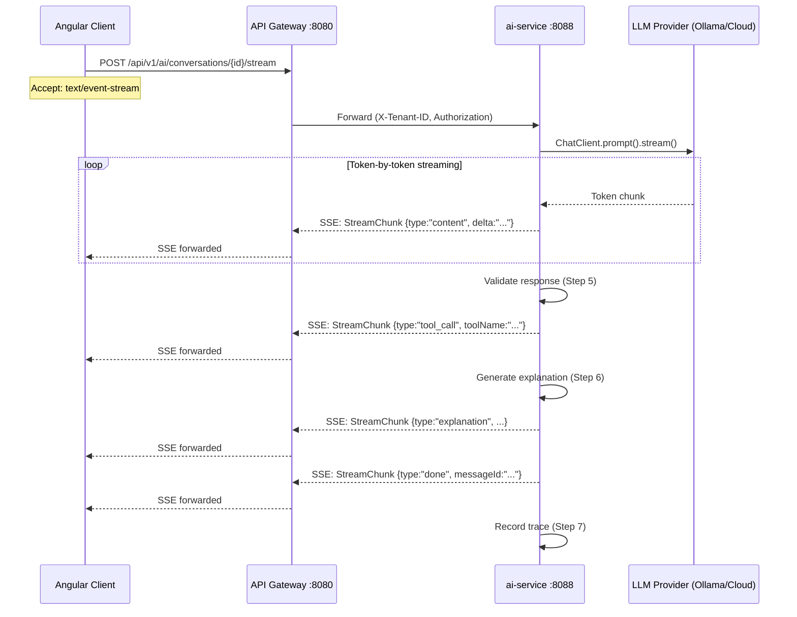
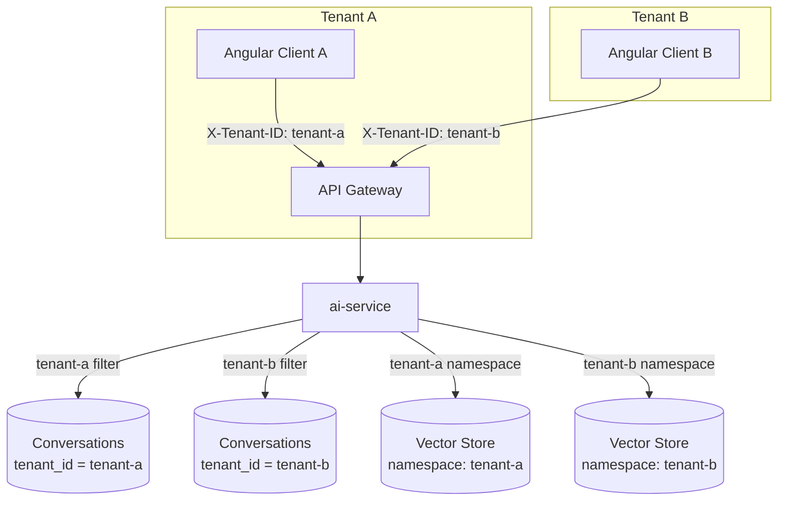
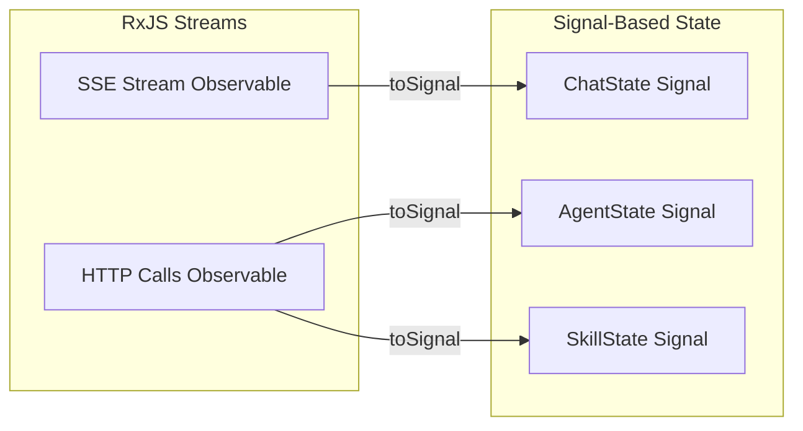
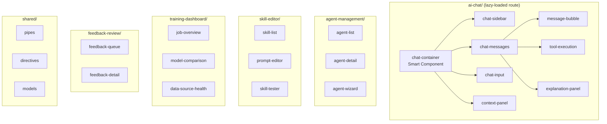
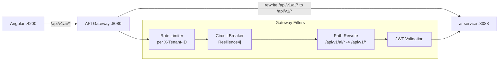
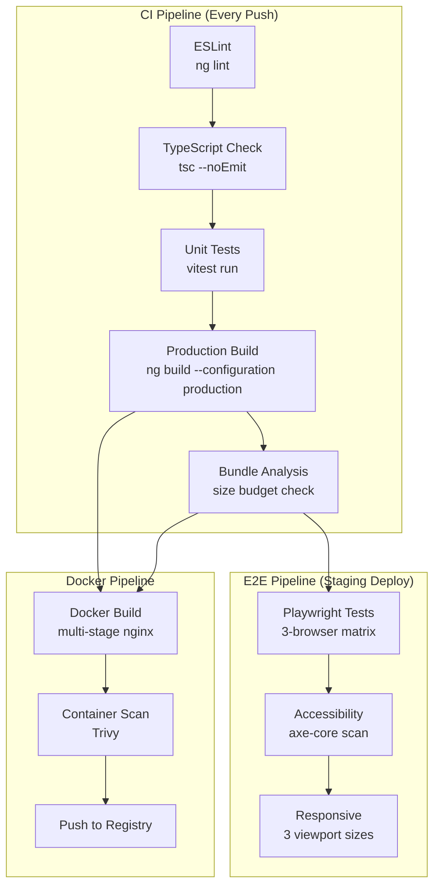
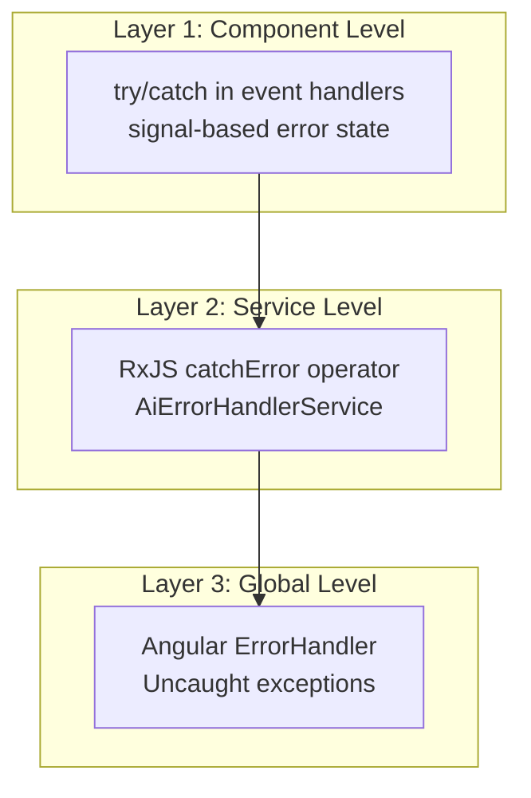
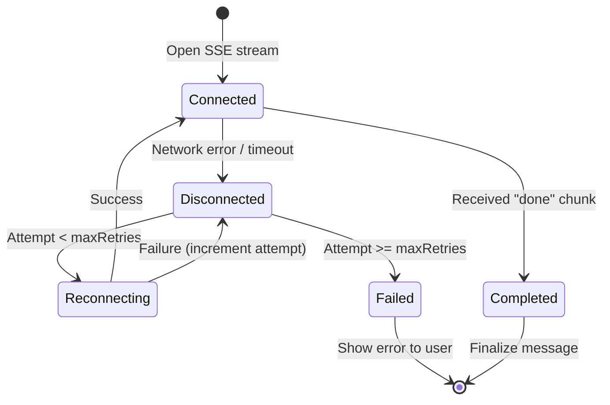
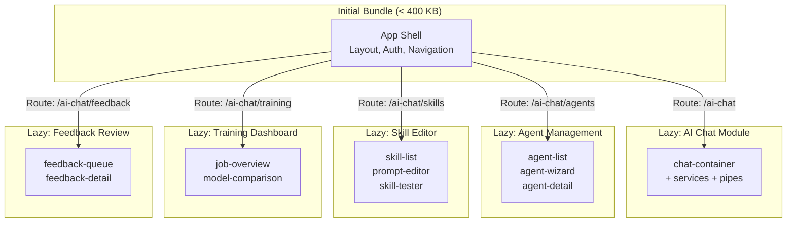
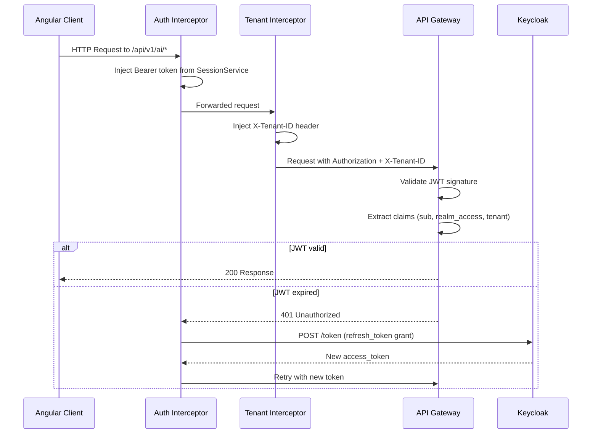

# Full-Stack Integration Specification: AI Agent Platform

**Version:** 1.0.0
**Date:** March 6, 2026
**Status:** [PLANNED] -- Design specification; no implementation exists yet
**Author:** SA Agent
**Cross-References:**
- PRD: `docs/ai-service/01-PRD-AI-Agent-Platform.md`
- Technical Specification: `docs/ai-service/02-Technical-Specification.md`
- Epics and User Stories: `docs/ai-service/03-Epics-and-User-Stories.md`
- Git Structure Guide: `docs/ai-service/04-Git-Structure-and-Claude-Code-Guide.md`

**Scope:** This document specifies the integration layer between the Angular 21 frontend and the Spring Boot 3.4 backend for the AI Agent Platform. It covers real-time communication, DTO contracts, Angular service architecture, component hierarchy, API gateway routing, E2E test specifications, CI/CD pipeline design, error handling, performance optimization, and security integration.

---

## Table of Contents

1. [Real-Time Communication Architecture](#1-real-time-communication-architecture)
2. [DTO Contracts](#2-dto-contracts)
3. [Angular Service Layer](#3-angular-service-layer)
4. [Angular Component Architecture](#4-angular-component-architecture)
5. [API Gateway Route Configuration](#5-api-gateway-route-configuration)
6. [E2E Test Specification (Playwright)](#6-e2e-test-specification-playwright)
7. [CI/CD Pipeline for Frontend](#7-cicd-pipeline-for-frontend)
8. [Error Handling and Resilience](#8-error-handling-and-resilience)
9. [Performance Optimization](#9-performance-optimization)
10. [Security Integration](#10-security-integration)

---

## 1. Real-Time Communication Architecture

**Status:** [PLANNED]
**PRD Reference:** Section 3.1 (Seven-Step Request Pipeline), Section 3.7 (Explanation Generation)
**Tech Spec Reference:** Section 3.3 (ReAct Loop), Section 3.9 (Request Pipeline)

### 1.1 Server-Sent Events (SSE) for Streaming Agent Responses

The AI platform uses SSE as the primary real-time channel for streaming agent responses to the frontend. SSE is chosen over WebSocket for this use case because:

- Agent responses are inherently unidirectional (server to client)
- SSE works over standard HTTP/2 with automatic multiplexing
- Built-in reconnection support in the browser `EventSource` API
- Simpler infrastructure -- no protocol upgrade, works through standard proxies and load balancers
- The existing `ai-service` already uses `Flux<StreamChunkDTO>` with `TEXT_EVENT_STREAM_VALUE` (verified in `StreamController.java`)



### 1.2 Spring WebFlux SSE Endpoint Design

**Approach:** Flux-based streaming (not `SseEmitter`)

| Criterion | `SseEmitter` (Servlet) | `Flux<T>` (WebFlux) | Decision |
|-----------|------------------------|---------------------|----------|
| Backpressure | Manual | Built-in via Reactor | Flux |
| Thread model | Blocks servlet thread | Non-blocking | Flux |
| Timeout handling | Manual `completeWithError` | `timeout()` operator | Flux |
| Error propagation | Callback-based | `onErrorResume` operator | Flux |
| Spring AI compatibility | Requires wrapping | Native `ChatClient.stream()` returns `Flux` | Flux |
| Existing pattern | -- | `StreamController.java` already uses `Flux<StreamChunkDTO>` | Flux |

**Decision:** Use `Flux<StreamChunkDTO>` (already established pattern in codebase).

#### Backend SSE Controller (Extended)

```java
@RestController
@RequestMapping("/api/v1/conversations")
@RequiredArgsConstructor
@Tag(name = "Streaming", description = "SSE streaming endpoints for real-time AI chat")
public class StreamController {

    private final ConversationService conversationService;
    private final RequestPipeline requestPipeline;

    /**
     * Streams agent response via SSE.
     * Emits: start -> content* -> tool_call* -> validation -> explanation -> done
     *
     * PRD Ref: Section 3.1 (7-step pipeline streamed to client)
     */
    @PostMapping(value = "/{id}/stream", produces = MediaType.TEXT_EVENT_STREAM_VALUE)
    @Operation(summary = "Send a message with streaming response (SSE)")
    public Flux<StreamChunkDTO> streamMessage(
            @RequestHeader("X-Tenant-ID") String tenantId,
            @AuthenticationPrincipal Jwt jwt,
            @PathVariable UUID id,
            @Valid @RequestBody ChatRequest request) {

        UUID userId = extractUserId(jwt);

        return Flux.concat(
            Flux.just(StreamChunkDTO.start()),
            requestPipeline.streamExecute(id, tenantId, userId, request),
            Flux.just(StreamChunkDTO.done(request.messageId(), 0))
        )
        .timeout(Duration.ofSeconds(120))
        .onErrorResume(TimeoutException.class, e ->
            Flux.just(StreamChunkDTO.error("Response timed out after 120 seconds")))
        .onErrorResume(e ->
            Flux.just(StreamChunkDTO.error("An error occurred: " + e.getMessage())));
    }
}
```

### 1.3 Angular EventSource Client Implementation

The Angular client uses the native `EventSource` API wrapped in an RxJS Observable for SSE consumption. Since `EventSource` only supports GET requests, and our streaming endpoint is POST, we use the `fetch` API with `ReadableStream` instead.

```typescript
// ai-chat/services/sse-client.service.ts
import { Injectable, inject, NgZone } from '@angular/core';
import { Observable } from 'rxjs';
import { SessionService } from '@core/services/session.service';
import { TenantContextService } from '@core/services/tenant-context.service';
import { StreamChunk } from '../models/ai-chat.models';

@Injectable({ providedIn: 'root' })
export class SseClientService {
  private readonly session = inject(SessionService);
  private readonly tenantContext = inject(TenantContextService);
  private readonly ngZone = inject(NgZone);

  /**
   * Opens a POST-based SSE stream using fetch + ReadableStream.
   * EventSource only supports GET; we need POST to send the message body.
   */
  streamChat(conversationId: string, body: ChatRequest): Observable<StreamChunk> {
    return new Observable<StreamChunk>((subscriber) => {
      const controller = new AbortController();

      this.ngZone.runOutsideAngular(() => {
        this.fetchStream(conversationId, body, controller.signal, subscriber);
      });

      return () => controller.abort();
    });
  }

  private async fetchStream(
    conversationId: string,
    body: ChatRequest,
    signal: AbortSignal,
    subscriber: import('rxjs').Subscriber<StreamChunk>,
  ): Promise<void> {
    try {
      const response = await fetch(
        `/api/v1/ai/conversations/${conversationId}/stream`,
        {
          method: 'POST',
          headers: {
            'Content-Type': 'application/json',
            Authorization: `Bearer ${this.session.accessToken()}`,
            'X-Tenant-ID': this.tenantContext.tenantId() ?? '',
            Accept: 'text/event-stream',
          },
          body: JSON.stringify(body),
          signal,
        },
      );

      if (!response.ok) {
        this.ngZone.run(() =>
          subscriber.error(new Error(`SSE request failed: ${response.status}`)),
        );
        return;
      }

      const reader = response.body?.getReader();
      if (!reader) {
        this.ngZone.run(() => subscriber.error(new Error('No readable stream')));
        return;
      }

      const decoder = new TextDecoder();
      let buffer = '';

      while (true) {
        const { done, value } = await reader.read();
        if (done) break;

        buffer += decoder.decode(value, { stream: true });
        const lines = buffer.split('\n');
        buffer = lines.pop() ?? '';

        for (const line of lines) {
          if (line.startsWith('data:')) {
            const data = line.slice(5).trim();
            if (data) {
              try {
                const chunk: StreamChunk = JSON.parse(data);
                this.ngZone.run(() => subscriber.next(chunk));
                if (chunk.done) {
                  this.ngZone.run(() => subscriber.complete());
                  return;
                }
              } catch {
                // Skip malformed JSON lines
              }
            }
          }
        }
      }

      this.ngZone.run(() => subscriber.complete());
    } catch (err: unknown) {
      if (err instanceof DOMException && err.name === 'AbortError') {
        this.ngZone.run(() => subscriber.complete());
      } else {
        this.ngZone.run(() => subscriber.error(err));
      }
    }
  }
}
```

### 1.4 Reconnection Strategy with Exponential Backoff

```typescript
// ai-chat/services/sse-reconnect.service.ts
import { Injectable } from '@angular/core';

export interface ReconnectConfig {
  maxRetries: number;
  baseDelayMs: number;
  maxDelayMs: number;
  jitterFactor: number;
}

const DEFAULT_CONFIG: ReconnectConfig = {
  maxRetries: 5,
  baseDelayMs: 1000,
  maxDelayMs: 30000,
  jitterFactor: 0.3,
};

@Injectable({ providedIn: 'root' })
export class SseReconnectService {
  computeDelay(attempt: number, config: ReconnectConfig = DEFAULT_CONFIG): number {
    const exponentialDelay = Math.min(
      config.baseDelayMs * Math.pow(2, attempt),
      config.maxDelayMs,
    );
    const jitter = exponentialDelay * config.jitterFactor * (Math.random() * 2 - 1);
    return Math.max(0, exponentialDelay + jitter);
  }

  shouldRetry(attempt: number, config: ReconnectConfig = DEFAULT_CONFIG): boolean {
    return attempt < config.maxRetries;
  }
}
```

**Retry sequence:**

| Attempt | Base Delay | With Jitter (example) |
|---------|------------|----------------------|
| 0 | 1,000ms | 700ms -- 1,300ms |
| 1 | 2,000ms | 1,400ms -- 2,600ms |
| 2 | 4,000ms | 2,800ms -- 5,200ms |
| 3 | 8,000ms | 5,600ms -- 10,400ms |
| 4 | 16,000ms | 11,200ms -- 20,800ms |

### 1.5 Multi-Tenant SSE Channel Isolation

Each SSE stream is inherently tenant-isolated because:

1. The `X-Tenant-ID` header is injected by the Angular `tenantHeaderInterceptor` (verified in `frontend/src/app/core/interceptors/tenant-header.interceptor.ts`)
2. The backend `StreamController` receives `tenantId` via `@RequestHeader("X-Tenant-ID")`
3. The `ConversationService` filters conversations by `tenantId` before allowing streaming
4. RAG retrieval in the pipeline is scoped by tenant namespace (Tech Spec Section 3.12)



### 1.6 WebSocket (Future Bi-Directional Communication)

**Status:** [PLANNED] -- Phase 5 consideration

For use cases requiring true bi-directional communication (e.g., collaborative agent editing, real-time approval workflows), STOMP over WebSocket may be introduced in a later phase.

| Criterion | SSE (Current) | WebSocket (Future) |
|-----------|---------------|-------------------|
| Direction | Server-to-client only | Bi-directional |
| Protocol | HTTP/2 | WS:// upgrade |
| Use case | Streaming agent responses | Collaborative editing, approvals |
| Reconnection | Manual (fetch-based) | STOMP auto-reconnect |
| Load balancer | Standard HTTP | Requires sticky sessions or WS-aware LB |
| Complexity | Low | Higher |

**WebSocket would be used for:**
- Human-in-the-loop approval workflows (PRD Section 3.6.1)
- Multi-agent debate visualization (PRD Section 3.8)
- Real-time collaborative skill editing
- Live training job progress with interactive controls

---

## 2. DTO Contracts

**Status:** [PLANNED]
**PRD Reference:** Section 3 (Agent System), Section 4 (Learning Pipeline)
**Tech Spec Reference:** Section 3 (Agent Common Library), Section 4 (Learning Pipeline)

All DTOs are defined as TypeScript interfaces for the Angular frontend AND Java record classes for the Spring Boot backend. Field naming uses `camelCase` in both layers. Serialization uses Jackson on the backend with default camelCase strategy.

### 2.1 Chat DTOs

#### ChatRequest

```typescript
// frontend: ai-chat/models/chat.models.ts
export interface ChatRequest {
  agentId: string;            // UUID of target agent
  message: string;            // User message content
  conversationId?: string;    // UUID, omit for new conversation
  tenantId?: string;          // Injected by interceptor, optional in body
  attachments?: Attachment[];  // File attachments (Phase 3+)
}

export interface Attachment {
  fileName: string;
  mimeType: string;
  sizeBytes: number;
  base64Content: string;      // Base64-encoded file content
}
```

```java
// backend: com.ems.ai.dto.ChatRequest
package com.ems.ai.dto;

import jakarta.validation.constraints.NotBlank;
import jakarta.validation.constraints.NotNull;
import java.util.List;
import java.util.UUID;

public record ChatRequest(
    @NotNull(message = "Agent ID is required")
    UUID agentId,

    @NotBlank(message = "Message content is required")
    String message,

    UUID conversationId,    // null = create new conversation

    String tenantId,        // populated from header if absent

    List<Attachment> attachments
) {
    public record Attachment(
        @NotBlank String fileName,
        @NotBlank String mimeType,
        long sizeBytes,
        @NotBlank String base64Content
    ) {}
}
```

#### ChatResponse

```typescript
// frontend
export interface ChatResponse {
  messageId: string;          // UUID of stored message
  content: string;            // Full response content
  type: MessageType;          // 'text' | 'code' | 'chart' | 'table'
  agentId: string;            // UUID of responding agent
  traceId: string;            // Distributed trace ID
  timestamp: string;          // ISO 8601
  explanation?: ExplanationResponse;
  toolCalls?: ToolExecutionEvent[];
  tokenCount?: number;
}

export type MessageType = 'text' | 'code' | 'chart' | 'table' | 'error';
```

```java
package com.ems.ai.dto;

import java.time.Instant;
import java.util.List;
import java.util.UUID;

public record ChatResponse(
    UUID messageId,
    String content,
    String type,          // text, code, chart, table, error
    UUID agentId,
    String traceId,
    Instant timestamp,
    ExplanationResponse explanation,
    List<ToolExecutionEvent> toolCalls,
    Integer tokenCount
) {}
```

#### StreamChunk

```typescript
// frontend
export interface StreamChunk {
  messageId?: string;
  delta?: string;             // Incremental text content
  type: StreamChunkType;
  done: boolean;
  toolCall?: ToolExecutionEvent;
  validation?: ValidationResult;
  explanation?: ExplanationResponse;
  tokenCount?: number;
  error?: string;
}

export type StreamChunkType =
  | 'start'
  | 'content'
  | 'tool_call'
  | 'validation'
  | 'explanation'
  | 'done'
  | 'error';
```

```java
package com.ems.ai.dto;

public record StreamChunk(
    String messageId,
    String delta,
    String type,    // start, content, tool_call, validation, explanation, done, error
    boolean done,
    ToolExecutionEvent toolCall,
    ValidationResult validation,
    ExplanationResponse explanation,
    Integer tokenCount,
    String error
) {
    public static StreamChunk start() {
        return new StreamChunk(null, null, "start", false, null, null, null, null, null);
    }

    public static StreamChunk content(String delta) {
        return new StreamChunk(null, delta, "content", false, null, null, null, null, null);
    }

    public static StreamChunk toolCall(ToolExecutionEvent event) {
        return new StreamChunk(null, null, "tool_call", false, event, null, null, null, null);
    }

    public static StreamChunk validation(ValidationResult result) {
        return new StreamChunk(null, null, "validation", false, null, result, null, null, null);
    }

    public static StreamChunk explanation(ExplanationResponse expl) {
        return new StreamChunk(null, null, "explanation", false, null, null, expl, null, null);
    }

    public static StreamChunk done(String messageId, int tokenCount) {
        return new StreamChunk(messageId, null, "done", true, null, null, null, tokenCount, null);
    }

    public static StreamChunk error(String error) {
        return new StreamChunk(null, null, "error", true, null, null, null, null, error);
    }
}
```

#### ToolExecutionEvent

```typescript
// frontend
export interface ToolExecutionEvent {
  toolName: string;
  status: 'running' | 'success' | 'failure' | 'timeout';
  input: Record<string, unknown>;
  output?: unknown;
  durationMs?: number;
  error?: string;
}
```

```java
package com.ems.ai.dto;

import java.util.Map;

public record ToolExecutionEvent(
    String toolName,
    String status,          // running, success, failure, timeout
    Map<String, Object> input,
    Object output,
    Long durationMs,
    String error
) {}
```

#### ExplanationResponse

```typescript
// frontend
export interface ExplanationResponse {
  businessSummary: string;           // Non-technical summary (PRD 3.7.1)
  technicalDetails: string;          // Step-by-step for developers (PRD 3.7.2)
  artifacts: ExplanationArtifact[];  // Files changed, queries run (PRD 3.7.3)
}

export interface ExplanationArtifact {
  type: 'file' | 'query' | 'tool_call' | 'api_call';
  name: string;
  summary: string;
  details?: Record<string, unknown>;
}
```

```java
package com.ems.ai.dto;

import java.util.List;
import java.util.Map;

public record ExplanationResponse(
    String businessSummary,
    String technicalDetails,
    List<ExplanationArtifact> artifacts
) {
    public record ExplanationArtifact(
        String type,      // file, query, tool_call, api_call
        String name,
        String summary,
        Map<String, Object> details
    ) {}
}
```

#### ValidationResult

```typescript
// frontend
export interface ValidationResult {
  passed: boolean;
  issues: ValidationIssue[];
}

export interface ValidationIssue {
  rule: string;
  severity: 'error' | 'warning' | 'info';
  message: string;
  autoFixed: boolean;
}
```

```java
package com.ems.ai.dto;

import java.util.List;

public record ValidationResult(
    boolean passed,
    List<ValidationIssue> issues
) {
    public record ValidationIssue(
        String rule,
        String severity,    // error, warning, info
        String message,
        boolean autoFixed
    ) {}
}
```

### 2.2 Agent DTOs

#### AgentProfile

```typescript
// frontend
export interface AgentProfile {
  id: string;                        // UUID
  name: string;
  description: string;
  avatarUrl?: string;
  category: AgentCategory;
  status: AgentStatus;
  model: string;                     // e.g., "llama3.1:8b"
  provider: LlmProvider;
  skills: string[];                  // Skill IDs assigned
  metrics: AgentMetrics;
  isPublic: boolean;
  isSystem: boolean;
  createdAt: string;
  updatedAt: string;
}

export type AgentStatus = 'active' | 'inactive' | 'training' | 'error';
export type LlmProvider = 'OLLAMA' | 'OPENAI' | 'ANTHROPIC' | 'GEMINI';

export interface AgentCategory {
  id: string;
  name: string;
  description: string;
  icon: string;
}

export interface AgentMetrics {
  totalConversations: number;
  avgResponseTimeMs: number;
  satisfactionScore: number;       // 0.0 - 5.0
  successRate: number;             // 0.0 - 1.0
}
```

```java
package com.ems.ai.dto;

import java.time.Instant;
import java.util.List;
import java.util.UUID;

public record AgentProfile(
    UUID id,
    String name,
    String description,
    String avatarUrl,
    AgentCategory category,
    String status,        // active, inactive, training, error
    String model,
    String provider,      // OLLAMA, OPENAI, ANTHROPIC, GEMINI
    List<String> skills,
    AgentMetrics metrics,
    boolean isPublic,
    boolean isSystem,
    Instant createdAt,
    Instant updatedAt
) {
    public record AgentCategory(UUID id, String name, String description, String icon) {}
    public record AgentMetrics(
        long totalConversations,
        long avgResponseTimeMs,
        double satisfactionScore,
        double successRate
    ) {}
}
```

#### AgentCreateRequest

```typescript
// frontend
export interface AgentCreateRequest {
  name: string;
  description: string;
  category: string;                  // Category ID
  skills: string[];                  // Skill IDs to assign
  provider: LlmProvider;
  model: string;
  systemPrompt: string;
  greetingMessage?: string;
  conversationStarters?: string[];
  config?: Record<string, unknown>;  // Model-specific config
  isPublic?: boolean;
}
```

```java
package com.ems.ai.dto;

import jakarta.validation.constraints.NotBlank;
import jakarta.validation.constraints.NotNull;
import java.util.List;
import java.util.Map;

public record AgentCreateRequest(
    @NotBlank String name,
    String description,
    @NotNull String category,
    List<String> skills,
    @NotNull String provider,
    @NotNull String model,
    @NotBlank String systemPrompt,
    String greetingMessage,
    List<String> conversationStarters,
    Map<String, Object> config,
    Boolean isPublic
) {}
```

#### AgentStatusResponse

```typescript
// frontend
export interface AgentStatusResponse {
  id: string;
  status: AgentStatus;
  activeConversations: number;
  uptimeSeconds: number;
  modelInfo: ModelInfo;
  lastHealthCheck: string;           // ISO 8601
}

export interface ModelInfo {
  provider: LlmProvider;
  model: string;
  contextWindowSize: number;
  maxTokens: number;
  temperature: number;
}
```

```java
package com.ems.ai.dto;

import java.time.Instant;
import java.util.UUID;

public record AgentStatusResponse(
    UUID id,
    String status,
    int activeConversations,
    long uptimeSeconds,
    ModelInfo modelInfo,
    Instant lastHealthCheck
) {
    public record ModelInfo(
        String provider,
        String model,
        int contextWindowSize,
        int maxTokens,
        double temperature
    ) {}
}
```

### 2.3 Skill DTOs

```typescript
// frontend
export interface SkillDefinition {
  id: string;
  name: string;
  version: string;                   // Semantic version
  systemPrompt: string;
  tools: string[];                   // Tool names
  knowledgeScope: string[];          // Vector store collection names
  rules: SkillRule[];
  examples: SkillExample[];
  tenantId?: string;
  parentSkillId?: string;
  active: boolean;
  createdAt: string;
  updatedAt: string;
}

export interface SkillRule {
  id: string;
  description: string;
  type: 'constraint' | 'guardrail' | 'format';
}

export interface SkillExample {
  input: string;
  expectedOutput: string;
  description?: string;
}

export interface SkillTestResult {
  skillId: string;
  totalTestCases: number;
  passed: number;
  failed: number;
  details: SkillTestDetail[];
}

export interface SkillTestDetail {
  testCaseId: string;
  input: string;
  expectedOutput: string;
  actualOutput: string;
  passed: boolean;
  latencyMs: number;
}
```

```java
package com.ems.ai.dto;

import jakarta.validation.constraints.NotBlank;
import java.time.Instant;
import java.util.List;

public record SkillDefinitionDTO(
    String id,
    @NotBlank String name,
    String version,
    @NotBlank String systemPrompt,
    List<String> tools,
    List<String> knowledgeScope,
    List<SkillRule> rules,
    List<SkillExample> examples,
    String tenantId,
    String parentSkillId,
    boolean active,
    Instant createdAt,
    Instant updatedAt
) {
    public record SkillRule(String id, String description, String type) {}
    public record SkillExample(String input, String expectedOutput, String description) {}
}

public record SkillTestResult(
    String skillId,
    int totalTestCases,
    int passed,
    int failed,
    List<SkillTestDetail> details
) {
    public record SkillTestDetail(
        String testCaseId,
        String input,
        String expectedOutput,
        String actualOutput,
        boolean passed,
        long latencyMs
    ) {}
}
```

### 2.4 Feedback DTOs

```typescript
// frontend
export interface FeedbackSubmission {
  messageId: string;                 // UUID of rated message
  rating: number;                    // 1-5 stars or -1/+1 for thumbs
  correction?: string;              // "The answer should have been..."
  category?: FeedbackCategory;
  tags: string[];
}

export type FeedbackCategory =
  | 'accuracy'
  | 'completeness'
  | 'relevance'
  | 'tone'
  | 'speed'
  | 'other';

export interface FeedbackSummary {
  totalRatings: number;
  averageScore: number;
  topIssues: FeedbackIssue[];
  trend: FeedbackTrendPoint[];
}

export interface FeedbackIssue {
  category: FeedbackCategory;
  count: number;
  percentage: number;
}

export interface FeedbackTrendPoint {
  date: string;                      // ISO date
  averageScore: number;
  totalRatings: number;
}
```

```java
package com.ems.ai.dto;

import jakarta.validation.constraints.Max;
import jakarta.validation.constraints.Min;
import jakarta.validation.constraints.NotNull;
import java.time.LocalDate;
import java.util.List;
import java.util.UUID;

public record FeedbackSubmission(
    @NotNull UUID messageId,
    @Min(1) @Max(5) int rating,
    String correction,
    String category,
    List<String> tags
) {}

public record FeedbackSummary(
    long totalRatings,
    double averageScore,
    List<FeedbackIssue> topIssues,
    List<FeedbackTrendPoint> trend
) {
    public record FeedbackIssue(String category, long count, double percentage) {}
    public record FeedbackTrendPoint(LocalDate date, double averageScore, long totalRatings) {}
}
```

### 2.5 Training DTOs

```typescript
// frontend
export interface TrainingJobRequest {
  method: TrainingMethod;
  dataSource: TrainingDataSource;
  config: TrainingConfig;
}

export type TrainingMethod = 'SFT' | 'DPO' | 'RLHF' | 'DISTILLATION' | 'CONTRASTIVE';

export interface TrainingDataSource {
  type: 'feedback' | 'corrections' | 'patterns' | 'teacher' | 'traces';
  filters: Record<string, string>;
  limit?: number;
}

export interface TrainingConfig {
  baseModel: string;
  learningRate: number;
  epochs: number;
  batchSize: number;
  warmupSteps: number;
  evaluationStrategy: 'steps' | 'epoch';
  evaluationSteps?: number;
}

export interface TrainingJobStatus {
  jobId: string;                     // UUID
  status: 'queued' | 'preparing' | 'training' | 'evaluating' | 'completed' | 'failed';
  progress: number;                  // 0.0 - 1.0
  metrics: TrainingMetrics;
  startTime: string;                 // ISO 8601
  estimatedCompletion?: string;      // ISO 8601
  error?: string;
}

export interface TrainingMetrics {
  loss: number;
  accuracy?: number;
  evaluationScore?: number;
  tokensProcessed: number;
  epochsCompleted: number;
}

export interface ModelEvaluation {
  modelId: string;
  benchmarks: BenchmarkResult[];
  comparison: ModelComparison;
  recommendation: 'deploy' | 'reject' | 'review';
}

export interface BenchmarkResult {
  name: string;
  score: number;
  baseline: number;
  improvement: number;
}

export interface ModelComparison {
  currentModelId: string;
  candidateModelId: string;
  overallImprovement: number;
  regressions: string[];
}
```

```java
package com.ems.ai.dto;

import jakarta.validation.constraints.NotNull;
import java.time.Instant;
import java.util.List;
import java.util.Map;

public record TrainingJobRequest(
    @NotNull String method,     // SFT, DPO, RLHF, DISTILLATION, CONTRASTIVE
    @NotNull TrainingDataSource dataSource,
    @NotNull TrainingConfig config
) {
    public record TrainingDataSource(
        String type,
        Map<String, String> filters,
        Integer limit
    ) {}

    public record TrainingConfig(
        String baseModel,
        double learningRate,
        int epochs,
        int batchSize,
        int warmupSteps,
        String evaluationStrategy,
        Integer evaluationSteps
    ) {}
}

public record TrainingJobStatus(
    String jobId,
    String status,
    double progress,
    TrainingMetrics metrics,
    Instant startTime,
    Instant estimatedCompletion,
    String error
) {
    public record TrainingMetrics(
        double loss,
        Double accuracy,
        Double evaluationScore,
        long tokensProcessed,
        int epochsCompleted
    ) {}
}

public record ModelEvaluation(
    String modelId,
    List<BenchmarkResult> benchmarks,
    ModelComparison comparison,
    String recommendation     // deploy, reject, review
) {
    public record BenchmarkResult(String name, double score, double baseline, double improvement) {}
    public record ModelComparison(
        String currentModelId,
        String candidateModelId,
        double overallImprovement,
        List<String> regressions
    ) {}
}
```

### 2.6 Tenant DTOs

```typescript
// frontend
export interface TenantAiConfig {
  tenantId: string;
  name: string;
  modelConfig: TenantModelConfig;
  concurrencyLimits: ConcurrencyLimits;
  featureFlags: Record<string, boolean>;
}

export interface TenantModelConfig {
  defaultProvider: LlmProvider;
  defaultModel: string;
  allowedProviders: LlmProvider[];
  maxTokensPerRequest: number;
  cloudFallbackEnabled: boolean;
}

export interface ConcurrencyLimits {
  maxConcurrentPlanSteps: number;    // PRD 7.2: e.g., 10
  maxConcurrentExecuteSteps: number; // PRD 7.2: e.g., 5
  maxActiveConversations: number;
}
```

```java
package com.ems.ai.dto;

import java.util.List;
import java.util.Map;

public record TenantAiConfig(
    String tenantId,
    String name,
    TenantModelConfig modelConfig,
    ConcurrencyLimits concurrencyLimits,
    Map<String, Boolean> featureFlags
) {
    public record TenantModelConfig(
        String defaultProvider,
        String defaultModel,
        List<String> allowedProviders,
        int maxTokensPerRequest,
        boolean cloudFallbackEnabled
    ) {}

    public record ConcurrencyLimits(
        int maxConcurrentPlanSteps,
        int maxConcurrentExecuteSteps,
        int maxActiveConversations
    ) {}
}
```

---

## 3. Angular Service Layer

**Status:** [PLANNED]
**Angular Version:** 21.x (verified in `frontend/package.json`: `@angular/core: ^21.1.0`)
**UI Library:** PrimeNG 21.x (verified: `primeng: ^21.1.1`)
**Test Framework:** Vitest 4.x (verified: `vitest: ^4.0.8`)

### 3.1 State Management Approach

The AI Chat module uses **Angular Signals** as the primary state management mechanism, consistent with the Angular 21 direction. RxJS is used only for HTTP calls and SSE streaming where Observable semantics are required. NgRx is NOT used -- signals provide sufficient state management for this module's complexity level.



### 3.2 ChatService

```typescript
// ai-chat/services/chat.service.ts
import { Injectable, inject, signal, computed } from '@angular/core';
import { HttpClient } from '@angular/common/http';
import { Observable, Subject, catchError, of, retry, takeUntil, tap } from 'rxjs';
import { toSignal } from '@angular/core/rxjs-interop';
import { SseClientService } from './sse-client.service';
import { SseReconnectService } from './sse-reconnect.service';
import {
  ChatRequest, ChatResponse, StreamChunk,
  ConversationSummary, MessageHistory,
} from '../models/ai-chat.models';

@Injectable({ providedIn: 'root' })
export class ChatService {
  private readonly http = inject(HttpClient);
  private readonly sseClient = inject(SseClientService);
  private readonly reconnect = inject(SseReconnectService);
  private readonly baseUrl = '/api/v1/ai';

  // --- State Signals ---
  readonly conversations = signal<ConversationSummary[]>([]);
  readonly activeConversationId = signal<string | null>(null);
  readonly messages = signal<MessageHistory[]>([]);
  readonly isStreaming = signal(false);
  readonly streamingContent = signal('');
  readonly currentToolCall = signal<ToolExecutionEvent | null>(null);
  readonly currentExplanation = signal<ExplanationResponse | null>(null);
  readonly error = signal<string | null>(null);

  // --- Computed ---
  readonly activeConversation = computed(() => {
    const id = this.activeConversationId();
    return this.conversations().find((c) => c.id === id) ?? null;
  });

  readonly hasActiveStream = computed(() => this.isStreaming());

  // --- SSE Streaming ---
  private streamCancel$ = new Subject<void>();

  sendMessage(conversationId: string, request: ChatRequest): void {
    this.streamCancel$.next();
    this.isStreaming.set(true);
    this.streamingContent.set('');
    this.error.set(null);
    this.currentToolCall.set(null);
    this.currentExplanation.set(null);

    this.sseClient
      .streamChat(conversationId, request)
      .pipe(takeUntil(this.streamCancel$))
      .subscribe({
        next: (chunk) => this.handleStreamChunk(chunk),
        error: (err) => {
          this.isStreaming.set(false);
          this.error.set(err.message ?? 'Stream connection failed');
        },
        complete: () => this.isStreaming.set(false),
      });
  }

  cancelStream(): void {
    this.streamCancel$.next();
    this.isStreaming.set(false);
  }

  private handleStreamChunk(chunk: StreamChunk): void {
    switch (chunk.type) {
      case 'content':
        this.streamingContent.update((prev) => prev + (chunk.delta ?? ''));
        break;
      case 'tool_call':
        if (chunk.toolCall) this.currentToolCall.set(chunk.toolCall);
        break;
      case 'explanation':
        if (chunk.explanation) this.currentExplanation.set(chunk.explanation);
        break;
      case 'done':
        this.finalizeMessage(chunk);
        break;
      case 'error':
        this.error.set(chunk.error ?? 'Unknown streaming error');
        this.isStreaming.set(false);
        break;
    }
  }

  private finalizeMessage(chunk: StreamChunk): void {
    const message: MessageHistory = {
      id: chunk.messageId ?? crypto.randomUUID(),
      role: 'assistant',
      content: this.streamingContent(),
      toolCalls: this.currentToolCall() ? [this.currentToolCall()!] : [],
      explanation: this.currentExplanation() ?? undefined,
      tokenCount: chunk.tokenCount,
      createdAt: new Date().toISOString(),
    };
    this.messages.update((msgs) => [...msgs, message]);
    this.streamingContent.set('');
    this.isStreaming.set(false);
  }

  // --- REST Operations ---
  loadConversations(): void {
    this.http
      .get<ConversationSummary[]>(`${this.baseUrl}/conversations`)
      .pipe(catchError(() => of([])))
      .subscribe((convs) => this.conversations.set(convs));
  }

  loadMessages(conversationId: string): void {
    this.activeConversationId.set(conversationId);
    this.http
      .get<MessageHistory[]>(`${this.baseUrl}/conversations/${conversationId}/messages`)
      .pipe(catchError(() => of([])))
      .subscribe((msgs) => this.messages.set(msgs));
  }

  createConversation(agentId: string, title?: string): Observable<ConversationSummary> {
    return this.http.post<ConversationSummary>(`${this.baseUrl}/conversations`, {
      agentId,
      title,
    });
  }

  deleteConversation(conversationId: string): Observable<void> {
    return this.http.delete<void>(`${this.baseUrl}/conversations/${conversationId}`);
  }
}
```

### 3.3 AgentService

```typescript
// ai-chat/services/agent.service.ts
import { Injectable, inject, signal } from '@angular/core';
import { HttpClient, HttpParams } from '@angular/common/http';
import { Observable, catchError, of, tap } from 'rxjs';
import {
  AgentProfile, AgentCreateRequest, AgentStatusResponse, AgentCategory,
} from '../models/ai-chat.models';

interface Page<T> {
  content: T[];
  totalElements: number;
  totalPages: number;
  number: number;
  size: number;
}

@Injectable({ providedIn: 'root' })
export class AgentService {
  private readonly http = inject(HttpClient);
  private readonly baseUrl = '/api/v1/ai/agents';

  readonly agents = signal<AgentProfile[]>([]);
  readonly categories = signal<AgentCategory[]>([]);
  readonly selectedAgent = signal<AgentProfile | null>(null);
  readonly loading = signal(false);

  loadAgents(page = 0, size = 20): void {
    this.loading.set(true);
    const params = new HttpParams().set('page', page).set('size', size);
    this.http
      .get<Page<AgentProfile>>(this.baseUrl, { params })
      .pipe(
        tap(() => this.loading.set(false)),
        catchError(() => {
          this.loading.set(false);
          return of({ content: [], totalElements: 0, totalPages: 0, number: 0, size: 0 });
        }),
      )
      .subscribe((page) => this.agents.set(page.content));
  }

  getAgent(id: string): Observable<AgentProfile> {
    return this.http.get<AgentProfile>(`${this.baseUrl}/${id}`);
  }

  createAgent(request: AgentCreateRequest): Observable<AgentProfile> {
    return this.http.post<AgentProfile>(this.baseUrl, request);
  }

  updateAgent(id: string, request: Partial<AgentCreateRequest>): Observable<AgentProfile> {
    return this.http.put<AgentProfile>(`${this.baseUrl}/${id}`, request);
  }

  deleteAgent(id: string): Observable<void> {
    return this.http.delete<void>(`${this.baseUrl}/${id}`);
  }

  getStatus(id: string): Observable<AgentStatusResponse> {
    return this.http.get<AgentStatusResponse>(`${this.baseUrl}/${id}/status`);
  }

  loadCategories(): void {
    this.http
      .get<AgentCategory[]>(`${this.baseUrl}/categories`)
      .pipe(catchError(() => of([])))
      .subscribe((cats) => this.categories.set(cats));
  }

  searchAgents(query: string, page = 0, size = 20): Observable<Page<AgentProfile>> {
    const params = new HttpParams().set('query', query).set('page', page).set('size', size);
    return this.http.get<Page<AgentProfile>>(`${this.baseUrl}/search`, { params });
  }
}
```

### 3.4 SkillService

```typescript
// ai-chat/services/skill.service.ts
import { Injectable, inject, signal } from '@angular/core';
import { HttpClient } from '@angular/common/http';
import { Observable, catchError, of } from 'rxjs';
import { SkillDefinition, SkillTestResult, SkillExample } from '../models/ai-chat.models';

@Injectable({ providedIn: 'root' })
export class SkillService {
  private readonly http = inject(HttpClient);
  private readonly baseUrl = '/api/v1/ai/skills';

  readonly skills = signal<SkillDefinition[]>([]);
  readonly selectedSkill = signal<SkillDefinition | null>(null);
  readonly loading = signal(false);

  loadSkills(activeOnly = false): void {
    this.loading.set(true);
    const url = activeOnly ? `${this.baseUrl}?active=true` : this.baseUrl;
    this.http
      .get<SkillDefinition[]>(url)
      .pipe(catchError(() => of([])))
      .subscribe((skills) => {
        this.skills.set(skills);
        this.loading.set(false);
      });
  }

  createSkill(skill: Partial<SkillDefinition>): Observable<SkillDefinition> {
    return this.http.post<SkillDefinition>(this.baseUrl, skill);
  }

  updateSkill(id: string, skill: Partial<SkillDefinition>): Observable<SkillDefinition> {
    return this.http.put<SkillDefinition>(`${this.baseUrl}/${id}`, skill);
  }

  activateSkill(id: string): Observable<void> {
    return this.http.post<void>(`${this.baseUrl}/${id}/activate`, {});
  }

  deactivateSkill(id: string): Observable<void> {
    return this.http.post<void>(`${this.baseUrl}/${id}/deactivate`, {});
  }

  testSkill(id: string, testCases: SkillExample[]): Observable<SkillTestResult> {
    return this.http.post<SkillTestResult>(`${this.baseUrl}/${id}/test`, testCases);
  }
}
```

### 3.5 FeedbackService

```typescript
// ai-chat/services/feedback.service.ts
import { Injectable, inject } from '@angular/core';
import { HttpClient, HttpParams } from '@angular/common/http';
import { Observable } from 'rxjs';
import { FeedbackSubmission, FeedbackSummary } from '../models/ai-chat.models';

@Injectable({ providedIn: 'root' })
export class FeedbackService {
  private readonly http = inject(HttpClient);
  private readonly baseUrl = '/api/v1/ai/feedback';

  submitRating(feedback: FeedbackSubmission): Observable<void> {
    return this.http.post<void>(`${this.baseUrl}/rating`, feedback);
  }

  submitCorrection(messageId: string, correction: string): Observable<void> {
    return this.http.post<void>(`${this.baseUrl}/correction`, {
      messageId,
      correction,
    });
  }

  getSummary(agentId?: string, days = 30): Observable<FeedbackSummary> {
    let params = new HttpParams().set('days', days);
    if (agentId) params = params.set('agentId', agentId);
    return this.http.get<FeedbackSummary>(`${this.baseUrl}/summary`, { params });
  }

  getPendingReviews(page = 0, size = 20): Observable<Page<FeedbackSubmission>> {
    const params = new HttpParams().set('page', page).set('size', size);
    return this.http.get<Page<FeedbackSubmission>>(`${this.baseUrl}/pending`, { params });
  }
}
```

### 3.6 TrainingService

```typescript
// ai-chat/services/training.service.ts
import { Injectable, inject, signal } from '@angular/core';
import { HttpClient } from '@angular/common/http';
import { Observable, catchError, of, interval, switchMap, takeWhile } from 'rxjs';
import {
  TrainingJobRequest, TrainingJobStatus, ModelEvaluation,
} from '../models/ai-chat.models';

@Injectable({ providedIn: 'root' })
export class TrainingService {
  private readonly http = inject(HttpClient);
  private readonly baseUrl = '/api/v1/ai/training';

  readonly activeJobs = signal<TrainingJobStatus[]>([]);
  readonly selectedJob = signal<TrainingJobStatus | null>(null);

  startJob(request: TrainingJobRequest): Observable<TrainingJobStatus> {
    return this.http.post<TrainingJobStatus>(`${this.baseUrl}/jobs`, request);
  }

  getJobStatus(jobId: string): Observable<TrainingJobStatus> {
    return this.http.get<TrainingJobStatus>(`${this.baseUrl}/jobs/${jobId}`);
  }

  /** Polls job status every 5 seconds until terminal state. */
  pollJobStatus(jobId: string): Observable<TrainingJobStatus> {
    return interval(5000).pipe(
      switchMap(() => this.getJobStatus(jobId)),
      takeWhile((status) => !['completed', 'failed'].includes(status.status), true),
    );
  }

  cancelJob(jobId: string): Observable<void> {
    return this.http.post<void>(`${this.baseUrl}/jobs/${jobId}/cancel`, {});
  }

  listJobs(): void {
    this.http
      .get<TrainingJobStatus[]>(`${this.baseUrl}/jobs`)
      .pipe(catchError(() => of([])))
      .subscribe((jobs) => this.activeJobs.set(jobs));
  }

  getEvaluation(modelId: string): Observable<ModelEvaluation> {
    return this.http.get<ModelEvaluation>(`${this.baseUrl}/models/${modelId}/evaluation`);
  }
}
```

### 3.7 ModelService

```typescript
// ai-chat/services/model.service.ts
import { Injectable, inject, signal } from '@angular/core';
import { HttpClient } from '@angular/common/http';
import { Observable, catchError, of } from 'rxjs';

export interface ModelInfo {
  id: string;
  provider: string;
  name: string;
  version: string;
  status: 'available' | 'loading' | 'error';
  contextWindowSize: number;
  capabilities: string[];
}

@Injectable({ providedIn: 'root' })
export class ModelService {
  private readonly http = inject(HttpClient);
  private readonly baseUrl = '/api/v1/ai/models';

  readonly models = signal<ModelInfo[]>([]);

  loadModels(): void {
    this.http
      .get<ModelInfo[]>(this.baseUrl)
      .pipe(catchError(() => of([])))
      .subscribe((models) => this.models.set(models));
  }

  getModel(id: string): Observable<ModelInfo> {
    return this.http.get<ModelInfo>(`${this.baseUrl}/${id}`);
  }

  getProviders(): Observable<ProviderInfo[]> {
    return this.http.get<ProviderInfo[]>(`${this.baseUrl}/providers`);
  }
}

export interface ProviderInfo {
  name: string;
  enabled: boolean;
  models: string[];
  status: 'connected' | 'disconnected' | 'error';
}
```

### 3.8 TenantAiConfigService

```typescript
// ai-chat/services/tenant-ai-config.service.ts
import { Injectable, inject, signal } from '@angular/core';
import { HttpClient } from '@angular/common/http';
import { Observable, catchError, of } from 'rxjs';
import { TenantAiConfig } from '../models/ai-chat.models';

@Injectable({ providedIn: 'root' })
export class TenantAiConfigService {
  private readonly http = inject(HttpClient);
  private readonly baseUrl = '/api/v1/ai/tenant-config';

  readonly config = signal<TenantAiConfig | null>(null);

  loadConfig(): void {
    this.http
      .get<TenantAiConfig>(this.baseUrl)
      .pipe(catchError(() => of(null)))
      .subscribe((config) => this.config.set(config));
  }

  updateConfig(config: Partial<TenantAiConfig>): Observable<TenantAiConfig> {
    return this.http.put<TenantAiConfig>(this.baseUrl, config);
  }
}
```

### 3.9 HTTP Interceptor for Tenant Context Injection

The existing `tenantHeaderInterceptor` (verified at `frontend/src/app/core/interceptors/tenant-header.interceptor.ts`) already injects `X-Tenant-ID` into all API requests. No additional interceptor is needed for the AI module -- it leverages the same global interceptor chain.

The existing `authInterceptor` (verified at `frontend/src/app/core/interceptors/auth.interceptor.ts`) already handles Bearer token injection and 401 refresh logic. The AI module's HTTP calls automatically benefit from this.

### 3.10 Error Handling Strategy

```typescript
// ai-chat/services/ai-error-handler.service.ts
import { Injectable, signal } from '@angular/core';

export interface AiError {
  code: string;
  message: string;
  userMessage: string;       // i18n-ready key
  retryable: boolean;
  timestamp: string;
}

@Injectable({ providedIn: 'root' })
export class AiErrorHandlerService {
  readonly lastError = signal<AiError | null>(null);

  handleHttpError(status: number, body: unknown): AiError {
    const error = this.mapStatusToError(status, body);
    this.lastError.set(error);
    return error;
  }

  private mapStatusToError(status: number, body: unknown): AiError {
    const timestamp = new Date().toISOString();
    switch (status) {
      case 400:
        return { code: 'BAD_REQUEST', message: String(body), userMessage: 'ai.error.badRequest', retryable: false, timestamp };
      case 401:
        return { code: 'UNAUTHORIZED', message: 'Token expired', userMessage: 'ai.error.unauthorized', retryable: false, timestamp };
      case 403:
        return { code: 'FORBIDDEN', message: 'Insufficient permissions', userMessage: 'ai.error.forbidden', retryable: false, timestamp };
      case 404:
        return { code: 'NOT_FOUND', message: 'Resource not found', userMessage: 'ai.error.notFound', retryable: false, timestamp };
      case 429:
        return { code: 'RATE_LIMITED', message: 'Too many requests', userMessage: 'ai.error.rateLimited', retryable: true, timestamp };
      case 503:
        return { code: 'SERVICE_UNAVAILABLE', message: 'AI service unavailable', userMessage: 'ai.error.unavailable', retryable: true, timestamp };
      default:
        return { code: 'INTERNAL_ERROR', message: `HTTP ${status}`, userMessage: 'ai.error.internal', retryable: true, timestamp };
    }
  }

  clearError(): void {
    this.lastError.set(null);
  }
}
```

### 3.11 Caching Strategy

| API Call | Cache | TTL | Invalidation |
|----------|-------|-----|-------------|
| `GET /agents` | In-memory signal | 5 min | On agent create/update/delete |
| `GET /agents/categories` | In-memory signal | 30 min | Rare change |
| `GET /skills` | In-memory signal | 5 min | On skill create/update |
| `GET /models` | In-memory signal | 10 min | On provider status change |
| `GET /conversations` | In-memory signal | None | Always fresh |
| `GET /conversations/{id}/messages` | In-memory signal | None | Always fresh |
| `GET /feedback/summary` | In-memory signal | 15 min | On new feedback |
| `GET /training/jobs` | In-memory signal | None | Polled every 5s for active jobs |
| `GET /tenant-config` | In-memory signal | 30 min | On config update |

Caching is managed through Angular signals -- when data is loaded, it is stored in the signal. Subsequent reads come from the signal until an invalidation event occurs (create/update/delete) or the user manually refreshes.

---

## 4. Angular Component Architecture

**Status:** [PLANNED]
**PRD Reference:** Section 3 (Agent System), Section 4 (Learning Pipeline)
**Tech Spec Reference:** Section 3 (Agent Common Library)

### 4.1 Module Structure

The AI Chat module is lazy-loaded and uses Angular 21 standalone components throughout. No NgModules are used.



### 4.2 Component Specifications

#### 4.2.1 chat-container (Smart Component)

**Responsibility:** Orchestrates all chat sub-components; manages state via `ChatService`.

```typescript
// ai-chat/chat-container/chat-container.component.ts
import { Component, inject, OnInit } from '@angular/core';
import { ChatSidebarComponent } from './chat-sidebar/chat-sidebar.component';
import { ChatMessagesComponent } from './chat-messages/chat-messages.component';
import { ChatInputComponent } from './chat-input/chat-input.component';
import { ContextPanelComponent } from './context-panel/context-panel.component';
import { ChatService } from '../services/chat.service';
import { AgentService } from '../services/agent.service';

@Component({
  selector: 'app-chat-container',
  standalone: true,
  imports: [
    ChatSidebarComponent,
    ChatMessagesComponent,
    ChatInputComponent,
    ContextPanelComponent,
  ],
  template: `
    <div class="chat-layout">
      <app-chat-sidebar
        [conversations]="chatService.conversations()"
        [activeConversationId]="chatService.activeConversationId()"
        [agents]="agentService.agents()"
        (conversationSelected)="onConversationSelected($event)"
        (newConversation)="onNewConversation($event)"
      />
      <main class="chat-main">
        <app-chat-messages
          [messages]="chatService.messages()"
          [streamingContent]="chatService.streamingContent()"
          [isStreaming]="chatService.isStreaming()"
          [currentToolCall]="chatService.currentToolCall()"
          [currentExplanation]="chatService.currentExplanation()"
        />
        <app-chat-input
          [disabled]="chatService.isStreaming()"
          [error]="chatService.error()"
          (messageSent)="onSendMessage($event)"
          (streamCancelled)="onCancelStream()"
        />
      </main>
      <app-context-panel
        [agent]="agentService.selectedAgent()"
      />
    </div>
  `,
})
export class ChatContainerComponent implements OnInit {
  protected readonly chatService = inject(ChatService);
  protected readonly agentService = inject(AgentService);

  ngOnInit(): void {
    this.chatService.loadConversations();
    this.agentService.loadAgents();
  }

  onConversationSelected(conversationId: string): void {
    this.chatService.loadMessages(conversationId);
  }

  onNewConversation(agentId: string): void {
    this.chatService.createConversation(agentId).subscribe((conv) => {
      this.chatService.loadConversations();
      this.chatService.loadMessages(conv.id);
    });
  }

  onSendMessage(message: string): void {
    const convId = this.chatService.activeConversationId();
    const agent = this.agentService.selectedAgent();
    if (!convId || !agent) return;

    this.chatService.sendMessage(convId, {
      agentId: agent.id,
      message,
    });
  }

  onCancelStream(): void {
    this.chatService.cancelStream();
  }
}
```

#### 4.2.2 chat-sidebar

**Responsibility:** Conversation list, agent selector, search.

```typescript
// Inputs
@Input() conversations: ConversationSummary[] = [];
@Input() activeConversationId: string | null = null;
@Input() agents: AgentProfile[] = [];

// Outputs
@Output() conversationSelected = new EventEmitter<string>();
@Output() newConversation = new EventEmitter<string>(); // emits agentId
```

#### 4.2.3 chat-messages

**Responsibility:** Message display area with auto-scroll, streaming indicator.

```typescript
// Inputs
@Input() messages: MessageHistory[] = [];
@Input() streamingContent = '';
@Input() isStreaming = false;
@Input() currentToolCall: ToolExecutionEvent | null = null;
@Input() currentExplanation: ExplanationResponse | null = null;
```

Child components:
- **message-bubble**: Renders individual messages with markdown support, code highlighting, and copy functionality
- **tool-execution**: Animated tool call visualization showing name, status, input/output
- **explanation-panel**: Collapsible dual-pane showing business summary and technical details

#### 4.2.4 chat-input

**Responsibility:** Multi-line text input with keyboard shortcuts and attachment support.

```typescript
// Inputs
@Input() disabled = false;
@Input() error: string | null = null;

// Outputs
@Output() messageSent = new EventEmitter<string>();
@Output() streamCancelled = new EventEmitter<void>();
```

Features:
- `Enter` sends, `Shift+Enter` newline
- Auto-resize textarea
- File drag-and-drop zone (Phase 3+)
- Cancel button visible during streaming

#### 4.2.5 context-panel

**Responsibility:** Right sidebar showing agent info, knowledge context, and conversation settings.

```typescript
// Inputs
@Input() agent: AgentProfile | null = null;
```

#### 4.2.6 agent-wizard

**Responsibility:** Multi-step form for creating/editing agents.

Steps:
1. Basic Info (name, description, avatar, category)
2. Model Selection (provider, model, config)
3. Skill Assignment (select from available skills)
4. System Prompt (editable prompt with preview)
5. Review and Create

Uses PrimeNG `Stepper` component for step navigation.

#### 4.2.7 prompt-editor

**Responsibility:** Monaco-style editor for skill system prompts with syntax highlighting and preview.

Features:
- Monospace text area with line numbers
- Variable interpolation preview (`{{tenant_name}}`, `{{tools_list}}`)
- Rule and example sections with add/remove
- Live preview of assembled prompt

#### 4.2.8 skill-tester

**Responsibility:** Interactive test runner for skill validation.

Features:
- Input test cases (question + expected output)
- Run button executes `POST /api/v1/ai/skills/{id}/test`
- Results displayed in a pass/fail table with diffs
- Export test results as JSON

#### 4.2.9 training-dashboard/job-overview

**Responsibility:** Training job list with status, progress bars, and controls.

Features:
- Active jobs table with real-time progress (polled via `TrainingService.pollJobStatus()`)
- Start new job button with method/config form
- Cancel button for running jobs
- Historical jobs with filter/sort

#### 4.2.10 feedback-review/feedback-queue

**Responsibility:** Paginated list of feedback items for domain expert review.

Features:
- Filter by category, rating, agent
- Sort by date, severity
- Bulk actions (approve correction, dismiss)
- Click-through to feedback-detail with full message context

### 4.3 Route Configuration

```typescript
// ai-chat/ai-chat.routes.ts
import { Routes } from '@angular/router';

export const AI_CHAT_ROUTES: Routes = [
  {
    path: '',
    loadComponent: () =>
      import('./chat-container/chat-container.component').then(
        (m) => m.ChatContainerComponent,
      ),
  },
  {
    path: 'agents',
    loadComponent: () =>
      import('./agent-management/agent-list/agent-list.component').then(
        (m) => m.AgentListComponent,
      ),
  },
  {
    path: 'agents/new',
    loadComponent: () =>
      import('./agent-management/agent-wizard/agent-wizard.component').then(
        (m) => m.AgentWizardComponent,
      ),
  },
  {
    path: 'agents/:id',
    loadComponent: () =>
      import('./agent-management/agent-detail/agent-detail.component').then(
        (m) => m.AgentDetailComponent,
      ),
  },
  {
    path: 'skills',
    loadComponent: () =>
      import('./skill-editor/skill-list/skill-list.component').then(
        (m) => m.SkillListComponent,
      ),
  },
  {
    path: 'skills/:id',
    loadComponent: () =>
      import('./skill-editor/prompt-editor/prompt-editor.component').then(
        (m) => m.PromptEditorComponent,
      ),
  },
  {
    path: 'training',
    loadComponent: () =>
      import('./training-dashboard/job-overview/job-overview.component').then(
        (m) => m.JobOverviewComponent,
      ),
  },
  {
    path: 'feedback',
    loadComponent: () =>
      import('./feedback-review/feedback-queue/feedback-queue.component').then(
        (m) => m.FeedbackQueueComponent,
      ),
  },
  {
    path: 'feedback/:id',
    loadComponent: () =>
      import('./feedback-review/feedback-detail/feedback-detail.component').then(
        (m) => m.FeedbackDetailComponent,
      ),
  },
];
```

---

## 5. API Gateway Route Configuration

**Status:** [PLANNED]
**Existing Gateway:** Verified at `backend/api-gateway/src/main/resources/application.yml` (port 8080)
**AI Service:** Verified at `backend/ai-service/src/main/resources/application.yml` (port 8088)

### 5.1 Route Definitions

The API Gateway uses Spring Cloud Gateway to route AI service traffic. Routes are defined in a Java configuration class for type safety and conditional logic.

```java
// backend/api-gateway/src/main/java/com/ems/gateway/config/AiServiceRouteConfig.java
package com.ems.gateway.config;

import org.springframework.cloud.gateway.route.RouteLocator;
import org.springframework.cloud.gateway.route.builder.RouteLocatorBuilder;
import org.springframework.context.annotation.Bean;
import org.springframework.context.annotation.Configuration;

@Configuration
public class AiServiceRouteConfig {

    private static final String AI_SERVICE_URI = "http://localhost:8088";

    @Bean
    public RouteLocator aiRoutes(RouteLocatorBuilder builder) {
        return builder.routes()
            // SSE streaming route -- requires special handling
            .route("ai-stream", r -> r
                .path("/api/v1/ai/conversations/*/stream")
                .filters(f -> f
                    .rewritePath("/api/v1/ai/(?<segment>.*)", "/api/v1/${segment}")
                    .addRequestHeader("X-Gateway-Route", "ai-stream")
                    // No timeout for SSE -- handled by ai-service
                    .removeRequestHeader("Connection")
                )
                .uri(AI_SERVICE_URI)
            )
            // Agent management routes
            .route("ai-agents", r -> r
                .path("/api/v1/ai/agents/**")
                .filters(f -> f
                    .rewritePath("/api/v1/ai/(?<segment>.*)", "/api/v1/${segment}")
                    .circuitBreaker(c -> c
                        .setName("ai-agents-cb")
                        .setFallbackUri("forward:/fallback/ai-unavailable")
                    )
                )
                .uri(AI_SERVICE_URI)
            )
            // Conversation routes
            .route("ai-conversations", r -> r
                .path("/api/v1/ai/conversations/**")
                .and().not(p -> p.path("/api/v1/ai/conversations/*/stream"))
                .filters(f -> f
                    .rewritePath("/api/v1/ai/(?<segment>.*)", "/api/v1/${segment}")
                    .circuitBreaker(c -> c
                        .setName("ai-conversations-cb")
                        .setFallbackUri("forward:/fallback/ai-unavailable")
                    )
                )
                .uri(AI_SERVICE_URI)
            )
            // Skill routes
            .route("ai-skills", r -> r
                .path("/api/v1/ai/skills/**")
                .filters(f -> f
                    .rewritePath("/api/v1/ai/(?<segment>.*)", "/api/v1/${segment}")
                )
                .uri(AI_SERVICE_URI)
            )
            // Feedback routes
            .route("ai-feedback", r -> r
                .path("/api/v1/ai/feedback/**")
                .filters(f -> f
                    .rewritePath("/api/v1/ai/(?<segment>.*)", "/api/v1/${segment}")
                )
                .uri(AI_SERVICE_URI)
            )
            // Training routes
            .route("ai-training", r -> r
                .path("/api/v1/ai/training/**")
                .filters(f -> f
                    .rewritePath("/api/v1/ai/(?<segment>.*)", "/api/v1/${segment}")
                )
                .uri(AI_SERVICE_URI)
            )
            // Model routes
            .route("ai-models", r -> r
                .path("/api/v1/ai/models/**")
                .filters(f -> f
                    .rewritePath("/api/v1/ai/(?<segment>.*)", "/api/v1/${segment}")
                )
                .uri(AI_SERVICE_URI)
            )
            // Tenant AI config
            .route("ai-tenant-config", r -> r
                .path("/api/v1/ai/tenant-config/**")
                .filters(f -> f
                    .rewritePath("/api/v1/ai/(?<segment>.*)", "/api/v1/${segment}")
                )
                .uri(AI_SERVICE_URI)
            )
            // Knowledge/RAG routes
            .route("ai-knowledge", r -> r
                .path("/api/v1/ai/knowledge/**")
                .filters(f -> f
                    .rewritePath("/api/v1/ai/(?<segment>.*)", "/api/v1/${segment}")
                )
                .uri(AI_SERVICE_URI)
            )
            .build();
    }
}
```

### 5.2 Rate Limiting per Tenant

```java
// Rate limiter using Valkey (Redis-compatible)
@Bean
public KeyResolver tenantKeyResolver() {
    return exchange -> Mono.just(
        exchange.getRequest().getHeaders().getFirst("X-Tenant-ID") != null
            ? exchange.getRequest().getHeaders().getFirst("X-Tenant-ID")
            : "anonymous"
    );
}
```

Rate limit configuration per route:

| Route Pattern | Rate Limit | Burst | Rationale |
|---------------|-----------|-------|-----------|
| `/api/v1/ai/conversations/*/stream` | 10 req/min per tenant | 3 | LLM inference is expensive |
| `/api/v1/ai/agents/**` | 60 req/min per tenant | 10 | Standard CRUD |
| `/api/v1/ai/skills/**` | 30 req/min per tenant | 5 | Admin operations |
| `/api/v1/ai/feedback/**` | 120 req/min per tenant | 20 | High-frequency user feedback |
| `/api/v1/ai/training/**` | 5 req/min per tenant | 2 | Training jobs are resource-intensive |

### 5.3 CORS Configuration

The existing API Gateway CORS configuration (verified in `application.yml`: `globalcors.add-to-simple-url-handler-mapping: true`) applies to all routes including AI routes. SSE streaming requires the following additional CORS headers:

```yaml
# Required for SSE
Access-Control-Allow-Headers: Content-Type, Authorization, X-Tenant-ID, Accept
Access-Control-Expose-Headers: X-Request-ID, X-Trace-ID
```

### 5.4 SSE Upgrade Handling

SSE streams use standard HTTP with `Accept: text/event-stream`. No protocol upgrade is required (unlike WebSocket). The gateway must:

1. **Not buffer the response** -- streaming requires `Transfer-Encoding: chunked`
2. **Not timeout SSE connections** -- SSE streams can be long-lived (up to 2 minutes for complex agent responses)
3. **Forward `Accept: text/event-stream` header** -- so the backend knows to respond with SSE

```yaml
# Gateway configuration for SSE support
spring:
  cloud:
    gateway:
      httpclient:
        response-timeout: 120s    # Allow long SSE streams
        pool:
          max-idle-time: 120s
```

### 5.5 Circuit Breaker Integration

```yaml
# Resilience4j configuration for AI service routes
resilience4j:
  circuitbreaker:
    instances:
      ai-agents-cb:
        slidingWindowSize: 10
        failureRateThreshold: 50
        waitDurationInOpenState: 30s
        permittedNumberOfCallsInHalfOpenState: 3
      ai-conversations-cb:
        slidingWindowSize: 10
        failureRateThreshold: 50
        waitDurationInOpenState: 30s
        permittedNumberOfCallsInHalfOpenState: 3
```

### 5.6 Gateway Route Summary



---

## 6. E2E Test Specification (Playwright)

**Status:** [PLANNED]
**Test Framework:** Playwright (verified in `frontend/package.json`: `@playwright/test: ^1.55.0`)
**Run Command:** `npx playwright test` (verified in `package.json` scripts)

All E2E tests use `page.route()` interception to mock backend API calls, following the established EMSIST pattern. No live backend is required for E2E testing.

### 6.1 Chat Flow Test

```typescript
// frontend/e2e/ai-chat/chat-flow.spec.ts
import { test, expect } from '@playwright/test';

test.describe('AI Chat Flow', () => {
  test.beforeEach(async ({ page }) => {
    // Mock authentication
    await page.route('**/api/v1/auth/**', (route) =>
      route.fulfill({
        status: 200,
        json: { accessToken: 'mock-jwt', refreshToken: 'mock-refresh' },
      }),
    );

    // Mock tenant resolution
    await page.route('**/api/tenants/resolve*', (route) =>
      route.fulfill({
        status: 200,
        json: { id: 'tenant-1', name: 'Test Tenant', slug: 'test' },
      }),
    );

    // Mock conversations list
    await page.route('**/api/v1/ai/conversations', (route) => {
      if (route.request().method() === 'GET') {
        return route.fulfill({
          status: 200,
          json: [
            {
              id: 'conv-1',
              title: 'Data Analysis Help',
              agentName: 'Data Analyst',
              messageCount: 5,
              lastMessageAt: '2026-03-06T10:00:00Z',
            },
          ],
        });
      }
      // POST = create new conversation
      return route.fulfill({
        status: 201,
        json: { id: 'conv-new', title: 'New Conversation' },
      });
    });

    // Mock agents list
    await page.route('**/api/v1/ai/agents*', (route) =>
      route.fulfill({
        status: 200,
        json: {
          content: [
            {
              id: 'agent-1',
              name: 'Data Analyst',
              status: 'active',
              category: { name: 'Analytics' },
            },
          ],
          totalElements: 1,
        },
      }),
    );
  });

  test('send message and receive streaming response', async ({ page }) => {
    // Setup: Mock SSE stream endpoint
    await page.route('**/api/v1/ai/conversations/conv-1/stream', async (route) => {
      const sseBody = [
        'data: {"type":"start","done":false}\n\n',
        'data: {"type":"content","delta":"Hello","done":false}\n\n',
        'data: {"type":"content","delta":" World","done":false}\n\n',
        'data: {"type":"tool_call","done":false,"toolCall":{"toolName":"run_sql","status":"running","input":{"query":"SELECT COUNT(*) FROM orders"}}}\n\n',
        'data: {"type":"tool_call","done":false,"toolCall":{"toolName":"run_sql","status":"success","output":{"count":42},"durationMs":150}}\n\n',
        'data: {"type":"explanation","done":false,"explanation":{"businessSummary":"Counted orders in database.","technicalDetails":"Executed SQL COUNT query.","artifacts":[]}}\n\n',
        'data: {"type":"done","done":true,"messageId":"msg-1","tokenCount":25}\n\n',
      ].join('');

      await route.fulfill({
        status: 200,
        headers: { 'Content-Type': 'text/event-stream' },
        body: sseBody,
      });
    });

    // Mock messages for conversation
    await page.route('**/api/v1/ai/conversations/conv-1/messages', (route) =>
      route.fulfill({ status: 200, json: [] }),
    );

    // Step 1: Navigate to AI Chat
    await page.goto('/ai-chat');

    // Step 2: Select existing conversation
    await page.click('[data-testid="conversation-item-conv-1"]');

    // Step 3: Type a message
    await page.fill('[data-testid="chat-input"]', 'How many orders do we have?');

    // Step 4: Send message
    await page.click('[data-testid="send-button"]');

    // Assertions
    // Verify streaming content appears
    await expect(page.locator('[data-testid="streaming-content"]')).toContainText(
      'Hello World',
    );

    // Verify tool execution is displayed
    await expect(page.locator('[data-testid="tool-execution"]')).toContainText(
      'run_sql',
    );
    await expect(page.locator('[data-testid="tool-status"]')).toContainText('success');

    // Verify explanation panel
    await expect(page.locator('[data-testid="explanation-business"]')).toContainText(
      'Counted orders',
    );

    // Verify message is finalized in message list
    await expect(page.locator('[data-testid="message-bubble-assistant"]')).toBeVisible();
  });

  test('cancel streaming response', async ({ page }) => {
    // Setup: Mock a slow SSE stream
    await page.route('**/api/v1/ai/conversations/conv-1/stream', async (route) => {
      // Respond with start but never send done
      await route.fulfill({
        status: 200,
        headers: { 'Content-Type': 'text/event-stream' },
        body: 'data: {"type":"start","done":false}\n\ndata: {"type":"content","delta":"Processing...","done":false}\n\n',
      });
    });

    await page.route('**/api/v1/ai/conversations/conv-1/messages', (route) =>
      route.fulfill({ status: 200, json: [] }),
    );

    await page.goto('/ai-chat');
    await page.click('[data-testid="conversation-item-conv-1"]');
    await page.fill('[data-testid="chat-input"]', 'Complex query');
    await page.click('[data-testid="send-button"]');

    // Verify cancel button appears during streaming
    await expect(page.locator('[data-testid="cancel-stream-button"]')).toBeVisible();

    // Click cancel
    await page.click('[data-testid="cancel-stream-button"]');

    // Verify streaming stops
    await expect(page.locator('[data-testid="cancel-stream-button"]')).not.toBeVisible();
    await expect(page.locator('[data-testid="send-button"]')).toBeEnabled();
  });
});
```

### 6.2 Agent Management Test

```typescript
// frontend/e2e/ai-chat/agent-management.spec.ts
import { test, expect } from '@playwright/test';

test.describe('Agent Management', () => {
  test.beforeEach(async ({ page }) => {
    // Standard auth/tenant mocks omitted for brevity (same as 6.1)
    await page.route('**/api/v1/ai/agents/categories', (route) =>
      route.fulfill({
        status: 200,
        json: [
          { id: 'cat-1', name: 'Analytics', description: 'Data analysis agents' },
          { id: 'cat-2', name: 'Support', description: 'Customer support agents' },
        ],
      }),
    );
  });

  test('create agent via wizard', async ({ page }) => {
    // Mock create endpoint
    await page.route('**/api/v1/ai/agents', (route) => {
      if (route.request().method() === 'POST') {
        const body = route.request().postDataJSON();
        return route.fulfill({
          status: 201,
          json: { id: 'agent-new', ...body, status: 'inactive', createdAt: new Date().toISOString() },
        });
      }
      return route.fulfill({ status: 200, json: { content: [], totalElements: 0 } });
    });

    // Step 1: Navigate to agent creation
    await page.goto('/ai-chat/agents/new');

    // Step 2: Fill basic info
    await page.fill('[data-testid="agent-name"]', 'Sales Analyst');
    await page.fill('[data-testid="agent-description"]', 'Analyzes sales data');
    await page.click('[data-testid="category-select"]');
    await page.click('text=Analytics');
    await page.click('[data-testid="wizard-next"]');

    // Step 3: Select model
    await page.click('[data-testid="provider-select"]');
    await page.click('text=OLLAMA');
    await page.fill('[data-testid="model-name"]', 'llama3.1:8b');
    await page.click('[data-testid="wizard-next"]');

    // Step 4: System prompt
    await page.fill(
      '[data-testid="system-prompt"]',
      'You are a sales data analyst. Always explain your SQL queries.',
    );
    await page.click('[data-testid="wizard-next"]');

    // Step 5: Review and create
    await expect(page.locator('[data-testid="review-name"]')).toContainText('Sales Analyst');
    await page.click('[data-testid="wizard-create"]');

    // Assertion: success message shown
    await expect(page.locator('[data-testid="success-message"]')).toContainText(
      'Agent created',
    );
  });

  test('view agent status', async ({ page }) => {
    await page.route('**/api/v1/ai/agents/agent-1', (route) =>
      route.fulfill({
        status: 200,
        json: {
          id: 'agent-1',
          name: 'Data Analyst',
          status: 'active',
          metrics: { totalConversations: 150, avgResponseTimeMs: 2300, satisfactionScore: 4.2, successRate: 0.89 },
        },
      }),
    );

    await page.route('**/api/v1/ai/agents/agent-1/status', (route) =>
      route.fulfill({
        status: 200,
        json: { id: 'agent-1', status: 'active', activeConversations: 3, uptimeSeconds: 86400 },
      }),
    );

    await page.goto('/ai-chat/agents/agent-1');

    // Assertions
    await expect(page.locator('[data-testid="agent-name"]')).toContainText('Data Analyst');
    await expect(page.locator('[data-testid="agent-status"]')).toContainText('active');
    await expect(page.locator('[data-testid="active-conversations"]')).toContainText('3');
  });
});
```

### 6.3 Skill Editing Test

```typescript
// frontend/e2e/ai-chat/skill-editing.spec.ts
import { test, expect } from '@playwright/test';

test.describe('Skill Editing', () => {
  test('create skill, edit prompt, run test, verify result', async ({ page }) => {
    // Mock skill creation
    await page.route('**/api/v1/ai/skills', (route) => {
      if (route.request().method() === 'POST') {
        return route.fulfill({
          status: 201,
          json: { id: 'skill-new', name: 'Sales Analysis', version: '1.0.0', active: false },
        });
      }
      return route.fulfill({ status: 200, json: [] });
    });

    // Mock skill test
    await page.route('**/api/v1/ai/skills/skill-new/test', (route) =>
      route.fulfill({
        status: 200,
        json: {
          skillId: 'skill-new',
          totalTestCases: 2,
          passed: 1,
          failed: 1,
          details: [
            { testCaseId: 'tc-1', input: 'Show sales', expectedOutput: 'SQL query', actualOutput: 'SQL query', passed: true, latencyMs: 500 },
            { testCaseId: 'tc-2', input: 'Delete data', expectedOutput: 'Refused', actualOutput: 'Executed delete', passed: false, latencyMs: 300 },
          ],
        },
      }),
    );

    await page.goto('/ai-chat/skills');

    // Create skill
    await page.click('[data-testid="create-skill-button"]');
    await page.fill('[data-testid="skill-name"]', 'Sales Analysis');
    await page.fill('[data-testid="skill-prompt"]', 'You are a sales data analyst.');
    await page.click('[data-testid="save-skill-button"]');

    // Navigate to skill editor
    await page.goto('/ai-chat/skills/skill-new');

    // Run test
    await page.click('[data-testid="run-tests-button"]');

    // Verify results
    await expect(page.locator('[data-testid="test-passed"]')).toContainText('1');
    await expect(page.locator('[data-testid="test-failed"]')).toContainText('1');
    await expect(page.locator('[data-testid="test-detail-tc-2"]')).toContainText('FAIL');
  });
});
```

### 6.4 Feedback Flow Test

```typescript
// frontend/e2e/ai-chat/feedback-flow.spec.ts
import { test, expect } from '@playwright/test';

test.describe('Feedback Flow', () => {
  test('rate response, submit correction, verify in review queue', async ({ page }) => {
    // Mock feedback submission
    let submittedFeedback: unknown = null;
    await page.route('**/api/v1/ai/feedback/rating', (route) => {
      submittedFeedback = route.request().postDataJSON();
      return route.fulfill({ status: 200 });
    });

    // Mock feedback queue
    await page.route('**/api/v1/ai/feedback/pending*', (route) =>
      route.fulfill({
        status: 200,
        json: {
          content: [
            { messageId: 'msg-1', rating: 2, correction: 'Should have used JOIN', category: 'accuracy', tags: ['sql'] },
          ],
          totalElements: 1,
        },
      }),
    );

    // Setup: navigate to chat with a message
    await page.route('**/api/v1/ai/conversations/conv-1/messages', (route) =>
      route.fulfill({
        status: 200,
        json: [
          { id: 'msg-1', role: 'assistant', content: 'Here is your data.', createdAt: '2026-03-06T10:00:00Z' },
        ],
      }),
    );

    // Preconditions met -- navigate and interact
    await page.goto('/ai-chat');
    await page.click('[data-testid="conversation-item-conv-1"]');

    // Rate the message
    await page.click('[data-testid="message-msg-1-rate"]');
    await page.click('[data-testid="rating-star-2"]'); // 2 out of 5
    await page.fill('[data-testid="correction-input"]', 'Should have used JOIN');
    await page.click('[data-testid="submit-feedback"]');

    // Verify submission
    expect(submittedFeedback).toBeTruthy();

    // Navigate to feedback review
    await page.goto('/ai-chat/feedback');
    await expect(page.locator('[data-testid="feedback-item-0"]')).toContainText(
      'Should have used JOIN',
    );
  });
});
```

### 6.5 Training Flow Test

```typescript
// frontend/e2e/ai-chat/training-flow.spec.ts
import { test, expect } from '@playwright/test';

test.describe('Training Flow', () => {
  test('trigger training, monitor progress, verify completion', async ({ page }) => {
    let pollCount = 0;

    await page.route('**/api/v1/ai/training/jobs', (route) => {
      if (route.request().method() === 'POST') {
        return route.fulfill({
          status: 201,
          json: { jobId: 'job-1', status: 'queued', progress: 0 },
        });
      }
      return route.fulfill({ status: 200, json: [] });
    });

    await page.route('**/api/v1/ai/training/jobs/job-1', (route) => {
      pollCount++;
      const progress = Math.min(pollCount * 0.25, 1.0);
      const status = progress >= 1.0 ? 'completed' : 'training';
      return route.fulfill({
        status: 200,
        json: {
          jobId: 'job-1',
          status,
          progress,
          metrics: { loss: 0.5 - progress * 0.3, epochsCompleted: Math.floor(progress * 3), tokensProcessed: Math.floor(progress * 10000) },
          startTime: '2026-03-06T10:00:00Z',
        },
      });
    });

    await page.goto('/ai-chat/training');

    // Start training job
    await page.click('[data-testid="start-training-button"]');
    await page.click('[data-testid="method-select"]');
    await page.click('text=SFT');
    await page.click('[data-testid="confirm-start"]');

    // Verify progress updates (polled)
    await expect(page.locator('[data-testid="job-status-job-1"]')).toContainText('training', { timeout: 10000 });

    // Wait for completion
    await expect(page.locator('[data-testid="job-status-job-1"]')).toContainText('completed', { timeout: 30000 });
  });
});
```

### 6.6 Multi-Tenant Isolation Test

```typescript
// frontend/e2e/ai-chat/multi-tenant.spec.ts
import { test, expect } from '@playwright/test';

test.describe('Multi-Tenant Data Isolation', () => {
  test('switching tenant shows different agents and conversations', async ({ page }) => {
    // Tenant A agents
    await page.route('**/api/v1/ai/agents*', (route) => {
      const tenantId = route.request().headerValue('X-Tenant-ID');
      if (tenantId === 'tenant-a') {
        return route.fulfill({
          status: 200,
          json: { content: [{ id: 'a-agent-1', name: 'Tenant A Analyst' }], totalElements: 1 },
        });
      }
      return route.fulfill({
        status: 200,
        json: { content: [{ id: 'b-agent-1', name: 'Tenant B Support' }], totalElements: 1 },
      });
    });

    // Tenant A conversations
    await page.route('**/api/v1/ai/conversations', (route) => {
      const tenantId = route.request().headerValue('X-Tenant-ID');
      if (tenantId === 'tenant-a') {
        return route.fulfill({
          status: 200,
          json: [{ id: 'conv-a1', title: 'Tenant A Chat', agentName: 'Tenant A Analyst' }],
        });
      }
      return route.fulfill({
        status: 200,
        json: [{ id: 'conv-b1', title: 'Tenant B Chat', agentName: 'Tenant B Support' }],
      });
    });

    // Login as Tenant A
    await page.goto('/ai-chat');
    // Verify Tenant A data
    await expect(page.locator('[data-testid="conversation-list"]')).toContainText('Tenant A Chat');

    // Switch to Tenant B (via tenant selector)
    await page.click('[data-testid="tenant-switcher"]');
    await page.click('text=Tenant B');

    // Verify Tenant B data -- different agents and conversations
    await expect(page.locator('[data-testid="conversation-list"]')).toContainText('Tenant B Chat');
    await expect(page.locator('[data-testid="conversation-list"]')).not.toContainText('Tenant A Chat');
  });

  test('skill scoping per tenant', async ({ page }) => {
    await page.route('**/api/v1/ai/skills*', (route) => {
      const tenantId = route.request().headerValue('X-Tenant-ID');
      if (tenantId === 'tenant-a') {
        return route.fulfill({
          status: 200,
          json: [{ id: 'skill-a1', name: 'Sales Analysis', tenantId: 'tenant-a' }],
        });
      }
      return route.fulfill({
        status: 200,
        json: [{ id: 'skill-b1', name: 'Ticket Triage', tenantId: 'tenant-b' }],
      });
    });

    await page.goto('/ai-chat/skills');

    // Verify tenant-scoped skills
    await expect(page.locator('[data-testid="skill-list"]')).toContainText('Sales Analysis');
    await expect(page.locator('[data-testid="skill-list"]')).not.toContainText('Ticket Triage');
  });
});
```

---

## 7. CI/CD Pipeline for Frontend

**Status:** [PLANNED]
**PRD Reference:** Section 8 (Roadmap -- all phases)
**Existing CI/CD Reference:** `docs/lld/ci-cd-pipeline-lld.md`

### 7.1 Angular Build Pipeline



### 7.2 Pipeline Stages

#### Stage 1: Lint

```yaml
# GitHub Actions snippet
- name: Lint
  run: npm run lint
  working-directory: frontend
```

#### Stage 2: Type Check

```yaml
- name: TypeScript Check
  run: npx tsc --noEmit
  working-directory: frontend
```

#### Stage 3: Unit Tests (Vitest)

```yaml
- name: Unit Tests
  run: npx vitest run --coverage
  working-directory: frontend
  env:
    CI: true
```

Coverage thresholds:

| Metric | Target |
|--------|--------|
| Line coverage | >= 80% |
| Branch coverage | >= 75% |
| Function coverage | >= 80% |

#### Stage 4: Production Build

```yaml
- name: Build
  run: npm run build:prod
  working-directory: frontend
```

#### Stage 5: Bundle Size Budget

| Bundle | Budget | Rationale |
|--------|--------|-----------|
| `main.js` (initial) | < 250 KB | Core application shell |
| `ai-chat.js` (lazy) | < 300 KB | AI Chat module (largest feature) |
| `polyfills.js` | < 50 KB | Browser compatibility |
| Total initial load | < 400 KB | First meaningful paint target |
| Total lazy load | < 1 MB | Full application |

#### Stage 6: E2E Tests (Playwright)

```yaml
- name: E2E Tests
  run: npx playwright test --shard=${{ matrix.shard }}/${{ strategy.total-shards }}
  working-directory: frontend
  strategy:
    matrix:
      shard: [1, 2, 3]
```

Three-browser matrix: Chromium, Firefox, WebKit.

#### Stage 7: Docker Image

```dockerfile
# frontend/Dockerfile
FROM node:22-alpine AS build
WORKDIR /app
COPY package*.json ./
RUN npm ci
COPY . .
RUN npm run build:prod

FROM nginx:alpine
COPY --from=build /app/dist/frontend/browser /usr/share/nginx/html
COPY nginx.conf /etc/nginx/conf.d/default.conf
EXPOSE 80
HEALTHCHECK --interval=30s --timeout=3s CMD wget -qO- http://localhost/health || exit 1
```

### 7.3 Environment-Specific Configuration

| Variable | Development | Staging | Production |
|----------|-------------|---------|------------|
| `API_BASE_URL` | `http://localhost:8080` | `https://staging-api.example.com` | `https://api.example.com` |
| `SSE_TIMEOUT_MS` | `120000` | `120000` | `120000` |
| `ENABLE_DEV_TOOLS` | `true` | `false` | `false` |
| `LOG_LEVEL` | `debug` | `info` | `error` |

Configuration is injected at build time via Angular's `environment.ts` files:

```typescript
// frontend/src/environments/environment.ts (dev)
export const environment = {
  production: false,
  apiBaseUrl: '',  // proxy handles routing
  sseTimeoutMs: 120000,
  enableDevTools: true,
  logLevel: 'debug',
};

// frontend/src/environments/environment.prod.ts
export const environment = {
  production: true,
  apiBaseUrl: '',  // nginx reverse proxy
  sseTimeoutMs: 120000,
  enableDevTools: false,
  logLevel: 'error',
};
```

---

## 8. Error Handling and Resilience

**Status:** [PLANNED]
**PRD Reference:** Section 3.6 (Validation Layer), Section 6 (Observability)
**Tech Spec Reference:** Section 3.5 (Tool Execution Engine), Section 3.10 (Validation Service)

### 8.1 Frontend Error Boundary Strategy

Angular does not have React-style error boundaries. Instead, errors are handled at three layers:



| Layer | Scope | Handler | User Feedback |
|-------|-------|---------|--------------|
| Component | UI interaction errors | `try/catch`, signal error state | Inline error message in component |
| Service | HTTP errors, SSE errors | `catchError()`, `AiErrorHandlerService` | PrimeNG Toast notification |
| Global | Uncaught exceptions | Custom `ErrorHandler` | Generic error dialog |

#### Global Error Handler

```typescript
// core/error/global-error-handler.ts
import { ErrorHandler, Injectable, inject, NgZone } from '@angular/core';
import { MessageService } from 'primeng/api';

@Injectable()
export class GlobalErrorHandler implements ErrorHandler {
  private readonly messageService = inject(MessageService);
  private readonly ngZone = inject(NgZone);

  handleError(error: unknown): void {
    console.error('Uncaught error:', error);

    this.ngZone.run(() => {
      this.messageService.add({
        severity: 'error',
        summary: 'Unexpected Error',
        detail: 'An unexpected error occurred. Please try again.',
        life: 5000,
      });
    });
  }
}
```

### 8.2 SSE Reconnection on Disconnect

When an SSE stream disconnects unexpectedly (network error, server restart), the client follows the reconnection strategy defined in Section 1.4:



| Event | Action | User Feedback |
|-------|--------|---------------|
| SSE disconnect during streaming | Auto-reconnect with backoff | "Reconnecting..." indicator |
| Max retries exceeded | Stop streaming, show error | "Connection lost. Click to retry." |
| Server returns 503 | Circuit breaker opens | "AI service temporarily unavailable" |
| Token expired during stream | Refresh token, retry stream | Transparent to user |
| User navigates away | Cancel stream (`AbortController`) | None |

### 8.3 Offline Mode Considerations

The AI platform requires a live backend connection for core functionality (LLM inference, RAG retrieval). Full offline mode is not feasible. However, the following degraded-mode behaviors are supported:

| Feature | Online | Offline |
|---------|--------|---------|
| View conversation history | Full | Cached conversations only |
| Send new messages | Yes | Queued (not supported in Phase 1) |
| View agent list | Full | Cached list |
| Submit feedback | Yes | Queued locally |
| Edit skills | Yes | Read-only cached |
| Training jobs | Yes | No |

### 8.4 Backend Circuit Breaker Patterns

Circuit breakers protect the AI service from cascading failures when LLM providers are unavailable:

```java
// Resilience4j circuit breaker for LLM providers
@CircuitBreaker(name = "ollama", fallbackMethod = "ollamaFallback")
@Retry(name = "ollama", fallbackMethod = "ollamaFallback")
@TimeLimiter(name = "ollama")
public Flux<StreamChunk> streamFromOllama(ChatRequest request) {
    return ollamaClient.prompt()
        .system(request.systemPrompt())
        .user(request.message())
        .stream()
        .map(chunk -> StreamChunk.content(chunk.getContent()));
}

public Flux<StreamChunk> ollamaFallback(ChatRequest request, Throwable t) {
    log.warn("Ollama unavailable, falling back to cloud: {}", t.getMessage());
    return streamFromCloud(request);  // Claude/OpenAI fallback
}
```

Circuit breaker configuration:

| Provider | Sliding Window | Failure Rate Threshold | Wait in Open | Rationale |
|----------|---------------|----------------------|--------------|-----------|
| Ollama | 10 calls | 50% | 30s | Local model -- should recover quickly |
| OpenAI | 10 calls | 50% | 60s | Cloud provider -- may need longer recovery |
| Anthropic | 10 calls | 50% | 60s | Cloud provider |
| Gemini | 10 calls | 60% | 60s | Cloud provider |

### 8.5 Timeout Configuration per API Call Type

| Call Type | Client Timeout | Server Timeout | Rationale |
|-----------|---------------|----------------|-----------|
| Agent CRUD | 10s | 5s | Simple database operations |
| Conversation list | 10s | 5s | Simple query |
| Message history | 15s | 10s | May return large datasets |
| SSE streaming | 120s | 120s | LLM inference can be slow |
| Skill test | 60s | 55s | Runs LLM inference per test case |
| Training job start | 30s | 25s | Job submission (not execution) |
| Feedback submit | 10s | 5s | Simple write |
| File upload | 60s | 55s | Large file transfer |

### 8.6 User-Facing Error Messages (i18n-ready)

All error messages use i18n keys that map to locale-specific strings:

| i18n Key | English (default) | Context |
|----------|-------------------|---------|
| `ai.error.badRequest` | "Invalid request. Please check your input." | 400 |
| `ai.error.unauthorized` | "Your session has expired. Please log in again." | 401 |
| `ai.error.forbidden` | "You do not have permission for this action." | 403 |
| `ai.error.notFound` | "The requested resource was not found." | 404 |
| `ai.error.rateLimited` | "Too many requests. Please wait a moment." | 429 |
| `ai.error.unavailable` | "The AI service is temporarily unavailable." | 503 |
| `ai.error.internal` | "Something went wrong. Please try again." | 500 |
| `ai.error.streamDisconnect` | "Connection interrupted. Reconnecting..." | SSE drop |
| `ai.error.streamTimeout` | "Response timed out. The query may be too complex." | SSE timeout |
| `ai.error.modelUnavailable` | "The AI model is currently loading. Please try again in a moment." | Model cold start |
| `ai.error.fileTooLarge` | "File exceeds the maximum size of 50 MB." | Upload |
| `ai.error.fileTypeNotAllowed` | "This file type is not supported." | Upload |

---

## 9. Performance Optimization

**Status:** [PLANNED]
**PRD Reference:** Section 9 (Success Criteria -- sub-2-second latency)

### 9.1 Lazy Loading Strategy

The AI module is entirely lazy-loaded. No AI-related code is included in the initial application bundle.



Route configuration for lazy loading:

```typescript
// app.routes.ts (addition for AI module)
{
  path: 'ai-chat',
  loadChildren: () =>
    import('./features/ai-chat/ai-chat.routes').then((m) => m.AI_CHAT_ROUTES),
  canActivate: [authGuard],
}
```

### 9.2 Virtual Scrolling for Message History

Long conversations (100+ messages) use Angular CDK virtual scrolling to maintain smooth performance:

```typescript
// chat-messages.component.ts
import { CdkVirtualScrollViewport, CdkFixedSizeVirtualScroll, CdkVirtualForOf } from '@angular/cdk/scrolling';

@Component({
  selector: 'app-chat-messages',
  standalone: true,
  imports: [CdkVirtualScrollViewport, CdkFixedSizeVirtualScroll, CdkVirtualForOf, MessageBubbleComponent],
  template: `
    <cdk-virtual-scroll-viewport itemSize="120" class="message-viewport">
      <app-message-bubble
        *cdkVirtualFor="let msg of messages()"
        [message]="msg"
      />
    </cdk-virtual-scroll-viewport>
  `,
})
export class ChatMessagesComponent {
  messages = input.required<MessageHistory[]>();
}
```

| Optimization | Technique | Benefit |
|-------------|-----------|---------|
| Virtual scroll | CDK `cdk-virtual-scroll-viewport` | Only renders visible messages |
| Track by | `trackBy: msg.id` | Minimal DOM updates |
| OnPush change detection | `changeDetection: ChangeDetectionStrategy.OnPush` | Reduced change detection cycles |

### 9.3 WebWorker for Markdown Rendering

Agent responses often contain markdown with code blocks, tables, and lists. Rendering complex markdown on the main thread can cause jank. A Web Worker offloads this:

```typescript
// shared/workers/markdown.worker.ts
addEventListener('message', ({ data }) => {
  // Use a lightweight markdown parser (e.g., marked)
  const html = parseMarkdown(data.content);
  postMessage({ messageId: data.messageId, html });
});

function parseMarkdown(content: string): string {
  // Implementation uses 'marked' library
  // Sanitizes output to prevent XSS
  return sanitize(marked.parse(content));
}
```

```typescript
// shared/services/markdown-renderer.service.ts
@Injectable({ providedIn: 'root' })
export class MarkdownRendererService {
  private worker: Worker | null = null;

  constructor() {
    if (typeof Worker !== 'undefined') {
      this.worker = new Worker(
        new URL('../workers/markdown.worker', import.meta.url),
        { type: 'module' },
      );
    }
  }

  render(messageId: string, content: string): Observable<string> {
    if (!this.worker) {
      // Fallback: render on main thread
      return of(this.renderSync(content));
    }
    return new Observable((subscriber) => {
      const handler = (event: MessageEvent) => {
        if (event.data.messageId === messageId) {
          subscriber.next(event.data.html);
          subscriber.complete();
          this.worker!.removeEventListener('message', handler);
        }
      };
      this.worker!.addEventListener('message', handler);
      this.worker!.postMessage({ messageId, content });
    });
  }

  private renderSync(content: string): string {
    // Synchronous fallback for environments without Worker support
    return content; // Simplified -- would use marked library
  }
}
```

### 9.4 Image and Chart Lazy Loading

Agent responses that contain images or charts use intersection observer-based lazy loading:

```typescript
// shared/directives/lazy-load-image.directive.ts
import { Directive, ElementRef, inject, OnInit, OnDestroy } from '@angular/core';

@Directive({
  selector: 'img[appLazyLoad]',
  standalone: true,
})
export class LazyLoadImageDirective implements OnInit, OnDestroy {
  private readonly el = inject(ElementRef);
  private observer: IntersectionObserver | null = null;

  ngOnInit(): void {
    this.observer = new IntersectionObserver(
      (entries) => {
        entries.forEach((entry) => {
          if (entry.isIntersecting) {
            const img = entry.target as HTMLImageElement;
            img.src = img.dataset['src'] ?? '';
            this.observer?.unobserve(img);
          }
        });
      },
      { rootMargin: '200px' },
    );
    this.observer.observe(this.el.nativeElement);
  }

  ngOnDestroy(): void {
    this.observer?.disconnect();
  }
}
```

### 9.5 Bundle Size Budget

Configured in `angular.json`:

```json
{
  "budgets": [
    { "type": "initial", "maximumWarning": "350kB", "maximumError": "500kB" },
    { "type": "anyComponentStyle", "maximumWarning": "6kB", "maximumError": "10kB" }
  ]
}
```

### 9.6 Caching Strategy Summary

| Layer | Technology | What is Cached | TTL |
|-------|-----------|----------------|-----|
| HTTP cache | Browser cache + `Cache-Control` headers | Static assets (JS, CSS, images) | Immutable (hashed filenames) |
| In-memory | Angular signals | Agent list, skill list, categories | 5-30 min (varies by data type) |
| SSE buffer | Client-side string accumulation | Streaming content during response | Until message finalized |
| Service Worker | (Future) PWA cache | Offline shell, cached conversations | Session-based |

---

## 10. Security Integration

**Status:** [PLANNED]
**PRD Reference:** Section 7 (Security, Privacy, and Multi-Tenancy)
**Existing Security:** Keycloak-based OAuth2 (ADR-004, verified 90% implemented)

### 10.1 JWT Token Management in Angular

The existing auth infrastructure handles JWT management for the AI module:



**Key files (verified):**
- Auth interceptor: `frontend/src/app/core/interceptors/auth.interceptor.ts`
- Tenant interceptor: `frontend/src/app/core/interceptors/tenant-header.interceptor.ts`
- Session service: `frontend/src/app/core/services/session.service.ts`

The SSE client (`SseClientService` in Section 1.3) manually sets the `Authorization` header since it uses `fetch()` instead of Angular's `HttpClient` and therefore bypasses interceptors.

### 10.2 Tenant Context Injection

Every API call to the AI service includes the `X-Tenant-ID` header:

| Mechanism | Scope | How |
|-----------|-------|-----|
| `tenantHeaderInterceptor` | All `HttpClient` calls | Reads from `TenantContextService.tenantId()` signal |
| `SseClientService.fetchStream()` | SSE streams | Manual header injection in `fetch()` call |
| Backend `@RequestHeader` | Controller methods | Spring extracts and passes to service layer |
| Repository queries | Database access | All queries filtered by `tenantId` |

### 10.3 XSS Prevention in Rendered Agent Responses

Agent responses contain markdown that is rendered as HTML. This is a major XSS attack surface.

**Defense layers:**

| Layer | Technique | Implementation |
|-------|-----------|----------------|
| 1. Markdown parser | Sanitize during parse | `marked` with `sanitize: true` |
| 2. HTML sanitizer | DOMPurify post-processing | Strip `<script>`, `<iframe>`, `on*` attributes |
| 3. Angular template | `[innerHTML]` with sanitizer pipe | Custom `SafeHtmlPipe` using `DomSanitizer` |
| 4. CSP header | Restrict inline scripts | `Content-Security-Policy: script-src 'self'` |

```typescript
// shared/pipes/safe-markdown.pipe.ts
import { Pipe, PipeTransform, inject } from '@angular/core';
import { DomSanitizer, SafeHtml } from '@angular/platform-browser';
import DOMPurify from 'dompurify';

@Pipe({ name: 'safeMarkdown', standalone: true })
export class SafeMarkdownPipe implements PipeTransform {
  private readonly sanitizer = inject(DomSanitizer);

  transform(markdown: string): SafeHtml {
    // Step 1: Parse markdown to HTML (in WebWorker for large content)
    const rawHtml = this.parseMarkdown(markdown);

    // Step 2: Sanitize with DOMPurify
    const cleanHtml = DOMPurify.sanitize(rawHtml, {
      ALLOWED_TAGS: [
        'p', 'br', 'strong', 'em', 'code', 'pre', 'ul', 'ol', 'li',
        'h1', 'h2', 'h3', 'h4', 'h5', 'h6', 'blockquote', 'a',
        'table', 'thead', 'tbody', 'tr', 'th', 'td', 'img', 'span',
      ],
      ALLOWED_ATTR: ['href', 'src', 'alt', 'class', 'title'],
      FORBID_TAGS: ['script', 'style', 'iframe', 'object', 'embed', 'form'],
      FORBID_ATTR: ['onerror', 'onload', 'onclick', 'onmouseover'],
    });

    // Step 3: Angular sanitization
    return this.sanitizer.bypassSecurityTrustHtml(cleanHtml);
  }

  private parseMarkdown(md: string): string {
    // Simplified -- actual implementation uses 'marked' library
    return md;
  }
}
```

### 10.4 CSP Headers for AI-Generated Content

The nginx configuration for the frontend includes strict CSP headers:

```nginx
# frontend/nginx.conf (CSP section)
add_header Content-Security-Policy "
  default-src 'self';
  script-src 'self';
  style-src 'self' 'unsafe-inline';
  img-src 'self' data: blob:;
  font-src 'self';
  connect-src 'self' ws: wss:;
  frame-ancestors 'none';
  base-uri 'self';
  form-action 'self';
" always;

add_header X-Content-Type-Options "nosniff" always;
add_header X-Frame-Options "DENY" always;
add_header X-XSS-Protection "0" always;
add_header Referrer-Policy "strict-origin-when-cross-origin" always;
```

| Directive | Value | Rationale |
|-----------|-------|-----------|
| `script-src` | `'self'` | No inline scripts, no external scripts |
| `style-src` | `'self' 'unsafe-inline'` | PrimeNG requires inline styles |
| `img-src` | `'self' data: blob:` | Agent-generated charts as data URIs |
| `connect-src` | `'self' ws: wss:` | Allow SSE/WebSocket connections |
| `frame-ancestors` | `'none'` | Prevent clickjacking |

### 10.5 File Upload Security

Agent attachments (Phase 3+) require strict security controls:

| Control | Value | Implementation |
|---------|-------|----------------|
| Max file size | 50 MB | Backend: `spring.servlet.multipart.max-file-size=50MB` (verified in application.yml) |
| Allowed MIME types | `text/*`, `image/*`, `application/pdf`, `application/json`, `application/xml` | Backend validation in upload controller |
| Blocked extensions | `.exe`, `.bat`, `.sh`, `.cmd`, `.ps1`, `.dll`, `.so` | Backend filename validation |
| Virus scanning | ClamAV integration | [PLANNED] -- Phase 5 |
| Storage | MinIO/S3 with encryption at rest | [PLANNED] |
| Access control | Signed URLs with 15-minute expiry | [PLANNED] |

Frontend validation (fail-fast before upload):

```typescript
// shared/validators/file-validators.ts
const ALLOWED_MIME_TYPES = [
  'text/plain', 'text/csv', 'text/markdown',
  'image/png', 'image/jpeg', 'image/gif', 'image/webp',
  'application/pdf', 'application/json', 'application/xml',
];

const BLOCKED_EXTENSIONS = ['.exe', '.bat', '.sh', '.cmd', '.ps1', '.dll', '.so', '.msi'];

const MAX_FILE_SIZE_BYTES = 50 * 1024 * 1024; // 50 MB

export function validateFile(file: File): { valid: boolean; error?: string } {
  if (file.size > MAX_FILE_SIZE_BYTES) {
    return { valid: false, error: 'ai.error.fileTooLarge' };
  }

  const ext = '.' + file.name.split('.').pop()?.toLowerCase();
  if (BLOCKED_EXTENSIONS.includes(ext)) {
    return { valid: false, error: 'ai.error.fileTypeNotAllowed' };
  }

  if (!ALLOWED_MIME_TYPES.some((t) => file.type.startsWith(t.split('/')[0]) || file.type === t)) {
    return { valid: false, error: 'ai.error.fileTypeNotAllowed' };
  }

  return { valid: true };
}
```

### 10.6 Security Checklist for AI Module

| Control | Status | Notes |
|---------|--------|-------|
| JWT authentication on all API calls | [PLANNED] | Via existing auth interceptor |
| Tenant isolation in all data queries | [PLANNED] | `X-Tenant-ID` header + backend filtering |
| XSS prevention for rendered responses | [PLANNED] | DOMPurify + Angular sanitizer |
| CSRF protection | [PLANNED] | SameSite cookies, custom headers |
| Rate limiting per tenant | [PLANNED] | Valkey-backed in API Gateway |
| Input validation (frontend) | [PLANNED] | Angular reactive forms + validators |
| Input validation (backend) | [PLANNED] | Jakarta Bean Validation annotations |
| File upload restrictions | [PLANNED] | MIME type, size, extension checks |
| CSP headers | [PLANNED] | Strict policy in nginx config |
| Audit logging | [PLANNED] | All agent interactions traced (Pipeline Step 7) |
| PII redaction in traces | [PLANNED] | Validation layer rule (PRD 3.6.1) |
| Secret management | [PLANNED] | API keys via env vars, never in client code |

---

## Appendix A: API Endpoint Summary

| Method | Path | Service | Description |
|--------|------|---------|-------------|
| POST | `/api/v1/ai/conversations/{id}/stream` | StreamController | SSE streaming chat |
| GET | `/api/v1/ai/conversations` | ConversationController | List conversations |
| POST | `/api/v1/ai/conversations` | ConversationController | Create conversation |
| GET | `/api/v1/ai/conversations/{id}/messages` | ConversationController | Get message history |
| GET | `/api/v1/ai/agents` | AgentController | List agents (paginated) |
| POST | `/api/v1/ai/agents` | AgentController | Create agent |
| GET | `/api/v1/ai/agents/{id}` | AgentController | Get agent by ID |
| PUT | `/api/v1/ai/agents/{id}` | AgentController | Update agent |
| DELETE | `/api/v1/ai/agents/{id}` | AgentController | Delete agent |
| GET | `/api/v1/ai/agents/{id}/status` | AgentController | Agent health status |
| GET | `/api/v1/ai/agents/categories` | AgentController | List categories |
| GET | `/api/v1/ai/skills` | SkillController | List skills |
| POST | `/api/v1/ai/skills` | SkillController | Create skill |
| PUT | `/api/v1/ai/skills/{id}` | SkillController | Update skill |
| POST | `/api/v1/ai/skills/{id}/activate` | SkillController | Activate skill |
| POST | `/api/v1/ai/skills/{id}/deactivate` | SkillController | Deactivate skill |
| POST | `/api/v1/ai/skills/{id}/test` | SkillController | Run skill test suite |
| POST | `/api/v1/ai/feedback/rating` | FeedbackController | Submit rating |
| POST | `/api/v1/ai/feedback/correction` | FeedbackController | Submit correction |
| GET | `/api/v1/ai/feedback/summary` | FeedbackController | Feedback summary |
| GET | `/api/v1/ai/feedback/pending` | FeedbackController | Pending reviews |
| POST | `/api/v1/ai/training/jobs` | TrainingController | Start training job |
| GET | `/api/v1/ai/training/jobs/{id}` | TrainingController | Job status |
| POST | `/api/v1/ai/training/jobs/{id}/cancel` | TrainingController | Cancel job |
| GET | `/api/v1/ai/training/jobs` | TrainingController | List jobs |
| GET | `/api/v1/ai/training/models/{id}/evaluation` | TrainingController | Model evaluation |
| GET | `/api/v1/ai/models` | ModelController | List available models |
| GET | `/api/v1/ai/models/providers` | ModelController | List providers |
| GET | `/api/v1/ai/tenant-config` | TenantConfigController | Get tenant AI config |
| PUT | `/api/v1/ai/tenant-config` | TenantConfigController | Update tenant AI config |
| GET | `/api/v1/ai/knowledge` | KnowledgeController | List knowledge sources |
| POST | `/api/v1/ai/knowledge` | KnowledgeController | Upload knowledge source |

---

## Appendix B: Cross-Reference Matrix

| This Document Section | PRD Section | Tech Spec Section | Epic/Story |
|-----------------------|-------------|-------------------|------------|
| 1. Real-Time Communication | 3.1 (7-step pipeline) | 3.3 (ReAct Loop), 3.9 (Pipeline) | Epic 2 (US-2.3) |
| 2. Chat DTOs | 3.1, 3.7 | 3.1-3.3 | Epic 2, Epic 7 |
| 2. Agent DTOs | 3.2, 3.3 | 3.1-3.2 | Epic 2 (US-2.1) |
| 2. Skill DTOs | 3.5 | 3.7 | Epic 3 (US-3.1) |
| 2. Feedback DTOs | 4.3 | 4.2 | Epic 4 (US-4.2) |
| 2. Training DTOs | 4.4 | 4.3-4.5 | Epic 5 (US-5.1) |
| 2. Tenant DTOs | 7.2 | 3.12 | Epic 13 (US-13.1) |
| 3. Angular Services | -- | -- | All Epics (frontend) |
| 4. Component Architecture | -- | -- | Epic 7 (US-7.1-7.3) |
| 5. API Gateway | 2.2 | 1.2 | Epic 1 (US-1.3) |
| 6. E2E Tests | 9 (Success Criteria) | -- | All Epics (QA) |
| 7. CI/CD Pipeline | 8 (Roadmap) | -- | Epic 1 (US-1.5) |
| 8. Error Handling | 3.6 (Validation) | 3.5, 3.10 | Epic 11 (US-11.1) |
| 9. Performance | 9 (sub-2s latency) | -- | Epic 12 |
| 10. Security | 7.1, 7.2 | -- | Epic 13 (US-13.1) |

---

## Changelog

| Version | Date | Changes |
|---------|------|---------|
| 1.0.0 | 2026-03-06 | Initial full-stack integration specification |
