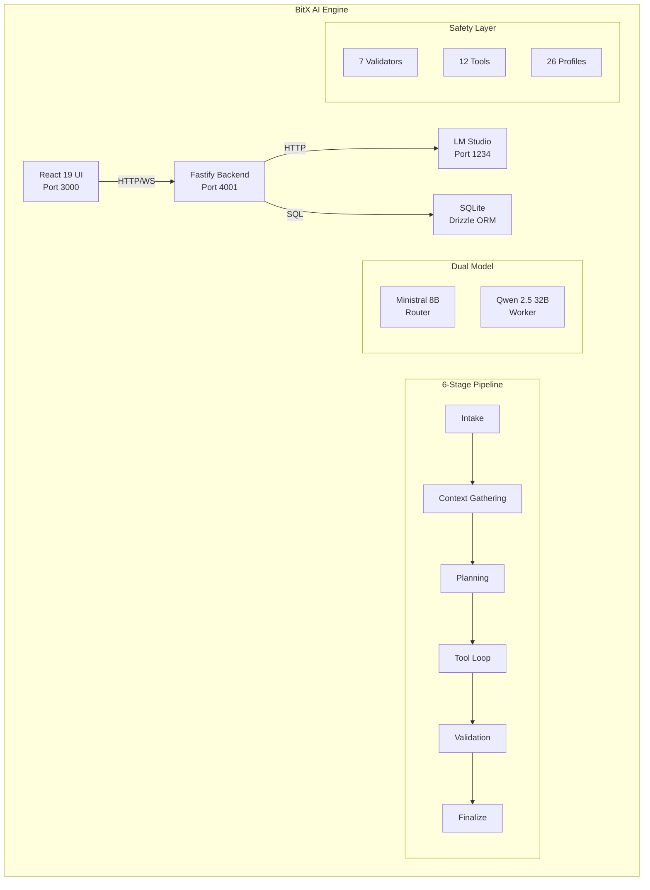
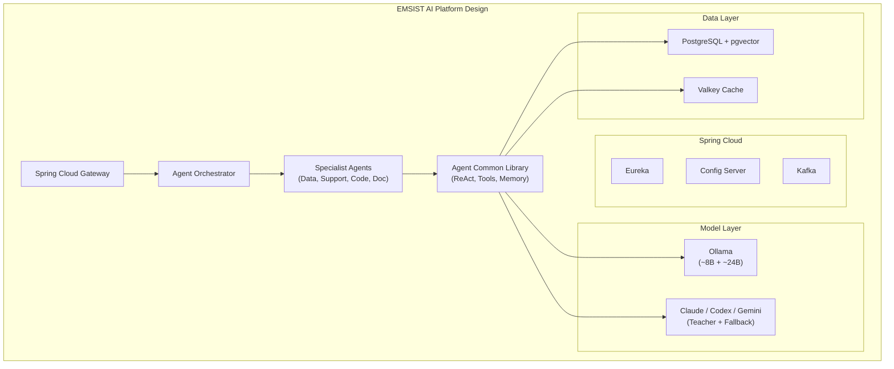
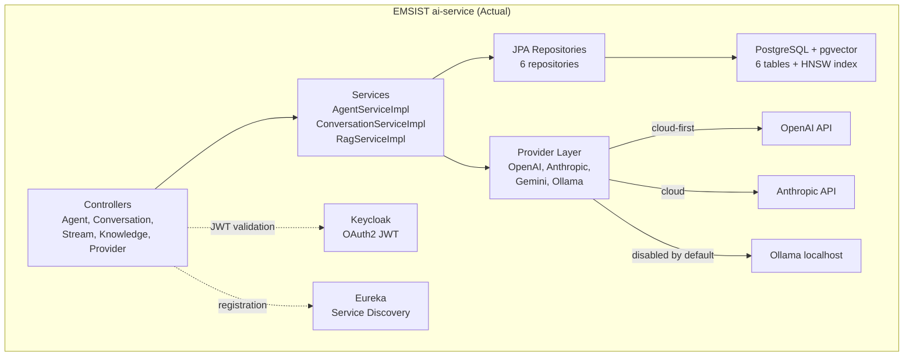
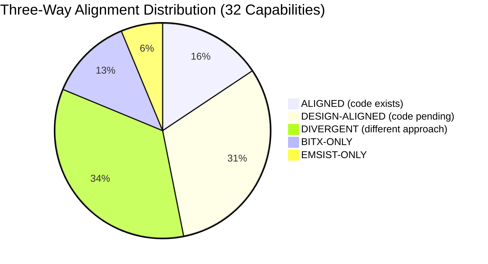

# THREE-WAY Architecture Validation: Application and Infrastructure

**Document:** 01-application-infrastructure-validation.md
**Date:** 2026-03-06
**Agent:** ARCH (v1.1.0)
**Status:** Evidence-Based Validation Report
**Scope:** BitX AI Engine (reference PDFs) vs EMSIST Design Docs vs EMSIST ai-service Source Code

---

## 1. Executive Summary

This report provides a three-way comparison across three dimensions:

1. **BitX Reference** -- The BitX AI Engine as documented in 6 PDFs (`docs/ai-service/references/`). BitX is a locally-hosted Fastify/TypeScript platform with 26 SDLC agents, LM Studio dual-model inference, SQLite persistence, and BM25 RAG search.

2. **EMSIST Design** -- The EMSIST AI Agent Platform as planned in 10 design documents (`docs/ai-service/Design/`). EMSIST designs a Spring Boot/Spring Cloud enterprise platform with Ollama local inference, Spring AI abstraction, PostgreSQL+pgvector, Kafka messaging, and a 13-method learning pipeline.

3. **EMSIST Source Code** -- What actually exists today in `backend/ai-service/` (49 Java files, 3 Flyway migrations, PostgreSQL+pgvector). A multi-provider chatbot service with RAG, streaming, and 4 LLM providers (OpenAI, Anthropic, Gemini, Ollama).

### Key Findings

| Metric | Count |
|--------|-------|
| Total capabilities compared | 32 |
| ALIGNED (all three agree + code exists) | 5 |
| DESIGN-ALIGNED (BitX + Design agree, code pending) | 10 |
| DIVERGENT (different approaches) | 11 |
| BITX-ONLY | 4 |
| EMSIST-ONLY | 2 |

**Overall alignment between BitX and EMSIST Design:** ~47% (15/32 aligned or design-aligned).
**Overall implementation progress of EMSIST Design:** ~16% (5/32 capabilities have code).

The most significant architectural divergences are in tech stack (Fastify/SQLite vs Spring Boot/PostgreSQL), LLM integration approach (LM Studio direct vs Spring AI abstraction with cloud-first providers), pipeline structure (6-stage deterministic vs 7-step with learning), and agent model (26 hardcoded profile JSONs vs database-driven configurable agents).

---

## 2. Application Architecture Comparison

### 2.1 Orchestration Pipeline

| Capability | BitX Approach | EMSIST Design | EMSIST Code (Today) | Alignment |
|-----------|---------------|---------------|---------------------|-----------|
| **Pipeline stages** | 6-stage deterministic: Intake, Context Gathering, Planning, Tool Loop, Validation, Finalize | 7-step: Intake, Retrieve, Plan, Execute, Validate, Explain, Record | No pipeline exists. Direct LLM call via `ConversationServiceImpl.sendMessage()` at `/backend/ai-service/src/main/java/com/ems/ai/service/ConversationServiceImpl.java` line 138 | **DIVERGENT** |
| **Pipeline state machine** | 12 states: queued, intake, inventory, context_gathering, planning, tool_loop, validation, finalizing, completed, failed, cancelled, approval | 7 states matching pipeline steps | No state machine. Conversations have only ACTIVE/ARCHIVED/DELETED status at `/backend/ai-service/src/main/java/com/ems/ai/entity/ConversationEntity.java` line 73 | **DIVERGENT** |
| **Scheduling/Queueing** | Priority queue with `maxConcurrentRuns=2`, `maxQueueSize=50`, `maxRunsPerTenant=3`, polling every 2s | Not explicitly designed (relies on Spring Cloud load balancing) | No scheduler or queue. Synchronous request-response at controller level | **BITX-ONLY** |
| **Concurrency control** | Per-tenant throttle (max 3 runs per tenant), global max 2 concurrent | Per-tenant concurrency limits in PRD Section 7.2 (max 10 Plan, max 5 Execute) | No concurrency controls. Each HTTP request processed independently | **DESIGN-ALIGNED** |

### 2.2 Dual-Model Architecture

| Capability | BitX Approach | EMSIST Design | EMSIST Code (Today) | Alignment |
|-----------|---------------|---------------|---------------------|-----------|
| **Dual-model strategy** | Router (Ministral 8B, temp 0.3, 16K context, 30s timeout) + Worker (Qwen 2.5 Coder 32B, temp 0.2, 8K context, 120s timeout) via LM Studio | Orchestrator (~8B, conservative temp) + Worker (~24B, tighter concurrency) via Ollama. Model-agnostic design. | No dual-model. Single-model-per-agent configuration via `AgentEntity.model` field. Each agent specifies one provider+model combo. Evidence: `/backend/ai-service/src/main/java/com/ems/ai/entity/AgentEntity.java` lines 62-65 | **DESIGN-ALIGNED** |
| **Model routing** | Automatic role assignment: names containing "ministral"/"3b" become router; "devstral"/"24b"/"coder"/"32b" become worker. Auto-discovery via `GET /v1/models` | Spring AI ChatClient abstraction with complexity-based routing logic | Per-agent explicit provider+model selection. `LlmProviderFactory.getProvider()` dispatches by enum (OPENAI, ANTHROPIC, GEMINI, OLLAMA). No automatic routing. Evidence: `/backend/ai-service/src/main/java/com/ems/ai/provider/LlmProviderFactory.java` lines 32-41 | **DIVERGENT** |
| **LLM server** | LM Studio (localhost:1234), OpenAI-compatible `/v1/chat/completions` API | Ollama (localhost:11434), Spring AI starters | Ollama at `/api/chat` (native Ollama API, NOT OpenAI-compatible). Also OpenAI, Anthropic, Gemini as cloud providers. Evidence: `/backend/ai-service/src/main/java/com/ems/ai/provider/OllamaProvider.java` lines 149, 169 | **DIVERGENT** |
| **Cloud fallback** | None. 100% local. LM Studio only. | Cloud models (Claude, Codex, Gemini) as teachers and high-complexity fallbacks | Cloud-first by default. OpenAI enabled=true, Anthropic enabled=true, Ollama enabled=false. Evidence: `/backend/ai-service/src/main/resources/application.yml` lines 65-90 | **DIVERGENT** |

### 2.3 Agent System

| Capability | BitX Approach | EMSIST Design | EMSIST Code (Today) | Alignment |
|-----------|---------------|---------------|---------------------|-----------|
| **Agent count** | 26 hardcoded agents across 5 SDLC phases + orchestrator, loaded from JSON profile files | 5+ initial agents (Data Analyst, Customer Support, Code Reviewer, Document Processor, Orchestrator) + pluggable | Database-driven agents. No hardcoded profiles. Agents created via REST API (`CreateAgentRequest`). Categories seeded in V2 migration (General, Creative, Technical, Business, Education, Research). Evidence: `/backend/ai-service/src/main/resources/db/migration/V2__seed_categories.sql` | **DIVERGENT** |
| **Agent profile structure** | JSON with: id, name, prefix, phase, modelRole (router/worker), allowedTools, forbiddenTools, allowedPaths, forbiddenPaths, approvalRequired, skills, boundaries, receives, produces | Spring Bean agents extending `BaseAgent` with ReAct loop, tool registry, memory management, trace logging | JPA entity with: name, systemPrompt, provider, model, modelConfig (JSONB), ragEnabled, category, conversationStarters. No tools, no boundaries, no skills. Evidence: `/backend/ai-service/src/main/java/com/ems/ai/entity/AgentEntity.java` | **DIVERGENT** |
| **Agent persistence** | File-based JSON profiles in `agents-local/profiles/` + auto-converted from `agents/` directory. Loaded at startup into memory. | Spring Cloud Config server for skill/agent configuration | PostgreSQL `agents` table with Flyway migrations. Full CRUD REST API. Evidence: `/backend/ai-service/src/main/resources/db/migration/V1__ai_agents.sql` lines 20-44 | **DIVERGENT** |
| **Agent categories** | 5 SDLC phases: Orchestrator, Discover, Design, Build, Test, Deploy | Domain-based: Data Analyst, Customer Support, Code Reviewer, Document Processor | 6 general categories: General, Creative, Technical, Business, Education, Research. Evidence: V2 migration | **DIVERGENT** |

### 2.4 Tool System

| Capability | BitX Approach | EMSIST Design | EMSIST Code (Today) | Alignment |
|-----------|---------------|---------------|---------------------|-----------|
| **Tool count** | 12 built-in tools: search_files, read_file, search_content, write_file, apply_patch, view_diff, search_docs, read_schema, run_tests, read_test_output, validate_paths, validate_diff_size | 7 tool categories with dynamic registration, versioning, and composite tools | No tool system. Agents interact purely through chat (prompt in, text out). No file/code/test tools. | **DESIGN-ALIGNED** |
| **Tool gateway** | Centralized tool execution with path safety validation, workspace boundary checks, profile-based filtering | Tools are Spring beans with `@Description` annotations, JSON schema parameters | No tool gateway or tool registry | **DESIGN-ALIGNED** |
| **Path safety** | Traversal prevention (reject `..`), forbidden paths (.env, .git/, .ssh/), workspace boundary enforcement | Path-scope checks in validation layer | Not applicable -- no file operation tools | **DESIGN-ALIGNED** |

### 2.5 Validation Engine

| Capability | BitX Approach | EMSIST Design | EMSIST Code (Today) | Alignment |
|-----------|---------------|---------------|---------------------|-----------|
| **Validators** | 7 code-enforced validators: allowed_paths, blocked_file_patterns, required_tests, diff_threshold, approval_required, tool_restrictions, output_schema | Backend rules engine, test suite execution, approval workflows, path-scope checks | No validation layer. LLM response returned directly to user after `provider.chat()`. Evidence: `ConversationServiceImpl.java` line 177-204 | **DESIGN-ALIGNED** |
| **Approval gates** | Per-profile `approvalRequired` flag with always/risky/never risk levels. `agent_approvals` table for tracking. | Human-in-the-loop tool approval workflows (Phase 5 roadmap) | No approval system | **DESIGN-ALIGNED** |

### 2.6 RAG and Knowledge

| Capability | BitX Approach | EMSIST Design | EMSIST Code (Today) | Alignment |
|-----------|---------------|---------------|---------------------|-----------|
| **RAG search algorithm** | BM25/TF-IDF sparse keyword search. No external vector DB. Stored in SQLite `rag_documents` table with TF-IDF JSON embedding column. | PGVector with cosine similarity (HNSW index). Dense vector embeddings via Spring AI. | PGVector with cosine similarity (HNSW index). `vector(1536)` column on `knowledge_chunks`. Similarity search via `findSimilarChunksWithThreshold()`. Evidence: `/backend/ai-service/src/main/resources/db/migration/V1__ai_agents.sql` lines 131-144, `/backend/ai-service/src/main/java/com/ems/ai/service/RagServiceImpl.java` lines 151-174 | **ALIGNED** |
| **Embedding provider** | None (TF-IDF computed locally, no external API) | Ollama embedding models (nomic-embed-text, mxbai-embed-large) or Spring AI PGVector auto-config | Multi-provider: OpenAI text-embedding-3-small (primary), then Gemini, then Ollama as fallbacks. Dimension=1536. Evidence: `RagServiceImpl.java` lines 177-203, `application.yml` line 69 | **DIVERGENT** |
| **Document ingestion** | Background ingestion of docs/, profiles/, agents/, schemas/ directories at startup. TF-IDF indexing. | Real-time RAG updates from user corrections, pattern store, knowledge base | Async file upload processing: PDF (PDFBox), TXT, MD, CSV. Chunking with configurable size/overlap. Evidence: `RagServiceImpl.java` lines 226-265 | **ALIGNED** |
| **Knowledge scope** | Per-tenant `tenantId` column on `rag_documents`. RAG search filtered by tenant. | Tenant-namespaced vector store partitions. | Per-agent knowledge sources with `tenant_id` column. Chunks linked to agent_id. Evidence: `/backend/ai-service/src/main/java/com/ems/ai/entity/KnowledgeSourceEntity.java` lines 30-32, `KnowledgeChunkEntity.java` line 35 | **ALIGNED** |

### 2.7 LLM Provider Integration

| Capability | BitX Approach | EMSIST Design | EMSIST Code (Today) | Alignment |
|-----------|---------------|---------------|---------------------|-----------|
| **Provider abstraction** | Single LLM Gateway (`llm-gateway.ts`) wrapping LM Studio. OpenAI-compatible API. No multi-provider. | Spring AI `ChatClient` abstraction. Multi-provider: Ollama + Claude + Codex + Gemini | Custom `LlmProviderService` interface with 4 implementations: `OpenAiProvider`, `AnthropicProvider`, `GeminiProvider`, `OllamaProvider`. Factory pattern via `LlmProviderFactory`. Evidence: `/backend/ai-service/src/main/java/com/ems/ai/provider/` (4 provider files) | **ALIGNED** |
| **Streaming** | WebSocket real-time updates during pipeline stages. Progress callbacks at each stage transition. | SSE (Server-Sent Events) streaming via Spring WebFlux | SSE streaming via `Flux<StreamChunkDTO>` on `POST /api/v1/conversations/{id}/stream`. Evidence: `/backend/ai-service/src/main/java/com/ems/ai/controller/StreamController.java` | **ALIGNED** |

---

## 3. Infrastructure Comparison

### 3.1 Tech Stack

| Component | BitX | EMSIST Design | EMSIST Code | Alignment |
|-----------|------|---------------|-------------|-----------|
| **Backend runtime** | Node.js 20+ / Fastify 5 / TypeScript 5.x | Java 21 / Spring Boot 3.3+ / Maven | Java (parent POM) / Spring Boot 3.4.1 / Maven. Evidence: `/backend/ai-service/pom.xml` parent `ems-backend:1.0.0-SNAPSHOT` | **DIVERGENT** |
| **Frontend** | React 19 / Vite 7.3 / Tailwind CSS 4.1 / Zustand | Angular (existing EMSIST frontend) | Angular (existing EMSIST frontend -- separate from ai-service) | **DIVERGENT** |
| **ORM** | Drizzle ORM 0.45 (TypeScript SQL builder) | Spring Data JPA + Flyway | Spring Data JPA + Hibernate + Flyway. Evidence: `pom.xml` lines 33-34, `application.yml` lines 21-28 | **DIVERGENT** |
| **Primary database** | SQLite (better-sqlite3, single file `data/producthub.db`, WAL mode) | PostgreSQL 16 + pgvector extension | PostgreSQL + pgvector. Evidence: `application.yml` lines 16-19, `V1__ai_agents.sql` line 5 `CREATE EXTENSION IF NOT EXISTS vector` | **DIVERGENT** |
| **Cache** | No explicit cache layer (SQLite is fast enough for local) | Valkey 8 (Redis-compatible) | Spring Data Redis configured for Valkey. Evidence: `application.yml` lines 38-42, `pom.xml` lines 69-71 | **EMSIST-ONLY** |
| **Message broker** | No message broker (single-process, in-memory queue) | Apache Kafka (inter-agent communication, trace collection) | Spring Kafka configured. Evidence: `application.yml` lines 44-55, `pom.xml` lines 73-76 | **EMSIST-ONLY** |
| **LLM inference** | LM Studio (localhost:1234, OpenAI-compatible API) | Ollama (localhost:11434, Spring AI starters) | Ollama + OpenAI + Anthropic + Gemini via custom WebClient providers. Evidence: `application.yml` lines 63-90 | **DIVERGENT** |
| **Service discovery** | None (single-process monolith) | Eureka (Spring Cloud Netflix) | Eureka client configured. Evidence: `application.yml` lines 106-110, `pom.xml` lines 53-55 | **DESIGN-ALIGNED** |
| **Testing framework** | Vitest (110 unit tests across 6 files) + Playwright (E2E) | JUnit 5, Testcontainers, ArchUnit | No test files found in ai-service source tree | **DESIGN-ALIGNED** |
| **Auth mechanism** | JWT HS256 (self-signed, bcrypt passwords, 15min access / 7-day refresh). Own `auth.service.ts`. | Spring Security + OAuth2 resource server (Keycloak) | OAuth2 resource server with Keycloak JWT. Evidence: `application.yml` lines 8-13, `pom.xml` lines 42-46 | **DIVERGENT** |

### 3.2 Deployment Model

| Capability | BitX | EMSIST Design | EMSIST Code | Alignment |
|-----------|------|---------------|-------------|-----------|
| **Container orchestration** | Direct process execution. Docker only for legacy Product Hub databases (PostgreSQL, Neo4j, Valkey, Meilisearch). `start.sh` script. | Docker Compose for dev, Kubernetes for production. Helm charts. | Docker Compose via EMSIST infrastructure. Dockerfile likely in parent project. Evidence: `application-docker.yml` exists at `/backend/ai-service/src/main/resources/application-docker.yml` | **DIVERGENT** |
| **Production topology** | 4-server split: Application Tier (Fastify+React), Legacy Platform (Spring Boot+Angular), GPU Inference (LM Studio), Database Services (PostgreSQL, Neo4j, Valkey, Meilisearch) | Spring Cloud microservices with Eureka discovery, Config Server, API Gateway, Kafka | Single ai-service Spring Boot microservice. Part of EMSIST multi-service architecture with shared api-gateway, auth-facade, etc. | **DIVERGENT** |
| **Scaling strategy** | Phase 1: Single machine (SQLite). Phase 2: PostgreSQL replaces SQLite. Phase 3: Horizontal with message queue. Phase 4: Kubernetes. | Spring Cloud native scaling with Eureka load balancing | Single instance. Eureka registration but no horizontal scaling configured. | **DESIGN-ALIGNED** |

### 3.3 Database Architecture

| Capability | BitX | EMSIST Design | EMSIST Code | Alignment |
|-----------|------|---------------|-------------|-----------|
| **Core tables** | 9 core + 6 local-agent = 15 total SQLite tables: users, agents, user_agent_assignments, sessions, messages, audit_log, refresh_tokens, pipelines, pipeline_runs + agent_runs, agent_steps, agent_artifacts, agent_approvals, rag_documents, rag_search_log | Separate databases per agent/learning service (PostgreSQL). PGVector for vector store. | 6 tables: agent_categories, agents, conversations, messages, knowledge_sources, knowledge_chunks + agent_usage_stats. Evidence: `V1__ai_agents.sql` | **DIVERGENT** |
| **Run/step tracking** | `agent_runs` (12 status states, router_model, worker_model, total_tokens, duration) + `agent_steps` (9 stage types, tool input/output JSON, tokens, duration) + `agent_artifacts` (11 types including patch, diff, test_result, plan) | Trace database for learning pipeline consumption (Step 7: Record) | No run/step/artifact tracking tables. Conversations and messages only. No execution trace persistence. | **DESIGN-ALIGNED** |
| **Vector storage** | SQLite column with TF-IDF JSON vectors. BM25 sparse keyword search. No external vector DB. | PGVector extension. HNSW index. Dense embeddings. | PGVector with `vector(1536)` type. HNSW index with `vector_cosine_ops`. Evidence: `V1__ai_agents.sql` lines 131-144 | **DIVERGENT** |

### 3.4 Monitoring and Observability

| Capability | BitX | EMSIST Design | EMSIST Code | Alignment |
|-----------|------|---------------|-------------|-----------|
| **Health endpoints** | `GET /local-agent/health` (model status, queue stats, profile count) and `GET /health` (server heartbeat) | Micrometer + OpenTelemetry. Spring Boot Actuator. | Spring Boot Actuator with health, info, metrics, prometheus endpoints. Evidence: `application.yml` lines 115-120 | **ALIGNED** (concept aligned, implementation differs) |
| **Telemetry** | SQLite-based: token usage per step, duration per step, tool call patterns, run success rate, RAG search latency | Micrometer metrics, OpenTelemetry distributed tracing | Actuator + Prometheus endpoint exposed. No custom AI-specific metrics. | **DESIGN-ALIGNED** |
| **Eval harness** | 11 automated benchmark cases across 5 categories (BA, Engineering, Testing, Repair, Adversarial). 8 scoring criteria. Pass threshold 70%. | Model evaluation and A/B testing framework (Phase 4 roadmap) | No eval harness or benchmarking | **BITX-ONLY** |

---

## 4. Deviation Register

### 4.1 Critical Deviations (HIGH Severity)

| ID | Dimension | BitX | EMSIST | Impact | Recommendation |
|----|-----------|------|--------|--------|----------------|
| DEV-001 | Tech Stack | Fastify 5 / TypeScript / SQLite | Spring Boot / Java / PostgreSQL | Complete rewrite required. No code portability. | **KEEP EMSIST**. Spring Boot is the enterprise standard. PostgreSQL scales better than SQLite for multi-tenant. |
| DEV-002 | Pipeline | 6-stage deterministic with state machine (12 states) | 7-step pipeline with learning extensions (PLANNED) | EMSIST has no pipeline at all in code. Design adds Explain+Record steps but has 0% implementation. | **ADOPT from BitX**: Implement the 6 core stages first. Add Explain+Record later. State machine is critical for observability. |
| DEV-003 | Dual Model | LM Studio with hardcoded Ministral 8B + Qwen 2.5 32B | Ollama with model-agnostic design (PLANNED). Code has cloud-first with Ollama disabled. | Code contradicts design: cloud providers enabled by default, Ollama disabled. No dual-model routing. | **ADOPT from BitX**: Implement router/worker model roles. Keep EMSIST's model-agnostic abstraction but enforce dual-model pattern. |
| DEV-004 | Agent Model | 26 hardcoded JSON profiles with SDLC phase mapping | Database-driven agents with categories | Fundamentally different paradigms. BitX is fixed-purpose; EMSIST is user-configurable. | **KEEP both**: EMSIST's DB-driven agents for user-created agents. Adopt BitX's profile structure for system SDLC agents loaded as seed data. |
| DEV-005 | Tool System | 12 deterministic tools with path safety | No tools at all in code | Without tools, agents cannot interact with code/files/tests. This is the biggest functional gap. | **ADOPT from BitX**: Implement tool gateway with the 12 core tools. Use Spring AI tool binding. |

### 4.2 Medium Deviations (MEDIUM Severity)

| ID | Dimension | BitX | EMSIST | Impact | Recommendation |
|----|-----------|------|--------|--------|----------------|
| DEV-006 | Validation | 7 deterministic validators (code-enforced) | Validation layer in design (not implemented) | Agents can produce unsafe output without validators. | **ADOPT from BitX**: Port the 7 validator concepts to Java. Critical for enterprise safety. |
| DEV-007 | RAG | BM25 sparse search (no external API calls) | PGVector dense search (requires embedding API) | BM25 is zero-dependency; PGVector requires embedding provider. But PGVector has better semantic recall. | **KEEP EMSIST** for semantic search quality. Consider adding BM25 as a hybrid fallback for keyword queries. |
| DEV-008 | Scheduling | Priority queue with per-tenant throttling | Not designed | Without scheduling, concurrent agent runs will overwhelm resources. | **ADOPT from BitX**: Implement scheduler with priority queue. Map to Spring task scheduling. |
| DEV-009 | Run Persistence | agent_runs + agent_steps + agent_artifacts (4 tables, 12 status states) | Trace database (PLANNED) | No execution history means no observability, no learning pipeline input, no debugging. | **ADOPT from BitX**: Create run/step/artifact tables in PostgreSQL. Essential for audit and learning. |
| DEV-010 | Eval Harness | 11 benchmark cases, 5 categories, 8 scoring criteria | Model evaluation framework (Phase 4) | Cannot measure agent quality without benchmarks. | **ADOPT from BitX**: Port eval harness concept. Use JUnit for test execution. |

### 4.3 Low Deviations (LOW Severity)

| ID | Dimension | BitX | EMSIST | Impact | Recommendation |
|----|-----------|------|--------|--------|----------------|
| DEV-011 | Auth | Self-signed JWT HS256, own auth service | Keycloak OAuth2 resource server | EMSIST approach is more enterprise-grade. | **KEEP EMSIST**. Keycloak provides SSO, MFA, federation. |
| DEV-012 | Frontend | React 19 + Vite + Tailwind + Zustand | Angular (existing EMSIST) | UI framework mismatch. | **KEEP EMSIST**. Angular is the existing standard. Adopt BitX's UI/UX concepts (Agents Hub) in Angular components. |
| DEV-013 | Search | Meilisearch for full-text document search | No equivalent planned | Low priority. PGVector + PostgreSQL full-text search can cover this. | **SKIP**. PostgreSQL `tsvector` is sufficient. |

---

## 5. Architecture Comparison Diagrams

### 5.1 BitX Architecture (As-Is)

### 5.2 EMSIST Design (Target)

### 5.3 EMSIST Source Code (Actual Today)

---

## 6. Pros and Cons Analysis

### 6.1 BitX Approach

**Pros:**
- Zero external dependencies for LLM inference (complete data sovereignty)
- Deterministic 6-stage pipeline with state machine enables full observability
- 7 validators provide strong safety guardrails for code-writing agents
- 12 built-in tools allow agents to actually interact with the codebase
- Eval harness enables measurable quality benchmarking
- SQLite simplicity (zero-config, single file, no Docker dependency for DB)
- 26 pre-configured SDLC agents ready to use out of the box
- Per-tenant scheduling prevents resource exhaustion

**Cons:**
- SQLite is single-writer, does not scale horizontally
- LM Studio is less portable than Ollama (platform-specific)
- Hardcoded agent profiles limit flexibility for non-SDLC use cases
- No cloud model integration limits quality ceiling for complex tasks
- BM25 search has lower semantic recall than dense vector search
- Fastify/TypeScript requires separate team skills from Spring Boot enterprise stack
- No learning pipeline -- agents do not improve from usage

### 6.2 EMSIST Design Approach

**Pros:**
- Spring Boot/Spring Cloud is enterprise-grade with mature ecosystem
- PostgreSQL + pgvector provides scalable vector search with HNSW indexing
- 13-method learning pipeline is ambitious and comprehensive
- Model-agnostic design allows swapping models without code changes
- Multi-provider support (local + cloud) provides quality ceiling and fallback
- Kafka enables asynchronous event-driven architecture
- Keycloak provides enterprise SSO, MFA, and identity federation
- Spring AI abstracts provider differences

**Cons:**
- 0% implementation of pipeline, tools, validators, scheduling, or learning
- Design is aspirational -- many Phase 3-5 features may never be built
- Cloud-first default contradicts data sovereignty design principle
- 7-step pipeline adds latency (Explain + Record steps) vs BitX's 6
- No eval harness means no way to measure agent quality
- Learning pipeline complexity (13 methods) may be over-engineered for MVP

### 6.3 EMSIST Code (Today)

**Pros:**
- Working multi-provider chat with streaming (OpenAI, Anthropic, Gemini, Ollama)
- Functional RAG with pgvector, HNSW index, and cosine similarity search
- Document ingestion pipeline (PDF, TXT, MD, CSV) with async processing
- Database-driven agent management with full CRUD API
- Multi-tenant isolation via `tenant_id` on all entities
- Spring Security OAuth2 with Keycloak integration
- Eureka service discovery registration

**Cons:**
- No orchestration pipeline (direct LLM call, no planning/validation/tools)
- No tool system (agents cannot interact with files, code, or tests)
- No validation layer (LLM output returned directly without safety checks)
- No run/step/artifact tracking (no execution history or audit trail)
- No dual-model routing (single model per agent)
- Cloud providers enabled by default, Ollama disabled -- contradicts local-first design
- No scheduling or concurrency control
- Uses legacy `openai-gpt3-java:0.18.2` library instead of Spring AI

---

## 7. Recommendations

### 7.1 What EMSIST Should ADOPT from BitX

| Priority | What | Why | Implementation Path |
|----------|------|-----|---------------------|
| **P0** | 6-stage orchestration pipeline with state machine | Core engine. Without this, agents are just chatbots. | Create `PipelineOrchestrator` service with stage enum and state transitions. |
| **P0** | Tool gateway with 12 core tools | Agents need to read/write/search files to be useful for SDLC tasks. | Implement `ToolGateway` service with Spring AI `@Tool` annotations. Port BitX's 12 tool definitions. |
| **P0** | Run/step/artifact persistence | Required for observability, debugging, and learning pipeline input. | Create `agent_runs`, `agent_steps`, `agent_artifacts` tables via Flyway V4. |
| **P1** | 7 deterministic validators | Safety-critical for enterprise. Prevents agents from writing to forbidden paths or exposing secrets. | Implement `ValidatorEngine` with configurable rule sets. Port BitX's 7 validator types. |
| **P1** | Dual-model routing (router + worker) | Optimizes cost and speed. Small model for planning, large model for execution. | Add `modelRole` field to agent config. Create `ModelRouter` service. |
| **P1** | Priority queue scheduler with per-tenant throttling | Prevents resource exhaustion with concurrent agent runs. | Create `AgentScheduler` with `@Scheduled` polling and `BlockingQueue`. |
| **P2** | Eval harness with benchmark cases | Enables measurable quality tracking. | Create `EvalHarness` service with JUnit-driven benchmark execution. |
| **P2** | Agent profile structure (allowedTools, forbiddenPaths, boundaries) | Enables fine-grained access control per agent. | Extend `agents` table with JSONB columns for tool/path restrictions. |

### 7.2 What EMSIST Should KEEP (Better Than BitX)

| What | Why It's Better |
|------|----------------|
| PostgreSQL + pgvector | Scalable, multi-tenant, ACID-compliant. SQLite is single-writer. |
| Multi-provider LLM support | Cloud fallback for complex tasks. BitX has zero cloud access. |
| Keycloak OAuth2 | Enterprise SSO, MFA, federation. BitX has self-signed JWT only. |
| Spring Boot / Spring Cloud | Mature enterprise framework. Better for microservice architecture. |
| Kafka messaging | Enables async event-driven patterns. BitX has no messaging. |
| Database-driven agents | User-configurable. BitX's JSON profiles require file system access. |
| Dense vector search (HNSW) | Better semantic recall than BM25 for knowledge retrieval. |

### 7.3 What EMSIST Should AVOID from BitX

| What | Why to Avoid |
|------|-------------|
| SQLite as primary database | Single-writer limitation. Cannot scale horizontally. |
| LM Studio as LLM server | Less portable than Ollama. Platform-specific desktop app. |
| Hardcoded 26-agent profiles | Too rigid for a platform that serves multiple domains beyond SDLC. |
| BM25-only RAG | Lower semantic recall. EMSIST's pgvector is superior. Consider hybrid. |
| Self-signed JWT auth | Not enterprise-grade. Keycloak is better. |
| No cloud model integration | Limits quality ceiling. EMSIST's cloud fallback is a strength. |

### 7.4 Immediate Code Alignment Actions

| Action | Current State | Target State | Effort |
|--------|-------------|-------------|--------|
| Switch Ollama to enabled by default | `OLLAMA_ENABLED:false` in application.yml | `OLLAMA_ENABLED:true` | Trivial |
| Replace `openai-gpt3-java:0.18.2` with Spring AI | Legacy library, manual HTTP calls | `spring-ai-ollama-spring-boot-starter` + `spring-ai-anthropic-spring-boot-starter` | Medium |
| Add `model_role` to agents table | Single model per agent | `model_role` ENUM (router/worker/auto) | Small |
| Create pipeline state machine | Direct LLM call | 6-stage pipeline with status tracking | Large |
| Create tool gateway | No tools | 12 tools with path safety | Large |

---

## 8. Evidence Index

All claims in this report are based on the following verified files:

### BitX Reference PDFs
- `/Users/mksulty/Claude/EMSIST/docs/ai-service/references/01-AI-ENGINE-ARCHITECTURE.pdf` (11 pages)
- `/Users/mksulty/Claude/EMSIST/docs/ai-service/references/06-AGENT-INFRASTRUCTURE.pdf` (20 pages)

### EMSIST Design Documents
- `/Users/mksulty/Claude/EMSIST/docs/ai-service/Design/01-PRD-AI-Agent-Platform.md` (718 lines)
- `/Users/mksulty/Claude/EMSIST/docs/ai-service/Design/02-Technical-Specification.md` (~1200 lines)
- `/Users/mksulty/Claude/EMSIST/docs/ai-service/Design/05-Technical-LLD.md` (~3000 lines)
- `/Users/mksulty/Claude/EMSIST/docs/ai-service/Design/09-Infrastructure-Setup-Guide.md` (~2000 lines)

### EMSIST Source Code (49 Java files)
- `/Users/mksulty/Claude/EMSIST/backend/ai-service/pom.xml`
- `/Users/mksulty/Claude/EMSIST/backend/ai-service/src/main/resources/application.yml`
- `/Users/mksulty/Claude/EMSIST/backend/ai-service/src/main/resources/db/migration/V1__ai_agents.sql`
- `/Users/mksulty/Claude/EMSIST/backend/ai-service/src/main/java/com/ems/ai/entity/AgentEntity.java`
- `/Users/mksulty/Claude/EMSIST/backend/ai-service/src/main/java/com/ems/ai/entity/ConversationEntity.java`
- `/Users/mksulty/Claude/EMSIST/backend/ai-service/src/main/java/com/ems/ai/entity/MessageEntity.java`
- `/Users/mksulty/Claude/EMSIST/backend/ai-service/src/main/java/com/ems/ai/entity/KnowledgeSourceEntity.java`
- `/Users/mksulty/Claude/EMSIST/backend/ai-service/src/main/java/com/ems/ai/entity/KnowledgeChunkEntity.java`
- `/Users/mksulty/Claude/EMSIST/backend/ai-service/src/main/java/com/ems/ai/entity/AgentCategoryEntity.java`
- `/Users/mksulty/Claude/EMSIST/backend/ai-service/src/main/java/com/ems/ai/service/ConversationServiceImpl.java`
- `/Users/mksulty/Claude/EMSIST/backend/ai-service/src/main/java/com/ems/ai/service/RagServiceImpl.java`
- `/Users/mksulty/Claude/EMSIST/backend/ai-service/src/main/java/com/ems/ai/provider/LlmProviderFactory.java`
- `/Users/mksulty/Claude/EMSIST/backend/ai-service/src/main/java/com/ems/ai/provider/OllamaProvider.java`
- `/Users/mksulty/Claude/EMSIST/backend/ai-service/src/main/java/com/ems/ai/controller/StreamController.java`
- `/Users/mksulty/Claude/EMSIST/backend/ai-service/src/main/java/com/ems/ai/config/AiProviderProperties.java`

---

## 9. Alignment Score Summary

| Score | Definition | Count | % |
|-------|-----------|-------|---|
| **ALIGNED** | BitX and EMSIST Design agree AND code exists today | 5 | 16% |
| **DESIGN-ALIGNED** | BitX and EMSIST Design agree but code does not exist yet | 10 | 31% |
| **DIVERGENT** | BitX and EMSIST Design take fundamentally different approaches | 11 | 34% |
| **BITX-ONLY** | BitX has this capability but EMSIST Design does not address it | 4 | 13% |
| **EMSIST-ONLY** | EMSIST Design has this but BitX does not | 2 | 6% |

**Bottom line:** The 5 ALIGNED capabilities (RAG/pgvector, document ingestion, knowledge scoping, provider abstraction, streaming) represent solid foundation code. The 10 DESIGN-ALIGNED capabilities represent the implementation backlog where BitX provides a proven reference. The 11 DIVERGENT items are intentional architectural choices where EMSIST's enterprise approach (Spring Boot, PostgreSQL, Keycloak, Kafka) is generally superior to BitX's lightweight approach, except for the pipeline/tools/validators where BitX's implementation is more mature.
