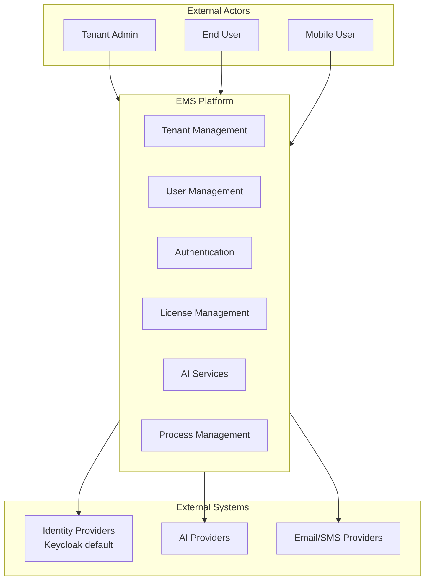
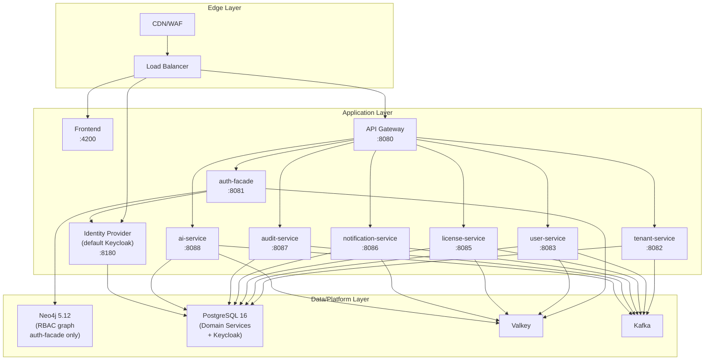

# 3. Context and Scope

## 3.1 Business Context

EMS provides multi-tenant enterprise platform capabilities to tenant admins and end users while integrating with identity, AI, and notification providers.

### External Actors

| Actor | Responsibility |
|-------|----------------|
| Tenant Admin | Tenant setup, user governance, configuration |
| End User | Day-to-day business workflows |
| Mobile User | Mobile/PWA subset of platform workflows |

### External Systems

| System | Purpose | Protocol |
|--------|---------|----------|
| Keycloak | Default authentication and token issuance | OIDC / OAuth 2.0 |
| Auth0 / Okta / Azure AD | Optional provider integrations via auth abstraction | OIDC / OAuth 2.0 |
| OpenAI / Anthropic / Gemini / Ollama | AI inference and model services | HTTPS/REST |
| SMTP Provider | Email delivery | SMTP/TLS |
| SMS Gateway | SMS delivery | HTTPS/REST |

## 3.2 Technical Context

Runtime scope seal (2026-03-01):

- The application-layer diagram is intentionally limited to currently deployed/routed services.
- `product-service`, `process-service`, and `persona-service` are excluded because they are not gateway-routed and not part of current deployment topology.
- Product/process/persona capabilities are modeled as tenant-scoped object instances, not standalone services.

### Interface Matrix

| Interface | Type | Security |
|-----------|------|----------|
| Public API | HTTPS/REST | JWT bearer tokens |
| Identity Provider Endpoints | OIDC/OAuth 2.0 | Provider-specific credentials |
| AI Provider APIs | HTTPS/REST | API keys |
| Notification Providers | SMTP/HTTPS | Provider credentials |
| Internal Events | Kafka | Service identity + network controls |

---

**Previous Section:** [Constraints](./02-constraints.md)
**Next Section:** [Solution Strategy](./04-solution-strategy.md)
