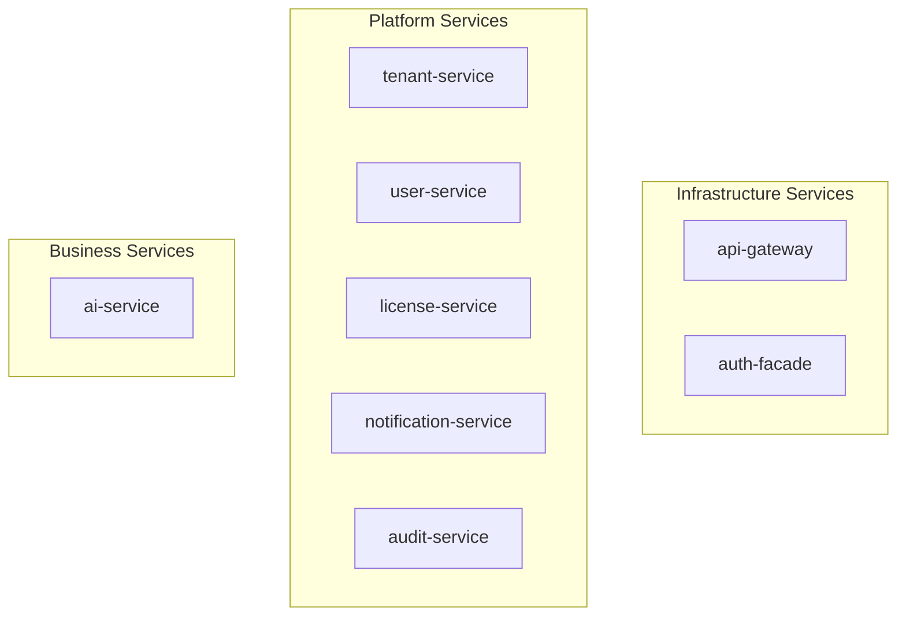
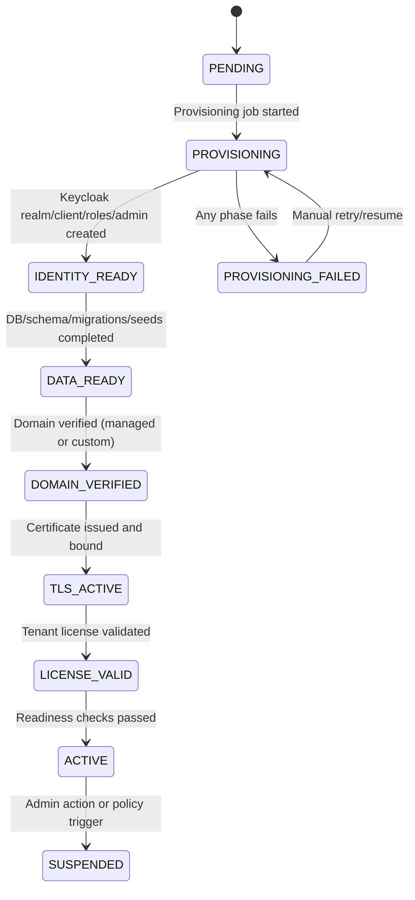
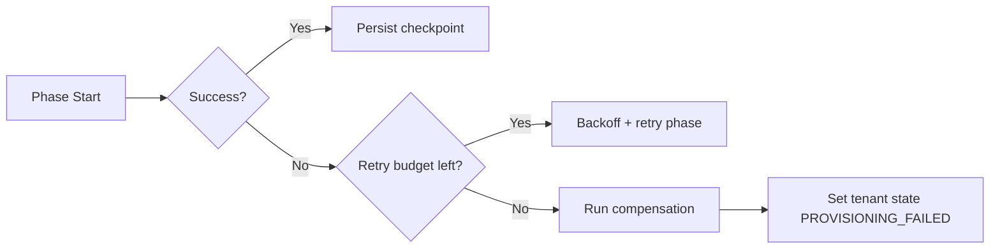

# 4. Solution Strategy

## 4.1 Strategy Principles

- Polyglot persistence: Neo4j for RBAC/identity graph (auth-facade), PostgreSQL for relational domain services (per ADR-001, amended).
- Separate identity internals from application data: PostgreSQL is used by both Keycloak and domain services, but with isolated logical databases.
- Keep authentication extensible: provider abstraction with Keycloak as default provider.
- Enforce UUID-first tenant contracts: all external tenant-scoped headers, paths, and query params use tenant UUID as the canonical identifier.
- Use bounded-context service decomposition for independent deployment.
- Favor explicit observability and cache strategy for predictable runtime behavior.

## 4.2 Technology Decisions

| Domain | Decision | Why |
|--------|----------|-----|
| Backend runtime | Java 23 + Spring Boot 3.4.1 | Stable ecosystem and strong service tooling |
| Frontend | Angular 21+ | Enterprise-ready SPA architecture |
| RBAC/Identity database | Neo4j 5.12 Community (auth-facade only) | Graph-native recursive role/group traversal |
| Domain services database | PostgreSQL 16 (6 services + Keycloak) | Relational integrity, Flyway migrations, CHECK constraints, `@Version` locking, pgvector (ai-service) |
| Distributed cache | Valkey 8 (single-tier) | Low-latency distributed cache, token blacklist, session state |
| Messaging | Kafka | Asynchronous integration backbone [PLANNED] |
| Authentication model | Provider-agnostic BFF with Keycloak default | Extensibility with stable default runtime |

Reference ADRs: [ADR-001](../adr/ADR-001-neo4j-primary.md) (Polyglot Persistence), [ADR-002](../adr/ADR-002-spring-boot-3.4.md), [ADR-004](../adr/ADR-004-keycloak-authentication.md), [ADR-005](../adr/ADR-005-valkey-caching.md), [ADR-007](../adr/ADR-007-auth-facade-provider-agnostic.md), [ADR-014](../adr/ADR-014-rbac-licensing-integration.md), [ADR-015](../adr/ADR-015-on-premise-license-architecture.md).

## 4.3 Architecture Patterns

| Pattern | Application |
|---------|-------------|
| BFF (Backend for Frontend) | `auth-facade` hides provider protocol complexity from UI clients |
| Strategy Pattern | `IdentityProvider` abstraction for pluggable identity providers |
| Microservices by domain | Independent service deployment and ownership boundaries |
| Event-driven integration | Kafka-based async communication for decoupling [PLANNED] |
| Distributed caching | Valkey single-tier for hot paths (role cache, seat validation, token blacklist) |

## 4.4 Service Decomposition Strategy

`license-service` remains an independent service in the current implementation. Any consolidation is a future decision tracked by [ADR-006](../adr/ADR-006-platform-services-consolidation.md).
Product/process/persona domains are currently treated as tenant-scoped object instances rather than standalone microservices.

## 4.5 Quality Goal Tactics

| Quality Goal | Strategy |
|--------------|----------|
| Security | Tenant-scoped queries, strong auth boundaries, immutable auditing |
| Performance | Cache-first reads, optimized queries (Cypher for Neo4j, JPA/SQL for PostgreSQL), async integration |
| Scalability | Stateless services + horizontal scale, Kafka decoupling [PLANNED] |
| Maintainability | ADR-governed architecture, clear service ownership, docs quality gates |

## 4.6 Tenant Provisioning Strategy [TARGET STATE]

- Tenant creation is a control-plane workflow, not a single synchronous transaction.
- `POST /api/tenants` persists tenant metadata in `PENDING/PROVISIONING` and creates a provisioning job.
- Provisioning is executed asynchronously in idempotent phases with checkpoint/retry.
- Non-master tenants are promoted to `ACTIVE` only after identity, data, domain, TLS, and license validation checks pass.

Provisioning ownership boundaries:

- Inside EMSIST control: tenant metadata, provisioning orchestration, realm/bootstrap automation, migration/seeding, license gating, readiness gating.
- Outside EMSIST control: customer-owned DNS zone updates and external CA/DNS provider execution for custom domains.

### 4.6.1 Provisioning State Control Table [TARGET STATE]

| State | Entry Condition | Exit Condition | Allowed Next States | Auth/API Behavior |
|------|-----------------|----------------|---------------------|-------------------|
| `PENDING` | Tenant record created | Worker starts job | `PROVISIONING` | Tenant cannot authenticate |
| `PROVISIONING` | Job execution started | All phase checkpoints complete OR phase failure | `ACTIVE`, `PROVISIONING_FAILED` | Tenant cannot authenticate |
| `PROVISIONING_FAILED` | Any phase exhausted retry budget or terminal error | Manual retry/resume requested | `PROVISIONING` | Tenant cannot authenticate |
| `ACTIVE` | Identity + data + domain + TLS + license checks passed | Admin/policy suspension trigger | `SUSPENDED` | Tenant can authenticate and call business APIs |
| `SUSPENDED` | Admin/policy action after active state | Explicit reactivation workflow | `PROVISIONING`, `ACTIVE` | Tenant authentication/business access blocked per suspension policy |

### 4.6.2 Phase Retry and Compensation Policy [TARGET STATE]

| Phase | Timeout | Retry Policy | Compensation on Terminal Failure |
|------|---------|--------------|----------------------------------|
| Identity bootstrap (realm/client/roles/admin) | 2 min | 5 retries, exponential backoff | Delete partially created realm/client artifacts or mark as orphaned for cleanup |
| Data bootstrap (schema/migrations/seeds) | 5 min | 3 retries, linear backoff | Rollback tenant bootstrap transaction boundary where possible; keep forensic logs |
| Domain verification | 10 min | 12 retries, fixed interval | Keep tenant in failed state with actionable DNS proof instructions |
| TLS binding | 10 min | 6 retries, exponential backoff | Revoke pending certificate request and remove incomplete route bindings |
| License validation | 1 min | 5 retries, exponential backoff | Mark provisioning failed with `LICENSE_INVALID_OR_MISSING` reason |
| Final readiness checks | 1 min | 3 retries, fixed interval | Keep tenant non-active and preserve last successful checkpoint |

Operational rules:

- Every phase uses idempotency key: `{tenantUuid}:{jobId}:{phase}`.
- Retries resume from the last persisted checkpoint, not from phase zero.
- Max retry exhaustion transitions tenant to `PROVISIONING_FAILED`.
- `ACTIVE` promotion is atomic and allowed only after all mandatory checkpoints pass.

## 4.7 Encryption Strategy [PLANNED]

Three-tier encryption covering data at rest, data in transit, and configuration secrets.

| Tier | Scope | Mechanism | Current State |
|------|-------|-----------|---------------|
| **Tier 1: Volume encryption** | All data stores (PostgreSQL, Neo4j, Valkey, Kafka) | LUKS/FileVault for Docker Compose (dev/staging), encrypted StorageClass PVs for Kubernetes (production) | [PLANNED] -- No volume encryption in any environment |
| **Tier 2: In-transit TLS** | All service-to-datastore connections | PostgreSQL `sslmode=verify-full`, Neo4j `bolt+s://`, Valkey `--tls-port`, Kafka `SASL_SSL` | [IN-PROGRESS] -- 6/7 PostgreSQL services have `sslmode=verify-full`; ai-service, Neo4j, Valkey, and Kafka connections are plaintext |
| **Tier 3: Config encryption** | Sensitive `application.yml` values (passwords, API keys, client secrets) | Jasypt `PBEWITHHMACSHA512ANDAES_256` with `ENC()` property values, decrypted at startup via `JASYPT_PASSWORD` env var | [IN-PROGRESS] -- auth-facade only; 7 other services store secrets as plaintext env-var references with hardcoded fallback defaults |

Reference: [ADR-019](../adr/ADR-019-encryption-at-rest.md).

## 4.8 Credential Management [PLANNED]

Per-service database users with least-privilege access, replacing the current shared `postgres` superuser.

| Principle | Description |
|-----------|-------------|
| **Per-service isolation** | Each service authenticates to PostgreSQL with a dedicated user (e.g., `svc_tenant`, `svc_user`, `svc_audit`) that can only access its own database |
| **SCRAM-SHA-256 authentication** | All PostgreSQL users use SCRAM-SHA-256 (strongest native auth method), not MD5 |
| **No hardcoded defaults** | `application.yml` files reference `${DATABASE_USER}` and `${DATABASE_PASSWORD}` without fallback defaults -- missing credentials cause fail-fast startup failure |
| **Externalized credentials** | All credentials stored in `.env` files (dev/staging, gitignored) or Kubernetes Secrets (production), never in source code |
| **Append-only audit** | `svc_audit` user has `INSERT` and `SELECT` only -- no `UPDATE` or `DELETE` on audit tables |

Current state: All 7 PostgreSQL services share the `postgres` superuser. Only `keycloak` has a dedicated database user.

Reference: [ADR-020](../adr/ADR-020-service-credential-management.md).

## 4.9 Deployment Modes [PLANNED]

Two deployment modes support different operational requirements across environments.

| Mode | Environments | Topology | Data Durability |
|------|-------------|----------|-----------------|
| **Docker Compose** | Dev, Staging | Single-instance containers with named volumes; automated backup scripts (`pg_dump`, `neo4j-admin dump`, Valkey `BGSAVE`) | Backup-based recovery; no replication |
| **Kubernetes with operators** | Production | Operator-managed replicated clusters (CloudNativePG, Neo4j Helm, Valkey Sentinel, Kafka with KRaft) | Synchronous replication, automated failover, encrypted PVs |

Phased rollout:

1. **Phase 1 (immediate):** Automated backup scripts for Docker Compose environments. Volume protection guards.
2. **Phase 2 (Q2-Q3 2026):** Kubernetes migration with operator-managed HA for all stateful components.
3. **Phase 3 (Q4 2026+):** Multi-region active-passive DR with cross-region database replication.

Reference: [ADR-018](../adr/ADR-018-high-availability-multi-tier.md).

---

**Previous Section:** [Context and Scope](./03-context-scope.md)
**Next Section:** [Building Blocks](./05-building-blocks.md)
