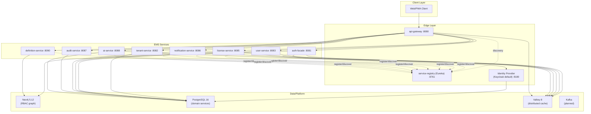
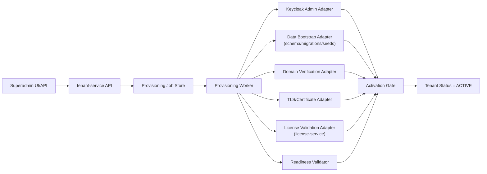

# 5. Building Blocks

## 5.0 Sealed Runtime Baseline (2026-03-01)

This section is sealed to the current deployable runtime topology.

- Active runtime services: `service-registry (eureka)`, `api-gateway`, `auth-facade`, `tenant-service`, `user-service`, `license-service`, `notification-service`, `audit-service`, `ai-service`, `definition-service`.
- Dormant modules outside runtime scope: `product-service`, `process-service`, `persona-service`.

**Evidence (verified 2026-03-01, updated 2026-03-06):**
- `backend/pom.xml` contains `eureka-server`, `product-service`, `process-service`, and `persona-service` modules.
- `backend/eureka-server/src/main/java/com/ems/registry/EurekaServerApplication.java` — `@EnableEurekaServer` confirmed. Tests pass: 3/3 (`mvn test` 2026-03-06).
- `backend/api-gateway/src/main/java/com/ems/gateway/config/RouteConfig.java` has no route entries for `product-service`, `process-service`, or `persona-service`.
- `docker-compose.dev-app.yml` and `docker-compose.staging-app.yml` define active runtime containers and exclude `product-service`, `process-service`, and `persona-service`.
- `backend/product-service/` and `backend/persona-service/` contain `pom.xml` and build artifacts, but no `src/` tree.
- `backend/process-service/` contains source code but is intentionally kept out of active runtime scope.

## 5.1 Level 1: System Overview



## 5.2 Building Block Responsibilities

| Building Block | Responsibility |
|----------------|----------------|
| API Gateway | External entry point, routing, shared request controls |
| Service Registry (Eureka) `[IMPLEMENTED]` | Service registration and discovery for runtime routing. Port 8761. All active services configured as Eureka clients. Service-to-service Feign discovery: `[IN-PROGRESS]`. |
| auth-facade | BFF authentication orchestration, provider abstraction, token/session orchestration |
| tenant-service | Tenant lifecycle, domains, branding, tenant security settings, provisioning orchestration (control-plane) [TARGET STATE] |
| user-service | User profile, device, and session management |
| license-service | License catalog, tenant license allocation, user seat assignment, feature gates |
| notification-service | Template and channel delivery orchestration |
| audit-service | Immutable audit event ingestion and query/export |
| ai-service | Agent and conversation orchestration, RAG workflows (pgvector) |
| definition-service | Master definitions/catalog endpoints backed by Neo4j |
| Tenant domain objects (`product`, `process`, `persona`) | Tenant-scoped business objects handled inside regular-tenant domain model (not standalone services) |

## 5.3 Data Ownership

| Service | Primary Data | Database |
|---------|--------------|----------|
| auth-facade | Provider/realm configuration, RBAC graph (roles, groups, users), auth session metadata | Neo4j |
| tenant-service | Tenant, domain, branding, tenant security configuration, provisioning job state [TARGET STATE] | PostgreSQL (`master_db`) |
| user-service | User profile, session, and device entities | PostgreSQL (`user_db`) |
| license-service | Tenant licenses, products/features, seat assignments | PostgreSQL (`license_db`) |
| notification-service | Notification templates, delivery metadata | PostgreSQL (`notification_db`) |
| audit-service | Audit events and compliance metadata | PostgreSQL (`audit_db`) |
| ai-service | Agents, conversations, messages, knowledge embeddings (pgvector) | PostgreSQL (`ai_db`) |
| definition-service | Master definition graph nodes and metadata | Neo4j |
| Tenant-scoped objects (`product`, `process`, `persona`) | Object instances attached to regular tenants | PostgreSQL (`master_db`) [TARGET STATE] |
| Keycloak | Realms, users, sessions, client configs (internal to Keycloak) | PostgreSQL (`keycloak_db`) |

Authoritative data-platform rule per [ADR-001](../adr/ADR-001-neo4j-primary.md) (amended): Neo4j for RBAC/identity graph (auth-facade), PostgreSQL for all relational domain services. See ADR-001 for database selection criteria.

## 5.4 Internal Structure Pattern

All services follow a consistent layered structure:

```text
{service}/src/main/java/com/ems/{service}/
├── controller/
├── service/
├── repository/
├── entity/
├── dto/
├── mapper/
├── config/
├── exception/
└── event/           # optional
```

## 5.5 Service Matrix

| Service | Port | Database | Logical DB | Cache | Events | Runtime Status |
|---------|------|----------|------------|-------|--------|----------------|
| api-gateway | 8080 | — | — | Valkey (rate-limit/session edge state) | — | Active |
| service-registry (eureka) | 8761 | — | — | — | — | Active `[IMPLEMENTED]` |
| auth-facade | 8081 | Neo4j | — (graph) | Valkey | Kafka [PLANNED] | Active |
| tenant-service | 8082 | PostgreSQL | `master_db` | — | Kafka [PLANNED] | Active |
| user-service | 8083 | PostgreSQL | `user_db` | Valkey | Kafka [PLANNED] | Active |
| license-service | 8085 | PostgreSQL | `license_db` | Valkey | Kafka [PLANNED] | Active |
| notification-service | 8086 | PostgreSQL | `notification_db` | Valkey | Kafka [PLANNED] | Active |
| audit-service | 8087 | PostgreSQL | `audit_db` | — | Kafka [PLANNED] | Active |
| ai-service | 8088 | PostgreSQL + pgvector | `ai_db` | Valkey | Kafka [PLANNED] | Active |
| definition-service | 8090 | Neo4j | — (graph) | — | Kafka [PLANNED] | Active |

### 5.5.1 Dormant Module Inventory (Not in Runtime Scope)

| Module | Module Exists in Build | Routed by Gateway | Deployed in Compose/K8s Topology | Runtime Status |
|--------|-------------------------|-------------------|------------------------------------|----------------|
| product-service | Yes | No | No | Dormant placeholder |
| process-service | Yes | No | No | Dormant (kept aside) |
| persona-service | Yes | No | No | Dormant placeholder |

## 5.6 Tenant Provisioning Control Plane [TARGET STATE]



Control-plane implementation rule:

- Phase 1: implemented inside `tenant-service` as asynchronous worker modules.
- Phase 2 (optional): extracted into a dedicated provisioning service only if scale/operational complexity requires it.
- Non-master tenant activation gate: provisioning can finalize only when `license-service` confirms a valid tenant license.

## 5.7 Data Ownership: Encryption and Service Accounts [PLANNED]

This section documents the target-state encryption posture and per-service database credentials for every data store. All items are **[PLANNED]** unless marked otherwise.

Reference: [ADR-019](../adr/ADR-019-encryption-at-rest.md) (encryption), [ADR-020](../adr/ADR-020-service-credential-management.md) (credentials).

| Service | Database | Encryption at Rest | TLS In-Transit | Service Account | Status |
|---------|----------|-------------------|----------------|-----------------|--------|
| tenant-service | `master_db` (PostgreSQL) | [PLANNED] Volume-level (LUKS / encrypted PV) | [IMPLEMENTED] `sslmode=verify-full` | [PLANNED] `svc_tenant` | PLANNED |
| user-service | `user_db` (PostgreSQL) | [PLANNED] Volume-level | [IMPLEMENTED] `sslmode=verify-full` | [PLANNED] `svc_user` | PLANNED |
| license-service | `license_db` (PostgreSQL) | [PLANNED] Volume-level | [IMPLEMENTED] `sslmode=verify-full` | [PLANNED] `svc_license` | PLANNED |
| notification-service | `notification_db` (PostgreSQL) | [PLANNED] Volume-level | [IMPLEMENTED] `sslmode=verify-full` | [PLANNED] `svc_notify` | PLANNED |
| audit-service | `audit_db` (PostgreSQL) | [PLANNED] Volume-level | [IMPLEMENTED] `sslmode=verify-full` | [PLANNED] `svc_audit` (INSERT/SELECT only) | PLANNED |
| ai-service | `ai_db` (PostgreSQL + pgvector) | [PLANNED] Volume-level | [MISSING] no `sslmode` parameter | [PLANNED] `svc_ai` | PLANNED |
| process-service | `process_db` (PostgreSQL) | [PLANNED] Volume-level | [IMPLEMENTED] `sslmode=verify-full` | [PLANNED] `svc_process` | PLANNED |
| auth-facade | Neo4j (graph) | [PLANNED] Volume-level | [PLANNED] `bolt+s://` (currently plaintext `bolt://`) | `neo4j` (Neo4j built-in user) | PLANNED |
| auth-facade | Valkey (cache) | [PLANNED] Volume-level | [PLANNED] TLS (`--tls-port`) | N/A (AUTH password) | PLANNED |
| keycloak | `keycloak_db` (PostgreSQL) | [PLANNED] Volume-level | [PLANNED] `sslmode=verify-full` | [PLANNED] `kc_db_user` (currently `keycloak` user exists) | PLANNED |

**Evidence (current state):**

- PostgreSQL `sslmode=verify-full` confirmed in 6 service `application.yml` files (tenant, user, license, notification, audit, process).
- ai-service JDBC URL has no `sslmode` parameter: `/backend/ai-service/src/main/resources/application.yml` line 9.
- Neo4j connection uses plaintext `bolt://`: `/backend/auth-facade/src/main/resources/application.yml` line 28.
- Valkey connections have no TLS configuration: `/backend/auth-facade/src/main/resources/application.yml` lines 16-20.
- All 7 PostgreSQL services use shared `postgres` superuser: e.g., `/backend/tenant-service/src/main/resources/application.yml` line 10 (`${DATABASE_USER:postgres}`).
- Only `keycloak` has a dedicated database user: `/infrastructure/docker/init-db.sql` lines 16-26.

## 5.8 Frontend UI Building Blocks

Frontend runtime uses PrimeNG 21 with a ThinkPlus neumorphic preset as the active design system. A dedicated `emisi-ui` library is planned but not yet available.

| Building Block | Responsibility | Location | Status |
|----------------|----------------|----------|--------|
| Shell App | Routing, feature composition, backend integration, tenant-aware UX | `frontend/src/app` | [IMPLEMENTED] |
| ThinkPlus Preset | PrimeNG 21 neumorphic theme preset with `--tp-*` CSS custom properties | `frontend/src/app/core/theme/thinkplus-preset.ts` | [IMPLEMENTED] |
| `--tp-*` CSS Tokens | Brand colors, spacing, elevation, radius tokens consumed by shell and feature components | `frontend/src/styles.scss`, layout and feature `.scss` files | [IMPLEMENTED] |
| Advanced CSS Governance Layer | Shared cross-cutting CSS rules for feature detection, input modality, orientation tokens, accessibility utilities, and print behavior | `frontend/src/app/core/theme/advanced-css-governance.scss` | [IMPLEMENTED] |
| EMISI UI Library (`emisi-ui`) | Planned: brand tokens (`--emisi-*`), reusable primitives, accessibility utilities | `frontend/projects/emisi-ui` (deleted -- does not exist) | [PLANNED] |
| `--emisi-*` CSS Tokens | Planned: migration target token namespace to replace `--tp-*` tokens | -- (not yet created) | [PLANNED] |
| PrimeNG Theme Bridge | Will map `--tp-*` to `--emisi-*` tokens during migration | `frontend/src/styles.scss` (future) | [PLANNED] |

**Evidence (verified 2026-03-01):**
- ThinkPlus preset exists at `frontend/src/app/core/theme/thinkplus-preset.ts`
- `--tp-*` tokens are actively used in 5 files under `frontend/src/`
- Advanced CSS governance layer exists at `frontend/src/app/core/theme/advanced-css-governance.scss` and is imported from `frontend/src/styles.scss`
- `--emisi-*` tokens have zero references in the codebase
- `frontend/projects/emisi-ui/` directory does not exist (deleted)

UI composition rules:

- Current: pages and components consume `--tp-*` tokens from the ThinkPlus preset.
- Target: when `emisi-ui` library is created, new pages/components should consume `--emisi-*` tokens instead of introducing page-local token systems.
- Migration: `--tp-*` token usage will progressively map to `--emisi-*` tokens once the library is available.

---

**Previous Section:** [Solution Strategy](./04-solution-strategy.md)
**Next Section:** [Runtime View](./06-runtime-view.md)
