# 6. Runtime View

This section documents key runtime scenarios only. Strategic decisions remain in [Solution Strategy](./04-solution-strategy.md) and ADRs.

## 6.1 User Login with Seat Validation and Authorization Context [TARGET STATE]

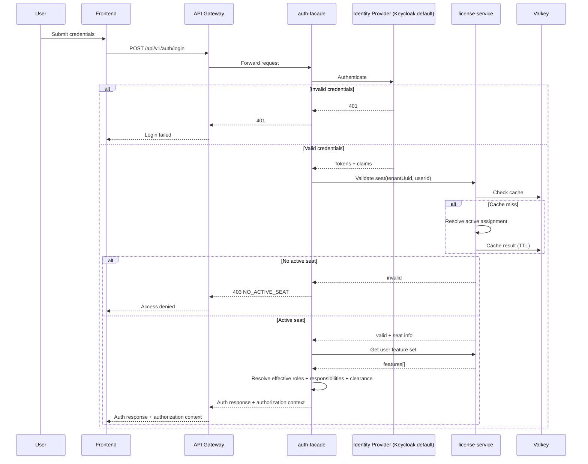

> **Note:** auth-facade does NOT call user-service. The only Feign client in auth-facade is
> `LicenseServiceClient` (`backend/auth-facade/src/main/java/com/ems/auth/client/LicenseServiceClient.java`).
> Session/user state is managed via Keycloak tokens and Neo4j graph, not via user-service REST calls.

Authorization context payload contract:

- `roles`: effective roles after inheritance.
- `responsibilities`: policy keys resolved by backend policy mapping.
- `features`: license-validated feature list.
- `clearanceLevel`: user data-classification clearance for this tenant context.
- `policyVersion`: policy package version returned by backend.
- `uiVisibility`: frontend rendering hints derived from policy; backend remains authoritative.

## 6.2 Token Refresh

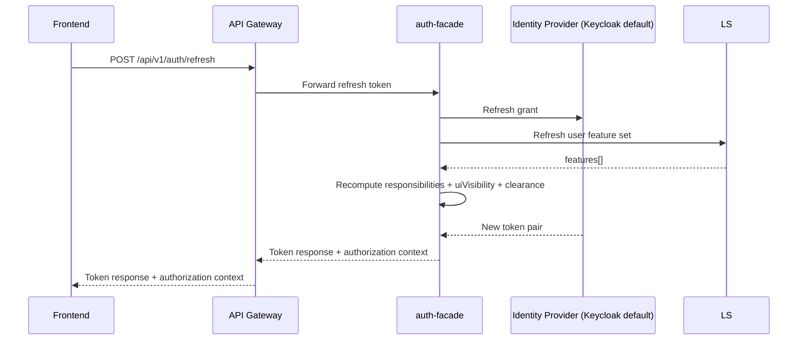

## 6.3 Tenant-Scoped Data Query [IMPLEMENTED]

### Domain Services (PostgreSQL / Spring Data JPA)

All active domain services (tenant-service, user-service, license-service, notification-service,
audit-service, ai-service) use PostgreSQL with Spring Data JPA.
Tenant isolation is enforced via `tenant_id` column filtering.

**Evidence:** `backend/tenant-service/src/main/java/com/ems/tenant/repository/TenantRepository.java`
extends `JpaRepository`; entity `TenantEntity` uses `@Entity` / `@Table(name = "tenants")`.

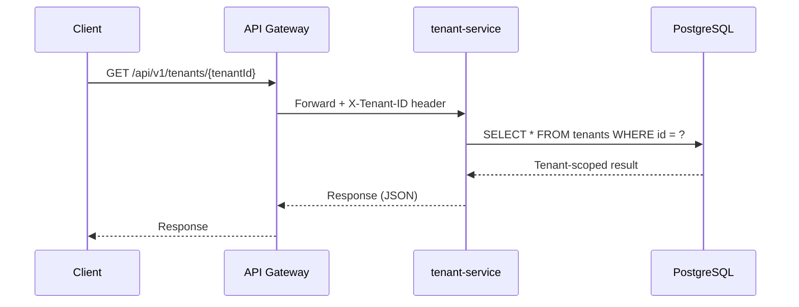

### auth-facade (Neo4j / Spring Data Neo4j)

Only auth-facade uses Neo4j for its authentication graph (providers, roles, groups, tenants).

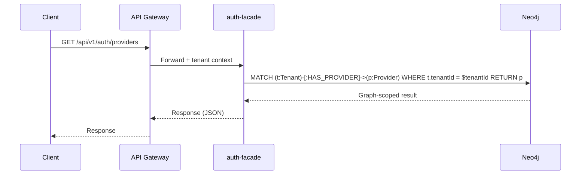

> **Note:** `product-service` and `persona-service` are stub-only (have `pom.xml` but no `src/`
> directory). `process-service` has source code but is intentionally kept out of active runtime
> scope. All three are excluded from current runtime flow scope.

## 6.4 Feature and Classification Gate Check [TARGET STATE]

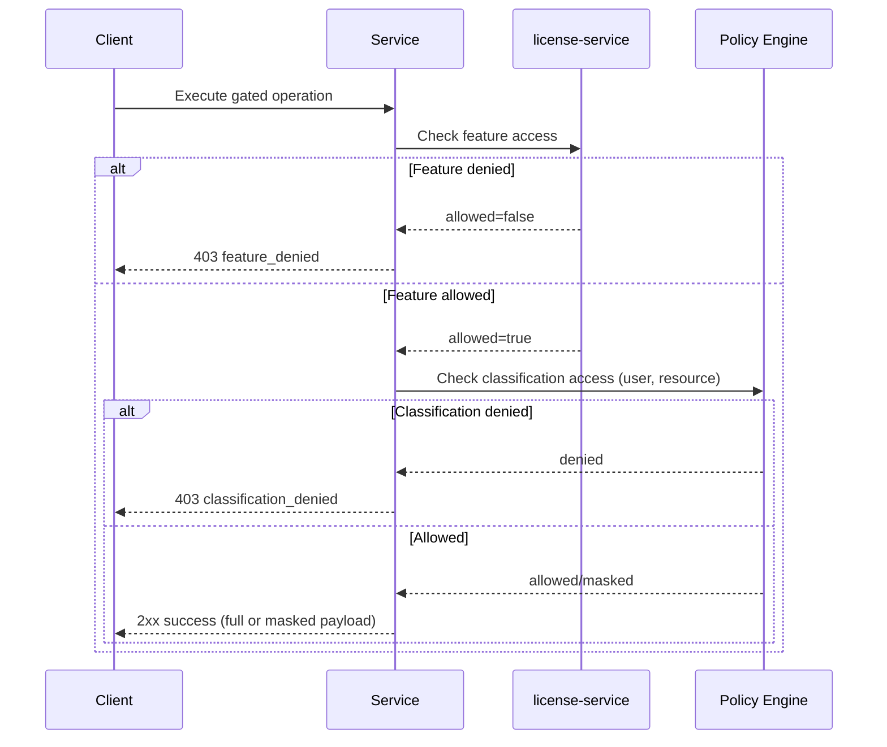

## 6.5 Audit Event Processing

### Current: REST API Ingestion [IMPLEMENTED]

audit-service exposes a REST API (`AuditController`) and persists to PostgreSQL using
JPA (`AuditEventEntity` with `@Entity` / `@Table(name = "audit_events")`).
Schema managed by Flyway.

**Evidence:**
- Controller: `backend/audit-service/src/main/java/com/ems/audit/controller/AuditController.java`
- Entity: `backend/audit-service/src/main/java/com/ems/audit/entity/AuditEventEntity.java` (JPA `@Entity`, PostgreSQL `jsonb` columns)
- Migrations: `backend/audit-service/src/main/resources/db/migration/` (Flyway)

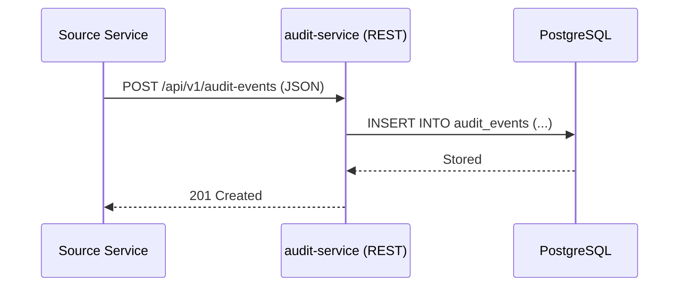

### Future: Kafka Consumer Path [IN-PROGRESS]

Kafka consumers exist in audit-service and notification-service but are **disabled by default**
(`@ConditionalOnProperty(name = "spring.kafka.enabled", havingValue = "true", matchIfMissing = false)`).
No Kafka producers (`KafkaTemplate`) exist anywhere in the codebase. The `spring.kafka.enabled`
property is not set in any `application.yml`.

**Evidence:**
- Consumer: `backend/audit-service/src/main/java/com/ems/audit/listener/AuditEventListener.java` (conditional, disabled)
- Consumer: `backend/notification-service/src/main/java/com/ems/notification/listener/NotificationEventListener.java` (conditional, disabled)
- Producers: None found (zero `KafkaTemplate` usage in any service)

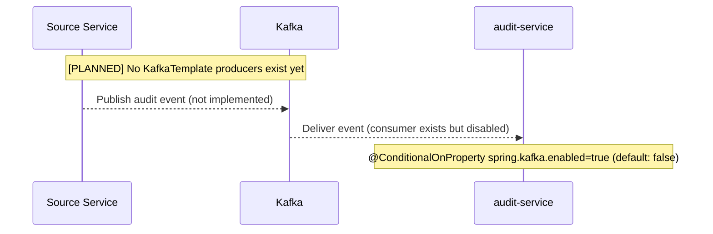

## 6.6 Cache Read/Write Pattern [IMPLEMENTED]

Single-tier Valkey cache (see [ADR-005](../adr/ADR-005-valkey-caching.md)).
Caffeine (L1 in-process cache) is **not present** in the codebase -- no dependency, no configuration.

Services use Spring `@Cacheable` / `@CacheEvict` annotations backed by Valkey (via Spring Data Redis).
The backing data store depends on the service: PostgreSQL for domain services, Neo4j for auth-facade.

**Evidence:**
- auth-facade cache config: `backend/auth-facade/src/main/java/com/ems/auth/config/CacheConfig.java`
- license-service cache config: `backend/license-service/src/main/java/com/ems/license/config/RedisConfig.java`
- `@Cacheable` usage: `GraphRoleService.java` (auth-facade)
- Dormant module note: `process-service` contains cache annotations, but the module is out of active runtime scope.
- `@CacheEvict` usage: `Neo4jProviderResolver.java` (auth-facade)
- No `caffeine`, `CaffeineCache`, or `com.github.benmanes` found in any `pom.xml` or source file

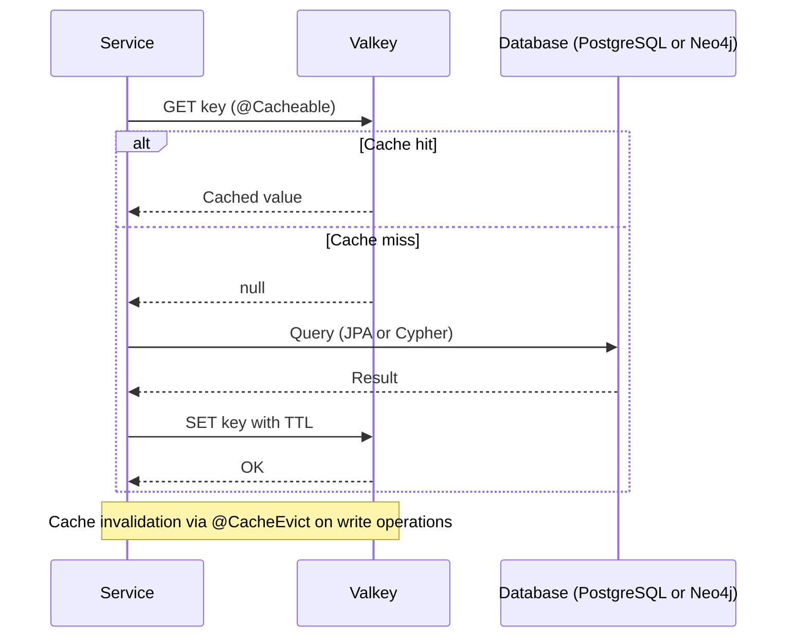

## 6.7 Tenant Creation and Provisioning [TARGET STATE]

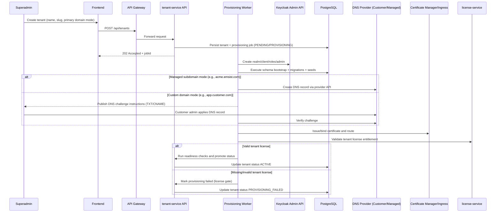

Failure path contract:

- Any failed phase sets tenant to `PROVISIONING_FAILED` with step-specific error details.
- Retry resumes from last successful checkpoint; previously completed phases are not repeated unless explicitly requested.
- Each phase retry uses idempotency key `{tenantUuid}:{jobId}:{phase}` with bounded retry budget.
- Terminal phase failure triggers phase-specific compensation before final failure state commit.

## 6.8 Session Lifecycle (End-to-End) [PARTIALLY IMPLEMENTED]

This section documents the full session lifecycle from login through logout, covering token issuance, refresh, blacklisting, and session termination.

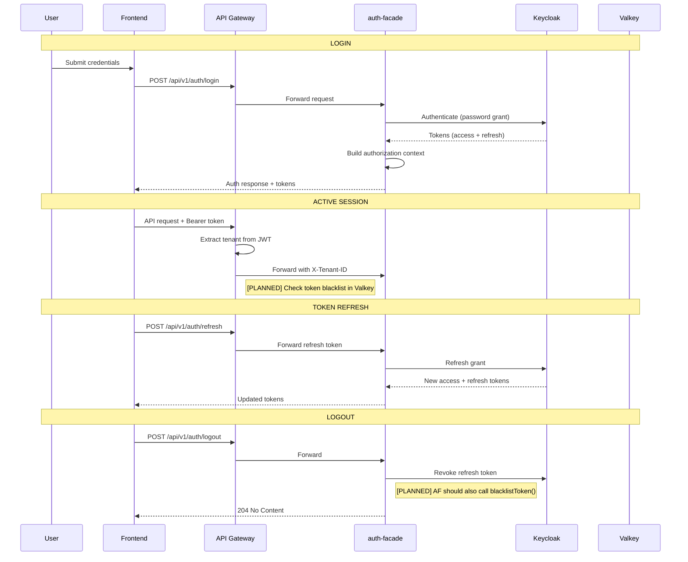

### Implementation Status

| Step | Status | Evidence |
|------|--------|----------|
| Login flow (auth-facade to Keycloak authenticate, return tokens) | [IMPLEMENTED] | `backend/auth-facade/src/main/java/com/ems/auth/service/AuthServiceImpl.java` line 41 (`login()` method calls `identityProvider.authenticate()`) |
| Token refresh (auth-facade to Keycloak refresh grant) | [IMPLEMENTED] | `backend/auth-facade/src/main/java/com/ems/auth/service/AuthServiceImpl.java` line 114 (`refreshToken()` calls `identityProvider.refreshToken()`) |
| Logout (revoke refresh token in Keycloak) | [IMPLEMENTED] | `backend/auth-facade/src/main/java/com/ems/auth/service/AuthServiceImpl.java` line 122 (`logout()` calls `identityProvider.logout()`) |
| Token blacklist mechanism (Valkey SET with TTL) | [IMPLEMENTED] | `backend/auth-facade/src/main/java/com/ems/auth/service/TokenServiceImpl.java` line 91 (`blacklistToken()` stores `auth:blacklist:{jti}` in Valkey) |
| Token blacklist check (isTokenBlacklisted) | [IMPLEMENTED] | `backend/auth-facade/src/main/java/com/ems/auth/service/TokenServiceImpl.java` line 87 (`isTokenBlacklisted()` checks Valkey for key existence) |
| Logout calling blacklistToken | [PLANNED] | The `logout()` method in `AuthServiceImpl` does NOT call `tokenService.blacklistToken()`. It only revokes the refresh token in Keycloak. Access token blacklisting on logout is not wired. |
| API gateway blacklist check | [PLANNED] | The API gateway (`TenantContextFilter`) extracts tenant from JWT but does NOT check Valkey for blacklisted JTIs. See ISSUE-INF-020. |
| MFA pending flow (Valkey `auth:mfa:pending:{hash}` with 5min TTL) | [IN-PROGRESS] | MFA token storage exists in `AuthServiceImpl.storePendingTokens()` (line 175), uses `redisTemplate.opsForValue().set()` with 5-minute TTL. MFA verification flow exists but MFA provider integration is partial. |
| Concurrent session limits per user | [PLANNED] | No implementation exists. |
| Inactivity timeout enforcement | [PLANNED] | No implementation exists. Frontend and backend have no idle-session detection. |

## 6.9 Service-to-Service Authentication [PLANNED]

Currently, backend services communicate over the Docker network without mutual authentication. The API gateway forwards requests to downstream services based on routing rules, but downstream services do not validate JWT tokens or verify the caller's identity.

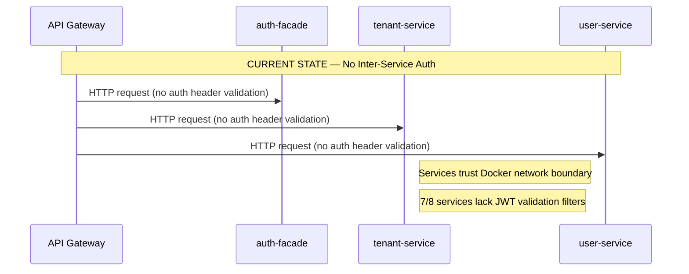

### Current State Evidence

- Only auth-facade has a `JwtValidationFilter` (`backend/auth-facade/src/main/java/com/ems/auth/filter/JwtValidationFilter.java`), but it validates user-facing JWTs, not service-to-service calls.
- The remaining 7 services (tenant-service, user-service, license-service, notification-service, audit-service, ai-service, process-service) have no JWT validation filter. Any request reaching them on the Docker network is trusted implicitly.
- No mTLS, service mesh, or API key mechanism exists between services.

### Future Options [PLANNED]

| Option | Description | Complexity | Suitability |
|--------|-------------|------------|-------------|
| JWT propagation | Gateway forwards user JWT; downstream services validate it | Low | Good for Phase 1 (Docker Compose) |
| mTLS | Mutual TLS certificates between all services | Medium | Good for Kubernetes with cert-manager |
| Service mesh (Istio/Linkerd) | Sidecar proxies handle mutual auth transparently | High | Best for Phase 2+ (Kubernetes) |

Reference: ISSUE-INF-009 (7/8 services lack JWT validation)

---

**Previous Section:** [Building Blocks](./05-building-blocks.md)
**Next Section:** [Deployment View](./07-deployment-view.md)
