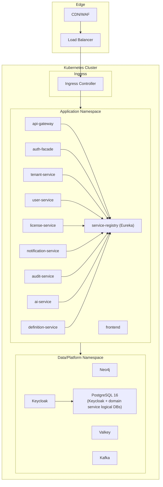
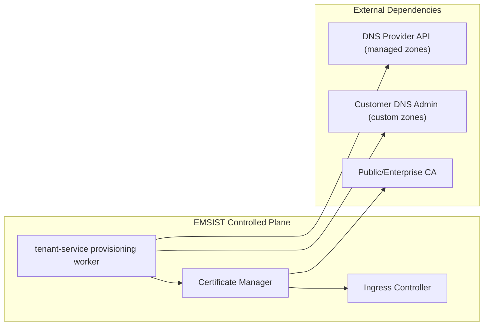
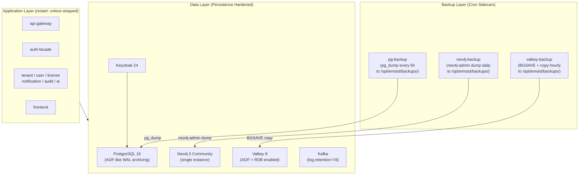
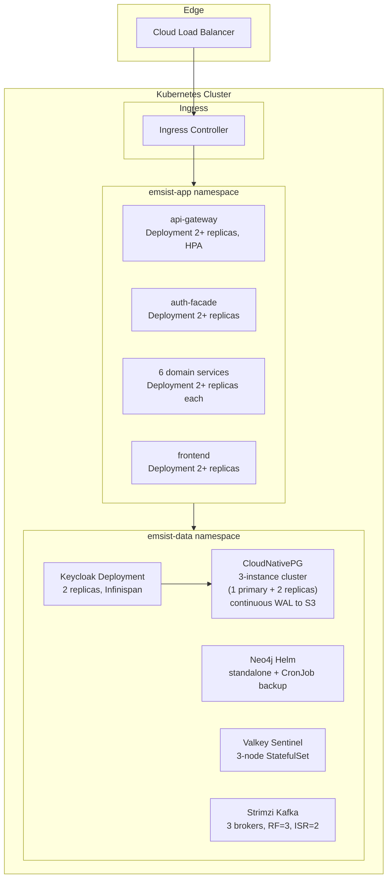
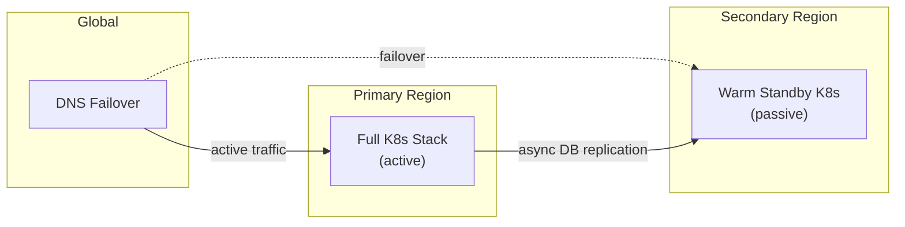
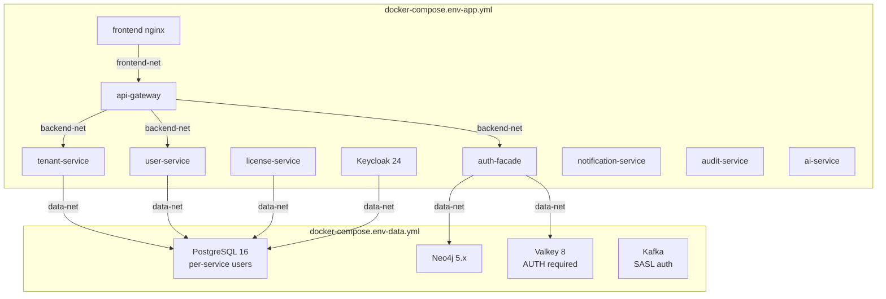
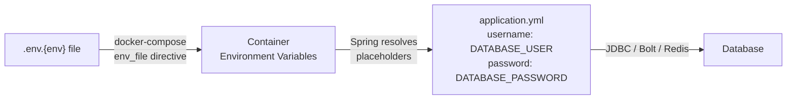

# 7. Deployment View

## 7.1 Deployment Goals

- Deploy services independently with predictable runtime behavior.
- Keep stateful components explicit and operationally isolated.
- Maintain environment parity across local, staging, and production.

## 7.2 Target Topology

## 7.3 Environment Matrix

| Environment | Purpose | Runtime | Notes |
|-------------|---------|---------|-------|
| Development | Local development/debugging | Docker Compose | Single-instance defaults |
| Staging | Pre-production validation | Kubernetes | Production-like settings |
| Production | Live system | Kubernetes | HA + autoscaling |

### Component Baseline by Environment

| Component | Development | Staging | Production |
|-----------|-------------|---------|------------|
| Neo4j | Container | Managed/self-hosted cluster | Managed/self-hosted cluster |
| Valkey | Container | Cluster | Cluster |
| Kafka | Container | Cluster | Cluster |
| Service Registry (Eureka) | Container | Deployment | Deployment |
| Keycloak | Container (default) | Default provider | Default provider |
| PostgreSQL (Keycloak + domain services) | Container | Managed | Managed HA |

## 7.4 Workload Types

| Workload | Kubernetes Type |
|----------|------------------|
| API and business services | Deployment |
| Neo4j / Valkey / Kafka / Keycloak PostgreSQL | Stateful workloads |
| Configuration/secrets | ConfigMap + Secret |

## 7.5 Scaling and Resilience

- Stateless services scale horizontally via HPA.
- Readiness/liveness probes are based on actuator health endpoints.
- Service-to-service traffic remains internal through `ClusterIP` services.
- Production rollout is gated by staging validation.

## 7.6 Development Compose Inventory

| Service | Default Port |
|---------|--------------|
| frontend | 4200 |
| api-gateway | 8080 |
| auth-facade | 8081 |
| tenant-service | 8082 |
| user-service | 8083 |
| license-service | 8085 |
| notification-service | 8086 |
| audit-service | 8087 |
| ai-service | 8088 |
| definition-service | 8090 |
| service-registry (eureka) | 8761 |
| keycloak | 8180 |
| neo4j | 7687 / 7474 |
| valkey | 6379 |
| kafka | 9092 |
| postgres (keycloak + domain services logical DBs) | 5432 |

Runtime scope seal (2026-03-01):

- `product-service`, `process-service`, and `persona-service` are not part of the active deployment inventory.
- They remain build modules only and are intentionally excluded from Compose/Kubernetes topology.

## 7.7 Domain and TLS Provisioning Boundary [TARGET STATE]

Boundary rules:

- Managed domain (`*.emsist.com`): EMSIST automates DNS + TLS end-to-end.
- Custom domain (`app.customer.com`): customer owns DNS changes; EMSIST verifies ownership and completes TLS/ingress binding.
- Non-master tenant status remains non-active until DNS verification, TLS activation, and tenant license validation complete.

## 7.8 High Availability and Resilience [PLANNED]

Reference: [ADR-018](../adr/ADR-018-high-availability-multi-tier.md)

### 7.8.1 Current State Assessment [IMPLEMENTED]

The current deployment topology (both `docker-compose.dev.yml` and `docker-compose.staging.yml`) runs all stateful components as single instances with no replication, no automated backups, and no failover mechanisms.

**Verified single-points-of-failure:**

| Component | Instance Count | Replication | Automated Backup | Failover |
|-----------|---------------|-------------|-------------------|----------|
| PostgreSQL 16 (pgvector) | 1 | None | None | None |
| Neo4j 5 Community | 1 | None | None | None |
| Valkey 8 | 1 | None | None | None |
| Kafka (Confluent 7.6) | 1 broker | replication.factor=1 | None | None |
| Keycloak 24 | 1 | None | Data in PostgreSQL | None |
| Application services (8) | 1 each | N/A (stateless) | N/A | Container restart only |

Evidence: `/docker-compose.staging.yml` volumes section (lines 476-479) defines 4 named volumes with no host bind-mount backups.

**Risk:** A single container failure, `docker compose down -v`, or host failure results in permanent data loss.

### 7.8.2 Phase 1: Docker Compose HA with Automated Backups [PLANNED]

Target: Eliminate data loss risk within the existing Docker Compose deployment model.

**Recovery targets (Phase 1):**

| Component | RPO (Recovery Point Objective) | RTO (Recovery Time Objective) |
|-----------|-------------------------------|-------------------------------|
| PostgreSQL | 6 hours | 30 minutes |
| Neo4j | 24 hours | 15 minutes |
| Valkey | ~15 minutes (AOF) | 5 minutes |
| Kafka | N/A (messaging) | Broker restart |

### 7.8.3 Phase 2: Kubernetes with Operator-Managed Databases [PLANNED]

Target: Production-grade orchestration with automated failover and horizontal scaling.

**HA guarantees (Phase 2):**

| Component | Instances | Failover | RPO | RTO |
|-----------|-----------|----------|-----|-----|
| PostgreSQL (CloudNativePG) | 1 primary + 2 replicas | Automatic (operator-managed) | ~0 (streaming replication) | < 30 seconds |
| Neo4j (Community standalone) | 1 + CronJob backup | Manual restore from backup | 1 hour | 15 minutes |
| Valkey (Sentinel) | 3 nodes | Automatic (Sentinel-managed) | ~0 (sync replication) | < 10 seconds |
| Kafka (Strimzi) | 3 brokers | Automatic (ISR failover) | 0 (replicated topics) | < 1 minute |
| Keycloak | 2+ replicas | Load-balanced, shared session via Infinispan | N/A (data in PG) | 0 (other replica serves) |
| Application services | 2+ replicas each | Load-balanced, PodDisruptionBudget | N/A (stateless) | 0 (other replica serves) |

### 7.8.4 Phase 3: Multi-Region Active-Passive [PLANNED]

Target: Geographic redundancy for disaster recovery. Detailed in [ADR-018](../adr/ADR-018-high-availability-multi-tier.md).

| Target | Value |
|--------|-------|
| Cross-region RPO | < 5 minutes |
| Cross-region RTO | < 10 minutes |
| DNS failover | Health-checked, TTL 60s |

### 7.8.5 Phase Roadmap

| Phase | Scope | Timeline | Status |
|-------|-------|----------|--------|
| Phase 1 | Docker Compose backup + persistence hardening | Q1 2026 | [PLANNED] |
| Phase 2 | Kubernetes migration with operator-managed HA | Q2-Q3 2026 | [PLANNED] |
| Phase 3 | Multi-region active-passive DR | Q4 2026+ | [PLANNED] |

## 7.9 Docker Compose Tier Separation [PLANNED]

Reference: [ADR-018](../adr/ADR-018-high-availability-multi-tier.md), ISSUE-INF-001, ISSUE-INF-002, ISSUE-INF-005

The current Docker Compose deployment uses a single flat bridge network where all containers (frontend, backend services, databases, message broker) share the same network segment. The target topology separates containers into three isolated Docker networks with explicit inter-network connectivity.

### Three-Network Topology

| Network | Purpose | Members | Host Access |
|---------|---------|---------|-------------|
| `ems-{env}-data` | Data tier internal | PostgreSQL, Neo4j, Valkey, Kafka | No (internal only) |
| `ems-{env}` | Backend bridge | All backend services + Keycloak + data tier | Debug ports (dev only) |
| `ems-{env}-frontend` | Frontend isolated | frontend + api-gateway only | 4200/24200 |

### Current State

The current deployment (`docker-compose.dev.yml`, `docker-compose.staging.yml`) uses a single network where all containers can communicate with all other containers. The frontend container can reach databases directly. There is no network-level isolation between tiers.

**Status:** [PLANNED] -- No network segmentation exists today. Implementation is part of the infrastructure hardening plan.

## 7.10 Secrets Management [PLANNED]

Reference: [ADR-020](../adr/ADR-020-service-credential-management.md), [ADR-019](../adr/ADR-019-encryption-at-rest.md), ISSUE-INF-004, ISSUE-INF-008

### Current State

All 7 PostgreSQL-backed services authenticate as the shared `postgres` superuser with hardcoded fallback defaults in `application.yml` (e.g., `${DATABASE_USER:postgres}`, `${DATABASE_PASSWORD:postgres}`). Only `keycloak` has a dedicated database user. The `.env.dev` and `.env.staging` files are gitignored but contain plaintext credentials.

Evidence: `/backend/tenant-service/src/main/resources/application.yml` line 10 (`${DATABASE_USER:postgres}`), repeated across all 6 PostgreSQL services. See ADR-020 for the full audit.

### Target Credential Architecture

| Environment | Credential Source | Rotation | Encryption |
|-------------|-------------------|----------|------------|
| Development | `.env.dev` file (gitignored, `chmod 600`) | Manual | Host filesystem encryption (FileVault/LUKS) |
| Staging | `.env.staging` file (gitignored, `chmod 600`, server filesystem) | Manual (quarterly) | Host filesystem encryption + restricted SSH access |
| Production | K8s Secrets (RBAC per ServiceAccount) + optional HashiCorp Vault | Automated (Vault lease TTL) | K8s etcd encryption at rest + Vault seal |

### Credential Flow

Note: In the target state (ADR-020), each service will use per-service environment variable names (`SVC_TENANT_DB_USER`, `SVC_USER_DB_USER`, etc.) rather than the shared `DATABASE_USER` variable. The `application.yml` placeholders will reference service-specific variables with no hardcoded fallback defaults, ensuring fail-fast behavior on missing credentials.

**Status:** [PLANNED] -- Currently all services use the shared `postgres` superuser with hardcoded defaults.

## 7.11 Backup Encryption [PLANNED]

Reference: [ADR-019](../adr/ADR-019-encryption-at-rest.md), [ADR-018](../adr/ADR-018-high-availability-multi-tier.md), ISSUE-INF-016, ISSUE-INF-017

When automated backups are implemented (ADR-018 Phase 1), backup files must be encrypted before storage to prevent data exposure from stolen or leaked backup media.

### Backup Encryption Strategy

| Data Store | Backup Method | Encryption | Target Storage |
|------------|---------------|------------|----------------|
| PostgreSQL | `pg_dump` every 6 hours | `gpg --encrypt` with backup-specific GPG key | `/opt/emsist/backups/postgresql/` (host bind-mount) |
| Neo4j | `neo4j-admin database dump` daily | `gpg --encrypt` with backup-specific GPG key | `/opt/emsist/backups/neo4j/` (host bind-mount) |
| Valkey | `BGSAVE` + copy hourly | Host filesystem encryption (volume on LUKS/FileVault partition) | `/opt/emsist/backups/valkey/` (host bind-mount) |
| Offsite (optional) | `rclone sync` daily from host backup dir | Object storage SSE (S3 server-side encryption) or client-side GPG | S3 / MinIO bucket with encryption enabled |

### Current State

No automated backups exist in any Docker Compose file. All data resides solely in Docker named volumes with no offsite copies. See ADR-018 Phase 1 for the backup automation plan.

**Status:** [PLANNED] -- No backup automation or encryption exists today.

## 7.12 Installation Runbook and Startup Gating [IMPLEMENTED]

Operational runbook:

- [CUSTOMER-INSTALL-RUNBOOK.md](../dev/CUSTOMER-INSTALL-RUNBOOK.md)

Runtime startup policy:

- `service-registry (eureka)` has an explicit healthcheck in app-tier Compose. `[IMPLEMENTED]`
- Backend services and API gateway depend on Eureka with `condition: service_healthy`. `[IMPLEMENTED]`
- This enforces registry readiness before service registration/discovery traffic begins.

**Evidence (verified 2026-03-06):** `docker-compose.dev-app.yml` and `docker-compose.staging-app.yml` define the eureka service with `wget -q --spider http://127.0.0.1:8761/actuator/health` healthcheck. All active backend services declare `depends_on: eureka: condition: service_healthy`. Server source: `backend/eureka-server/src/main/java/com/ems/registry/EurekaServerApplication.java` (`@EnableEurekaServer`).

---

**Previous Section:** [Runtime View](./06-runtime-view.md)
**Next Section:** [Crosscutting Concepts](./08-crosscutting.md)
