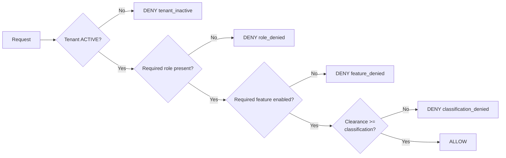
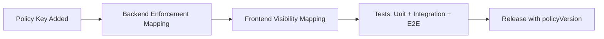
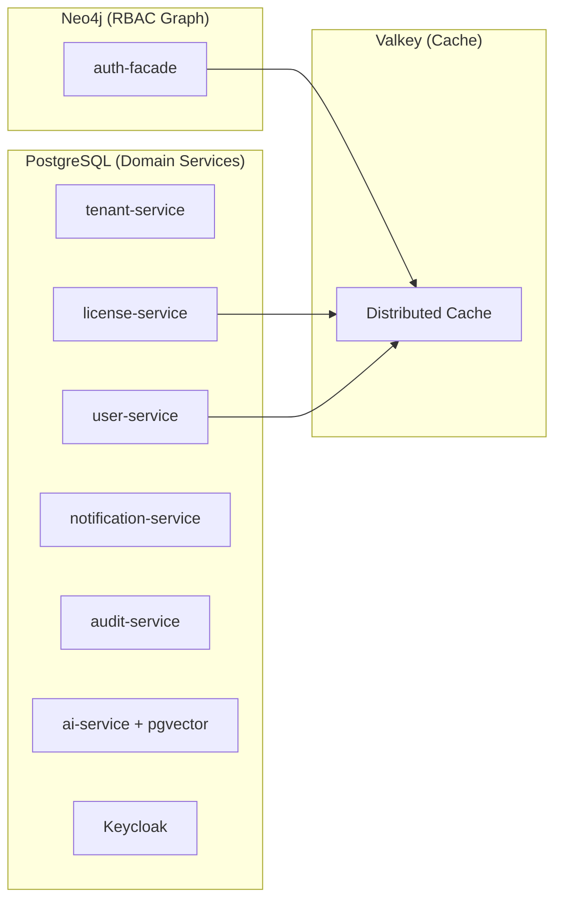

# 8. Crosscutting Concepts

## 8.1 Tenant Isolation

Tenant isolation is enforced through tenant-scoped context propagation and tenant predicate enforcement in all data queries.

| Layer | Mechanism |
|-------|-----------|
| API/Gateway | Tenant context extraction from token/headers |
| Service | Tenant context filters/interceptors |
| Repository (Neo4j) | Tenant-scoped Cypher predicates (auth-facade) |
| Repository (PostgreSQL) | Tenant-scoped JPA queries with `tenant_id` column filtering (all other services) |
| Data model | Tenant-aware entities: `TenantNode` in Neo4j, `tenant_id` FK column in PostgreSQL |

Key rule per [ADR-001](../adr/ADR-001-neo4j-primary.md) (amended): Neo4j for RBAC/identity graph (auth-facade only), PostgreSQL for all relational domain services (6 active services + Keycloak).

## 8.1.1 Tenant Identifier Standard (UUID-First)

Tenant identity in runtime contracts is standardized as UUID.

| Contract Surface | Standard |
|------------------|----------|
| HTTP header | `X-Tenant-ID` carries tenant UUID |
| Path parameter | `/api/.../tenants/{tenantId}` expects UUID |
| Query parameter | Any `tenantId` query param uses UUID |
| Token claim | `tenant_id` should be UUID for stable cross-service matching |
| Persistence | Services may keep internal surrogate IDs, but external contracts remain UUID-first |

Compatibility rule (transition period):

- Services must accept legacy identifiers (`master`, `tenant-master`, slug-style IDs) only as backward-compatible aliases.
- Alias support is temporary and must not be used for new integrations.
- New frontend/backends must emit UUID in all tenant-bound calls.

## 8.2 Authentication and Session Security

Authentication uses a provider-agnostic BFF model with Keycloak as default provider.

| Concept | Standard |
|---------|----------|
| Auth orchestration | `auth-facade` BFF |
| Provider model | `IdentityProvider` strategy abstraction |
| Default provider | Keycloak 24.x |
| Token model | JWT (RS256) |
| Token storage | In-memory/session-safe frontend handling |
| Seat validation | Required during login via `license-service` |

### Provider Strategy Contract

```java
public interface IdentityProvider {
    AuthResponse authenticate(String realm, String email, String password);
    AuthResponse refreshToken(String realm, String refreshToken);
    void logout(String realm, String refreshToken);
    AuthResponse exchangeToken(String realm, String token, String providerHint);
}
```

## 8.3 Authorization

Authorization uses a composite model: **RBAC gates operations, licensing gates features, and data-classification gates data visibility** (per [ADR-014](../adr/ADR-014-rbac-licensing-integration.md) and [ADR-017](../adr/ADR-017-data-classification-access-control.md)).

| Dimension | Source | Scope | Enforcement |
|-----------|--------|-------|-------------|
| **Role (RBAC)** | Neo4j graph via JWT claims | Per-user, per-tenant | Backend: `@PreAuthorize("hasRole('...')")`, Frontend: `authGuard` |
| **Feature (License)** | PostgreSQL via license-service | Per-tenant + per-user overrides | Backend: `@FeatureGate("feature_key")` [PLANNED], Frontend: `featureGuard` [PLANNED] |
| **Data Classification** | Resource metadata + policy mapping | Per-resource, per-field | Backend: policy filter/interceptor [TARGET], Frontend: classification visibility rules [TARGET] |
| **Context** | Request context | Per-request | Tenant boundary + resource ownership checks |

### Enforcement Truth

**The backend is the authoritative enforcement plane.** Frontend feature toggles are UX-only (hide/show modules, disable buttons). They do not provide security. See ADR-014, Section 2b for the full enforcement contract.

### Authorization Context Contract [TARGET STATE]

At login/refresh, backend returns an authorization context used by frontend for deterministic visibility rendering.

```json
{
  "user": {
    "id": "u-123",
    "tenantId": "b3f6f2ae-8899-4fb8-9e57-d0f4f2234a12"
  },
  "authorization": {
    "roles": ["ADMIN", "MANAGER"],
    "responsibilities": ["users.manage", "tenant.settings.read"],
    "features": ["advanced_workflows", "audit_logs"],
    "clearanceLevel": "CONFIDENTIAL",
    "policyVersion": "2026-03-r1",
    "uiVisibility": {
      "nav.admin": true,
      "nav.license": true,
      "page.audit": true,
      "field.user.nationalId": "masked"
    }
  }
}
```

Contract rules:

- `roles` are effective roles after inheritance resolution.
- `responsibilities` are stable policy keys mapped to operations and UI capabilities.
- `features` are license-validated capabilities.
- `clearanceLevel` is the maximum data-classification level this user may view in this tenant context.
- `policyVersion` allows frontend/backend policy drift detection during rollout.
- Backend always re-validates role/feature/classification policy on protected APIs; frontend visibility is advisory only.

### Data Classification Model [TARGET STATE]

Classification lattice (low to high):

- `OPEN`
- `INTERNAL`
- `CONFIDENTIAL`
- `RESTRICTED`

Decision rule:

- A user may access resource data only when `user.clearanceLevel >= resource.classificationLevel` and role/feature policy also passes.
- If operation is allowed but data level exceeds field-level visibility policy, response uses masking/redaction policy instead of full value.

### Policy Evaluation Order [TARGET STATE]

Every protected request must follow the same deterministic evaluation order:

1. Tenant activation gate (`tenant.status == ACTIVE` for non-master tenants).
2. Role resolution (`effectiveRoles = direct + inherited`).
3. Responsibility resolution (`responsibilities` from policy mapping).
4. License feature resolution (`features` from tenant license + seat + overrides).
5. Data-classification resolution (`clearanceLevel` vs resource classification level).
6. Policy decision (`ALLOW` only if all required dimensions pass).



### Responsibility Policy Registry [TARGET STATE]

Responsibilities are platform policy keys that bind backend operations and frontend visibility to the same rule.

| Field | Standard |
|------|----------|
| `policyKey` | Stable key, e.g. `tenant.users.manage` |
| `requiredRoles` | Canonical role names (`SUPER_ADMIN`, `ADMIN`, ...) |
| `requiredFeatures` | License feature keys if applicable |
| `requiredClassification` | Minimum or maximum classification boundary per capability |
| `uiVisibilityKey` | Frontend visibility mapping key (e.g. `nav.admin`) |
| `status` | `planned`, `active`, `deprecated` |
| `owner` | Feature owner/team |

Policy behavior:

- Default deny: missing policy mapping means denied by default.
- No frontend-only policy: each `uiVisibilityKey` must map to backend enforcement.
- Every policy change increments `policyVersion`.

### UI Control Surface for Classification [TARGET STATE]

Frontend control coverage:

- Navigation and page visibility (`visible`, `hidden`).
- Component visibility (`enabled`, `disabled`).
- Field visibility (`full`, `masked`, `redacted`).
- Row-level visibility in grids/tables (filtered by classification policy).

Security rule:

- UI controls improve usability and reduce accidental exposure.
- Backend remains the final enforcement boundary for all data reads/writes.

### Incremental Policy Build Model [TARGET STATE]

Policy evolves per sprint under a strict default-deny model:

- New capability starts as denied by default until explicit policy mapping is added.
- Each policy increment must include:
  - Backend enforcement mapping (annotation/filter/policy key)
  - Frontend visibility mapping (`uiVisibility` key)
  - Test cases (unit + integration + E2E)
- Policy changes are versioned (`policyVersion`) and released with migration notes.



### Master Tenant

The master tenant (identified by `RealmResolver.isMasterTenant()`) receives implicit unlimited features for administration purposes. It **MUST NOT** be used to bypass licensing for business workloads. See ADR-014, Section 2a for hardening boundaries.

## 8.4 Caching Strategy

EMS uses Valkey as a single-tier distributed cache for hot paths.

| Technology | Use | Configuration |
|------------|-----|---------------|
| Valkey 8 | Role cache, seat validation, token blacklist, rate limiting, session state | Spring Data Redis, configurable TTL per cache name |

Cache invalidation is event-driven where possible, with TTL fallback (typically 5 minutes).

Key cache patterns (per [ADR-005](../adr/ADR-005-valkey-caching.md)):

| Cache Key Pattern | Service | TTL | Purpose |
|-------------------|---------|-----|---------|
| `userRoles::{email}` | auth-facade | Configurable | Role resolution cache |
| `seat:validation:{tenantId}:{userId}` | license-service | 5 min | Seat validation result |
| `license:feature:{tenantId}:{userId}:{key}` | license-service | 5 min | Feature gate check |
| `auth:blacklist:{jti}` | auth-facade | Token lifetime | Token revocation |
| `auth:mfa:pending:{hash}` | auth-facade | 5 min | MFA session state |

## 8.5 Error Handling

All public APIs follow RFC 7807-style error responses.

```json
{
  "type": "https://api.ems.com/errors/validation-error",
  "title": "Validation Error",
  "status": 400,
  "detail": "Request validation failed",
  "instance": "/api/v1/tenants"
}
```

## 8.6 Observability

| Area | Standard |
|------|----------|
| Logs | Structured JSON logs with trace/correlation IDs |
| Metrics | Micrometer/Prometheus |
| Dashboards | Grafana |
| Tracing | Distributed tracing across gateway/services |
| Health checks | Liveness/readiness probe endpoints |

## 8.7 Eventing

Kafka is the standard asynchronous integration mechanism. [PLANNED -- no KafkaTemplate usage exists in code yet]

| Event Category | Example Producers | Example Consumers |
|----------------|-------------------|-------------------|
| Audit events | Domain services | audit-service |
| Notification events | Domain services | notification-service |
| Domain sync events | tenant/user/license services | Other interested services |

## 8.8 API and Versioning

- URI-based API versioning (`/api/v1`).
- No breaking changes within a published version.
- Breaking changes require new version + migration guidance.

## 8.9 Data Architecture

Polyglot persistence per [ADR-001](../adr/ADR-001-neo4j-primary.md) (amended):



Each PostgreSQL service has its own logical database (`master_db`, `user_db`, `license_db`, `notification_db`, `audit_db`, `ai_db`, `keycloak_db`) on a single PostgreSQL 16 instance. See arc42/05 Service Matrix for the full mapping.

## 8.10 Documentation and Decision Governance

- Constraints are canonical in [02-constraints.md](./02-constraints.md).
- Decision rationale is canonical in [ADRs](../adr/README.md).
- Arc42 section ownership and anti-duplication rules are canonical in [Documentation Governance](../DOCUMENTATION-GOVERNANCE.md).

## 8.11 Tenant Provisioning Governance [TARGET STATE]

Tenant onboarding is governed as a long-running workflow with explicit status, retry, and audit semantics.

| Concern | Standard |
|--------|----------|
| Workflow trigger | Superadmin request creates provisioning job (`PENDING/PROVISIONING`) |
| Execution model | Asynchronous, idempotent, checkpointed phases |
| Identity bootstrap | Realm/client/roles/admin created through platform service account (not end-user impersonation) |
| Data bootstrap | Schema/migration/seed executed per tenant provisioning policy |
| Domain ownership | Managed domains automated; custom domains require customer DNS proof |
| TLS activation | Certificate + ingress binding required before tenant activation |
| License gate | Non-master tenant requires valid tenant license before activation |
| Failure handling | `PROVISIONING_FAILED` with step-level reason and retry token |
| Auditability | Every phase transition emits immutable audit event |
| Activation gate | Only `ACTIVE` tenants can authenticate and access business APIs; `ACTIVE` requires successful provisioning + license gate |

Security rule:

- Frontend or API caller cannot force `ACTIVE` state directly.
- Activation authority is restricted to provisioning control-plane completion checks, including license validation.

## 8.12 UI Design System and Accessibility

UI consistency and accessibility are enforced through PrimeNG 21 with a ThinkPlus neumorphic preset. A dedicated `emisi-ui` design-system library is planned but does not yet exist.

| Concern | Standard | Status |
|--------|----------|--------|
| Token source of truth | `--tp-*` CSS custom properties from ThinkPlus preset (`frontend/src/app/core/theme/thinkplus-preset.ts`) | [IMPLEMENTED] |
| PrimeNG theming | ThinkPlus neumorphic preset via `providePrimeNG()` + `definePreset()` in app config | [IMPLEMENTED] |
| Advanced CSS governance layer | Shared SCSS layer for `@supports`, input-modality hover rules, orientation tokens, `.sr-only`, and print utilities | [IMPLEMENTED] |
| Accessibility baseline | WCAG 2.2 AAA target (7:1+ contrast ratio in ThinkPlus preset) | [IMPLEMENTED] |
| Device support | Responsive layouts for mobile, tablet, desktop via media queries in component `.scss` files | [IMPLEMENTED] |
| `emisi-ui` library | Planned design-system library at `frontend/projects/emisi-ui` (directory deleted, does not exist) | [PLANNED] |
| `--emisi-*` tokens | Planned migration target token namespace (zero references in codebase) | [PLANNED] |
| Named primitives (`emisi-page-shell`, `emisi-section-header`, `emisi-surface-card`, `emisi-skip-link`, `emisi-keyboard-hints`) | Planned reusable components for the `emisi-ui` library | [PLANNED] |
| `EmisiPrimePreset` | Planned replacement for ThinkPlus preset | [PLANNED] |
| Keyboard discoverability | Skip links + keyboard hints on dense interaction pages | [PLANNED] |

**Evidence (verified 2026-03-01):**
- ThinkPlus preset: `frontend/src/app/core/theme/thinkplus-preset.ts` (exists, 663 bytes)
- `--tp-*` tokens: actively used in `styles.scss`, `shell-layout.component.scss`, `page-frame.component.scss`, `administration.page.ts`, `administration.page.scss`
- Advanced CSS governance layer: `frontend/src/app/core/theme/advanced-css-governance.scss` imported by `frontend/src/styles.scss`
- `--emisi-*` tokens: zero references found in `frontend/src/`
- `frontend/projects/emisi-ui/`: directory does not exist (deleted from repository)

Conformance rules:

- Current: pages and components consume `--tp-*` tokens from the ThinkPlus preset. No standalone color/spacing/typography token sets should be introduced.
- Current: advanced CSS behavior (feature-detection fallbacks, pointer-aware hover, orientation-aware spacing, and assistive-only utility classes) should be implemented through the shared governance layer.
- Target: when `emisi-ui` library is created, global styles will bridge `--tp-*` variables to `--emisi-*` tokens during migration, then remove legacy tokens.
- Accessibility behavior (focus-visible, reduced motion, high contrast, touch targets) should be centralized in design-system styles once the `emisi-ui` library exists.

### 8.12.1 Design QA Handshake [TARGET STATE]

Design quality is governed as a formal handshake between UX/design, frontend engineering, QA, and business owners to prevent implementation drift.

| Phase | Required Activities | Mandatory Evidence | Owner |
|------|----------------------|--------------------|-------|
| Pre-development validation | Prototype usability checks, responsive layout review, design-level accessibility checks, content/copy readiness review | Approved design spec + component usage map + accessibility notes | UX/Design |
| Implementation alignment | Reuse approved design-system components/tokens, map each screen element to governed component inventory | PR links to design references + component mapping checklist | Frontend Dev |
| Post-development parity review | Validate implemented UI against approved design (layout, spacing, states, interactions, copy tone) | Design parity checklist with pass/fail outcomes and deviations | UX/Design + Frontend Dev |
| QA execution | Functional + accessibility + responsive + compatibility + regression checks on implemented screens | QA execution report with environment and test evidence | QA |
| Acceptance and rollout | Internal alpha UAT, then controlled beta UAT before broad release | UAT sign-off record and release go/no-go decision | BA/Product Owner |

Release control rules:

- UI features are not release-ready without completed design parity validation and QA execution evidence.
- Approved deviations must be documented as tracked issues with owner, impact, and target fix release.

## 8.13 Encryption at Rest [PLANNED]

Reference: [ADR-019](../adr/ADR-019-encryption-at-rest.md), ISSUE-INF-016, ISSUE-INF-017, ISSUE-INF-018

Data-at-rest encryption uses a three-tier strategy: volume-level encryption, in-transit TLS, and configuration encryption (Jasypt). No application query changes are required -- encryption is transparent to services.

### Volume-Level Encryption

| Data Store | Docker Compose (Dev/Staging) | Kubernetes (Production) | Status |
|------------|------------------------------|-------------------------|--------|
| PostgreSQL | LUKS/FileVault on host Docker data partition | Encrypted StorageClass PVs (e.g., `gp3` with EBS encryption) | [PLANNED] |
| Neo4j | LUKS/FileVault on host Docker data partition | Encrypted StorageClass PVs | [PLANNED] |
| Valkey | LUKS/FileVault on host Docker data partition | Encrypted StorageClass PVs | [PLANNED] |
| Kafka | LUKS/FileVault on host Docker data partition | Encrypted StorageClass PVs (Strimzi JBOD) | [PLANNED] |

### Configuration Encryption (Jasypt)

| Service | Sensitive Config Values | Jasypt Status |
|---------|------------------------|---------------|
| auth-facade | Keycloak admin password, client secret, Neo4j password, Valkey password | [IMPLEMENTED] -- `JasyptConfig.java` with `PBEWITHHMACSHA512ANDAES_256` |
| ai-service | OpenAI/Anthropic API keys, DB password | [PLANNED] |
| tenant-service | DB password, Keycloak admin password | [PLANNED] |
| user-service | DB password | [PLANNED] |
| license-service | DB password, license signing key | [PLANNED] |
| notification-service | DB password, SMTP credentials | [PLANNED] |
| audit-service | DB password | [PLANNED] |
| process-service | DB password | [PLANNED] |

Evidence (auth-facade Jasypt):
- Config class: `backend/auth-facade/src/main/java/com/ems/auth/config/JasyptConfig.java`
- Algorithm: `PBEWITHHMACSHA512ANDAES_256`, 1000 iterations, `RandomSaltGenerator`, `RandomIvGenerator`
- Configuration: `backend/auth-facade/src/main/resources/application.yml` lines 48-56

## 8.14 In-Transit Encryption [PARTIAL]

Reference: [ADR-019](../adr/ADR-019-encryption-at-rest.md), ISSUE-INF-012, ISSUE-INF-021, ISSUE-INF-022

All connections between application services and data stores should use TLS. Currently, coverage is inconsistent.

| Connection | Protocol | Current Status | Target |
|------------|----------|----------------|--------|
| 6 services to PostgreSQL | JDBC + TLS | [IMPLEMENTED] -- `sslmode=verify-full` in tenant, user, license, notification, audit, process services | Maintain |
| ai-service to PostgreSQL | JDBC | [PLANNED] -- No `sslmode` parameter in JDBC URL | Add `?sslmode=verify-full` |
| auth-facade to Neo4j | Bolt | [PLANNED] -- Currently `bolt://` (plaintext) | `bolt+s://` with TLS policy |
| auth-facade to Valkey | Redis protocol | [PLANNED] -- No TLS configuration | `spring.data.redis.ssl.enabled=true` |
| ai-service to Valkey | Redis protocol | [PLANNED] -- No TLS configuration | `spring.data.redis.ssl.enabled=true` |
| All services to Kafka | Kafka protocol | [PLANNED] -- Currently `PLAINTEXT://` listener | `SASL_SSL://` with JAAS config |
| Keycloak to PostgreSQL | JDBC + TLS | [IMPLEMENTED] -- `sslmode=verify-full` | Maintain |

Evidence:
- PostgreSQL SSL (6 services): e.g., `backend/tenant-service/src/main/resources/application.yml` line 9 (contains `sslmode=verify-full`)
- Missing ai-service SSL: `backend/ai-service/src/main/resources/application.yml` line 9 (no `sslmode` parameter)
- Plaintext Neo4j: `backend/auth-facade/src/main/resources/application.yml` line 28 (`bolt://localhost:7687`)
- No Valkey TLS: `backend/auth-facade/src/main/resources/application.yml` lines 16-20 (no `ssl` property)
- Plaintext Kafka: `docker-compose.dev.yml` Kafka service (`KAFKA_ADVERTISED_LISTENERS: PLAINTEXT://`)

### 8.14.1 Production-Parity Rule [ACCEPTED]

Reference: [ADR-022](../adr/ADR-022-production-parity-security-baseline.md)

EMSIST is a licensed COTS product; environment-level security downgrades are not acceptable as a steady-state operating model.

Enforcement posture:

- Production-parity security baseline is mandatory across full stack design and implementation.
- CI transport-security governance blocks net-new insecure transport entries (`http://`, HTTPS-strict bypass flags) via `scripts/check-transport-security-baseline.sh`.
- Existing insecure entries are explicit technical debt tracked in `scripts/transport-security-allowlist.txt` and must be burned down.

## 8.15 Session TTL Governance [PLANNED]

Reference: ISSUE-INF-019

Session and token lifetimes control how long a user session remains active, how tokens are refreshed, and when sessions are forcefully terminated.

| Parameter | Default | Configurable | Source | Status |
|-----------|---------|-------------|--------|--------|
| Access token lifetime | 5 min | Keycloak realm settings | Keycloak | [IMPLEMENTED] -- Keycloak manages access token expiry |
| Refresh token lifetime | 30 min | Keycloak realm settings | Keycloak | [IMPLEMENTED] -- Keycloak manages refresh token expiry |
| Token blacklist TTL | = access token remaining lifetime | Automatic | auth-facade Valkey SET with TTL | [IMPLEMENTED] -- `TokenServiceImpl.blacklistToken()` (mechanism exists, not wired to logout) |
| MFA pending TTL | 5 min | auth-facade config | Valkey | [IN-PROGRESS] -- `AuthServiceImpl.storePendingTokens()` stores with 5-min TTL |
| Inactivity timeout | 30 min | [PLANNED] | Frontend + Valkey | [PLANNED] -- No idle-session detection exists |
| Max concurrent sessions | Unlimited | [PLANNED] | auth-facade + Valkey | [PLANNED] -- No session counting exists |

### Key Gap

The token blacklist mechanism (`TokenServiceImpl.blacklistToken()` and `isTokenBlacklisted()`) is implemented in auth-facade but has two gaps:

1. **Logout does not blacklist the access token.** The `AuthServiceImpl.logout()` method calls `identityProvider.logout()` (revoking the refresh token in Keycloak) but does NOT call `tokenService.blacklistToken()`. This means a logged-out user's access token remains valid until it naturally expires.

2. **API gateway does not check the blacklist.** The `TenantContextFilter` in the API gateway extracts tenant context from the JWT but does not query Valkey to check if the token's JTI has been blacklisted. Even if auth-facade blacklisted a token, the gateway would still forward requests with that token.

## 8.16 Credential Rotation [PLANNED]

Reference: [ADR-020](../adr/ADR-020-service-credential-management.md)

Credential rotation ensures that compromised or aged passwords are replaced before they can be exploited. The rotation strategy varies by environment maturity.

| Environment | Method | Frequency | Automation | Status |
|-------------|--------|-----------|------------|--------|
| Development | Manual password change in `.env.dev` | On demand | None | [PLANNED] -- Currently uses shared `postgres` superuser |
| Staging | Manual password change in `.env.staging` | Quarterly | None | [PLANNED] -- Currently uses shared `postgres` superuser |
| Production | K8s Secret rotation + optional Vault lease TTL | 90 days | Vault auto-rotation (External Secrets Operator) | [PLANNED] -- No K8s deployment exists yet |

### Current State

All 7 PostgreSQL-backed services use the shared `postgres` superuser with the same hardcoded fallback password (`${DATABASE_PASSWORD:postgres}`). There is no rotation, no per-service isolation, and no fail-fast behavior on missing credentials. The `keycloak` database user is the only dedicated per-service user.

Evidence: See ADR-020 current state audit table for per-service `application.yml` references.

### Target State

Per ADR-020, each service will have a dedicated PostgreSQL user (e.g., `svc_tenant`, `svc_user`, `svc_audit`) with least-privilege grants. Credentials will be externalized to environment-specific `.env` files with no hardcoded fallbacks, ensuring fail-fast on misconfiguration.

---

**Previous Section:** [Deployment View](./07-deployment-view.md)
**Next Section:** [Architecture Decisions](./09-architecture-decisions.md)
