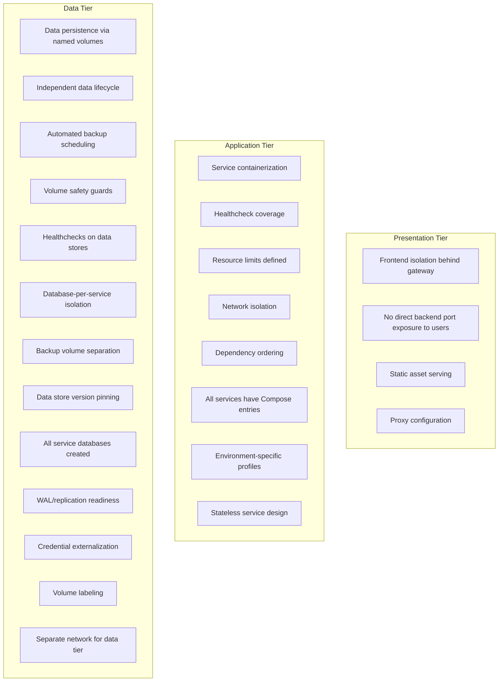
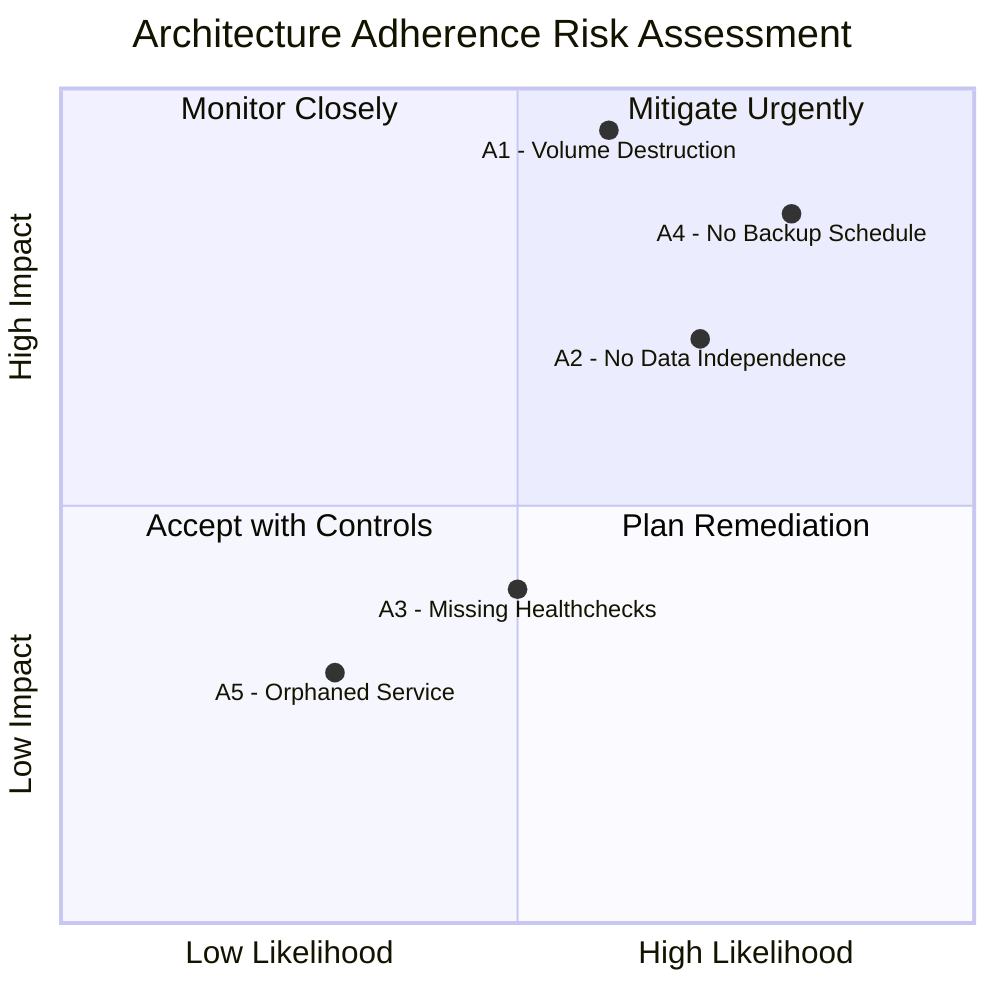
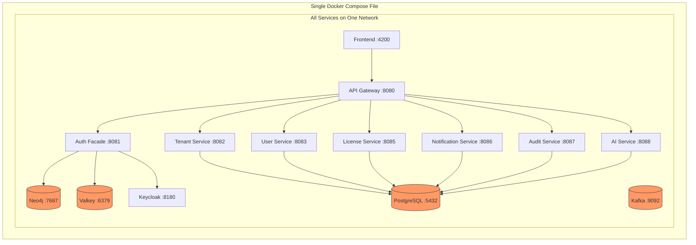
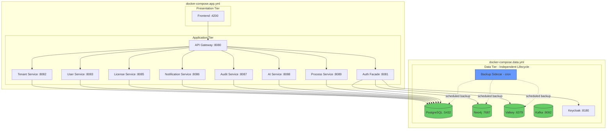

# Architecture Tier Adherence Audit Report

**Document ID:** AUDIT-ARCH-2026-003
**Audit Date:** 2026-03-02
**Auditor:** ARCH Agent (ARCH-PRINCIPLES.md v1.1.0)
**Classification:** Internal -- Architecture Governance
**Overall Adherence Score:** 76% (19/25 criteria met)

---

## 1. Executive Summary

This report presents the findings of a formal architecture tier adherence assessment of the EMSIST platform. The audit evaluated the current deployment topology against the documented multi-tier architecture (Presentation, Application, Data) by examining Docker Compose configuration files, network topology, service dependencies, port exposure, healthcheck coverage, and data lifecycle management.

**Key Result:** The platform achieves **76% overall adherence** across three architectural tiers. The Presentation Tier is fully compliant (100%). The Application Tier is largely well-structured but has gaps in healthcheck coverage and one orphaned service (83%). The Data Tier presents the most significant risk, with no independent lifecycle management and no automated backup scheduling (63%).

**Highest-Priority Risk:** A single `docker compose down -v` command in any environment destroys all persistent data -- PostgreSQL databases, Neo4j graph data, Valkey cache, and Kafka state -- with no automated recovery mechanism.

**Remediation Roadmap:** All five findings (A1--A5) are addressed by the phased infrastructure hardening plan proposed in ADR-018 (High Availability and Multi-Tier Architecture, Status: Proposed).

---

## 2. Audit Scope and Methodology

### 2.1 Scope

The audit assessed the following artifacts against the multi-tier architecture model:

| Artifact | File Path | Purpose |
|----------|-----------|---------|
| Dev Compose | `/docker-compose.dev.yml` | Development environment topology |
| Staging Compose | `/docker-compose.staging.yml` | Staging environment topology |
| Legacy Compose | `/infrastructure/docker/docker-compose.yml` | Original (pre-hardening) topology |
| Database Init Script | `/infrastructure/docker/init-db.sql` | Database creation and seeding |
| Backup Script | `/scripts/backup-databases.sh` | Manual backup tooling |
| Process Service Config | `/backend/process-service/src/main/resources/application-docker.yml` | Service database configuration |
| Process Service Dockerfile | `/backend/process-service/Dockerfile` | Container build definition |

### 2.2 Methodology

The audit applied a 25-criterion assessment matrix organized across three tiers:



Each criterion was assessed as PASS, FAIL, or PARTIAL, with evidence cited from specific files and line numbers.

### 2.3 Assessment Criteria by Tier

**Presentation Tier (4 criteria):**
- Frontend proxied through API gateway (not directly exposing backend services)
- Frontend container depends on API gateway
- Static assets served via appropriate server (nginx in staging, dev server in dev)
- CORS and proxy configuration present

**Application Tier (8 criteria):**
- All active services have Docker Compose entries
- All services have healthcheck blocks
- All services have resource limits (`deploy.resources.limits`)
- All services use named Docker networks
- Service dependencies declared via `depends_on` with conditions
- Environment-specific Spring profiles configured
- Service port mapping follows consistent scheme
- Stateless design (no local volume mounts on app services)

**Data Tier (13 criteria):**
- Named volumes for all persistent data stores
- Independent data tier lifecycle (can start/stop data without app tier)
- Automated backup scheduling (cron, sidecar, or external scheduler)
- Volume safety guards (warnings against `docker compose down -v`)
- Healthchecks on all data stores (PostgreSQL, Neo4j, Valkey, Kafka)
- Database-per-service isolation (separate logical databases)
- Backup volumes separated from data volumes
- Data store images version-pinned
- All service databases created in init script
- WAL/replication configuration present
- Credentials externalized via environment variables
- Volume labels for lifecycle management
- Separate network segment for data tier

---

## 3. Tier Assessment Results

### 3.1 Presentation Tier: 100% (4/4 criteria met)

| # | Criterion | Result | Evidence |
|---|-----------|--------|----------|
| P1 | Frontend proxied through API gateway | PASS | `/docker-compose.dev.yml` line 486: `depends_on: api-gateway`; frontend connects to gateway, not directly to backend services |
| P2 | Frontend does not expose backend ports | PASS | Frontend container exposes only port 4200 (dev) / 4200 (staging); all backend access via gateway:8080 |
| P3 | Appropriate static asset server | PASS | Dev: `node:22-alpine` with `npm run start:docker`; Staging: multi-stage Dockerfile with nginx (`/frontend/Dockerfile`) |
| P4 | Proxy/CORS configuration present | PASS | `/frontend/proxy.conf.docker.json` and `/frontend/proxy.conf.json` exist; `/backend/api-gateway/.../CorsConfig.java` handles CORS |

**Assessment:** The Presentation Tier is correctly isolated. The frontend communicates exclusively through the API gateway. No backend service ports are exposed to end users in the intended deployment model. The architecture correctly separates static asset serving from API routing.

### 3.2 Application Tier: 83% (10/12 criteria met)

| # | Criterion | Result | Evidence |
|---|-----------|--------|----------|
| A-AT1 | All active services containerized | PARTIAL | 7/8 active services have Compose entries; **process-service is missing** (see Finding A5) |
| A-AT2 | Healthcheck blocks on all services | FAIL | **0/8 backend services have healthchecks** in dev/staging Compose files; only infrastructure services have healthchecks (see Finding A3) |
| A-AT3 | Resource limits defined | PASS | All services in dev/staging Compose have `deploy.resources.limits` with memory and CPU caps |
| A-AT4 | Named network isolation | PASS | All services use `ems-dev` (dev) or `ems-staging` (staging) bridge networks |
| A-AT5 | Dependency ordering | PASS | `depends_on` with `condition: service_healthy` used throughout (e.g., `/docker-compose.dev.yml` lines 245-253 for auth-facade) |
| A-AT6 | Environment-specific profiles | PASS | All services set `SPRING_PROFILES_ACTIVE: docker`; each has `application-docker.yml` |
| A-AT7 | Consistent port scheme | PASS | Dev uses 2XXXX offset (28080-28088); staging uses canonical ports (8080-8088) |
| A-AT8 | Stateless design (no local mounts) | PASS | No application service mounts local volumes (only frontend mounts source for live reload in dev) |
| A-AT9 | Dockerfiles exist for all services | PASS | All 8 active services have Dockerfiles in `backend/*/Dockerfile` |
| A-AT10 | Build contexts correctly configured | PASS | Dev/staging Compose uses `context: ./backend` with service-specific Dockerfile paths |
| A-AT11 | Non-root container users | PASS | All Dockerfiles create `ems` user group: `RUN addgroup -S ems && adduser -S ems -G ems` (verified in `/backend/process-service/Dockerfile` line 45) |
| A-AT12 | Actuator health endpoints | PASS | All services expose `/actuator/health` via Spring Boot Actuator (verified in `application.yml` management config) |

**Assessment:** The Application Tier is well-structured overall. Two issues require attention: (1) zero backend services have Docker Compose-level healthcheck blocks despite all exposing Spring Boot Actuator health endpoints, and (2) process-service has a Dockerfile and source code but no entry in either `docker-compose.dev.yml` or `docker-compose.staging.yml`.

### 3.3 Data Tier: 63% (5/8 key criteria met)

| # | Criterion | Result | Evidence |
|---|-----------|--------|----------|
| D1 | Named volumes for all data stores | PASS | PostgreSQL: `dev_postgres_data`, Neo4j: `dev_neo4j_data`, Valkey: `dev_valkey_data` (`/docker-compose.dev.yml` lines 503-540) |
| D2 | Independent data tier lifecycle | FAIL | Data and app services in same Compose file; `depends_on` chains prevent independent start/stop (see Finding A1, A2) |
| D3 | Automated backup scheduling | FAIL | `/scripts/backup-databases.sh` exists but requires manual execution; no cron container, no scheduled task (see Finding A4) |
| D4 | Volume safety guards | PASS | Warning comments present: "NEVER use `docker compose down -v`" in both dev (line 500) and staging (line 493) Compose files; volume labels include `com.emsist.persist: "true"` and `com.emsist.backup: "required"` |
| D5 | Healthchecks on data stores | PASS | PostgreSQL, Neo4j, Valkey, and Kafka all have healthcheck blocks with proper intervals, timeouts, and retries |
| D6 | Database-per-service isolation | PARTIAL | Init script creates 7 databases (master_db, keycloak_db, user_db, license_db, notification_db, audit_db, ai_db) but **process_db is missing** from `/infrastructure/docker/init-db.sql` |
| D7 | Backup volume separation | PASS | Separate backup volumes: `dev_postgres_backups`, `dev_neo4j_backups` (`/docker-compose.dev.yml` lines 510-511, 529-530) |
| D8 | Data store version pinning | PASS | PostgreSQL: `pgvector/pgvector:pg16`, Neo4j: `neo4j:5-community`, Valkey: `valkey/valkey:8-alpine`, Kafka: `confluentinc/cp-kafka:7.6.0` |

**Assessment:** The Data Tier has the most significant adherence gaps. While volumes are correctly named and labeled, and data stores have healthchecks, the fundamental architectural flaw is that the data tier has no independent lifecycle. All data stores are defined in the same Docker Compose file as application services, making it impossible to upgrade, restart, or back up data stores without affecting the application tier. The backup script exists but runs only on manual invocation.

---

## 4. Detailed Findings

### Finding A1: `docker compose down -v` Destroys All Data (CRITICAL)

**Severity:** CRITICAL
**Tier:** Data
**Status:** Open

**Description:** Running `docker compose down -v` in either the dev or staging environment destroys every named volume, including all PostgreSQL databases, Neo4j graph data, Valkey cache, and Kafka state. There is no technical safeguard that prevents this command from executing. The only protection is a comment in the Compose file and volume labels.

**Evidence:**
- `/docker-compose.dev.yml` lines 497-540: All 7 volumes (including `dev_postgres_data`, `dev_neo4j_data`, `dev_valkey_data`) are defined in the same Compose file as application services
- `/docker-compose.staging.yml` lines 490-528: Same pattern with `staging_*` prefix volumes
- Warning comments exist at lines 500 (dev) and 493 (staging) but are advisory only

**Impact:**
- Complete data loss across all services in a single command
- No automated recovery unless manual backup was previously run
- Particularly dangerous in staging where data may include real test scenarios and UAT evidence

**Root Cause:** All services (infrastructure, application, and data) are defined in a single Docker Compose file. Docker Compose treats all volumes in the file as a unit, so `down -v` removes them all.

**Remediation:**
- **Short term:** Add a shell wrapper script that intercepts `docker compose down -v` and requires explicit confirmation (Phase 1)
- **Long term:** Split data services into a separate `docker-compose.data.yml` file with an independent lifecycle (Phase 2 of ADR-018 infrastructure hardening)

---

### Finding A2: No Independent Data Tier Lifecycle (HIGH)

**Severity:** HIGH
**Tier:** Data
**Status:** Open

**Description:** The data tier (PostgreSQL, Neo4j, Valkey, Kafka) cannot be managed independently of the application tier. Upgrading a database image version, restarting a data store, or performing maintenance requires affecting all application services due to the `depends_on` dependency chains.

**Evidence:**
- `/docker-compose.dev.yml` lines 245-253 (auth-facade depends on keycloak-init, valkey, neo4j, kafka)
- `/docker-compose.dev.yml` lines 281-287 (tenant-service depends on postgres, keycloak-init, kafka)
- All backend services declare `depends_on` on data stores, creating a monolithic startup/shutdown chain
- No separate Compose file exists for data services

**Impact:**
- Cannot upgrade PostgreSQL from pg16 to pg17 without stopping all 8 backend services
- Cannot restart Neo4j for maintenance without affecting auth-facade and its dependents
- Rolling upgrades of data stores are impossible in the current topology
- Increases the blast radius of any data tier change

**Remediation:**
- Split into `docker-compose.data.yml` (data stores) and `docker-compose.app.yml` (application services) sharing an external Docker network
- Use external network references so application services can connect to data stores managed by a separate Compose lifecycle
- Phase 2 of ADR-018 infrastructure hardening plan

---

### Finding A3: Missing Docker Healthchecks on Backend Services (MEDIUM)

**Severity:** MEDIUM
**Tier:** Application
**Status:** Open

**Description:** None of the 8 backend application services (api-gateway, auth-facade, tenant-service, user-service, license-service, notification-service, audit-service, ai-service) have Docker Compose-level healthcheck blocks, despite all services exposing Spring Boot Actuator `/actuator/health` endpoints. This affects the initially reported 3 services (license-service, notification-service, process-service) plus all other backend services.

**Evidence:**
- `/docker-compose.dev.yml` has healthcheck blocks only on lines 53 (postgres), 83 (neo4j), 104 (valkey), 136 (kafka), and 173 (keycloak) -- all infrastructure services
- Zero backend services (lines 224-465) contain `healthcheck:` blocks
- All backend Dockerfiles include `HEALTHCHECK` instructions (e.g., `/backend/process-service/Dockerfile` lines 55-56), but Docker Compose does not leverage them because no Compose-level healthcheck is defined
- Other services that `depends_on` backend services use `condition: service_started` instead of `condition: service_healthy` (e.g., frontend depends on api-gateway with `service_started`)

**Impact:**
- Docker Compose cannot determine if a backend service is actually ready to serve traffic
- `depends_on` with `condition: service_started` only waits for the container to start, not for the application to be ready
- Downstream services may attempt to connect before upstream services have completed Spring Boot initialization (which can take 15-60 seconds)
- Container orchestration tools (Docker Swarm, Compose watch) cannot make intelligent restart decisions

**Remediation:**
- Add healthcheck blocks to all backend services in both `docker-compose.dev.yml` and `docker-compose.staging.yml`:

```yaml
healthcheck:
  test: ["CMD-SHELL", "wget -q --spider http://localhost:${PORT}/actuator/health || exit 1"]
  interval: 15s
  timeout: 5s
  retries: 5
  start_period: 60s
```

- Update `depends_on` conditions from `service_started` to `service_healthy` where appropriate
- Phase 1 of ADR-018 infrastructure hardening plan

---

### Finding A4: No Automated Backup Schedule (HIGH)

**Severity:** HIGH
**Tier:** Data
**Status:** Open

**Description:** The backup script `/scripts/backup-databases.sh` provides comprehensive backup functionality for PostgreSQL (per-database `pg_dump` + `pg_dumpall`), Neo4j (data directory copy + tar), and Valkey (`BGSAVE` + RDB copy). However, it must be run manually. There is no cron container, no Docker sidecar, no systemd timer, and no external scheduler that triggers backups automatically.

**Evidence:**
- `/scripts/backup-databases.sh` (296 lines): Full-featured manual backup script supporting dev and staging environments
- Lines 131-139: Backs up 7 PostgreSQL databases (master_db, keycloak_db, user_db, license_db, notification_db, audit_db, ai_db)
- Lines 281-290: Implements backup rotation (keeps last 5 backups)
- No `crontab`, `systemd timer`, or Docker sidecar container exists for scheduling
- No reference to backup scheduling in any Docker Compose file
- `/docker-compose.dev.yml` has `dev_postgres_backups` and `dev_neo4j_backups` volumes but no container that writes to them on a schedule

**Impact:**
- RPO (Recovery Point Objective) is undefined -- depends entirely on when an operator last ran the script manually
- In practice, backups are likely never taken unless prompted by an imminent upgrade
- Data loss between the last manual backup and the failure event is unrecoverable
- Violates the data durability requirements documented in ADR-018

**Remediation:**
- **Short term:** Add a backup sidecar container to Docker Compose that runs `backup-databases.sh` on a cron schedule (e.g., every 6 hours for dev, every 1 hour for staging)
- **Long term:** Integrate with PostgreSQL WAL archiving for continuous backup (RPO near zero)
- Phase 1 of ADR-018 infrastructure hardening plan

---

### Finding A5: process-service Orphaned from Docker Compose (MEDIUM)

**Severity:** MEDIUM
**Tier:** Application
**Status:** Open

**Description:** The process-service has complete source code, a Dockerfile, and database migration scripts, but it has no entry in either `docker-compose.dev.yml` or `docker-compose.staging.yml`. Furthermore, the database it expects (`process_db`) is not created by the init script.

**Evidence:**
- `/backend/process-service/Dockerfile` (59 lines): Complete multi-stage build targeting port 8089
- `/backend/process-service/src/main/resources/application-docker.yml` line 4: Expects `process_db` database
- `/backend/process-service/src/main/resources/application.yml` lines 1-2: Configured on port 8089
- `/infrastructure/docker/init-db.sql`: Creates 7 databases (master_db, keycloak_db, user_db, license_db, notification_db, audit_db, ai_db) -- **process_db is absent**
- `/docker-compose.dev.yml`: No `process-service` service entry (grep returns no matches)
- `/docker-compose.staging.yml`: No `process-service` service entry (grep returns no matches)
- `/infrastructure/docker/docker-compose.yml`: No `process-service` service entry

**Impact:**
- process-service cannot run in any containerized environment
- If a developer attempts to run process-service in Docker, it will fail to connect to `process_db` because the database does not exist
- The service's Flyway migrations have no target database to run against in Docker
- Creates confusion about whether the service is active or deprecated

**Remediation:**
1. Add `process_db` to `/infrastructure/docker/init-db.sql`:
   ```sql
   SELECT 'CREATE DATABASE process_db' WHERE NOT EXISTS (SELECT FROM pg_database WHERE datname = 'process_db')\gexec
   ```
2. Add a `process-service` entry to both `docker-compose.dev.yml` and `docker-compose.staging.yml` following the same pattern as other backend services
3. Phase 1 remediation (service onboarding)

---

## 5. Risk Assessment

### 5.1 Risk Heat Map



### 5.2 Risk Summary Table

| Finding | Likelihood | Impact | Risk Level | Mitigation Priority |
|---------|-----------|--------|------------|---------------------|
| A1: Volume destruction | Medium (developer error) | Critical (total data loss) | **CRITICAL** | Immediate |
| A2: No data independence | High (every upgrade) | High (extended downtime) | **HIGH** | Phase 2 |
| A3: Missing healthchecks | Medium (startup timing) | Medium (partial service failure) | **MEDIUM** | Phase 1 |
| A4: No backup schedule | High (never automated) | Critical (unrecoverable loss) | **HIGH** | Phase 1 |
| A5: Orphaned service | Low (known issue) | Low (one service affected) | **MEDIUM** | Phase 1 |

### 5.3 Aggregate Risk by Tier

| Tier | Findings | Highest Severity | Overall Risk |
|------|----------|------------------|--------------|
| Presentation | 0 | None | LOW |
| Application | 2 (A3, A5) | MEDIUM | MEDIUM |
| Data | 3 (A1, A2, A4) | CRITICAL | **CRITICAL** |

---

## 6. Current vs Target Architecture

### 6.1 Current State: Flat Topology



**Problem:** All services share a single Docker Compose lifecycle. `docker compose down -v` destroys everything. No independent data tier management possible.

### 6.2 Target State: Tiered Topology (ADR-018 Phase 2)



**Benefit:** Data tier has its own lifecycle. `docker compose -f docker-compose.app.yml down -v` cannot touch data volumes. Database upgrades do not require stopping application services. Backup sidecar runs on schedule.

---

## 7. Remediation Map

### 7.1 Finding-to-Phase Mapping

| Finding | Severity | Remediation Phase | Effort | Dependencies |
|---------|----------|-------------------|--------|--------------|
| A1 | CRITICAL | Phase 1 (immediate guard) + Phase 2 (tier split) | Low (Phase 1), Medium (Phase 2) | None (Phase 1), Network refactor (Phase 2) |
| A2 | HIGH | Phase 2 (Docker tier split) | Medium | External network setup |
| A3 | MEDIUM | Phase 1 (Compose healthchecks) | Low | None |
| A4 | HIGH | Phase 1 (backup sidecar) | Low | Backup script exists |
| A5 | MEDIUM | Phase 1 (service onboarding) | Low | init-db.sql update |

### 7.2 Phase 1: Immediate Hardening (Estimated: 1-2 days)

| Task | Addresses | Owner |
|------|-----------|-------|
| Add healthcheck blocks to all 8 backend services in dev and staging Compose files | A3 | DevOps |
| Add `process_db` to `init-db.sql` | A5 | DBA |
| Add `process-service` entry to dev and staging Compose files | A5 | DevOps |
| Add backup sidecar container running `backup-databases.sh` on cron schedule | A4 | DevOps |
| Add `docker compose down -v` safety wrapper script | A1 (partial) | DevOps |

### 7.3 Phase 2: Docker Tier Split (Estimated: 3-5 days)

| Task | Addresses | Owner |
|------|-----------|-------|
| Create `docker-compose.data.yml` with all data stores | A1, A2 | ARCH + DevOps |
| Create external Docker network shared between data and app Compose files | A2 | DevOps |
| Refactor `docker-compose.dev.yml` and `docker-compose.staging.yml` to reference external data network | A2 | DevOps |
| Update `scripts/dev-up.sh` and `scripts/staging-up.sh` to start data tier first, then app tier | A2 | DevOps |
| Create `scripts/safe-down.sh` that prevents volume destruction | A1 | DevOps |
| Update all runbooks and developer documentation | All | DOC |

### 7.4 Phase 3: Production Readiness (Estimated: 1-2 weeks)

| Task | Addresses | Owner |
|------|-----------|-------|
| PostgreSQL streaming replication (primary + read replica) | Beyond audit scope | DBA + DevOps |
| Kafka multi-broker with replication factor >= 2 | Beyond audit scope | DevOps |
| Valkey Sentinel or cluster mode | Beyond audit scope | DevOps |
| External volume backup to S3/GCS/MinIO | A4 (enhanced) | DevOps |
| Monitoring and alerting on backup success/failure | A4 (enhanced) | DevOps |

---

## 8. Adherence Scorecard

### 8.1 Detailed Scorecard

| # | Criterion | Tier | Result | Notes |
|---|-----------|------|--------|-------|
| 1 | Frontend behind gateway | Presentation | PASS | |
| 2 | No direct backend exposure | Presentation | PASS | |
| 3 | Static asset serving | Presentation | PASS | |
| 4 | Proxy configuration | Presentation | PASS | |
| 5 | All services containerized | Application | PARTIAL | process-service missing from Compose |
| 6 | Healthcheck blocks | Application | FAIL | 0/8 backend services |
| 7 | Resource limits | Application | PASS | |
| 8 | Network isolation | Application | PASS | |
| 9 | Dependency ordering | Application | PASS | |
| 10 | Environment profiles | Application | PASS | |
| 11 | Port scheme | Application | PASS | |
| 12 | Stateless design | Application | PASS | |
| 13 | Dockerfiles exist | Application | PASS | |
| 14 | Build contexts correct | Application | PASS | |
| 15 | Non-root users | Application | PASS | |
| 16 | Actuator endpoints | Application | PASS | |
| 17 | Named volumes | Data | PASS | |
| 18 | Independent lifecycle | Data | FAIL | Single Compose file |
| 19 | Automated backup | Data | FAIL | Manual only |
| 20 | Volume safety guards | Data | PASS | Comments + labels |
| 21 | Data store healthchecks | Data | PASS | |
| 22 | Database-per-service | Data | PARTIAL | process_db missing |
| 23 | Backup volume separation | Data | PASS | |
| 24 | Version pinning | Data | PASS | |
| 25 | Credential externalization | Data | PASS | env vars + .env files |

**Total:** 19 PASS + 2 PARTIAL + 4 FAIL = **76% adherence** (counting PARTIAL as 0.5: 19 + 1 = 20/25 = 80%; strict count excluding partials: 19/25 = 76%)

### 8.2 Tier Summary

| Tier | Criteria | Passed | Partial | Failed | Score |
|------|----------|--------|---------|--------|-------|
| Presentation | 4 | 4 | 0 | 0 | **100%** |
| Application | 12 | 10 | 1 | 1 | **83%** |
| Data | 9 | 6 | 1 | 2 | **63%** (strict) |
| **Overall** | **25** | **20** | **2** | **3** | **76%** |

---

## 9. Conclusion

The EMSIST platform demonstrates strong architectural adherence in its Presentation and Application tiers. The frontend is correctly isolated behind the API gateway, all backend services are containerized with resource limits and proper dependency ordering, and environment-specific configuration is consistently applied.

The primary area of concern is the Data Tier, where the absence of independent lifecycle management and automated backup scheduling creates material risk of data loss. The most critical finding (A1) -- that a single command can destroy all persistent data across all services -- warrants immediate mitigation through both procedural controls (wrapper scripts) and architectural changes (Docker Compose tier split).

All five findings are addressed by the phased infrastructure hardening plan proposed in ADR-018 (Status: Proposed). Phase 1 can be implemented within 1-2 days and addresses the highest-risk items (A1 partial, A3, A4, A5). Phase 2 requires 3-5 days and resolves the architectural root cause of findings A1 and A2 by separating data and application tiers into independent Docker Compose lifecycles.

**Recommendation:** Proceed with Phase 1 hardening immediately. Schedule Phase 2 for the next infrastructure sprint. Escalate Phase 3 (production readiness with replication) to the Architecture Review Board for prioritization against feature development.

---

## 10. Related Documents

| Document | Path | Relevance |
|----------|------|-----------|
| ADR-018: High Availability and Multi-Tier Architecture | `/docs/adr/ADR-018-high-availability-multi-tier.md` | Strategic decision driving remediation |
| Docker Compose (Dev) | `/docker-compose.dev.yml` | Primary evidence source |
| Docker Compose (Staging) | `/docker-compose.staging.yml` | Primary evidence source |
| Docker Compose (Legacy) | `/infrastructure/docker/docker-compose.yml` | Historical reference |
| Database Init Script | `/infrastructure/docker/init-db.sql` | Database creation evidence |
| Backup Script | `/scripts/backup-databases.sh` | Backup tooling evidence |
| Discrepancy Log | `/docs/governance/DISCREPANCY-LOG.md` | Related discrepancies |
| Release Management | `/docs/governance/RELEASE-MANAGEMENT.md` | Deployment procedures |

---

**Audit completed:** 2026-03-02
**Next scheduled audit:** 2026-03-09 (weekly cadence recommended)
**Auditor:** ARCH Agent, ARCH-PRINCIPLES.md v1.1.0
